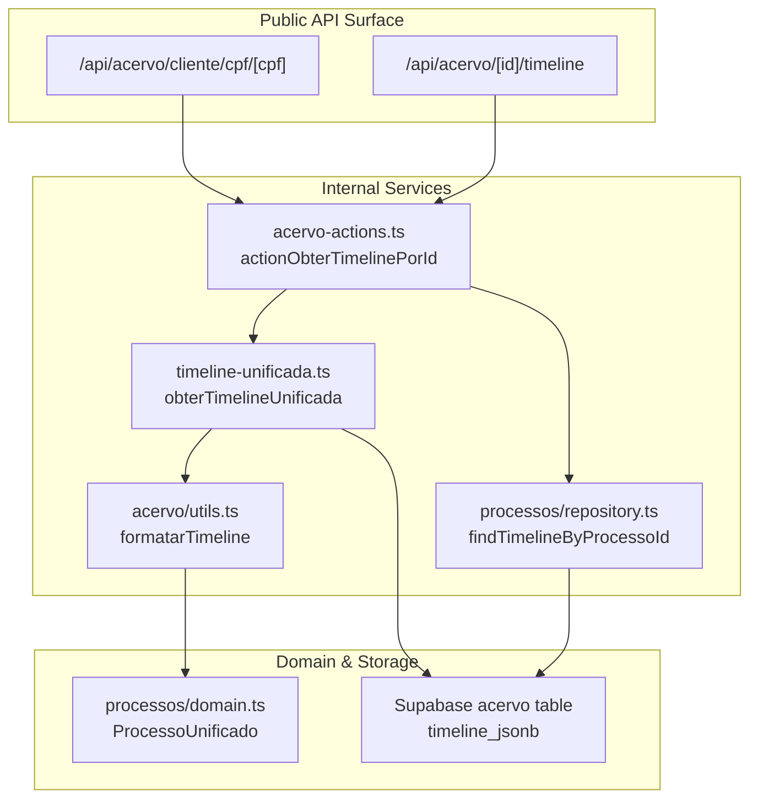
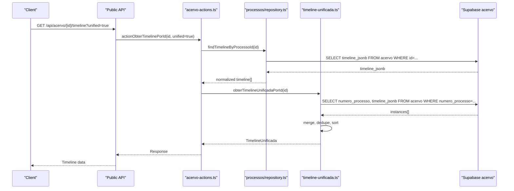
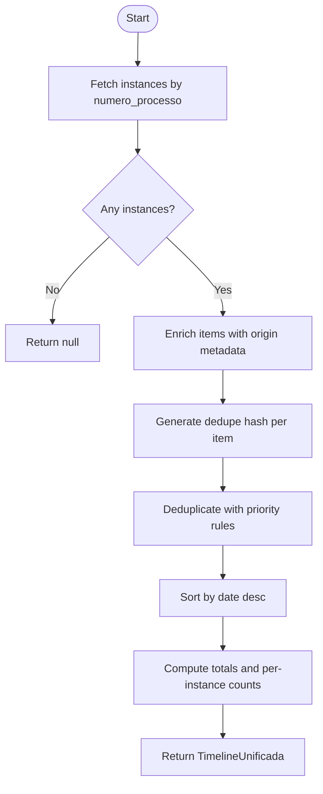
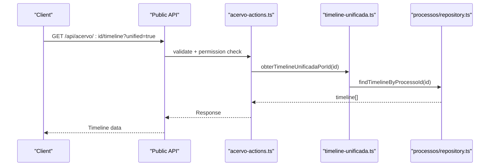
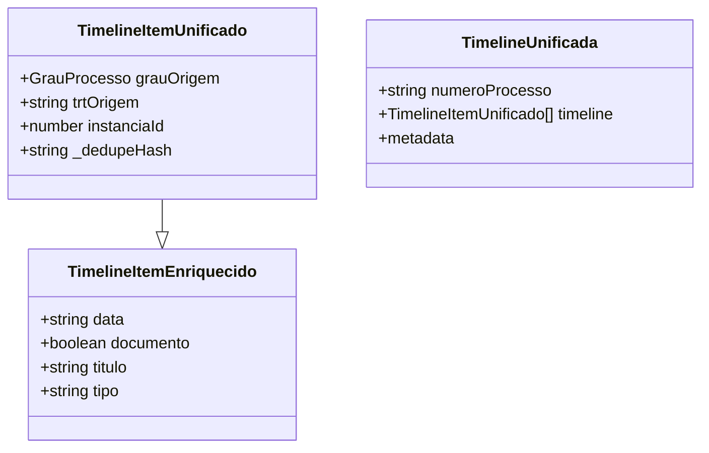
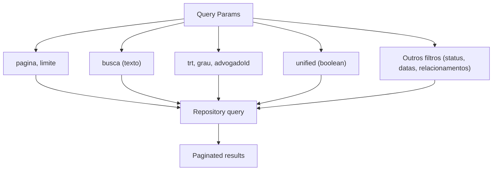
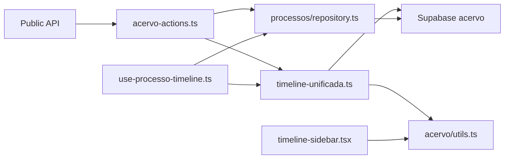

# Legal Process APIs

<cite>
**Referenced Files in This Document**
- [src/app/api/acervo/cliente/cpf/[cpf]/route.ts](file://src/app/api/acervo/cliente/cpf/[cpf]/route.ts)
- [src/app/(authenticated)/acervo/timeline-unificada.ts](file://src/app/(authenticated)/acervo/timeline-unificada.ts)
- [src/app/(authenticated)/acervo/actions/acervo-actions.ts](file://src/app/(authenticated)/acervo/actions/acervo-actions.ts)
- [src/app/(authenticated)/processos/repository.ts](file://src/app/(authenticated)/processos/repository.ts)
- [src/app/(authenticated)/processos/domain.ts](file://src/app/(authenticated)/processos/domain.ts)
- [src/app/(authenticated)/acervo/utils.ts](file://src/app/(authenticated)/acervo/utils.ts)
- [src/app/(authenticated)/processos/hooks/use-processo-timeline.ts](file://src/app/(authenticated)/processos/hooks/use-processo-timeline.ts)
- [src/app/(authenticated)/processos/components/timeline-sidebar.tsx](file://src/app/(authenticated)/processos/components/timeline-sidebar.tsx)
- [src/app/(authenticated)/captura/pje-trt/timeline/index.ts](file://src/app/(authenticated)/captura/pje-trt/timeline/index.ts)
- [src/app/(authenticated)/captura/services/trt/acervo-geral.service.ts](file://src/app/(authenticated)/captura/services/trt/acervo-geral.service.ts)
- [src/app/(authenticated)/captura/services/trt/arquivados.service.ts](file://src/app/(authenticated)/captura/services/trt/arquivados.service.ts)
- [scripts/captura/timeline/test-api-timeline.ts](file://scripts/captura/timeline/test-api-timeline.ts)
- [src/lib/mcp/registries/processos-tools.ts](file://src/lib/mcp/registries/processos-tools.ts)
- [src/app/(authenticated)/processos/RULES.md](file://src/app/(authenticated)/processos/RULES.md)
- [src/app/(ajuda)/ajuda/desenvolvimento/api-referencia/page.tsx](file://src/app/(ajuda)/ajuda/desenvolvimento/api-referencia/page.tsx)
- [src/app/(authenticated)/acervo/service.ts](file://src/app/(authenticated)/acervo/service.ts)
- [src/app/(authenticated)/acervo/__tests__/unit/timeline-unificada.test.ts](file://src/app/(authenticated)/acervo/__tests__/unit/timeline-unificada.test.ts)
- [src/app/(authenticated)/processos/__tests__/unit/processos.repository.test.ts](file://src/app/(authenticated)/processos/__tests__/unit/processos.repository.test.ts)
- [src/app/(authenticated)/processos/components/timeline-loading.tsx](file://src/app/(authenticated)/processos/components/timeline-loading.tsx)
- [src/app/(authenticated)/processos/components/timeline-sidebar.tsx](file://src/app/(authenticated)/processos/components/timeline-sidebar.tsx)
- [src/app/(authenticated)/processos/hooks/use-processo-timeline.ts](file://src/app/(authenticated)/processos/hooks/use-processo-timeline.ts)
- [src/app/(authenticated)/processos/repository.ts](file://src/app/(authenticated)/processos/repository.ts)
- [src/app/(authenticated)/processos/domain.ts](file://src/app/(authenticated)/processos/domain.ts)
- [src/app/(authenticated)/acervo/utils.ts](file://src/app/(authenticated)/acervo/utils.ts)
- [src/app/(authenticated)/captura/pje-trt/timeline/index.ts](file://src/app/(authenticated)/captura/pje-trt/timeline/index.ts)
- [src/app/(authenticated)/captura/services/trt/acervo-geral.service.ts](file://src/app/(authenticated)/captura/services/trt/acervo-geral.service.ts)
- [src/app/(authenticated)/captura/services/trt/arquivados.service.ts](file://src/app/(authenticated)/captura/services/trt/arquivados.service.ts)
- [scripts/captura/timeline/test-api-timeline.ts](file://scripts/captura/timeline/test-api-timeline.ts)
- [src/lib/mcp/registries/processos-tools.ts](file://src/lib/mcp/registries/processos-tools.ts)
- [src/app/(authenticated)/processos/RULES.md](file://src/app/(authenticated)/processos/RULES.md)
- [src/app/(ajuda)/ajuda/desenvolvimento/api-referencia/page.tsx](file://src/app/(ajuda)/ajuda/desenvolvimento/api-referencia/page.tsx)
- [src/app/(authenticated)/acervo/service.ts](file://src/app/(authenticated)/acervo/service.ts)
</cite>

## Table of Contents
1. [Introduction](#introduction)
2. [Project Structure](#project-structure)
3. [Core Components](#core-components)
4. [Architecture Overview](#architecture-overview)
5. [Detailed Component Analysis](#detailed-component-analysis)
6. [Dependency Analysis](#dependency-analysis)
7. [Performance Considerations](#performance-considerations)
8. [Troubleshooting Guide](#troubleshooting-guide)
9. [Conclusion](#conclusion)
10. [Appendices](#appendices)

## Introduction
This document provides comprehensive API documentation for legal process management endpoints. It covers:
- Unified process view APIs
- Multi-instance tracking endpoints
- Timeline/movimentations retrieval
- Status management operations
- Search and filtering capabilities
- Process creation/update/delete workflows
- Audit log access
- Request schemas for process queries, movement submissions, and status updates
- Pagination, sorting, and filtering parameters for large datasets

The APIs described here are implemented in the Next.js app router under src/app/api and are backed by Supabase and internal services. They support both individual instance timelines and unified timelines aggregating multiple instances (first degree, second degree, and superior court).

## Project Structure
The legal process APIs are primarily located under src/app/api and supported by internal services and repositories:
- Unified timeline aggregation: src/app/(authenticated)/acervo/timeline-unificada.ts
- Timeline retrieval actions: src/app/(authenticated)/acervo/actions/acervo-actions.ts
- Process repository and timeline parsing: src/app/(authenticated)/processos/repository.ts
- Domain models for unified processes: src/app/(authenticated)/processos/domain.ts
- Timeline utilities and formatting: src/app/(authenticated)/acervo/utils.ts
- MCP tools for process listing: src/lib/mcp/registries/processos-tools.ts
- Public API reference: src/app/(ajuda)/ajuda/desenvolvimento/api-referencia/page.tsx
- Captura (PJE/TRT) timeline integration: src/app/(authenticated)/captura/pje-trt/timeline/index.ts and related services

**Diagram sources**
- [src/app/api/acervo/cliente/cpf/[cpf]/route.ts](file://src/app/api/acervo/cliente/cpf/[cpf]/route.ts)
- [src/app/(authenticated)/acervo/actions/acervo-actions.ts](file://src/app/(authenticated)/acervo/actions/acervo-actions.ts)
- [src/app/(authenticated)/acervo/timeline-unificada.ts](file://src/app/(authenticated)/acervo/timeline-unificada.ts)
- [src/app/(authenticated)/processos/repository.ts](file://src/app/(authenticated)/processos/repository.ts)
- [src/app/(authenticated)/acervo/utils.ts](file://src/app/(authenticated)/acervo/utils.ts)
- [src/app/(authenticated)/processos/domain.ts](file://src/app/(authenticated)/processos/domain.ts)

**Section sources**
- [src/app/(ajuda)/ajuda/desenvolvimento/api-referencia/page.tsx](file://src/app/(ajuda)/ajuda/desenvolvimento/api-referencia/page.tsx)
- [src/app/api/acervo/cliente/cpf/[cpf]/route.ts](file://src/app/api/acervo/cliente/cpf/[cpf]/route.ts)

## Core Components
- Unified Timeline Service: Aggregates timelines from all instances of a process and applies deduplication and priority rules.
- Timeline Retrieval Actions: Expose endpoints to fetch timelines for a given process instance, optionally unified.
- Process Repository: Parses timeline data stored in JSONB and converts it to normalized movement entries.
- Domain Models: Define unified process views and instance metadata.
- MCP Tools: Provide programmatic access to process listing with filters and pagination.

Key responsibilities:
- Unified timeline: Merge, deduplicate, and sort events across instances.
- Individual timeline: Return raw timeline_jsonb for a single instance.
- Filtering and pagination: Supported via MCP tools and repository-level queries.
- Formatting: Human-friendly presentation and search within timeline items.

**Section sources**
- [src/app/(authenticated)/acervo/timeline-unificada.ts](file://src/app/(authenticated)/acervo/timeline-unificada.ts)
- [src/app/(authenticated)/acervo/actions/acervo-actions.ts](file://src/app/(authenticated)/acervo/actions/acervo-actions.ts)
- [src/app/(authenticated)/processos/repository.ts](file://src/app/(authenticated)/processos/repository.ts)
- [src/app/(authenticated)/processos/domain.ts](file://src/app/(authenticated)/processos/domain.ts)
- [src/lib/mcp/registries/processos-tools.ts](file://src/lib/mcp/registries/processos-tools.ts)

## Architecture Overview
The unified timeline architecture integrates:
- Public API endpoints for client access
- Internal actions orchestrating permissions and data fetching
- Services for timeline aggregation and deduplication
- Supabase-backed persistence of timeline data in JSONB
- Frontend hooks and components for rendering and filtering

**Diagram sources**
- [src/app/api/acervo/cliente/cpf/[cpf]/route.ts](file://src/app/api/acervo/cliente/cpf/[cpf]/route.ts)
- [src/app/(authenticated)/acervo/actions/acervo-actions.ts](file://src/app/(authenticated)/acervo/actions/acervo-actions.ts)
- [src/app/(authenticated)/processos/repository.ts](file://src/app/(authenticated)/processos/repository.ts)
- [src/app/(authenticated)/acervo/timeline-unificada.ts](file://src/app/(authenticated)/acervo/timeline-unificada.ts)

## Detailed Component Analysis

### Unified Process View APIs
- Purpose: Aggregate timelines from all instances of a process (first degree, second degree, superior court) and deduplicate overlapping events.
- Inputs:
  - Process identifier (by ID or number)
  - Optional unified flag to enable aggregation
- Outputs:
  - TimelineUnificada with timeline items, metadata, and per-instance statistics
- Deduplication strategy:
  - Hash-based on date, type, and identifiers
  - Prefer items with storage links (Backblaze/Google Drive)
  - Prefer higher-instance priority (superior > second > first)
- Sorting:
  - Descending by event date

**Diagram sources**
- [src/app/(authenticated)/acervo/timeline-unificada.ts](file://src/app/(authenticated)/acervo/timeline-unificada.ts)

**Section sources**
- [src/app/(authenticated)/acervo/timeline-unificada.ts](file://src/app/(authenticated)/acervo/timeline-unificada.ts)
- [src/app/(authenticated)/acervo/actions/acervo-actions.ts](file://src/app/(authenticated)/acervo/actions/acervo-actions.ts)

### Multi-Instance Tracking Endpoints
- Endpoint: GET /api/acervo/[id]/timeline
- Behavior:
  - Unified mode: Aggregates and deduplicates across instances
  - Non-unified mode: Returns timeline_jsonb for the specific instance
- Permissions: Requires authenticated user with acervo:view permission
- Error handling: Returns appropriate errors for invalid IDs, missing data, or permission failures

**Diagram sources**
- [src/app/api/acervo/cliente/cpf/[cpf]/route.ts](file://src/app/api/acervo/cliente/cpf/[cpf]/route.ts)
- [src/app/(authenticated)/acervo/actions/acervo-actions.ts](file://src/app/(authenticated)/acervo/actions/acervo-actions.ts)
- [src/app/(authenticated)/acervo/timeline-unificada.ts](file://src/app/(authenticated)/acervo/timeline-unificada.ts)
- [src/app/(authenticated)/processos/repository.ts](file://src/app/(authenticated)/processos/repository.ts)

**Section sources**
- [src/app/(authenticated)/acervo/actions/acervo-actions.ts](file://src/app/(authenticated)/acervo/actions/acervo-actions.ts)
- [src/app/(authenticated)/processos/repository.ts](file://src/app/(authenticated)/processos/repository.ts)

### Timeline/Movimentations Retrieval
- Data source: timeline_jsonb stored in the acervo table
- Normalization:
  - Converts JSONB timeline to normalized Movimentacao entries
  - Uses metadata.capturadoEm as createdAt when present
  - Returns empty array if no timeline exists
- Formatting:
  - Sorts from newest to oldest
  - Limits items for display
  - Provides search within timeline items

**Diagram sources**
- [src/app/(authenticated)/acervo/timeline-unificada.ts](file://src/app/(authenticated)/acervo/timeline-unificada.ts)

**Section sources**
- [src/app/(authenticated)/processos/repository.ts](file://src/app/(authenticated)/processos/repository.ts)
- [src/app/(authenticated)/acervo/utils.ts](file://src/app/(authenticated)/acervo/utils.ts)

### Status Management Operations
- Process status is part of the unified process view and instance metadata.
- Status updates can originate from timeline movements or external systems.
- Bidirectional status synchronization is supported for related modules (e.g., tasks, todo), ensuring consistency across systems.

Note: Specific endpoints for updating process status are not exposed in the public API surface documented here. Status changes are typically handled internally via domain services and triggers.

**Section sources**
- [src/app/(authenticated)/processos/domain.ts](file://src/app/(authenticated)/processos/domain.ts)
- [src/lib/event-aggregation/service.ts](file://src/lib/event-aggregation/service.ts)

### Search and Filtering Capabilities
- Public API reference lists:
  - GET /api/acervo: supports pagination and filters (client_id, tribunal_id, busca)
  - GET /api/acervo/[id]: retrieve by ID
  - PATCH /api/acervo/[id]/responsavel: update responsible attorney
  - GET /api/acervo/[id]/timeline: timeline retrieval
  - GET /api/acervo/cliente/cpf/[cpf]: client CPF search (IA agent optimized)
- MCP tools:
  - listar_processos: supports pagination, textual search, TRT, degree, and responsible attorney filters
  - unified flag defaults to true for unified view
- Process rules define available filters (identifiers, status, parties, booleans, dates, relationships)

**Diagram sources**
- [src/lib/mcp/registries/processos-tools.ts](file://src/lib/mcp/registries/processos-tools.ts)
- [src/app/(authenticated)/processos/RULES.md](file://src/app/(authenticated)/processos/RULES.md)

**Section sources**
- [src/app/(ajuda)/ajuda/desenvolvimento/api-referencia/page.tsx](file://src/app/(ajuda)/ajuda/desenvolvimento/api-referencia/page.tsx)
- [src/lib/mcp/registries/processos-tools.ts](file://src/lib/mcp/registries/processos-tools.ts)
- [src/app/(authenticated)/processos/RULES.md](file://src/app/(authenticated)/processos/RULES.md)

### Process Creation/Update/Delete Workflows
- Creation and editing of processes are governed by internal domain services and RLS policies.
- Access rules specify who can create processes and under which conditions (e.g., secret justice).
- Mutations trigger cache revalidation for related endpoints.

Note: The public API surface for CRUD operations on processes is not detailed in the referenced files. Refer to internal domain services and RLS policies for implementation details.

**Section sources**
- [src/app/(authenticated)/processos/RULES.md](file://src/app/(authenticated)/processos/RULES.md)

### Audit Log Access
- Audit logs are maintained for changes to entities and are surfaced via internal services.
- MCP resources provide access to process data for external systems.

**Section sources**
- [src/lib/mcp/resources-registry.ts](file://src/lib/mcp/resources-registry.ts)

## Dependency Analysis
- Public API depends on internal actions for permission checks and orchestration.
- Actions depend on repository functions to parse timeline data from JSONB.
- Unified timeline service depends on Supabase to fetch all instances and enrich items with origin metadata.
- Frontend hooks and components depend on unified timeline metadata for rendering and filtering.

**Diagram sources**
- [src/app/api/acervo/cliente/cpf/[cpf]/route.ts](file://src/app/api/acervo/cliente/cpf/[cpf]/route.ts)
- [src/app/(authenticated)/acervo/actions/acervo-actions.ts](file://src/app/(authenticated)/acervo/actions/acervo-actions.ts)
- [src/app/(authenticated)/processos/repository.ts](file://src/app/(authenticated)/processos/repository.ts)
- [src/app/(authenticated)/acervo/timeline-unificada.ts](file://src/app/(authenticated)/acervo/timeline-unificada.ts)
- [src/app/(authenticated)/acervo/utils.ts](file://src/app/(authenticated)/acervo/utils.ts)
- [src/app/(authenticated)/processos/hooks/use-processo-timeline.ts](file://src/app/(authenticated)/processos/hooks/use-processo-timeline.ts)
- [src/app/(authenticated)/processos/components/timeline-sidebar.tsx](file://src/app/(authenticated)/processos/components/timeline-sidebar.tsx)

**Section sources**
- [src/app/(authenticated)/acervo/actions/acervo-actions.ts](file://src/app/(authenticated)/acervo/actions/acervo-actions.ts)
- [src/app/(authenticated)/processos/repository.ts](file://src/app/(authenticated)/processos/repository.ts)
- [src/app/(authenticated)/acervo/timeline-unificada.ts](file://src/app/(authenticated)/acervo/timeline-unificada.ts)

## Performance Considerations
- Unified timeline deduplication uses hashing and priority rules to minimize redundant items.
- Sorting is performed after deduplication to maintain chronological order.
- Frontend components provide skeleton loaders while capturing timelines to improve perceived performance.
- Tests demonstrate handling of large timelines with thousands of items and deduplication correctness.

Recommendations:
- Use unified=false for lightweight retrieval when aggregation is unnecessary.
- Apply filters early (e.g., TRT, degree) to reduce dataset size.
- Consider caching for frequently accessed timelines.

**Section sources**
- [src/app/(authenticated)/acervo/timeline-unificada.ts](file://src/app/(authenticated)/acervo/timeline-unificada.ts)
- [src/app/(authenticated)/acervo/__tests__/unit/timeline-unificada.test.ts](file://src/app/(authenticated)/acervo/__tests__/unit/timeline-unificada.test.ts)
- [src/app/(authenticated)/processos/components/timeline-loading.tsx](file://src/app/(authenticated)/processos/components/timeline-loading.tsx)

## Troubleshooting Guide
Common issues and resolutions:
- Invalid or missing ID:
  - Ensure the acervo ID is valid and accessible to the authenticated user.
- Permission denied:
  - Verify the user has acervo:view permission.
- Empty timeline:
  - Unified timeline may be empty if no instances exist or timeline is not yet captured.
  - Individual timeline may be empty if timeline_jsonb is null.
- Timeline capture status:
  - Some endpoints may indicate a lazy capture is in progress; retry after a short delay.

Validation and tests:
- Repository tests confirm empty timeline handling and metadata usage.
- Unit tests validate deduplication behavior and priority selection across instances.

**Section sources**
- [src/app/(authenticated)/acervo/actions/acervo-actions.ts](file://src/app/(authenticated)/acervo/actions/acervo-actions.ts)
- [src/app/(authenticated)/processos/repository.ts](file://src/app/(authenticated)/processos/repository.ts)
- [src/app/(authenticated)/acervo/__tests__/unit/timeline-unificada.test.ts](file://src/app/(authenticated)/acervo/__tests__/unit/timeline-unificada.test.ts)
- [src/app/(authenticated)/processos/__tests__/unit/processos.repository.test.ts](file://src/app/(authenticated)/processos/__tests__/unit/processos.repository.test.ts)

## Conclusion
The legal process APIs provide robust mechanisms for retrieving and managing process timelines, supporting both individual instance and unified views. With built-in deduplication, priority rules, and flexible filtering, the system scales to handle complex multi-instance processes. Public endpoints expose essential operations, while internal services and repositories ensure data integrity and performance.

## Appendices

### API Reference Summary
- GET /api/acervo
  - Description: List processes with pagination and filters
  - Auth: Required
  - Params: pagina, limite, cliente_id, tribunal_id, busca
- GET /api/acervo/[id]
  - Description: Retrieve process by ID
  - Auth: Required
- PATCH /api/acervo/[id]/responsavel
  - Description: Update responsible attorney
  - Auth: Required
- GET /api/acervo/[id]/timeline
  - Description: Retrieve timeline (individual or unified)
  - Auth: Required
  - Params: unified (boolean)
- GET /api/acervo/cliente/cpf/[cpf]
  - Description: Process list by client CPF (IA agent optimized)
  - Auth: Bearer or API Key
  - Notes: May trigger lazy timeline capture

**Section sources**
- [src/app/(ajuda)/ajuda/desenvolvimento/api-referencia/page.tsx](file://src/app/(ajuda)/ajuda/desenvolvimento/api-referencia/page.tsx)

### Request Schemas

- Unified Timeline Request
  - Path: GET /api/acervo/[id]/timeline
  - Query:
    - unified: boolean (default: true)
  - Response: TimelineUnificada

- MCP Process Listing Request
  - Tool: listar_processos
  - Body:
    - pagina: number (default: 1)
    - limite: number (min: 1, max: 100)
    - busca: string (optional)
    - trt: string | string[] (optional)
    - grau: enum ("primeiro_grau", "segundo_grau", "tribunal_superior") (optional)
    - advogadoId: number (optional)
    - unified: boolean (default: true)

- Timeline Capture Request (service-to-service)
  - Endpoint: POST /api/captura/trt/timeline
  - Headers:
    - Content-Type: application/json
    - x-service-api-key: string
  - Body: payload for timeline capture
  - Response: success, message, data (statistics)

**Section sources**
- [src/lib/mcp/registries/processos-tools.ts](file://src/lib/mcp/registries/processos-tools.ts)
- [scripts/captura/timeline/test-api-timeline.ts](file://scripts/captura/timeline/test-api-timeline.ts)

### Pagination, Sorting, and Filtering Parameters
- Pagination:
  - pagina: integer (default: 1)
  - limite: integer (min: 1, max: 100)
- Sorting:
  - Unified timeline: descending by event date
  - Individual timeline: repository sorts from newest to oldest
- Filtering:
  - By TRT, degree, responsible attorney, textual search
  - Additional filters include status, dates, and relationships

**Section sources**
- [src/lib/mcp/registries/processos-tools.ts](file://src/lib/mcp/registries/processos-tools.ts)
- [src/app/(authenticated)/acervo/utils.ts](file://src/app/(authenticated)/acervo/utils.ts)
- [src/app/(authenticated)/processos/RULES.md](file://src/app/(authenticated)/processos/RULES.md)

### Captura Integration
- Timeline capture is orchestrated via service-to-service calls to /api/captura/trt/timeline.
- Frontend services trigger capture for processes without timelines.
- Tests validate response structure and timing.

**Section sources**
- [src/app/(authenticated)/acervo/service.ts](file://src/app/(authenticated)/acervo/service.ts)
- [scripts/captura/timeline/test-api-timeline.ts](file://scripts/captura/timeline/test-api-timeline.ts)
- [src/app/(authenticated)/captura/services/trt/acervo-geral.service.ts](file://src/app/(authenticated)/captura/services/trt/acervo-geral.service.ts)
- [src/app/(authenticated)/captura/services/trt/arquivados.service.ts](file://src/app/(authenticated)/captura/services/trt/arquivados.service.ts)