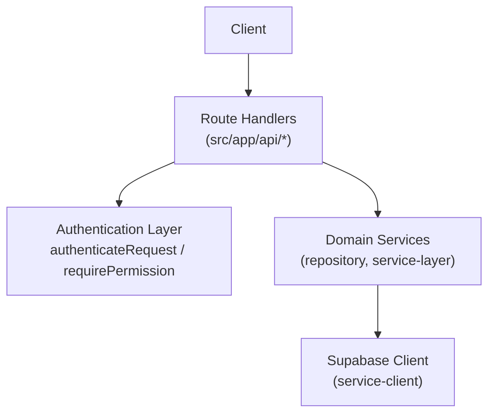
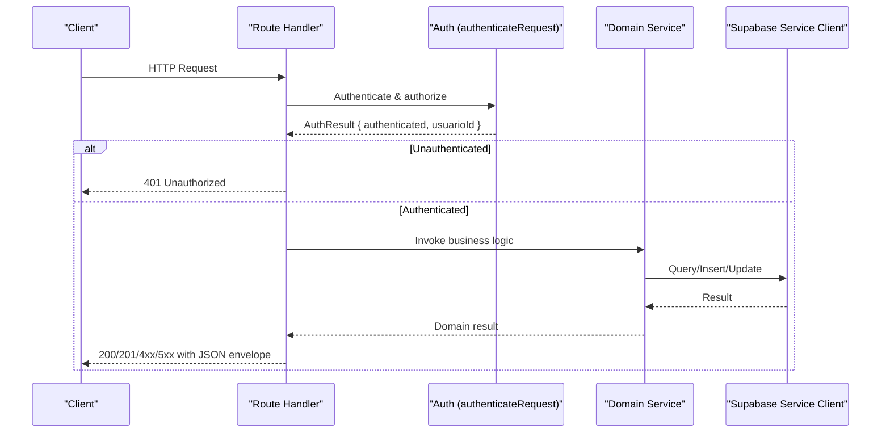
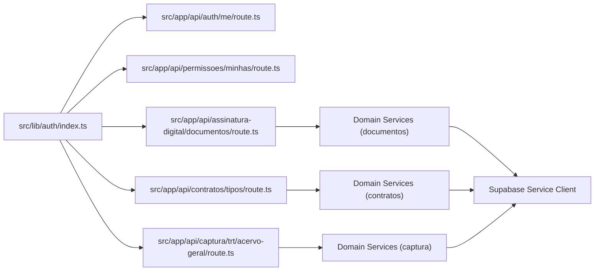

# REST API Endpoints

<cite>
**Referenced Files in This Document**
- [src/app/api/health/route.ts](file://src/app/api/health/route.ts)
- [src/app/api/auth/me/route.ts](file://src/app/api/auth/me/route.ts)
- [src/app/api/permissoes/minhas/route.ts](file://src/app/api/permissoes/minhas/route.ts)
- [src/app/api/assinatura-digital/documentos/route.ts](file://src/app/api/assinatura-digital/documentos/route.ts)
- [src/app/api/captura/trt/acervo-geral/route.ts](file://src/app/api/captura/trt/acervo-geral/route.ts)
- [src/app/api/contratos/tipos/route.ts](file://src/app/api/contratos/tipos/route.ts)
- [src/app/api/clientes/buscar/sugestoes/route.ts](file://src/app/api/clientes/buscar/sugestoes/route.ts)
- [src/app/api/dify/chat/route.ts](file://src/app/api/dify/chat/route.ts)
- [src/app/api/ai/command/route.ts](file://src/app/api/ai/command/route.ts)
- [src/lib/auth/index.ts](file://src/lib/auth/index.ts)
</cite>

## Table of Contents
1. [Introduction](#introduction)
2. [Project Structure](#project-structure)
3. [Core Components](#core-components)
4. [Architecture Overview](#architecture-overview)
5. [Detailed Component Analysis](#detailed-component-analysis)
6. [Dependency Analysis](#dependency-analysis)
7. [Performance Considerations](#performance-considerations)
8. [Troubleshooting Guide](#troubleshooting-guide)
9. [Conclusion](#conclusion)
10. [Appendices](#appendices)

## Introduction
This document provides comprehensive REST API documentation for ZattarOS public endpoints. It covers HTTP methods, URL patterns, request/response schemas, authentication requirements, and error handling across the following categories:
- Legal processes
- Contracts
- Documents
- Users
- AI services
- Administrative functions

Where applicable, the documentation includes parameter descriptions, query string options, request body formats, response examples, error codes, and practical curl examples. SDK usage patterns are also described conceptually.

## Project Structure
ZattarOS exposes REST endpoints under the Next.js App Router at src/app/api. Each endpoint is implemented as a route module exporting GET/POST/PUT/DELETE handlers as needed. Authentication is enforced via shared utilities that support session-based, bearer token, and service API key mechanisms.

**Diagram sources**
- [src/app/api/auth/me/route.ts:12-86](file://src/app/api/auth/me/route.ts#L12-L86)
- [src/app/api/permissoes/minhas/route.ts:35-92](file://src/app/api/permissoes/minhas/route.ts#L35-L92)
- [src/app/api/assinatura-digital/documentos/route.ts:37-123](file://src/app/api/assinatura-digital/documentos/route.ts#L37-L123)
- [src/lib/auth/index.ts:5-11](file://src/lib/auth/index.ts#L5-L11)

**Section sources**
- [src/app/api/health/route.ts:1-45](file://src/app/api/health/route.ts#L1-L45)
- [src/lib/auth/index.ts:1-11](file://src/lib/auth/index.ts#L1-L11)

## Core Components
- Authentication and permissions
  - authenticateRequest: Validates session, bearer token, or service API key and returns an AuthResult with authenticated flag and usuarioId.
  - requireAuthentication: Enforces authentication for protected endpoints.
  - requirePermission: Enforces RBAC checks for protected resources and operations.
- Supabase service client
  - createServiceClient: Provides a server-side Supabase client for database operations.
- Shared repositories and services
  - Domain services are invoked from route handlers to encapsulate business logic and data access.

Common response envelope pattern:
- success: boolean
- data: object|array|null
- error: string|null
- details: object|null

Status codes observed:
- 200 OK
- 201 Created
- 400 Bad Request
- 401 Unauthorized
- 404 Not Found
- 409 Conflict
- 500 Internal Server Error

**Section sources**
- [src/lib/auth/index.ts:5-11](file://src/lib/auth/index.ts#L5-L11)
- [src/app/api/auth/me/route.ts:19-86](file://src/app/api/auth/me/route.ts#L19-L86)
- [src/app/api/permissoes/minhas/route.ts:35-92](file://src/app/api/permissoes/minhas/route.ts#L35-L92)
- [src/app/api/assinatura-digital/documentos/route.ts:37-123](file://src/app/api/assinatura-digital/documentos/route.ts#L37-L123)

## Architecture Overview
The API follows a layered architecture:
- Route handlers validate authentication and permissions, parse requests, and delegate to domain services.
- Domain services orchestrate data retrieval/updates via the Supabase service client.
- Responses are normalized with a success/data/error envelope.

**Diagram sources**
- [src/app/api/auth/me/route.ts:19-75](file://src/app/api/auth/me/route.ts#L19-L75)
- [src/app/api/permissoes/minhas/route.ts:35-83](file://src/app/api/permissoes/minhas/route.ts#L35-L83)
- [src/app/api/assinatura-digital/documentos/route.ts:66-122](file://src/app/api/assinatura-digital/documentos/route.ts#L66-L122)

## Detailed Component Analysis

### Health
- Method: GET
- URL: /api/health
- Purpose: Application health check
- Authentication: Not required
- Response:
  - status: string (example: ok)
  - timestamp: string (ISO 8601)
  - version: string (semantic version)

curl example:
- curl https://your-host/api/health

**Section sources**
- [src/app/api/health/route.ts:29-43](file://src/app/api/health/route.ts#L29-L43)

### Users and Permissions
- Consolidated user profile endpoint
  - Method: GET
  - URL: /api/auth/me
  - Authentication: Session or Bearer token
  - Response fields:
    - id, authUserId, nomeCompleto, nomeExibicao, emailCorporativo, emailPessoal, avatarUrl, isSuperAdmin
    - permissoes: array of { recurso, operacao, permitido }
  - Notes: Returns profile and permissions in a single call.

- Get logged-in user permissions
  - Method: GET
  - URL: /api/permissoes/minhas
  - Query parameters:
    - recurso: optional string to filter permissions by resource
  - Authentication: Session or Bearer token
  - Response fields:
    - usuarioId, isSuperAdmin, permissoes[]
  - Notes: Super admin gets broad allowances; filtering supported.

curl examples:
- curl -H "Authorization: Bearer YOUR_TOKEN" https://your-host/api/auth/me
- curl -H "Cookie: session=..." https://your-host/api/permissoes/minhas?recurso=assistentes

**Section sources**
- [src/app/api/auth/me/route.ts:19-75](file://src/app/api/auth/me/route.ts#L19-L75)
- [src/app/api/permissoes/minhas/route.ts:35-83](file://src/app/api/permissoes/minhas/route.ts#L35-L83)

### Legal Processes (TRT Capture)
- Acervo Geral capture
  - Method: POST
  - URL: /api/captura/trt/acervo-geral
  - Authentication: Session or Bearer token or Service API key
  - Request body:
    - advogado_id: integer
    - credencial_ids: array of integers (non-empty)
  - Response:
    - success: boolean
    - message: string
    - status: string (example: in_progress)
    - capture_id: integer|null
    - data:
      - credenciais_processadas: integer
      - message: string (async processing note)
  - Notes:
    - Asynchronous processing; returns immediately with status in_progress.
    - Validates credentials ownership and tribunal configuration.
    - Logs raw captures and updates history upon completion.

curl example:
- curl -X POST https://your-host/api/captura/trt/acervo-geral \
  -H "Authorization: Bearer YOUR_TOKEN" \
  -H "Content-Type: application/json" \
  -d '{"advogado_id":1,"credencial_ids":[101,102]}'

**Section sources**
- [src/app/api/captura/trt/acervo-geral/route.ts:125-357](file://src/app/api/captura/trt/acervo-geral/route.ts#L125-L357)

### Contracts
- Contract types
  - Method: GET
  - URL: /api/contratos/tipos
  - Authentication: Any authenticated user
  - Query parameters:
    - ativo: boolean (optional)
    - search: string (optional)
  - Response fields:
    - success: boolean
    - data: array of contract types
    - total: integer

  - Method: POST
  - URL: /api/contratos/tipos
  - Authentication: Requires permission contratos.criar
  - Request body: validated according to createContratoTipoSchema
  - Response:
    - success: boolean
    - data: created contract type
  - Error codes:
    - 409 Conflict (when unique constraint violated)

curl examples:
- GET: curl -H "Authorization: Bearer YOUR_TOKEN" "https://your-host/api/contratos/tipos?ativo=true&search=service"
- POST: curl -X POST https://your-host/api/contratos/tipos -H "Authorization: Bearer YOUR_TOKEN" -H "Content-Type: application/json" -d '{...}'

**Section sources**
- [src/app/api/contratos/tipos/route.ts:16-88](file://src/app/api/contratos/tipos/route.ts#L16-L88)

### Documents (Digital Signature)
- List and create documents
  - Method: GET
  - URL: /api/assinatura-digital/documentos
  - Authentication: Permission assinatura_digital.visualizar
  - Query parameters:
    - limit: integer (default 50)
  - Response:
    - success: boolean
    - data: array of documents

  - Method: POST
  - URL: /api/assinatura-digital/documentos
  - Authentication: Permission assinatura_digital.criar
  - Content-Type: multipart/form-data
  - Form fields:
    - file: PDF (required)
    - titulo: string (optional)
    - selfie_habilitada: "true"|"false" (default "false")
    - assinantes: JSON string (array) with elements:
      - assinante_tipo: enum ["cliente","parte_contraria","representante","terceiro","usuario","convidado"]
      - assinante_entidade_id: number|null
      - dados_snapshot: object|null
  - Response:
    - success: boolean
    - data: created document
  - Error codes:
    - 400 Bad Request (invalid PDF, invalid JSON, schema errors)
    - 500 Internal Server Error

curl examples:
- GET: curl -H "Authorization: Bearer YOUR_TOKEN" "https://your-host/api/assinatura-digital/documentos?limit=100"
- POST: curl -X POST https://your-host/api/assinatura-digital/documentos \
  -H "Authorization: Bearer YOUR_TOKEN" \
  -F "file=@/path/to/document.pdf" \
  -F "titulo=Contract" \
  -F "selfie_habilitada=false" \
  -F "assinantes=[{\"assinante_tipo\":\"cliente\",\"assinante_entidade_id\":123}]"

**Section sources**
- [src/app/api/assinatura-digital/documentos/route.ts:37-123](file://src/app/api/assinatura-digital/documentos/route.ts#L37-L123)

### Clients (Autocomplete suggestions)
- Search client suggestions
  - Method: GET
  - URL: /api/clientes/buscar/sugestoes
  - Authentication: Permission clientes.listar
  - Query parameters:
    - limit: integer (min 1, max 100, default 20)
    - search: string (optional)
  - Response:
    - success: boolean
    - data.options: array of { id, label, cpf, cnpj }

curl example:
- curl "https://your-host/api/clientes/buscar/sugestoes?limit=50&search=João"

**Section sources**
- [src/app/api/clientes/buscar/sugestoes/route.ts:14-51](file://src/app/api/clientes/buscar/sugestoes/route.ts#L14-L51)

### AI Services (Dify Chat)
- Chat streaming
  - Method: POST
  - URL: /api/dify/chat
  - Authentication: Not enforced in handler; however, service factory selects user or app context
  - Request body:
    - query: string
    - inputs: object (optional)
    - conversation_id: string (optional)
    - user: string (fallback to anonymous-user if missing)
    - app_id: string (optional, overrides user context)
  - Response: Server-Sent Events (text/event-stream)
  - Notes:
    - Uses schema validation; returns 400 on invalid payload.
    - Stream cancellation on client disconnect.
    - Runtime configured to nodejs for compatibility.

curl example:
- curl -N -H "Content-Type: application/json" -d '{"query":"Help","user":"user-id"}' https://your-host/api/dify/chat

**Section sources**
- [src/app/api/dify/chat/route.ts:9-79](file://src/app/api/dify/chat/route.ts#L9-L79)

### Deprecated AI Command Endpoint
- Method: POST
- URL: /api/ai/command
- Status: 410 Gone
- Behavior: Redirects to /api/plate/ai

curl example:
- curl -i https://your-host/api/ai/command

**Section sources**
- [src/app/api/ai/command/route.ts:11-18](file://src/app/api/ai/command/route.ts#L11-L18)

## Dependency Analysis
Key dependencies and relationships:
- Route handlers depend on authentication utilities for session/bearer/service checks.
- Domain services depend on repository/service-layer abstractions.
- Supabase service client is used for database operations.

**Diagram sources**
- [src/lib/auth/index.ts:5-11](file://src/lib/auth/index.ts#L5-L11)
- [src/app/api/auth/me/route.ts:13-39](file://src/app/api/auth/me/route.ts#L13-L39)
- [src/app/api/permissoes/minhas/route.ts:35-55](file://src/app/api/permissoes/minhas/route.ts#L35-L55)
- [src/app/api/assinatura-digital/documentos/route.ts:3-7](file://src/app/api/assinatura-digital/documentos/route.ts#L3-L7)
- [src/app/api/contratos/tipos/route.ts:10-14](file://src/app/api/contratos/tipos/route.ts#L10-L14)
- [src/app/api/captura/trt/acervo-geral/route.ts:5-11](file://src/app/api/captura/trt/acervo-geral/route.ts#L5-L11)

**Section sources**
- [src/lib/auth/index.ts:1-11](file://src/lib/auth/index.ts#L1-L11)
- [src/app/api/assinatura-digital/documentos/route.ts:1-127](file://src/app/api/assinatura-digital/documentos/route.ts#L1-L127)
- [src/app/api/contratos/tipos/route.ts:1-89](file://src/app/api/contratos/tipos/route.ts#L1-L89)
- [src/app/api/captura/trt/acervo-geral/route.ts:1-366](file://src/app/api/captura/trt/acervo-geral/route.ts#L1-L366)

## Performance Considerations
- Streaming responses: Dify chat returns a Server-Sent Events stream; ensure clients handle backpressure and cancellation.
- Parallelization: Some handlers perform concurrent operations (e.g., fetching user and permissions in parallel).
- Caching: Certain endpoints set cache-control headers to prevent stale data.
- Async processing: TRT capture returns immediately with in_progress status; use capture_id to poll or subscribe to logs.

## Troubleshooting Guide
Common error scenarios and resolutions:
- 401 Unauthorized
  - Cause: Missing or invalid session, bearer token, or service API key.
  - Resolution: Ensure Authorization header or session cookie is present and valid.

- 403 Forbidden (via requirePermission)
  - Cause: Insufficient permissions for the requested resource and operation.
  - Resolution: Verify user permissions and RBAC configuration.

- 400 Bad Request
  - Document creation (multipart): Invalid PDF, missing file, malformed JSON in assinantes.
  - Dify chat: Missing required fields or invalid schema.
  - Resolution: Validate request payload against documented schemas.

- 404 Not Found
  - TRT capture: One or more credential IDs not found or do not belong to the specified advogado.
  - Resolution: Confirm credential existence and ownership.

- 409 Conflict
  - Contract types: Unique constraint violation (e.g., duplicate slug/name).
  - Resolution: Adjust payload to satisfy uniqueness.

- 500 Internal Server Error
  - Unexpected exceptions in route handlers or domain services.
  - Resolution: Check server logs and retry after addressing underlying cause.

**Section sources**
- [src/app/api/assinatura-digital/documentos/route.ts:74-122](file://src/app/api/assinatura-digital/documentos/route.ts#L74-L122)
- [src/app/api/captura/trt/acervo-geral/route.ts:144-190](file://src/app/api/captura/trt/acervo-geral/route.ts#L144-L190)
- [src/app/api/contratos/tipos/route.ts:68-72](file://src/app/api/contratos/tipos/route.ts#L68-L72)
- [src/app/api/dify/chat/route.ts:22-27](file://src/app/api/dify/chat/route.ts#L22-L27)

## Conclusion
ZattarOS exposes a well-structured set of REST endpoints organized by functional domains. Authentication is enforced consistently using session, bearer token, and service API key mechanisms. Responses follow a uniform envelope pattern, and asynchronous operations are clearly indicated. The documentation provided here should enable developers to integrate with the platform reliably using curl or SDKs.

## Appendices

### Authentication Methods
- Session-based: Cookie-based session accepted by authenticateRequest.
- Bearer token: Authorization: Bearer <token>.
- Service API key: Supported by authenticateRequest for internal integrations.

**Section sources**
- [src/lib/auth/index.ts:5-11](file://src/lib/auth/index.ts#L5-L11)
- [src/app/api/captura/trt/acervo-geral/route.ts:127-134](file://src/app/api/captura/trt/acervo-geral/route.ts#L127-L134)

### SDK Usage Patterns
- Initialize HTTP client with Authorization header for bearer token or include session cookies.
- For streaming endpoints (Dify chat), use an HTTP client that supports Server-Sent Events and handle cancellation on abort.
- For multipart uploads (document creation), construct a proper multipart/form-data request with file and form fields.