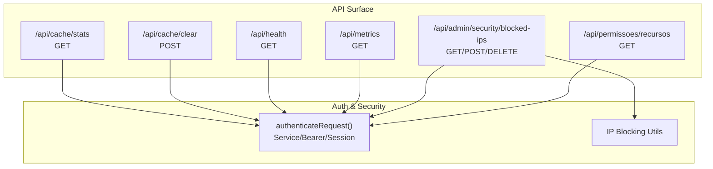
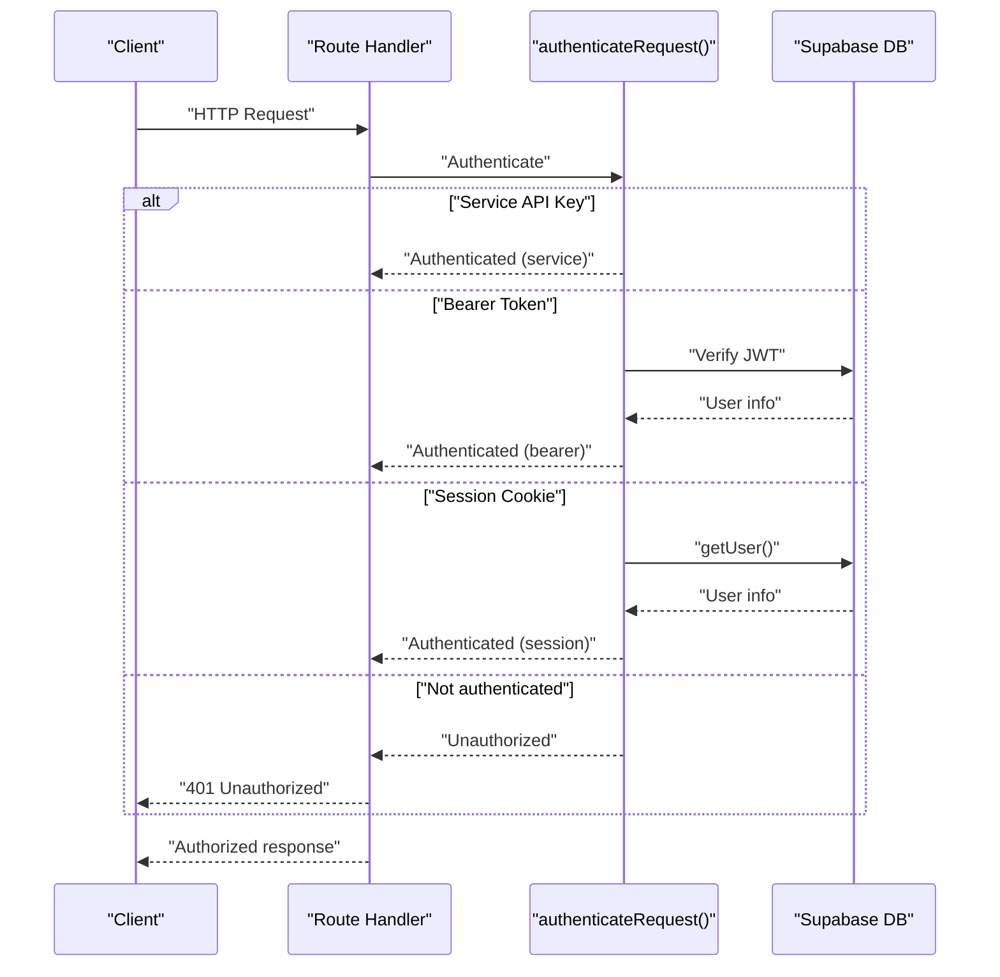
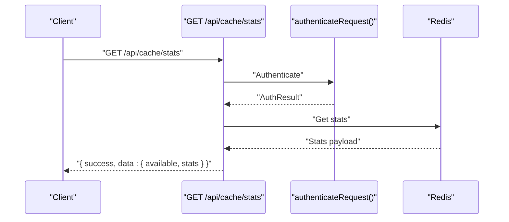
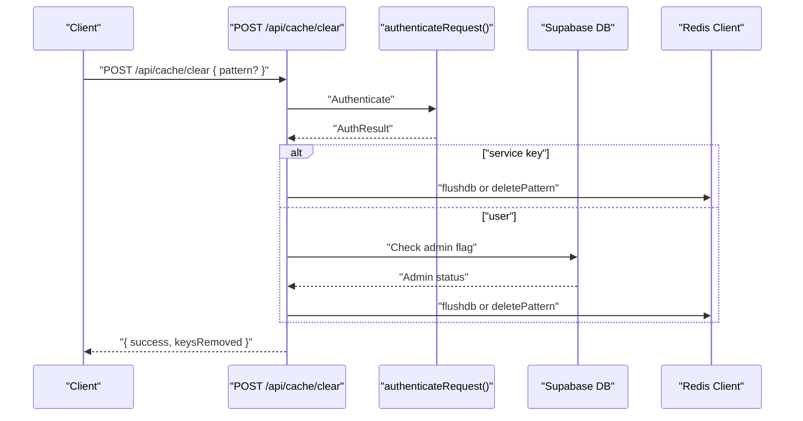
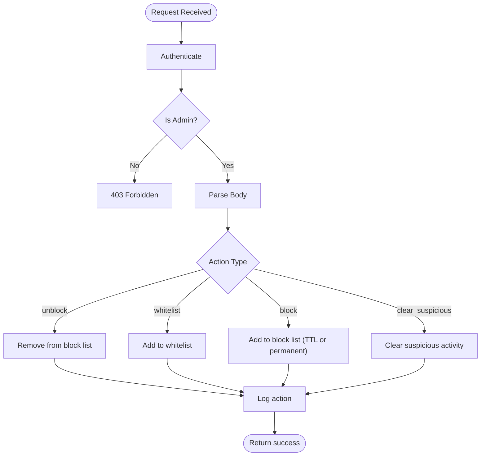
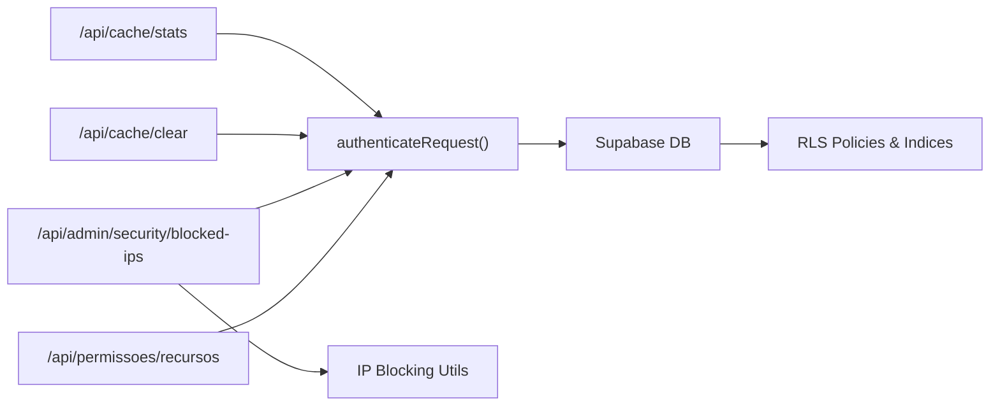

# System Administration APIs

<cite>
**Referenced Files in This Document**
- [src/app/api/cache/clear/route.ts](file://src/app/api/cache/clear/route.ts)
- [src/app/api/cache/stats/route.ts](file://src/app/api/cache/stats/route.ts)
- [src/app/api/health/route.ts](file://src/app/api/health/route.ts)
- [src/app/api/metrics/route.ts](file://src/app/api/metrics/route.ts)
- [src/app/api/admin/security/blocked-ips/route.ts](file://src/app/api/admin/security/blocked-ips/route.ts)
- [src/lib/auth/api-auth.ts](file://src/lib/auth/api-auth.ts)
- [src/app/api/permissoes/recursos/route.ts](file://src/app/api/permissoes/recursos/route.ts)
- [src/app/(authenticated)/usuarios/actions/permissoes-actions.ts](file://src/app/(authenticated)/usuarios/actions/permissoes-actions.ts)
- [src/app/(authenticated)/usuarios/types/types.ts](file://src/app/(authenticated)/usuarios/types/types.ts)
- [src/app/(ajuda)/ajuda/desenvolvimento/api-referencia/page.tsx](file://src/app/(ajuda)/ajuda/desenvolvimento/api-referencia/page.tsx)
- [src/proxy.ts](file://src/proxy.ts)
- [supabase/migrations/20250118120100_create_permissoes.sql](file://supabase/migrations/20250118120100_create_permissoes.sql)
- [supabase/migrations/20260110120002_add_disk_io_metrics_function.sql](file://supabase/migrations/20260110120002_add_disk_io_metrics_function.sql)
- [src/app/(authenticated)/admin/repositories/metricas-db-repository.ts](file://src/app/(authenticated)/admin/repositories/metricas-db-repository.ts)
</cite>

## Table of Contents
1. [Introduction](#introduction)
2. [Project Structure](#project-structure)
3. [Core Components](#core-components)
4. [Architecture Overview](#architecture-overview)
5. [Detailed Component Analysis](#detailed-component-analysis)
6. [Dependency Analysis](#dependency-analysis)
7. [Performance Considerations](#performance-considerations)
8. [Troubleshooting Guide](#troubleshooting-guide)
9. [Conclusion](#conclusion)
10. [Appendices](#appendices)

## Introduction
This document provides comprehensive API documentation for system administration and monitoring endpoints. It covers cache management APIs, system health checks, performance metrics, administrative operations for IP blocking, and permission matrix endpoints. It also documents security considerations for admin endpoints and access control requirements, including authentication sources and authorization checks.

## Project Structure
The administration and monitoring APIs are implemented as Next.js Route Handlers under the application’s API surface. Key areas include:
- Cache management: stats and clear endpoints
- System health and metrics: health and Prometheus-style metrics
- Administrative security: blocked IPs management
- Permissions: resources matrix and user permissions
- Authentication and authorization utilities

**Diagram sources**
- [src/app/api/cache/stats/route.ts:67-98](file://src/app/api/cache/stats/route.ts#L67-L98)
- [src/app/api/cache/clear/route.ts:74-147](file://src/app/api/cache/clear/route.ts#L74-L147)
- [src/app/api/health/route.ts:29-45](file://src/app/api/health/route.ts#L29-L45)
- [src/app/api/metrics/route.ts:5-42](file://src/app/api/metrics/route.ts#L5-L42)
- [src/app/api/admin/security/blocked-ips/route.ts:58-290](file://src/app/api/admin/security/blocked-ips/route.ts#L58-L290)
- [src/lib/auth/api-auth.ts:95-275](file://src/lib/auth/api-auth.ts#L95-L275)

**Section sources**
- [src/app/api/cache/clear/route.ts:1-147](file://src/app/api/cache/clear/route.ts#L1-L147)
- [src/app/api/cache/stats/route.ts:1-98](file://src/app/api/cache/stats/route.ts#L1-L98)
- [src/app/api/health/route.ts:1-45](file://src/app/api/health/route.ts#L1-L45)
- [src/app/api/metrics/route.ts:1-42](file://src/app/api/metrics/route.ts#L1-L42)
- [src/app/api/admin/security/blocked-ips/route.ts:1-290](file://src/app/api/admin/security/blocked-ips/route.ts#L1-L290)
- [src/lib/auth/api-auth.ts:1-275](file://src/lib/auth/api-auth.ts#L1-L275)

## Core Components
- Cache Management
  - GET /api/cache/stats: Returns Redis availability and key metrics (hits, misses, uptime, connections).
  - POST /api/cache/clear: Clears Redis cache by pattern or entire database; requires admin privileges except for service API key.
- System Health
  - GET /api/health: Application health status with timestamp and version.
- Performance Metrics
  - GET /api/metrics: Node.js process metrics in Prometheus text exposition format.
- Administrative Security
  - GET /api/admin/security/blocked-ips: Lists blocked IPs and whitelist with counts and timestamps.
  - POST /api/admin/security/blocked-ips: Unblocks, whitelists, blocks, or clears suspicious activity for an IP.
  - DELETE /api/admin/security/blocked-ips: Removes an IP from the whitelist.
- Permissions Matrix
  - GET /api/permissoes/recursos: Lists all available resources and operations in the permission matrix.

**Section sources**
- [src/app/api/cache/stats/route.ts:8-98](file://src/app/api/cache/stats/route.ts#L8-L98)
- [src/app/api/cache/clear/route.ts:34-147](file://src/app/api/cache/clear/route.ts#L34-L147)
- [src/app/api/health/route.ts:3-45](file://src/app/api/health/route.ts#L3-L45)
- [src/app/api/metrics/route.ts:3-42](file://src/app/api/metrics/route.ts#L3-L42)
- [src/app/api/admin/security/blocked-ips/route.ts:1-290](file://src/app/api/admin/security/blocked-ips/route.ts#L1-L290)
- [src/app/api/permissoes/recursos/route.ts:1-47](file://src/app/api/permissoes/recursos/route.ts#L1-L47)

## Architecture Overview
The APIs rely on a unified authentication pipeline supporting three sources:
- Service API Key: system-level access for background jobs.
- Bearer Token: JWT-based authentication for external clients.
- Supabase Session: browser session-based authentication.

Administrative endpoints enforce stricter authorization checks against user roles stored in the database.

**Diagram sources**
- [src/lib/auth/api-auth.ts:95-275](file://src/lib/auth/api-auth.ts#L95-L275)

**Section sources**
- [src/lib/auth/api-auth.ts:1-275](file://src/lib/auth/api-auth.ts#L1-L275)

## Detailed Component Analysis

### Cache Management APIs

#### GET /api/cache/stats
- Purpose: Retrieve Redis cache statistics and availability.
- Authentication: Required (any of Service/Bearer/Session).
- Response:
  - success: Boolean indicating operation outcome.
  - data.available: Boolean indicating Redis connectivity.
  - data.stats: Redis INFO-like metrics (used_memory, keyspace_hits, keyspace_misses, uptime_in_seconds, total_connections_received).

**Diagram sources**
- [src/app/api/cache/stats/route.ts:67-98](file://src/app/api/cache/stats/route.ts#L67-L98)

**Section sources**
- [src/app/api/cache/stats/route.ts:8-98](file://src/app/api/cache/stats/route.ts#L8-L98)

#### POST /api/cache/clear
- Purpose: Clear Redis cache by pattern or entire database.
- Authentication: Required; admin check applies unless using service API key.
- Authorization: Requires admin flag (super admin) except for service-originated requests.
- Request Body:
  - pattern: Optional string to match keys (e.g., "pendentes:*"). If omitted, flushes entire database.
- Response:
  - success: Boolean.
  - keysRemoved: Number of keys removed (estimate for full flush).

**Diagram sources**
- [src/app/api/cache/clear/route.ts:74-147](file://src/app/api/cache/clear/route.ts#L74-L147)

**Section sources**
- [src/app/api/cache/clear/route.ts:34-147](file://src/app/api/cache/clear/route.ts#L34-L147)

### System Health Check
- GET /api/health
  - Returns application status, timestamp, and version.
  - Includes cache-control headers to prevent caching.

**Section sources**
- [src/app/api/health/route.ts:3-45](file://src/app/api/health/route.ts#L3-L45)

### Performance Metrics
- GET /api/metrics
  - Exposes Node.js process metrics in Prometheus text format:
    - process_uptime_seconds (gauge)
    - process_resident_memory_bytes (gauge)
    - process_heap_total_bytes (gauge)
    - process_heap_used_bytes (gauge)
    - nodejs_cpu_user_seconds_total (counter)
    - nodejs_cpu_system_seconds_total (counter)
  - Headers specify content type as text/plain with version 0.0.4.

**Section sources**
- [src/app/api/metrics/route.ts:3-42](file://src/app/api/metrics/route.ts#L3-L42)

### Administrative Security: IP Blocking Management
- GET /api/admin/security/blocked-ips
  - Lists blocked IPs and whitelist entries with counts and timestamps.
  - Requires admin (super admin) privileges.
- POST /api/admin/security/blocked-ips
  - Actions: unblock, whitelist, block (with TTL or permanent), clear_suspicious.
  - Validates IP format and enforces admin authorization.
- DELETE /api/admin/security/blocked-ips
  - Removes an IP from the whitelist; requires admin authorization.

**Diagram sources**
- [src/app/api/admin/security/blocked-ips/route.ts:117-235](file://src/app/api/admin/security/blocked-ips/route.ts#L117-L235)

**Section sources**
- [src/app/api/admin/security/blocked-ips/route.ts:1-290](file://src/app/api/admin/security/blocked-ips/route.ts#L1-L290)

### Permissions Matrix API
- GET /api/permissoes/recursos
  - Returns the complete permission matrix (resources and operations).
  - Authentication: Required (any of Service/Bearer/Session).
  - Response includes total resources and total permissions.

**Section sources**
- [src/app/api/permissoes/recursos/route.ts:1-47](file://src/app/api/permissoes/recursos/route.ts#L1-L47)

### Permission Management Utilities
- Types and helpers define the permission matrix structure and validation.
- Server actions handle listing and saving user permissions with admin checks and uniqueness constraints.

**Section sources**
- [src/app/(authenticated)/usuarios/types/types.ts](file://src/app/(authenticated)/usuarios/types/types.ts#L471-L533)
- [src/app/(authenticated)/usuarios/actions/permissoes-actions.ts](file://src/app/(authenticated)/usuarios/actions/permissoes-actions.ts#L14-L90)

## Dependency Analysis
- Authentication pipeline supports three sources and caches user mapping to minimize database queries.
- Administrative endpoints depend on IP blocking utilities and Supabase for role verification.
- Permissions endpoints rely on Supabase RLS policies and indices for efficient permission checks.

**Diagram sources**
- [src/lib/auth/api-auth.ts:95-275](file://src/lib/auth/api-auth.ts#L95-L275)
- [src/app/api/admin/security/blocked-ips/route.ts:13-24](file://src/app/api/admin/security/blocked-ips/route.ts#L13-L24)
- [supabase/migrations/20250118120100_create_permissoes.sql:28-59](file://supabase/migrations/20250118120100_create_permissoes.sql#L28-L59)

**Section sources**
- [src/lib/auth/api-auth.ts:1-275](file://src/lib/auth/api-auth.ts#L1-L275)
- [src/app/api/admin/security/blocked-ips/route.ts:1-290](file://src/app/api/admin/security/blocked-ips/route.ts#L1-L290)
- [supabase/migrations/20250118120100_create_permissoes.sql:28-59](file://supabase/migrations/20250118120100_create_permissoes.sql#L28-L59)

## Performance Considerations
- Cache Management
  - Use pattern-based deletion to avoid full flush when possible.
  - Monitor keyspace_hits vs keyspace_misses to assess cache effectiveness.
- Metrics Exposure
  - Prometheus scraping should target /api/metrics for lightweight ingestion.
  - Avoid frequent polling; align scrape intervals with operational needs.
- Authentication
  - The authentication utility caches user ID lookups to reduce DB load.
- Permissions
  - Database indices on (usuario_id, recurso, operacao) improve permission checks.

[No sources needed since this section provides general guidance]

## Troubleshooting Guide
- Authentication Failures
  - Service API Key errors: Verify SERVICE_API_KEY environment variable and header correctness.
  - Bearer token errors: Confirm token validity and expiration; check for invalid/expired tokens.
  - Session errors: Ensure cookies are present and readable; validate Supabase session state.
- Cache Operations
  - Cache clear failures: Inspect Redis connectivity and permissions; confirm admin status for user-originated requests.
  - Stats unavailable: Check Redis availability and network connectivity.
- Administrative IP Management
  - 403 Forbidden indicates missing admin privileges; verify user role.
  - Invalid IP format errors occur with malformed IP addresses.
- Permissions
  - Permission checks failing unexpectedly: Review RLS policies and indices; ensure unique constraints are respected when assigning permissions.

**Section sources**
- [src/lib/auth/api-auth.ts:95-275](file://src/lib/auth/api-auth.ts#L95-L275)
- [src/app/api/cache/clear/route.ts:74-147](file://src/app/api/cache/clear/route.ts#L74-L147)
- [src/app/api/cache/stats/route.ts:67-98](file://src/app/api/cache/stats/route.ts#L67-L98)
- [src/app/api/admin/security/blocked-ips/route.ts:117-235](file://src/app/api/admin/security/blocked-ips/route.ts#L117-L235)
- [supabase/migrations/20250118120100_create_permissoes.sql:28-59](file://supabase/migrations/20250118120100_create_permissoes.sql#L28-L59)

## Conclusion
The administration and monitoring APIs provide robust capabilities for cache management, health checks, metrics exposure, IP blocking, and permission matrix access. Strong authentication and authorization controls ensure secure access, while database indices and caching strategies support performance. Administrators can monitor and maintain the system effectively using these endpoints.

[No sources needed since this section summarizes without analyzing specific files]

## Appendices

### API Reference Index
- Cache
  - GET /api/cache/stats
  - POST /api/cache/clear
- Health
  - GET /api/health
- Metrics
  - GET /api/metrics
- Admin Security
  - GET /api/admin/security/blocked-ips
  - POST /api/admin/security/blocked-ips
  - DELETE /api/admin/security/blocked-ips
- Permissions
  - GET /api/permissoes/recursos

**Section sources**
- [src/app/api/cache/stats/route.ts:8-98](file://src/app/api/cache/stats/route.ts#L8-L98)
- [src/app/api/cache/clear/route.ts:34-147](file://src/app/api/cache/clear/route.ts#L34-L147)
- [src/app/api/health/route.ts:3-45](file://src/app/api/health/route.ts#L3-L45)
- [src/app/api/metrics/route.ts:3-42](file://src/app/api/metrics/route.ts#L3-L42)
- [src/app/api/admin/security/blocked-ips/route.ts:58-290](file://src/app/api/admin/security/blocked-ips/route.ts#L58-L290)
- [src/app/api/permissoes/recursos/route.ts:1-47](file://src/app/api/permissoes/recursos/route.ts#L1-L47)

### Security Considerations and Access Control
- Authentication Sources
  - Service API Key: system-level access; validated securely.
  - Bearer Token: JWT-based; validated against Supabase.
  - Session Cookie: browser session; validated via Supabase getUser().
- Authorization
  - Cache clear: admin required unless service-originated.
  - Admin security endpoints: super admin required.
  - Permissions endpoints: authenticated access; sensitive operations guarded by server actions.
- Known Endpoint Detection
  - Proxy detects unknown /api/* paths to trigger auto-blocking mechanisms.

**Section sources**
- [src/lib/auth/api-auth.ts:95-275](file://src/lib/auth/api-auth.ts#L95-L275)
- [src/app/api/cache/clear/route.ts:85-101](file://src/app/api/cache/clear/route.ts#L85-L101)
- [src/app/api/admin/security/blocked-ips/route.ts:33-52](file://src/app/api/admin/security/blocked-ips/route.ts#L33-L52)
- [src/proxy.ts:143-179](file://src/proxy.ts#L143-L179)

### Database Metrics and Maintenance
- Disk I/O Metrics Placeholder
  - Supabase migration defines a function placeholder for disk I/O metrics; actual data sourced via Management API.
- Database Metrics Repository
  - Provides functions to fetch unused indexes and disk I/O metrics with timestamped results.

**Section sources**
- [supabase/migrations/20260110120002_add_disk_io_metrics_function.sql:1-28](file://supabase/migrations/20260110120002_add_disk_io_metrics_function.sql#L1-L28)
- [src/app/(authenticated)/admin/repositories/metricas-db-repository.ts](file://src/app/(authenticated)/admin/repositories/metricas-db-repository.ts#L126-L155)