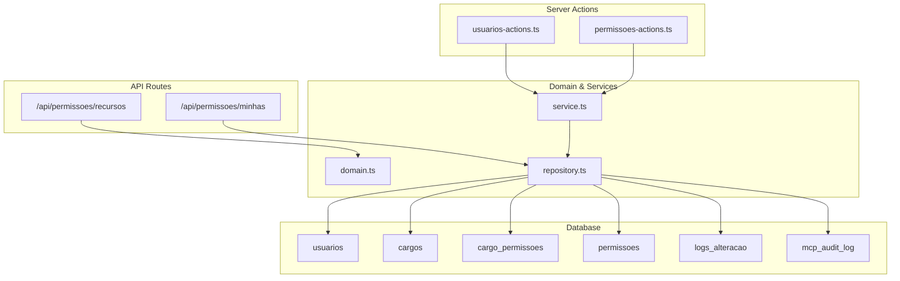
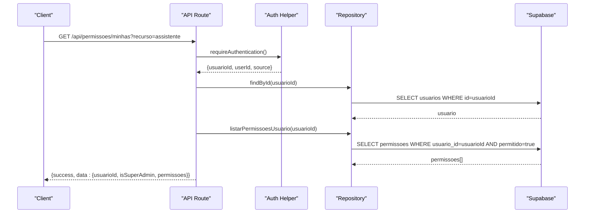
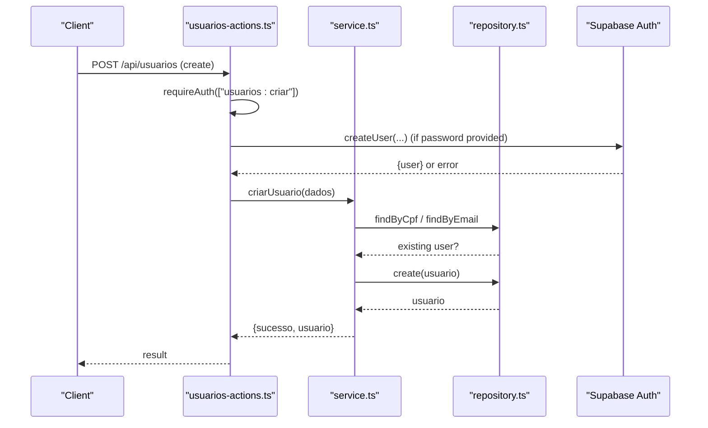
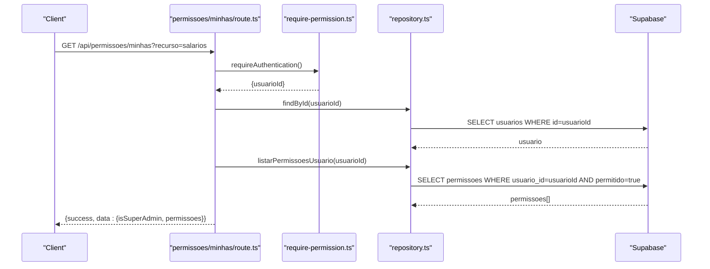
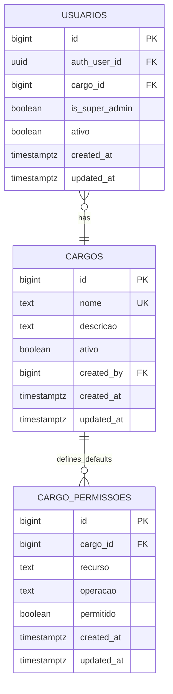
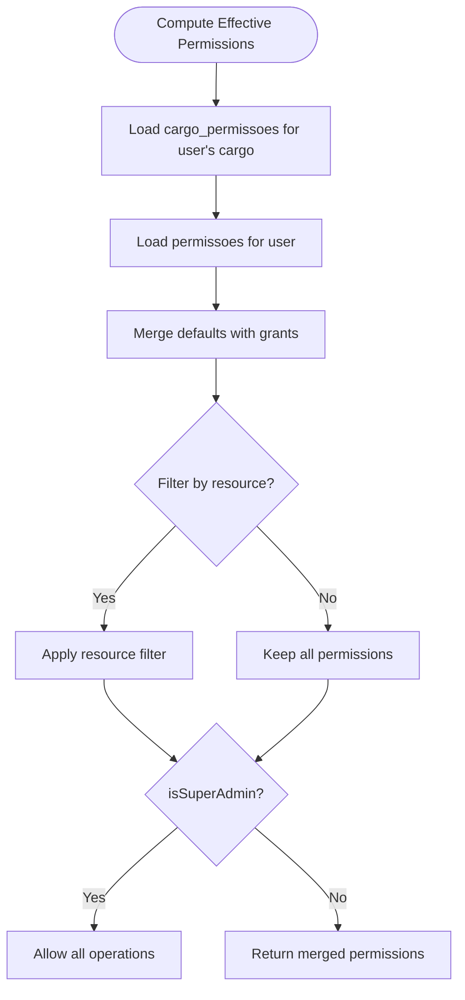
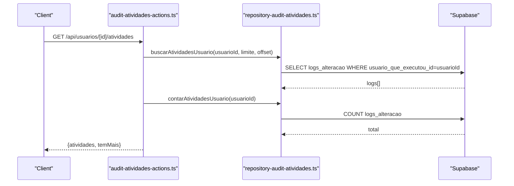
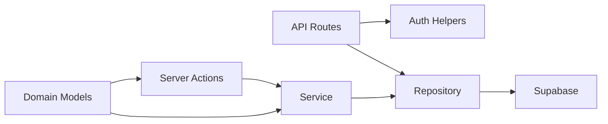

# User Management APIs

<cite>
**Referenced Files in This Document**
- [08_usuarios.sql](file://supabase/schemas/08_usuarios.sql)
- [22_cargos_permissoes.sql](file://supabase/schemas/22_cargos_permissoes.sql)
- [20250118120003_create_cargos.sql](file://supabase/migrations/20250118120003_create_cargos.sql)
- [20250118120100_create_permissoes.sql](file://supabase/migrations/20250118120100_create_permissoes.sql)
- [permissoes/minhas/route.ts](file://src/app/api/permissoes/minhas/route.ts)
- [permissoes/recursos/route.ts](file://src/app/api/permissoes/recursos/route.ts)
- [usuarios-actions.ts](file://src/app/(authenticated)/usuarios/actions/usuarios-actions.ts)
- [permissoes-actions.ts](file://src/app/(authenticated)/usuarios/actions/permissoes-actions.ts)
- [repository.ts](file://src/app/(authenticated)/usuarios/repository.ts)
- [domain.ts](file://src/app/(authenticated)/usuarios/domain.ts)
- [service.ts](file://src/app/(authenticated)/usuarios/service.ts)
- [require-permission.ts](file://src/lib/auth/require-permission.ts)
- [mcp_audit_log.sql](file://supabase/migrations/00000000000001_production_schema.sql)
- [audit.ts](file://src/lib/mcp/audit.ts)
- [repository-audit-atividades.ts](file://src/app/(authenticated)/usuarios/repository-audit-atividades.ts)
- [audit-atividades-actions.ts](file://src/app/(authenticated)/usuarios/actions/audit-atividades-actions.ts)
</cite>

## Table of Contents
1. [Introduction](#introduction)
2. [Project Structure](#project-structure)
3. [Core Components](#core-components)
4. [Architecture Overview](#architecture-overview)
5. [Detailed Component Analysis](#detailed-component-analysis)
6. [Dependency Analysis](#dependency-analysis)
7. [Performance Considerations](#performance-considerations)
8. [Troubleshooting Guide](#troubleshooting-guide)
9. [Conclusion](#conclusion)

## Introduction
This document provides comprehensive API documentation for user management and authorization endpoints. It covers user CRUD operations, role assignment via internal positions (cargos), permission management with granular controls, user search and filtering, bulk operations, permission inheritance patterns, resource-level access control, and audit trail endpoints. It also documents user onboarding workflows and administrative user management features.

## Project Structure
The user management system spans database schemas, API routes, server actions, repositories, services, and domain models. The key areas are:
- Database: users, cargos, permissoes, cargo_permissoes, and audit logging tables
- API routes: permission matrix retrieval and current user permissions
- Server actions: user CRUD, permission management, and synchronization
- Services and repositories: business logic and data access
- Domain: typed models, validation schemas, and permission matrices

**Diagram sources**
- [08_usuarios.sql:6-100](file://supabase/schemas/08_usuarios.sql#L6-L100)
- [22_cargos_permissoes.sql:6-262](file://supabase/schemas/22_cargos_permissoes.sql#L6-L262)
- [permissoes/minhas/route.ts:35-92](file://src/app/api/permissoes/minhas/route.ts#L35-L92)
- [permissoes/recursos/route.ts:49-83](file://src/app/api/permissoes/recursos/route.ts#L49-L83)
- [usuarios-actions.ts](file://src/app/(authenticated)/usuarios/actions/usuarios-actions.ts#L10-L214)
- [permissoes-actions.ts](file://src/app/(authenticated)/usuarios/actions/permissoes-actions.ts#L64-L90)
- [repository.ts](file://src/app/(authenticated)/usuarios/repository.ts#L533-L563)
- [domain.ts](file://src/app/(authenticated)/usuarios/domain.ts#L22-L299)
- [service.ts](file://src/app/(authenticated)/usuarios/service.ts#L24-L211)

**Section sources**
- [08_usuarios.sql:1-100](file://supabase/schemas/08_usuarios.sql#L1-L100)
- [22_cargos_permissoes.sql:1-262](file://supabase/schemas/22_cargos_permissoes.sql#L1-L262)
- [permissoes/minhas/route.ts:1-93](file://src/app/api/permissoes/minhas/route.ts#L1-L93)
- [permissoes/recursos/route.ts:1-84](file://src/app/api/permissoes/recursos/route.ts#L1-L84)
- [usuarios-actions.ts](file://src/app/(authenticated)/usuarios/actions/usuarios-actions.ts#L1-L214)
- [permissoes-actions.ts](file://src/app/(authenticated)/usuarios/actions/permissoes-actions.ts#L46-L90)
- [repository.ts](file://src/app/(authenticated)/usuarios/repository.ts#L524-L563)
- [domain.ts](file://src/app/(authenticated)/usuarios/domain.ts#L1-L299)
- [service.ts](file://src/app/(authenticated)/usuarios/service.ts#L1-L211)

## Core Components
- Users table: stores personal/professional info, contact details, media URLs, auth linkage, position reference, flags, and timestamps.
- Positions (cargos): internal organizational units with unique names and optional descriptions.
- Permissions (permissoes): granular user-level permissions keyed by resource and operation.
- Position permissions (cargo_permissoes): default permission templates applied to users by position.
- Permission matrix: centralized definition of resources and supported operations.
- Audit logs: change logs and MCP audit logs for compliance and monitoring.

Key capabilities:
- User CRUD with validation, duplication checks, and optional auth user provisioning
- Position assignment and filtering
- Granular permission management with batch operations
- Resource-level access control enforced by policies and runtime checks
- Audit trails for user activities and MCP tool usage

**Section sources**
- [08_usuarios.sql:6-100](file://supabase/schemas/08_usuarios.sql#L6-L100)
- [22_cargos_permissoes.sql:6-262](file://supabase/schemas/22_cargos_permissoes.sql#L6-L262)
- [domain.ts](file://src/app/(authenticated)/usuarios/domain.ts#L100-L131)
- [repository.ts](file://src/app/(authenticated)/usuarios/repository.ts#L524-L563)

## Architecture Overview
The system enforces Row Level Security (RLS) on user-facing tables and augments runtime checks with explicit permission verification. API routes delegate to server actions, which orchestrate service-layer logic and repository queries. Permission inheritance occurs via position templates applied during user creation or updates.

**Diagram sources**
- [permissoes/minhas/route.ts:35-92](file://src/app/api/permissoes/minhas/route.ts#L35-L92)
- [require-permission.ts:24-43](file://src/lib/auth/require-permission.ts#L24-L43)
- [repository.ts](file://src/app/(authenticated)/usuarios/repository.ts#L533-L553)

**Section sources**
- [permissoes/minhas/route.ts:1-93](file://src/app/api/permissoes/minhas/route.ts#L1-L93)
- [require-permission.ts:1-43](file://src/lib/auth/require-permission.ts#L1-L43)
- [repository.ts](file://src/app/(authenticated)/usuarios/repository.ts#L524-L563)

## Detailed Component Analysis

### User CRUD API
Endpoints and behaviors:
- List users: paginated, searchable by multiple fields, filterable by status, position, and attributes
- Retrieve user by ID
- Search by CPF and email
- Create user: optionally provisions a Supabase Auth user when password is provided
- Update user: handles activation/deactivation with special logic
- Deactivate user: triggers disassociation of related items and records outcomes
- Sync auth users: bulk synchronization from Supabase Auth to internal users

**Diagram sources**
- [usuarios-actions.ts](file://src/app/(authenticated)/usuarios/actions/usuarios-actions.ts#L73-L132)
- [service.ts](file://src/app/(authenticated)/usuarios/service.ts#L49-L86)
- [repository.ts](file://src/app/(authenticated)/usuarios/repository.ts#L509-L518)

**Section sources**
- [usuarios-actions.ts](file://src/app/(authenticated)/usuarios/actions/usuarios-actions.ts#L10-L214)
- [service.ts](file://src/app/(authenticated)/usuarios/service.ts#L24-L211)
- [repository.ts](file://src/app/(authenticated)/usuarios/repository.ts#L509-L518)

### Permission Management API
Endpoints:
- GET /api/permissoes/minhas: returns current user’s effective permissions, optionally filtered by resource; includes isSuperAdmin flag
- GET /api/permissoes/recursos: returns the full permission matrix (resources and operations)

**Diagram sources**
- [permissoes/minhas/route.ts:35-92](file://src/app/api/permissoes/minhas/route.ts#L35-L92)
- [require-permission.ts:24-43](file://src/lib/auth/require-permission.ts#L24-L43)
- [repository.ts](file://src/app/(authenticated)/usuarios/repository.ts#L533-L553)

**Section sources**
- [permissoes/minhas/route.ts:1-93](file://src/app/api/permissoes/minhas/route.ts#L1-L93)
- [permissoes/recursos/route.ts:1-84](file://src/app/api/permissoes/recursos/route.ts#L1-L84)
- [repository.ts](file://src/app/(authenticated)/usuarios/repository.ts#L524-L563)

### Position (Cargo) Management
Positions support internal organization and permission inheritance:
- List positions
- Create/update/delete positions
- Assign users to positions
- Apply default permissions by position (cargo_permissoes)

**Diagram sources**
- [22_cargos_permissoes.sql:6-140](file://supabase/schemas/22_cargos_permissoes.sql#L6-L140)
- [08_usuarios.sql:6-41](file://supabase/schemas/08_usuarios.sql#L6-L41)

**Section sources**
- [22_cargos_permissoes.sql:1-262](file://supabase/schemas/22_cargos_permissoes.sql#L1-L262)
- [08_usuarios.sql:1-100](file://supabase/schemas/08_usuarios.sql#L1-L100)

### Permission Inheritance and Matrix
- Position-based defaults: cargo_permissoes defines default allowed operations per resource for each position
- User-level overrides: permissoes stores explicit user permissions, overriding inherited defaults
- Effective permissions: computed as union of position defaults plus user-specific grants
- Matrix definition: centralized MATRIZ_PERMISSOES enumerates all supported resources and operations

**Diagram sources**
- [22_cargos_permissoes.sql:105-140](file://supabase/schemas/22_cargos_permissoes.sql#L105-L140)
- [repository.ts](file://src/app/(authenticated)/usuarios/repository.ts#L533-L553)
- [domain.ts](file://src/app/(authenticated)/usuarios/domain.ts#L288-L299)

**Section sources**
- [22_cargos_permissoes.sql:140-262](file://supabase/schemas/22_cargos_permissoes.sql#L140-L262)
- [repository.ts](file://src/app/(authenticated)/usuarios/repository.ts#L533-L553)
- [domain.ts](file://src/app/(authenticated)/usuarios/domain.ts#L288-L299)

### Audit Trail Endpoints
- Activity logs: fetch user activity logs with pagination and totals
- MCP audit: query and analyze MCP tool usage, success rates, and performance

**Diagram sources**
- [audit-atividades-actions.ts](file://src/app/(authenticated)/usuarios/actions/audit-atividades-actions.ts#L7-L34)
- [repository-audit-atividades.ts](file://src/app/(authenticated)/usuarios/repository-audit-atividades.ts#L125-L146)

**Section sources**
- [audit-atividades-actions.ts](file://src/app/(authenticated)/usuarios/actions/audit-atividades-actions.ts#L1-L34)
- [repository-audit-atividades.ts](file://src/app/(authenticated)/usuarios/repository-audit-atividades.ts#L86-L165)
- [mcp_audit_log.sql:7677-7715](file://supabase/migrations/00000000000001_production_schema.sql#L7677-L7715)
- [audit.ts:203-270](file://src/lib/mcp/audit.ts#L203-L270)

## Dependency Analysis
- API routes depend on authentication helpers and repository functions
- Server actions enforce permission checks and coordinate service operations
- Services encapsulate business rules and call repositories
- Repositories translate domain requests into Supabase queries
- Domain models define schemas and permission matrices
- Database schemas define RLS policies and constraints

**Diagram sources**
- [permissoes/minhas/route.ts:35-92](file://src/app/api/permissoes/minhas/route.ts#L35-L92)
- [require-permission.ts:24-43](file://src/lib/auth/require-permission.ts#L24-L43)
- [repository.ts](file://src/app/(authenticated)/usuarios/repository.ts#L533-L553)
- [service.ts](file://src/app/(authenticated)/usuarios/service.ts#L24-L211)
- [domain.ts](file://src/app/(authenticated)/usuarios/domain.ts#L288-L299)

**Section sources**
- [permissoes/minhas/route.ts:1-93](file://src/app/api/permissoes/minhas/route.ts#L1-L93)
- [require-permission.ts:1-43](file://src/lib/auth/require-permission.ts#L1-L43)
- [repository.ts](file://src/app/(authenticated)/usuarios/repository.ts#L524-L563)
- [service.ts](file://src/app/(authenticated)/usuarios/service.ts#L1-L211)
- [domain.ts](file://src/app/(authenticated)/usuarios/domain.ts#L1-L299)

## Performance Considerations
- Indexes on frequently queried columns (CPF, email, cargo_id, status) improve lookup performance
- GIN index on JSONB address field supports flexible geolocation queries
- Unique constraints prevent duplicates and speed up conflict detection
- Column selection helpers reduce I/O by limiting returned fields
- Caching headers on permission queries reduce repeated loads

[No sources needed since this section provides general guidance]

## Troubleshooting Guide
Common issues and resolutions:
- Authentication failures: ensure bearer or session auth is present and valid
- Permission denials: verify user has required permissions (e.g., usuarios:visualizar, usuarios:criar)
- Duplicate entries: CPF/email uniqueness constraints will block creation/updating
- Inheritance confusion: confirm cargo_permissoes defaults and permissoes overrides
- Audit gaps: check logs_alteracao and mcp_audit_log availability and retention policies

**Section sources**
- [permissoes/minhas/route.ts:35-92](file://src/app/api/permissoes/minhas/route.ts#L35-L92)
- [require-permission.ts:24-43](file://src/lib/auth/require-permission.ts#L24-L43)
- [08_usuarios.sql:66-73](file://supabase/schemas/08_usuarios.sql#L66-L73)
- [mcp_audit_log.sql:7677-7715](file://supabase/migrations/00000000000001_production_schema.sql#L7677-L7715)

## Conclusion
The user management and authorization system combines robust database schemas with clear API boundaries, enforcing both RLS and explicit permission checks. It supports comprehensive user lifecycle management, granular permissions, position-based inheritance, and strong auditability for compliance and operational oversight.