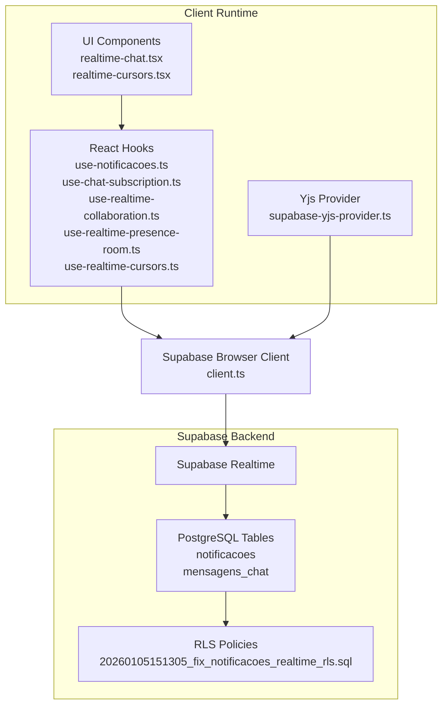
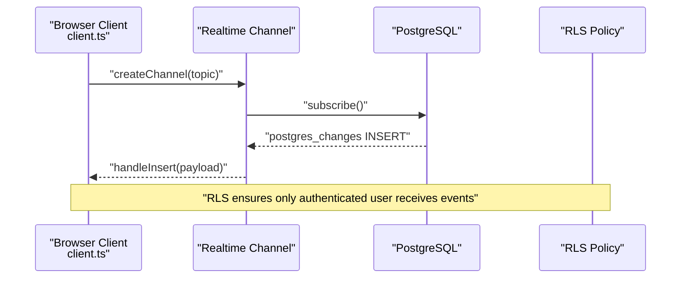
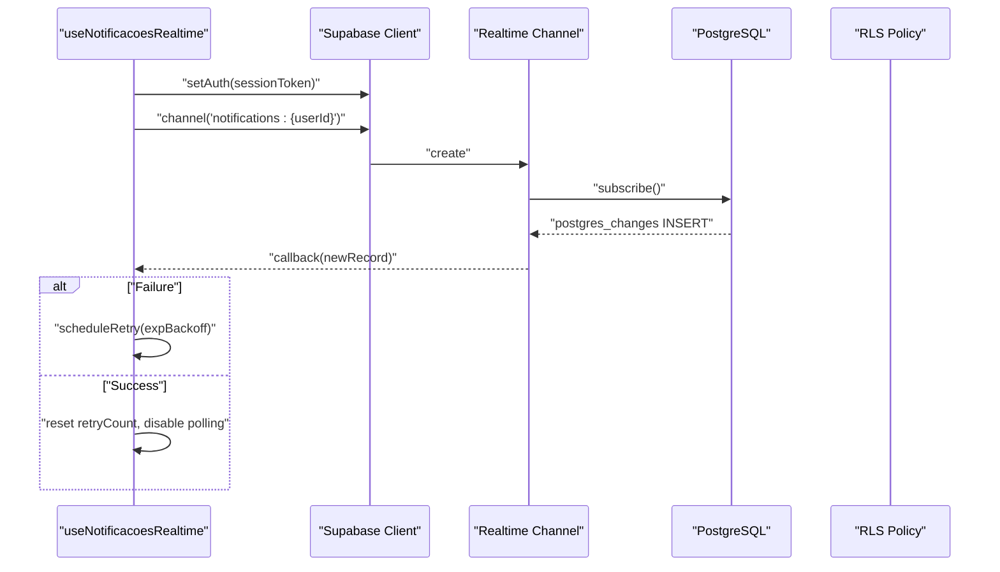
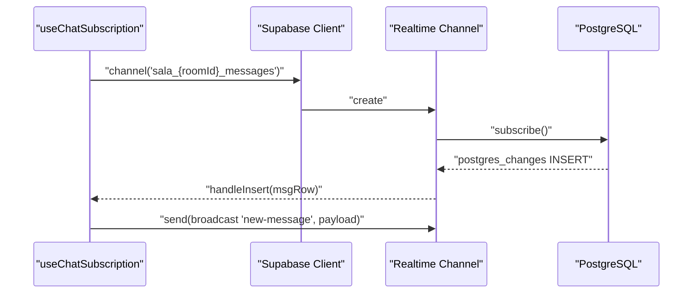
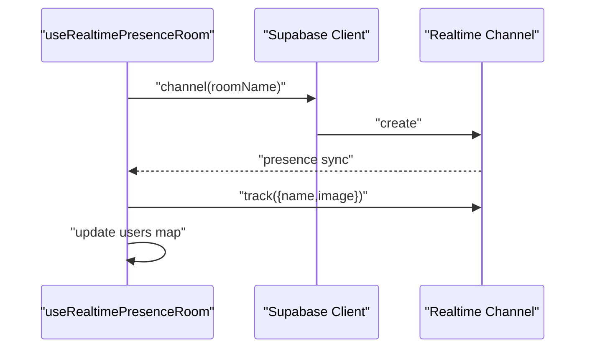
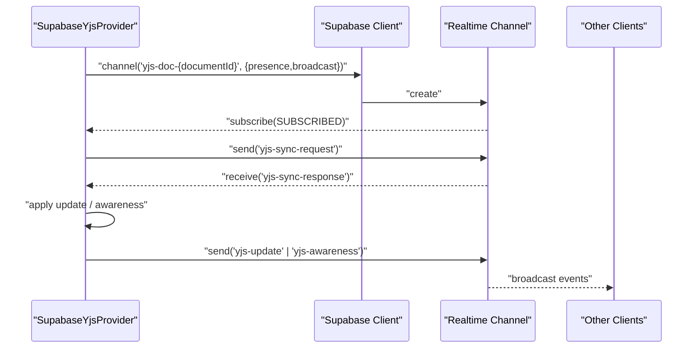
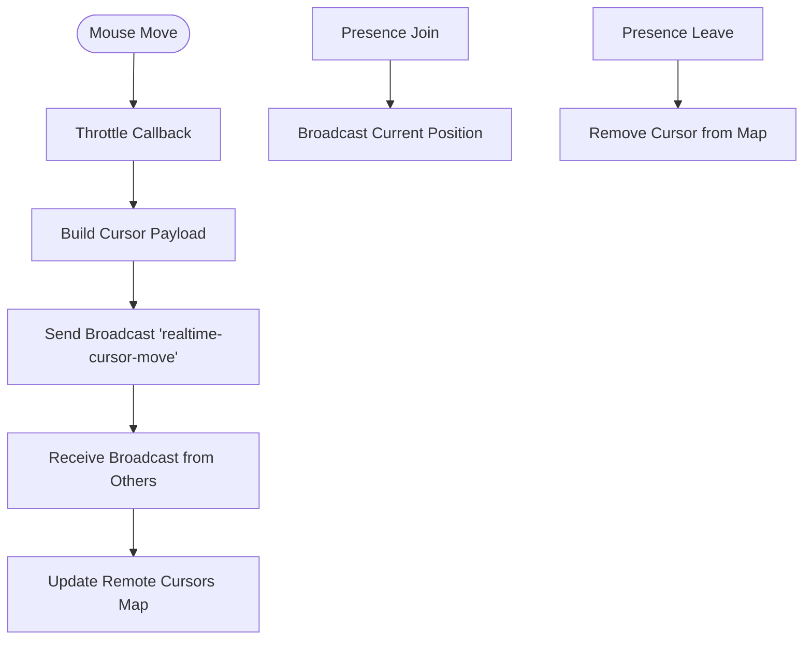
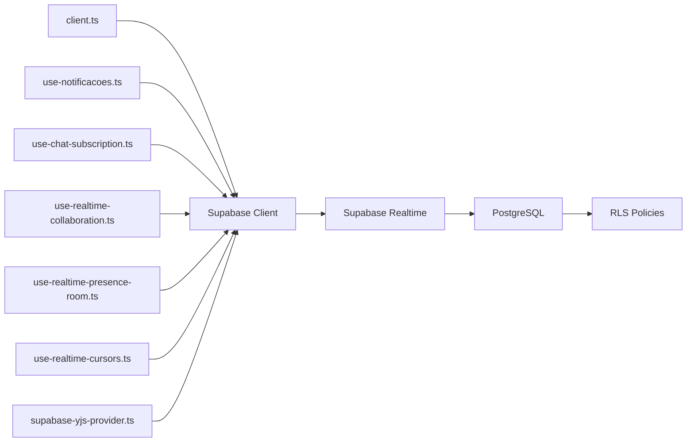

# Real-time API

<cite>
**Referenced Files in This Document**
- [client.ts](file://src/lib/supabase/client.ts)
- [use-notificacoes.ts](file://src/app/(authenticated)/notificacoes/hooks/use-notificacoes.ts)
- [use-chat-subscription.ts](file://src/app/(authenticated)/chat/hooks/use-chat-subscription.ts)
- [use-realtime-collaboration.ts](file://src/hooks/use-realtime-collaboration.ts)
- [use-realtime-presence-room.ts](file://src/hooks/use-realtime-presence-room.ts)
- [use-realtime-cursors.ts](file://src/hooks/use-realtime-cursors.ts)
- [supabase-yjs-provider.ts](file://src/lib/yjs/supabase-yjs-provider.ts)
- [realtime-chat.tsx](file://src/components/realtime/realtime-chat.tsx)
- [realtime-cursors.tsx](file://src/components/realtime/realtime-cursors.tsx)
- [config.toml](file://supabase/config.toml)
- [20260105151305_fix_notificacoes_realtime_rls.sql](file://supabase/migrations/20260105151305_fix_notificacoes_realtime_rls.sql)
</cite>

## Table of Contents
1. [Introduction](#introduction)
2. [Project Structure](#project-structure)
3. [Core Components](#core-components)
4. [Architecture Overview](#architecture-overview)
5. [Detailed Component Analysis](#detailed-component-analysis)
6. [Dependency Analysis](#dependency-analysis)
7. [Performance Considerations](#performance-considerations)
8. [Troubleshooting Guide](#troubleshooting-guide)
9. [Conclusion](#conclusion)

## Introduction
This document provides comprehensive real-time API documentation for ZattarOS, focusing on WebSocket connections and Supabase Realtime features. It covers connection establishment, subscription management, event handling patterns, presence indicators, collaborative editing, and live notifications. It also documents message formats, event types, data synchronization strategies, connection pooling, reconnection logic, error recovery mechanisms, performance considerations, bandwidth optimization, and scalability patterns for real-time features.

## Project Structure
ZattarOS implements real-time capabilities through:
- Supabase Realtime channels for live subscriptions and broadcasting
- React hooks encapsulating connection lifecycle, reconnection, and cleanup
- Presence tracking for user activity and collaborative indicators
- Collaborative editing using Yjs with a custom Supabase provider
- UI components subscribing to real-time events

**Diagram sources**
- [client.ts:204-240](file://src/lib/supabase/client.ts#L204-L240)
- [use-notificacoes.ts](file://src/app/(authenticated)/notificacoes/hooks/use-notificacoes.ts#L355-L497)
- [use-chat-subscription.ts](file://src/app/(authenticated)/chat/hooks/use-chat-subscription.ts#L181-L221)
- [use-realtime-collaboration.ts:88-181](file://src/hooks/use-realtime-collaboration.ts#L88-L181)
- [use-realtime-presence-room.ts:23-52](file://src/hooks/use-realtime-presence-room.ts#L23-L52)
- [use-realtime-cursors.ts:107-163](file://src/hooks/use-realtime-cursors.ts#L107-L163)
- [supabase-yjs-provider.ts:134-192](file://src/lib/yjs/supabase-yjs-provider.ts#L134-L192)
- [realtime-chat.tsx:14-19](file://src/components/realtime/realtime-chat.tsx#L14-L19)
- [realtime-cursors.tsx:8-9](file://src/components/realtime/realtime-cursors.tsx#L8-L9)
- [config.toml:77-83](file://supabase/config.toml#L77-L83)
- [20260105151305_fix_notificacoes_realtime_rls.sql:1-45](file://supabase/migrations/20260105151305_fix_notificacoes_realtime_rls.sql#L1-L45)

**Section sources**
- [client.ts:1-240](file://src/lib/supabase/client.ts#L1-L240)
- [config.toml:77-83](file://supabase/config.toml#L77-L83)

## Core Components
- Supabase Browser Client: Provides a singleton client with SSR-safe storage adapters and lock noise filtering to avoid auth contention warnings.
- Notification Realtime Hook: Establishes a per-user Realtime channel, listens for INSERT events on the notifications table filtered by user, and falls back to polling after retries.
- Chat Subscription Hook: Creates a room-specific channel, subscribes to INSERT events on the messages table and broadcasts for new messages, with robust status handling.
- Presence Hooks: Track user presence in rooms and sync presence state across clients.
- Collaborative Editing Provider: Implements a Yjs provider over Supabase Realtime for CRDT-based collaborative editing with awareness and sync protocols.
- Realtime Cursors Hook: Tracks and renders remote cursors with throttling and presence-driven broadcasting.

**Section sources**
- [client.ts:50-102](file://src/lib/supabase/client.ts#L50-L102)
- [use-notificacoes.ts](file://src/app/(authenticated)/notificacoes/hooks/use-notificacoes.ts#L262-L644)
- [use-chat-subscription.ts](file://src/app/(authenticated)/chat/hooks/use-chat-subscription.ts#L59-L252)
- [use-realtime-presence-room.ts:16-55](file://src/hooks/use-realtime-presence-room.ts#L16-L55)
- [use-realtime-collaboration.ts:53-242](file://src/hooks/use-realtime-collaboration.ts#L53-L242)
- [use-realtime-cursors.ts:61-177](file://src/hooks/use-realtime-cursors.ts#L61-L177)
- [supabase-yjs-provider.ts:78-337](file://src/lib/yjs/supabase-yjs-provider.ts#L78-L337)
- [realtime-chat.tsx:14-19](file://src/components/realtime/realtime-chat.tsx#L14-L19)
- [realtime-cursors.tsx:8-9](file://src/components/realtime/realtime-cursors.tsx#L8-L9)

## Architecture Overview
ZattarOS uses Supabase Realtime channels for:
- Live notifications via Postgres Changes (INSERT) filtered by user
- Room-based chat with dual-mode delivery (Postgres Changes and broadcast)
- Presence tracking with sync events
- Collaborative editing with Yjs over Realtime channels

**Diagram sources**
- [client.ts:204-240](file://src/lib/supabase/client.ts#L204-L240)
- [use-notificacoes.ts](file://src/app/(authenticated)/notificacoes/hooks/use-notificacoes.ts#L420-L468)
- [20260105151305_fix_notificacoes_realtime_rls.sql:14-37](file://supabase/migrations/20260105151305_fix_notificacoes_realtime_rls.sql#L14-L37)

## Detailed Component Analysis

### Notification Realtime
- Channel topic: notifications:{userId}
- Event: postgres_changes INSERT on public.notificacoes with filter usuario_id=eq.{userId}
- Authentication: setAuth(sessionToken) on the realtime client
- Reconnection: exponential backoff with bounded retries; on failure, activates polling
- Fallback polling: periodic counter checks to detect unread counts changes

**Diagram sources**
- [use-notificacoes.ts](file://src/app/(authenticated)/notificacoes/hooks/use-notificacoes.ts#L355-L531)
- [20260105151305_fix_notificacoes_realtime_rls.sql:14-37](file://supabase/migrations/20260105151305_fix_notificacoes_realtime_rls.sql#L14-L37)

**Section sources**
- [use-notificacoes.ts](file://src/app/(authenticated)/notificacoes/hooks/use-notificacoes.ts#L355-L531)
- [20260105151305_fix_notificacoes_realtime_rls.sql:1-45](file://supabase/migrations/20260105151305_fix_notificacoes_realtime_rls.sql#L1-L45)

### Chat Realtime
- Channel topic: sala_{roomId}_messages
- Subscriptions:
  - postgres_changes INSERT on public.mensagens_chat with filter sala_id=eq.{roomId}
  - broadcast new-message for immediate delivery
- Status handling: logs and sets isConnected based on SUBSCRIBED, CHANNEL_ERROR, TIMED_OUT, CLOSED
- Broadcast helper: send broadcast new-message payload

**Diagram sources**
- [use-chat-subscription.ts](file://src/app/(authenticated)/chat/hooks/use-chat-subscription.ts#L181-L221)

**Section sources**
- [use-chat-subscription.ts](file://src/app/(authenticated)/chat/hooks/use-chat-subscription.ts#L59-L252)

### Presence Indicators
- Presence room hook: creates a named room channel and tracks presence state
- Sync event: presence sync updates the users map
- Cleanup: unsubscribe on unmount

**Diagram sources**
- [use-realtime-presence-room.ts:23-52](file://src/hooks/use-realtime-presence-room.ts#L23-L52)

**Section sources**
- [use-realtime-presence-room.ts:16-55](file://src/hooks/use-realtime-presence-room.ts#L16-L55)

### Collaborative Editing (Yjs)
- Channel topic: yjs-doc-{documentId}
- Events:
  - yjs-update: propagate Yjs document updates
  - yjs-sync-request: request full state from peers
  - yjs-sync-response: apply full state
  - yjs-awareness: propagate awareness updates
- Presence: configured with presence key derived from user id
- Sync protocol: initial sync request with timeout fallback

**Diagram sources**
- [supabase-yjs-provider.ts:134-192](file://src/lib/yjs/supabase-yjs-provider.ts#L134-L192)
- [supabase-yjs-provider.ts:255-271](file://src/lib/yjs/supabase-yjs-provider.ts#L255-L271)
- [supabase-yjs-provider.ts:276-289](file://src/lib/yjs/supabase-yjs-provider.ts#L276-L289)
- [supabase-yjs-provider.ts:311-324](file://src/lib/yjs/supabase-yjs-provider.ts#L311-L324)

**Section sources**
- [supabase-yjs-provider.ts:78-337](file://src/lib/yjs/supabase-yjs-provider.ts#L78-L337)

### Real-time Cursors
- Channel topic: roomName
- Presence join/leave events trigger cursor broadcasting/removal
- Broadcast event: realtime-cursor-move with position, user, color, timestamp
- Throttling: mousemove events throttled to reduce bandwidth

**Diagram sources**
- [use-realtime-cursors.ts:77-105](file://src/hooks/use-realtime-cursors.ts#L77-L105)
- [use-realtime-cursors.ts:107-163](file://src/hooks/use-realtime-cursors.ts#L107-L163)

**Section sources**
- [use-realtime-cursors.ts:61-177](file://src/hooks/use-realtime-cursors.ts#L61-L177)
- [realtime-cursors.tsx:8-9](file://src/components/realtime/realtime-cursors.tsx#L8-L9)

### Real-time Chat Component
- Uses useRealtimeChat to manage messages, typing indicators, and connection state
- Sends messages via broadcast and handles duplicates

**Section sources**
- [realtime-chat.tsx:14-19](file://src/components/realtime/realtime-chat.tsx#L14-L19)
- [use-realtime-chat.tsx:59-151](file://src/hooks/use-realtime-chat.tsx#L59-L151)

## Dependency Analysis
- Supabase Client Dependencies:
  - createBrowserClient for browser
  - SSR-safe userStorage and cookie methods
  - Lock noise filtering to prevent auth contention warnings
- Realtime Channels:
  - Per-feature channels with distinct topics
  - Presence and broadcast configurations
- Database and Policies:
  - RLS policies optimized for Realtime compatibility
  - Publication and schema visibility for postgres_changes

**Diagram sources**
- [client.ts:204-240](file://src/lib/supabase/client.ts#L204-L240)
- [use-notificacoes.ts](file://src/app/(authenticated)/notificacoes/hooks/use-notificacoes.ts#L355-L497)
- [use-chat-subscription.ts](file://src/app/(authenticated)/chat/hooks/use-chat-subscription.ts#L181-L221)
- [use-realtime-collaboration.ts:88-181](file://src/hooks/use-realtime-collaboration.ts#L88-L181)
- [use-realtime-presence-room.ts:23-52](file://src/hooks/use-realtime-presence-room.ts#L23-L52)
- [use-realtime-cursors.ts:107-163](file://src/hooks/use-realtime-cursors.ts#L107-L163)
- [supabase-yjs-provider.ts:134-192](file://src/lib/yjs/supabase-yjs-provider.ts#L134-L192)
- [20260105151305_fix_notificacoes_realtime_rls.sql:14-37](file://supabase/migrations/20260105151305_fix_notificacoes_realtime_rls.sql#L14-L37)

**Section sources**
- [client.ts:1-240](file://src/lib/supabase/client.ts#L1-L240)
- [config.toml:77-83](file://supabase/config.toml#L77-L83)
- [20260105151305_fix_notificacoes_realtime_rls.sql:1-45](file://supabase/migrations/20260105151305_fix_notificacoes_realtime_rls.sql#L1-L45)

## Performance Considerations
- Connection pooling and concurrency:
  - Supabase Realtime is enabled and configured; ensure adequate client concurrency and avoid excessive channel creation.
- Bandwidth optimization:
  - Use throttling for cursor movement to reduce broadcast frequency.
  - Prefer broadcast for immediate delivery and postgres_changes for reliable persistence.
  - Minimize payload sizes (e.g., cursor position only).
- Reconnection and resilience:
  - Exponential backoff reduces server load during transient failures.
  - Fallback polling prevents UX degradation when Realtime is unavailable.
- Presence and awareness:
  - Presence sync updates are efficient; avoid unnecessary re-tracking.
- Yjs synchronization:
  - Initial sync request with timeout fallback prevents indefinite waiting.
  - Awareness updates are sent only when changed.

[No sources needed since this section provides general guidance]

## Troubleshooting Guide
Common issues and resolutions:
- Realtime authentication errors:
  - Ensure sessionToken is provided; the client updates realtime auth dynamically.
  - Check for benign lock contention warnings and verify lock noise filtering is active.
- Channel subscription failures:
  - Verify postgres_changes filters match table schema and column names.
  - Confirm RLS policies allow authenticated access for the target user.
- Presence inconsistencies:
  - Ensure track is called upon SUBSCRIBED and cleanup on unmount.
- Cursor anomalies:
  - Throttle mousemove events; verify presence join/leave events are handled.
- Yjs sync issues:
  - Monitor sync request/response events; ensure full state is applied on response.
- Polling fallback:
  - When Realtime fails, polling continues with reduced frequency to minimize I/O.

**Section sources**
- [use-notificacoes.ts](file://src/app/(authenticated)/notificacoes/hooks/use-notificacoes.ts#L382-L394)
- [use-notificacoes.ts](file://src/app/(authenticated)/notificacoes/hooks/use-notificacoes.ts#L481-L491)
- [use-chat-subscription.ts](file://src/app/(authenticated)/chat/hooks/use-chat-subscription.ts#L203-L220)
- [use-realtime-presence-room.ts:38-47](file://src/hooks/use-realtime-presence-room.ts#L38-L47)
- [use-realtime-cursors.ts:107-163](file://src/hooks/use-realtime-cursors.ts#L107-L163)
- [supabase-yjs-provider.ts:255-271](file://src/lib/yjs/supabase-yjs-provider.ts#L255-L271)
- [client.ts:50-102](file://src/lib/supabase/client.ts#L50-L102)

## Conclusion
ZattarOS leverages Supabase Realtime to deliver robust, scalable real-time features. The architecture combines per-feature channels, presence tracking, collaborative editing with Yjs, and resilient fallbacks. By following the documented patterns for connection management, event handling, and error recovery, teams can maintain high-quality real-time experiences while optimizing performance and minimizing operational overhead.