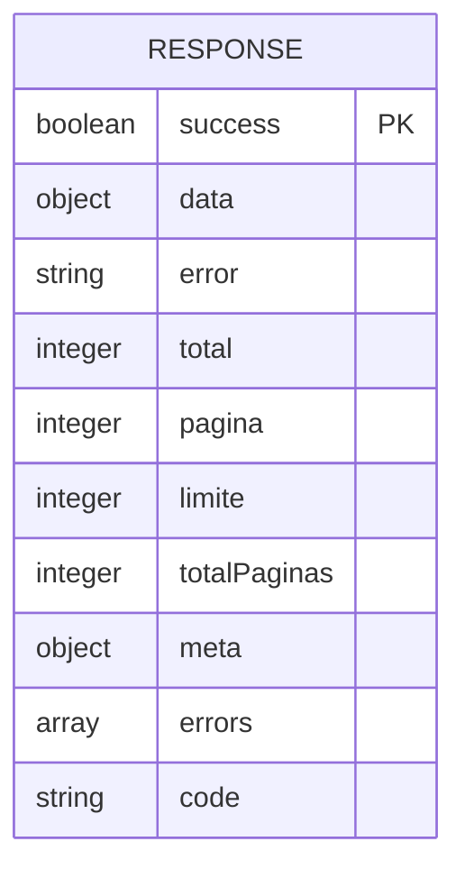
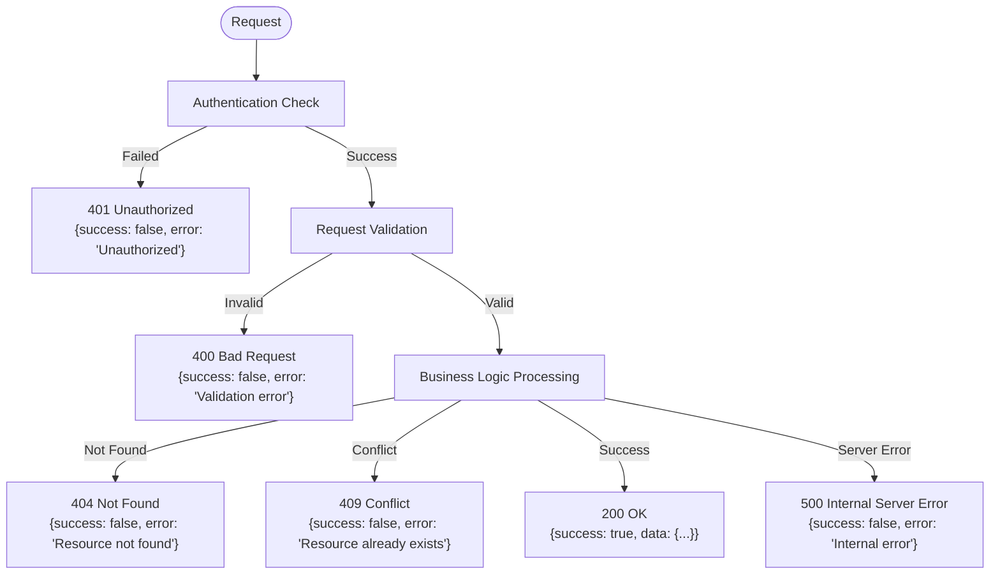
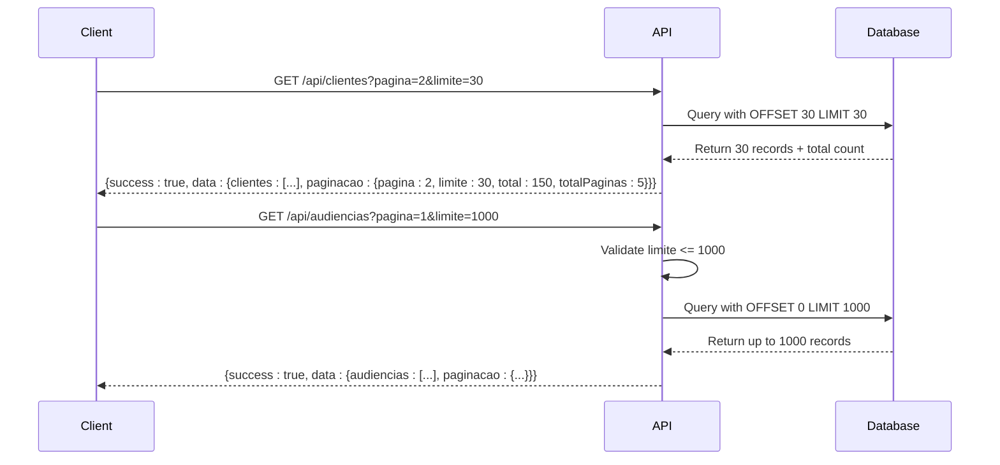

# Response Formats

<cite>
**Referenced Files in This Document**   
- [route.ts](file://app/api/clientes/route.ts)
- [route.ts](file://app/api/audiencias/route.ts)
- [route.ts](file://app/api/contratos/route.ts)
- [spec.md](file://openspec/changes/archive/2025-11-23-add-representantes-backend/specs/api-routes/spec.md)
- [page.tsx](file://app/ajuda/desenvolvimento/api-referencia/page.tsx)
- [api-auth.ts](file://backend/auth/api-auth.ts)
- [representantes-persistence.service.ts](file://backend/representantes/services/representantes-persistence.service.ts)
- [listar-audiencias.service.ts](file://backend/audiencias/services/listar-audiencias.service.ts)
- [criar-cliente.service.ts](file://backend/clientes/services/clientes/criar-cliente.service.ts)
- [criar-contrato.service.ts](file://backend/contratos/services/contratos/criar-contrato.service.ts)
</cite>

## Table of Contents
1. [Introduction](#introduction)
2. [Standard Response Structure](#standard-response-structure)
3. [Success Responses](#success-responses)
4. [Error Responses](#error-responses)
5. [Pagination Format](#pagination-format)
6. [Validation Error Details](#validation-error-details)
7. [HTTP Status Codes](#http-status-codes)
8. [Response Serialization](#response-serialization)
9. [Error Handling Middleware](#error-handling-middleware)
10. [Frontend Response Processing](#frontend-response-processing)
11. [Content Negotiation](#content-negotiation)
12. [Batch Operation Responses](#batch-operation-responses)
13. [Examples](#examples)

## Introduction
The Sinesys system implements a standardized API response format across all endpoints to ensure consistency and predictability for clients. This documentation details the response structure, error handling patterns, pagination strategy, and implementation details for API responses. The system follows REST principles with JSON serialization and provides comprehensive error information while maintaining security by not exposing sensitive internal details.

**Section sources**
- [spec.md](file://openspec/changes/archive/2025-11-23-add-representantes-backend/specs/api-routes/spec.md)
- [page.tsx](file://app/ajuda/desenvolvimento/api-referencia/page.tsx)

## Standard Response Structure
All API responses in the Sinesys system follow a consistent structure with standardized fields. The response format is designed to provide clear success/error status, data payload, and additional metadata when applicable. The core structure includes the following fields:

- `success`: boolean indicating whether the operation was successful
- `data`: object or array containing the primary response data (present on success)
- `error`: string containing error message (present on failure)
- Additional metadata fields for specific scenarios (pagination, validation errors, etc.)

This standardized approach ensures that clients can consistently handle responses regardless of the specific endpoint being called.



**Diagram sources **
- [spec.md](file://openspec/changes/archive/2025-11-23-add-representantes-backend/specs/api-routes/spec.md)
- [page.tsx](file://app/ajuda/desenvolvimento/api-referencia/page.tsx)

**Section sources**
- [spec.md](file://openspec/changes/archive/2025-11-23-add-representantes-backend/specs/api-routes/spec.md)
- [page.tsx](file://app/ajuda/desenvolvimento/api-referencia/page.tsx)

## Success Responses
Successful responses follow a consistent pattern with the `success` field set to `true` and the `data` field containing the requested information. The structure of the `data` field varies depending on the endpoint and operation type.

For collection endpoints (list operations), the `data` field contains an object with the collection and pagination information:

```json
{
  "success": true,
  "data": {
    "clientes": [
      {
        "id": 1,
        "nome": "João Silva",
        "cpf": "12345678901"
      }
    ],
    "paginacao": {
      "pagina": 1,
      "limite": 50,
      "total": 100,
      "totalPaginas": 2
    }
  }
}
```

For single resource operations (create, update, get by ID), the `data` field contains the resource object directly:

```json
{
  "success": true,
  "data": {
    "id": 1,
    "nome": "João Silva",
    "cpf": "12345678901"
  }
}
```

For operations that don't return data (delete, status updates), the response contains only the success flag:

```json
{
  "success": true
}
```

**Section sources**
- [route.ts](file://app/api/clientes/route.ts)
- [route.ts](file://app/api/audiencias/route.ts)
- [route.ts](file://app/api/contratos/route.ts)

## Error Responses
Error responses in the Sinesys system follow a standardized format with the `success` field set to `false` and the `error` field containing a descriptive error message. The system returns appropriate HTTP status codes along with the JSON error response.

The error response structure is consistent across all endpoints:

```json
{
  "success": false,
  "error": "Descriptive error message"
}
```

For certain error types, additional context may be provided:

```json
{
  "success": false,
  "error": "Campo obrigatório: cpf é obrigatório para pessoa física",
  "code": "VALIDATION_ERROR"
}
```

The system ensures that error messages are user-friendly and do not expose sensitive information such as stack traces or database details.



**Diagram sources **
- [spec.md](file://openspec/changes/archive/2025-11-23-add-representantes-backend/specs/api-routes/spec.md)
- [api-auth.ts](file://backend/auth/api-auth.ts)

**Section sources**
- [spec.md](file://openspec/changes/archive/2025-11-23-add-representantes-backend/specs/api-routes/spec.md)
- [api-auth.ts](file://backend/auth/api-auth.ts)

## Pagination Format
The Sinesys system implements offset-based pagination for collection endpoints. This approach is used consistently across all list operations to handle large datasets efficiently.

The pagination parameters are passed as query parameters:

- `pagina`: Page number (1-based, default: 1)
- `limite`: Items per page (default: 50, maximum: 1000)

The response includes pagination metadata in the `data.paginacao` object:

```json
{
  "success": true,
  "data": {
    "audiencias": [...],
    "paginacao": {
      "pagina": 1,
      "limite": 50,
      "total": 237,
      "totalPaginas": 5
    }
  }
}
```

The system validates pagination parameters and returns appropriate error responses for invalid values:

```json
{
  "success": false,
  "error": "Parâmetro 'pagina' deve ser maior ou igual a 1"
}
```



**Diagram sources **
- [route.ts](file://app/api/clientes/route.ts)
- [route.ts](file://app/api/audiencias/route.ts)
- [listar-audiencias.service.ts](file://backend/audiencias/services/listar-audiencias.service.ts)

**Section sources**
- [route.ts](file://app/api/clientes/route.ts)
- [route.ts](file://app/api/audiencias/route.ts)
- [listar-audiencias.service.ts](file://backend/audiencias/services/listar-audiencias.service.ts)

## Validation Error Details
While the standard error response includes a descriptive message, certain endpoints provide additional validation context. Validation errors occur when request data fails schema validation, business rules, or constraints.

Common validation error scenarios include:

- Missing required fields
- Invalid data types
- Format violations (e.g., invalid CPF/CNPJ)
- Business rule violations
- Unique constraint conflicts

The system returns specific error messages that help clients understand and correct the issue:

```json
{
  "success": false,
  "error": "Campo obrigatório: cpf é obrigatório para pessoa física"
}
```

```json
{
  "success": false,
  "error": "Representante já cadastrado para esta parte neste processo"
}
```

```json
{
  "success": false,
  "error": "Parâmetro 'pagina' deve ser maior ou igual a 1"
}
```

The validation is performed at multiple levels:
1. Request parameter validation
2. Request body schema validation
3. Business rule validation
4. Database constraint validation

**Section sources**
- [spec.md](file://openspec/changes/archive/2025-11-23-add-representantes-backend/specs/api-routes/spec.md)
- [route.ts](file://app/api/clientes/route.ts)
- [criar-cliente.service.ts](file://backend/clientes/services/clientes/criar-cliente.service.ts)

## HTTP Status Codes
The Sinesys API uses standard HTTP status codes to indicate the result of operations. Each status code is accompanied by a JSON response body with the standardized response format.

| Status Code | Meaning | Response Example |
|-------------|-------|------------------|
| 200 | OK | `{ "success": true, "data": {...} }` |
| 201 | Created | `{ "success": true, "data": {...} }` |
| 400 | Bad Request | `{ "success": false, "error": "Validation error" }` |
| 401 | Unauthorized | `{ "success": false, "error": "Unauthorized" }` |
| 403 | Forbidden | `{ "success": false, "error": "Forbidden" }` |
| 404 | Not Found | `{ "success": false, "error": "Resource not found" }` |
| 409 | Conflict | `{ "success": false, "error": "Resource already exists" }` |
| 429 | Too Many Requests | `{ "success": false, "error": "Rate limit exceeded" }` |
| 500 | Internal Server Error | `{ "success": false, "error": "Internal error" }` |

The system maps business logic outcomes to appropriate HTTP status codes:
- 400 for client-side validation errors
- 401 for authentication failures
- 403 for authorization failures
- 404 for non-existent resources
- 409 for unique constraint violations
- 500 for unexpected server errors

**Section sources**
- [spec.md](file://openspec/changes/archive/2025-11-23-add-representantes-backend/specs/api-routes/spec.md)
- [page.tsx](file://app/ajuda/desenvolvimento/api-referencia/page.tsx)

## Response Serialization
The Sinesys system uses JSON as the primary serialization format for API responses. All endpoints return data in JSON format with the `Content-Type: application/json` header.

Key serialization characteristics:
- All responses are UTF-8 encoded
- Dates are formatted in ISO 8601 format (YYYY-MM-DDTHH:MM:SSZ)
- Numbers are serialized as native JSON numbers
- Booleans are serialized as `true`/`false`
- Null values are preserved as `null`

The system ensures consistent field naming using snake_case convention across all responses:

```json
{
  "success": true,
  "data": {
    "id": 1,
    "nome": "João Silva",
    "cpf": "12345678901",
    "data_nascimento": "1980-01-01T00:00:00Z",
    "ativo": true
  }
}
```

Response serialization is handled by the Next.js framework with custom formatting applied in service layers before returning to the client.

**Section sources**
- [route.ts](file://app/api/clientes/route.ts)
- [route.ts](file://app/api/audiencias/route.ts)
- [route.ts](file://app/api/contratos/route.ts)

## Error Handling Middleware
The Sinesys system implements comprehensive error handling middleware to ensure consistent error responses. The error handling occurs at multiple levels:

1. **Authentication Layer**: Handled by `authenticateRequest` utility
2. **Validation Layer**: Request parameter and body validation
3. **Business Logic Layer**: Service-level error handling
4. **Database Layer**: Persistence error handling
5. **Global Error Handler**: Catch-all for unhandled exceptions

The `authenticateRequest` function serves as the primary authentication middleware, supporting multiple authentication methods:

```typescript
export async function authenticateRequest(
  request: NextRequest
): Promise<AuthResult> {
  // 1. Service API Key check
  // 2. Bearer Token check
  // 3. Session cookie check
}
```

Error handling follows a consistent pattern in route handlers:

```typescript
try {
  // Business logic
  return NextResponse.json({ success: true, data: result });
} catch (error) {
  console.error('Error message:', error);
  const erroMsg = error instanceof Error ? error.message : 'Internal error';
  return NextResponse.json({ error: erroMsg }, { status: 500 });
}
```

The system prioritizes security by not exposing stack traces or internal implementation details in error responses.

**Section sources**
- [api-auth.ts](file://backend/auth/api-auth.ts)
- [route.ts](file://app/api/clientes/route.ts)
- [route.ts](file://app/api/audiencias/route.ts)

## Frontend Response Processing
The frontend client processes API responses consistently across the application. The response handling is implemented in API service utilities and React hooks that abstract the response format details from components.

Key aspects of frontend response processing:

- **Type Safety**: TypeScript interfaces define response structures
- **Error Handling**: Centralized error handling with user-friendly messages
- **Loading States**: Loading indicators during request processing
- **Retry Logic**: Automatic retry for certain error types
- **Caching**: Response caching to improve performance

The system uses React hooks like `use-clientes.ts`, `use-audiencias.ts`, and `use-contratos.ts` to encapsulate API interactions:

```typescript
function useClientes(params: ListarClientesParams) {
  const [data, setData] = useState<ListarClientesResult | null>(null);
  const [loading, setLoading] = useState(true);
  const [error, setError] = useState<string | null>(null);
  
  useEffect(() => {
    async function fetchData() {
      try {
        const response = await fetch(`/api/clientes?${params}`);
        const json = await response.json();
        
        if (json.success) {
          setData(json.data);
        } else {
          setError(json.error);
        }
      } catch (err) {
        setError('Failed to fetch clients');
      } finally {
        setLoading(false);
      }
    }
    
    fetchData();
  }, [params]);
  
  return { data, loading, error };
}
```

This approach ensures consistent response handling and reduces code duplication across components.

**Section sources**
- [route.ts](file://app/api/clientes/route.ts)
- [route.ts](file://app/api/audiencias/route.ts)
- [route.ts](file://app/api/contratos/route.ts)

## Content Negotiation
The Sinesys API supports content negotiation through standard HTTP headers. While JSON is the primary and default response format, the system respects the `Accept` header when determining response format.

Key content negotiation features:

- **Accept Header**: Clients can specify preferred response format
- **Content-Type Header**: Responses include `Content-Type: application/json`
- **Default Format**: JSON is the default and only supported format
- **Charset**: UTF-8 encoding is used for all responses

The system validates the `Accept` header and returns appropriate responses:

```http
GET /api/clientes HTTP/1.1
Accept: application/json
```

```http
HTTP/1.1 200 OK
Content-Type: application/json; charset=utf-8
Content-Length: 1234

{
  "success": true,
  "data": [...]
}
```

For unsupported formats, the system returns a 406 Not Acceptable response:

```json
{
  "success": false,
  "error": "Unsupported media type"
}
```

**Section sources**
- [route.ts](file://app/api/clientes/route.ts)
- [route.ts](file://app/api/audiencias/route.ts)

## Batch Operation Responses
For operations that process multiple items, the Sinesys system provides detailed response information about individual successes and failures. This allows clients to understand which items were processed successfully and which encountered errors.

Batch operation responses include:

- Overall success status
- Count of processed items
- Count of successful operations
- Count of failed operations
- Detailed error information for failed items

```json
{
  "success": true,
  "data": {
    "totalProcessados": 5,
    "totalSucessos": 4,
    "totalErros": 1,
    "elementos": [
      {
        "tipo": "cliente",
        "identificador": "123",
        "nome": "João Silva",
        "sucesso": true,
        "acao": "atualizado"
      },
      {
        "tipo": "cliente",
        "identificador": "456",
        "nome": "Maria Santos",
        "sucesso": false,
        "acao": "erro",
        "erro": "Cliente não encontrado"
      }
    ]
  }
}
```

This detailed response format enables clients to provide granular feedback to users and implement retry logic for failed items.

**Section sources**
- [route.ts](file://app/api/captura/recovery/reprocess/route.ts)

## Examples
This section provides concrete examples of API responses for common scenarios.

### Successful Responses

**Client List (Paginated)**
```json
{
  "success": true,
  "data": {
    "clientes": [
      {
        "id": 1,
        "nome": "João Silva",
        "cpf": "12345678901",
        "email": "joao@email.com",
        "telefone_primario": "(11) 99999-9999"
      }
    ],
    "paginacao": {
      "pagina": 1,
      "limite": 50,
      "total": 100,
      "totalPaginas": 2
    }
  }
}
```

**Single Client Creation**
```json
{
  "success": true,
  "data": {
    "id": 1,
    "nome": "João Silva",
    "cpf": "12345678901",
    "email": "joao@email.com",
    "created_at": "2025-01-01T10:00:00Z"
  }
}
```

**Contract Creation**
```json
{
  "success": true,
  "data": {
    "id": 1,
    "area_direito": "trabalhista",
    "tipo_contrato": "ajuizamento",
    "cliente_id": 1,
    "valor_honorarios": 5000.00
  }
}
```

### Error Responses

**400 Validation Error**
```json
{
  "success": false,
  "error": "Campo obrigatório: cpf é obrigatório para pessoa física"
}
```

**401 Unauthorized**
```json
{
  "success": false,
  "error": "Autenticação necessária"
}
```

**403 Forbidden**
```json
{
  "success": false,
  "error": "Permissão negada"
}
```

**404 Not Found**
```json
{
  "success": false,
  "error": "Cliente não encontrado"
}
```

**422 Unprocessable Entity**
```json
{
  "success": false,
  "error": "CPF inválido: dígitos verificadores não conferem"
}
```

**500 Internal Server Error**
```json
{
  "success": false,
  "error": "Erro ao processar requisição"
}
```

**Batch Operation Response**
```json
{
  "success": true,
  "data": {
    "mongoId": "abc123",
    "numeroProcesso": "1234567-89.2024.5.03.0001",
    "sucesso": true,
    "totalProcessados": 3,
    "totalSucessos": 2,
    "totalErros": 1,
    "elementos": [
      {
        "tipo": "endereco",
        "identificador": "1",
        "nome": "Endereço Principal",
        "sucesso": true,
        "acao": "criado"
      },
      {
        "tipo": "parte",
        "identificador": "2",
        "nome": "Cliente XYZ",
        "sucesso": false,
        "acao": "erro",
        "erro": "Parte já existe"
      }
    ]
  }
}
```

**Section sources**
- [route.ts](file://app/api/clientes/route.ts)
- [route.ts](file://app/api/audiencias/route.ts)
- [route.ts](file://app/api/contratos/route.ts)
- [spec.md](file://openspec/changes/archive/2025-11-23-add-representantes-backend/specs/api-routes/spec.md)
- [page.tsx](file://app/ajuda/desenvolvimento/api-referencia/page.tsx)