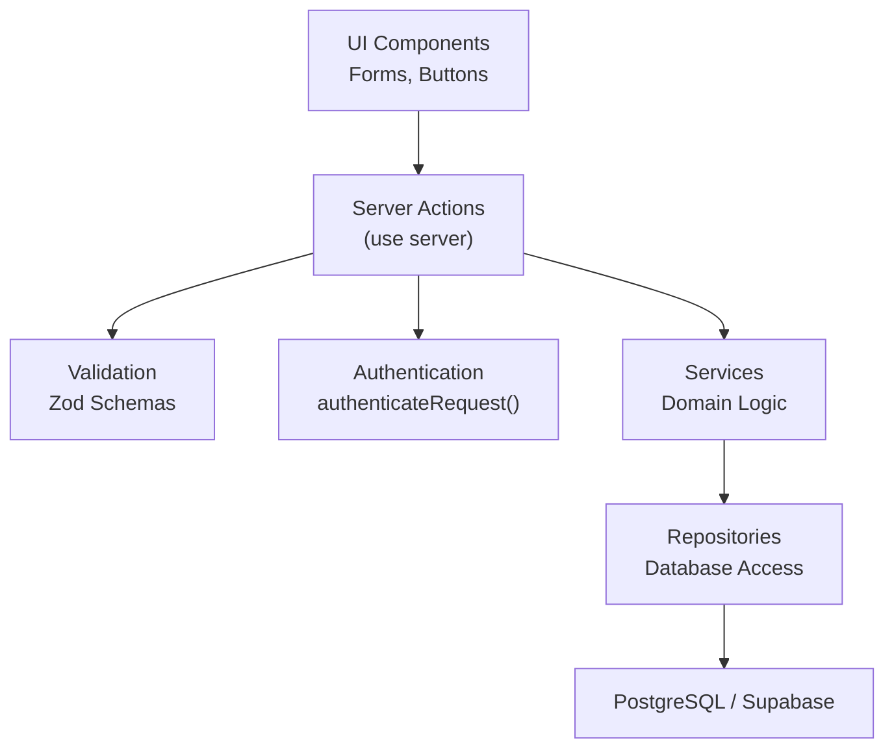
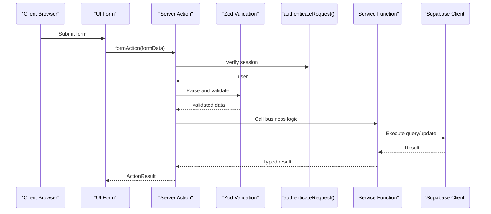
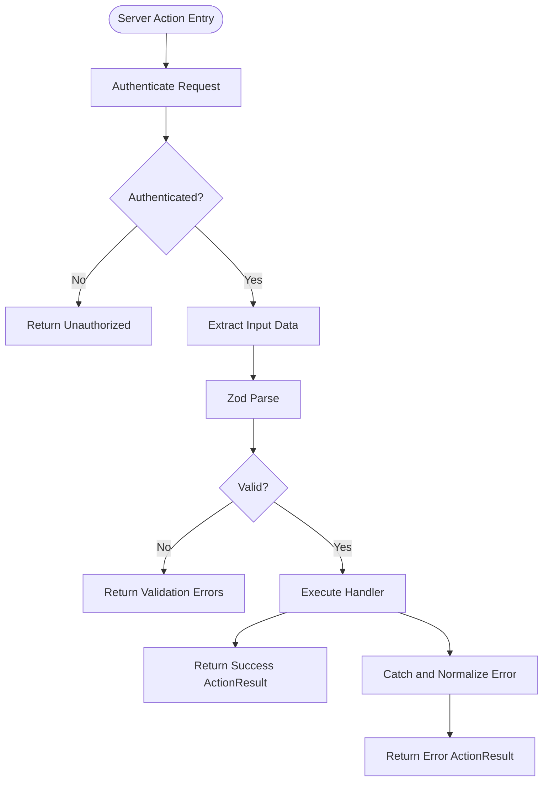
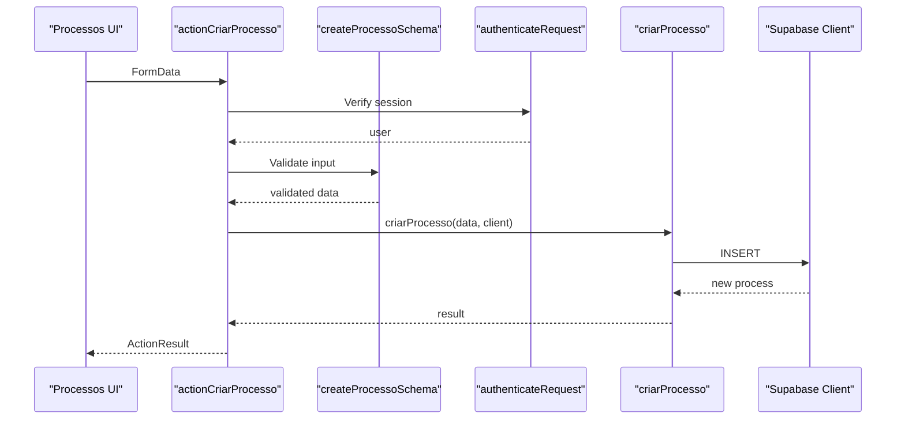
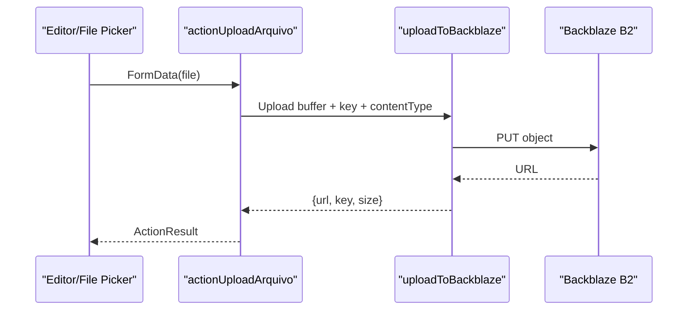
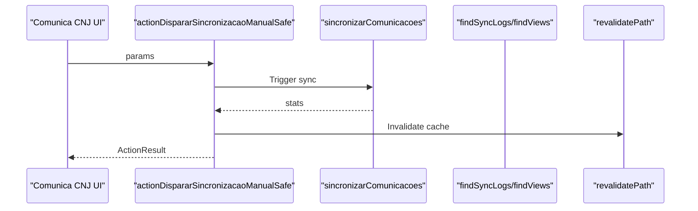
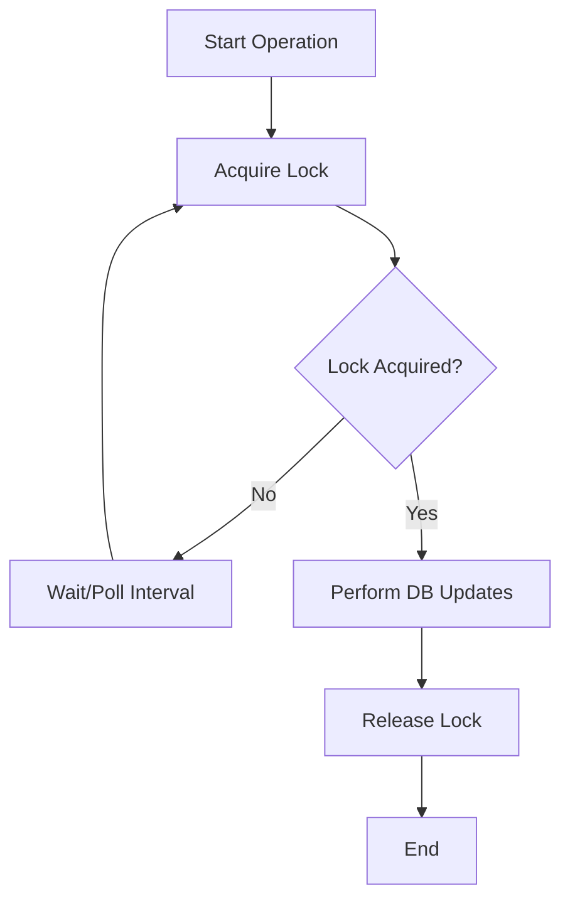
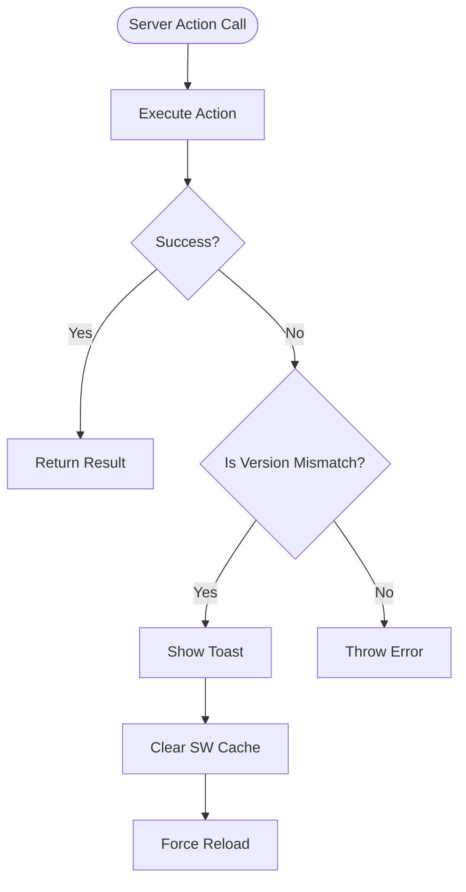
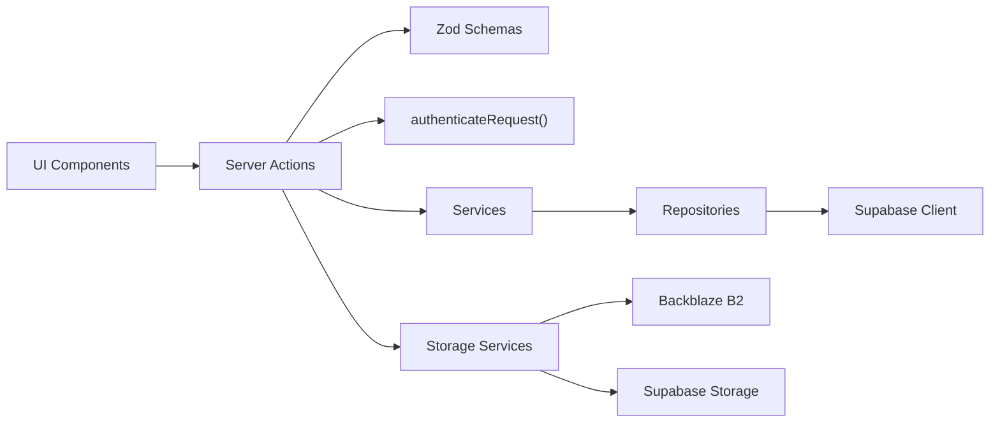

# Server Actions

<cite>
**Referenced Files in This Document**
- [safe-action.ts](file://src/lib/safe-action.ts)
- [server-action-error-handler.ts](file://src/lib/server-action-error-handler.ts)
- [sw.ts](file://src/app/sw.ts)
- [server-action-version-guard.tsx](file://src/components/providers/server-action-version-guard.tsx)
- [safe-actions.ts](file://src/app/(authenticated)/comunica-cnj/actions/safe-actions.ts)
- [file-actions.ts](file://src/app/(authenticated)/chat/actions/file-actions.ts)
- [arquivos-actions.ts](file://src/app/(authenticated)/documentos/actions/arquivos-actions.ts)
- [index.ts](file://src/app/(authenticated)/processos/actions/index.ts)
- [types.ts](file://src/app/(authenticated)/processos/actions/types.ts)
- [use-document-uploads.ts](file://src/app/(authenticated)/documentos/hooks/use-document-uploads.ts)
- [use-editor-upload.tsx](file://src/hooks/use-editor-upload.tsx)
- [b2-upload.service.ts](file://src/app/(authenticated)/documentos/services/b2-upload.service.ts)
- [supabase-storage.service.ts](file://src/lib/storage/supabase-storage.service.ts)
- [storage.service.ts](file://src/shared/assinatura-digital/services/storage.service.ts)
- [distributed-lock.ts](file://src/lib/utils/locks/distributed-lock.ts)
- [security-headers.ts](file://src/middleware/security-headers.ts)
- [actions.integration.test.ts](file://src/app/(authenticated)/documentos/__tests__/integration/arquivos-actions.integration.test.ts)
- [safe-action.test.ts](file://src/lib/__tests__/integration/safe-action.test.ts)
- [admin-actions.test.ts](file://src/app/(authenticated)/admin/__tests__/actions/admin-actions.test.ts)
- [rh-actions.test.ts](file://src/app/(authenticated)/rh/__tests__/actions/rh-actions.test.ts)
</cite>

## Table of Contents
1. [Introduction](#introduction)
2. [Project Structure](#project-structure)
3. [Core Components](#core-components)
4. [Architecture Overview](#architecture-overview)
5. [Detailed Component Analysis](#detailed-component-analysis)
6. [Dependency Analysis](#dependency-analysis)
7. [Performance Considerations](#performance-considerations)
8. [Troubleshooting Guide](#troubleshooting-guide)
9. [Conclusion](#conclusion)

## Introduction
This document explains the Next.js Server Actions architecture used in ZattarOS. It covers the server action pattern, form handling, data validation, and security considerations. It documents the layered architecture from UI components through server actions to services and repositories, and includes examples of CRUD operations, file uploads, and complex workflows. It also details error handling, transaction management, and performance optimization techniques, along with security patterns such as CSRF protection, input sanitization, and authorization checks.

## Project Structure
ZattarOS organizes server actions by feature under the app directory. Each feature module exposes server actions that:
- Authenticate requests
- Validate inputs using Zod schemas
- Delegate to service layer functions
- Revalidate cache paths
- Return typed ActionResult responses

**Diagram sources**
- [safe-action.ts:118-175](file://src/lib/safe-action.ts#L118-L175)
- [safe-actions.ts](file://src/app/(authenticated)/comunica-cnj/actions/safe-actions.ts#L79-L144)
- [index.ts](file://src/app/(authenticated)/processos/actions/index.ts#L264-L323)

**Section sources**
- [safe-action.ts:118-175](file://src/lib/safe-action.ts#L118-L175)
- [safe-actions.ts](file://src/app/(authenticated)/comunica-cnj/actions/safe-actions.ts#L79-L144)
- [index.ts](file://src/app/(authenticated)/processos/actions/index.ts#L264-L323)

## Core Components
- Safe Action Wrappers: Provide consistent authentication, validation, error handling, and response formatting.
- Feature Actions: Implement CRUD and complex workflows for specific domains (e.g., Processos, Documentos, Chat).
- File Upload Services: Handle secure uploads to storage backends (Backblaze B2, Supabase Storage).
- Error Handler: Centralized logic to detect and handle version mismatch errors for robust deployments.
- Security Headers: CSP and other headers applied via middleware to mitigate XSS and related threats.

**Section sources**
- [safe-action.ts:118-175](file://src/lib/safe-action.ts#L118-L175)
- [safe-actions.ts](file://src/app/(authenticated)/comunica-cnj/actions/safe-actions.ts#L79-L144)
- [file-actions.ts](file://src/app/(authenticated)/chat/actions/file-actions.ts#L29-L93)
- [server-action-error-handler.ts:7-53](file://src/lib/server-action-error-handler.ts#L7-L53)

## Architecture Overview
The system follows a layered architecture:
- UI: React components submit forms that trigger server actions.
- Server Actions: Validate, authenticate, and orchestrate service calls.
- Services: Encapsulate business logic and coordinate repositories.
- Repositories: Perform database operations with Supabase client.
- Storage: Securely upload and manage files using standardized services.

**Diagram sources**
- [safe-action.ts:118-175](file://src/lib/safe-action.ts#L118-L175)
- [index.ts](file://src/app/(authenticated)/processos/actions/index.ts#L264-L323)

## Detailed Component Analysis

### Safe Action Pattern and Validation
The safe-action wrapper ensures:
- Authentication via a session check
- Zod schema parsing and error formatting
- Consistent ActionResult responses
- Error handling with structured messages

**Diagram sources**
- [safe-action.ts:118-175](file://src/lib/safe-action.ts#L118-L175)

**Section sources**
- [safe-action.ts:118-175](file://src/lib/safe-action.ts#L118-L175)
- [safe-action.test.ts:191-232](file://src/lib/__tests__/integration/safe-action.test.ts#L191-L232)

### CRUD Operations Example: Processos
The Processos module demonstrates robust CRUD with:
- Zod schemas for create/update
- Manual authentication checks
- Supabase client creation
- Cache revalidation
- Unified response types

**Diagram sources**
- [index.ts](file://src/app/(authenticated)/processos/actions/index.ts#L264-L323)

**Section sources**
- [index.ts](file://src/app/(authenticated)/processos/actions/index.ts#L264-L323)
- [types.ts](file://src/app/(authenticated)/processos/actions/types.ts#L5-L12)

### File Upload Workflows
ZattarOS supports two primary upload paths:
- Direct server action upload with validation and storage
- Presigned URL generation for client-side uploads

**Diagram sources**
- [file-actions.ts](file://src/app/(authenticated)/chat/actions/file-actions.ts#L29-L93)
- [b2-upload.service.ts](file://src/app/(authenticated)/documentos/services/b2-upload.service.ts#L107-L129)

**Section sources**
- [file-actions.ts](file://src/app/(authenticated)/chat/actions/file-actions.ts#L29-L93)
- [use-document-uploads.ts](file://src/app/(authenticated)/documentos/hooks/use-document-uploads.ts#L41-L66)
- [use-editor-upload.tsx:55-98](file://src/hooks/use-editor-upload.tsx#L55-L98)
- [b2-upload.service.ts](file://src/app/(authenticated)/documentos/services/b2-upload.service.ts#L107-L129)
- [supabase-storage.service.ts:53-97](file://src/lib/storage/supabase-storage.service.ts#L53-L97)

### Complex Workflow Example: Comunica CNJ
The Comunica CNJ module showcases:
- Safe actions with authenticated wrappers
- Repository/service coordination
- Cache revalidation after mutations
- Rate limit status retrieval

**Diagram sources**
- [safe-actions.ts](file://src/app/(authenticated)/comunica-cnj/actions/safe-actions.ts#L117-L128)

**Section sources**
- [safe-actions.ts](file://src/app/(authenticated)/comunica-cnj/actions/safe-actions.ts#L79-L144)

### Transaction Management and Distributed Locks
For operations requiring atomicity or mutual exclusion, ZattarOS uses:
- Supabase RPCs for atomic operations
- Advisory locks via a distributed lock utility
- Retry loops with timeouts

**Diagram sources**
- [distributed-lock.ts:39-65](file://src/lib/utils/locks/distributed-lock.ts#L39-L65)

**Section sources**
- [distributed-lock.ts:39-65](file://src/lib/utils/locks/distributed-lock.ts#L39-L65)

### Error Handling and Version Mismatch Protection
ZattarOS centralizes error handling for server actions:
- Detects "Failed to find Server Action" errors indicating stale client JS
- Provides automatic reload and cache clearing
- Service worker strategy avoids caching Server Actions and API routes

**Diagram sources**
- [server-action-error-handler.ts:7-53](file://src/lib/server-action-error-handler.ts#L7-L53)
- [sw.ts:19-43](file://src/app/sw.ts#L19-L43)

**Section sources**
- [server-action-error-handler.ts:7-53](file://src/lib/server-action-error-handler.ts#L7-L53)
- [server-action-version-guard.tsx:19-43](file://src/components/providers/server-action-version-guard.tsx#L19-L43)
- [sw.ts:19-43](file://src/app/sw.ts#L19-L43)

## Dependency Analysis
The server action ecosystem exhibits clear separation of concerns:
- UI components depend on server actions
- Server actions depend on authentication and validation utilities
- Services encapsulate business logic and call repositories
- Repositories use Supabase clients for database operations
- Storage services abstract cloud storage operations

**Diagram sources**
- [safe-action.ts:118-175](file://src/lib/safe-action.ts#L118-L175)
- [index.ts](file://src/app/(authenticated)/processos/actions/index.ts#L264-L323)
- [b2-upload.service.ts](file://src/app/(authenticated)/documentos/services/b2-upload.service.ts#L107-L129)
- [supabase-storage.service.ts:53-97](file://src/lib/storage/supabase-storage.service.ts#L53-L97)

**Section sources**
- [safe-action.ts:118-175](file://src/lib/safe-action.ts#L118-L175)
- [index.ts](file://src/app/(authenticated)/processos/actions/index.ts#L264-L323)
- [arquivos-actions.ts](file://src/app/(authenticated)/documentos/actions/arquivos-actions.ts#L11-L41)

## Performance Considerations
- Prefer Zod validation close to the action boundary to fail fast and reduce unnecessary service calls.
- Use cache revalidation strategically to invalidate only affected paths.
- For batch operations, leverage Promise.allSettled to parallelize updates and collect partial results.
- Avoid caching API routes and Server Actions in the Service Worker to prevent stale action mismatches.
- Use advisory locks for critical sections to prevent contention and ensure consistency.

[No sources needed since this section provides general guidance]

## Troubleshooting Guide
Common issues and resolutions:
- Authentication failures: Ensure authenticateRequest resolves a valid user before proceeding.
- Validation errors: Inspect ActionResult.errors for field-specific messages.
- Version mismatch errors: Use the centralized error handler to detect and recover from stale client code.
- Upload failures: Validate file types and sizes server-side; confirm storage credentials and bucket policies.
- Cache invalidation: Confirm revalidatePath is called after mutations.

**Section sources**
- [server-action-error-handler.ts:7-53](file://src/lib/server-action-error-handler.ts#L7-L53)
- [safe-action.test.ts:594-611](file://src/lib/__tests__/integration/safe-action.test.ts#L594-L611)
- [actions.integration.test.ts](file://src/app/(authenticated)/documentos/__tests__/integration/arquivos-actions.integration.test.ts#L18-L54)

## Security Considerations
- Authentication: All actions call authenticateRequest to ensure a valid session.
- Authorization: Feature-specific tests demonstrate requireAuth and permission checks.
- Input Sanitization: Zod schemas enforce strict typing and validation.
- CSRF Protection: CSP headers are applied via middleware to mitigate XSS risks.
- File Upload Security: Server-side validation of file types and sizes; storage policies restrict access.

**Section sources**
- [safe-actions.ts](file://src/app/(authenticated)/comunica-cnj/actions/safe-actions.ts#L79-L144)
- [admin-actions.test.ts](file://src/app/(authenticated)/admin/__tests__/actions/admin-actions.test.ts#L29-L35)
- [rh-actions.test.ts](file://src/app/(authenticated)/rh/__tests__/actions/rh-actions.test.ts#L30-L33)
- [security-headers.ts:1-24](file://src/middleware/security-headers.ts#L1-L24)

## Conclusion
ZattarOS implements a robust, layered Server Actions architecture that enforces strong validation, consistent authentication, and clear separation of concerns. The design supports complex workflows, reliable file uploads, and resilient error handling, while maintaining security through CSP, input validation, and authorization checks. The provided patterns and examples serve as a blueprint for extending the system with additional features and workflows.