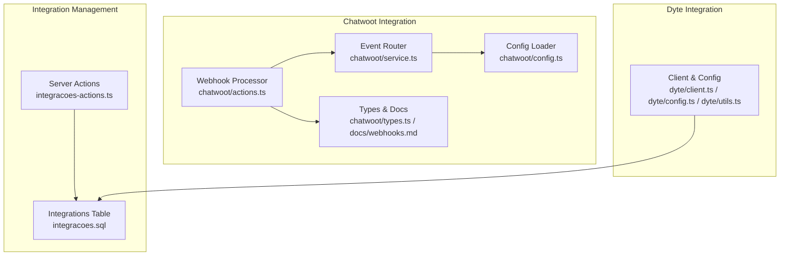
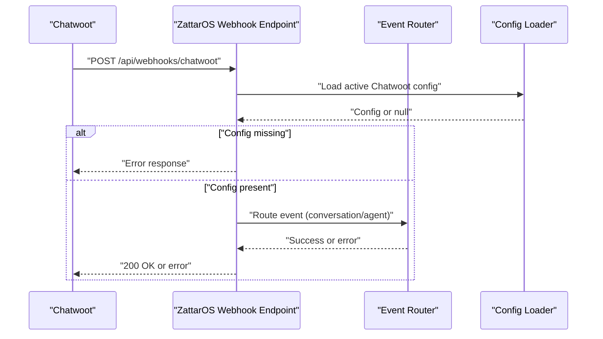
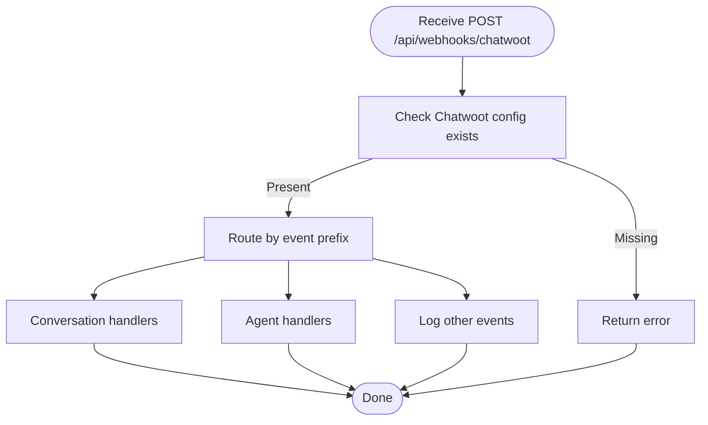
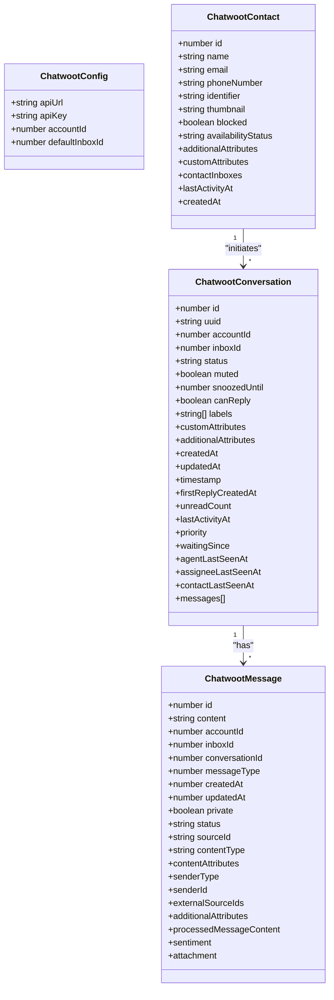
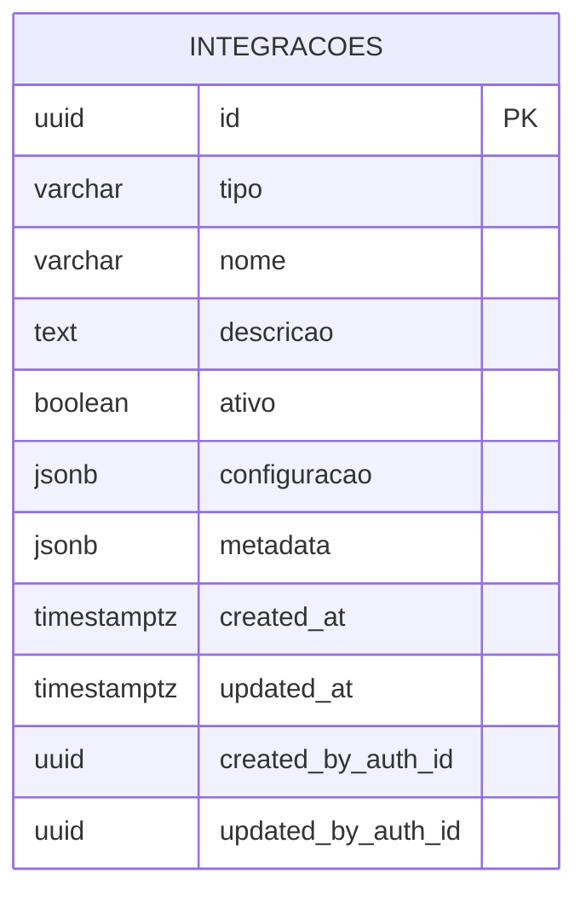
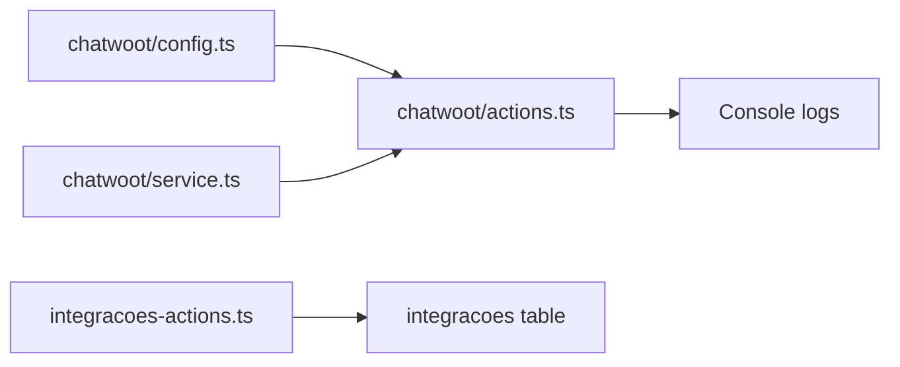

# Webhook Integrations

<cite>
**Referenced Files in This Document**
- [src/lib/chatwoot/actions.ts](file://src/lib/chatwoot/actions.ts)
- [src/lib/chatwoot/service.ts](file://src/lib/chatwoot/service.ts)
- [src/lib/chatwoot/config.ts](file://src/lib/chatwoot/config.ts)
- [src/lib/chatwoot/docs/webhooks.md](file://src/lib/chatwoot/docs/webhooks.md)
- [src/lib/chatwoot/types.ts](file://src/lib/chatwoot/types.ts)
- [src/lib/integracoes/actions/integracoes-actions.ts](file://src/lib/integracoes/actions/integracoes-actions.ts)
- [supabase/migrations/20260216212759_create_integracoes_table.sql](file://supabase/migrations/20260216212759_create_integracoes_table.sql)
- [src/lib/dyte/client.ts](file://src/lib/dyte/client.ts)
- [src/lib/dyte/config.ts](file://src/lib/dyte/config.ts)
- [src/lib/dyte/utils.ts](file://src/lib/dyte/utils.ts)
- [src/app/api/mcp/__tests__/cors.test.ts](file://src/app/api/mcp/__tests__/cors.test.ts)
- [src/lib/mcp/__tests__/rate-limit.test.ts](file://src/lib/mcp/__tests__/rate-limit.test.ts)
- [src/app/(authenticated)/contratos/services/rate-limit-local.ts](file://src/app/(authenticated)/contratos/services/rate-limit-local.ts)
</cite>

## Table of Contents
1. [Introduction](#introduction)
2. [Project Structure](#project-structure)
3. [Core Components](#core-components)
4. [Architecture Overview](#architecture-overview)
5. [Detailed Component Analysis](#detailed-component-analysis)
6. [Dependency Analysis](#dependency-analysis)
7. [Performance Considerations](#performance-considerations)
8. [Troubleshooting Guide](#troubleshooting-guide)
9. [Conclusion](#conclusion)
10. [Appendices](#appendices)

## Introduction
This document describes webhook integrations for ZattarOS third-party services, focusing on Chatwoot and Dyte. It explains endpoint configuration, payload formats, processing workflows, and operational controls such as retries, failures, and security. It also outlines how integrations are stored and managed in the system and highlights existing security mechanisms (CORS, rate limiting) that apply to webhook endpoints.

## Project Structure
ZattarOS centralizes integration configuration in a dedicated Supabase table and exposes server actions for managing integrations. Chatwoot-specific logic lives under a dedicated library module, while Dyte integration is present but not extensively documented in the repository snapshot.

**Diagram sources**
- [src/lib/integracoes/actions/integracoes-actions.ts:1-177](file://src/lib/integracoes/actions/integracoes-actions.ts#L1-L177)
- [supabase/migrations/20260216212759_create_integracoes_table.sql:1-112](file://supabase/migrations/20260216212759_create_integracoes_table.sql#L1-L112)
- [src/lib/chatwoot/actions.ts:758-792](file://src/lib/chatwoot/actions.ts#L758-L792)
- [src/lib/chatwoot/service.ts:1853-1871](file://src/lib/chatwoot/service.ts#L1853-L1871)
- [src/lib/chatwoot/config.ts:25-86](file://src/lib/chatwoot/config.ts#L25-L86)
- [src/lib/chatwoot/types.ts:1-493](file://src/lib/chatwoot/types.ts#L1-L493)
- [src/lib/chatwoot/docs/webhooks.md:1-48](file://src/lib/chatwoot/docs/webhooks.md#L1-L48)
- [src/lib/dyte/client.ts](file://src/lib/dyte/client.ts)
- [src/lib/dyte/config.ts](file://src/lib/dyte/config.ts)
- [src/lib/dyte/utils.ts](file://src/lib/dyte/utils.ts)

**Section sources**
- [src/lib/integracoes/actions/integracoes-actions.ts:1-177](file://src/lib/integracoes/actions/integracoes-actions.ts#L1-L177)
- [supabase/migrations/20260216212759_create_integracoes_table.sql:1-112](file://supabase/migrations/20260216212759_create_integracoes_table.sql#L1-L112)

## Core Components
- Integration configuration storage: A centralized Supabase table stores integration records with type, name, description, activation flag, configuration payload, and metadata. Row-level security policies restrict access to authenticated users and administrative updates.
- Chatwoot webhook processor: Exposes a webhook endpoint that validates Chatwoot configuration, parses events, and routes them to specialized handlers for conversations and agents. It logs other event categories for future processing.
- Chatwoot configuration loader: Reads active Chatwoot configuration from the integrations table and validates required fields.
- Dyte integration: Present in the codebase with client, configuration, and utilities modules. No explicit webhook endpoint was identified in the repository snapshot.
- Server actions for integrations: Provide authenticated CRUD operations for integrations, including validation of configuration schemas for Chatwoot and Dyte.

**Section sources**
- [supabase/migrations/20260216212759_create_integracoes_table.sql:5-27](file://supabase/migrations/20260216212759_create_integracoes_table.sql#L5-L27)
- [src/lib/chatwoot/actions.ts:758-792](file://src/lib/chatwoot/actions.ts#L758-L792)
- [src/lib/chatwoot/service.ts:1853-1871](file://src/lib/chatwoot/service.ts#L1853-L1871)
- [src/lib/chatwoot/config.ts:25-86](file://src/lib/chatwoot/config.ts#L25-L86)
- [src/lib/integracoes/actions/integracoes-actions.ts:78-177](file://src/lib/integracoes/actions/integracoes-actions.ts#L78-L177)

## Architecture Overview
The webhook pipeline for Chatwoot is implemented as a server-side route that:
- Validates Chatwoot configuration presence and completeness.
- Routes incoming events to conversation or agent handlers.
- Logs and returns results for non-handled categories.

**Diagram sources**
- [src/lib/chatwoot/actions.ts:758-792](file://src/lib/chatwoot/actions.ts#L758-L792)
- [src/lib/chatwoot/service.ts:1853-1871](file://src/lib/chatwoot/service.ts#L1853-L1871)
- [src/lib/chatwoot/config.ts:25-86](file://src/lib/chatwoot/config.ts#L25-L86)

## Detailed Component Analysis

### Chatwoot Webhook Endpoint
- Endpoint: POST /api/webhooks/chatwoot
- Purpose: Accept Chatwoot webhook events and delegate to the event router.
- Validation: Requires an active Chatwoot integration record in the integrations table.
- Routing: Events prefixed with conversation or agent are routed to specialized handlers; others are logged.

**Diagram sources**
- [src/lib/chatwoot/actions.ts:758-792](file://src/lib/chatwoot/actions.ts#L758-L792)
- [src/lib/chatwoot/service.ts:1853-1871](file://src/lib/chatwoot/service.ts#L1853-L1871)

**Section sources**
- [src/lib/chatwoot/actions.ts:758-792](file://src/lib/chatwoot/actions.ts#L758-L792)
- [src/lib/chatwoot/service.ts:1853-1871](file://src/lib/chatwoot/service.ts#L1853-L1871)

### Chatwoot Event Types and Payloads
- Supported subscriptions include conversation lifecycle events, contact updates, message creation, and web widget triggers.
- Payloads conform to Chatwoot’s documented structures for contacts, conversations, and messages.

**Diagram sources**
- [src/lib/chatwoot/types.ts:10-493](file://src/lib/chatwoot/types.ts#L10-L493)

**Section sources**
- [src/lib/chatwoot/docs/webhooks.md:1-48](file://src/lib/chatwoot/docs/webhooks.md#L1-L48)
- [src/lib/chatwoot/types.ts:10-493](file://src/lib/chatwoot/types.ts#L10-L493)

### Integration Storage and Management
- The integracoes table stores integration configurations as JSONB, enabling flexible schemas per integration type.
- Server actions provide authenticated operations to list, create, update, delete, toggle activation, and manage Chatwoot/Dyte configurations.

**Diagram sources**
- [supabase/migrations/20260216212759_create_integracoes_table.sql:5-27](file://supabase/migrations/20260216212759_create_integracoes_table.sql#L5-L27)

**Section sources**
- [supabase/migrations/20260216212759_create_integracoes_table.sql:1-112](file://supabase/migrations/20260216212759_create_integracoes_table.sql#L1-L112)
- [src/lib/integracoes/actions/integracoes-actions.ts:28-177](file://src/lib/integracoes/actions/integracoes-actions.ts#L28-L177)

### Dyte Integration
- Presence: Dyte client, configuration, and utilities modules exist in the codebase.
- Scope: No explicit webhook endpoint or documented payload handling was found in the repository snapshot.

**Section sources**
- [src/lib/dyte/client.ts](file://src/lib/dyte/client.ts)
- [src/lib/dyte/config.ts](file://src/lib/dyte/config.ts)
- [src/lib/dyte/utils.ts](file://src/lib/dyte/utils.ts)

## Dependency Analysis
- Chatwoot webhook endpoint depends on:
  - Configuration loader to ensure an active Chatwoot integration exists.
  - Event router to dispatch to conversation or agent handlers.
- Integration management depends on:
  - Supabase table for persistence and RLS policies for access control.
  - Server actions for validation and mutation operations.

**Diagram sources**
- [src/lib/chatwoot/config.ts:25-86](file://src/lib/chatwoot/config.ts#L25-L86)
- [src/lib/chatwoot/actions.ts:758-792](file://src/lib/chatwoot/actions.ts#L758-L792)
- [src/lib/chatwoot/service.ts:1853-1871](file://src/lib/chatwoot/service.ts#L1853-L1871)
- [src/lib/integracoes/actions/integracoes-actions.ts:78-177](file://src/lib/integracoes/actions/integracoes-actions.ts#L78-L177)
- [supabase/migrations/20260216212759_create_integracoes_table.sql:5-27](file://supabase/migrations/20260216212759_create_integracoes_table.sql#L5-L27)

**Section sources**
- [src/lib/chatwoot/actions.ts:758-792](file://src/lib/chatwoot/actions.ts#L758-L792)
- [src/lib/chatwoot/service.ts:1853-1871](file://src/lib/chatwoot/service.ts#L1853-L1871)
- [src/lib/chatwoot/config.ts:25-86](file://src/lib/chatwoot/config.ts#L25-L86)
- [src/lib/integracoes/actions/integracoes-actions.ts:78-177](file://src/lib/integracoes/actions/integracoes-actions.ts#L78-L177)
- [supabase/migrations/20260216212759_create_integracoes_table.sql:5-27](file://supabase/migrations/20260216212759_create_integracoes_table.sql#L5-L27)

## Performance Considerations
- Event routing is lightweight and synchronous; ensure downstream handlers (e.g., conversation/agent processors) implement efficient processing and avoid blocking operations.
- Consider offloading heavy tasks to background jobs or queues to keep webhook responses fast.
- Monitor console logs for unexpected event categories and expand handlers accordingly.

## Troubleshooting Guide
- Chatwoot configuration missing:
  - Symptom: Webhook endpoint returns an error indicating Chatwoot is not configured.
  - Action: Verify an active Chatwoot integration exists in the integracoes table and that required fields are populated.
- Unsupported or unhandled event:
  - Symptom: Webhook is accepted but no action is taken.
  - Action: Confirm the event prefix matches conversation or agent; otherwise, the event is logged and not processed.
- CORS and origin validation:
  - Symptom: Cross-origin requests fail.
  - Action: Review allowed origins and headers for webhook consumers; ensure preflight OPTIONS is supported.
- Rate limiting:
  - Symptom: Requests are throttled unexpectedly.
  - Action: Adjust rate limit budgets and windows; consider service-tier allowances for internal systems.

**Section sources**
- [src/lib/chatwoot/actions.ts:758-792](file://src/lib/chatwoot/actions.ts#L758-L792)
- [src/lib/chatwoot/service.ts:1853-1871](file://src/lib/chatwoot/service.ts#L1853-L1871)
- [src/app/api/mcp/__tests__/cors.test.ts:126-166](file://src/app/api/mcp/__tests__/cors.test.ts#L126-L166)
- [src/lib/mcp/__tests__/rate-limit.test.ts:216-252](file://src/lib/mcp/__tests__/rate-limit.test.ts#L216-L252)
- [src/app/(authenticated)/contratos/services/rate-limit-local.ts:1-31](file://src/app/(authenticated)/contratos/services/rate-limit-local.ts#L1-L31)

## Conclusion
ZattarOS provides a robust foundation for third-party webhook integrations through a centralized configuration store and a Chatwoot webhook processor with event routing. While Dyte modules exist, no explicit webhook endpoint was identified in the repository snapshot. Administrators should leverage the integracoes table and server actions to manage configurations securely, and extend handlers to support additional event categories as business needs evolve.

## Appendices

### Endpoint Reference: Chatwoot Webhooks
- Method: POST
- Path: /api/webhooks/chatwoot
- Description: Receives Chatwoot events and routes them to appropriate handlers.

**Section sources**
- [src/lib/chatwoot/actions.ts:758-792](file://src/lib/chatwoot/actions.ts#L758-L792)

### Security Controls
- CORS: Allowed origins and headers validated in tests; ensure webhook consumers are whitelisted.
- Rate limiting: Configurable defaults exist for anonymous, authenticated, and service tiers; adjust according to deployment scale.

**Section sources**
- [src/app/api/mcp/__tests__/cors.test.ts:126-166](file://src/app/api/mcp/__tests__/cors.test.ts#L126-L166)
- [src/lib/mcp/__tests__/rate-limit.test.ts:216-252](file://src/lib/mcp/__tests__/rate-limit.test.ts#L216-L252)
- [src/app/(authenticated)/contratos/services/rate-limit-local.ts:1-31](file://src/app/(authenticated)/contratos/services/rate-limit-local.ts#L1-L31)