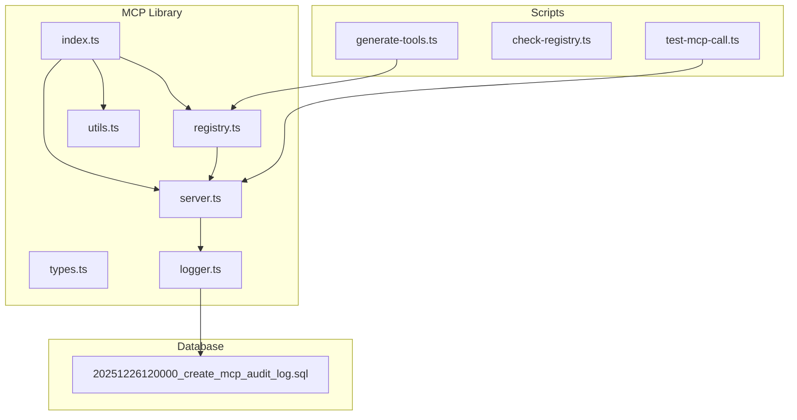
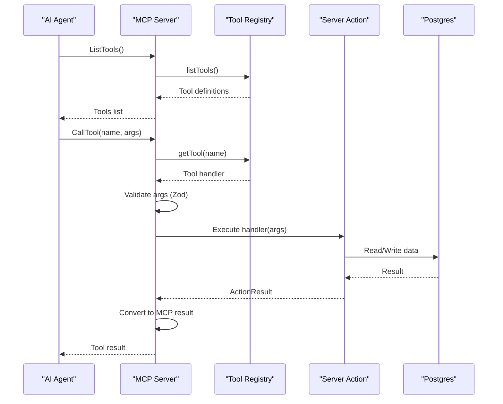
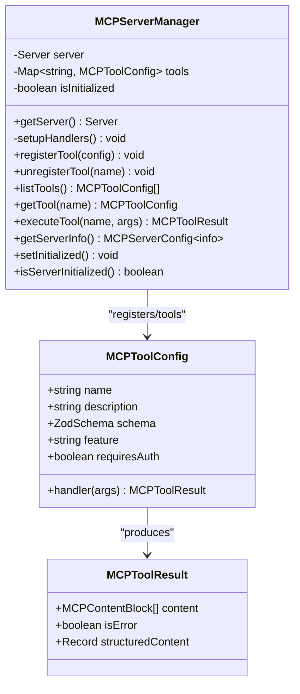
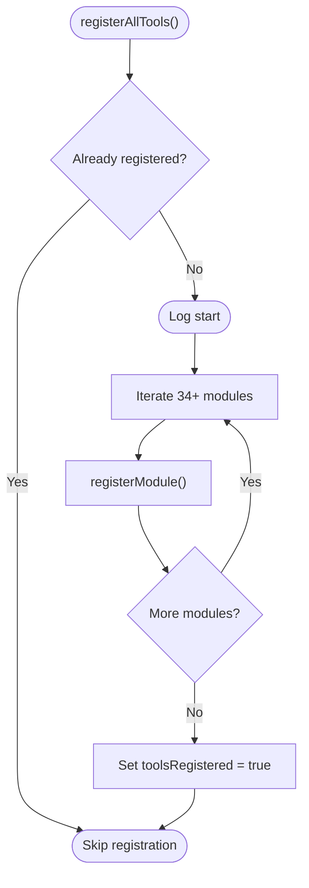
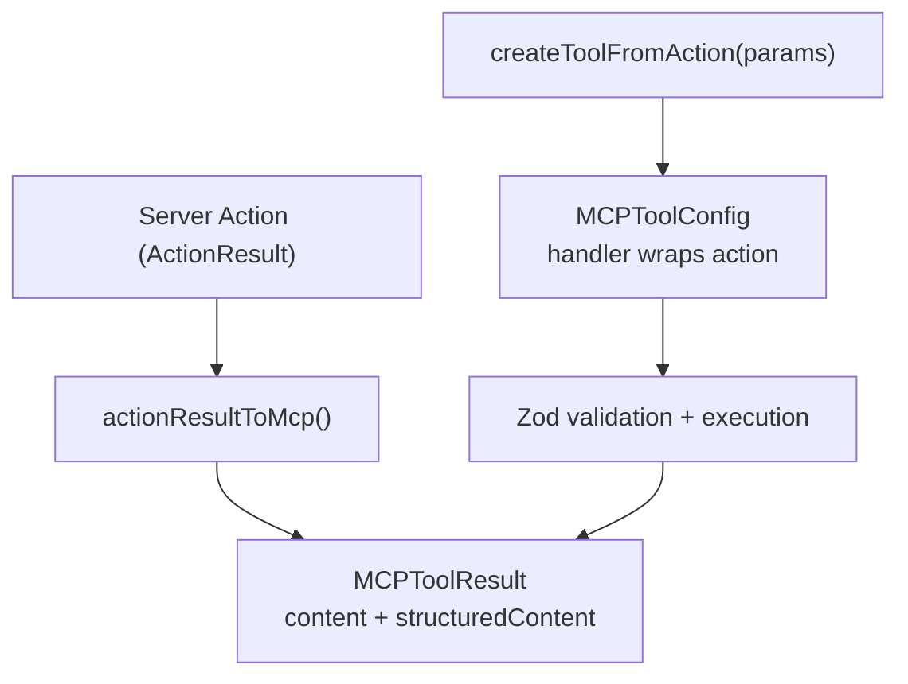
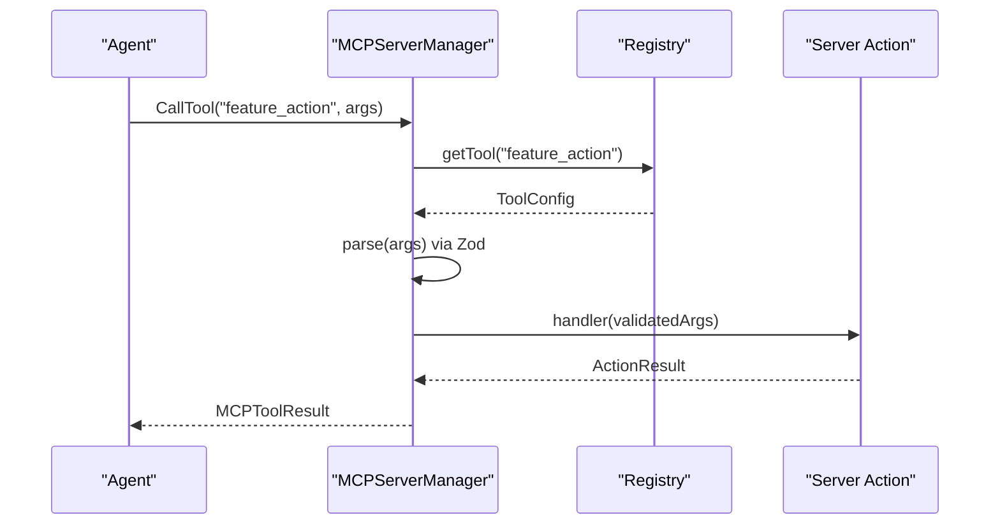
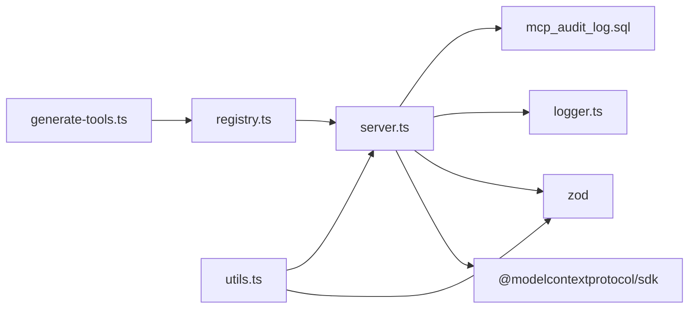
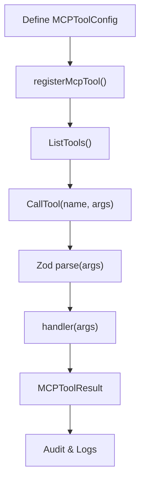

# AI Integration Architecture (MCP Protocol)

<cite>
**Referenced Files in This Document**
- [index.ts](file://src/lib/mcp/index.ts)
- [types.ts](file://src/lib/mcp/types.ts)
- [server.ts](file://src/lib/mcp/server.ts)
- [registry.ts](file://src/lib/mcp/registry.ts)
- [utils.ts](file://src/lib/mcp/utils.ts)
- [logger.ts](file://src/lib/mcp/logger.ts)
- [generate-tools.ts](file://scripts/mcp/generate-tools.ts)
- [check-registry.ts](file://scripts/mcp/check-registry.ts)
- [test-mcp-call.ts](file://scripts/mcp/test-mcp-call.ts)
- [20251226120000_create_mcp_audit_log.sql](file://supabase/migrations/20251226120000_create_mcp_audit_log.sql)
</cite>

## Table of Contents
1. [Introduction](#introduction)
2. [Project Structure](#project-structure)
3. [Core Components](#core-components)
4. [Architecture Overview](#architecture-overview)
5. [Detailed Component Analysis](#detailed-component-analysis)
6. [Dependency Analysis](#dependency-analysis)
7. [Performance Considerations](#performance-considerations)
8. [Security and Sandboxing](#security-and-sandboxing)
9. [Troubleshooting Guide](#troubleshooting-guide)
10. [Conclusion](#conclusion)
11. [Appendices](#appendices)

## Introduction
This document describes the AI integration architecture using the Model Context Protocol (MCP) in the ZattarOS system. It explains how the MCP server exposes tools derived from existing Server Actions, how AI agents interact with the system through the MCP registry, and how the AI workflow leverages domain knowledge embedded in the platform. It also covers tool registration patterns, embedding systems using pgvector, integration with OpenAI services, and security considerations for AI operations.

## Project Structure
The MCP integration is centered around a dedicated library under src/lib/mcp, with supporting scripts under scripts/mcp and database schema under supabase/migrations. The key areas are:
- MCP library exports and entry points
- Types and schemas for tools and results
- MCP server implementation with handlers for tools, resources, and prompts
- Central registry orchestrating hundreds of tools across functional domains
- Utilities for converting Server Actions to MCP tools and formatting results
- Logging and auditing infrastructure
- Scripts for generating tool registrations and validating the registry
- Database migration for MCP audit logs and quotas

**Diagram sources**
- [index.ts:1-57](file://src/lib/mcp/index.ts#L1-L57)
- [types.ts:1-152](file://src/lib/mcp/types.ts#L1-L152)
- [server.ts:1-507](file://src/lib/mcp/server.ts#L1-L507)
- [registry.ts:1-163](file://src/lib/mcp/registry.ts#L1-L163)
- [utils.ts:1-248](file://src/lib/mcp/utils.ts#L1-L248)
- [logger.ts:1-306](file://src/lib/mcp/logger.ts#L1-L306)
- [generate-tools.ts:1-233](file://scripts/mcp/generate-tools.ts#L1-L233)
- [check-registry.ts](file://scripts/mcp/check-registry.ts)
- [test-mcp-call.ts](file://scripts/mcp/test-mcp-call.ts)
- [20251226120000_create_mcp_audit_log.sql:1-161](file://supabase/migrations/20251226120000_create_mcp_audit_log.sql#L1-L161)

**Section sources**
- [index.ts:1-57](file://src/lib/mcp/index.ts#L1-L57)
- [server.ts:1-507](file://src/lib/mcp/server.ts#L1-L507)
- [registry.ts:1-163](file://src/lib/mcp/registry.ts#L1-L163)
- [utils.ts:1-248](file://src/lib/mcp/utils.ts#L1-L248)
- [logger.ts:1-306](file://src/lib/mcp/logger.ts#L1-L306)
- [generate-tools.ts:1-233](file://scripts/mcp/generate-tools.ts#L1-L233)
- [20251226120000_create_mcp_audit_log.sql:1-161](file://supabase/migrations/20251226120000_create_mcp_audit_log.sql#L1-L161)

## Core Components
- MCP types and schemas define tool configuration, result formats, content blocks, and standardized Zod schemas for parameters.
- The MCP server manages a singleton Server instance, registers handlers for tools, resources, and prompts, validates inputs, executes handlers, logs events, and audits calls.
- The registry orchestrates registration of 230+ tools across 34 functional modules, ensuring idempotent registration and easy maintenance.
- Utilities convert Server Action results to MCP-compatible results, create tools from actions, and format data for display.
- Logging and auditing capture performance metrics, errors, and usage patterns; a database migration defines audit tables and quotas.

**Section sources**
- [types.ts:1-152](file://src/lib/mcp/types.ts#L1-L152)
- [server.ts:1-507](file://src/lib/mcp/server.ts#L1-L507)
- [registry.ts:1-163](file://src/lib/mcp/registry.ts#L1-L163)
- [utils.ts:1-248](file://src/lib/mcp/utils.ts#L1-L248)
- [logger.ts:1-306](file://src/lib/mcp/logger.ts#L1-L306)
- [20251226120000_create_mcp_audit_log.sql:1-161](file://supabase/migrations/20251226120000_create_mcp_audit_log.sql#L1-L161)

## Architecture Overview
The MCP architecture exposes a unified tool surface backed by existing Server Actions. AI agents discover tools via the MCP server, invoke them with validated parameters, and receive structured results. The system maintains:
- A typed tool registry with Zod validation
- Structured logging and audit trails
- Optional resource and prompt capabilities
- Idempotent registration and centralized tool management

**Diagram sources**
- [server.ts:88-188](file://src/lib/mcp/server.ts#L88-L188)
- [registry.ts:95-142](file://src/lib/mcp/registry.ts#L95-L142)
- [utils.ts:12-83](file://src/lib/mcp/utils.ts#L12-L83)
- [logger.ts:49-68](file://src/lib/mcp/logger.ts#L49-L68)

## Detailed Component Analysis

### MCP Server Implementation
The MCP server is a singleton managing a Model Context Protocol server with handlers for:
- Listing and invoking tools with Zod-based input validation
- Resource listing and reading
- Prompt listing and retrieval

Key behaviors:
- Converts Zod schemas to JSON Schema for tool discovery
- Executes tool handlers and records timing and success/failure
- Emits structured logs and audit records for each operation
- Supports direct internal execution for testing and orchestration

**Diagram sources**
- [server.ts:48-450](file://src/lib/mcp/server.ts#L48-L450)
- [types.ts:10-40](file://src/lib/mcp/types.ts#L10-L40)

**Section sources**
- [server.ts:1-507](file://src/lib/mcp/server.ts#L1-L507)
- [types.ts:1-152](file://src/lib/mcp/types.ts#L1-L152)

### Tool Registration System
The central registry coordinates registration across 34 functional modules. It ensures:
- Idempotent registration with a single flag
- Sequential module registration for predictable initialization
- Reset capability for testing scenarios

Modules include Processes, Parties, Contracts, Finance, Chat, Documents, Expedients, Hearings, Obligations, HR, Dashboards, Semantic Search, CNJ Capture, Users, Acervo, Assistants, Positions, Lawyers, Expertise, Digital Signature, Tasks, Chatwoot, Dify, Admin, Calendar, Types of Expedients, Notifications, Calendar, Addresses, Notes, Project Management, Legal Pieces, Labor Interviews, Mail, and Labor Hiring.

**Diagram sources**
- [registry.ts:95-142](file://src/lib/mcp/registry.ts#L95-L142)

**Section sources**
- [registry.ts:1-163](file://src/lib/mcp/registry.ts#L1-L163)

### Generating Tools from Server Actions
Utilities enable conversion of Server Actions to MCP tools:
- actionResultToMcp transforms ActionResult into MCPToolResult with structured content
- createToolFromAction builds a tool configuration wrapping an action with Zod validation and auth requirement
- Formatting helpers produce human-readable summaries and lists

**Diagram sources**
- [utils.ts:12-83](file://src/lib/mcp/utils.ts#L12-L83)

**Section sources**
- [utils.ts:1-248](file://src/lib/mcp/utils.ts#L1-L248)

### AI Workflow Patterns and Embeddings
- Semantic search tool enables cross-module vector search leveraging pgvector embeddings.
- Embedding pipeline supports document indexing and retrieval for AI-driven insights.
- Integration with OpenAI services can be layered on top of MCP tools for LLM orchestration and prompt management.

Note: The semantic search tool and embedding system are part of the MCP registry and database schema, respectively.

**Section sources**
- [registry.ts:56-56](file://src/lib/mcp/registry.ts#L56-L56)
- [20251226120000_create_mcp_audit_log.sql:1-161](file://supabase/migrations/20251226120000_create_mcp_audit_log.sql#L1-L161)

### Agent Interactions and Tool Execution
Agents interact with the MCP server through:
- Listing tools to discover capabilities
- Invoking tools with validated parameters
- Receiving structured results suitable for downstream processing

The server enforces:
- Zod-based input validation
- Auth requirements per tool
- Structured logging and audit records

**Diagram sources**
- [server.ts:107-188](file://src/lib/mcp/server.ts#L107-L188)
- [registry.ts:95-142](file://src/lib/mcp/registry.ts#L95-L142)
- [utils.ts:12-83](file://src/lib/mcp/utils.ts#L12-L83)

**Section sources**
- [server.ts:88-188](file://src/lib/mcp/server.ts#L88-L188)
- [utils.ts:12-83](file://src/lib/mcp/utils.ts#L12-L83)

## Dependency Analysis
The MCP subsystem depends on:
- Model Context Protocol SDK for server and transport
- Zod for input validation
- Internal logging and audit infrastructure
- Database for audit logs and quotas

**Diagram sources**
- [server.ts:7-27](file://src/lib/mcp/server.ts#L7-L27)
- [utils.ts:5-7](file://src/lib/mcp/utils.ts#L5-L7)
- [logger.ts:8-40](file://src/lib/mcp/logger.ts#L8-L40)
- [generate-tools.ts:7-9](file://scripts/mcp/generate-tools.ts#L7-L9)
- [20251226120000_create_mcp_audit_log.sql:1-161](file://supabase/migrations/20251226120000_create_mcp_audit_log.sql#L1-L161)

**Section sources**
- [server.ts:7-27](file://src/lib/mcp/server.ts#L7-L27)
- [utils.ts:5-7](file://src/lib/mcp/utils.ts#L5-L7)
- [logger.ts:8-40](file://src/lib/mcp/logger.ts#L8-L40)
- [generate-tools.ts:7-9](file://scripts/mcp/generate-tools.ts#L7-L9)
- [20251226120000_create_mcp_audit_log.sql:1-161](file://supabase/migrations/20251226120000_create_mcp_audit_log.sql#L1-L161)

## Performance Considerations
- Use Zod schemas to validate inputs early and avoid unnecessary handler execution.
- Prefer paginated and limited queries in tools to keep response sizes manageable.
- Leverage structured content in MCPToolResult to reduce post-processing overhead.
- Monitor tool execution durations via the built-in timer and logging hooks.
- Apply database indexes and RLS policies to minimize latency and improve throughput.

[No sources needed since this section provides general guidance]

## Security and Sandboxing
- Tool-level permissions: Each tool declares whether it requires authentication and can override visibility via explicit permission descriptors.
- Centralized logging and audit tables capture tool invocations, arguments, results, and errors.
- Rate-limiting quotas per user tier help prevent abuse.
- Row Level Security policies restrict access to audit logs and quotas.
- Recommended sandboxing practices:
  - Enforce requiresAuth for sensitive tools
  - Limit tool scope to least privilege
  - Use structured content and truncation to avoid information disclosure
  - Apply timeouts and circuit breakers at the handler level
  - Segment environments and enforce transport security (stdio, SSE, HTTP)

**Section sources**
- [types.ts:10-31](file://src/lib/mcp/types.ts#L10-L31)
- [server.ts:107-188](file://src/lib/mcp/server.ts#L107-L188)
- [logger.ts:49-68](file://src/lib/mcp/logger.ts#L49-L68)
- [20251226120000_create_mcp_audit_log.sql:98-143](file://supabase/migrations/20251226120000_create_mcp_audit_log.sql#L98-L143)

## Troubleshooting Guide
Common issues and remedies:
- Tool not found: Verify registration via the registry and ensure toolsRegistered flag is set.
- Validation errors: Confirm Zod schemas align with client inputs; inspect logs for parsing failures.
- Authentication failures: Check requiresAuth flags and user context propagation.
- Performance bottlenecks: Review tool execution logs and database queries; add indexes and optimize RLS.
- Audit gaps: Ensure audit triggers and cleanup functions are enabled and functioning.

Diagnostic utilities:
- Registry checker script validates registration completeness.
- Test harness executes a specific tool call against the server.
- Logging helpers provide structured debug and error logs.

**Section sources**
- [check-registry.ts](file://scripts/mcp/check-registry.ts)
- [test-mcp-call.ts](file://scripts/mcp/test-mcp-call.ts)
- [logger.ts:49-68](file://src/lib/mcp/logger.ts#L49-L68)

## Conclusion
The MCP integration in ZattarOS provides a robust, auditable, and scalable bridge between AI agents and the existing Server Action ecosystem. By standardizing tool schemas, enforcing validation, and centralizing registration, the system enables AI workflows to leverage deep domain knowledge while maintaining strong security and observability. Embeddings and semantic search further enhance AI-driven insights, and integration with OpenAI services can extend orchestration capabilities.

[No sources needed since this section summarizes without analyzing specific files]

## Appendices

### MCP Tool Lifecycle

**Diagram sources**
- [server.ts:88-188](file://src/lib/mcp/server.ts#L88-L188)
- [utils.ts:12-83](file://src/lib/mcp/utils.ts#L12-L83)
- [logger.ts:49-68](file://src/lib/mcp/logger.ts#L49-L68)