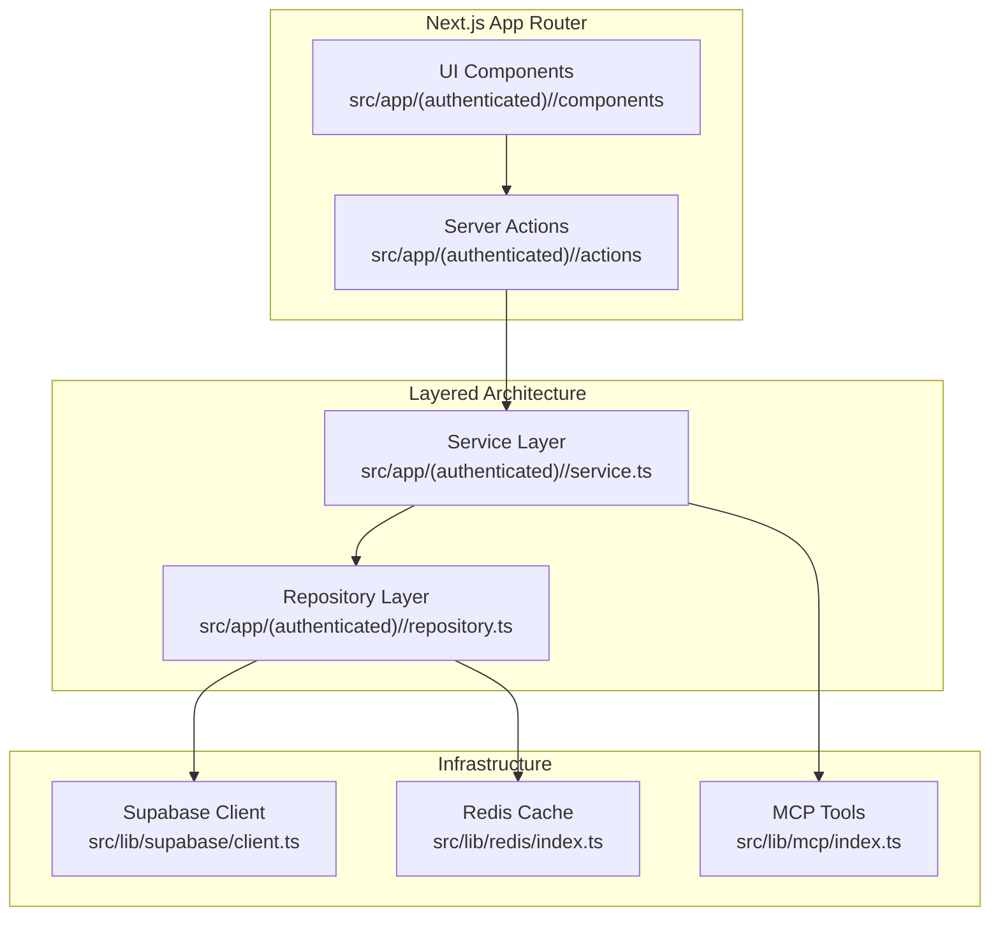
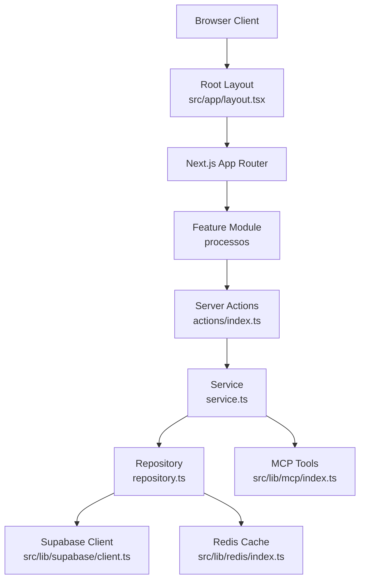
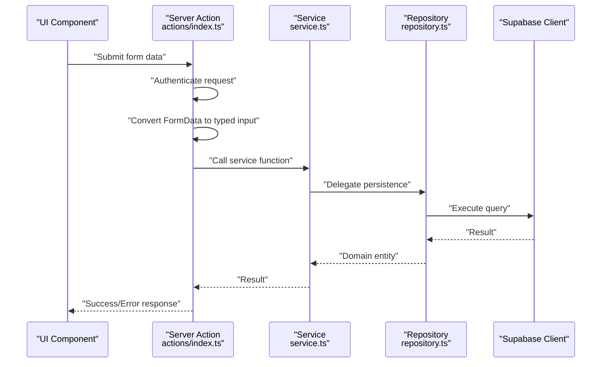
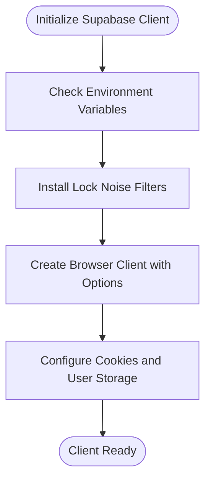
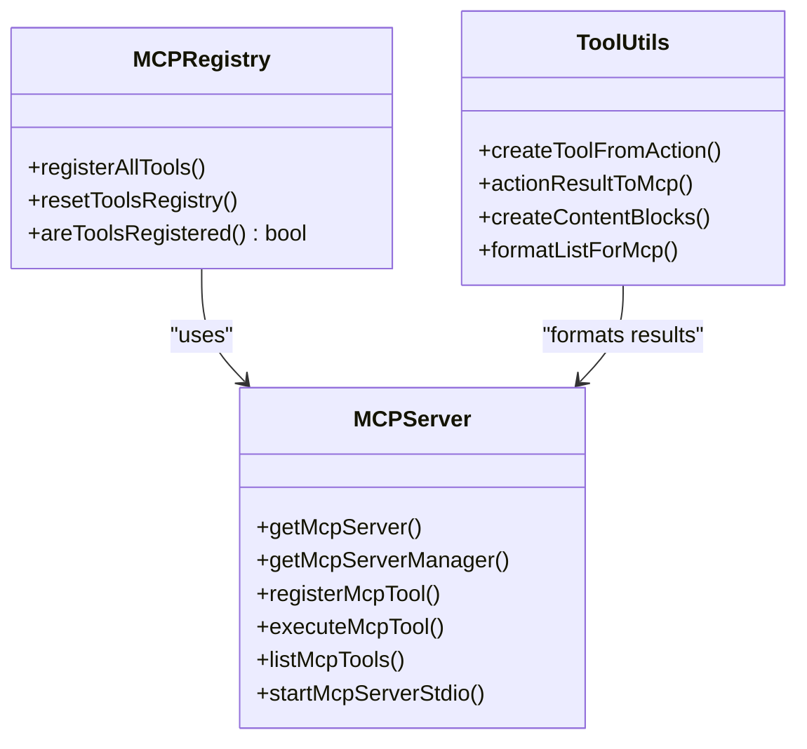
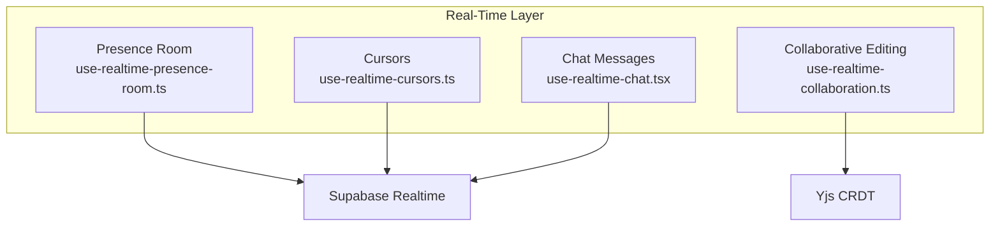
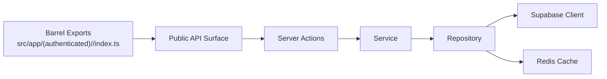

# Architecture Overview

<cite>
**Referenced Files in This Document**
- [README.md](file://README.md)
- [package.json](file://package.json)
- [next.config.ts](file://next.config.ts)
- [tsconfig.json](file://tsconfig.json)
- [src/app/layout.tsx](file://src/app/layout.tsx)
- [src/lib/index.ts](file://src/lib/index.ts)
- [src/lib/supabase/client.ts](file://src/lib/supabase/client.ts)
- [src/lib/mcp/index.ts](file://src/lib/mcp/index.ts)
- [src/app/(authenticated)/processos/index.ts](file://src/app/(authenticated)/processos/index.ts)
- [src/app/(authenticated)/processos/service.ts](file://src/app/(authenticated)/processos/service.ts)
- [src/app/(authenticated)/processos/repository.ts](file://src/app/(authenticated)/processos/repository.ts)
- [src/app/(authenticated)/processos/actions/index.ts](file://src/app/(authenticated)/processos/actions/index.ts)
- [src/lib/redis/index.ts](file://src/lib/redis/index.ts)
</cite>

## Table of Contents
1. [Introduction](#introduction)
2. [Project Structure](#project-structure)
3. [Core Components](#core-components)
4. [Architecture Overview](#architecture-overview)
5. [Detailed Component Analysis](#detailed-component-analysis)
6. [Dependency Analysis](#dependency-analysis)
7. [Performance Considerations](#performance-considerations)
8. [Troubleshooting Guide](#troubleshooting-guide)
9. [Conclusion](#conclusion)

## Introduction
ZattarOS is a Next.js 16 (App Router) application implementing Feature-Sliced Design (FSD) with colocated modules, layered architecture (UI → Server Actions → Services → Repositories), and domain-driven design principles. The system integrates:
- Frontend: Next.js App Router with React 19 and TypeScript 5
- Backend: Supabase (PostgreSQL + RLS + pgvector)
- AI services: OpenAI and MCP protocol-based tools
- Real-time features: WebSocket connections via Supabase and Yjs
- Cross-cutting concerns: Authentication, authorization (RLS), caching, and performance optimization

## Project Structure
ZattarOS organizes features as colocated modules under src/app/(authenticated). Each module exposes a barrel export (index.ts) and follows a strict layered architecture:
- UI components live alongside domain logic
- Server Actions orchestrate requests and enforce authentication
- Services encapsulate business rules and validation
- Repositories handle persistence and caching
- Domain schemas define typed contracts and validation

**Diagram sources**
- [src/app/(authenticated)/processos/index.ts](file://src/app/(authenticated)/processos/index.ts#L1-L225)
- [src/app/(authenticated)/processos/actions/index.ts](file://src/app/(authenticated)/processos/actions/index.ts#L1-L800)
- [src/app/(authenticated)/processos/service.ts](file://src/app/(authenticated)/processos/service.ts#L1-L528)
- [src/app/(authenticated)/processos/repository.ts](file://src/app/(authenticated)/processos/repository.ts#L1-L800)
- [src/lib/supabase/client.ts:1-240](file://src/lib/supabase/client.ts#L1-L240)
- [src/lib/redis/index.ts:1-75](file://src/lib/redis/index.ts#L1-L75)
- [src/lib/mcp/index.ts:1-57](file://src/lib/mcp/index.ts#L1-L57)

**Section sources**
- [README.md:43-76](file://README.md#L43-L76)
- [src/app/layout.tsx:1-82](file://src/app/layout.tsx#L1-L82)
- [src/app/(authenticated)/processos/index.ts](file://src/app/(authenticated)/processos/index.ts#L1-L225)

## Core Components
- Feature Modules: Colocated modules under src/app/(authenticated) with barrel exports for controlled public APIs
- Server Actions: Boundary layer enforcing authentication and orchestrating service calls
- Services: Business logic and validation using Zod schemas
- Repositories: Persistence and caching with Redis utilities
- Infrastructure: Supabase client, Redis cache, and MCP tooling

Key technical decisions:
- TypeScript strict mode and isolated modules
- Barrel exports pattern with strict import rules to prevent deep imports
- Next.js experimental modularizeImports and optimizePackageImports for tree-shaking
- Custom cache handler for production builds

**Section sources**
- [README.md:43-76](file://README.md#L43-L76)
- [tsconfig.json:1-94](file://tsconfig.json#L1-L94)
- [next.config.ts:130-251](file://next.config.ts#L130-L251)
- [src/lib/index.ts:1-109](file://src/lib/index.ts#L1-L109)
- [src/lib/redis/index.ts:1-75](file://src/lib/redis/index.ts#L1-L75)

## Architecture Overview
The system enforces a layered architecture with clear separation of concerns:
- UI: React components and hooks
- Server Actions: Request boundary, authentication, and data conversion
- Services: Domain logic and validation
- Repositories: Database access and caching
- Infrastructure: Supabase, Redis, and MCP

**Diagram sources**
- [src/app/layout.tsx:1-82](file://src/app/layout.tsx#L1-L82)
- [src/app/(authenticated)/processos/actions/index.ts](file://src/app/(authenticated)/processos/actions/index.ts#L1-L800)
- [src/app/(authenticated)/processos/service.ts](file://src/app/(authenticated)/processos/service.ts#L1-L528)
- [src/app/(authenticated)/processos/repository.ts](file://src/app/(authenticated)/processos/repository.ts#L1-L800)
- [src/lib/supabase/client.ts:1-240](file://src/lib/supabase/client.ts#L1-L240)
- [src/lib/redis/index.ts:1-75](file://src/lib/redis/index.ts#L1-L75)
- [src/lib/mcp/index.ts:1-57](file://src/lib/mcp/index.ts#L1-L57)

## Detailed Component Analysis

### Processos Feature Module
The processos module exemplifies the layered architecture:
- Barrel export defines the public API surface
- Server Actions convert FormData, validate with Zod, and call services
- Services encapsulate business rules and validation
- Repositories handle database queries and caching

**Diagram sources**
- [src/app/(authenticated)/processos/actions/index.ts](file://src/app/(authenticated)/processos/actions/index.ts#L264-L323)
- [src/app/(authenticated)/processos/service.ts](file://src/app/(authenticated)/processos/service.ts#L47-L124)
- [src/app/(authenticated)/processos/repository.ts](file://src/app/(authenticated)/processos/repository.ts#L181-L220)

**Section sources**
- [src/app/(authenticated)/processos/index.ts](file://src/app/(authenticated)/processos/index.ts#L1-L225)
- [src/app/(authenticated)/processos/actions/index.ts](file://src/app/(authenticated)/processos/actions/index.ts#L1-L800)
- [src/app/(authenticated)/processos/service.ts](file://src/app/(authenticated)/processos/service.ts#L1-L528)
- [src/app/(authenticated)/processos/repository.ts](file://src/app/(authenticated)/processos/repository.ts#L1-L800)

### Supabase Client and Authentication
The Supabase client manages browser-side authentication with SSR-safe adapters and filters benign lock warnings during development.

**Diagram sources**
- [src/lib/supabase/client.ts:204-240](file://src/lib/supabase/client.ts#L204-L240)

**Section sources**
- [src/lib/supabase/client.ts:1-240](file://src/lib/supabase/client.ts#L1-L240)

### MCP Integration
MCP tools are registered and executed through a central registry, enabling automated agent control of Server Actions.

**Diagram sources**
- [src/lib/mcp/index.ts:1-57](file://src/lib/mcp/index.ts#L1-L57)

**Section sources**
- [src/lib/mcp/index.ts:1-57](file://src/lib/mcp/index.ts#L1-L57)

### Real-Time Features
Real-time updates leverage Supabase PostgreSQL Realtime and Yjs for collaborative editing. The system uses:
- Supabase channels for presence and messages
- Yjs for operational transforms and conflict-free collaboration
- WebSocket connections managed by Supabase

[No sources needed since this diagram shows conceptual workflow, not actual code structure]

## Dependency Analysis
The architecture maintains low coupling and high cohesion:
- Barrel exports enforce controlled imports and prevent deep imports
- Next.js modularizeImports reduces bundle size by importing individual members
- Strict TypeScript configuration ensures type safety across layers

**Diagram sources**
- [src/app/(authenticated)/processos/index.ts](file://src/app/(authenticated)/processos/index.ts#L1-L225)
- [src/lib/index.ts:1-109](file://src/lib/index.ts#L1-L109)

**Section sources**
- [README.md:65-68](file://README.md#L65-L68)
- [next.config.ts:154-251](file://next.config.ts#L154-L251)
- [tsconfig.json:13-22](file://tsconfig.json#L13-L22)

## Performance Considerations
- Build-time optimizations: standalone output, custom cache handler, and reduced source maps
- Runtime optimizations: modularizeImports, optimizePackageImports, and selective externalization
- Caching: Redis cache utilities with TTLs and invalidation strategies
- Database: indexed filters, materialized views, and RLS policies

[No sources needed since this section provides general guidance]

## Troubleshooting Guide
Common issues and resolutions:
- Authentication noise during development: benign Navigator LockManager warnings are filtered by the Supabase client
- Build failures: ensure TypeScript strict mode passes and use architecture validation scripts
- Cache misses: verify Redis availability and cache key generation
- Authorization errors: confirm RLS policies and authenticated session

**Section sources**
- [src/lib/supabase/client.ts:50-95](file://src/lib/supabase/client.ts#L50-L95)
- [package.json:102-106](file://package.json#L102-L106)
- [src/lib/redis/index.ts:27-42](file://src/lib/redis/index.ts#L27-L42)

## Conclusion
ZattarOS demonstrates a robust, scalable architecture combining FSD with layered design and DDD principles. The system emphasizes:
- Controlled public APIs via barrel exports
- Strong typing and validation with Zod
- Clear separation of concerns across UI, Server Actions, Services, and Repositories
- Integration with Supabase, Redis, and MCP for data, caching, and AI automation
- Performance-conscious build and runtime configurations