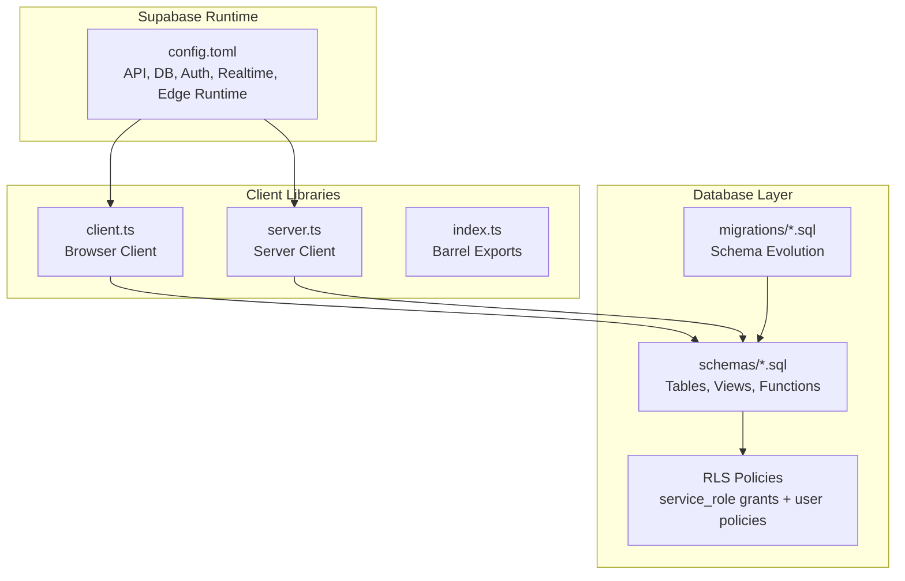
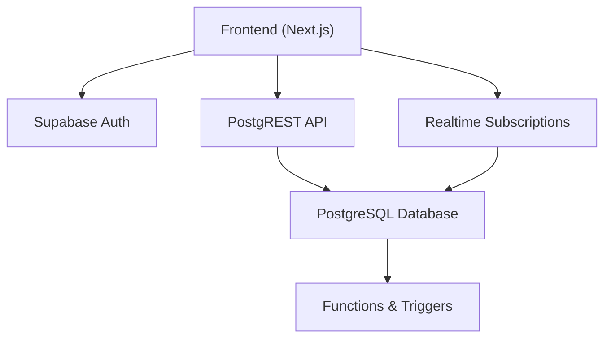
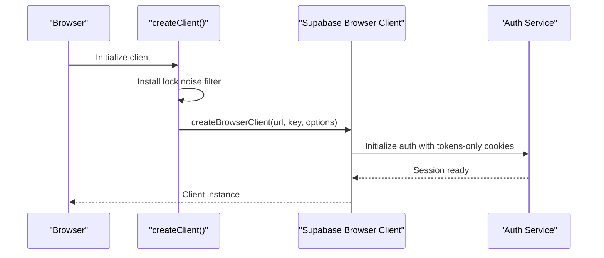
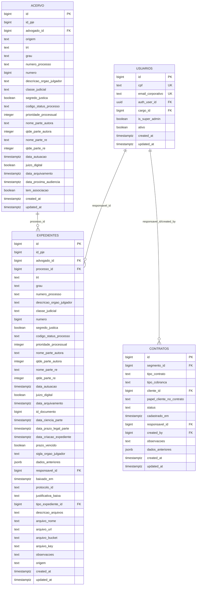
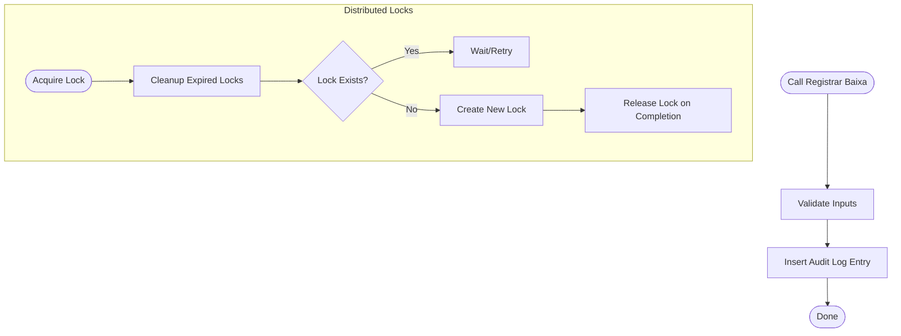
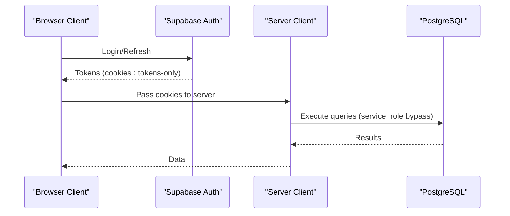
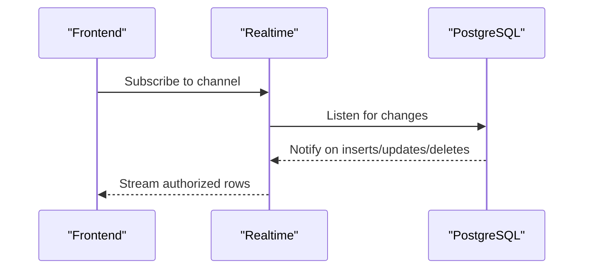
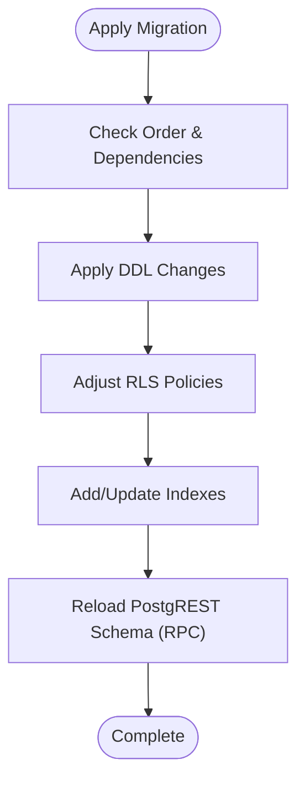
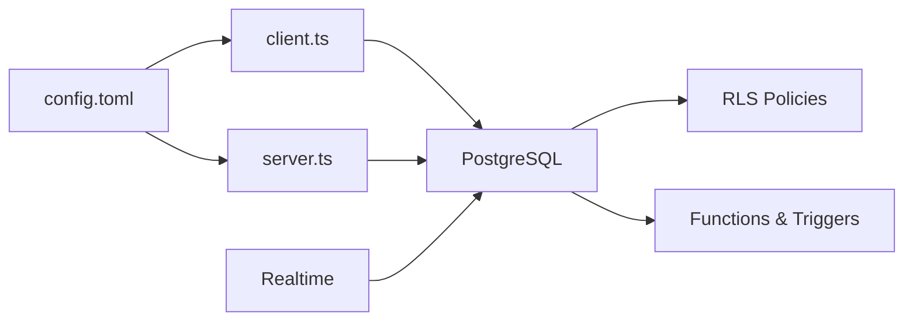

# Backend Architecture (Supabase)

<cite>
**Referenced Files in This Document**
- [config.toml](file://supabase/config.toml)
- [index.ts](file://src/lib/supabase/index.ts)
- [client.ts](file://src/lib/supabase/client.ts)
- [server.ts](file://src/lib/supabase/server.ts)
- [00_permissions.sql](file://supabase/schemas/00_permissions.sql)
- [08_usuarios.sql](file://supabase/schemas/08_usuarios.sql)
- [04_acervo.sql](file://supabase/schemas/04_acervo.sql)
- [06_expedientes.sql](file://supabase/schemas/06_expedientes.sql)
- [11_contratos.sql](file://supabase/schemas/11_contratos.sql)
- [20251125000000_create_locks_table.sql](file://supabase/migrations/20251125000000_create_locks_table.sql)
- [20251126083700_create_pgrst_reload_function.sql](file://supabase/migrations/20251126083700_create_pgrst_reload_function.sql)
</cite>

## Table of Contents
1. [Introduction](#introduction)
2. [Project Structure](#project-structure)
3. [Core Components](#core-components)
4. [Architecture Overview](#architecture-overview)
5. [Detailed Component Analysis](#detailed-component-analysis)
6. [Dependency Analysis](#dependency-analysis)
7. [Performance Considerations](#performance-considerations)
8. [Troubleshooting Guide](#troubleshooting-guide)
9. [Conclusion](#conclusion)

## Introduction
This document describes the backend architecture built on Supabase. It focuses on the PostgreSQL database design with Row Level Security (RLS) policies, the Supabase client implementation with automatic lock management, and the function-based API layer. It also explains the migration strategy for schema evolution, the role of database functions for business logic, real-time subscription patterns, authentication and session management, and how the backend supports the frontend’s layered architecture. Finally, it covers database performance considerations, indexing strategies, and the relationship between database design and frontend data access patterns.

## Project Structure
The backend is organized around:
- Supabase configuration and runtime settings
- Supabase client libraries for browser and server
- Database schemas and migrations defining tables, indexes, triggers, and RLS policies
- Database functions implementing business logic and operational tasks

**Diagram sources**
- [config.toml:1-385](file://supabase/config.toml#L1-L385)
- [client.ts:1-240](file://src/lib/supabase/client.ts#L1-L240)
- [server.ts:1-38](file://src/lib/supabase/server.ts#L1-L38)
- [index.ts:1-48](file://src/lib/supabase/index.ts#L1-L48)

**Section sources**
- [config.toml:1-385](file://supabase/config.toml#L1-L385)
- [index.ts:1-48](file://src/lib/supabase/index.ts#L1-L48)

## Core Components
- Supabase configuration defines API exposure, DB ports, Auth behavior, Realtime, and Edge Runtime settings.
- Browser and server client adapters encapsulate Supabase client creation, cookie/session handling, and automatic lock noise filtering.
- Database schemas define core entities (users, processes, filings, contracts) with indexes, triggers, and RLS policies.
- Migrations evolve the schema over time, introducing new tables, indexes, RLS adjustments, and operational functions.
- Database functions implement business logic (e.g., filing resolution logging) and operational tasks (e.g., PostgREST schema reload).

**Section sources**
- [config.toml:1-385](file://supabase/config.toml#L1-L385)
- [client.ts:1-240](file://src/lib/supabase/client.ts#L1-L240)
- [server.ts:1-38](file://src/lib/supabase/server.ts#L1-L38)
- [00_permissions.sql:1-21](file://supabase/schemas/00_permissions.sql#L1-L21)
- [08_usuarios.sql:1-100](file://supabase/schemas/08_usuarios.sql#L1-L100)
- [04_acervo.sql:1-77](file://supabase/schemas/04_acervo.sql#L1-L77)
- [06_expedientes.sql:1-249](file://supabase/schemas/06_expedientes.sql#L1-L249)
- [11_contratos.sql:1-61](file://supabase/schemas/11_contratos.sql#L1-L61)
- [20251125000000_create_locks_table.sql:1-77](file://supabase/migrations/20251125000000_create_locks_table.sql#L1-L77)
- [20251126083700_create_pgrst_reload_function.sql:1-13](file://supabase/migrations/20251126083700_create_pgrst_reload_function.sql#L1-L13)

## Architecture Overview
The backend follows a layered pattern:
- Frontend (Next.js) interacts with Supabase via typed clients.
- Supabase Auth manages authentication and session lifecycles.
- Supabase PostgREST exposes REST endpoints for tables/views/functions.
- Database functions and triggers implement business logic and audit/logging.
- RLS enforces fine-grained access control per user and role.

**Diagram sources**
- [config.toml:77-82](file://supabase/config.toml#L77-L82)
- [client.ts:204-239](file://src/lib/supabase/client.ts#L204-L239)
- [server.ts:4-36](file://src/lib/supabase/server.ts#L4-L36)

## Detailed Component Analysis

### Supabase Client Implementation with Automatic Lock Management
The client library centralizes Supabase client creation and session handling:
- Automatic lock noise filtering prevents benign auth lock warnings from polluting logs.
- Cookie encoding restricted to tokens-only avoids SSR pitfalls and ensures proper session hydration.
- Browser and server clients use distinct storage adapters to avoid SSR mismatches.

**Diagram sources**
- [client.ts:50-102](file://src/lib/supabase/client.ts#L50-L102)
- [client.ts:204-239](file://src/lib/supabase/client.ts#L204-L239)

**Section sources**
- [client.ts:1-240](file://src/lib/supabase/client.ts#L1-L240)
- [server.ts:1-38](file://src/lib/supabase/server.ts#L1-L38)
- [index.ts:1-48](file://src/lib/supabase/index.ts#L1-L48)

### Database Design and RLS Policies
Core tables and policies:
- Users table with unique identifiers, professional info, contact details, media URLs, and RLS policies allowing service_role full access and authenticated users read/update to their own profile.
- Unified process inventory (acervo) with extensive indexes and RLS enabling service_role access and authenticated reads.
- Unified filing records (expedientes) with indexes, triggers to synchronize related process IDs, and RLS policies.
- Contracts table with indexes and RLS.

**Diagram sources**
- [08_usuarios.sql:6-41](file://supabase/schemas/08_usuarios.sql#L6-L41)
- [04_acervo.sql:4-32](file://supabase/schemas/04_acervo.sql#L4-L32)
- [06_expedientes.sql:6-60](file://supabase/schemas/06_expedientes.sql#L6-L60)
- [11_contratos.sql:4-27](file://supabase/schemas/11_contratos.sql#L4-L27)

**Section sources**
- [08_usuarios.sql:81-100](file://supabase/schemas/08_usuarios.sql#L81-L100)
- [04_acervo.sql:74-77](file://supabase/schemas/04_acervo.sql#L74-L77)
- [06_expedientes.sql:224-249](file://supabase/schemas/06_expedientes.sql#L224-L249)
- [11_contratos.sql:58-61](file://supabase/schemas/11_contratos.sql#L58-L61)

### Function-Based API Layer
Database functions implement business logic and operational tasks:
- Filing resolution logging functions record baixa and reversal events with audit trail entries.
- Distributed locks table and cleanup function prevent concurrent captures.
- PostgREST schema reload helper notifies PostgREST to refresh schema cache.

**Diagram sources**
- [06_expedientes.sql:156-188](file://supabase/schemas/06_expedientes.sql#L156-L188)
- [06_expedientes.sql:189-222](file://supabase/schemas/06_expedientes.sql#L189-L222)
- [20251125000000_create_locks_table.sql:20-35](file://supabase/migrations/20251125000000_create_locks_table.sql#L20-L35)
- [20251126083700_create_pgrst_reload_function.sql:4-9](file://supabase/migrations/20251126083700_create_pgrst_reload_function.sql#L4-L9)

**Section sources**
- [06_expedientes.sql:125-155](file://supabase/schemas/06_expedientes.sql#L125-L155)
- [06_expedientes.sql:156-222](file://supabase/schemas/06_expedientes.sql#L156-L222)
- [20251125000000_create_locks_table.sql:1-77](file://supabase/migrations/20251125000000_create_locks_table.sql#L1-L77)
- [20251126083700_create_pgrst_reload_function.sql:1-13](file://supabase/migrations/20251126083700_create_pgrst_reload_function.sql#L1-L13)

### Authentication and Session Management
- Auth configuration controls site URL, redirect URIs, JWT expiry, refresh token rotation, and rate limits.
- Clients enforce tokens-only cookies and SSR-safe storage adapters to avoid session hydration issues.
- The service role bypasses RLS for privileged operations.

**Diagram sources**
- [config.toml:146-170](file://supabase/config.toml#L146-L170)
- [client.ts:204-239](file://src/lib/supabase/client.ts#L204-L239)
- [server.ts:4-36](file://src/lib/supabase/server.ts#L4-L36)
- [00_permissions.sql:1-21](file://supabase/schemas/00_permissions.sql#L1-L21)

**Section sources**
- [config.toml:146-170](file://supabase/config.toml#L146-L170)
- [client.ts:104-131](file://src/lib/supabase/client.ts#L104-L131)
- [server.ts:1-38](file://src/lib/supabase/server.ts#L1-L38)
- [00_permissions.sql:1-21](file://supabase/schemas/00_permissions.sql#L1-L21)

### Real-Time Subscription Patterns
- Realtime is enabled in configuration.
- Frontend components subscribe to channels for live updates on relevant tables.
- Realtime subscriptions are scoped by RLS policies to ensure users receive only authorized updates.

**Diagram sources**
- [config.toml:77-82](file://supabase/config.toml#L77-L82)

**Section sources**
- [config.toml:77-82](file://supabase/config.toml#L77-L82)

### Migration Strategy for Schema Evolution
- Migrations evolve the schema over time, adding tables, indexes, RLS adjustments, and operational functions.
- Example migrations include:
  - Creating unified process and filing tables with indexes and triggers.
  - Introducing distributed locks and cleanup functions.
  - Adding PostgREST schema reload helper.
- Permissions are granted to service_role early to ensure downstream policies and functions operate correctly.

**Diagram sources**
- [20251125000000_create_locks_table.sql:1-77](file://supabase/migrations/20251125000000_create_locks_table.sql#L1-L77)
- [20251126083700_create_pgrst_reload_function.sql:1-13](file://supabase/migrations/20251126083700_create_pgrst_reload_function.sql#L1-L13)
- [00_permissions.sql:1-21](file://supabase/schemas/00_permissions.sql#L1-L21)

**Section sources**
- [20251125000000_create_locks_table.sql:1-77](file://supabase/migrations/20251125000000_create_locks_table.sql#L1-L77)
- [20251126083700_create_pgrst_reload_function.sql:1-13](file://supabase/migrations/20251126083700_create_pgrst_reload_function.sql#L1-L13)
- [00_permissions.sql:1-21](file://supabase/schemas/00_permissions.sql#L1-L21)

## Dependency Analysis
- Clients depend on Supabase configuration for endpoint URLs and cookie encoding.
- Database schemas depend on RLS grants to service_role and per-table policies.
- Functions depend on triggers and indexes for performance and correctness.
- Realtime depends on RLS policies to scope updates.

**Diagram sources**
- [config.toml:1-385](file://supabase/config.toml#L1-L385)
- [client.ts:1-240](file://src/lib/supabase/client.ts#L1-L240)
- [server.ts:1-38](file://src/lib/supabase/server.ts#L1-L38)
- [00_permissions.sql:1-21](file://supabase/schemas/00_permissions.sql#L1-L21)

**Section sources**
- [config.toml:1-385](file://supabase/config.toml#L1-L385)
- [client.ts:1-240](file://src/lib/supabase/client.ts#L1-L240)
- [server.ts:1-38](file://src/lib/supabase/server.ts#L1-L38)
- [00_permissions.sql:1-21](file://supabase/schemas/00_permissions.sql#L1-L21)

## Performance Considerations
- Indexes are strategically placed on frequently filtered and joined columns (e.g., process number, tribunal, degree, responsible user).
- GIN indexes on JSONB fields support flexible queries on address and audit data.
- Triggers update timestamps efficiently to avoid stale data.
- RLS policies are designed to minimize overhead while enforcing access control.
- Disk I/O optimization and vacuum diagnostics functions are introduced via migrations to maintain performance.

[No sources needed since this section provides general guidance]

## Troubleshooting Guide
Common issues and remedies:
- Auth lock noise: The client filters benign lock warnings and timeouts to reduce log noise.
- PostgREST schema cache invalidation: Use the provided RPC to notify PostgREST to reload schema cache.
- Distributed locks: Ensure expired locks are cleaned up periodically to prevent contention.

**Section sources**
- [client.ts:50-102](file://src/lib/supabase/client.ts#L50-L102)
- [20251126083700_create_pgrst_reload_function.sql:1-13](file://supabase/migrations/20251126083700_create_pgrst_reload_function.sql#L1-L13)
- [20251125000000_create_locks_table.sql:20-35](file://supabase/migrations/20251125000000_create_locks_table.sql#L20-L35)

## Conclusion
The backend leverages Supabase to provide a secure, scalable, and maintainable foundation. Supabase Auth and RLS enforce access control, while typed clients handle session management robustly. The database is structured around core entities with comprehensive indexes and triggers, and functions encapsulate business logic and operational tasks. Migrations drive schema evolution safely, and Realtime subscriptions keep the frontend synchronized. Together, these components support a layered frontend architecture with predictable data access patterns and strong performance characteristics.