# Domain-Driven Design Implementation

<cite>
**Referenced Files in This Document**
- [domain.ts](file://src/lib/domain/config-atribuicao/domain.ts)
- [domain.ts](file://src/lib/domain/tags/domain.ts)
- [domain.ts](file://src/shared/partes/domain.ts)
- [domain.ts](file://src/app/(authenticated)/audiencias/domain.ts)
- [domain.ts](file://src/shared/contratos/domain.ts)
- [domain.ts](file://src/shared/assinatura-digital/domain.ts)
- [domain.ts](file://src/shared/enderecos/domain.ts)
- [domain.ts](file://src/shared/partes-contrarias-transitorias/domain.ts)
- [domain.ts](file://src/shared/prestacao-contas/domain.ts)
- [11_contratos.sql](file://supabase/schemas/11_contratos.sql)
- [17_processo_partes.sql](file://supabase/schemas/17_processo_partes.sql)
- [AGENTS.md](file://AGENTS.md)
- [page.tsx](file://src/app/(ajuda)/ajuda/desenvolvimento/arquitetura/page.tsx)
</cite>

## Table of Contents
1. [Introduction](#introduction)
2. [Project Structure](#project-structure)
3. [Core Components](#core-components)
4. [Architecture Overview](#architecture-overview)
5. [Detailed Component Analysis](#detailed-component-analysis)
6. [Dependency Analysis](#dependency-analysis)
7. [Performance Considerations](#performance-considerations)
8. [Troubleshooting Guide](#troubleshooting-guide)
9. [Conclusion](#conclusion)

## Introduction
This document explains how ZattarOS implements Domain-Driven Design (DDD) principles across its legal domain features. Each feature module encapsulates domain logic using Zod schemas, TypeScript types, constants, and business rules defined in dedicated domain.ts files. Bounded contexts are established for legal processes, parties, contracts, and supporting entities. The approach ensures that domain knowledge remains centralized, consistent, and preserved across the application stack while maintaining clear separation between domain logic and infrastructure concerns.

## Project Structure
ZattarOS organizes domain logic by feature, with each module containing:
- A domain.ts file defining Zod schemas, TypeScript interfaces, enums, and business rules
- Optional service.ts and repository.ts files for use cases and persistence orchestration
- UI components and actions that depend on the pure domain layer

Key conventions:
- Domain files live under feature folders (e.g., `src/app/(authenticated)/{feature}/domain.ts`)
- Shared domain logic is exported via barrel exports for reuse across routes
- Types are imported from domain files to maintain a single source of truth

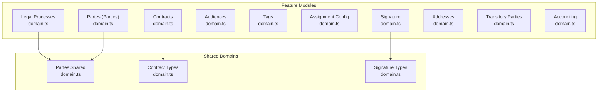

**Diagram sources**
- [domain.ts](file://src/app/(authenticated)/audiencias/domain.ts#L1-L692)
- [domain.ts:1-1180](file://src/shared/partes/domain.ts#L1-L1180)
- [domain.ts:1-368](file://src/shared/contratos/domain.ts#L1-L368)
- [domain.ts:1-610](file://src/shared/assinatura-digital/domain.ts#L1-L610)
- [domain.ts:1-18](file://src/shared/enderecos/domain.ts#L1-L18)
- [domain.ts:1-143](file://src/shared/partes-contrarias-transitorias/domain.ts#L1-L143)
- [domain.ts:1-177](file://src/lib/domain/tags/domain.ts#L1-L177)
- [domain.ts:1-212](file://src/lib/domain/config-atribuicao/domain.ts#L1-L212)

**Section sources**
- [AGENTS.md:38-51](file://AGENTS.md#L38-L51)
- [page.tsx](file://src/app/(ajuda)/ajuda/desenvolvimento/arquitetura/page.tsx#L36-L266)

## Core Components
This section highlights the central building blocks of ZattarOS domain logic:

- Legal Processes (audiências): Defines enums, interfaces, Zod schemas, and business rules for scheduling and managing judicial hearings. Includes validation for modalities, addresses, and timing constraints.
- Parties (partes): Provides unified schemas for clients, adverse parties, and third parties, including CPF/CNPJ validation, phone normalization, and email arrays.
- Contracts: Encapsulates contract lifecycle, statuses, charge types, and party roles with strict validation and labeling.
- Tags: Centralized tag management with color palettes and slug generation for classification.
- Assignment Configuration: Region-based assignment rules with balance methods and TRT coverage.
- Signature: New document signing flow and legacy template/form workflows with comprehensive validation.
- Addresses: CEP normalization and address composition validation.
- Transitory Parties: Temporary party records with promotion rules to definitive parties.
- Accounting: Financial operations domain with banking details and verification rules.

**Section sources**
- [domain.ts](file://src/app/(authenticated)/audiencias/domain.ts#L1-L692)
- [domain.ts:1-1180](file://src/shared/partes/domain.ts#L1-L1180)
- [domain.ts:1-368](file://src/shared/contratos/domain.ts#L1-L368)
- [domain.ts:1-177](file://src/lib/domain/tags/domain.ts#L1-L177)
- [domain.ts:1-212](file://src/lib/domain/config-atribuicao/domain.ts#L1-L212)
- [domain.ts:1-610](file://src/shared/assinatura-digital/domain.ts#L1-L610)
- [domain.ts:1-18](file://src/shared/enderecos/domain.ts#L1-L18)
- [domain.ts:1-143](file://src/shared/partes-contrarias-transitorias/domain.ts#L1-L143)
- [domain.ts:1-57](file://src/shared/prestacao-contas/domain.ts#L1-L57)

## Architecture Overview
ZattarOS follows a layered DDD architecture:
- Domain Layer: Pure business logic, schemas, and rules in domain.ts files
- Application Layer: Services and repositories orchestrating use cases
- Infrastructure Layer: Database, external APIs, and persistence
- UI Layer: React components consuming typed domain interfaces

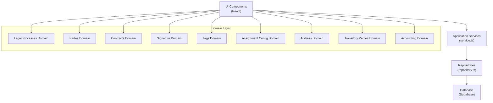

**Diagram sources**
- [AGENTS.md:38-51](file://AGENTS.md#L38-L51)
- [domain.ts:1-1180](file://src/shared/partes/domain.ts#L1-L1180)
- [domain.ts:1-368](file://src/shared/contratos/domain.ts#L1-L368)
- [domain.ts:1-610](file://src/shared/assinatura-digital/domain.ts#L1-L610)
- [domain.ts](file://src/app/(authenticated)/audiencias/domain.ts#L1-L692)

## Detailed Component Analysis

### Legal Processes (Audiências) Domain
The audiências domain encapsulates judicial hearing management with strong validation:
- Enumerations for status, modality, hybrid presence, and tribunal codes
- Interfaces mirroring database rows with enriched fields
- Zod schemas enforcing business rules (e.g., virtual hearings require a URL, presential hearings require complete address)
- Utility functions for origin detection, URL construction, and column selection optimization

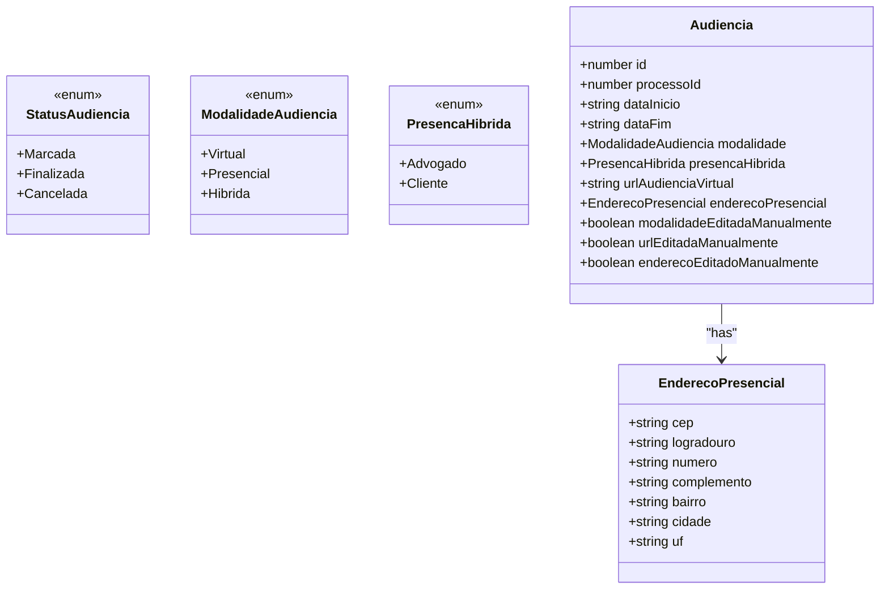

**Diagram sources**
- [domain.ts](file://src/app/(authenticated)/audiencias/domain.ts#L4-L102)

**Section sources**
- [domain.ts](file://src/app/(authenticated)/audiencias/domain.ts#L1-L692)

### Parties (Partes) Domain
The partes domain provides unified schemas for three entity types:
- Clients (PF/PJ)
- Adverse parties (PF/PJ)
- Third parties (PF/PJ)

Core capabilities:
- CPF/CNPJ validation with format and digit checks
- Phone normalization and email array validation
- Discriminated unions for PF/PJ variants
- Comprehensive Zod schemas for creation and updates

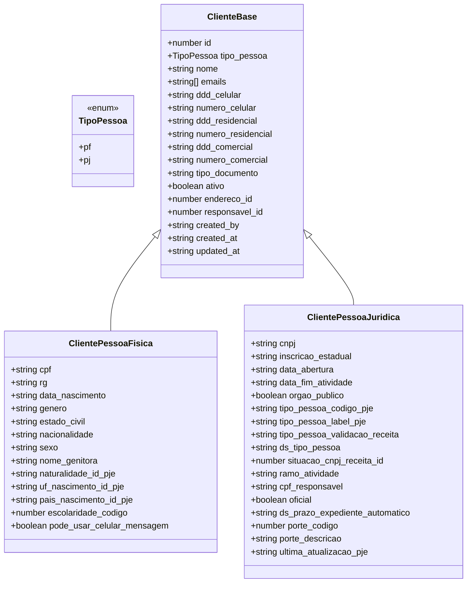

**Diagram sources**
- [domain.ts:212-299](file://src/shared/partes/domain.ts#L212-L299)

**Section sources**
- [domain.ts:1-1180](file://src/shared/partes/domain.ts#L1-L1180)

### Contracts Domain
The contracts domain models legal agreements with:
- Strongly typed enums for segment, contract type, billing type, and status
- Interfaces for contract, contract parts, and status history
- Zod schemas for creation and updates with defaults and validations
- Labels for UI rendering and statistics structures

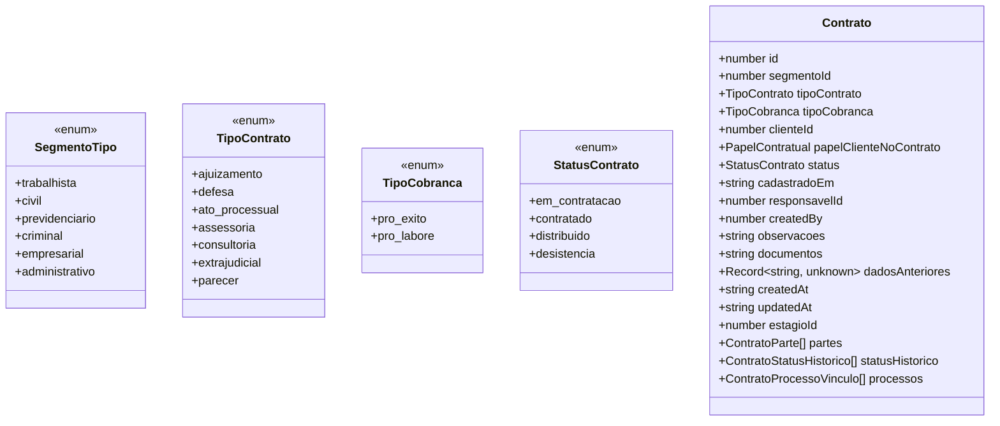

**Diagram sources**
- [domain.ts:121-143](file://src/shared/contratos/domain.ts#L121-L143)

**Section sources**
- [domain.ts:1-368](file://src/shared/contratos/domain.ts#L1-L368)

### Signature Domain
The signature domain supports two workflows:
- New document signing via uploaded PDFs with anchor placement
- Legacy template/form workflow with preview and finalization

Key elements:
- Zod schemas for document creation, signer identification, and finalization
- Ancor types for signature and stamp placement
- Device fingerprinting and geolocation capture
- Template and form management schemas

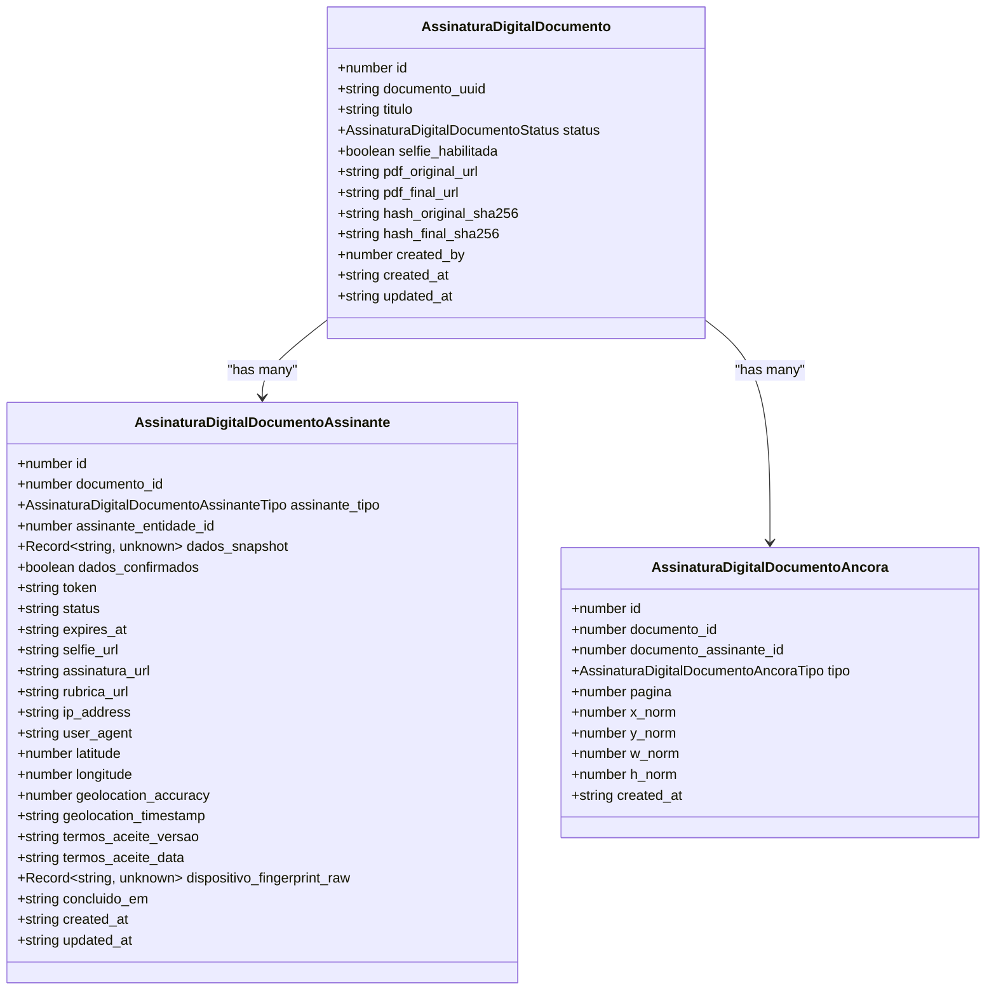

**Diagram sources**
- [domain.ts:303-362](file://src/shared/assinatura-digital/domain.ts#L303-L362)

**Section sources**
- [domain.ts:1-610](file://src/shared/assinatura-digital/domain.ts#L1-L610)

### Tags Domain
The tags domain manages classification labels with:
- Tag and process-tag relationships
- Slug generation and color palette management
- Zod schemas for creation, updates, and linking to processes

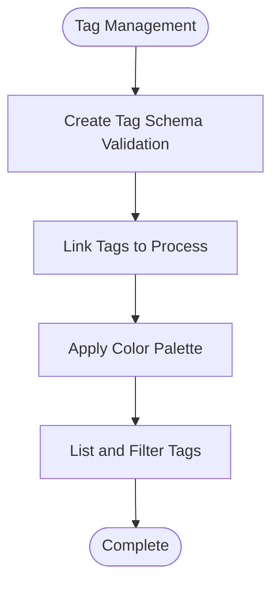

**Diagram sources**
- [domain.ts:54-88](file://src/lib/domain/tags/domain.ts#L54-L88)

**Section sources**
- [domain.ts:1-177](file://src/lib/domain/tags/domain.ts#L1-L177)

### Assignment Configuration Domain
The assignment configuration domain defines:
- Region-based assignment rules with TRT coverage
- Balance methods (count, round-robin, disabled)
- Input schemas for creation and updates with validation

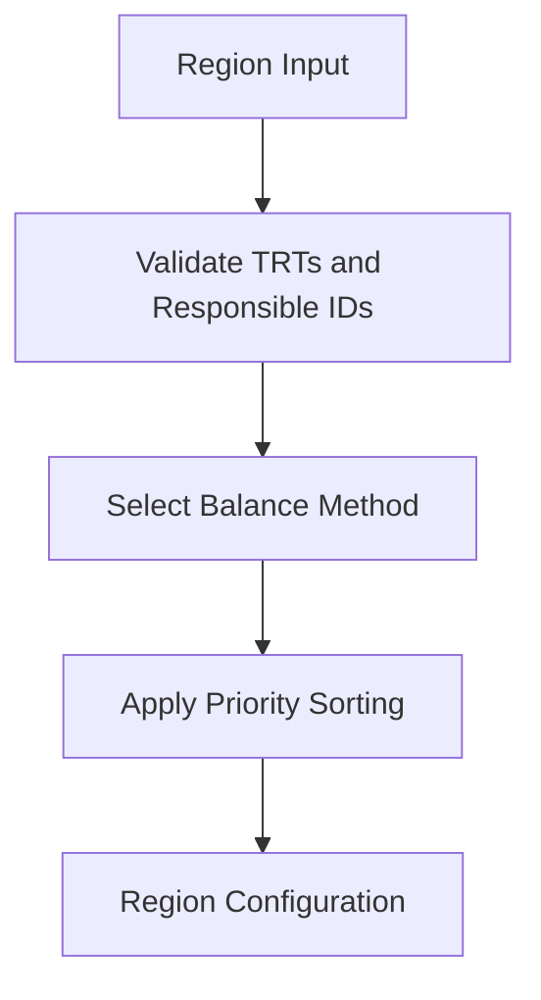

**Diagram sources**
- [domain.ts:129-147](file://src/lib/domain/config-atribuicao/domain.ts#L129-L147)

**Section sources**
- [domain.ts:1-212](file://src/lib/domain/config-atribuicao/domain.ts#L1-L212)

### Addresses Domain
The addresses domain provides:
- CEP normalization and validation
- Address composition schema with required fields

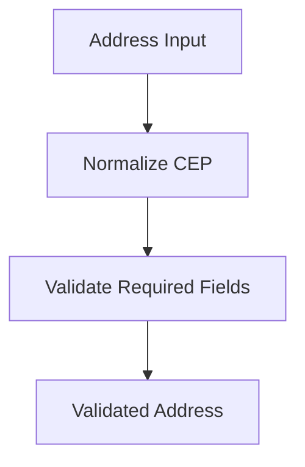

**Diagram sources**
- [domain.ts:4-17](file://src/shared/enderecos/domain.ts#L4-L17)

**Section sources**
- [domain.ts:1-18](file://src/shared/enderecos/domain.ts#L1-L18)

### Transitory Parties Domain
The transitory parties domain manages:
- Pending party records with minimal validation
- Promotion rules to definitive parties
- Merge suggestions for deduplication

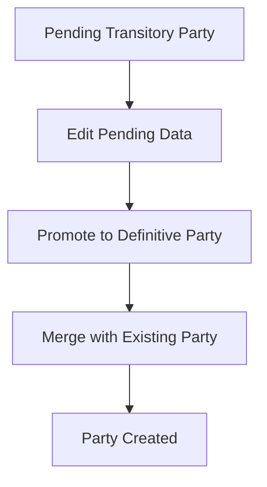

**Diagram sources**
- [domain.ts:103-126](file://src/shared/partes-contrarias-transitorias/domain.ts#L103-L126)

**Section sources**
- [domain.ts:1-143](file://src/shared/partes-contrarias-transitorias/domain.ts#L1-L143)

### Accounting Domain
The accounting domain validates:
- Banking account details and PIX keys
- Confirmation and finalization schemas with geolocation and device fingerprinting

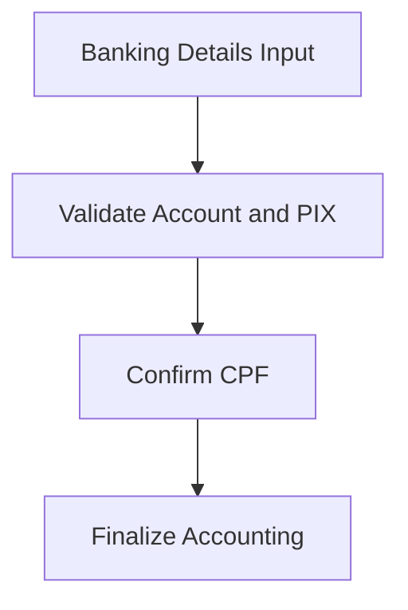

**Diagram sources**
- [domain.ts:3-51](file://src/shared/prestacao-contas/domain.ts#L3-L51)

**Section sources**
- [domain.ts:1-57](file://src/shared/prestacao-contas/domain.ts#L1-L57)

## Dependency Analysis
The domain layer maintains clear dependencies:
- Feature domains import shared domain types when needed (e.g., partes shared types)
- Application services import domain schemas and interfaces
- Repositories map domain inputs to database rows and vice versa
- Database schemas define the authoritative structure for domain entities

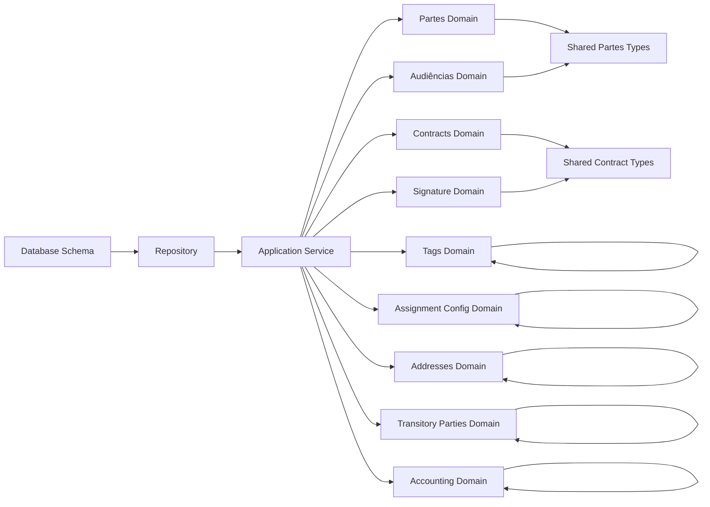

**Diagram sources**
- [domain.ts:1-1180](file://src/shared/partes/domain.ts#L1-L1180)
- [domain.ts:1-368](file://src/shared/contratos/domain.ts#L1-L368)
- [domain.ts](file://src/app/(authenticated)/audiencias/domain.ts#L1-L692)
- [domain.ts:1-610](file://src/shared/assinatura-digital/domain.ts#L1-L610)
- [domain.ts:1-177](file://src/lib/domain/tags/domain.ts#L1-L177)
- [domain.ts:1-212](file://src/lib/domain/config-atribuicao/domain.ts#L1-L212)
- [domain.ts:1-18](file://src/shared/enderecos/domain.ts#L1-L18)
- [domain.ts:1-143](file://src/shared/partes-contrarias-transitorias/domain.ts#L1-L143)
- [domain.ts:1-57](file://src/shared/prestacao-contas/domain.ts#L1-L57)

**Section sources**
- [11_contratos.sql:1-61](file://supabase/schemas/11_contratos.sql#L1-L61)
- [17_processo_partes.sql:1-144](file://supabase/schemas/17_processo_partes.sql#L1-L144)

## Performance Considerations
- Column selection optimization: The audiências domain provides optimized column lists for basic and full listings to reduce disk I/O.
- Indexes: Database schemas include targeted indexes for frequently queried columns (e.g., contracts, processo_partes).
- Validation at the boundary: Zod schemas enforce business rules early, reducing downstream processing overhead.

[No sources needed since this section provides general guidance]

## Troubleshooting Guide
Common issues and resolutions:
- Validation failures: Review Zod schema messages and ensure inputs meet minimum length, format, and enum constraints.
- Business rule violations: Verify modality-specific requirements (e.g., virtual hearings require a URL; presential hearings require a complete address).
- Data mapping errors: Confirm that domain inputs are properly mapped to database rows and vice versa using provided mapping functions.

**Section sources**
- [domain.ts](file://src/app/(authenticated)/audiencias/domain.ts#L124-L164)
- [domain.ts:164-195](file://src/shared/partes/domain.ts#L164-L195)
- [domain.ts:59-68](file://src/shared/assinatura-digital/domain.ts#L59-L68)

## Conclusion
ZattarOS demonstrates robust DDD implementation by centralizing domain logic in feature-specific domain.ts files, enforcing business rules through Zod schemas, and maintaining a single source of truth for types and validation. Bounded contexts for legal processes, parties, contracts, and supporting entities ensure clear separation of concerns. The alignment between domain models and database schemas preserves consistency between business logic and data representation, enabling maintainable and scalable legal domain applications.