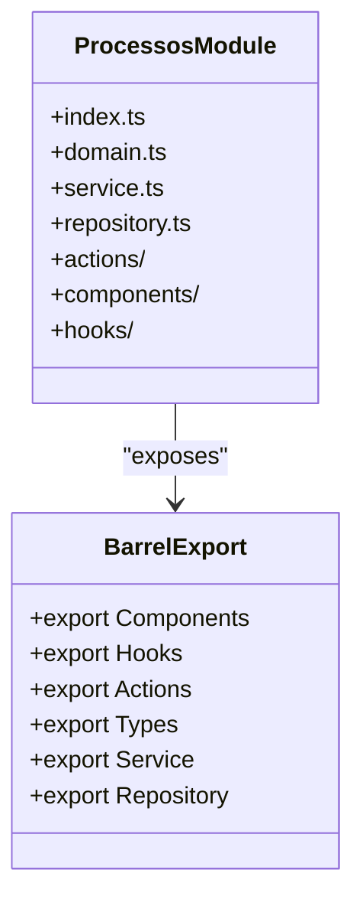
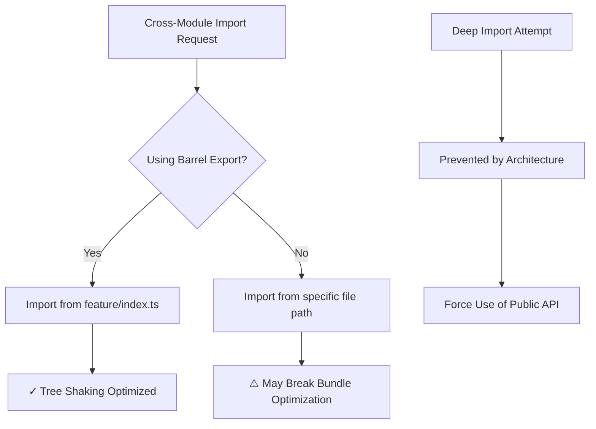
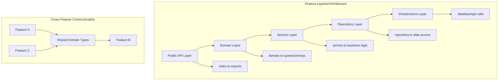
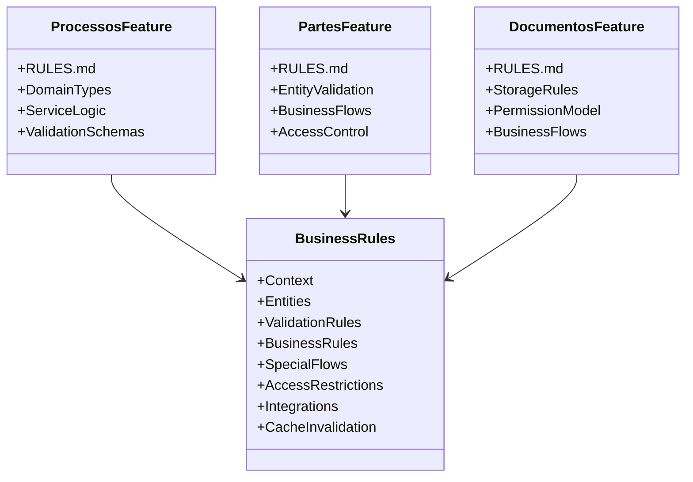
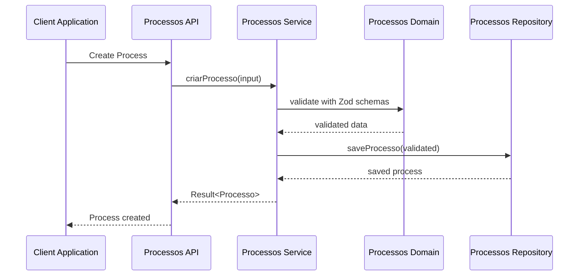
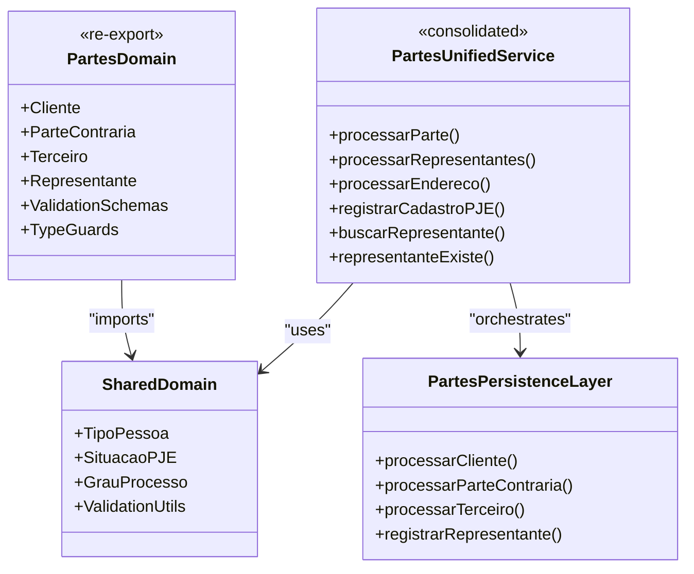
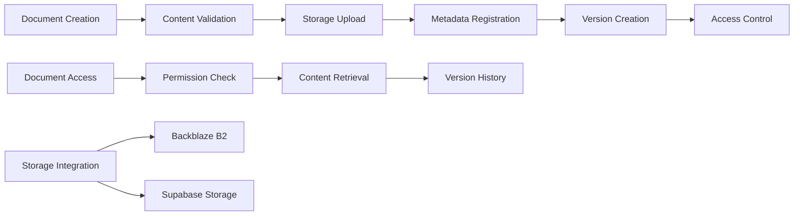
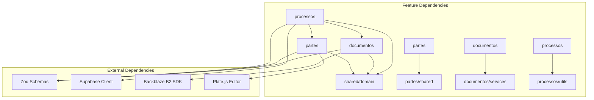
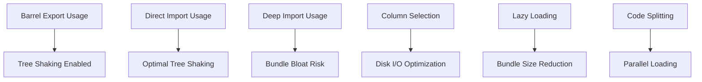
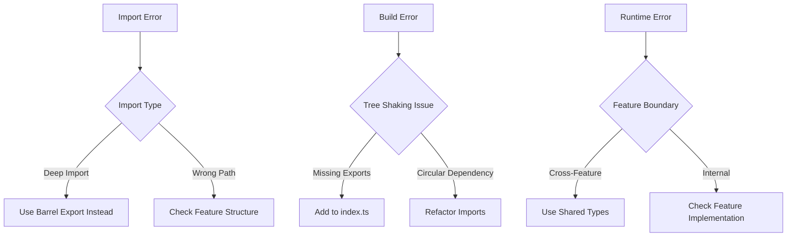

# Feature-Sliced Design Architecture

<cite>
**Referenced Files in This Document**
- [processos/index.ts](file://src/app/(authenticated)/processos/index.ts)
- [partes/index.ts](file://src/app/(authenticated)/partes/index.ts)
- [documentos/index.ts](file://src/app/(authenticated)/documentos/index.ts)
- [processos/RULES.md](file://src/app/(authenticated)/processos/RULES.md)
- [partes/RULES.md](file://src/app/(authenticated)/partes/RULES.md)
- [documentos/RULES.md](file://src/app/(authenticated)/documentos/RULES.md)
- [processos/domain.ts](file://src/app/(authenticated)/processos/domain.ts)
- [partes/domain.ts](file://src/app/(authenticated)/partes/domain.ts)
- [documentos/domain.ts](file://src/app/(authenticated)/documentos/domain.ts)
- [processos/service.ts](file://src/app/(authenticated)/processos/service.ts)
- [partes/service.ts](file://src/app/(authenticated)/partes/service.ts)
- [documentos/service.ts](file://src/app/(authenticated)/documentos/service.ts)
- [partes/services/index.ts](file://src/app/(authenticated)/captura/services/partes/services/index.ts)
- [partes/services/persistence.service.ts](file://src/app/(authenticated)/captura/services/partes/services/persistence.service.ts)
- [partes/services/representatives.service.ts](file://src/app/(authenticated)/captura/services/partes/services/representatives.service.ts)
- [captura/advogados/page-client.tsx](file://src/app/(authenticated)/captura/advogados/page-client.tsx)
- [captura/agendamentos/page-client.tsx](file://src/app/(authenticated)/captura/agendamentos/page-client.tsx)
</cite>

## Update Summary
**Changes Made**
- Updated partes service architecture section to reflect consolidation of service layers
- Removed references to mock page components and Storybook stories that were dropped
- Updated client-side component cleanup section to reflect removal of unused functionality
- Enhanced service layer documentation to show unified partes processing architecture

## Table of Contents
1. [Introduction](#introduction)
2. [Project Structure](#project-structure)
3. [Core Components](#core-components)
4. [Architecture Overview](#architecture-overview)
5. [Detailed Component Analysis](#detailed-component-analysis)
6. [Dependency Analysis](#dependency-analysis)
7. [Performance Considerations](#performance-considerations)
8. [Troubleshooting Guide](#troubleshooting-guide)
9. [Conclusion](#conclusion)

## Introduction

ZattarOS implements Feature-Sliced Design (FSD) architecture to organize its Next.js application codebase. This approach groups related functionality into cohesive feature modules, each containing all necessary files (components, domain logic, services, repositories, actions) within a single directory structure under `src/app/(authenticated)`.

The FSD implementation follows strict import rules, using barrel export patterns through index.ts files as public APIs, and maintains clear boundaries between features while enabling cross-module communication through well-defined interfaces.

**Updated** Removed references to dropped mock components and consolidated partes service architecture documentation to reflect current implementation.

## Project Structure

The FSD architecture organizes the application into feature-focused modules, each with a standardized internal structure:

```mermaid
graph TB
subgraph "Feature Modules Structure"
A[src/app/(authenticated)] --> B[processos/]
A --> C[partes/]
A --> D[documentos/]
B --> B1[index.ts]
B --> B2[domain.ts]
B --> B3[service.ts]
B --> B4[repository.ts]
B --> B5[actions/]
B --> B6[components/]
B --> B7[hooks/]
C --> C1[index.ts]
C --> C2[domain.ts]
C --> C3[service.ts]
C --> C4[repository.ts]
C --> C5[actions/]
C --> C6[components/]
C --> C7[hooks/]
D --> D1[index.ts]
D --> D2[domain.ts]
D --> D3[service.ts]
D --> D4[repository.ts]
D --> D5[actions/]
D --> D6[components/]
D --> D7[hooks/]
end
```

**Diagram sources**
- [processos/index.ts](file://src/app/(authenticated)/processos/index.ts#L1-L225)
- [partes/index.ts](file://src/app/(authenticated)/partes/index.ts#L1-L317)
- [documentos/index.ts](file://src/app/(authenticated)/documentos/index.ts#L1-L197)

Each feature module follows the colocated pattern where all related files are organized within the same directory, promoting feature isolation and maintainability.

**Section sources**
- [processos/index.ts](file://src/app/(authenticated)/processos/index.ts#L1-L225)
- [partes/index.ts](file://src/app/(authenticated)/partes/index.ts#L1-L317)
- [documentos/index.ts](file://src/app/(authenticated)/documentos/index.ts#L1-L197)

## Core Components

### Barrel Export Pattern

Each feature module exposes a public API through its index.ts file, implementing the barrel export pattern. This pattern consolidates exports from various submodules into a single, well-defined interface.



**Diagram sources**
- [processos/index.ts](file://src/app/(authenticated)/processos/index.ts#L20-L225)

The barrel export pattern ensures:
- **Single Point of Access**: All cross-module imports go through the feature's index.ts
- **Tree Shaking Optimization**: Direct imports are preferred for better bundle optimization
- **API Surface Control**: Clear definition of what's publicly available from each feature

### Strict Import Rules

The architecture enforces strict import rules to prevent deep imports and maintain module boundaries:



**Section sources**
- [processos/index.ts](file://src/app/(authenticated)/processos/index.ts#L7-L16)
- [partes/index.ts](file://src/app/(authenticated)/partes/index.ts#L7-L16)
- [documentos/index.ts](file://src/app/(authenticated)/documentos/index.ts#L7-L8)

## Architecture Overview

The FSD architecture implements a layered approach within each feature module:



**Diagram sources**
- [processos/domain.ts](file://src/app/(authenticated)/processos/domain.ts#L1-L674)
- [processos/service.ts](file://src/app/(authenticated)/processos/service.ts#L1-L528)

### Business Logic Documentation Pattern

Each feature module includes a RULES.md file that documents business rules and validation logic:



**Diagram sources**
- [processos/RULES.md](file://src/app/(authenticated)/processos/RULES.md#L1-L106)
- [partes/RULES.md](file://src/app/(authenticated)/partes/RULES.md#L1-L136)
- [documentos/RULES.md](file://src/app/(authenticated)/documentos/RULES.md#L1-L201)

**Section sources**
- [processos/RULES.md](file://src/app/(authenticated)/processos/RULES.md#L1-L106)
- [partes/RULES.md](file://src/app/(authenticated)/partes/RULES.md#L1-L136)
- [documentos/RULES.md](file://src/app/(authenticated)/documentos/RULES.md#L1-L201)

## Detailed Component Analysis

### Processos Feature Module

The processos feature module exemplifies the FSD implementation with comprehensive business logic and validation:



**Diagram sources**
- [processos/service.ts](file://src/app/(authenticated)/processos/service.ts#L47-L124)
- [processos/domain.ts](file://src/app/(authenticated)/processos/domain.ts#L230-L283)

Key characteristics:
- **Comprehensive Validation**: Uses Zod schemas for input validation
- **Business Rule Enforcement**: Implements complex business logic for process creation
- **Type Safety**: Full TypeScript integration with domain-specific types
- **Error Handling**: Structured error handling with Result<T> pattern

**Section sources**
- [processos/index.ts](file://src/app/(authenticated)/processos/index.ts#L1-L225)
- [processos/domain.ts](file://src/app/(authenticated)/processos/domain.ts#L1-L674)
- [processos/service.ts](file://src/app/(authenticated)/processos/service.ts#L1-L528)

### Partes Feature Module

**Updated** The partes feature module now implements a consolidated service architecture that unifies entity processing logic:



**Diagram sources**
- [partes/services/index.ts](file://src/app/(authenticated)/captura/services/partes/services/index.ts#L1-L45)
- [partes/services/persistence.service.ts](file://src/app/(authenticated)/captura/services/partes/services/persistence.service.ts#L63-L144)
- [partes/services/representatives.service.ts](file://src/app/(authenticated)/captura/services/partes/services/representatives.service.ts#L38-L97)

The module implements:
- **Consolidated Entity Processing**: Unified service layer that orchestrates all partes operations
- **Entity Classification Logic**: Intelligent routing of different entity types (cliente, parte_contraria, terceiro)
- **Document Validation**: Comprehensive validation and normalization for CPF/CNPJ processing
- **Representative Management**: Integrated processing of legal representatives with address handling
- **Registration Tracking**: Complete audit trail through cadastros_pje mapping system

Key unified processing flows:
- **Document Normalization**: Automatic CPF/CNPJ validation and formatting
- **Entity Upsert Operations**: Atomic create/update operations with conflict resolution
- **Address Integration**: Automatic address processing and entity linking
- **Representative Coordination**: End-to-end processing of legal representatives

**Section sources**
- [partes/index.ts](file://src/app/(authenticated)/partes/index.ts#L1-L317)
- [partes/domain.ts](file://src/app/(authenticated)/partes/domain.ts#L1-L7)
- [partes/service.ts](file://src/app/(authenticated)/partes/service.ts#L1-L5)
- [partes/services/index.ts](file://src/app/(authenticated)/captura/services/partes/services/index.ts#L1-L45)
- [partes/services/persistence.service.ts](file://src/app/(authenticated)/captura/services/partes/services/persistence.service.ts#L1-L621)
- [partes/services/representatives.service.ts](file://src/app/(authenticated)/captura/services/partes/services/representatives.service.ts#L1-L165)

### Documentos Feature Module

The documentos feature module showcases document management with storage integration:



**Diagram sources**
- [documentos/service.ts](file://src/app/(authenticated)/documentos/service.ts#L91-L151)
- [documentos/domain.ts](file://src/app/(authenticated)/documentos/domain.ts#L67-L140)

Key features:
- **Dual Storage Support**: Integration with both Backblaze B2 and Supabase Storage
- **Version Management**: Comprehensive document versioning system
- **Permission Model**: Fine-grained access control with multiple permission levels
- **Template System**: Document templating with variable substitution

**Section sources**
- [documentos/index.ts](file://src/app/(authenticated)/documentos/index.ts#L1-L197)
- [documentos/domain.ts](file://src/app/(authenticated)/documentos/domain.ts#L1-L800)
- [documentos/service.ts](file://src/app/(authenticated)/documentos/service.ts#L1-L800)

## Dependency Analysis

The FSD architecture establishes clear dependency relationships between features:



**Diagram sources**
- [processos/service.ts](file://src/app/(authenticated)/processos/service.ts#L16-L46)
- [partes/service.ts](file://src/app/(authenticated)/partes/service.ts#L1-L5)
- [documentos/service.ts](file://src/app/(authenticated)/documentos/service.ts#L1-L46)

### Cross-Feature Communication Patterns

The architecture supports several communication patterns:

1. **Direct Feature Imports**: Through barrel exports for type-safe access
2. **Shared Domain Types**: Re-exported shared types for cross-feature usage
3. **Repository Pattern**: Data access abstraction layer
4. **Service Layer**: Business logic encapsulation

**Section sources**
- [processos/index.ts](file://src/app/(authenticated)/processos/index.ts#L194-L225)
- [partes/index.ts](file://src/app/(authenticated)/partes/index.ts#L314-L317)
- [documentos/index.ts](file://src/app/(authenticated)/documentos/index.ts#L189-L197)

## Performance Considerations

The FSD implementation incorporates several performance optimization strategies:

### Tree Shaking Optimization



**Diagram sources**
- [processos/domain.ts](file://src/app/(authenticated)/processos/domain.ts#L575-L673)

Key optimizations:
- **Selective Column Loading**: Database queries optimized with specific column selection
- **Lazy Imports**: Dynamic imports to reduce initial bundle size
- **Feature-Based Code Splitting**: Automatic splitting based on feature boundaries

### Build Optimization Strategies

The architecture promotes optimal build performance through:
- **Barrel Exports**: Controlled public API surface
- **Direct Imports**: Preferred over deep imports for better tree shaking
- **Type-Only Imports**: Reduced runtime dependencies
- **Conditional Loading**: Feature-specific code loading

**Section sources**
- [processos/index.ts](file://src/app/(authenticated)/processos/index.ts#L7-L16)
- [processos/domain.ts](file://src/app/(authenticated)/processos/domain.ts#L575-L673)

## Troubleshooting Guide

### Common Architecture Issues



### Debugging Business Logic

Each feature module includes comprehensive business rule documentation that serves as a debugging aid:

**Section sources**
- [processos/RULES.md](file://src/app/(authenticated)/processos/RULES.md#L1-L106)
- [partes/RULES.md](file://src/app/(authenticated)/partes/RULES.md#L1-L136)
- [documentos/RULES.md](file://src/app/(authenticated)/documentos/RULES.md#L1-L201)

## Conclusion

The Feature-Sliced Design implementation in ZattarOS provides a robust, scalable architecture that enhances maintainability, team collaboration, and feature isolation. The colocated module pattern, combined with strict import rules and comprehensive business logic documentation, creates a clear separation of concerns while maintaining efficient development workflows.

**Updated** Recent improvements include the consolidation of the partes service architecture into a unified processing layer, removal of unused mock components and Storybook stories, and cleanup of client-side functionality that was no longer needed.

Key benefits achieved through this implementation:

- **Enhanced Maintainability**: Clear feature boundaries and comprehensive documentation
- **Improved Team Collaboration**: Well-defined APIs and shared domain types
- **Better Performance**: Optimized imports and tree shaking support
- **Scalable Architecture**: Easy addition of new features following established patterns
- **Cognitive Agent Integration**: Structured business rules enable automation and AI assistance
- **Cleaner Codebase**: Removal of unused components and consolidated service layers

The architecture successfully balances developer productivity with system performance, providing a solid foundation for continued growth and feature development while maintaining code quality through disciplined architectural practices.