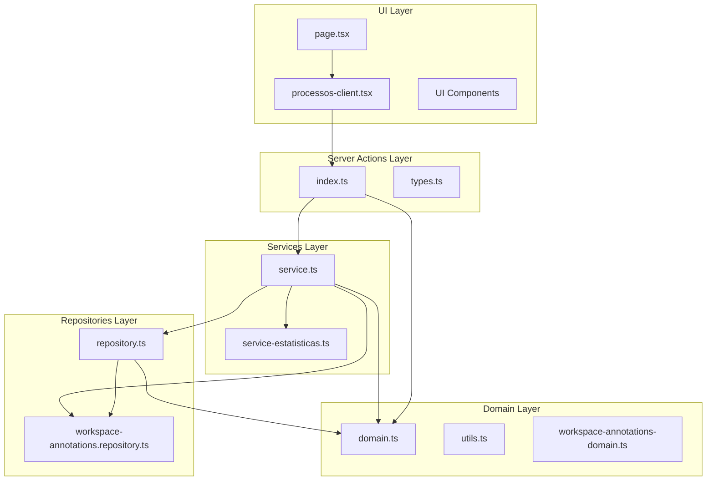
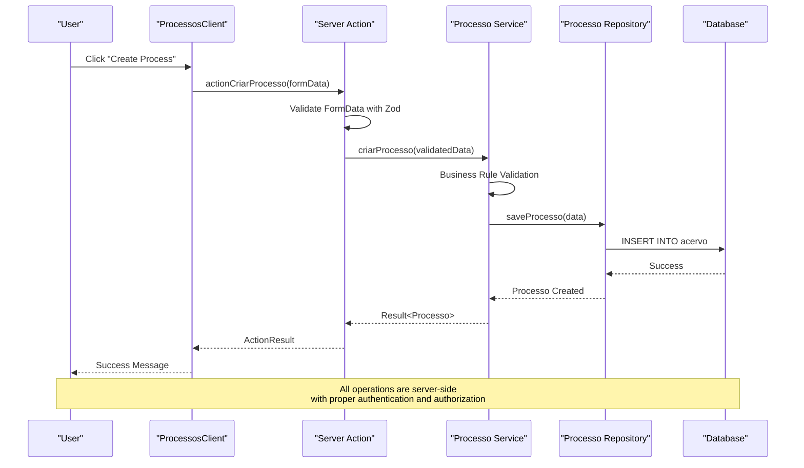
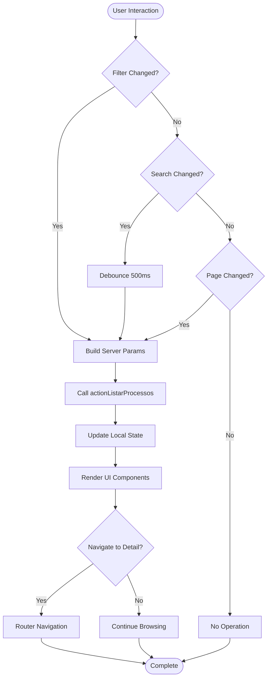
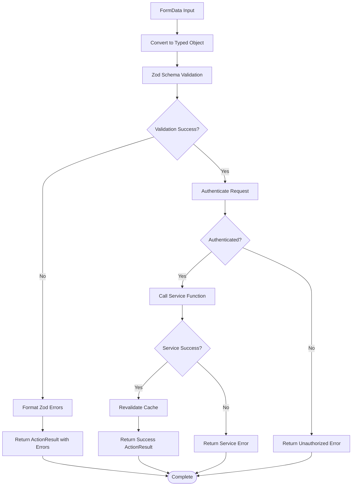
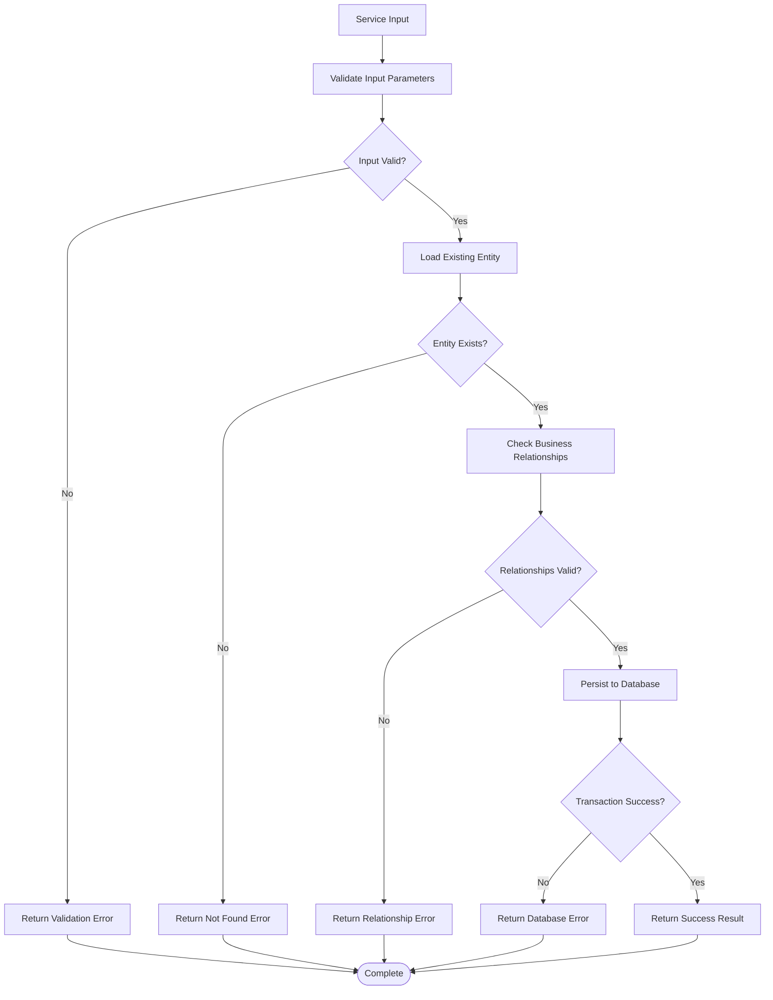
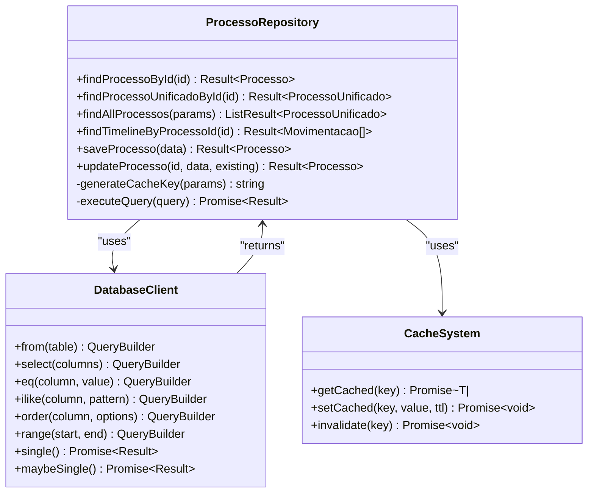
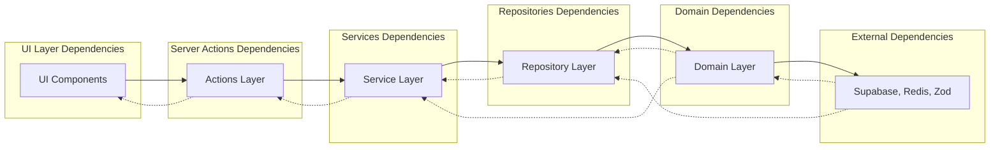

# Layered Architecture Pattern

<cite>
**Referenced Files in This Document**
- [page.tsx](file://src/app/(authenticated)/processos/page.tsx)
- [processos-client.tsx](file://src/app/(authenticated)/processos/processos-client.tsx)
- [actions/index.ts](file://src/app/(authenticated)/processos/actions/index.ts)
- [actions/types.ts](file://src/app/(authenticated)/processos/actions/types.ts)
- [service.ts](file://src/app/(authenticated)/processos/service.ts)
- [repository.ts](file://src/app/(authenticated)/processos/repository.ts)
- [domain.ts](file://src/app/(authenticated)/processos/domain.ts)
- [utils.ts](file://src/app/(authenticated)/processos/utils.ts)
- [service-estatisticas.ts](file://src/app/(authenticated)/processos/service-estatisticas.ts)
- [workspace-annotations.repository.ts](file://src/app/(authenticated)/processos/workspace-annotations.repository.ts)
- [workspace-annotations-domain.ts](file://src/app/(authenticated)/processos/workspace-annotations-domain.ts)
</cite>

## Table of Contents
1. [Introduction](#introduction)
2. [Project Structure](#project-structure)
3. [Core Components](#core-components)
4. [Architecture Overview](#architecture-overview)
5. [Detailed Component Analysis](#detailed-component-analysis)
6. [Dependency Analysis](#dependency-analysis)
7. [Performance Considerations](#performance-considerations)
8. [Troubleshooting Guide](#troubleshooting-guide)
9. [Conclusion](#conclusion)

## Introduction

The ZattarOS processos module demonstrates a clean layered architecture pattern that separates concerns across four distinct layers: UI Components, Server Actions, Services (Use Cases), and Repositories (Data Access). This pattern ensures maintainability, testability, and clear separation of responsibilities while supporting complex judicial process management functionality.

The architecture follows the principle that each layer has specific responsibilities:
- **UI Components**: Handle presentation and user interaction
- **Server Actions**: Manage data mutations and form submissions
- **Services**: Contain business logic and use case implementations
- **Repositories**: Handle database and external API interactions

## Project Structure

The processos module is organized around a clear layered structure within the authenticated area of the application:

**Diagram sources**
- [page.tsx:1-42](file://src/app/(authenticated)/processos/page.tsx#L1-L42)
- [processos-client.tsx:1-267](file://src/app/(authenticated)/processos/processos-client.tsx#L1-L267)
- [actions/index.ts:1-800](file://src/app/(authenticated)/processos/actions/index.ts#L1-L800)
- [service.ts:1-528](file://src/app/(authenticated)/processos/service.ts#L1-L528)
- [repository.ts:1-800](file://src/app/(authenticated)/processos/repository.ts#L1-L800)

**Section sources**
- [page.tsx:1-42](file://src/app/(authenticated)/processos/page.tsx#L1-L42)
- [processos-client.tsx:1-267](file://src/app/(authenticated)/processos/processos-client.tsx#L1-L267)

## Core Components

### UI Layer Components

The UI layer consists of two main components that handle different aspects of the user interface:

**ProcessosPage** (`page.tsx`)
- Server-side rendering component that orchestrates data fetching
- Handles authentication and coordinates between different services
- Fetches process data, statistics, and user information concurrently
- Passes data to the client component for interactive rendering

**ProcessosClient** (`processos-client.tsx`)
- Client-side component that manages interactive state and user interactions
- Implements filtering, search, pagination, and view switching
- Handles real-time updates and user-driven modifications
- Manages optimistic updates for immediate UI feedback

### Server Actions Layer

The Server Actions layer serves as the boundary between UI and business logic:

**Action Functions** (`actions/index.ts`)
- Convert FormData to typed objects using Zod schemas
- Perform authentication checks and authorization
- Validate inputs according to domain-specific rules
- Coordinate with services for business operations
- Handle caching invalidation and revalidation
- Return structured ActionResult objects

### Services Layer

The Services layer encapsulates business logic and use cases:

**Processo Service** (`service.ts`)
- Implements core business rules for process management
- Validates business constraints and relationships
- Coordinates between repositories for complex operations
- Provides transaction-like behavior through database clients
- Handles cross-entity relationships and dependencies

**Statistics Service** (`service-estatisticas.ts`)
- Aggregates process statistics from multiple data sources
- Computes derived metrics and counts
- Optimizes queries using concurrent database operations

### Repositories Layer

The Repositories layer handles all data access operations:

**Processo Repository** (`repository.ts`)
- Implements database queries with comprehensive filtering
- Supports 19 different filter parameters for flexible querying
- Provides optimized column selection for performance
- Implements caching strategies for frequently accessed data
- Handles complex joins and aggregations

**Workspace Annotations Repository** (`workspace-annotations.repository.ts`)
- Manages workspace annotation persistence
- Provides typed database operations
- Implements proper error handling and validation

### Domain Layer

The Domain layer defines the core business entities and validation rules:

**Domain Definitions** (`domain.ts`)
- Defines Processo and ProcessoUnificado entity structures
- Provides Zod schemas for input validation
- Specifies business rules and constraints
- Includes enums for status, degree, and origin types
- Offers utility functions for data transformation

**Section sources**
- [page.tsx:1-42](file://src/app/(authenticated)/processos/page.tsx#L1-L42)
- [processos-client.tsx:1-267](file://src/app/(authenticated)/processos/processos-client.tsx#L1-L267)
- [actions/index.ts:1-800](file://src/app/(authenticated)/processos/actions/index.ts#L1-L800)
- [service.ts:1-528](file://src/app/(authenticated)/processos/service.ts#L1-L528)
- [repository.ts:1-800](file://src/app/(authenticated)/processos/repository.ts#L1-L800)
- [domain.ts:1-674](file://src/app/(authenticated)/processos/domain.ts#L1-L674)

## Architecture Overview

The layered architecture ensures clear separation of concerns and enables independent development and testing:

**Diagram sources**
- [processos-client.tsx:165-175](file://src/app/(authenticated)/processos/processos-client.tsx#L165-L175)
- [actions/index.ts:264-323](file://src/app/(authenticated)/processos/actions/index.ts#L264-L323)
- [service.ts:56-124](file://src/app/(authenticated)/processos/service.ts#L56-L124)
- [repository.ts:181-220](file://src/app/(authenticated)/processos/repository.ts#L181-L220)

The architecture enforces several key principles:

1. **Separation of Concerns**: Each layer has distinct responsibilities
2. **Testability**: Services and repositories can be tested independently
3. **Maintainability**: Changes in one layer don't necessarily affect others
4. **Security**: All data operations occur server-side with proper authentication
5. **Performance**: Caching and optimized queries in the repository layer

## Detailed Component Analysis

### UI Component Flow

The UI components demonstrate reactive state management and efficient data loading:

**Diagram sources**
- [processos-client.tsx:84-153](file://src/app/(authenticated)/processos/processos-client.tsx#L84-L153)
- [processos-client.tsx:124-139](file://src/app/(authenticated)/processos/processos-client.tsx#L124-L139)

### Server Action Processing

Server Actions implement comprehensive input validation and error handling:

**Diagram sources**
- [actions/index.ts:268-323](file://src/app/(authenticated)/processos/actions/index.ts#L268-L323)
- [actions/index.ts:418-464](file://src/app/(authenticated)/processos/actions/index.ts#L418-L464)

### Service Business Logic Implementation

The Service layer implements complex business rules and validation:

**Diagram sources**
- [service.ts:250-356](file://src/app/(authenticated)/processos/service.ts#L250-L356)
- [service.ts:428-475](file://src/app/(authenticated)/processos/service.ts#L428-L475)

### Repository Data Access Patterns

The Repository layer implements sophisticated query building and caching:

**Diagram sources**
- [repository.ts:181-220](file://src/app/(authenticated)/processos/repository.ts#L181-L220)
- [repository.ts:336-664](file://src/app/(authenticated)/processos/repository.ts#L336-L664)

**Section sources**
- [processos-client.tsx:1-267](file://src/app/(authenticated)/processos/processos-client.tsx#L1-L267)
- [actions/index.ts:1-800](file://src/app/(authenticated)/processos/actions/index.ts#L1-L800)
- [service.ts:1-528](file://src/app/(authenticated)/processos/service.ts#L1-L528)
- [repository.ts:1-800](file://src/app/(authenticated)/processos/repository.ts#L1-L800)

## Dependency Analysis

The layered architecture creates clear dependency boundaries that prevent circular dependencies and enable independent development:

**Diagram sources**
- [domain.ts:1-674](file://src/app/(authenticated)/processos/domain.ts#L1-L674)
- [repository.ts:16-44](file://src/app/(authenticated)/processos/repository.ts#L16-L44)
- [service.ts:16-41](file://src/app/(authenticated)/processos/service.ts#L16-L41)

The dependency flow ensures:

1. **Bottom-up data flow**: UI → Actions → Services → Repositories → Database
2. **Top-down validation**: Database → Repositories → Services → Actions → UI
3. **No reverse dependencies**: Higher layers don't import lower layers
4. **Interface segregation**: Each layer exposes only necessary interfaces

**Section sources**
- [domain.ts:1-674](file://src/app/(authenticated)/processos/domain.ts#L1-L674)
- [repository.ts:1-800](file://src/app/(authenticated)/processos/repository.ts#L1-L800)
- [service.ts:1-528](file://src/app/(authenticated)/processos/service.ts#L1-L528)

## Performance Considerations

The architecture implements several performance optimization strategies:

### Caching Strategy
- **Redis Caching**: Repository layer implements intelligent caching with cache keys
- **Query Result Caching**: Frequently accessed lists are cached for 5 minutes
- **Invalidation Strategy**: Cache invalidation on data changes
- **Selective Column Loading**: Different column sets for different use cases

### Database Optimization
- **Indexed Filters First**: Repository applies indexed filters before text searches
- **Concurrent Operations**: Statistics service uses Promise.all for concurrent queries
- **Column Selection**: Optimized column loading reduces I/O by 40%
- **Pagination Support**: Built-in pagination prevents large result sets

### Network Efficiency
- **SSR + Hydration**: Server-side rendering with client hydration
- **Debounced Search**: 500ms debounce for search operations
- **Batch Operations**: Batch updates for bulk operations

## Troubleshooting Guide

### Common Issues and Solutions

**Authentication Failures**
- Verify `authenticateRequest()` is called in all Server Actions
- Check session validity and user permissions
- Ensure proper error handling in action functions

**Validation Errors**
- Review Zod schema definitions in domain.ts
- Check action conversion functions for proper field mapping
- Validate FormData structure matches expected types

**Database Connection Issues**
- Verify Supabase client initialization
- Check connection pooling and timeout settings
- Monitor query performance and optimize slow queries

**Caching Problems**
- Clear Redis cache when data structures change
- Verify cache key generation logic
- Check cache invalidation triggers

**Section sources**
- [actions/index.ts:268-323](file://src/app/(authenticated)/processos/actions/index.ts#L268-L323)
- [repository.ts:341-349](file://src/app/(authenticated)/processos/repository.ts#L341-L349)

## Conclusion

The ZattarOS processos module exemplifies a well-structured layered architecture that successfully separates concerns across UI components, Server Actions, Services, and Repositories. This pattern provides excellent maintainability, testability, and scalability for complex judicial process management systems.

Key benefits of this architecture include:

- **Clear Separation of Concerns**: Each layer has distinct responsibilities
- **Enhanced Testability**: Independent testing of services and repositories
- **Improved Maintainability**: Modular structure enables focused development
- **Better Security**: All operations occur server-side with proper validation
- **Optimized Performance**: Strategic caching and query optimization
- **Scalable Design**: Easy to extend with additional layers or components

The architecture successfully handles complex requirements including 19 different filter parameters, real-time updates, concurrent operations, and comprehensive validation while maintaining clean code organization and clear dependency management.