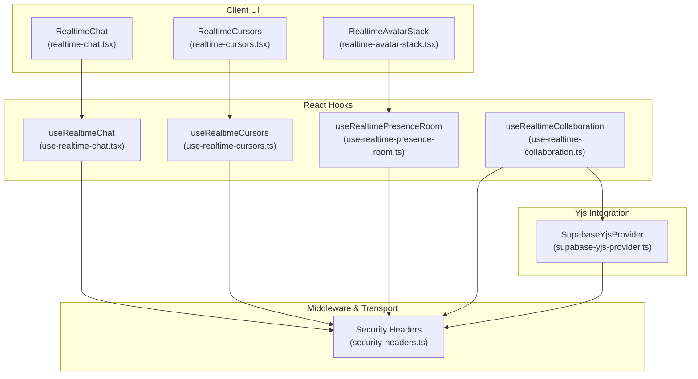
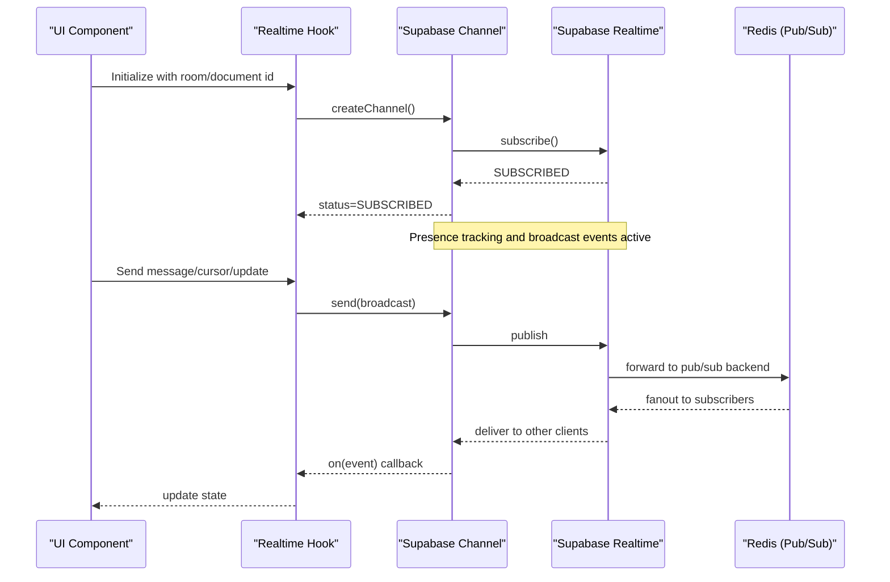
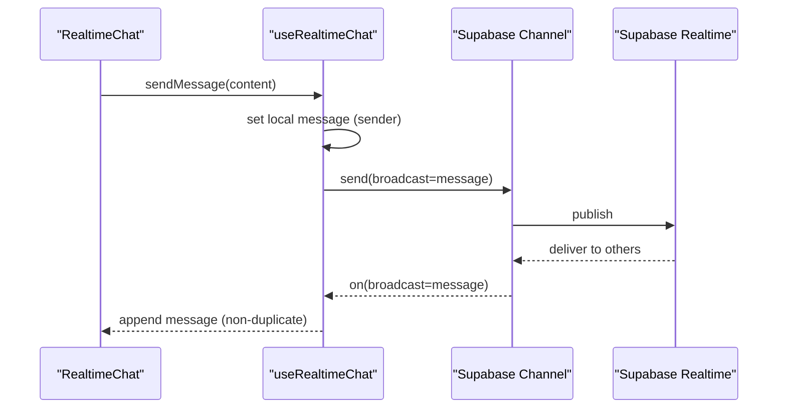
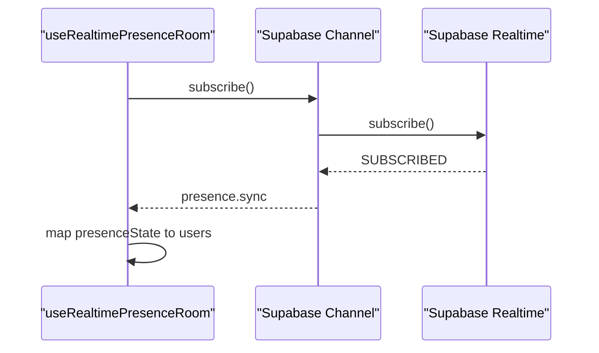
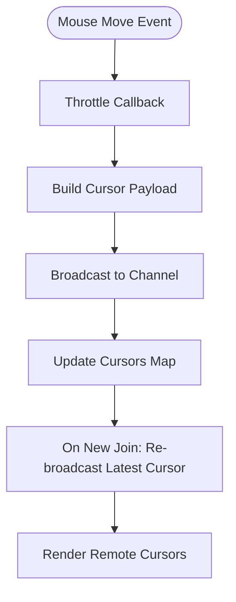
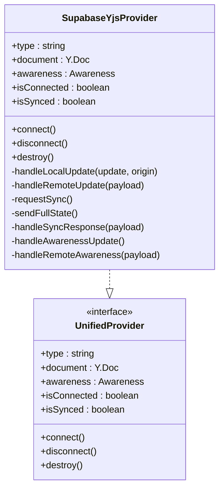
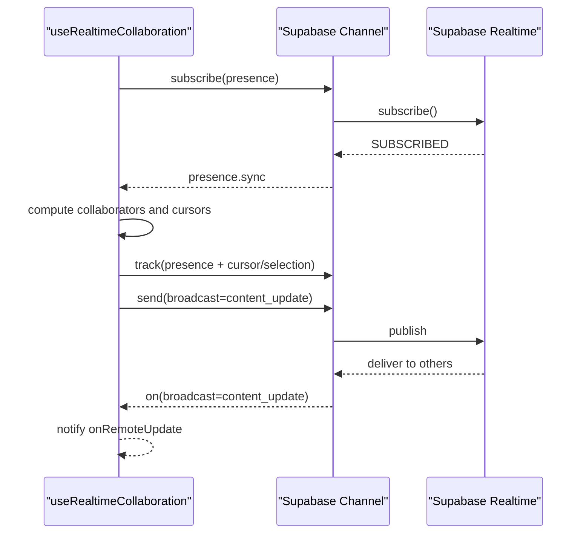
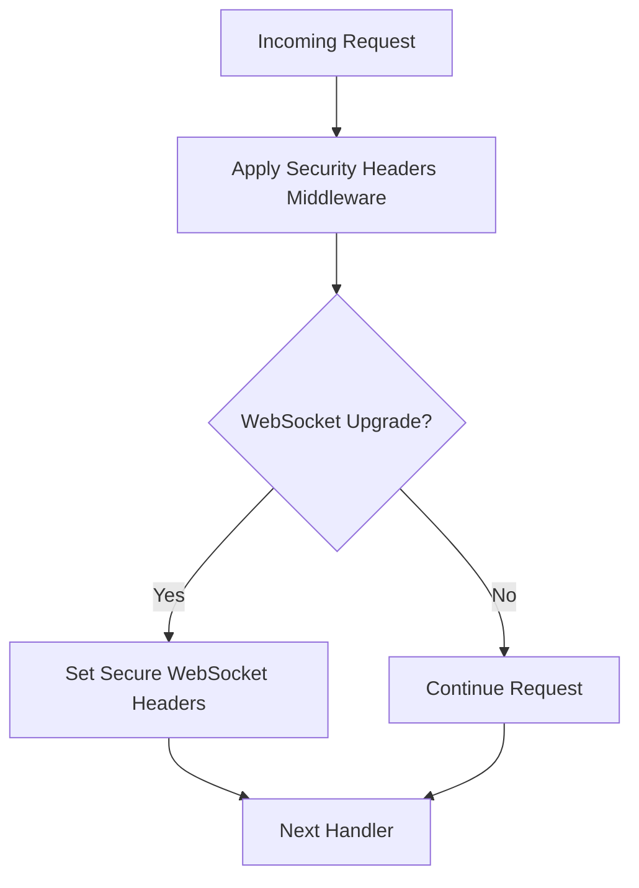
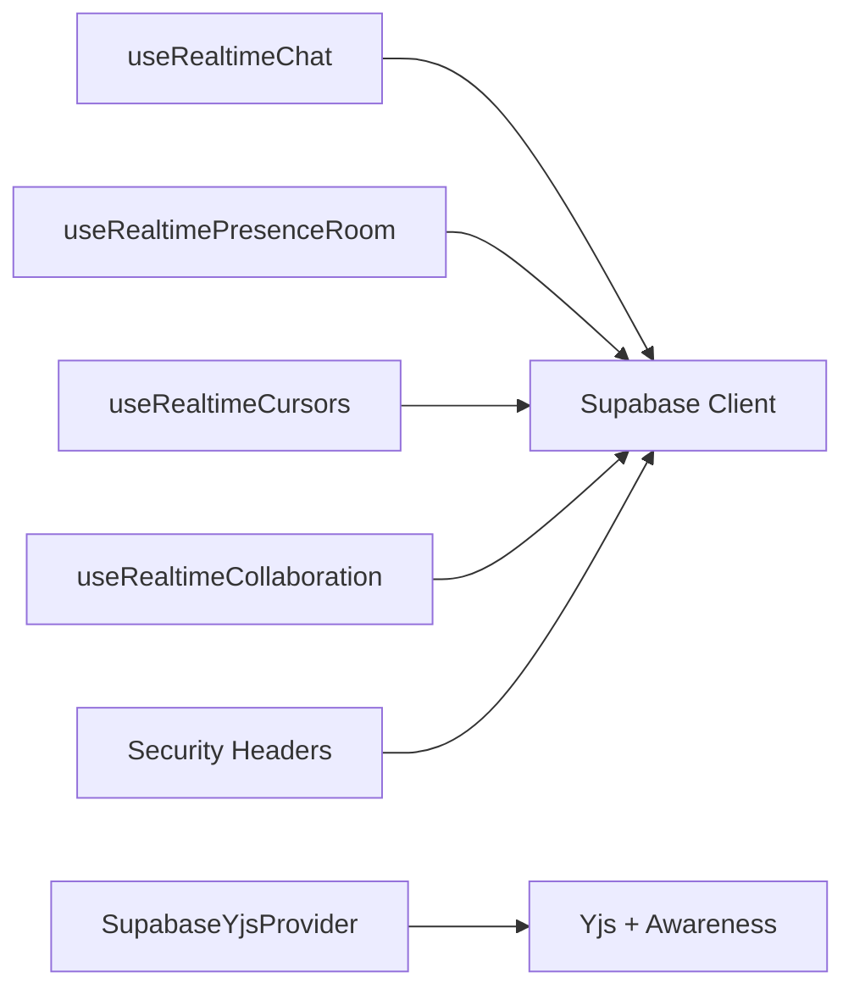

# Real-time Features Architecture

<cite>
**Referenced Files in This Document**
- [use-realtime-chat.tsx](file://src/hooks/use-realtime-chat.tsx)
- [realtime-chat.tsx](file://src/components/realtime/realtime-chat.tsx)
- [use-realtime-collaboration.ts](file://src/hooks/use-realtime-collaboration.ts)
- [use-realtime-presence-room.ts](file://src/hooks/use-realtime-presence-room.ts)
- [use-realtime-cursors.ts](file://src/hooks/use-realtime-cursors.ts)
- [realtime-cursors.tsx](file://src/components/realtime/realtime-cursors.tsx)
- [realtime-avatar-stack.tsx](file://src/components/realtime/realtime-avatar-stack.tsx)
- [supabase-yjs-provider.ts](file://src/lib/yjs/supabase-yjs-provider.ts)
- [security-headers.ts](file://src/middleware/security-headers.ts)
</cite>

## Table of Contents
1. [Introduction](#introduction)
2. [Project Structure](#project-structure)
3. [Core Components](#core-components)
4. [Architecture Overview](#architecture-overview)
5. [Detailed Component Analysis](#detailed-component-analysis)
6. [Dependency Analysis](#dependency-analysis)
7. [Performance Considerations](#performance-considerations)
8. [Troubleshooting Guide](#troubleshooting-guide)
9. [Conclusion](#conclusion)

## Introduction
This document describes the real-time features architecture in ZattarOS, focusing on WebSocket-based communication, presence indicators, collaborative editing with Yjs, and notification mechanisms. The system integrates Supabase Realtime for scalable pub/sub messaging, uses Redis for caching and pub/sub capabilities, and applies middleware for security headers. It covers real-time data synchronization patterns, conflict resolution strategies, performance optimizations, and practical examples for chat, collaborative documents, and live dashboards. Scalability, connection management, and offline fallbacks are addressed to ensure robust operation under varying network conditions.

## Project Structure
The real-time subsystem is organized around reusable React hooks, UI components, and a Yjs provider that bridges collaborative editing with Supabase Realtime. Middleware ensures secure transport, while Redis supports caching and pub/sub scaling.

**Diagram sources**
- [realtime-chat.tsx:1-70](file://src/components/realtime/realtime-chat.tsx#L1-L70)
- [realtime-cursors.tsx:1-30](file://src/components/realtime/realtime-cursors.tsx#L1-L30)
- [realtime-avatar-stack.tsx:1-18](file://src/components/realtime/realtime-avatar-stack.tsx#L1-L18)
- [use-realtime-chat.tsx:1-256](file://src/hooks/use-realtime-chat.tsx#L1-L256)
- [use-realtime-collaboration.ts:1-244](file://src/hooks/use-realtime-collaboration.ts#L1-L244)
- [use-realtime-presence-room.ts:1-56](file://src/hooks/use-realtime-presence-room.ts#L1-L56)
- [use-realtime-cursors.ts:1-177](file://src/hooks/use-realtime-cursors.ts#L1-L177)
- [supabase-yjs-provider.ts:1-358](file://src/lib/yjs/supabase-yjs-provider.ts#L1-L358)
- [security-headers.ts](file://src/middleware/security-headers.ts)

**Section sources**
- [use-realtime-chat.tsx:1-256](file://src/hooks/use-realtime-chat.tsx#L1-L256)
- [use-realtime-collaboration.ts:1-244](file://src/hooks/use-realtime-collaboration.ts#L1-L244)
- [use-realtime-presence-room.ts:1-56](file://src/hooks/use-realtime-presence-room.ts#L1-L56)
- [use-realtime-cursors.ts:1-177](file://src/hooks/use-realtime-cursors.ts#L1-L177)
- [realtime-chat.tsx:1-70](file://src/components/realtime/realtime-chat.tsx#L1-L70)
- [realtime-cursors.tsx:1-30](file://src/components/realtime/realtime-cursors.tsx#L1-L30)
- [realtime-avatar-stack.tsx:1-18](file://src/components/realtime/realtime-avatar-stack.tsx#L1-L18)
- [supabase-yjs-provider.ts:1-358](file://src/lib/yjs/supabase-yjs-provider.ts#L1-L358)
- [security-headers.ts](file://src/middleware/security-headers.ts)

## Core Components
- Real-time chat: Broadcast-based chat with typing indicators using Supabase Realtime channels.
- Presence room: Room-based presence tracking with user metadata.
- Cursor overlays: Real-time mouse cursor positions with throttling and deduplication.
- Collaborative editing: Yjs-based CRDT synchronization via Supabase Realtime channels.
- Security headers: Middleware ensuring secure WebSocket transport and headers.

**Section sources**
- [use-realtime-chat.tsx:33-256](file://src/hooks/use-realtime-chat.tsx#L33-L256)
- [use-realtime-presence-room.ts:16-56](file://src/hooks/use-realtime-presence-room.ts#L16-L56)
- [use-realtime-cursors.ts:61-177](file://src/hooks/use-realtime-cursors.ts#L61-L177)
- [use-realtime-collaboration.ts:53-244](file://src/hooks/use-realtime-collaboration.ts#L53-L244)
- [supabase-yjs-provider.ts:78-358](file://src/lib/yjs/supabase-yjs-provider.ts#L78-L358)
- [security-headers.ts](file://src/middleware/security-headers.ts)

## Architecture Overview
ZattarOS leverages Supabase Realtime for WebSocket-based pub/sub messaging. The architecture centers on:
- Channels: Room-based channels for chat and presence, document-specific channels for Yjs collaboration.
- Events: Broadcast events for messages, typing, cursor movement, and Yjs updates; presence events for join/leave/sync.
- Providers: React hooks manage lifecycle, event subscriptions, and state updates.
- Middleware: Security headers ensure trusted WebSocket upgrades and headers.
- Redis: Used for caching and horizontal pub/sub scaling (configured via environment and deployment).

**Diagram sources**
- [use-realtime-chat.tsx:79-151](file://src/hooks/use-realtime-chat.tsx#L79-L151)
- [use-realtime-cursors.ts:107-163](file://src/hooks/use-realtime-cursors.ts#L107-L163)
- [use-realtime-collaboration.ts:88-181](file://src/hooks/use-realtime-collaboration.ts#L88-L181)
- [supabase-yjs-provider.ts:134-192](file://src/lib/yjs/supabase-yjs-provider.ts#L134-L192)
- [security-headers.ts](file://src/middleware/security-headers.ts)

## Detailed Component Analysis

### Real-time Chat
The chat component provides broadcast-based messaging with typing indicators. It manages:
- Message broadcasting and deduplication.
- Typing state with timeouts and self-filtering.
- Connection state reporting.

**Diagram sources**
- [realtime-chat.tsx:14-67](file://src/components/realtime/realtime-chat.tsx#L14-L67)
- [use-realtime-chat.tsx:204-232](file://src/hooks/use-realtime-chat.tsx#L204-L232)
- [use-realtime-chat.tsx:82-93](file://src/hooks/use-realtime-chat.tsx#L82-L93)

**Section sources**
- [use-realtime-chat.tsx:33-256](file://src/hooks/use-realtime-chat.tsx#L33-L256)
- [realtime-chat.tsx:1-70](file://src/components/realtime/realtime-chat.tsx#L1-L70)

### Presence Indicators
Presence is tracked per room. Users join rooms and track presence keys. The state is derived from the channel presence snapshot.

**Diagram sources**
- [use-realtime-presence-room.ts:23-47](file://src/hooks/use-realtime-presence-room.ts#L23-L47)

**Section sources**
- [use-realtime-presence-room.ts:16-56](file://src/hooks/use-realtime-presence-room.ts#L16-L56)
- [realtime-avatar-stack.tsx:7-17](file://src/components/realtime/realtime-avatar-stack.tsx#L7-L17)

### Cursor Overlays
Cursor positions are broadcast with throttling to reduce traffic. New participants receive the latest cursor payload upon joining.

**Diagram sources**
- [use-realtime-cursors.ts:77-105](file://src/hooks/use-realtime-cursors.ts#L77-L105)
- [use-realtime-cursors.ts:123-148](file://src/hooks/use-realtime-cursors.ts#L123-L148)
- [realtime-cursors.tsx:8-29](file://src/components/realtime/realtime-cursors.tsx#L8-L29)

**Section sources**
- [use-realtime-cursors.ts:1-177](file://src/hooks/use-realtime-cursors.ts#L1-L177)
- [realtime-cursors.tsx:1-30](file://src/components/realtime/realtime-cursors.tsx#L1-L30)

### Collaborative Editing with Yjs
The SupabaseYjsProvider implements a unified provider for Yjs CRDT synchronization over Supabase Realtime:
- Connects to a document-specific channel.
- Handles local Yjs updates and broadcasts them as events.
- Requests and applies full state on initial sync.
- Manages awareness updates for collaborators.
- Prevents echo loops by filtering self-originated updates.

**Diagram sources**
- [supabase-yjs-provider.ts:78-358](file://src/lib/yjs/supabase-yjs-provider.ts#L78-L358)

**Section sources**
- [supabase-yjs-provider.ts:78-358](file://src/lib/yjs/supabase-yjs-provider.ts#L78-L358)

### Real-time Collaboration Hook
The collaboration hook orchestrates presence, cursor/selection updates, and content broadcasts for collaborative editing.

**Diagram sources**
- [use-realtime-collaboration.ts:88-181](file://src/hooks/use-realtime-collaboration.ts#L88-L181)
- [use-realtime-collaboration.ts:141-154](file://src/hooks/use-realtime-collaboration.ts#L141-L154)

**Section sources**
- [use-realtime-collaboration.ts:53-244](file://src/hooks/use-realtime-collaboration.ts#L53-L244)

### Middleware for Security Headers
Security headers ensure proper WebSocket upgrade and transport security. This middleware is applied globally to enforce CSP and header policies for real-time connections.

**Diagram sources**
- [security-headers.ts](file://src/middleware/security-headers.ts)

**Section sources**
- [security-headers.ts](file://src/middleware/security-headers.ts)

## Dependency Analysis
- React hooks depend on Supabase client for channel creation and event subscription.
- Yjs provider depends on Yjs and awareness protocols for CRDT synchronization.
- Presence and broadcast events rely on Supabase Realtime channel semantics.
- Middleware ensures transport-level security for WebSocket upgrades.

**Diagram sources**
- [use-realtime-chat.tsx:30-60](file://src/hooks/use-realtime-chat.tsx#L30-L60)
- [use-realtime-presence-room.ts:3-8](file://src/hooks/use-realtime-presence-room.ts#L3-L8)
- [use-realtime-cursors.ts:1-40](file://src/hooks/use-realtime-cursors.ts#L1-L40)
- [use-realtime-collaboration.ts:6-61](file://src/hooks/use-realtime-collaboration.ts#L6-L61)
- [supabase-yjs-provider.ts:8-10](file://src/lib/yjs/supabase-yjs-provider.ts#L8-L10)
- [security-headers.ts](file://src/middleware/security-headers.ts)

**Section sources**
- [use-realtime-chat.tsx:30-60](file://src/hooks/use-realtime-chat.tsx#L30-L60)
- [use-realtime-presence-room.ts:3-8](file://src/hooks/use-realtime-presence-room.ts#L3-L8)
- [use-realtime-cursors.ts:1-40](file://src/hooks/use-realtime-cursors.ts#L1-L40)
- [use-realtime-collaboration.ts:6-61](file://src/hooks/use-realtime-collaboration.ts#L6-L61)
- [supabase-yjs-provider.ts:8-10](file://src/lib/yjs/supabase-yjs-provider.ts#L8-L10)
- [security-headers.ts](file://src/middleware/security-headers.ts)

## Performance Considerations
- Throttling: Cursor updates are throttled to reduce bandwidth and rendering overhead.
- Self-filtering: Chat typing and Yjs updates exclude self-originated events to prevent echo and redundant renders.
- Initial sync: Yjs provider requests full state and sets a timeout to mark synced if no response arrives, preventing indefinite waiting.
- Presence deduplication: Collaborator lists exclude the local user to avoid rendering self cursors.
- Efficient state updates: Hooks maintain minimal state and update only when necessary.

[No sources needed since this section provides general guidance]

## Troubleshooting Guide
- Connection failures: Verify Supabase credentials and channel subscription status. Check middleware for WebSocket upgrade headers.
- Duplicate messages: Ensure self-filtering is enabled and deduplication logic is active in chat hooks.
- Stuck syncing: Confirm Yjs sync request/response flow and timeout behavior.
- Presence not updating: Validate presence tracking keys and channel subscription lifecycle.

**Section sources**
- [use-realtime-chat.tsx:123-125](file://src/hooks/use-realtime-chat.tsx#L123-L125)
- [supabase-yjs-provider.ts:171-191](file://src/lib/yjs/supabase-yjs-provider.ts#L171-L191)
- [use-realtime-cursors.ts:149-157](file://src/hooks/use-realtime-cursors.ts#L149-L157)

## Conclusion
ZattarOS real-time architecture combines Supabase Realtime channels with React hooks for chat, presence, cursors, and Yjs-based collaborative editing. Security headers ensure reliable WebSocket transport, while Redis enables scalable caching and pub/sub. Performance is optimized through throttling, self-filtering, and efficient initial sync strategies. The modular design allows easy extension to live dashboards and other collaborative features with consistent patterns.