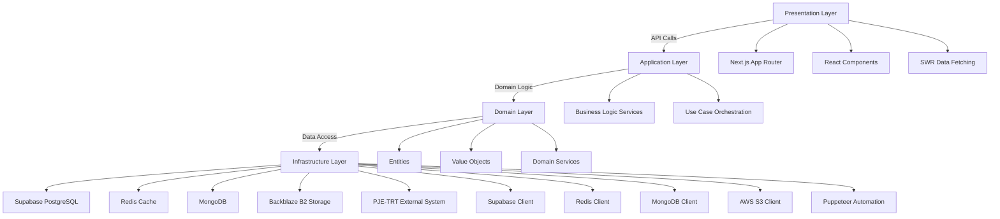
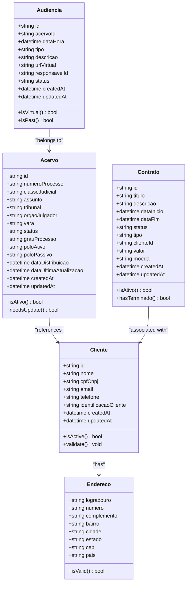
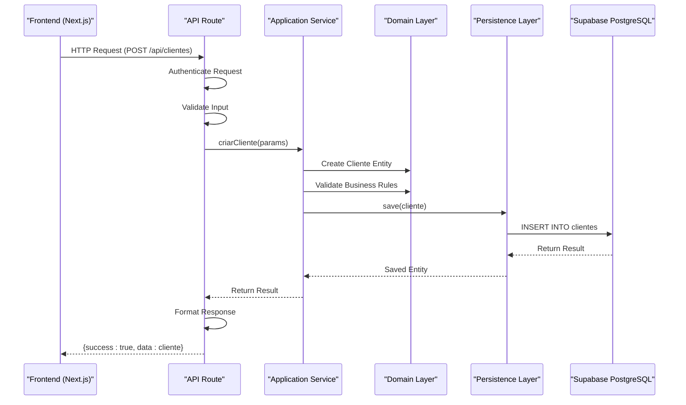
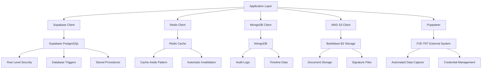
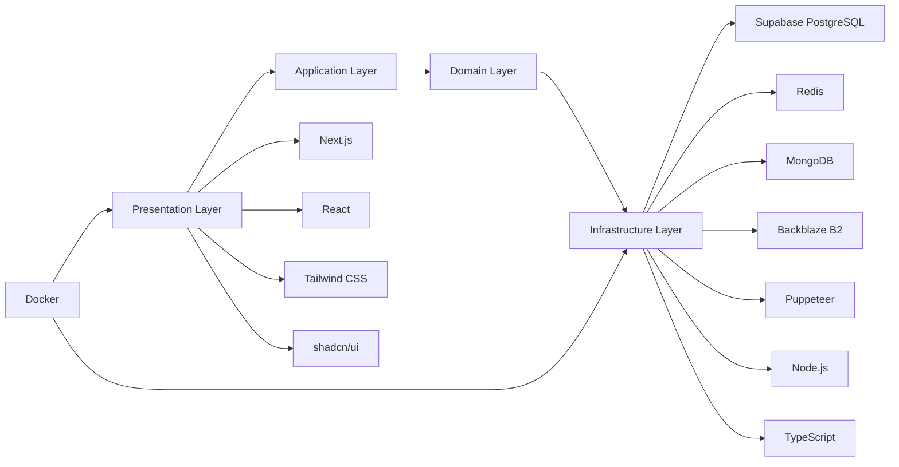

# Architecture

<cite>
**Referenced Files in This Document**   
- [README.md](file://README.md)
- [package.json](file://package.json)
- [next.config.ts](file://next.config.ts)
- [backend/utils/supabase/service-client.ts](file://backend/utils/supabase/service-client.ts)
- [app/_lib/middleware.ts](file://app/_lib/middleware.ts)
- [backend/utils/logger/index.ts](file://backend/utils/logger/index.ts)
- [backend/storage/backblaze-b2.service.ts](file://backend/storage/backblaze-b2.service.ts)
- [docker-compose.yml](file://docker-compose.yml)
- [supabase/schemas/00_permissions.sql](file://supabase/schemas/00_permissions.sql)
- [supabase/schemas/01_enums.sql](file://supabase/schemas/01_enums.sql)
- [supabase/schemas/02_advogados.sql](file://supabase/schemas/02_advogados.sql)
- [supabase/schemas/04_acervo.sql](file://supabase/schemas/04_acervo.sql)
- [supabase/schemas/05_orgao_julgador.sql](file://supabase/schemas/05_orgao_julgador.sql)
- [supabase/schemas/06_expedientes.sql](file://supabase/schemas/06_expedientes.sql)
- [supabase/schemas/07_audiencias.sql](file://supabase/schemas/07_audiencias.sql)
- [supabase/schemas/10_partes_contrarias.sql](file://supabase/schemas/10_partes_contrarias.sql)
- [supabase/schemas/11_contratos.sql](file://supabase/schemas/11_contratos.sql)
- [supabase/schemas/12_contrato_processos.sql](file://supabase/schemas/12_contrato_processos.sql)
- [supabase/schemas/13_tribunais.sql](file://supabase/schemas/13_tribunais.sql)
- [supabase/schemas/14_logs_alteracao.sql](file://supabase/schemas/14_logs_alteracao.sql)
- [supabase/schemas/15_enderecos.sql](file://supabase/schemas/15_enderecos.sql)
- [supabase/schemas/16_terceiros.sql](file://supabase/schemas/16_terceiros.sql)
- [supabase/schemas/17_processo_partes.sql](file://supabase/schemas/17_processo_partes.sql)
- [supabase/schemas/18_representantes.sql](file://supabase/schemas/18_representantes.sql)
- [supabase/schemas/19_cadastros_pje.sql](file://supabase/schemas/19_cadastros_pje.sql)
- [supabase/schemas/20_acordos_condenacoes.sql](file://supabase/schemas/20_acordos_condenacoes.sql)
- [supabase/schemas/21_capturas.sql](file://supabase/schemas/21_capturas.sql)
- [supabase/schemas/22_cargos_permissoes.sql](file://supabase/schemas/22_cargos_permissoes.sql)
- [supabase/schemas/23_dashboard.sql](file://supabase/schemas/23_dashboard.sql)
- [supabase/schemas/24_processos_cliente_por_cpf_view.sql](file://supabase/schemas/24_processos_cliente_por_cpf_view.sql)
- [supabase/schemas/25_assinatura_digital.sql](file://supabase/schemas/25_assinatura_digital.sql)
- [supabase/schemas/26_plano_contas.sql](file://supabase/schemas/26_plano_contas.sql)
- [supabase/schemas/27_centros_custo.sql](file://supabase/schemas/27_centros_custo.sql)
- [supabase/schemas/28_contas_bancarias.sql](file://supabase/schemas/28_contas_bancarias.sql)
- [supabase/schemas/29_lancamentos_financeiros.sql](file://supabase/schemas/29_lancamentos_financeiros.sql)
- [supabase/schemas/30_salarios.sql](file://supabase/schemas/30_salarios.sql)
- [supabase/schemas/31_conciliacao_bancaria.sql](file://supabase/schemas/31_conciliacao_bancaria.sql)
- [supabase/schemas/32_orcamento.sql](file://supabase/schemas/32_orcamento.sql)
- [supabase/schemas/33_financeiro_functions.sql](file://supabase/schemas/33_financeiro_functions.sql)
- [supabase/schemas/34_financeiro_views.sql](file://supabase/schemas/34_financeiro_views.sql)
- [supabase/schemas/35_financeiro_integracao.sql](file://supabase/schemas/35_financeiro_integracao.sql)
- [supabase/schemas/36_financeiro_seed.sql](file://supabase/schemas/36_financeiro_seed.sql)
- [app/api/health/route.ts](file://app/api/health/route.ts)
- [backend/api/pje-trt/shared/utils.ts](file://backend/api/pje-trt/shared/utils.ts)
- [backend/utils/redis/cache-utils.ts](file://backend/utils/redis/cache-utils.ts)
- [backend/auth/authorization.ts](file://backend/auth/authorization.ts)
- [backend/auth/api-auth.ts](file://backend/auth/api-auth.ts)
- [types/domain/acervo.ts](file://types/domain/acervo.ts)
- [types/domain/audiencias.ts](file://types/domain/audiencias.ts)
- [types/domain/partes.ts](file://types/domain/partes.ts)
- [types/domain/enderecos.ts](file://types/domain/enderecos.ts)
- [types/domain/processo-partes.ts](file://types/domain/processo-partes.ts)
- [types/domain/representantes.ts](file://types/domain/representantes.ts)
- [types/domain/value-objects.ts](file://types/domain/value-objects.ts)
- [types/contracts/acervo.ts](file://types/contracts/acervo.ts)
- [types/contracts/audiencias.ts](file://types/contracts/audiencias.ts)
- [types/contracts/partes.ts](file://types/contracts/partes.ts)
- [types/contracts/enderecos.ts](file://types/contracts/enderecos.ts)
- [types/contracts/processo-partes.ts](file://types/contracts/processo-partes.ts)
- [types/contracts/representantes.ts](file://types/contracts/representantes.ts)
- [types/index.ts](file://types/index.ts)
</cite>

## Table of Contents
1. [Introduction](#introduction)
2. [Project Structure](#project-structure)
3. [Core Components](#core-components)
4. [Architecture Overview](#architecture-overview)
5. [Detailed Component Analysis](#detailed-component-analysis)
6. [Dependency Analysis](#dependency-analysis)
7. [Performance Considerations](#performance-considerations)
8. [Troubleshooting Guide](#troubleshooting-guide)
9. [Conclusion](#conclusion)

## Introduction

The Sinesys application is a comprehensive legal management system designed for law firms, with a strong focus on integration with PJE/TRT (Electronic Judicial Process / Regional Labor Court) systems. The system provides automated data capture from judicial processes, contract management, hearing scheduling, manifestation pending tracking, and other essential legal workflow functionalities. Built with modern web technologies, Sinesys follows Domain-Driven Design (DDD) principles with a layered architecture that separates concerns into Domain, Application, Infrastructure, and Presentation layers.

The architecture is designed to handle large volumes of judicial data efficiently, with robust security measures including JWT authentication and Supabase Row Level Security (RLS) for fine-grained data access control. The system incorporates Redis caching strategies following the Cache-Aside pattern to optimize performance, particularly for frequently accessed judicial records. External system integration with PJE-TRT is achieved through automated browser interactions using Puppeteer, enabling seamless data synchronization between external judicial systems and the internal database.

**Section sources**
- [README.md](file://README.md#L28-L43)

## Project Structure

The Sinesys project follows a well-organized directory structure that reflects its layered architecture and separation of concerns. The frontend is built using Next.js App Router, with the main application routes located in the `app/` directory. Protected dashboard routes are organized under `(dashboard)/`, while authentication-related pages are in the `auth/` directory. API routes are centralized in `app/api/`, providing REST endpoints for various features such as acervo (case records), audiencias (hearings), and clientes (clients).

The backend logic is organized in the `backend/` directory, following a feature-based structure where each domain (acervo, audiencias, clientes, etc.) has its own subdirectory containing services and persistence layers. The service layer is further divided into business logic services and persistence services, maintaining a clear separation between application logic and data access concerns. Type definitions are centralized in the `types/` directory, with domain types in `types/domain/` and contract types in `types/contracts/`, promoting type consistency across the application.

Infrastructure components are organized in dedicated directories: `supabase/` contains database schemas and migrations, `docker-compose.yml` defines the containerized deployment configuration, and `lib/` contains shared utilities for Redis, MongoDB, and other services. The `components/` directory houses reusable UI components, with `components/ui/` containing shadcn/ui components and other directories containing domain-specific components.

```mermaid
graph TD
A[Root] --> B[app/]
A --> C[backend/]
A --> D[components/]
A --> E[lib/]
A --> F[types/]
A --> G[supabase/]
A --> H[docker-compose.yml]
B --> B1[(dashboard)/]
B --> B2[auth/]
B --> B3[api/]
C --> C1[acervo/]
C --> C2[audiencias/]
C --> C3[clientes/]
C --> C4[services/]
C --> C5[persistence/]
D --> D1[ui/]
D --> D2[layout/]
E --> E1[redis/]
E --> E2[mongodb/]
E --> E3[supabase/]
F --> F1[domain/]
F --> F2[contracts/]
G --> G1[migrations/]
G --> G2[schemas/]
```

**Diagram sources**
- [README.md](file://README.md#L687-L775)

**Section sources**
- [README.md](file://README.md#L687-L775)

## Core Components

The Sinesys application is built around several core components that handle the primary business domains of legal practice management. The Acervo (Case Records) component manages judicial process information, including case numbers, court information, status, and related metadata. This component integrates with external PJE-TRT systems to automatically capture and update case information. The Audiencias (Hearings) component handles hearing scheduling, responsible assignment, and virtual meeting URL management, providing a centralized view of upcoming court appearances.

The Clientes (Clients) component manages client information with comprehensive personal and contact details, while the Partes Contrárias (Opposing Parties) component tracks information about opposing parties in legal cases. The Contratos (Contracts) component provides full CRUD functionality for legal contracts, including association with clients and related processes. The Assinatura Digital (Digital Signature) component enables electronic document signing with support for various document types and signature workflows.

Financial management is handled by the Financeiro component, which includes modules for accounts payable and receivable, budgeting, financial reporting (DRE), and bank reconciliation. The Captura (Data Capture) component orchestrates automated data extraction from external systems using Puppeteer, with credential management and execution history tracking. The Dashboard component provides personalized views with widgets for key performance indicators and recent activities across all domains.

**Section sources**
- [README.md](file://README.md#L30-L43)

## Architecture Overview

The Sinesys application follows a layered architecture that separates concerns into distinct layers: Presentation, Application, Domain, and Infrastructure. This architectural pattern promotes maintainability, testability, and scalability by ensuring that each layer has a well-defined responsibility and interacts with other layers through well-defined interfaces. The Presentation layer, built with Next.js and React, handles user interface rendering and user interaction, communicating with the backend through API routes.

The Application layer contains the business logic services that orchestrate operations across domain entities and coordinate with infrastructure services. These services implement use cases such as creating a new client, updating a case record, or scheduling a hearing. The Domain layer contains the core business entities, value objects, and domain services that represent the fundamental concepts of legal practice management. This layer is technology-agnostic and focuses purely on business rules and logic.

The Infrastructure layer provides technical capabilities such as database access, caching, file storage, and external system integration. It implements interfaces defined in the higher layers, allowing the application to interact with external systems without being tightly coupled to specific technologies. This layered approach enables the system to evolve independently in each layer, with changes in infrastructure not affecting business logic and changes in business rules not requiring UI modifications.



**Diagram sources**
- [README.md](file://README.md#L75-L102)
- [next.config.ts](file://next.config.ts#L1-L131)

**Section sources**
- [README.md](file://README.md#L73-L344)

## Detailed Component Analysis

### Domain Layer Analysis

The Domain layer in Sinesys contains the core business entities and value objects that represent the fundamental concepts of legal practice management. Entities such as Cliente (Client), Acervo (Case Record), and Audiencia (Hearing) have unique identities and lifecycles, with business rules and validations encapsulated within their definitions. Value objects like Endereco (Address), CpfCnpj, and NumeroProcesso represent conceptual values that are immutable and compared by their contents rather than identity.

Aggregates are used to group related entities and value objects into consistency boundaries, with Acervo serving as an aggregate root that may contain related Partes (Parties), Documentos (Documents), and Movimentacoes (Movements). Domain services orchestrate complex business operations that don't naturally belong to a single entity, such as GerenciamentoDePartesEmProcesso (Party Management in Process) or CalculoDePrazos (Deadline Calculation). Domain events like ProcessoCapturado (Process Captured) or AudienciaDesignada (Hearing Scheduled) are used to notify other parts of the system about significant business events.



**Diagram sources**
- [types/domain/acervo.ts](file://types/domain/acervo.ts)
- [types/domain/partes.ts](file://types/domain/partes.ts)
- [types/domain/audiencias.ts](file://types/domain/audiencias.ts)
- [types/domain/enderecos.ts](file://types/domain/enderecos.ts)

**Section sources**
- [README.md](file://README.md#L261-L283)
- [types/domain/](file://types/domain/)

### Application Layer Analysis

The Application layer in Sinesys consists of service classes that implement use cases by orchestrating domain entities and coordinating with infrastructure services. These services are organized by feature area, with dedicated services for clients, case records, hearings, and other domains. Each service follows a consistent naming convention (e.g., CriarClienteService, ListarAcervoService) and implements specific use cases defined by the business requirements.

Application services are responsible for transaction management, security checks, and coordinating multiple domain operations. They receive Data Transfer Objects (DTOs) as input, validate them against business rules, load domain entities from repositories, invoke domain logic, and persist changes through infrastructure services. The services are designed to be stateless and can be easily tested in isolation, with dependencies injected through constructor parameters or function arguments.

The service layer also handles cross-cutting concerns such as logging, error handling, and performance monitoring. Each service operation is wrapped in a correlation ID context, enabling end-to-end tracing of requests across system boundaries. The services use a consistent response format that includes success status, data payload, and error messages, making it easier for the presentation layer to handle responses uniformly.



**Diagram sources**
- [backend/services/clientes/criar-cliente.service.ts](file://backend/clientes/services/clientes/criar-cliente.service.ts)
- [app/api/clientes/route.ts](file://app/api/clientes/route.ts)
- [backend/utils/supabase/service-client.ts](file://backend/utils/supabase/service-client.ts)

**Section sources**
- [README.md](file://README.md#L284-L300)
- [backend/services/](file://backend/services/)

### Infrastructure Layer Analysis

The Infrastructure layer in Sinesys provides the technical capabilities that support the higher layers, including data persistence, caching, file storage, and external system integration. The data persistence layer uses Supabase PostgreSQL as the primary database, with Row Level Security (RLS) policies enforcing fine-grained access control based on user roles and permissions. The schema is organized into multiple SQL files that define tables, views, functions, and permissions in a modular fashion.

Redis is used as a distributed cache to improve performance by reducing database load for frequently accessed data. The Cache-Aside pattern is implemented, where applications first check the cache for data and only query the database on cache misses. Cached data is automatically invalidated when underlying data changes, ensuring consistency between the cache and database. MongoDB is used for storing timeline data and audit logs, providing flexible schema capabilities for unstructured or semi-structured data.

File storage is handled by Backblaze B2, accessed through its S3-compatible API using the AWS SDK. This allows for scalable storage of documents, signatures, and other binary data with configurable access controls. External system integration with PJE-TRT is achieved through Puppeteer, which automates browser interactions to extract data from external judicial systems. The infrastructure layer also includes utilities for logging, monitoring, and error tracking, providing observability into system operations.



**Diagram sources**
- [supabase/schemas/](file://supabase/schemas/)
- [backend/utils/redis/cache-utils.ts](file://backend/utils/redis/cache-utils.ts)
- [backend/storage/backblaze-b2.service.ts](file://backend/storage/backblaze-b2.service.ts)
- [backend/api/pje-trt/](file://backend/api/pje-trt/)
- [backend/utils/supabase/service-client.ts](file://backend/utils/supabase/service-client.ts)

**Section sources**
- [README.md](file://README.md#L302-L319)
- [supabase/schemas/](file://supabase/schemas/)
- [backend/utils/](file://backend/utils/)

### Presentation Layer Analysis

The Presentation layer in Sinesys is built with Next.js App Router and React, providing a modern, responsive user interface for legal professionals. The application follows a feature-based organization, with dashboard routes grouped under `(dashboard)/` and organized by functional area such as acervo, audiencias, and clientes. Each feature area has its own set of pages, components, and API routes, promoting modularity and maintainability.

The UI is built using shadcn/ui components on top of Radix UI primitives, ensuring accessibility and consistency across the application. Tailwind CSS is used for styling, enabling rapid UI development with utility-first classes. The application leverages SWR for data fetching and client-side caching, providing a smooth user experience with automatic revalidation and pagination support.

As a Progressive Web App (PWA), Sinesys can be installed on mobile and desktop devices, with offline capabilities and automatic service worker updates. The PWA configuration includes a web app manifest, service worker, and offline fallback page, ensuring reliable operation even in poor network conditions. The application supports both light and dark themes, with user preferences persisted across sessions.

```mermaid
graph TD
A[Browser] --> B[Service Worker]
B --> C[Offline Page]
B --> D[Static Assets Cache]
A --> E[Next.js App Router]
E --> F[(dashboard)/]
E --> G[auth/]
E --> H[api/]
F --> I[Acervo Page]
F --> J[Audiencias Page]
F --> K[Clientes Page]
F --> L[Contratos Page]
I --> M[Acervo Table]
I --> N[Acervo Filters]
I --> O[Acervo Actions]
J --> P[Hearing Calendar]
J --> Q[Hearing List]
J --> R[Hearing Actions]
M --> S[SWR Data Fetching]
P --> S
S --> T[API Routes]
T --> U[Backend Services]
```

**Diagram sources**
- [app/](file://app/)
- [next.config.ts](file://next.config.ts#L58-L131)
- [public/manifest.json](file://public/manifest.json)
- [app/offline/page.tsx](file://app/offline/page.tsx)

**Section sources**
- [README.md](file://README.md#L445-L476)
- [app/](file://app/)
- [next.config.ts](file://next.config.ts#L58-L131)

## Dependency Analysis

The Sinesys application has a well-defined dependency structure that follows the Dependency Rule of clean architecture: source code dependencies point inward, toward higher-level policies. The Presentation layer depends on the Application layer, which depends on the Domain layer, while the Infrastructure layer depends on all inner layers. This ensures that business rules and domain logic remain isolated from technical implementation details and user interface concerns.

External dependencies are managed through npm and organized in package.json, with clear separation between production dependencies and development dependencies. The application uses Supabase for backend-as-a-service functionality, including authentication, database, and storage. Redis is used for caching, MongoDB for document storage, and Backblaze B2 for scalable file storage. Browser automation is handled by Puppeteer, while Playwright is used for end-to-end testing.

The application is containerized using Docker, with a docker-compose.yml file defining the service configuration for local development. The containerized deployment enables consistent environments across development, testing, and production, reducing the "it works on my machine" problem. The application can be deployed to various platforms, including CapRover, with appropriate configuration files for each deployment target.



**Diagram sources**
- [package.json](file://package.json)
- [docker-compose.yml](file://docker-compose.yml)
- [README.md](file://README.md#L69-L72)

**Section sources**
- [package.json](file://package.json)
- [docker-compose.yml](file://docker-compose.yml)
- [README.md](file://README.md#L69-L72)

## Performance Considerations

The Sinesys application incorporates several performance optimization strategies to handle large volumes of judicial data efficiently. The primary optimization is the use of Redis as a distributed cache following the Cache-Aside pattern. Frequently accessed data such as client information, case records, and hearing schedules are cached with a configurable TTL (Time To Live), reducing database load and improving response times. Cache keys are generated based on entity types and parameters, enabling fine-grained cache management.

Database performance is optimized through proper indexing, query optimization, and the use of database views for complex queries. Supabase PostgreSQL provides robust performance monitoring tools that can be used to identify and address performance bottlenecks. The application uses connection pooling and efficient query patterns to minimize database round trips and reduce latency.

For data-intensive operations such as batch processing of case records or generating financial reports, the application uses background jobs and asynchronous processing. This prevents long-running operations from blocking the main request-response cycle and provides a better user experience. The application also implements pagination and lazy loading for large datasets, ensuring that only the required data is transferred and rendered.

The frontend is optimized for performance through code splitting, lazy loading of components, and efficient state management. Static assets are served with appropriate caching headers, and the PWA configuration enables offline access to recently viewed data. Image optimization is handled through AVIF and WebP formats, reducing bandwidth usage and improving load times.

**Section sources**
- [README.md](file://README.md#L776-L810)
- [backend/utils/redis/cache-utils.ts](file://backend/utils/redis/cache-utils.ts)
- [next.config.ts](file://next.config.ts#L35-L37)

## Troubleshooting Guide

When troubleshooting issues in the Sinesys application, it's important to follow a systematic approach that considers the layered architecture and distributed nature of the system. For authentication issues, verify that the Supabase environment variables (NEXT_PUBLIC_SUPABASE_URL, NEXT_PUBLIC_SUPABASE_PUBLISHABLE_OR_ANON_KEY, and SUPABASE_SECRET_KEY) are correctly configured in the .env.local file. Check the browser console for authentication errors and verify that the service worker is functioning correctly for PWA-related issues.

For database connectivity problems, ensure that the Supabase, Redis, and MongoDB connection strings are correct and that the services are running. Use the health check endpoint (/api/health) to verify the status of all external dependencies. When experiencing slow performance, check the Redis cache configuration and monitor cache hit rates. Clear the cache if stale data is suspected, and verify that cache invalidation is working correctly after data updates.

For data capture issues with PJE-TRT, verify that the browser automation service is running and accessible. Check the credentials stored in the system and ensure they are valid. Review the Puppeteer logs for any errors during the automation process. For file storage issues, verify the Backblaze B2 configuration (B2_ENDPOINT, B2_REGION, B2_BUCKET, B2_KEY_ID, B2_APPLICATION_KEY) and test the connection using the storage service utilities.

Enable detailed logging by setting LOG_LEVEL=debug in the environment variables, and use the correlation IDs in log messages to trace requests across system boundaries. For deployment issues, verify that the Docker configuration is correct and that all required environment variables are provided. Check the container logs for any startup errors or configuration issues.

**Section sources**
- [README.md](file://README.md#L22-L26)
- [app/api/health/route.ts](file://app/api/health/route.ts)
- [backend/utils/logger/index.ts](file://backend/utils/logger/index.ts)

## Conclusion

The Sinesys application architecture demonstrates a well-structured, maintainable design that effectively addresses the complex requirements of legal practice management. By following Domain-Driven Design principles and implementing a layered architecture, the system achieves a clear separation of concerns, making it easier to understand, test, and extend. The use of modern technologies such as Next.js, Supabase, Redis, and Docker provides a robust foundation for building a scalable, performant application.

The integration with external PJE-TRT systems through automated browser interactions solves a critical need for law firms to synchronize data between external judicial systems and internal management tools. The implementation of Row Level Security in Supabase ensures that sensitive legal data is protected with fine-grained access controls, while the Redis caching strategy optimizes performance for frequently accessed judicial records.

The application's design supports future enhancements and scalability, with clear extension points for adding new features and integrating with additional external systems. The containerized deployment model enables consistent environments across development, testing, and production, reducing deployment risks. Overall, the Sinesys architecture provides a solid foundation for a comprehensive legal management system that can adapt to evolving business requirements and technological advancements.