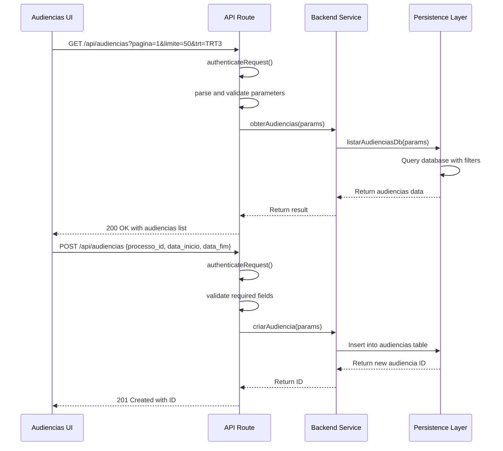
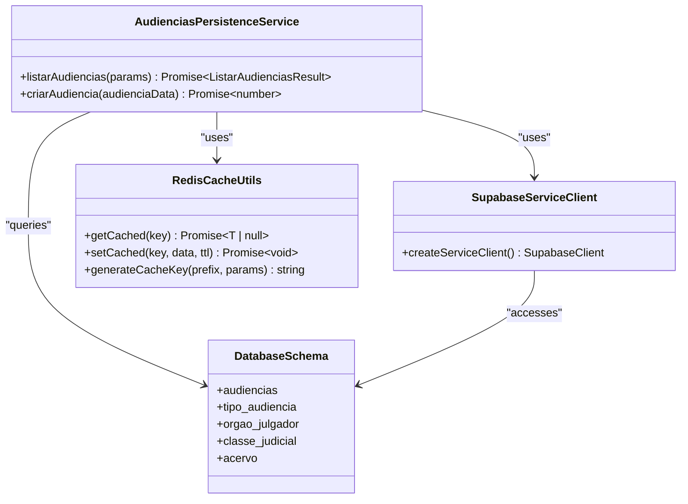
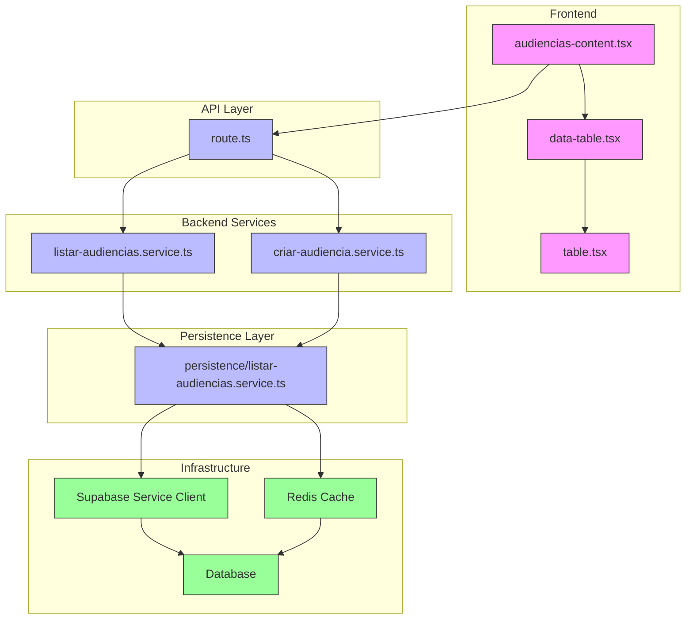

# Component Relationships

<cite>
**Referenced Files in This Document**   
- [audiencias/page.tsx](file://app/(dashboard)/audiencias/page.tsx)
- [audiencias/route.ts](file://app/api/audiencias/route.ts)
- [listar-audiencias.service.ts](file://backend/audiencias/services/listar-audiencias.service.ts)
- [criar-audiencia.service.ts](file://backend/audiencias/services/criar-audiencia.service.ts)
- [persistence/listar-audiencias.service.ts](file://backend/audiencias/services/persistence/listar-audiencias.service.ts)
- [dashboard-api.ts](file://app/_lib/dashboard-api.ts)
- [service-client.ts](file://backend/utils/supabase/service-client.ts)
- [cache-utils.ts](file://backend/utils/redis/cache-utils.ts)
- [audiencias-content.tsx](file://app/(dashboard)/audiencias/components/audiencias-content.tsx)
- [data-table.tsx](file://components/ui/data-table.tsx)
- [table.tsx](file://components/ui/table.tsx)
</cite>

## Table of Contents
1. [Introduction](#introduction)
2. [Frontend Components and UI Interactions](#frontend-components-and-ui-interactions)
3. [API Routes and Request Handling](#api-routes-and-request-handling)
4. [Backend Services and Business Logic](#backend-services-and-business-logic)
5. [Persistence Layer and Database Clients](#persistence-layer-and-database-clients)
6. [Dependency Injection and Configuration Management](#dependency-injection-and-configuration-management)
7. [Loose Coupling Through Interface-Based Design](#loose-coupling-through-interface-based-design)
8. [Component Diagrams](#component-diagrams)

## Introduction
This document describes the component relationships within the Sinesys application, focusing on the interactions between frontend components, API routes, backend services, and database clients. The architecture follows a layered approach with clear separation of concerns, where UI components in the `components/ui/` directory interact with business logic through well-defined API endpoints. Backend services depend on persistence layers that abstract database operations, while the persistence layers rely on database clients for data access. The system maintains loose coupling through interface-based design patterns and dependency injection, enabling modular development and easier testing.

## Frontend Components and UI Interactions
The frontend components in Sinesys are organized in a hierarchical structure, with UI components in the `components/ui/` directory providing reusable building blocks for the application. The `audiencias-list` component, located in the dashboard's audiencias section, serves as a key example of how UI components interact with business logic through API calls.

The `audiencias-content.tsx` component acts as a container that orchestrates the display of audiencias data across different visualizations (week, month, year). It uses the `DataTable` component from `components/ui/data-table.tsx` to render tabular data, which in turn utilizes lower-level table components (`Table`, `TableHeader`, `TableBody`, `TableRow`, `TableHead`, `TableCell`) from `components/ui/table.tsx`. These components follow a composition pattern where higher-level components build upon lower-level primitives to create complex UIs.

When a user interacts with the audiencias list, the component initiates API calls to fetch data based on the current visualization mode and filter parameters. The `DataTable` component handles pagination, sorting, and filtering operations by communicating with the backend API through the defined routes.

**Section sources**
- [audiencias-content.tsx](file://app/(dashboard)/audiencias/components/audiencias-content.tsx#L1-L100)
- [data-table.tsx](file://components/ui/data-table.tsx#L1-L333)
- [table.tsx](file://components/ui/table.tsx#L1-L96)

## API Routes and Request Handling
The API routes in Sinesys serve as the contract between the frontend and backend layers, defining how client requests are processed and responded to. The `/api/audiencias` route, implemented in `app/api/audiencias/route.ts`, handles both GET and POST requests for audiencias data.

For GET requests, the API route performs several key functions:
1. Authentication using the `authenticateRequest` function from the backend auth module
2. Parameter parsing and validation from query strings
3. Business logic delegation to the `obterAudiencias` service function
4. Response formatting according to the expected JSON structure

The route is documented with Swagger annotations that define the expected parameters, response formats, and error conditions. It supports extensive filtering options including pagination, date ranges, status filters, and text search across multiple fields. The API also handles POST requests for creating new audiências, with validation of required fields and proper error handling.

The API route acts as an adapter between the HTTP request/response cycle and the backend service layer, translating HTTP concepts into domain-specific operations while maintaining separation from the business logic implementation.

**Diagram sources**
- [route.ts](file://app/api/audiencias/route.ts#L1-L499)
- [listar-audiencias.service.ts](file://backend/audiencias/services/listar-audiencias.service.ts#L20-L26)
- [criar-audiencia.service.ts](file://backend/audiencias/services/criar-audiencia.service.ts#L9-L110)

**Section sources**
- [route.ts](file://app/api/audiencias/route.ts#L1-L499)

## Backend Services and Business Logic
The backend services in Sinesys implement the core business logic for the application, sitting between the API routes and the persistence layer. The audiencias services demonstrate a clean separation of concerns, with distinct modules for different aspects of the functionality.

The `listar-audiencias.service.ts` file exports the `obterAudiencias` function, which serves as the entry point for listing audiencias. This service function acts as a facade, delegating the actual database operations to the persistence layer while adding business logic such as caching. It uses Redis caching to improve performance by storing frequently accessed data, checking the cache before querying the database and updating the cache with fresh results.

The service layer also handles data transformation, converting raw database records into domain objects that match the expected API response format. For audiencias, this includes joining data from related tables (orgao_julgador, classe_judicial, tipo_audiencia) and calculating derived fields like modalidade (virtual, presencial, híbrida).

For creating new audiências, the `criar-audiencia.service.ts` file implements the `criarAudiencia` function, which performs several business validations:
1. Verifies the existence of the referenced processo
2. Validates the tipo_audiencia if provided
3. Retrieves sala_audiencia data if specified
4. Constructs the complete audiencia record with normalized data

The service layer ensures data integrity by validating relationships between entities before persisting changes to the database.

**Section sources**
- [listar-audiencias.service.ts](file://backend/audiencias/services/listar-audiencias.service.ts#L20-L26)
- [criar-audiencia.service.ts](file://backend/audiencias/services/criar-audiencia.service.ts#L9-L110)

## Persistence Layer and Database Clients
The persistence layer in Sinesys abstracts database operations and provides a consistent interface for data access. The `persistence/listar-audiencias.service.ts` file implements the `listarAudiencias` function, which directly interacts with the Supabase database using the service client.

This layer uses Supabase's PostgREST API to construct complex queries with filtering, pagination, and sorting. The implementation demonstrates several key patterns:
- Using Supabase's query builder to construct type-safe database queries
- Implementing JOIN operations to retrieve related data from multiple tables
- Applying filters based on input parameters using conditional query building
- Handling pagination with offset and limit calculations
- Managing database connections through dependency injection

The persistence layer also integrates with Redis for caching, using cache keys generated from the query parameters to store and retrieve results. This reduces database load and improves response times for frequently accessed data.

Database access is managed through the Supabase service client, which uses a secret key for administrative operations that bypass Row Level Security (RLS) policies. This allows scheduled jobs and system operations to access data without being constrained by user-level permissions.

**Diagram sources**
- [listar-audiencias.service.ts](file://backend/audiencias/services/persistence/listar-audiencias.service.ts#L77-L272)
- [service-client.ts](file://backend/utils/supabase/service-client.ts#L45-L60)
- [cache-utils.ts](file://backend/utils/redis/cache-utils.ts#L63-L89)

**Section sources**
- [listar-audiencias.service.ts](file://backend/audiencias/services/persistence/listar-audiencias.service.ts#L77-L272)
- [service-client.ts](file://backend/utils/supabase/service-client.ts#L45-L60)
- [cache-utils.ts](file://backend/utils/redis/cache-utils.ts#L63-L89)

## Dependency Injection and Configuration Management
Sinesys employs dependency injection and configuration management patterns to maintain loose coupling between components. The architecture avoids hard-coded dependencies by injecting required services and clients through module imports and function parameters.

The Supabase client is a prime example of this pattern. Instead of creating database connections directly within service functions, the application uses factory functions like `createServiceClient()` that return configured client instances. This allows for easier testing by enabling the injection of mock clients during unit tests.

Configuration is managed through environment variables, with the `getSupabaseConfig()` function centralizing the retrieval of Supabase connection parameters. This function handles the priority between different key types (secret key vs legacy service role key) and provides clear error messages when configuration is missing.

The Redis caching system also follows dependency injection principles, with cache utilities exported as standalone functions that can be imported and used by any component that needs caching functionality. The `getCached` and `setCached` functions abstract the underlying Redis client details, allowing services to use caching without knowing the specific implementation.

This approach enables configuration changes to be made in a single location without requiring modifications to multiple files throughout the codebase.

**Section sources**
- [service-client.ts](file://backend/utils/supabase/service-client.ts#L16-L60)
- [cache-utils.ts](file://backend/utils/redis/cache-utils.ts#L1-L212)

## Loose Coupling Through Interface-Based Design
Sinesys maintains loose coupling between components through interface-based design patterns, where components depend on abstractions rather than concrete implementations. This is evident in several aspects of the architecture:

1. **Type Definitions**: The application uses TypeScript interfaces and types to define contracts between layers. The `ListarAudienciasParams` and `ListarAudienciasResult` types in the backend types module specify the expected input and output structures for the audiencias listing functionality.

2. **Service Abstractions**: Backend services export functions with well-defined signatures that hide implementation details. The `obterAudiencias` function in the service layer provides a clean interface for listing audiencias without exposing the underlying database query logic.

3. **Component Props**: Frontend components use TypeScript interfaces to define their props, ensuring type safety while allowing for flexible composition. The `DataTableProps<TData>` interface in `data-table.tsx` uses generics to create a reusable component that can work with any data type.

4. **API Contracts**: The Swagger documentation in API routes serves as a formal contract between frontend and backend, specifying the expected request and response formats. This allows frontend and backend teams to work independently as long as they adhere to the defined contract.

These interface-based design patterns enable easier maintenance, testing, and evolution of the codebase, as changes to one component's implementation do not necessarily require changes to components that depend on it.

**Section sources**
- [types/audiencias/types.ts](file://backend/types/audiencias/types.ts#L1-L100)
- [data-table.tsx](file://components/ui/data-table.tsx#L35-L74)
- [route.ts](file://app/api/audiencias/route.ts#L30-L224)

## Component Diagrams
The following diagrams illustrate the key relationships and dependencies between components in the Sinesys application.

**Diagram sources**
- [audiencias-content.tsx](file://app/(dashboard)/audiencias/components/audiencias-content.tsx#L1-L100)
- [data-table.tsx](file://components/ui/data-table.tsx#L1-L333)
- [table.tsx](file://components/ui/table.tsx#L1-L96)
- [route.ts](file://app/api/audiencias/route.ts#L1-L499)
- [listar-audiencias.service.ts](file://backend/audiencias/services/listar-audiencias.service.ts#L20-L26)
- [criar-audiencia.service.ts](file://backend/audiencias/services/criar-audiencia.service.ts#L9-L110)
- [persistence/listar-audiencias.service.ts](file://backend/audiencias/services/persistence/listar-audiencias.service.ts#L77-L272)
- [service-client.ts](file://backend/utils/supabase/service-client.ts#L45-L60)
- [cache-utils.ts](file://backend/utils/redis/cache-utils.ts#L63-L89)