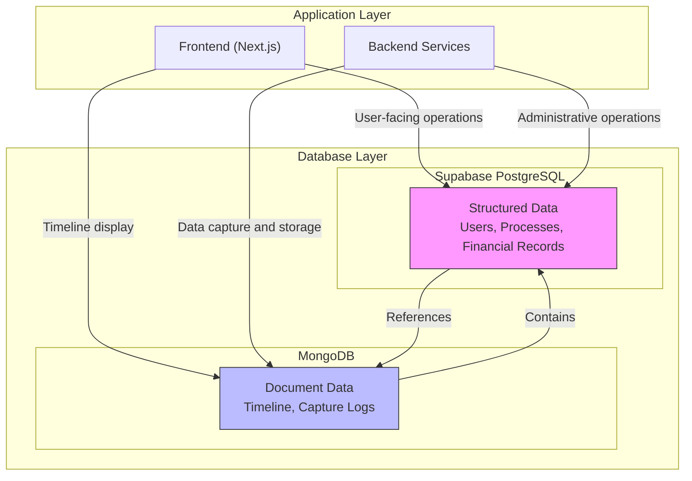
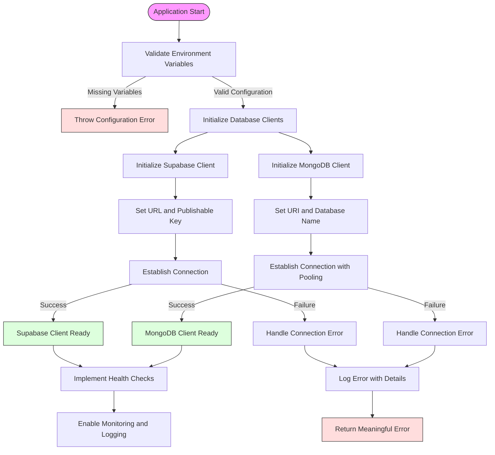
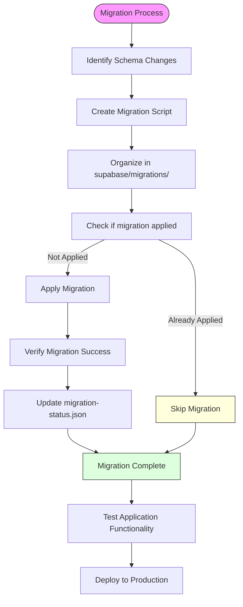
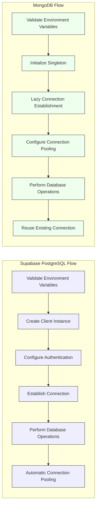

# Database Client Relationships

<cite>
**Referenced Files in This Document**   
- [app/_lib/supabase.ts](file://app/_lib/supabase.ts)
- [backend/utils/supabase/service-client.ts](file://backend/utils/supabase/service-client.ts)
- [backend/utils/mongodb/client.ts](file://backend/utils/mongodb/client.ts)
- [backend/utils/mongodb/collections.ts](file://backend/utils/mongodb/collections.ts)
- [supabase/schemas/](file://supabase/schemas/)
- [supabase/migrations/](file://supabase/migrations/)
- [app/api/acervo/[id]/timeline/route.ts](file://app/api/acervo/[id]/timeline/route.ts)
- [app/_lib/types/timeline.ts](file://app/_lib/types/timeline.ts)
- [backend/types/mongodb/timeline.ts](file://backend/types/mongodb/timeline.ts)
</cite>

## Table of Contents
1. [Introduction](#introduction)
2. [Database Architecture Overview](#database-architecture-overview)
3. [Supabase PostgreSQL Client](#supabase-postgresql-client)
4. [MongoDB Client](#mongodb-client)
5. [Database Schema and Type Relationships](#database-schema-and-type-relationships)
6. [Connection Management and Error Handling](#connection-management-and-error-handling)
7. [Query Examples and Data Flow](#query-examples-and-data-flow)
8. [Migration and Schema Management](#migration-and-schema-management)
9. [Connection Flow Diagrams](#connection-flow-diagrams)
10. [Conclusion](#conclusion)

## Introduction

Sinesys employs a dual-database architecture utilizing both Supabase PostgreSQL and MongoDB to optimize data storage and retrieval for different use cases. This documentation details the relationship between these database clients, their implementation patterns, and how they serve distinct purposes within the application. The Supabase PostgreSQL database serves as the primary relational data store for structured application data, while MongoDB provides a flexible document-oriented storage solution for timeline data and capture logs. The system implements specialized client configurations for different contexts, including user-facing operations and administrative services, with comprehensive connection management and error handling strategies.

## Database Architecture Overview

Sinesys implements a hybrid database architecture that leverages the strengths of both relational and document-oriented databases. The application uses Supabase PostgreSQL as its primary database for structured data storage, maintaining referential integrity and supporting complex relational queries. Simultaneously, MongoDB serves as a secondary database optimized for storing hierarchical, semi-structured data such as process timelines and capture logs. This architectural pattern allows the application to handle both transactional data with strict consistency requirements and large, variable-structure datasets with high performance.

The two database systems serve complementary roles: Supabase PostgreSQL manages core application entities like users, processes, and financial records, while MongoDB specializes in storing timeline data extracted from external systems like PJE-TRT. This separation of concerns enables optimized data access patterns, with PostgreSQL supporting ACID transactions for business operations and MongoDB providing efficient storage and retrieval of document collections. The application coordinates between these databases through service-layer logic that maintains referential integrity while leveraging the unique capabilities of each system.



**Diagram sources**
- [app/_lib/supabase.ts](file://app/_lib/supabase.ts)
- [backend/utils/mongodb/client.ts](file://backend/utils/mongodb/client.ts)

**Section sources**
- [app/_lib/supabase.ts](file://app/_lib/supabase.ts)
- [backend/utils/mongodb/client.ts](file://backend/utils/mongodb/client.ts)

## Supabase PostgreSQL Client

The Supabase PostgreSQL client implementation in Sinesys follows a dual-client pattern with distinct configurations for user-facing and administrative contexts. The application maintains two separate client instances: a server-client for user-facing operations that respects Row Level Security (RLS) policies, and a service-client for administrative operations that bypasses RLS for system-level tasks. This separation ensures proper security boundaries while enabling necessary administrative functionality.

The server-client is configured with publishable keys and is used in Next.js server components and API routes to perform operations on behalf of authenticated users. It enforces RLS policies defined in the database, ensuring users can only access data they are authorized to view. In contrast, the service-client uses secret keys with elevated privileges, allowing it to bypass RLS for scheduled jobs, data migrations, and other system-level operations that require broader data access. This client is restricted to backend services and never exposed to client-side code.

```mermaid
classDiagram
class SupabaseClient {
+supabaseUrl : string
+supabasePublishableKey : string
+createClient() : SupabaseClient
}
class ServerClient {
+auth : { autoRefreshToken : true, persistSession : true }
+use publishable key
+respects RLS policies
+used in Next.js server components
}
class ServiceClient {
+auth : { autoRefreshToken : false, persistSession : false }
+use secret key
+bypasses RLS policies
+used in backend services
}
SupabaseClient <|-- ServerClient
SupabaseClient <|-- ServiceClient
note right of ServerClient
Used for user-facing operations
Respects Row Level Security
Maintains user session
end note
note right of ServiceClient
Used for administrative operations
Bypasses Row Level Security
No session persistence
end note
```

**Diagram sources**
- [app/_lib/supabase.ts](file://app/_lib/supabase.ts)
- [backend/utils/supabase/service-client.ts](file://backend/utils/supabase/service-client.ts)

**Section sources**
- [app/_lib/supabase.ts](file://app/_lib/supabase.ts)
- [backend/utils/supabase/service-client.ts](file://backend/utils/supabase/service-client.ts)

## MongoDB Client

The MongoDB client in Sinesys implements a singleton pattern with connection pooling to optimize resource usage and performance. The client is designed to work efficiently in serverless environments like Next.js, maintaining a single reusable connection across requests to minimize connection overhead. The implementation includes comprehensive connection management features such as connection pooling with configurable maximum and minimum pool sizes, idle connection timeouts, and automatic reconnection handling.

The MongoDB client is specifically optimized for storing and retrieving timeline data from external systems like PJE-TRT. It manages two primary collections: the timeline collection for storing complete process timelines and the capture logs collection for recording raw capture operations. The client implementation includes pre-configured indexes on frequently queried fields such as process ID, TRT code, and capture timestamp to ensure optimal query performance. Connection configuration includes a maximum pool size of 10 connections and a minimum of 2, with a 60-second idle timeout to balance performance and resource consumption.

```mermaid
classDiagram
class MongoClient {
-client : MongoClient | null
-clientPromise : Promise<MongoClient> | null
+getMongoConfig() : { uri : string, dbName : string }
+getMongoClient() : Promise<MongoClient>
+getMongoDatabase() : Promise<Db>
+closeMongoConnection() : Promise<void>
+testMongoConnection() : Promise<boolean>
}
class Collections {
+TIMELINE : 'timeline'
+CAPTURA_RAW_LOGS : 'captura_logs_brutos'
+getTimelineCollection() : Promise<Collection<TimelineDocument>>
+getCapturaRawLogsCollection() : Promise<Collection<CapturaRawLogDocument>>
+createMongoIndexes() : Promise<void>
}
MongoClient --> Collections : "uses"
note right of MongoClient
Singleton pattern with connection pooling
Max pool size : 10
Min pool size : 2
Max idle time : 60s
end note
note right of Collections
Pre-configured indexes for optimal queries
Timeline collection : processId + trtCodigo + grau
Capture logs : status + criado_em
end note
```

**Diagram sources**
- [backend/utils/mongodb/client.ts](file://backend/utils/mongodb/client.ts)
- [backend/utils/mongodb/collections.ts](file://backend/utils/mongodb/collections.ts)

**Section sources**
- [backend/utils/mongodb/client.ts](file://backend/utils/mongodb/client.ts)
- [backend/utils/mongodb/collections.ts](file://backend/utils/mongodb/collections.ts)

## Database Schema and Type Relationships

Sinesys maintains a well-defined relationship between database schema definitions and TypeScript types, ensuring type safety across the application. The Supabase schema definitions in the `supabase/schemas/` directory provide the source of truth for the relational database structure, with each SQL file defining specific tables, views, and constraints. These schema definitions are complemented by TypeScript interfaces in the application code that mirror the database structure, providing compile-time type checking and autocompletion.

For MongoDB, the relationship between schema and types is implemented through TypeScript interfaces that define the structure of documents stored in collections. The `TimelineDocument` interface defines the shape of timeline data, including process ID, TRT code, capture timestamp, and the timeline array itself. This interface is used consistently across the application, from the MongoDB client implementation to API routes and frontend components. The application also maintains a reference between PostgreSQL and MongoDB through the `timeline_mongodb_id` field in the acervo table, which stores the MongoDB ObjectId for the corresponding timeline document.

```mermaid
classDiagram
class AcervoTable {
+id : number
+numero_processo : string
+trt : string
+grau : string
+id_pje : string
+timeline_mongodb_id : string
+advogado_id : number
}
class TimelineDocument {
+_id : ObjectId
+processoId : string
+trtCodigo : string
+grau : string
+capturadoEm : Date
+timeline : TimelineItemEnriquecido[]
+metadata : TimelineMetadata
}
class TimelineItemEnriquecido {
+id : number
+titulo : string
+data : string
+documento : boolean
+backblaze : BackblazeB2Info
+googleDrive : GoogleDriveInfo
}
AcervoTable --> TimelineDocument : "references via timeline_mongodb_id"
TimelineDocument --> TimelineItemEnriquecido : "contains array of"
note right of AcervoTable
Supabase PostgreSQL table
Defined in supabase/schemas/04_acervo.sql
Contains reference to MongoDB document
end note
note right of TimelineDocument
MongoDB document structure
Defined in backend/types/mongodb/timeline.ts
Stored in 'timeline' collection
end note
```

**Diagram sources**
- [supabase/schemas/04_acervo.sql](file://supabase/schemas/04_acervo.sql)
- [backend/types/mongodb/timeline.ts](file://backend/types/mongodb/timeline.ts)
- [app/_lib/types/timeline.ts](file://app/_lib/types/timeline.ts)

**Section sources**
- [supabase/schemas/](file://supabase/schemas/)
- [backend/types/mongodb/timeline.ts](file://backend/types/mongodb/timeline.ts)
- [app/_lib/types/timeline.ts](file://app/_lib/types/timeline.ts)

## Connection Management and Error Handling

Sinesys implements robust connection management and error handling strategies for both database clients to ensure reliability and resilience. For Supabase PostgreSQL, the application uses environment-based configuration with validation to ensure required connection parameters are available. The service-client implementation includes explicit configuration for token refresh and session persistence, with autoRefreshToken and persistSession set to false for administrative operations to minimize security risks.

The MongoDB client employs a singleton pattern with lazy initialization and connection pooling to optimize resource usage. Connection configuration includes a maximum pool size of 10 connections and a minimum of 2, with a 60-second idle timeout to balance performance and resource consumption. The client implementation includes comprehensive error handling with detailed logging of connection status, including successful connections, ping tests, and error conditions. Connection attempts are logged with timestamps and status indicators to facilitate monitoring and troubleshooting.

Error handling is implemented at multiple levels, with try-catch blocks surrounding database operations and meaningful error messages returned to clients. The application distinguishes between different types of errors, such as connection failures, authentication issues, and query errors, providing appropriate responses for each scenario. For MongoDB operations, the application handles the non-serializable nature of ObjectId by removing the _id field before returning data to clients, preventing serialization errors in API responses.



**Diagram sources**
- [app/_lib/supabase.ts](file://app/_lib/supabase.ts)
- [backend/utils/mongodb/client.ts](file://backend/utils/mongodb/client.ts)

**Section sources**
- [app/_lib/supabase.ts](file://app/_lib/supabase.ts)
- [backend/utils/mongodb/client.ts](file://backend/utils/mongodb/client.ts)

## Query Examples and Data Flow

The data flow between Supabase PostgreSQL and MongoDB in Sinesys follows a coordinated pattern where the application first retrieves structured data from PostgreSQL and then enriches it with document data from MongoDB. A typical example is the timeline retrieval process, where the application first queries the acervo table in PostgreSQL to get process metadata, then uses the timeline_mongodb_id to retrieve the complete timeline from MongoDB. This two-step process ensures data consistency while leveraging the strengths of both databases.

For Supabase PostgreSQL queries, the application uses the Supabase client's query builder to construct SQL operations with type safety. Queries are typically simple SELECT operations with filters on primary keys or indexed fields, as seen in the timeline API route that retrieves acervo data by ID. The service-client is used for these operations to ensure consistent access patterns regardless of the calling context. For MongoDB queries, the application uses the native MongoDB driver methods to find, insert, and update documents in the timeline and capture logs collections.

```mermaid
sequenceDiagram
participant Frontend as "Frontend"
participant API as "API Route"
participant Supabase as "Supabase PostgreSQL"
participant MongoDB as "MongoDB"
Frontend->>API : GET /api/acervo/{id}/timeline
API->>Supabase : Query acervo by ID
Supabase-->>API : Return acervo data
API->>API : Check timeline_mongodb_id
alt Timeline exists
API->>MongoDB : Find timeline by MongoDB ID
MongoDB-->>API : Return timeline document
API->>API : Remove _id field (non-serializable)
API-->>Frontend : Return combined data
else Timeline does not exist
API->>API : Initiate timeline capture
API-->>Frontend : Return acervo data only
end
note right of API
Combines data from both databases
Handles non-serializable ObjectId
Implements error fallbacks
end note
```

**Diagram sources**
- [app/api/acervo/[id]/timeline/route.ts](file://app/api/acervo/[id]/timeline/route.ts)
- [app/_lib/hooks/use-processo-timeline.ts](file://app/_lib/hooks/use-processo-timeline.ts)

**Section sources**
- [app/api/acervo/[id]/timeline/route.ts](file://app/api/acervo/[id]/timeline/route.ts)
- [app/_lib/hooks/use-processo-timeline.ts](file://app/_lib/hooks/use-processo-timeline.ts)

## Migration and Schema Management

Sinesys implements a comprehensive migration and schema management system for the Supabase PostgreSQL database, with migrations organized in the `supabase/migrations/` directory. The migration system follows a sequential versioning pattern with timestamp-based filenames that ensure migrations are applied in the correct order. Migrations are categorized into applied and non-applied groups, allowing for clear tracking of migration status and facilitating deployment workflows.

The schema definitions in `supabase/schemas/` serve as the source of truth for the database structure, with each SQL file focusing on a specific domain or entity. This modular approach enables focused changes and simplifies code review. The migration process includes both structural changes (table creation, column modifications) and data migrations, with careful consideration for backward compatibility and data integrity. The application also implements a migration status tracking system to prevent reapplication of completed migrations and to identify pending changes.

For MongoDB, schema management is implemented through TypeScript interfaces and application-level validation rather than database-enforced schemas. This flexible approach accommodates the evolving nature of timeline data while maintaining type safety through the TypeScript type system. The application uses interface versioning (schemaVersion field) to support future schema migrations without requiring database-level changes.



**Diagram sources**
- [supabase/migrations/](file://supabase/migrations/)
- [supabase/schemas/](file://supabase/schemas/)

**Section sources**
- [supabase/migrations/](file://supabase/migrations/)
- [supabase/schemas/](file://supabase/schemas/)

## Connection Flow Diagrams

The connection flow for database clients in Sinesys follows a well-defined pattern that ensures proper initialization, usage, and cleanup. For Supabase PostgreSQL, the connection flow begins with environment variable validation, followed by client creation with appropriate configuration based on the usage context (server vs. service). The client is then used for database operations and automatically manages connection pooling and reconnection as needed.

For MongoDB, the connection flow implements a singleton pattern with lazy initialization. The first request triggers connection establishment with connection pooling configuration, and subsequent requests reuse the existing connection. The client includes health checks and error handling to ensure connection reliability, with automatic reconnection attempts in case of transient failures.



**Diagram sources**
- [app/_lib/supabase.ts](file://app/_lib/supabase.ts)
- [backend/utils/mongodb/client.ts](file://backend/utils/mongodb/client.ts)

**Section sources**
- [app/_lib/supabase.ts](file://app/_lib/supabase.ts)
- [backend/utils/mongodb/client.ts](file://backend/utils/mongodb/client.ts)

## Conclusion

Sinesys implements a sophisticated dual-database architecture that effectively leverages both Supabase PostgreSQL and MongoDB to meet different data storage and retrieval requirements. The application's database client relationships are carefully designed to ensure security, performance, and maintainability. The Supabase PostgreSQL client serves as the primary data store for structured application data, with a dual-client pattern that separates user-facing operations from administrative tasks. The MongoDB client provides optimized storage for timeline data and capture logs, implementing connection pooling and indexing strategies for high performance.

The relationship between the two databases is well-coordinated, with clear data flow patterns and referential integrity maintained through identifier references. Schema management is comprehensive for PostgreSQL with a structured migration system, while MongoDB relies on application-level type definitions for flexibility. Connection management and error handling are robust, ensuring reliability in both development and production environments. This architecture enables Sinesys to efficiently handle both transactional data operations and large-scale document storage, providing a solid foundation for the application's functionality.