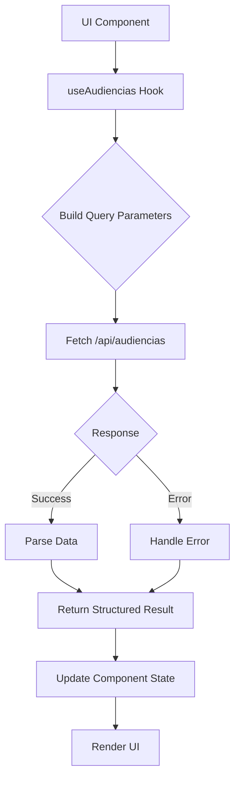
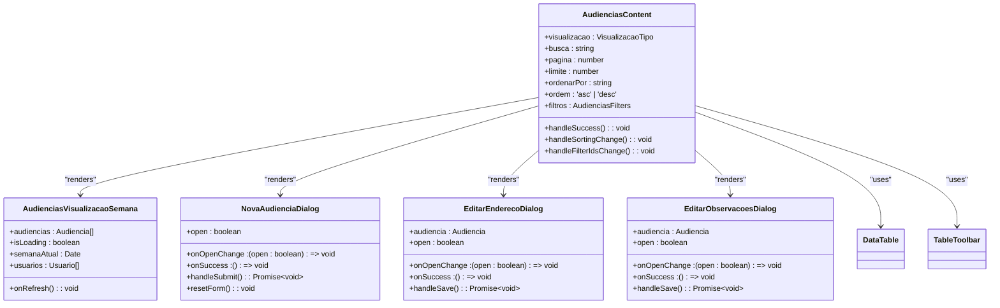
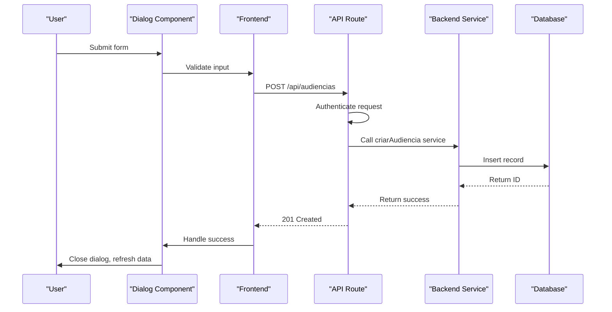
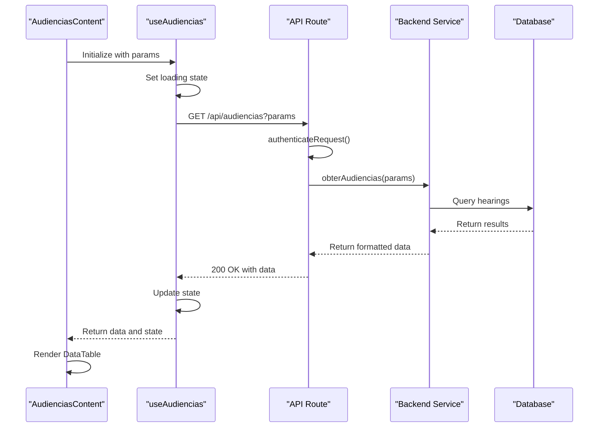
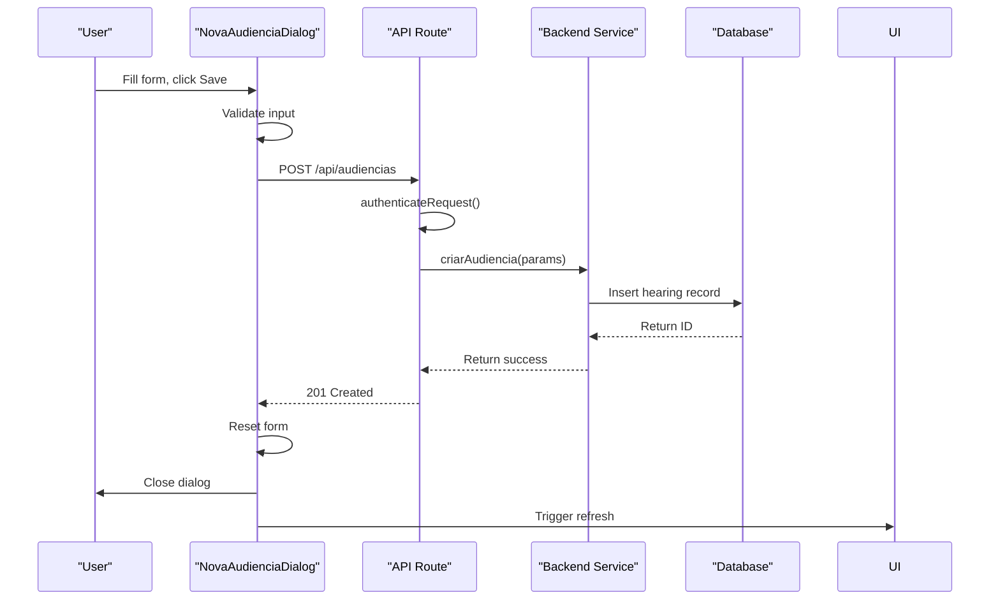
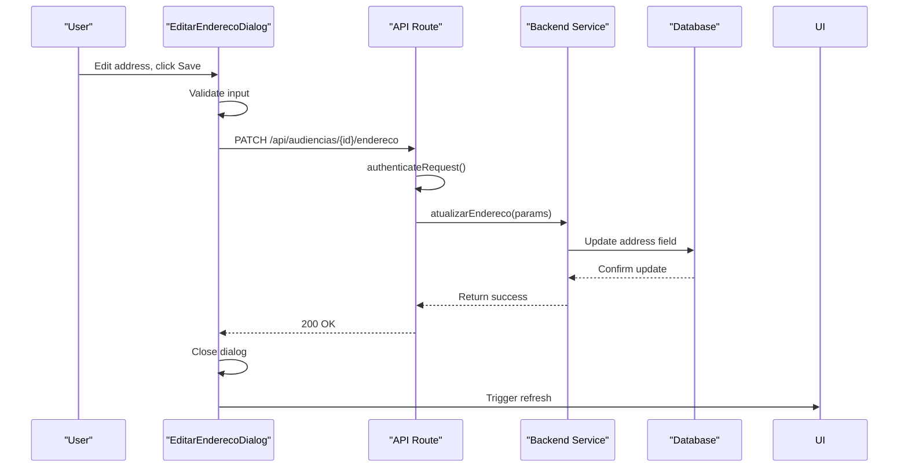

# Frontend-Backend Interactions

<cite>
**Referenced Files in This Document**   
- [audiencias-content.tsx](file://app/(dashboard)/audiencias/components/audiencias-content.tsx)
- [use-audiencias.ts](file://app/_lib/hooks/use-audiencias.ts)
- [route.ts](file://app/api/audiencias/route.ts)
- [audiencias-visualizacao-semana.tsx](file://app/(dashboard)/audiencias/components/audiencias-visualizacao-semana.tsx)
- [nova-audiencia-dialog.tsx](file://app/(dashboard)/audiencias/components/nova-audiencia-dialog.tsx)
- [editar-endereco-dialog.tsx](file://app/(dashboard)/audiencias/components/editar-endereco-dialog.tsx)
- [editar-observacoes-dialog.tsx](file://app/(dashboard)/audiencias/components/editar-observacoes-dialog.tsx)
- [api-auth.ts](file://backend/auth/api-auth.ts)
</cite>

## Table of Contents
1. [Introduction](#introduction)
2. [Core Data Flow](#core-data-flow)
3. [React Hooks and Data Fetching](#react-hooks-and-data-fetching)
4. [Component Architecture](#component-architecture)
5. [Form Submissions and API Integration](#form-submissions-and-api-integration)
6. [Authentication and Authorization](#authentication-and-authorization)
7. [Error Handling and Loading States](#error-handling-and-loading-states)
8. [Sequence Diagrams](#sequence-diagrams)

## Introduction
This document details the frontend-backend interactions in the Sinesys application, focusing on the audiencias (hearings) module. The system follows a modern React architecture with Next.js, utilizing React Server Components, client-side hooks, and API routes to create a seamless user experience. The frontend components in the dashboard interact with backend API endpoints through fetch calls and React hooks, managing data flow, state, and user interactions. The documentation covers the complete interaction flow from UI components to API endpoints and backend services, including request-response patterns, error handling, loading states, and authentication mechanisms.

## Core Data Flow
The data flow in Sinesys follows a structured pattern from the user interface to the backend services. When a user navigates to the audiencias section, the `AudienciasPage` component redirects to the weekly view by default. The main `AudienciasContent` component orchestrates the display of hearings data, managing filters, search, and pagination. This component uses the `useAudiencias` hook to fetch data from the `/api/audiencias` endpoint, which returns paginated results with filtering capabilities.

The data flows through several layers: the UI components render the data, React hooks manage the state and API calls, and the API routes handle authentication and delegate to backend services. The backend services interact with the database to retrieve or modify data, following a clean separation of concerns. The frontend components are designed to be modular, with specialized components for different views (week, month, year) and actions (creating, editing hearings).

**Section sources**
- [audiencias-content.tsx](file://app/(dashboard)/audiencias/components/audiencias-content.tsx)
- [page.tsx](file://app/(dashboard)/audiencias/page.tsx)

## React Hooks and Data Fetching
The `useAudiencias` hook is central to data fetching in the audiencias module. This custom hook encapsulates the logic for retrieving hearings from the API, handling loading states, errors, and pagination. It accepts parameters for filtering, sorting, and pagination, which are converted to query string parameters and appended to the API request.

The hook uses the `fetch` API to make HTTP requests to `/api/audiencias`, processing the response and returning a structured result with the hearings data, pagination information, loading state, and any errors. The hook leverages React's `useCallback` and `useEffect` to ensure efficient re-fetching when parameters change. It also provides a `refetch` function that can be called to manually refresh the data.

The `useAudiencias` hook is consumed by the `AudienciasContent` component, which passes the current filter, search, and pagination state to the hook. The returned data is then used to populate the DataTable component, which displays the hearings in a tabular format with sorting and filtering capabilities.

**Diagram sources**
- [use-audiencias.ts](file://app/_lib/hooks/use-audiencias.ts)
- [audiencias-content.tsx](file://app/(dashboard)/audiencias/components/audiencias-content.tsx)

**Section sources**
- [use-audiencias.ts](file://app/_lib/hooks/use-audiencias.ts)

## Component Architecture
The audiencias module is built with a component-based architecture, where each component has a specific responsibility. The `AudienciasContent` component serves as the container, managing the overall state and coordinating between different sub-components. It renders different visualization components based on the current view (week, month, year, list).

The `DataTable` component is used to display hearings in a tabular format, with customizable columns and sorting. Each column is defined with a header and cell renderer, allowing for rich content including badges, buttons, and nested components. The `TableToolbar` component provides search, filtering, and action buttons, enhancing the user experience.

Specialized components like `NovaAudienciaDialog`, `EditarEnderecoDialog`, and `EditarObservacoesDialog` handle user interactions for creating and editing hearings. These dialog components are designed to be reusable and follow accessibility best practices. They manage their own state and make API calls to update the backend when the user submits changes.

**Diagram sources**
- [audiencias-content.tsx](file://app/(dashboard)/audiencias/components/audiencias-content.tsx)
- [audiencias-visualizacao-semana.tsx](file://app/(dashboard)/audiencias/components/audiencias-visualizacao-semana.tsx)
- [nova-audiencia-dialog.tsx](file://app/(dashboard)/audiencias/components/nova-audiencia-dialog.tsx)
- [editar-endereco-dialog.tsx](file://app/(dashboard)/audiencias/components/editar-endereco-dialog.tsx)
- [editar-observacoes-dialog.tsx](file://app/(dashboard)/audiencias/components/editar-observacoes-dialog.tsx)

**Section sources**
- [audiencias-content.tsx](file://app/(dashboard)/audiencias/components/audiencias-content.tsx)
- [audiencias-visualizacao-semana.tsx](file://app/(dashboard)/audiencias/components/audiencias-visualizacao-semana.tsx)
- [nova-audiencia-dialog.tsx](file://app/(dashboard)/audiencias/components/nova-audiencia-dialog.tsx)
- [editar-endereco-dialog.tsx](file://app/(dashboard)/audiencias/components/editar-endereco-dialog.tsx)
- [editar-observacoes-dialog.tsx](file://app/(dashboard)/audiencias/components/editar-observacoes-dialog.tsx)

## Form Submissions and API Integration
Form submissions in the audiencias module follow a consistent pattern across different dialog components. When a user submits a form, the component validates the input, constructs a request payload, and makes a fetch call to the appropriate API endpoint. The API routes handle the request, validate the data, and delegate to backend services for processing.

For example, when creating a new hearing through the `NovaAudienciaDialog`, the form data is collected and sent to the `/api/audiencias` endpoint via a POST request. The request includes the process ID, hearing details, and other relevant information. The backend service validates the data, creates the hearing record, and returns the ID of the newly created hearing.

Similarly, when editing the address or observations of a hearing, the dialog components make PATCH requests to specific endpoints (`/api/audiencias/{id}/endereco` and `/api/audiencias/{id}/observacoes` respectively). These endpoints update only the specified fields, following the PATCH method semantics.

**Diagram sources**
- [nova-audiencia-dialog.tsx](file://app/(dashboard)/audiencias/components/nova-audiencia-dialog.tsx)
- [route.ts](file://app/api/audiencias/route.ts)

**Section sources**
- [nova-audiencia-dialog.tsx](file://app/(dashboard)/audiencias/components/nova-audiencia-dialog.tsx)
- [route.ts](file://app/api/audiencias/route.ts)

## Authentication and Authorization
Authentication and authorization are handled at the API route level in Sinesys. The `authenticateRequest` function in `api-auth.ts` is used to verify the user's identity and permissions before processing any API request. This function checks for valid authentication tokens in the request headers and validates the user's session.

The API routes support multiple authentication methods, including bearer tokens, session authentication, and service API keys. This flexibility allows different types of clients to access the API while maintaining security. When a request is authenticated, the user's identity is extracted and passed to the backend services for authorization checks.

Authorization is implemented through permission checks in the backend services. For example, when creating or updating a hearing, the service verifies that the user has the necessary permissions to perform the action. This ensures that users can only access and modify data they are authorized to work with.

**Section sources**
- [api-auth.ts](file://backend/auth/api-auth.ts)
- [route.ts](file://app/api/audiencias/route.ts)

## Error Handling and Loading States
The audiencias module implements comprehensive error handling and loading states to provide a smooth user experience. The `useAudiencias` hook manages loading states internally, exposing an `isLoading` flag that components can use to show loading indicators. When an error occurs during data fetching, the hook captures the error message and makes it available to the consuming component.

Dialog components implement their own error handling, displaying error messages to the user when form submissions fail. These errors are typically displayed as inline messages within the dialog, providing immediate feedback. The components also handle loading states during form submission, disabling buttons and showing loading indicators to prevent multiple submissions.

The DataTable component shows appropriate messages when no data is available or when an error occurs. For example, when no hearings are found for a specific date, it displays a message indicating that no hearings are scheduled. This helps users understand the current state of the application.

**Section sources**
- [use-audiencias.ts](file://app/_lib/hooks/use-audiencias.ts)
- [nova-audiencia-dialog.tsx](file://app/(dashboard)/audiencias/components/nova-audiencia-dialog.tsx)
- [editar-endereco-dialog.tsx](file://app/(dashboard)/audiencias/components/editar-endereco-dialog.tsx)
- [editar-observacoes-dialog.tsx](file://app/(dashboard)/audiencias/components/editar-observacoes-dialog.tsx)

## Sequence Diagrams
The following sequence diagrams illustrate the key interaction flows between frontend components and backend services in the audiencias module.

### Data Retrieval Flow
This diagram shows the flow of retrieving hearings data from the API when the user loads the audiencias page.

**Diagram sources**
- [audiencias-content.tsx](file://app/(dashboard)/audiencias/components/audiencias-content.tsx)
- [use-audiencias.ts](file://app/_lib/hooks/use-audiencias.ts)
- [route.ts](file://app/api/audiencias/route.ts)

### Hearing Creation Flow
This diagram illustrates the process of creating a new hearing through the dialog component.

**Diagram sources**
- [nova-audiencia-dialog.tsx](file://app/(dashboard)/audiencias/components/nova-audiencia-dialog.tsx)
- [route.ts](file://app/api/audiencias/route.ts)

### Address Update Flow
This diagram shows the flow of updating a hearing's address through the edit dialog.

**Diagram sources**
- [editar-endereco-dialog.tsx](file://app/(dashboard)/audiencias/components/editar-endereco-dialog.tsx)
- [route.ts](file://app/api/audiencias/route.ts)