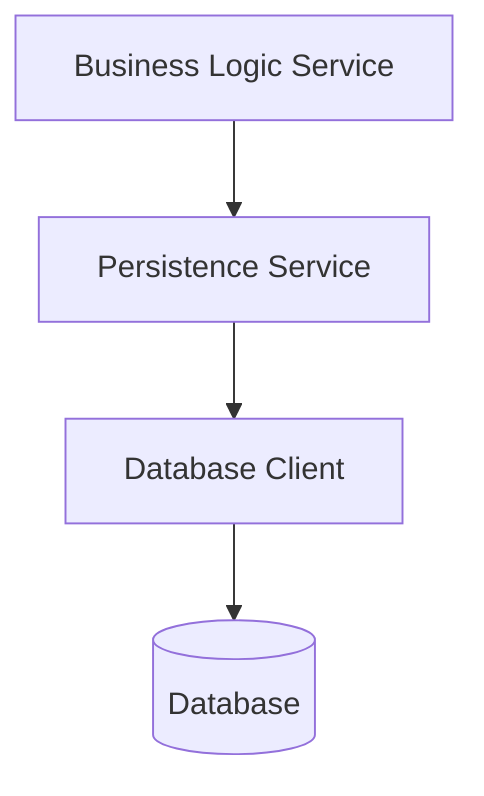
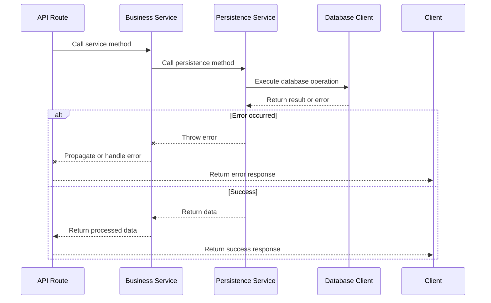
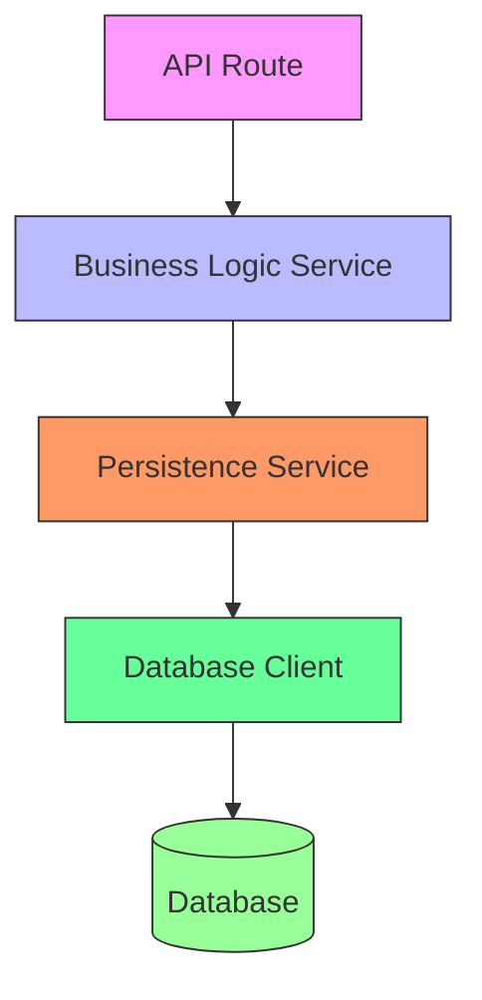
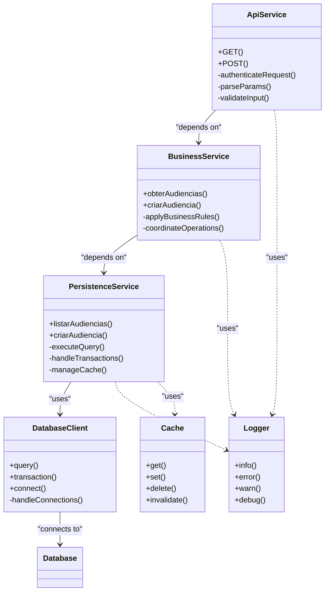

# Service Dependencies

<cite>
**Referenced Files in This Document**   
- [listar-audiencias.service.ts](file://backend/audiencias/services/listar-audiencias.service.ts)
- [persistence/listar-audiencias.service.ts](file://backend/audiencias/services/persistence/listar-audiencias.service.ts)
- [createServiceClient.ts](file://backend/utils/supabase/service-client.ts)
- [cache-utils.ts](file://backend/utils/redis/cache-utils.ts)
- [route.ts](file://app/api/audiencias/route.ts)
- [criar-audiencia.service.ts](file://backend/audiencias/services/criar-audiencia.service.ts)
- [logger.ts](file://backend/assinatura-digital/services/logger.ts)
</cite>

## Table of Contents
1. [Introduction](#introduction)
2. [Dependency Hierarchy Overview](#dependency-hierarchy-overview)
3. [Business Logic to Persistence Dependencies](#business-logic-to-persistence-dependencies)
4. [Dependency Injection Pattern](#dependency-injection-pattern)
5. [Service Interface and Implementation Relationships](#service-interface-and-implementation-relationships)
6. [Transaction Management and Error Propagation](#transaction-management-and-error-propagation)
7. [Data Validation in Services](#data-validation-in-services)
8. [API Route to Service Dependency Chain](#api-route-to-service-dependency-chain)
9. [Cross-Cutting Concerns](#cross-cutting-concerns)
10. [Dependency Diagrams](#dependency-diagrams)

## Introduction
This document provides comprehensive documentation for service dependencies in Sinesys, focusing on the relationship between business logic services and persistence services. The system follows a layered architecture where business logic services depend on persistence services and database clients to manage data operations. The dependency injection pattern is used throughout the application to provide database clients to service classes, ensuring loose coupling and testability. This documentation details the dependency hierarchy from API routes through business services to persistence services and database clients, with specific examples from the audiencias (hearings) module.

## Dependency Hierarchy Overview
The Sinesys application follows a clear dependency hierarchy that separates concerns across different layers of the application. The dependency flow moves from the API layer through business logic services to persistence services and finally to database clients. This layered approach ensures that business rules are separated from data access logic, making the system more maintainable and testable. Each layer depends only on the layer below it, creating a unidirectional flow of dependencies that prevents circular dependencies and makes the system architecture more predictable.

**Section sources**
- [route.ts](file://app/api/audiencias/route.ts#L4-L499)
- [listar-audiencias.service.ts](file://backend/audiencias/services/listar-audiencias.service.ts#L1-L26)

## Business Logic to Persistence Dependencies
Business logic services in Sinesys depend on persistence services to perform data operations while maintaining separation of concerns. For example, the `obterAudiencias` function in the business logic layer depends on the `listarAudienciasDb` function from the persistence layer to retrieve hearing data. This separation allows the business logic service to focus on application-specific rules and processing, while the persistence service handles database interactions.

The business logic service imports and calls the persistence service directly, creating a clear dependency relationship. This pattern is consistent across the application, with business services depending on their corresponding persistence services for data access. The persistence services handle database queries, caching, and transaction management, while business services handle validation, business rules, and coordination between multiple persistence operations when needed.

**Diagram sources **
- [listar-audiencias.service.ts](file://backend/audiencias/services/listar-audiencias.service.ts#L4-L23)
- [persistence/listar-audiencias.service.ts](file://backend/audiencias/services/persistence/listar-audiencias.service.ts#L77-L271)

**Section sources**
- [listar-audiencias.service.ts](file://backend/audiencias/services/listar-audiencias.service.ts#L1-L26)
- [persistence/listar-audiencias.service.ts](file://backend/audiencias/services/persistence/listar-audiencias.service.ts#L1-L272)

## Dependency Injection Pattern
Sinesys implements dependency injection through module imports and function composition rather than constructor-based injection. Database clients are provided to services through utility functions that create configured database clients. The `createServiceClient` function from the Supabase utility module creates a service-level database client with administrative privileges for backend operations.

Services obtain their database clients by importing and calling these factory functions, which encapsulate the configuration and instantiation logic. This approach provides a form of dependency injection where the database client dependencies are injected into services through imports rather than constructor parameters. The pattern promotes reusability and centralized configuration management, as all services use the same client creation logic.

The system also uses functional composition to build services, where higher-level services are composed of lower-level services and utilities. This compositional approach allows for flexible dependency management and makes services easier to test by enabling the substitution of dependencies in test environments.

**Section sources**
- [createServiceClient.ts](file://backend/utils/supabase/service-client.ts#L45-L58)
- [persistence/listar-audiencias.service.ts](file://backend/audiencias/services/persistence/listar-audiencias.service.ts#L90-L91)

## Service Interface and Implementation Relationships
In Sinesys, service interfaces are defined through TypeScript types and function signatures, with implementations provided in separate modules. The `ListarAudienciasService` and `ListarAudienciasPersistenceService` relationship demonstrates this pattern, where the business service depends on the persistence service through a well-defined interface.

The persistence service provides a concrete implementation of data access operations, while the business service consumes these operations through imported functions. This approach creates a clear contract between service layers, with the persistence service exposing a stable API that the business service can depend on. The separation allows both services to evolve independently as long as the interface contract is maintained.

Type definitions in the `types` directory provide the shared contracts between service layers, ensuring type safety across the dependency chain. These types define the input parameters and return values for service functions, creating a formal interface that both business and persistence services adhere to.

**Section sources**
- [listar-audiencias.service.ts](file://backend/audiencias/services/listar-audiencias.service.ts#L5-L8)
- [persistence/listar-audiencias.service.ts](file://backend/audiencias/services/persistence/listar-audiencias.service.ts#L7-L13)

## Transaction Management and Error Propagation
Sinesys handles transaction management and error propagation through a combination of database-level transactions and structured error handling in service layers. The system uses Supabase/PostgreSQL for database transactions, with the service client providing transaction capabilities when needed.

Error propagation follows a consistent pattern where lower-level services throw descriptive errors that are caught and handled by higher-level services. The persistence layer throws errors for data access issues, which are propagated up to the business logic layer for handling. Business services may catch these errors, add context, and re-throw them with additional information, or handle them appropriately based on the business context.

The API routes serve as the final error handling boundary, catching any unhandled exceptions and converting them to appropriate HTTP responses. This layered error handling approach ensures that errors are handled at the appropriate level of abstraction, with detailed technical information available for debugging while providing user-friendly messages in API responses.

**Diagram sources **
- [route.ts](file://app/api/audiencias/route.ts#L308-L312)
- [persistence/listar-audiencias.service.ts](file://backend/audiencias/services/persistence/listar-audiencias.service.ts#L198-L200)
- [criar-audiencia.service.ts](file://backend/audiencias/services/criar-audiencia.service.ts#L99-L102)

**Section sources**
- [route.ts](file://app/api/audiencias/route.ts#L308-L312)
- [persistence/listar-audiencias.service.ts](file://backend/audiencias/services/persistence/listar-audiencias.service.ts#L198-L200)

## Data Validation in Services
Data validation in Sinesys is implemented at multiple levels of the service hierarchy, with different types of validation occurring at appropriate layers. Input validation occurs at the API route level, where request parameters and bodies are validated before being passed to business services. Business logic validation occurs in business services, enforcing domain rules and business constraints.

The system uses TypeScript types for compile-time validation, ensuring type safety across service boundaries. Runtime validation is implemented in services to validate data that cannot be checked at compile time, such as database constraints or business rules. Validation errors are thrown as exceptions and propagated up the call stack to be handled by the API routes.

For complex validation scenarios, the system may use dedicated validation utilities or functions that can be shared across multiple services. This approach ensures consistent validation rules across the application while keeping validation logic separate from business logic.

**Section sources**
- [route.ts](file://app/api/audiencias/route.ts#L277-L291)
- [criar-audiencia.service.ts](file://backend/audiencias/services/criar-audiencia.service.ts#L19-L34)

## API Route to Service Dependency Chain
The dependency chain from API routes to database clients follows a clear, unidirectional flow in Sinesys. API routes depend on business logic services, which in turn depend on persistence services, which finally depend on database clients. This chain ensures that each layer has a single responsibility and depends only on the layer below it.

The API route acts as the entry point, handling HTTP-specific concerns like authentication, request parsing, and response formatting. It calls business services to perform application logic, passing validated parameters. Business services coordinate complex operations, apply business rules, and call one or more persistence services to access data. Persistence services handle database interactions, including queries, transactions, and connection management.

This dependency chain enables separation of concerns, making the system more maintainable and testable. Each layer can be tested independently, with dependencies mocked or stubbed as needed. The chain also provides clear boundaries for cross-cutting concerns like logging, caching, and error handling.

**Diagram sources **
- [route.ts](file://app/api/audiencias/route.ts#L6-L8)
- [listar-audiencias.service.ts](file://backend/audiencias/services/listar-audiencias.service.ts#L4-L23)
- [persistence/listar-audiencias.service.ts](file://backend/audiencias/services/persistence/listar-audiencias.service.ts#L90-L91)
- [createServiceClient.ts](file://backend/utils/supabase/service-client.ts#L45-L58)

**Section sources**
- [route.ts](file://app/api/audiencias/route.ts#L1-L499)
- [listar-audiencias.service.ts](file://backend/audiencias/services/listar-audiencias.service.ts#L1-L26)

## Cross-Cutting Concerns
Sinesys addresses cross-cutting concerns like logging, caching, and error handling through dedicated utilities and consistent patterns across service layers. Logging is implemented using structured logging utilities that provide consistent log formats with contextual information. The logger includes service, operation, duration, and custom metrics to facilitate debugging and monitoring.

Caching is implemented at the persistence layer using Redis, with cache keys generated based on query parameters to ensure consistency. The system uses a cache-aside pattern, where services check the cache before querying the database and update the cache with fresh data after database queries. Cache invalidation is handled through dedicated functions that remove stale data when updates occur.

Error handling is standardized across the application, with consistent error structures and HTTP status codes. The system uses try-catch blocks at appropriate levels to handle exceptions, with detailed error information logged for debugging while user-friendly messages are returned in API responses. These cross-cutting concerns are implemented in a way that minimizes their impact on business logic, keeping service code focused on core functionality.

**Section sources**
- [logger.ts](file://backend/assinatura-digital/services/logger.ts#L72-L97)
- [cache-utils.ts](file://backend/utils/redis/cache-utils.ts#L63-L89)
- [route.ts](file://app/api/audiencias/route.ts#L308-L312)

## Dependency Diagrams
The following diagrams illustrate the key dependency relationships in the Sinesys service architecture, showing how different components depend on each other to deliver functionality.

**Diagram sources **
- [route.ts](file://app/api/audiencias/route.ts#L1-L499)
- [listar-audiencias.service.ts](file://backend/audiencias/services/listar-audiencias.service.ts#L1-L26)
- [persistence/listar-audiencias.service.ts](file://backend/audiencias/services/persistence/listar-audiencias.service.ts#L1-L272)
- [createServiceClient.ts](file://backend/utils/supabase/service-client.ts#L45-L58)
- [logger.ts](file://backend/assinatura-digital/services/logger.ts#L72-L97)
- [cache-utils.ts](file://backend/utils/redis/cache-utils.ts#L63-L89)