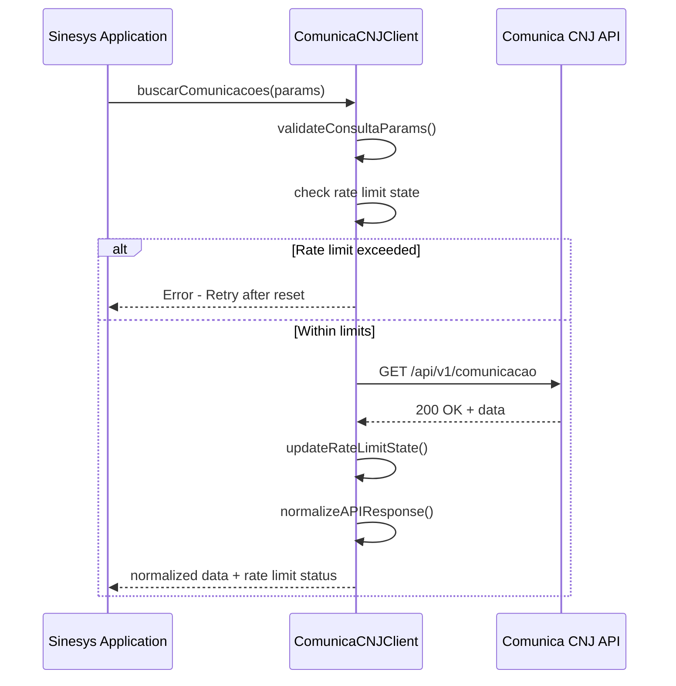
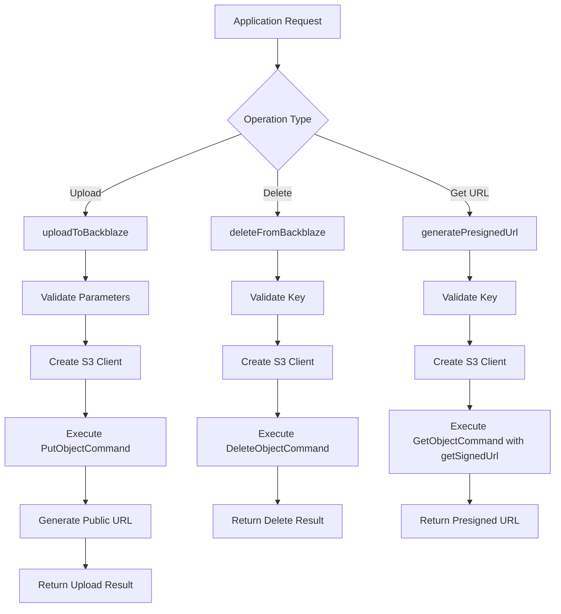
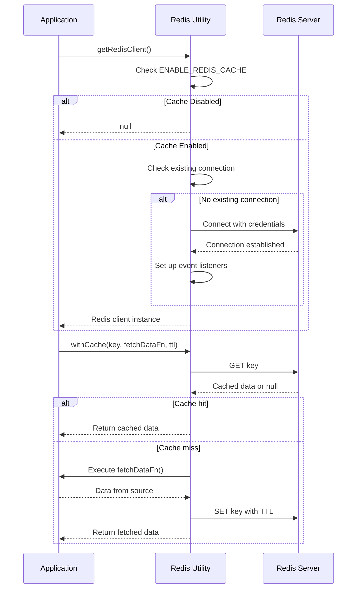
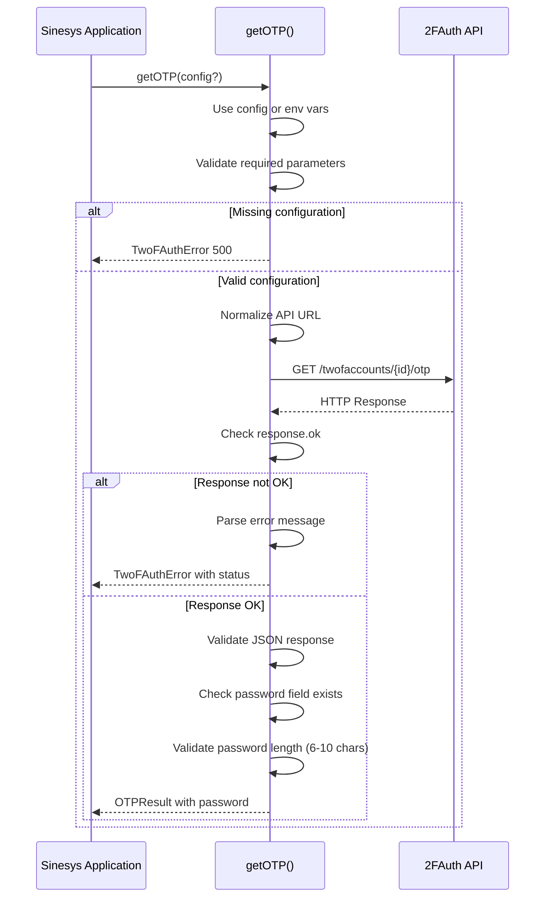
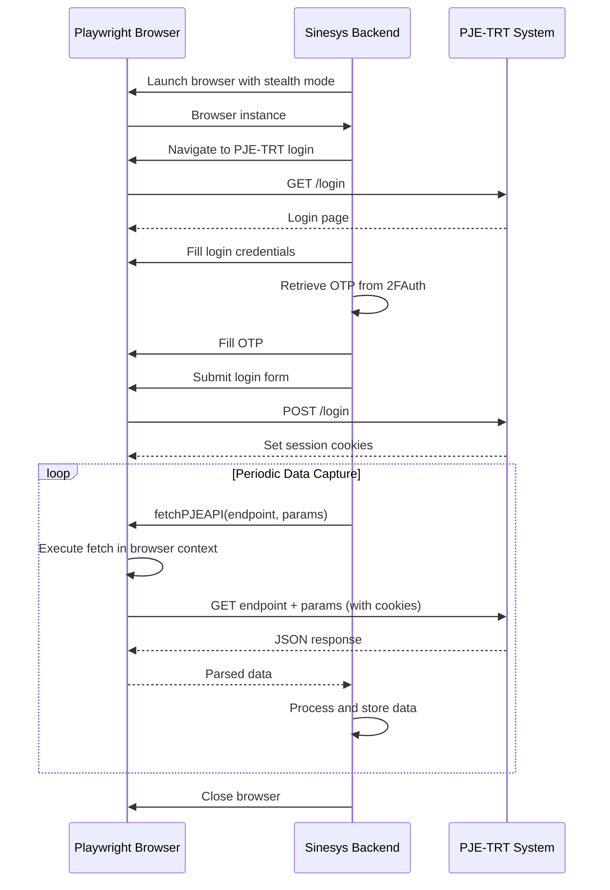
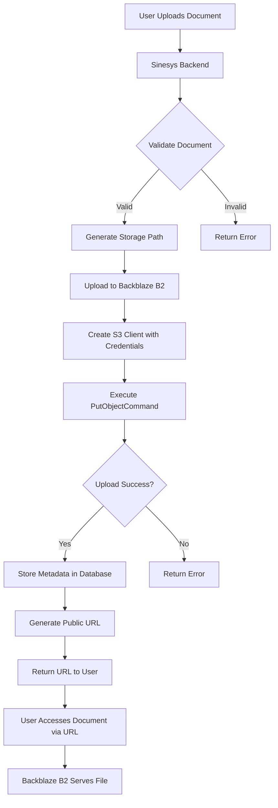
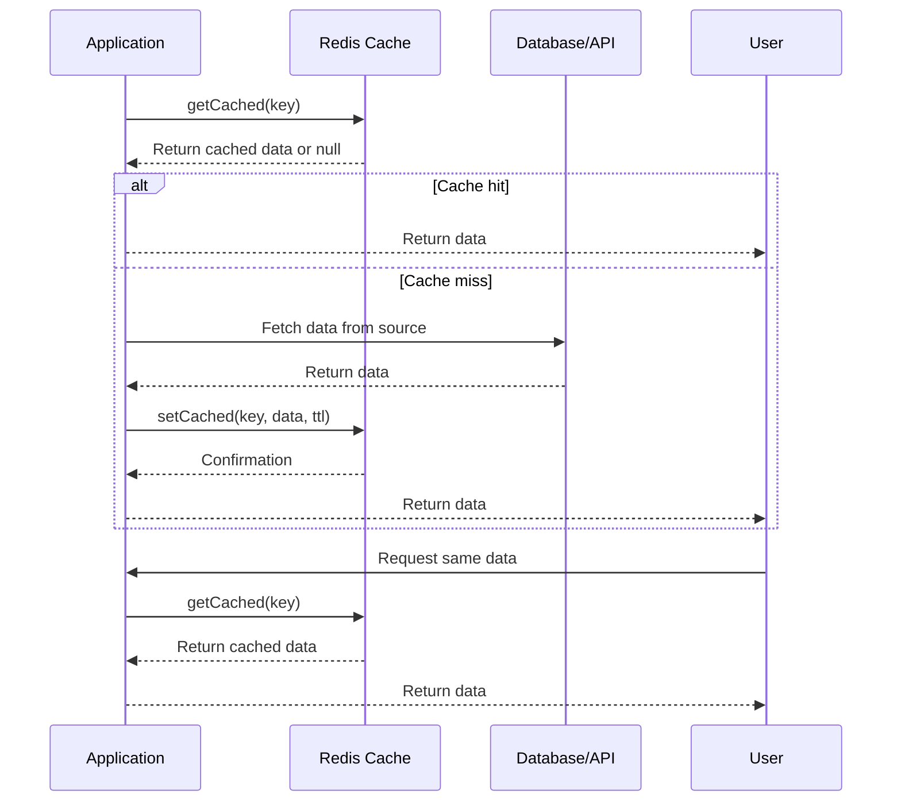

# Third-party Integrations

<cite>
**Referenced Files in This Document**   
- [comunica-cnj-client.ts](file://backend/comunica-cnj/client/comunica-cnj-client.ts)
- [backblaze-b2.service.ts](file://backend/storage/backblaze-b2.service.ts)
- [twofauth.service.ts](file://backend/api/twofauth.service.ts)
- [fetch.ts](file://backend/api/pje-trt/shared/fetch.ts)
- [client.ts](file://backend/utils/redis/client.ts)
- [index.ts](file://backend/comunica-cnj/index.ts)
- [backblaze-b2-storage.service.ts](file://backend/acordos-condenacoes/services/storage/backblaze-b2-storage.service.ts)
- [cache-utils.ts](file://backend/utils/redis/cache-utils.ts)
- [retry.ts](file://backend/utils/retry/index.ts)
</cite>

## Table of Contents
1. [Introduction](#introduction)
2. [PJE-TRT Integration](#pje-trt-integration)
3. [Comunica CNJ Integration](#comunica-cnj-integration)
4. [Backblaze B2 Storage Integration](#backblaze-b2-storage-integration)
5. [Redis Caching Integration](#redis-caching-integration)
6. [2FAuth Integration](#2fauth-integration)
7. [Integration Patterns](#integration-patterns)
8. [Configuration Management](#configuration-management)
9. [Error Handling and Logging](#error-handling-and-logging)
10. [Data Flow Diagrams](#data-flow-diagrams)

## Introduction
Sinesys integrates with multiple third-party services to provide comprehensive legal technology solutions. This documentation details the integration architecture, patterns, and implementation details for key external systems including PJE-TRT, Comunica CNJ, Backblaze B2, Redis, and 2FAuth. The system follows a modular approach with dedicated clients for each service, implementing consistent patterns for authentication, error handling, retry mechanisms, and configuration management. These integrations enable critical functionality such as data capture from judicial systems, secure document storage, two-factor authentication, and performance optimization through caching.

## PJE-TRT Integration

Sinesys integrates with PJE-TRT (Processo Judicial Eletrônico do Tribunal Regional do Trabalho) to capture case data, expedientes, audiências, and other judicial information. The integration uses Playwright to automate browser interactions with the PJE system, which requires session-based authentication.

The core integration pattern uses a shared fetch utility that executes HTTP requests within the browser context to maintain session cookies. This approach is necessary because PJE-TRT uses cookie-based authentication rather than token-based authentication, and attempting to use Authorization headers results in 401 unauthorized errors.

The integration architecture is organized into domain-specific modules:
- Acervo Geral: Handles general case portfolio data
- Expedientes (Pendentes de Manifestação): Manages pending case documents
- Audiências: Processes hearing data
- Arquivados: Handles archived cases
- Timeline: Retrieves case timeline information

Each module exports functions for retrieving paginated data, with type safety provided through shared TypeScript interfaces. The integration leverages Playwright's ability to execute JavaScript in the browser context, allowing the system to make authenticated API calls using the same session cookies that would be used in a manual browser session.

**Section sources**
- [fetch.ts](file://backend/api/pje-trt/shared/fetch.ts#L1-L204)
- [index.ts](file://backend/api/pje-trt/index.ts#L1-L47)

## Comunica CNJ Integration

The Comunica CNJ integration enables Sinesys to access public judicial communications through the CNJ's (Conselho Nacional de Justiça) API. This integration is implemented as a dedicated HTTP client that handles all interactions with the Comunica CNJ API endpoints.

The integration follows a layered architecture with distinct components:
- Client Layer: Implements the HTTP client using Axios with proper error handling and rate limit management
- Service Layer: Provides business logic functions for different use cases
- Persistence Layer: Handles database operations for storing retrieved communications

The client implements comprehensive rate limit handling by tracking the API's rate limit headers (x-ratelimit-limit, x-ratelimit-remaining, x-ratelimit-reset) and automatically pausing requests when the limit is reached. When a 429 (Too Many Requests) response is received, the client waits for 60 seconds before retrying the request.

Key integration features include:
- Communication search with multiple filter parameters (tribunal, date range, OAB number, etc.)
- Certificate (PDF) retrieval for communications
- Tribunal metadata listing
- Caderno (daily bulletin) metadata retrieval

The integration uses a singleton pattern with factory functions to ensure consistent client configuration across the application. Configuration can be provided explicitly or defaults to environment variables, allowing for flexible deployment configurations.



**Diagram sources **
- [comunica-cnj-client.ts](file://backend/comunica-cnj/client/comunica-cnj-client.ts#L1-L574)
- [index.ts](file://backend/comunica-cnj/index.ts#L1-L82)

**Section sources**
- [comunica-cnj-client.ts](file://backend/comunica-cnj/client/comunica-cnj-client.ts#L1-L574)
- [index.ts](file://backend/comunica-cnj/index.ts#L1-L82)

## Backblaze B2 Storage Integration

Sinesys uses Backblaze B2 for secure document storage, leveraging its S3-compatible API for file operations. The integration provides reliable storage for legal documents, case files, and other sensitive information.

The storage integration is implemented in two layers:
1. A low-level service (`backblaze-b2.service.ts`) that provides basic operations like upload, delete, and presigned URL generation
2. A higher-level storage service (`backblaze-b2-storage.service.ts`) that implements the `IStorageService` interface for dependency injection

Key features of the integration include:
- Secure credential management using environment variables
- Public URL generation for direct file access
- Presigned URL generation for temporary access to private files
- Comprehensive error handling with descriptive error messages
- Detailed logging of storage operations

The integration uses AWS SDK v3 for S3 compatibility, allowing seamless interaction with Backblaze B2's S3 API. All credentials are loaded from environment variables, ensuring they are never hardcoded in the application. The bucket must be configured as public for direct URL access, with instructions provided in the repository for proper configuration.

Security considerations include:
- Never embedding credentials in URLs
- Using separate REDIS_PASSWORD environment variable rather than including it in the Redis URL
- Validating all configuration parameters at service initialization
- Implementing proper error handling to avoid leaking sensitive information



**Diagram sources **
- [backblaze-b2.service.ts](file://backend/storage/backblaze-b2.service.ts#L1-L195)
- [backblaze-b2-storage.service.ts](file://backend/acordos-condenacoes/services/storage/backblaze-b2-storage.service.ts#L1-L173)

**Section sources**
- [backblaze-b2.service.ts](file://backend/storage/backblaze-b2.service.ts#L1-L195)
- [backblaze-b2-storage.service.ts](file://backend/acordos-condenacoes/services/storage/backblaze-b2-storage.service.ts#L1-L173)

## Redis Caching Integration

Sinesys implements Redis as a distributed cache to improve performance and reduce load on external APIs and databases. The Redis integration provides a simple yet effective caching layer for frequently accessed data.

The caching implementation includes:
- Connection management with automatic reconnection and error handling
- Cache utility functions for common operations
- Cache key management
- Cache invalidation mechanisms

The Redis client is implemented as a singleton with lazy initialization, ensuring only one connection is maintained throughout the application lifecycle. The connection respects an `ENABLE_REDIS_CACHE` environment variable, allowing the cache to be disabled in development or testing environments.

Key features of the implementation:
- Automatic connection retry with exponential backoff (up to 3 attempts)
- Comprehensive event handling for connection lifecycle events (connect, ready, error, close)
- Type-safe wrapper functions for common Redis operations
- Cache statistics retrieval for monitoring and debugging

The integration follows a defensive programming approach, gracefully handling Redis connection failures by returning null instead of throwing errors, allowing the application to continue functioning (albeit without caching benefits) when Redis is unavailable.



**Diagram sources **
- [client.ts](file://backend/utils/redis/client.ts#L1-L68)
- [cache-utils.ts](file://backend/utils/redis/cache-utils.ts#L1-L169)

**Section sources**
- [client.ts](file://backend/utils/redis/client.ts#L1-L68)
- [cache-utils.ts](file://backend/utils/redis/cache-utils.ts#L1-L169)

## 2FAuth Integration

The 2FAuth integration provides two-factor authentication code retrieval for accessing judicial systems that require OTP (One-Time Password) authentication. This service is critical for automated access to systems like PJE-TRT that implement additional security layers beyond username and password.

The integration is implemented as a reusable service that can be used by various judicial system integrations (TRT, TJ, TRF, etc.). It follows a simple yet robust design with comprehensive error handling and validation.

Key aspects of the implementation:
- Configuration flexibility: accepts configuration parameters or defaults to environment variables
- URL normalization: handles various API URL formats (with or without /api/v1 suffix)
- Comprehensive error handling: distinguishes between different error types (validation, authentication, network)
- Response validation: ensures OTP codes meet length requirements (6-10 characters)
- Custom error class: `TwoFAuthError` with status code and reason properties

The service retrieves OTP codes via HTTP GET request to the 2FAuth API, using Bearer token authentication. It parses the JSON response and validates the presence and format of the password field before returning the result. The service returns both the current and next OTP codes when available, allowing for more robust authentication flows.

Security considerations include:
- Never logging full API tokens (only first 50 characters in debug messages)
- Validating response content type before parsing JSON
- Implementing strict type checking for response fields
- Providing clear error messages without exposing sensitive information



**Diagram sources **
- [twofauth.service.ts](file://backend/api/twofauth.service.ts#L1-L196)

**Section sources**
- [twofauth.service.ts](file://backend/api/twofauth.service.ts#L1-L196)

## Integration Patterns

Sinesys employs consistent integration patterns across all third-party services, ensuring maintainability and reliability. These patterns address common challenges in external API integration, including error handling, retries, rate limiting, and configuration management.

### Retry Mechanisms
The system implements a sophisticated retry mechanism using exponential backoff with jitter to prevent thundering herd problems. The retry utility (`withRetry`) provides:

- Configurable maximum attempts (default: 3)
- Base delay for exponential backoff (default: 100ms)
- Maximum delay cap (default: 5000ms)
- Customizable retryable error detection
- Optional retry callback for logging or monitoring

The retry logic automatically identifies retryable errors, including network timeouts, connection refused errors, DNS resolution failures, database deadlocks, and HTTP 5xx server errors. For each retry attempt, the delay is calculated using exponential backoff (baseDelay * 2^(attempt-1)) with added jitter (0-30% of the exponential delay) to distribute retry attempts.

```mermaid
flowchart TD
A[Initial Request] --> B{Success?}
B --> |Yes| C[Return Result]
B --> |No| D{Retryable Error?}
D --> |No| E[Throw Error]
D --> |Yes| F{Max Attempts Reached?}
F --> |Yes| G[Throw Error]
F --> |No| H[Calculate Delay]
H --> I[Exponential Backoff: baseDelay * 2^(attempt-1)]
I --> J[Add Jitter: 0-30% of backoff]
J --> K[Cap at maxDelay]
K --> L[Wait Delay Period]
L --> M[Increment Attempt Counter]
M --> A
```

**Diagram sources **
- [retry.ts](file://backend/utils/retry/index.ts#L1-L134)

**Section sources**
- [retry.ts](file://backend/utils/retry/index.ts#L1-L134)

### Rate Limiting
The system implements rate limiting at multiple levels to respect external API limits and prevent service disruption:

1. **Comunica CNJ**: Tracks rate limit headers and automatically pauses requests when limits are reached
2. **General HTTP clients**: Use retry mechanisms with exponential backoff for 429 responses
3. **Redis**: Configurable cache TTL to control data freshness and reduce external API calls

The Comunica CNJ client specifically monitors x-ratelimit-* headers and maintains an in-memory state of remaining requests and reset time. When the rate limit is exhausted, the client throws an error with specific retry timing information.

### Circuit Breaker Pattern
While not explicitly implemented as a separate component, the system exhibits circuit breaker-like behavior through:
- Redis availability detection (returns null when Redis is not ready)
- Graceful degradation when external services are unavailable
- Configurable timeouts for all external requests
- Health checks for critical services

## Configuration Management

Sinesys manages third-party service configuration through environment variables, providing flexibility across different deployment environments (development, staging, production).

### Environment Variable Structure
Each integration uses a consistent naming convention for environment variables:

**Comunica CNJ:**
- `COMUNICA_CNJ_API_URL`: API base URL (default: https://comunicaapi.pje.jus.br/)
- `COMUNICA_CNJ_REQUEST_TIMEOUT`: Request timeout in milliseconds (default: 30000)
- `COMUNICA_CNJ_MAX_RETRIES`: Maximum retry attempts (default: 3)

**Backblaze B2:**
- `B2_ENDPOINT`: API endpoint URL
- `B2_REGION`: AWS region
- `B2_BUCKET`: Bucket name
- `B2_KEY_ID`: Access key ID
- `B2_APPLICATION_KEY`: Secret access key

**Redis:**
- `ENABLE_REDIS_CACHE`: Enable/disable caching (true/false)
- `REDIS_URL`: Redis connection URL
- `REDIS_PASSWORD`: Redis password (separate from URL for security)
- `REDIS_CACHE_TTL`: Default cache TTL in seconds
- `REDIS_CACHE_MAX_MEMORY`: Maximum memory usage

**2FAuth:**
- `TWOFAUTH_API_URL`: API base URL
- `TWOFAUTH_API_TOKEN`: Authentication token
- `TWOFAUTH_ACCOUNT_ID`: Account identifier

### Configuration Loading Pattern
The system follows a consistent pattern for configuration loading:

1. Define interface for configuration options
2. Create factory functions that read from environment variables with defaults
3. Use configuration in service constructors
4. Validate required configuration at service initialization

This approach ensures that services fail fast if required configuration is missing, rather than failing at runtime during operation. The configuration is validated and normalized before being used, preventing issues from malformed or incomplete configuration.

**Section sources**
- [comunica-cnj-client.ts](file://backend/comunica-cnj/client/comunica-cnj-client.ts#L546-L573)
- [backblaze-b2.service.ts](file://backend/storage/backblaze-b2.service.ts#L47-L57)
- [client.ts](file://backend/utils/redis/client.ts#L5-L9)
- [twofauth.service.ts](file://backend/api/twofauth.service.ts#L79-L87)

## Error Handling and Logging

Sinesys implements comprehensive error handling and logging across all third-party integrations to ensure reliability and facilitate debugging.

### Error Handling Strategies
Each integration employs specific error handling strategies appropriate to the service:

**Comunica CNJ:**
- Validates request parameters before making API calls
- Handles 422 validation errors with descriptive messages
- Manages 429 rate limit errors by waiting and retrying
- Sanitizes error messages to avoid leaking sensitive information
- Uses structured error objects with clear error types

**Backblaze B2:**
- Validates configuration parameters at service initialization
- Checks bucket existence before operations
- Handles S3-specific errors (NoSuchKey, etc.)
- Provides descriptive error messages for upload and download failures
- Implements proper cleanup on error (closing connections, etc.)

**2FAuth:**
- Uses a custom `TwoFAuthError` class with status codes and reasons
- Validates response structure and content
- Implements comprehensive error parsing from API responses
- Handles network errors separately from API errors
- Provides clear guidance for configuration issues

**General Patterns:**
- Fail fast on configuration errors
- Validate inputs before external calls
- Use specific error types rather than generic errors
- Include relevant context in error messages
- Never expose sensitive information in error messages
- Implement graceful degradation when possible

### Logging Practices
The system uses structured logging with consistent patterns across integrations:

- Operation start/end logging with parameters
- Performance logging (timing, sizes)
- Error logging with full context
- Security-sensitive information redaction
- Environment-specific log levels

Each integration logs key events such as:
- Service initialization
- API request start and completion
- File upload/download progress
- Cache hits/misses
- Authentication events
- Error conditions

The logging provides sufficient detail for debugging without compromising security or performance.

**Section sources**
- [comunica-cnj-client.ts](file://backend/comunica-cnj/client/comunica-cnj-client.ts#L42-L50)
- [backblaze-b2.service.ts](file://backend/storage/backblaze-b2.service.ts#L83-L85)
- [twofauth.service.ts](file://backend/api/twofauth.service.ts#L104-L110)
- [client.ts](file://backend/utils/redis/client.ts#L34-L48)

## Data Flow Diagrams

### PJE-TRT Data Capture Flow


**Diagram sources **
- [fetch.ts](file://backend/api/pje-trt/shared/fetch.ts#L143-L203)
- [trt-auth.service.ts](file://backend/captura/services/trt/trt-auth.service.ts#L82-L117)

### Document Storage Flow


**Diagram sources **
- [backblaze-b2.service.ts](file://backend/storage/backblaze-b2.service.ts#L78-L116)
- [backblaze-b2-storage.service.ts](file://backend/acordos-condenacoes/services/storage/backblaze-b2-storage.service.ts#L50-L88)

### Caching Flow


**Diagram sources **
- [cache-utils.ts](file://backend/utils/redis/cache-utils.ts#L158-L164)
- [client.ts](file://backend/utils/redis/client.ts#L15-L56)