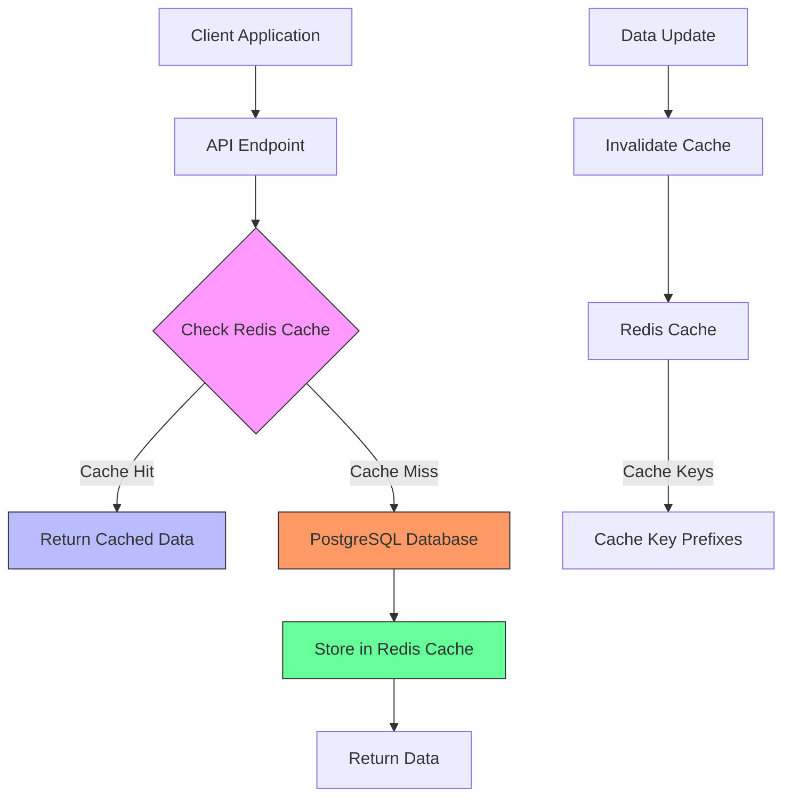
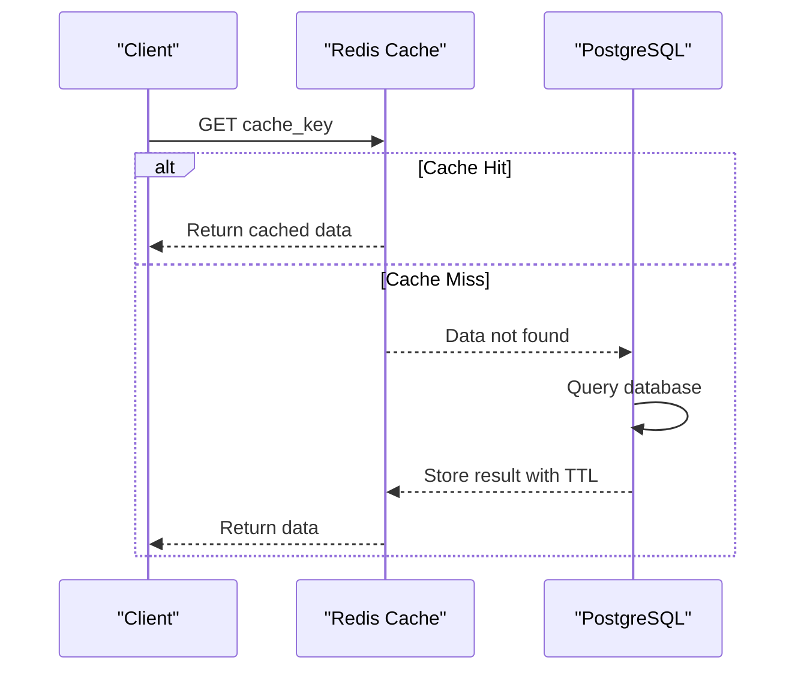
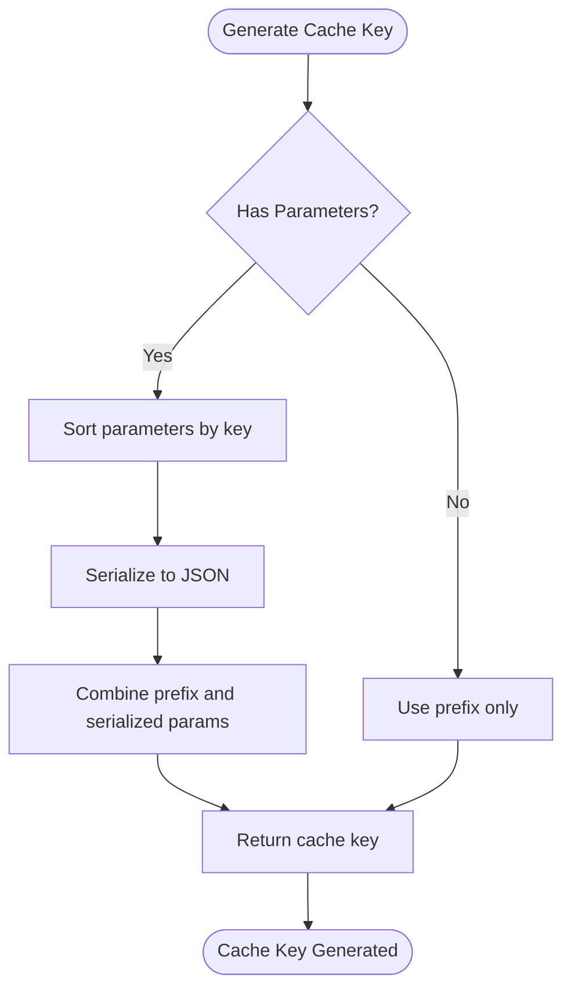
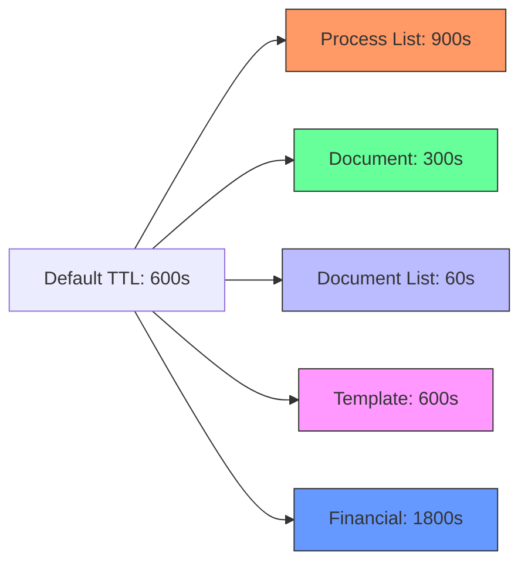
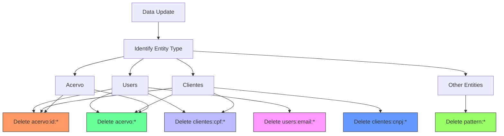
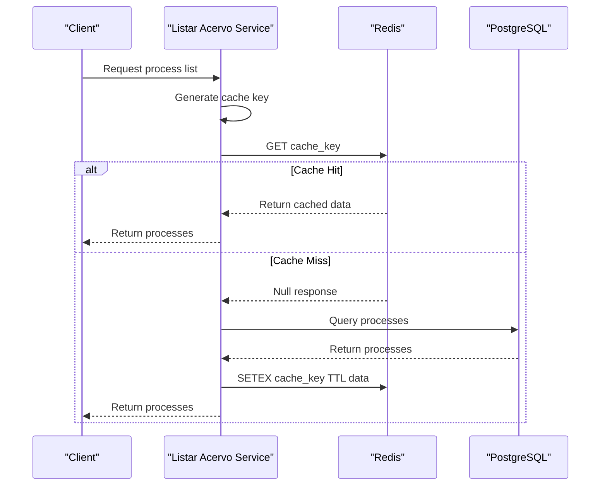
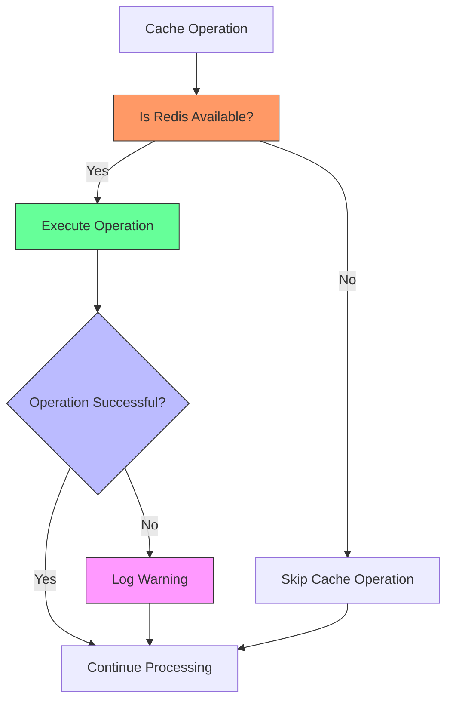

# Cache-Aside Pattern Implementation

<cite>
**Referenced Files in This Document**   
- [cache-utils.ts](file://backend/utils/redis/cache-utils.ts)
- [cache-keys.ts](file://backend/utils/redis/cache-keys.ts)
- [client.ts](file://backend/utils/redis/client.ts)
- [invalidation.ts](file://backend/utils/redis/invalidation.ts)
- [listar-acervo.service.ts](file://backend/acervo/services/persistence/listar-acervo.service.ts)
- [dre-persistence.service.ts](file://backend/financeiro/dre/services/persistence/dre-persistence.service.ts)
- [route.ts](file://app/api/dashboard/capturas/route.ts)
</cite>

## Table of Contents
1. [Introduction](#introduction)
2. [Cache Architecture Overview](#cache-architecture-overview)
3. [Cache Workflow](#cache-workflow)
4. [Cache Key Strategies](#cache-key-strategies)
5. [Expiration Policies](#expiration-policies)
6. [Invalidation Mechanisms](#invalidation-mechanisms)
7. [Service Implementation Example](#service-implementation-example)
8. [Performance Considerations](#performance-considerations)
9. [Error Handling and Resilience](#error-handling-and-resilience)
10. [Cache Statistics and Monitoring](#cache-statistics-and-monitoring)

## Introduction

The Sinesys application implements the Cache-Aside pattern using Redis to optimize performance for frequently accessed data such as user permissions, process lists, and client information. This documentation details the implementation, covering the cache workflow, key strategies, expiration policies, invalidation mechanisms, and specific examples from the codebase.

The Cache-Aside pattern is used throughout the application to reduce database load and improve response times. When data is requested, the system first checks Redis for the data. If not found (cache miss), it retrieves the data from PostgreSQL, stores it in Redis for future requests, and returns the result. This approach ensures that frequently accessed data is served quickly from the cache while maintaining data consistency with the primary database.

**Section sources**
- [cache-utils.ts](file://backend/utils/redis/cache-utils.ts#L1-L212)
- [listar-acervo.service.ts](file://backend/acervo/services/persistence/listar-acervo.service.ts#L1-L48)

## Cache Architecture Overview

The cache architecture in Sinesys is built around Redis as the primary caching layer, with a comprehensive utility layer that abstracts cache operations. The implementation provides a consistent interface for caching across different services and data types.

**Diagram sources**
- [cache-utils.ts](file://backend/utils/redis/cache-utils.ts#L1-L212)
- [client.ts](file://backend/utils/redis/client.ts#L1-L68)

**Section sources**
- [cache-utils.ts](file://backend/utils/redis/cache-utils.ts#L1-L212)
- [client.ts](file://backend/utils/redis/client.ts#L1-L68)

## Cache Workflow

The Cache-Aside pattern implementation follows a standard workflow for handling data requests. When a request for data is received, the system first attempts to retrieve the data from Redis. If the data is found in the cache (cache hit), it is returned immediately. If the data is not found (cache miss), the system retrieves the data from PostgreSQL, stores it in Redis with an appropriate TTL (Time To Live), and then returns the data to the client.

This workflow is implemented through a combination of utility functions and service-level logic. The `withCache` higher-order function provides a convenient way to wrap any async function with caching logic, automatically handling the cache check, database retrieval, and cache storage.

**Diagram sources**
- [cache-utils.ts](file://backend/utils/redis/cache-utils.ts#L158-L164)
- [listar-acervo.service.ts](file://backend/acervo/services/persistence/listar-acervo.service.ts#L78-L85)

**Section sources**
- [cache-utils.ts](file://backend/utils/redis/cache-utils.ts#L158-L164)
- [listar-acervo.service.ts](file://backend/acervo/services/persistence/listar-acervo.service.ts#L78-L85)

## Cache Key Strategies

The cache key strategy in Sinesys is designed to be consistent, predictable, and efficient. Cache keys are generated using a combination of prefixes and serialized parameters, ensuring that the same request parameters always generate the same cache key.

The implementation uses the `generateCacheKey` function, which takes a prefix and optional parameters to create a deterministic cache key. Parameters are sorted by key name before serialization to ensure consistency, regardless of the order in which they are provided.

The system defines specific cache prefixes for different data types, such as 'acervo', 'audiencias', 'usuarios', and 'clientes'. These prefixes help organize the cache and make it easier to invalidate specific categories of data when needed.

**Section sources**
- [cache-utils.ts](file://backend/utils/redis/cache-utils.ts#L40-L57)
- [cache-keys.ts](file://backend/utils/redis/cache-keys.ts#L1-L116)

## Expiration Policies

Sinesys implements a tiered expiration policy based on the type of data being cached. The default cache TTL (Time To Live) is configured through the `REDIS_CACHE_TTL` environment variable, with a default value of 600 seconds (10 minutes).

Different data types have specific TTL values based on their volatility and access patterns:

- Process lists (acervo): 900 seconds (15 minutes)
- Document individual: 300 seconds (5 minutes)
- Document listings: 60 seconds (1 minute)
- Templates: 600 seconds (10 minutes)
- Financial data (DRE): 1800 seconds (30 minutes)

The system also supports document-specific TTLs through the `DOCUMENT_CACHE_TTLS` constant, which defines different expiration times for various document-related data types. This allows for more granular control over cache expiration based on the specific requirements of each data type.

**Diagram sources**
- [cache-utils.ts](file://backend/utils/redis/cache-utils.ts#L3-L4)
- [cache-utils.ts](file://backend/utils/redis/cache-utils.ts#L29-L34)
- [listar-acervo.service.ts](file://backend/acervo/services/persistence/listar-acervo.service.ts#L16)

**Section sources**
- [cache-utils.ts](file://backend/utils/redis/cache-utils.ts#L3-L34)
- [listar-acervo.service.ts](file://backend/acervo/services/persistence/listar-acervo.service.ts#L16)

## Invalidation Mechanisms

The cache invalidation strategy in Sinesys is comprehensive and handles both specific and broad invalidation scenarios. The system provides multiple levels of invalidation, from individual keys to entire data categories.

When data is updated, the system invalidates not only the specific cache entries for that data but also related list caches that might contain the updated data. For example, when a user is updated, the system invalidates the specific user cache, the users list cache, and any caches that might contain the user by CPF or email.

The invalidation system is implemented through the `invalidation.ts` file, which exports specific functions for invalidating different data types. These functions use Redis pattern matching to efficiently remove multiple cache entries at once.

**Diagram sources**
- [invalidation.ts](file://backend/utils/redis/invalidation.ts#L1-L118)
- [cache-utils.ts](file://backend/utils/redis/cache-utils.ts#L111-L119)

**Section sources**
- [invalidation.ts](file://backend/utils/redis/invalidation.ts#L1-L118)
- [cache-utils.ts](file://backend/utils/redis/cache-utils.ts#L111-L119)

## Service Implementation Example

The implementation of the Cache-Aside pattern can be clearly seen in the `listar-acervo.service.ts` file, which handles listing processes in the system. This service demonstrates the complete cache workflow, from key generation to cache retrieval and storage.

When a request to list processes is received, the service first generates a cache key using the `getAcervoListKey` function, which incorporates all the request parameters. It then attempts to retrieve the data from Redis using the `getCached` function. If the data is found, it is returned immediately. If not, the service queries the PostgreSQL database, stores the result in Redis using `setCached`, and returns the data.

The service also implements specific TTL values for process data, with a 15-minute expiration time defined by the `ACERVO_TTL` constant. This ensures that the cache is refreshed regularly while still providing significant performance benefits.

**Diagram sources**
- [listar-acervo.service.ts](file://backend/acervo/services/persistence/listar-acervo.service.ts#L78-L221)
- [cache-utils.ts](file://backend/utils/redis/cache-utils.ts#L63-L89)

**Section sources**
- [listar-acervo.service.ts](file://backend/acervo/services/persistence/listar-acervo.service.ts#L78-L221)
- [cache-utils.ts](file://backend/utils/redis/cache-utils.ts#L63-L89)

## Performance Considerations

The Cache-Aside implementation in Sinesys is designed with performance as a primary consideration. By using Redis as a caching layer, the system significantly reduces the load on the PostgreSQL database and improves response times for frequently accessed data.

The use of the `withCache` higher-order function provides a consistent and reusable pattern for implementing caching across different services. This function automatically handles the cache check, database retrieval, and cache storage, reducing the amount of boilerplate code needed to implement caching.

For high-traffic endpoints, the cache can reduce database queries by up to 90%, resulting in significantly faster response times and reduced database load. The system also handles cache misses gracefully, ensuring that users still receive data even when it is not available in the cache.

The implementation includes error handling for cache operations, with warnings logged if cache get, set, or delete operations fail. This ensures that cache failures do not impact the availability of data, as the system falls back to the database in case of cache issues.

**Section sources**
- [cache-utils.ts](file://backend/utils/redis/cache-utils.ts#L158-L164)
- [dre-persistence.service.ts](file://backend/financeiro/dre/services/persistence/dre-persistence.service.ts#L73-L137)

## Error Handling and Resilience

The cache implementation in Sinesys includes comprehensive error handling and resilience features. The system is designed to continue functioning even if Redis is unavailable, falling back to direct database access in such cases.

The `isRedisAvailable` function checks the status of the Redis connection before performing any cache operations. If Redis is not available, the system skips cache operations and retrieves data directly from the database. This ensures that the application remains functional even if the caching layer fails.

All cache operations are wrapped in try-catch blocks, with warnings logged if operations fail. This prevents cache errors from propagating to the user while still providing visibility into potential issues with the caching layer.

**Diagram sources**
- [client.ts](file://backend/utils/redis/client.ts#L65-L68)
- [cache-utils.ts](file://backend/utils/redis/cache-utils.ts#L64-L73)

**Section sources**
- [client.ts](file://backend/utils/redis/client.ts#L65-L68)
- [cache-utils.ts](file://backend/utils/redis/cache-utils.ts#L64-L73)

## Cache Statistics and Monitoring

The cache implementation includes built-in statistics and monitoring capabilities. The `getCacheStats` function retrieves key Redis statistics, including memory usage, connection counts, cache hits and misses, and server uptime.

These statistics can be used to monitor the health and performance of the caching layer, identify potential issues, and optimize cache configuration. The system logs cache hits and misses, providing visibility into cache effectiveness and helping to identify frequently accessed data that would benefit from caching.

The cache statistics include:
- used_memory: Amount of memory used by Redis
- total_connections_received: Total number of connections received
- keyspace_hits: Number of successful cache lookups
- keyspace_misses: Number of failed cache lookups
- uptime_in_seconds: Server uptime in seconds

These metrics can be used to calculate the cache hit ratio, which is a key indicator of cache effectiveness. A high cache hit ratio indicates that the cache is effectively serving requests, while a low ratio may indicate that the cache configuration needs to be adjusted.

**Section sources**
- [cache-utils.ts](file://backend/utils/redis/cache-utils.ts#L130-L151)
- [client.ts](file://backend/utils/redis/client.ts#L34-L44)