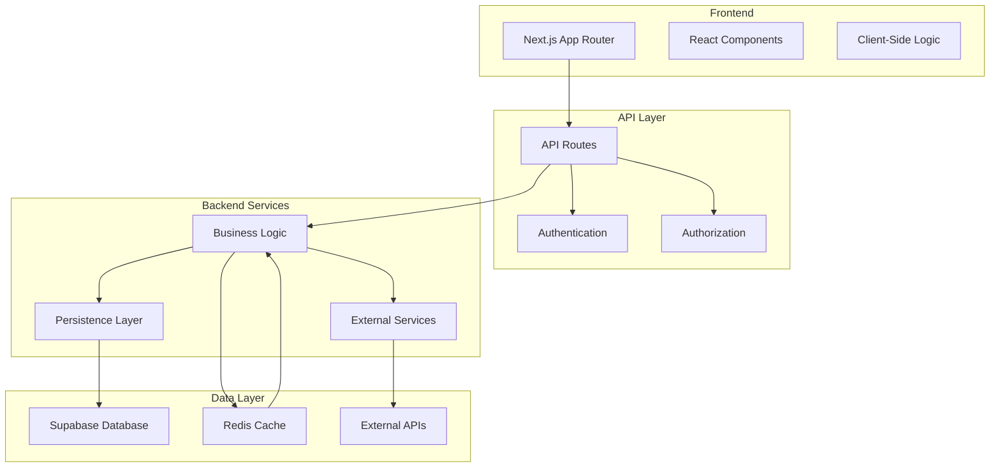
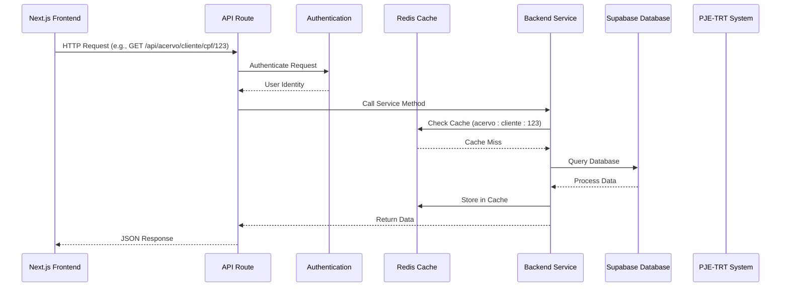
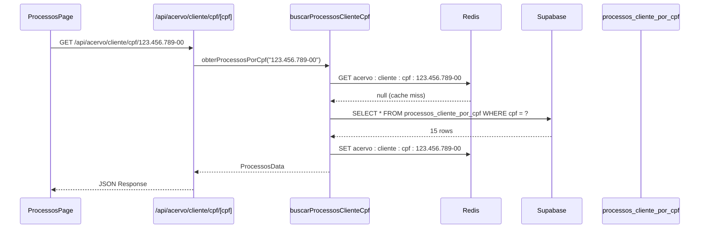
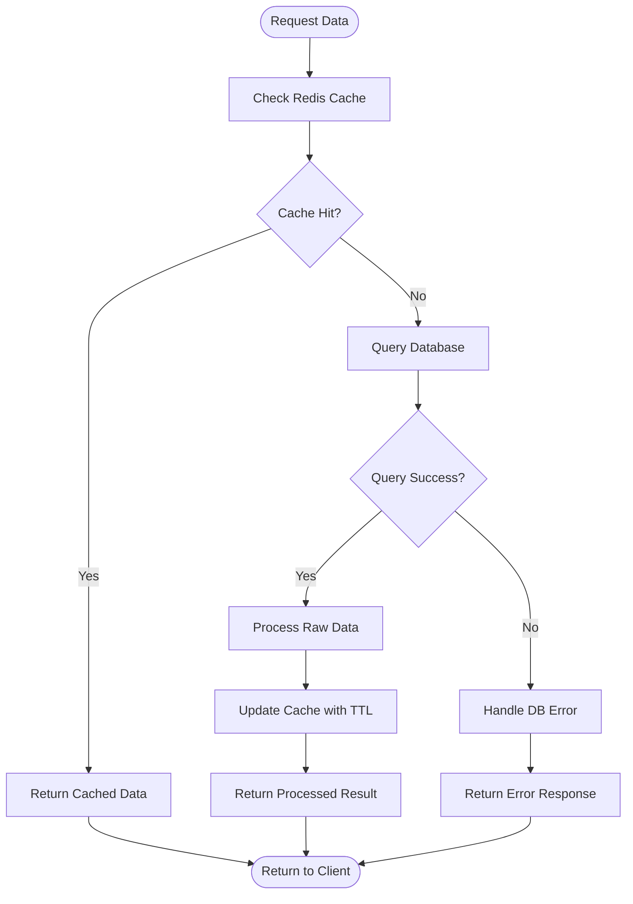
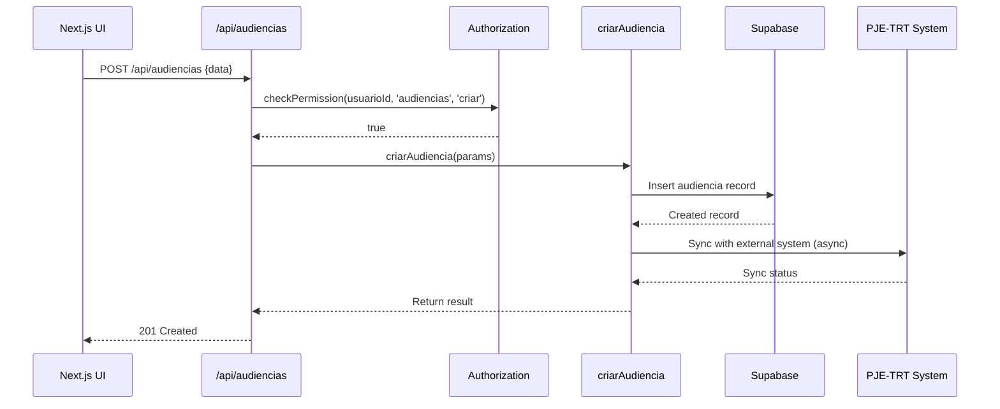
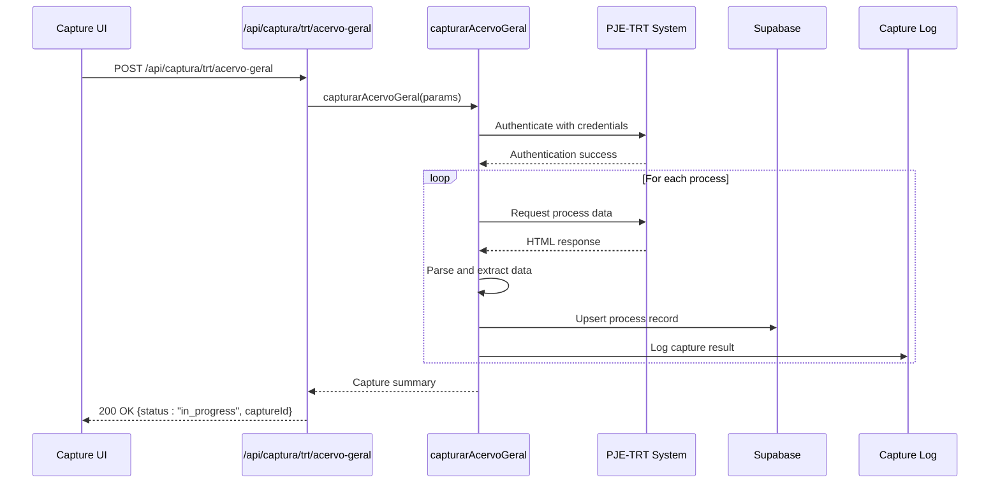
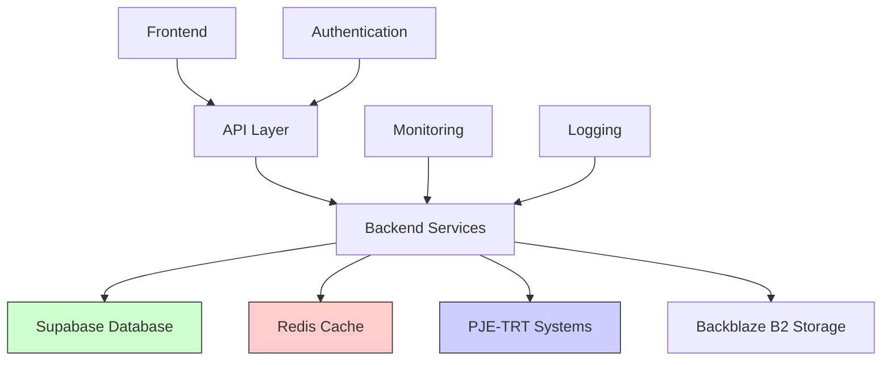

# Data Flow Diagrams

<cite>
**Referenced Files in This Document**   
- [app/api/acervo/cliente/cpf/[cpf]/route.ts](file://app/api/acervo/cliente/cpf/[cpf]/route.ts)
- [app/(dashboard)/processos/page.tsx](file://app/(dashboard)/processos/page.tsx)
- [backend/acervo/services/buscar-processos-cliente-cpf.service.ts](file://backend/acervo/services/buscar-processos-cliente-cpf.service.ts)
- [backend/acervo/services/persistence/buscar-processos-cliente-cpf.service.ts](file://backend/acervo/services/persistence/buscar-processos-cliente-cpf.service.ts)
- [backend/utils/redis/cache-utils.ts](file://backend/utils/redis/cache-utils.ts)
- [backend/auth/authorization.ts](file://backend/auth/authorization.ts)
- [app/api/captura/trt/audiencias/route.ts](file://app/api/captura/trt/audiencias/route.ts)
- [backend/captura/services/trt/audiencias.service.ts](file://backend/captura/services/trt/audiencias.service.ts)
- [backend/audiencias/services/listar-audiencias.service.ts](file://backend/audiencias/services/listar-audiencias.service.ts)
- [app/api/cache/stats/route.ts](file://app/api/cache/stats/route.ts)
- [app/api/cache/clear/route.ts](file://app/api/cache/clear/route.ts)
</cite>

## Table of Contents
1. [Introduction](#introduction)
2. [Project Structure](#project-structure)
3. [Core Components](#core-components)
4. [Architecture Overview](#architecture-overview)
5. [Detailed Component Analysis](#detailed-component-analysis)
6. [Dependency Analysis](#dependency-analysis)
7. [Performance Considerations](#performance-considerations)
8. [Troubleshooting Guide](#troubleshooting-guide)
9. [Conclusion](#conclusion)

## Introduction
This document provides comprehensive architectural documentation for the data flow patterns in Sinesys, a legal technology platform. The system enables law firms to manage legal processes, schedule hearings, and capture data from PJE-TRT (Processo Judicial Eletrônico - Tribunal Regional do Trabalho) systems. The architecture follows a modern full-stack approach with Next.js for the frontend, Supabase for the database, and a Node.js backend with Redis for caching.

The primary focus of this documentation is to describe the end-to-end data pathways through the system, starting from user interactions in the frontend through API routes to backend services and persistence layers. Special attention is given to the Cache-Aside pattern implementation using Redis for frequently accessed data such as user permissions and process lists. The document details request-response flows for key operations like retrieving legal processes, scheduling hearings, and capturing data from PJE-TRT systems.

## Project Structure
Sinesys follows a well-organized directory structure that separates concerns between frontend, backend, and shared components. The application uses a Next.js App Router architecture with API routes colocated in the app/api directory. The backend services are organized by domain (acervo, audiencias, clientes, etc.) with clear separation between business logic and persistence layers.

The frontend is organized into dashboard sections for different functional areas (processes, hearings, clients, etc.), with corresponding API routes for data access. The backend services implement a clean architecture with service layers that encapsulate business logic and persistence layers that handle database interactions. Shared types and utilities are organized in the types and backend/utils directories respectively.

**Diagram sources**
- [app/api/acervo/cliente/cpf/[cpf]/route.ts](file://app/api/acervo/cliente/cpf/[cpf]/route.ts)
- [backend/acervo/services/buscar-processos-cliente-cpf.service.ts](file://backend/acervo/services/buscar-processos-cliente-cpf.service.ts)
- [backend/acervo/services/persistence/buscar-processos-cliente-cpf.service.ts](file://backend/acervo/services/persistence/buscar-processos-cliente-cpf.service.ts)

**Section sources**
- [app/api/acervo/cliente/cpf/[cpf]/route.ts](file://app/api/acervo/cliente/cpf/[cpf]/route.ts)
- [backend/acervo/services/buscar-processos-cliente-cpf.service.ts](file://backend/acervo/services/buscar-processos-cliente-cpf.service.ts)

## Core Components
The Sinesys application consists of several core components that work together to provide a comprehensive legal case management system. The primary components include process management (acervo), hearing scheduling (audiencias), client management (clientes), and document management (documentos). Each component follows a consistent architectural pattern with frontend pages, API routes, backend services, and database persistence.

The system implements a Cache-Aside pattern using Redis to improve performance for frequently accessed data. This pattern is particularly important for operations that retrieve lists of legal processes, user permissions, and hearing schedules. The caching mechanism is implemented at the service layer, where data is first checked in Redis before falling back to the database.

Error handling and retry mechanisms are implemented throughout the data flow to ensure reliability when interacting with external systems like PJE-TRT. The system uses exponential backoff with jitter for retry strategies, particularly for operations that capture data from external sources.

**Section sources**
- [backend/utils/redis/cache-utils.ts](file://backend/utils/redis/cache-utils.ts)
- [backend/auth/authorization.ts](file://backend/auth/authorization.ts)
- [backend/utils/retry/index.ts](file://backend/utils/retry/index.ts)

## Architecture Overview
The Sinesys architecture follows a layered approach with clear separation between presentation, application logic, and data access layers. The system uses a Next.js frontend with server-side rendering for improved performance and SEO. API routes serve as the entry point for all data operations, handling authentication, authorization, and request validation before delegating to backend services.

The backend services implement business logic and coordinate between different data sources. These services use a Cache-Aside pattern with Redis to optimize performance for frequently accessed data. When data is requested, the system first checks the Redis cache, and only queries the database if the data is not present in the cache. This pattern significantly reduces database load and improves response times for common operations.

External data capture from PJE-TRT systems is handled through dedicated capture services that run asynchronously. These services are designed to handle the complexities of web scraping government systems, including authentication, rate limiting, and error recovery. The captured data is then processed and stored in the Supabase database for use by the application.

**Diagram sources**
- [app/api/acervo/cliente/cpf/[cpf]/route.ts](file://app/api/acervo/cliente/cpf/[cpf]/route.ts)
- [backend/acervo/services/buscar-processos-cliente-cpf.service.ts](file://backend/acervo/services/buscar-processos-cliente-cpf.service.ts)
- [backend/utils/redis/cache-utils.ts](file://backend/utils/redis/cache-utils.ts)

## Detailed Component Analysis

### Client Process List Flow
The flow for retrieving a list of legal processes for a client demonstrates the end-to-end data pathway in Sinesys. This operation begins with a user navigating to the processes page in the dashboard, which triggers a client-side request to the API route that retrieves processes for a specific client identified by CPF (individual taxpayer registry).

The API route first authenticates the request to ensure the user is authorized to access the data. It then calls the backend service responsible for retrieving client processes. The service implements the Cache-Aside pattern, first checking Redis for cached data before querying the database. If the data is not in the cache, it executes a complex database query that joins multiple tables to gather comprehensive information about the client's processes.

**Diagram sources**
- [app/(dashboard)/processos/page.tsx](file://app/(dashboard)/processos/page.tsx)
- [app/api/acervo/cliente/cpf/[cpf]/route.ts](file://app/api/acervo/cliente/cpf/[cpf]/route.ts)
- [backend/acervo/services/buscar-processos-cliente-cpf.service.ts](file://backend/acervo/services/buscar-processos-cliente-cpf.service.ts)
- [backend/acervo/services/persistence/buscar-processos-cliente-cpf.service.ts](file://backend/acervo/services/persistence/buscar-processos-cliente-cpf.service.ts)

**Section sources**
- [app/(dashboard)/processos/page.tsx](file://app/(dashboard)/processos/page.tsx)
- [app/api/acervo/cliente/cpf/[cpf]/route.ts](file://app/api/acervo/cliente/cpf/[cpf]/route.ts)
- [backend/acervo/services/buscar-processos-cliente-cpf.service.ts](file://backend/acervo/services/buscar-processos-cliente-cpf.service.ts)

### Cache-Aside Pattern Implementation
The Cache-Aside pattern in Sinesys is implemented through a dedicated Redis utility module that provides consistent caching functionality across all services. This pattern follows the standard approach: when an application needs data, it first checks the cache; if the data is found (cache hit), it is returned immediately; if not (cache miss), the data is retrieved from the database, stored in the cache, and then returned to the application.

The implementation includes several key features to ensure reliability and performance. Cache keys are generated consistently using prefixes and serialized parameters to avoid collisions. Different data types have appropriate TTLs (Time To Live) based on their update frequency. For example, user permissions have a 5-minute TTL, while document lists have a 1-minute TTL due to their higher change frequency.

Cache invalidation is handled explicitly when data is modified. Services call dedicated invalidation functions after creating, updating, or deleting data to ensure the cache remains consistent with the database. The system also provides administrative endpoints to manually clear or inspect the cache for debugging purposes.

**Diagram sources**
- [backend/utils/redis/cache-utils.ts](file://backend/utils/redis/cache-utils.ts)
- [backend/auth/authorization.ts](file://backend/auth/authorization.ts)

**Section sources**
- [backend/utils/redis/cache-utils.ts](file://backend/utils/redis/cache-utils.ts)

### Hearing Scheduling Flow
The hearing scheduling functionality in Sinesys demonstrates how the system handles data creation and synchronization with external systems. When a user schedules a hearing through the frontend interface, the request flows through the API route to the backend service responsible for creating hearing records.

The service validates the input data, checks user permissions, and creates the hearing record in the database. For hearings captured from PJE-TRT systems, the system uses a more complex flow that involves authenticating to the external system, scraping hearing data, and synchronizing it with the local database. This process runs asynchronously to avoid timeouts and provides status updates through the UI.

The system also implements retry mechanisms for external API calls, using exponential backoff with jitter to handle transient failures. This is particularly important when interacting with government systems that may have rate limiting or intermittent availability issues.

**Diagram sources**
- [app/api/captura/trt/audiencias/route.ts](file://app/api/captura/trt/audiencias/route.ts)
- [backend/captura/services/trt/audiencias.service.ts](file://backend/captura/services/trt/audiencias.service.ts)
- [backend/audiencias/services/criar-audiencia.service.ts](file://backend/audiencias/services/criar-audiencia.service.ts)

**Section sources**
- [app/api/captura/trt/audiencias/route.ts](file://app/api/captura/trt/audiencias/route.ts)
- [backend/captura/services/trt/audiencias.service.ts](file://backend/captura/services/trt/audiencias.service.ts)

### PJE-TRT Data Capture Flow
The data capture system for PJE-TRT (Processo Judicial Eletrônico - Tribunal Regional do Trabalho) is one of the most complex components in Sinesys. This system enables automatic synchronization of legal process data from government websites into the application. The capture process is designed to handle the challenges of web scraping government systems, including authentication, rate limiting, and data consistency.

The flow begins when a user initiates a capture through the frontend interface or when a scheduled capture runs automatically. The API route authenticates the request and validates user permissions before delegating to the capture service. The service then coordinates with the PJE-TRT system, handling authentication with stored credentials and navigating the website structure to extract relevant data.

Due to the potentially long duration of capture operations, the system uses an asynchronous pattern with immediate response and background processing. The frontend can poll for status updates or receive real-time updates through web sockets. The captured data is processed, validated, and stored in the database, with comprehensive logging for debugging and auditing purposes.

**Diagram sources**
- [app/api/captura/trt/audiencias/route.ts](file://app/api/captura/trt/audiencias/route.ts)
- [backend/captura/services/trt/audiencias.service.ts](file://backend/captura/services/trt/audiencias.service.ts)
- [backend/captura/services/scheduler/executar-agendamento.service.ts](file://backend/captura/services/scheduler/executar-agendamento.service.ts)

**Section sources**
- [app/api/captura/trt/audiencias/route.ts](file://app/api/captura/trt/audiencias/route.ts)
- [backend/captura/services/trt/audiencias.service.ts](file://backend/captura/services/trt/audiencias.service.ts)

## Dependency Analysis
The Sinesys application has a well-defined dependency structure that follows modern software architecture principles. The frontend depends on the API layer for all data operations, while the backend services have dependencies on the database, caching layer, and external APIs. The system uses environment variables and configuration files to manage external dependencies like database connection strings and API keys.

The caching layer (Redis) is a critical dependency that significantly impacts system performance. When Redis is unavailable, the system falls back to direct database access, ensuring continued operation at the cost of reduced performance. The system provides health checks and monitoring for Redis availability, allowing administrators to detect and address issues promptly.

External dependencies on PJE-TRT systems are managed through resilient patterns that handle authentication, rate limiting, and network failures. The system implements retry mechanisms with exponential backoff and circuit breakers to prevent cascading failures when external systems are unavailable.

**Diagram sources**
- [backend/utils/redis/cache-utils.ts](file://backend/utils/redis/cache-utils.ts)
- [backend/captura/services/trt/audiencias.service.ts](file://backend/captura/services/trt/audiencias.service.ts)
- [backend/storage/backblaze-b2.service.ts](file://backend/storage/backblaze-b2.service.ts)

**Section sources**
- [backend/utils/redis/cache-utils.ts](file://backend/utils/redis/cache-utils.ts)
- [backend/captura/services/trt/audiencias.service.ts](file://backend/captura/services/trt/audiencias.service.ts)

## Performance Considerations
The Sinesys application implements several performance optimizations to ensure responsive user experiences, particularly for data-intensive operations. The primary optimization is the Cache-Aside pattern using Redis, which reduces database load and improves response times for frequently accessed data like user permissions, process lists, and hearing schedules.

The system uses appropriate TTLs (Time To Live) for different types of cached data based on their update frequency. For example, user permissions have a 5-minute TTL, while document lists have a 1-minute TTL due to their higher change frequency. This balance ensures data freshness while maximizing cache hit rates.

Database performance is optimized through proper indexing on frequently queried columns, particularly for the permissoes table (usuario_id, recurso, operacao) and process-related tables. The system also uses database views and materialized views to simplify complex queries and improve performance for reporting operations.

For external API calls, the system implements retry mechanisms with exponential backoff and jitter to handle transient failures without overwhelming external systems. This approach improves reliability while respecting rate limits and reducing the impact of network issues.

**Section sources**
- [backend/utils/redis/cache-utils.ts](file://backend/utils/redis/cache-utils.ts)
- [openspec/changes/archive/2025-11-22-add-permissions-and-cargos-system/proposal.md](file://openspec/changes/archive/2025-11-22-add-permissions-and-cargos-system/proposal.md)
- [supabase/schemas/00_permissions.sql](file://supabase/schemas/00_permissions.sql)

## Troubleshooting Guide
When troubleshooting data flow issues in Sinesys, it's important to follow a systematic approach that examines each layer of the architecture. Common issues typically fall into categories such as authentication/authorization problems, cache inconsistencies, database query performance, and external API connectivity.

For authentication and authorization issues, verify that the user has the required permissions by checking the permissoes table in the database. The system provides a cache stats endpoint that can help diagnose caching issues by showing hit/miss ratios and available memory.

When investigating slow database queries, examine the query execution plan and ensure appropriate indexes are in place. The system logs database query performance, which can help identify bottlenecks. For external API issues, check the capture logs and verify that credentials are valid and not expired.

The system provides several diagnostic endpoints to assist with troubleshooting:
- GET /api/cache/stats - Returns Redis cache statistics
- POST /api/cache/clear - Clears the Redis cache (requires admin permissions)
- GET /api/health - Returns system health status

**Section sources**
- [app/api/cache/stats/route.ts](file://app/api/cache/stats/route.ts)
- [app/api/cache/clear/route.ts](file://app/api/cache/clear/route.ts)
- [backend/auth/authorization.ts](file://backend/auth/authorization.ts)

## Conclusion
The Sinesys application demonstrates a well-architected approach to managing legal process data with a focus on performance, reliability, and user experience. The system's data flow patterns follow established best practices, including the Cache-Aside pattern with Redis for improved performance, proper separation of concerns between frontend and backend components, and resilient error handling for external API interactions.

The architecture effectively handles the complexities of integrating with government systems like PJE-TRT through asynchronous processing, retry mechanisms, and comprehensive logging. The use of modern technologies like Next.js, Supabase, and Redis enables a responsive and scalable application that meets the needs of legal professionals.

Future improvements could include implementing more sophisticated caching strategies like write-through or write-behind caching for certain data types, enhancing monitoring and alerting for cache performance, and expanding the use of materialized views for complex reporting queries. The current architecture provides a solid foundation for these enhancements while maintaining system reliability and performance.