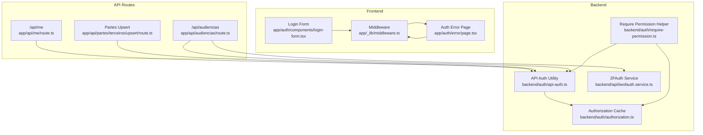
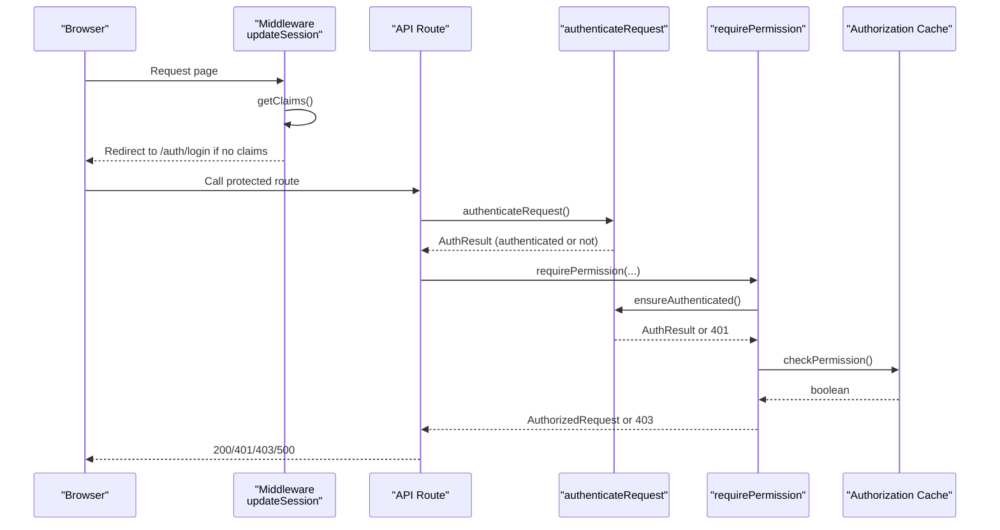
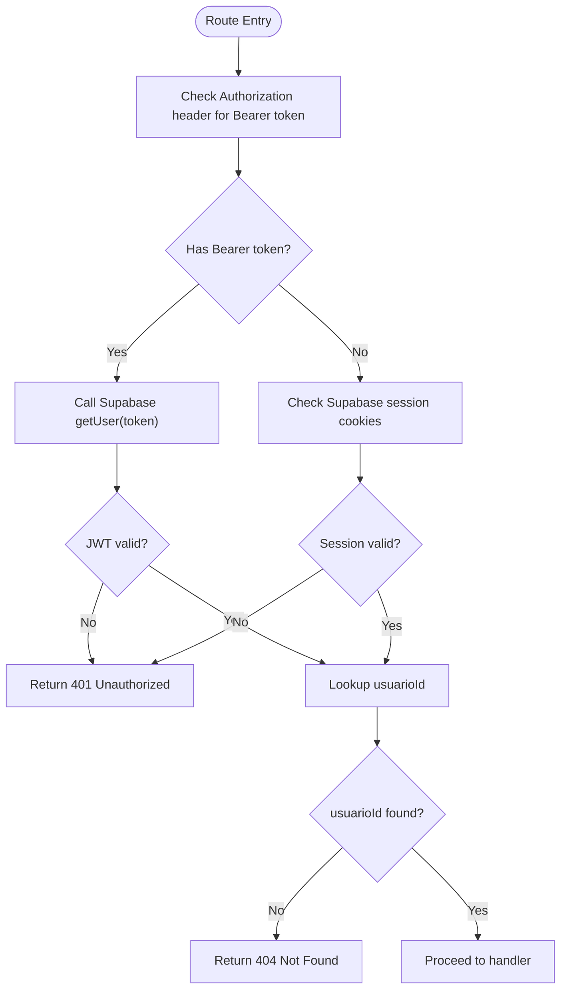
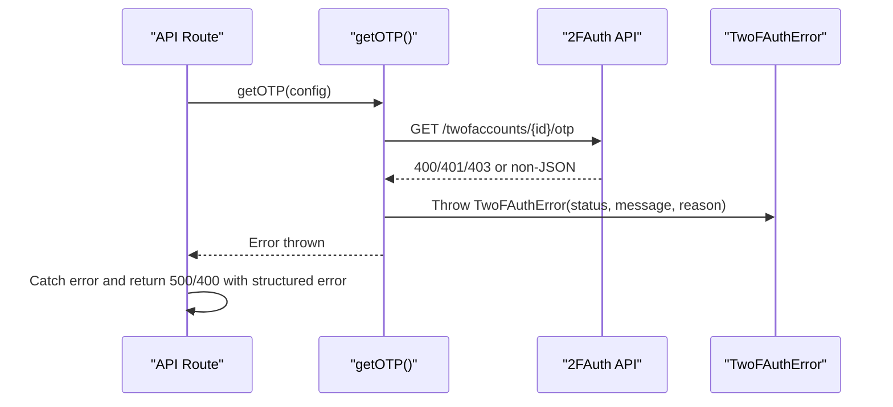
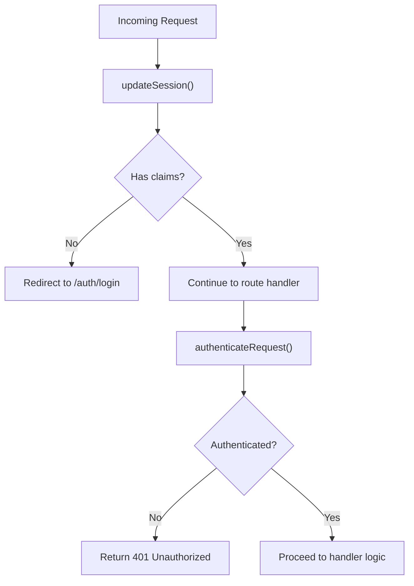
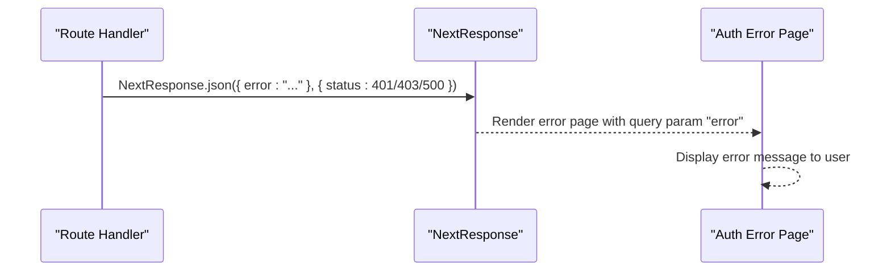
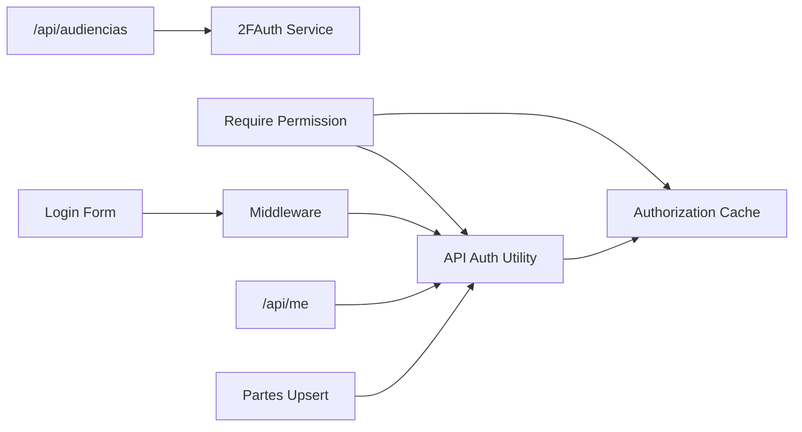

# Authentication Errors

<cite>
**Referenced Files in This Document**
- [app/auth/error/page.tsx](file://app/auth/error/page.tsx)
- [app/auth/components/login-form.tsx](file://app/auth/components/login-form.tsx)
- [app/_lib/middleware.ts](file://app/_lib/middleware.ts)
- [backend/auth/api-auth.ts](file://backend/auth/api-auth.ts)
- [backend/auth/authorization.ts](file://backend/auth/authorization.ts)
- [backend/auth/require-permission.ts](file://backend/auth/require-permission.ts)
- [backend/api/twofauth.service.ts](file://backend/api/twofauth.service.ts)
- [app/api/me/route.ts](file://app/api/me/route.ts)
- [app/api/partes/terceiros/upsert/route.ts](file://app/api/partes/terceiros/upsert/route.ts)
- [app/api/audiencias/route.ts](file://app/api/audiencias/route.ts)
- [app/ajuda/desenvolvimento/integracao-pje/page.tsx](file://app/ajuda/desenvolvimento/integracao-pje/page.tsx)
- [openspec/specs/auth/spec.md](file://openspec/specs/auth/spec.md)
</cite>

## Table of Contents
1. [Introduction](#introduction)
2. [Project Structure](#project-structure)
3. [Core Components](#core-components)
4. [Architecture Overview](#architecture-overview)
5. [Detailed Component Analysis](#detailed-component-analysis)
6. [Dependency Analysis](#dependency-analysis)
7. [Performance Considerations](#performance-considerations)
8. [Troubleshooting Guide](#troubleshooting-guide)
9. [Conclusion](#conclusion)

## Introduction
This document explains how authentication errors propagate through the Sinesys system from API routes to the user interface. It focuses on JWT validation failures, 2FAuth verification errors, and session expiration. It also documents centralized error handling in the authorization middleware, how error contexts are preserved across authentication boundaries, and provides examples from the auth error page component. Security considerations for error disclosure and troubleshooting guidance using server logs are included, along with best practices for secure error handling in authentication flows.

## Project Structure
Authentication spans three layers:
- Frontend pages and forms that initiate authentication and display user-facing errors
- Middleware that enforces session presence and redirects unauthenticated users
- Backend authentication utilities that validate JWTs, sessions, and permissions

**Diagram sources**
- [app/auth/components/login-form.tsx](file://app/auth/components/login-form.tsx#L1-L147)
- [app/auth/error/page.tsx](file://app/auth/error/page.tsx#L1-L27)
- [app/_lib/middleware.ts](file://app/_lib/middleware.ts#L1-L73)
- [backend/auth/api-auth.ts](file://backend/auth/api-auth.ts#L1-L139)
- [backend/auth/require-permission.ts](file://backend/auth/require-permission.ts#L1-L110)
- [backend/auth/authorization.ts](file://backend/auth/authorization.ts#L1-L201)
- [backend/api/twofauth.service.ts](file://backend/api/twofauth.service.ts#L1-L194)
- [app/api/me/route.ts](file://app/api/me/route.ts#L1-L87)
- [app/api/partes/terceiros/upsert/route.ts](file://app/api/partes/terceiros/upsert/route.ts#L81-L97)
- [app/api/audiencias/route.ts](file://app/api/audiencias/route.ts#L212-L231)

**Section sources**
- [app/auth/components/login-form.tsx](file://app/auth/components/login-form.tsx#L1-L147)
- [app/auth/error/page.tsx](file://app/auth/error/page.tsx#L1-L27)
- [app/_lib/middleware.ts](file://app/_lib/middleware.ts#L1-L73)
- [backend/auth/api-auth.ts](file://backend/auth/api-auth.ts#L1-L139)
- [backend/auth/require-permission.ts](file://backend/auth/require-permission.ts#L1-L110)
- [backend/auth/authorization.ts](file://backend/auth/authorization.ts#L1-L201)
- [backend/api/twofauth.service.ts](file://backend/api/twofauth.service.ts#L1-L194)
- [app/api/me/route.ts](file://app/api/me/route.ts#L1-L87)
- [app/api/partes/terceiros/upsert/route.ts](file://app/api/partes/terceiros/upsert/route.ts#L81-L97)
- [app/api/audiencias/route.ts](file://app/api/audiencias/route.ts#L212-L231)

## Core Components
- Login Form: Handles user credentials submission, catches Supabase Auth errors, and presents user-friendly messages. It also logs known internal Supabase Auth issues.
- Middleware: Ensures session claims exist; redirects unauthenticated users to the login page and preserves the intended destination.
- API Auth Utility: Validates Service API Key, Bearer Token (JWT), and Supabase session, returning structured authentication results.
- Require Permission Helper: Combines authentication and authorization checks, returning either an AuthorizedRequest or a 401/403 response.
- Authorization Cache: Centralized permission cache with TTL and statistics, used by require-permission and authorization utilities.
- 2FAuth Service: Fetches OTP from 2FAuth, normalizes errors into a typed TwoFAuthError with status, message, and reason.
- Auth Error Page: Presents a simple error message to users when an error occurs during authentication flows.

**Section sources**
- [app/auth/components/login-form.tsx](file://app/auth/components/login-form.tsx#L1-L147)
- [app/_lib/middleware.ts](file://app/_lib/middleware.ts#L1-L73)
- [backend/auth/api-auth.ts](file://backend/auth/api-auth.ts#L1-L139)
- [backend/auth/require-permission.ts](file://backend/auth/require-permission.ts#L1-L110)
- [backend/auth/authorization.ts](file://backend/auth/authorization.ts#L1-L201)
- [backend/api/twofauth.service.ts](file://backend/api/twofauth.service.ts#L1-L194)
- [app/auth/error/page.tsx](file://app/auth/error/page.tsx#L1-L27)

## Architecture Overview
The authentication pipeline enforces session presence at the edge and validates credentials and permissions downstream.

**Diagram sources**
- [app/_lib/middleware.ts](file://app/_lib/middleware.ts#L1-L73)
- [backend/auth/api-auth.ts](file://backend/auth/api-auth.ts#L1-L139)
- [backend/auth/require-permission.ts](file://backend/auth/require-permission.ts#L1-L110)
- [backend/auth/authorization.ts](file://backend/auth/authorization.ts#L1-L201)

## Detailed Component Analysis

### JWT Validation Failures and Session Expiration
- JWT validation failures are handled by the API Auth utility. When a Bearer token is present, the utility attempts to validate it against Supabase Auth. On error or missing user, it returns an unauthenticated result. API routes then return 401 Unauthorized.
- Session expiration is enforced by the middleware. If claims are missing and the user is not on an auth page, the middleware redirects to the login page. This prevents stale sessions from accessing protected resources.

**Diagram sources**
- [backend/auth/api-auth.ts](file://backend/auth/api-auth.ts#L51-L139)
- [app/api/me/route.ts](file://app/api/me/route.ts#L40-L87)

**Section sources**
- [backend/auth/api-auth.ts](file://backend/auth/api-auth.ts#L51-L139)
- [app/api/me/route.ts](file://app/api/me/route.ts#L40-L87)
- [app/_lib/middleware.ts](file://app/_lib/middleware.ts#L1-L73)

### 2FAuth Verification Errors
- The 2FAuth service centralizes OTP retrieval and error handling. It throws a typed TwoFAuthError with status, message, and reason. API routes consuming OTP should catch this error and return appropriate HTTP responses.

**Diagram sources**
- [backend/api/twofauth.service.ts](file://backend/api/twofauth.service.ts#L1-L194)

**Section sources**
- [backend/api/twofauth.service.ts](file://backend/api/twofauth.service.ts#L1-L194)

### Centralized Error Handling in Authorization Middleware
- The middleware enforces session presence and redirects unauthenticated users to the login page. It preserves the intended destination by leveraging Next.js redirect semantics.
- API routes consistently call authenticateRequest and return 401 Unauthorized when unauthenticated. Some routes also return 404 Not Found when the user exists in Supabase but not in the local usuarios table.

**Diagram sources**
- [app/_lib/middleware.ts](file://app/_lib/middleware.ts#L1-L73)
- [backend/auth/api-auth.ts](file://backend/auth/api-auth.ts#L51-L139)

**Section sources**
- [app/_lib/middleware.ts](file://app/_lib/middleware.ts#L1-L73)
- [backend/auth/api-auth.ts](file://backend/auth/api-auth.ts#L51-L139)

### Error Context Preservation Across Boundaries
- API routes preserve error context by returning structured JSON bodies with appropriate HTTP status codes. They avoid exposing sensitive details and rely on the client to present user-friendly messages.
- The auth error page receives a query parameter containing the error message and displays it in a simple card. This allows error messages to be propagated from backend handlers to the UI while maintaining minimal exposure.

**Diagram sources**
- [app/api/me/route.ts](file://app/api/me/route.ts#L40-L87)
- [app/auth/error/page.tsx](file://app/auth/error/page.tsx#L1-L27)

**Section sources**
- [app/api/me/route.ts](file://app/api/me/route.ts#L40-L87)
- [app/auth/error/page.tsx](file://app/auth/error/page.tsx#L1-L27)

### Specific Error Scenarios
- Invalid credentials: The login form detects known Supabase Auth error patterns and surfaces user-friendly messages. It also logs known internal issues for support triage.
- Expired tokens: API routes return 401 Unauthorized when JWT validation fails. The middleware redirects to the login page for cookie-based sessions.
- MFA setup failures: The 2FAuth service throws a typed error with status and reason. API routes should catch and return 400/500 with a structured error body.

**Section sources**
- [app/auth/components/login-form.tsx](file://app/auth/components/login-form.tsx#L1-L147)
- [backend/auth/api-auth.ts](file://backend/auth/api-auth.ts#L51-L139)
- [backend/api/twofauth.service.ts](file://backend/api/twofauth.service.ts#L1-L194)

### User-Facing Error Presentation
- The auth error page renders a simple card with an optional error message. It avoids exposing raw technical details and focuses on communicating that an error occurred.

**Section sources**
- [app/auth/error/page.tsx](file://app/auth/error/page.tsx#L1-L27)

## Dependency Analysis
Authentication depends on:
- Supabase Auth for JWT validation and session management
- Local usuarios table for mapping Supabase user IDs to internal IDs
- Permission cache for efficient authorization checks
- 2FAuth service for OTP retrieval

**Diagram sources**
- [app/auth/components/login-form.tsx](file://app/auth/components/login-form.tsx#L1-L147)
- [app/_lib/middleware.ts](file://app/_lib/middleware.ts#L1-L73)
- [backend/auth/api-auth.ts](file://backend/auth/api-auth.ts#L1-L139)
- [backend/auth/authorization.ts](file://backend/auth/authorization.ts#L1-L201)
- [backend/auth/require-permission.ts](file://backend/auth/require-permission.ts#L1-L110)
- [backend/api/twofauth.service.ts](file://backend/api/twofauth.service.ts#L1-L194)
- [app/api/me/route.ts](file://app/api/me/route.ts#L1-L87)
- [app/api/partes/terceiros/upsert/route.ts](file://app/api/partes/terceiros/upsert/route.ts#L81-L97)
- [app/api/audiencias/route.ts](file://app/api/audiencias/route.ts#L212-L231)

**Section sources**
- [backend/auth/api-auth.ts](file://backend/auth/api-auth.ts#L1-L139)
- [backend/auth/authorization.ts](file://backend/auth/authorization.ts#L1-L201)
- [backend/auth/require-permission.ts](file://backend/auth/require-permission.ts#L1-L110)
- [backend/api/twofauth.service.ts](file://backend/api/twofauth.service.ts#L1-L194)
- [app/api/me/route.ts](file://app/api/me/route.ts#L1-L87)
- [app/api/partes/terceiros/upsert/route.ts](file://app/api/partes/terceiros/upsert/route.ts#L81-L97)
- [app/api/audiencias/route.ts](file://app/api/audiencias/route.ts#L212-L231)

## Performance Considerations
- Permission cache: The authorization utility caches permission checks with TTL and periodic cleanup. This reduces repeated database queries and improves performance for repeated checks.
- Cache statistics: Utilities expose cache stats for debugging and monitoring cache effectiveness.

**Section sources**
- [backend/auth/authorization.ts](file://backend/auth/authorization.ts#L1-L201)

## Troubleshooting Guide
- Known Supabase Auth issues: The login form recognizes specific internal error messages and logs them for support. Users receive a friendly message suggesting contacting Supabase support.
- Session expiration: Middleware redirects unauthenticated users to the login page. If users remain idle, cookies may expire and they will be redirected automatically.
- 2FAuth failures: The 2FAuth service throws a typed error with status and reason. API routes should catch and return structured error responses. Review logs for status codes and reasons.
- API Unauthorized errors: API routes return 401 Unauthorized when authentication fails. Verify Authorization headers, Service API Key, or session cookies.
- Permission denied: The require-permission helper returns 403 Forbidden when the user lacks required permissions. Clear the permission cache for the affected user if stale permissions persist.

**Section sources**
- [app/auth/components/login-form.tsx](file://app/auth/components/login-form.tsx#L1-L147)
- [app/_lib/middleware.ts](file://app/_lib/middleware.ts#L1-L73)
- [backend/api/twofauth.service.ts](file://backend/api/twofauth.service.ts#L1-L194)
- [backend/auth/require-permission.ts](file://backend/auth/require-permission.ts#L1-L110)
- [backend/auth/authorization.ts](file://backend/auth/authorization.ts#L1-L201)

## Conclusion
Sinesys implements a layered authentication system with clear error propagation from API routes to the user interface. JWT validation and session enforcement occur centrally, while user-facing errors are presented via the auth error page. The 2FAuth service centralizes OTP retrieval and error handling. The authorization cache improves performance and reliability. Following the best practices outlined here ensures secure, user-friendly error handling across authentication flows.