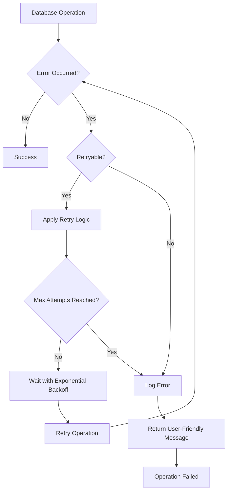
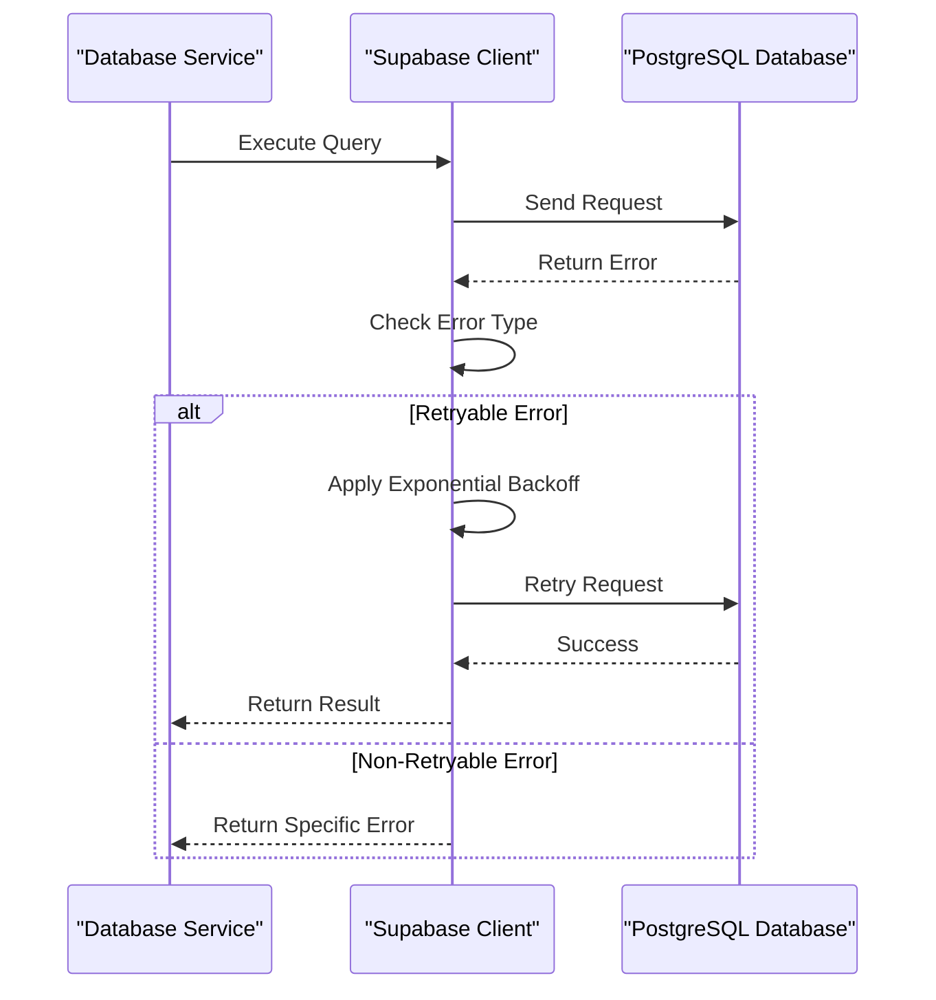
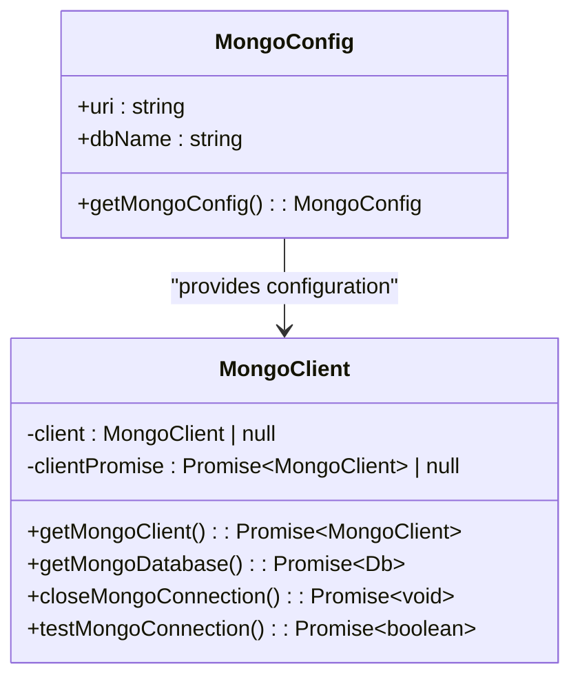
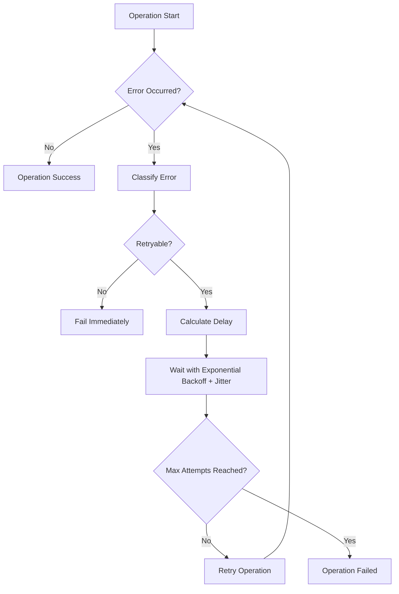
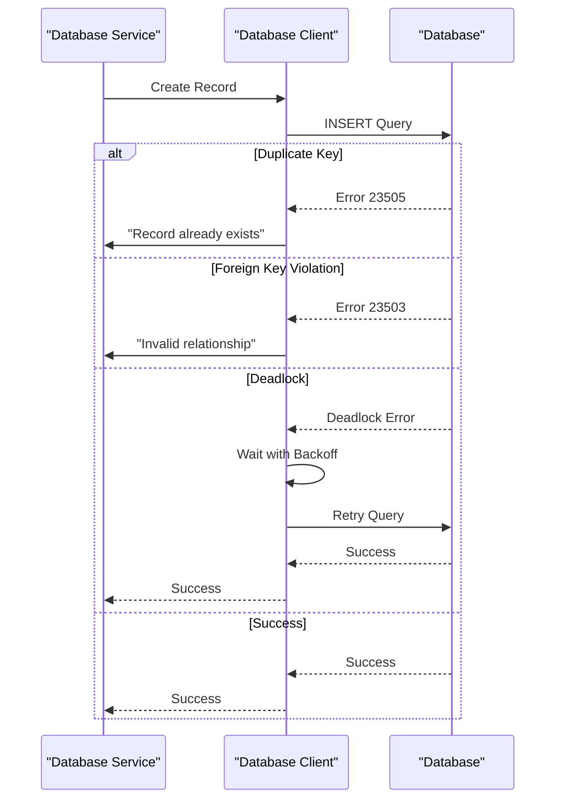
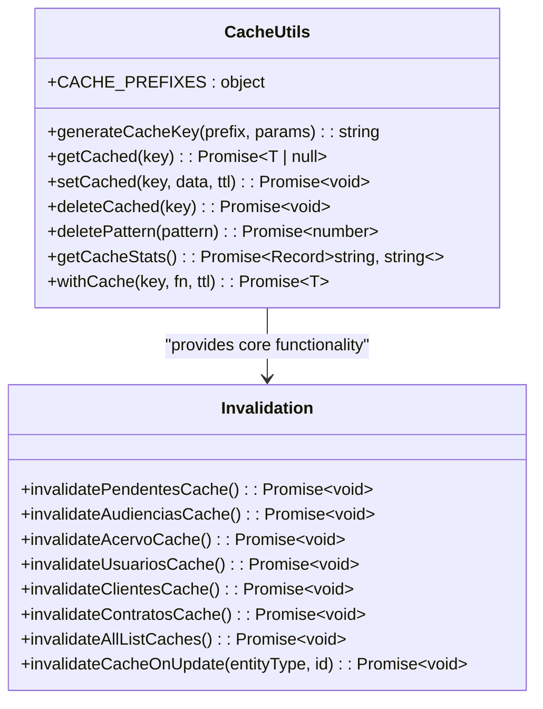

# Database Errors

<cite>
**Referenced Files in This Document**   
- [captura-log-persistence.service.ts](file://backend/captura/services/persistence/captura-log-persistence.service.ts)
- [index.ts](file://backend/utils/retry/index.ts)
- [client.ts](file://backend/utils/mongodb/client.ts)
- [client.ts](file://backend/utils/redis/client.ts)
- [invalidation.ts](file://backend/utils/redis/invalidation.ts)
- [cache-utils.ts](file://backend/utils/redis/cache-utils.ts)
- [service-client.ts](file://backend/utils/supabase/service-client.ts)
- [distributed-lock.ts](file://backend/utils/locks/distributed-lock.ts)
</cite>

## Table of Contents
1. [Introduction](#introduction)
2. [Database Error Handling Overview](#database-error-handling-overview)
3. [PostgreSQL (Supabase) Error Handling](#postgresql-supabase-error-handling)
4. [MongoDB Error Handling](#mongodb-error-handling)
5. [Retry Mechanisms and Circuit Breaker Patterns](#retry-mechanisms-and-circuit-breaker-patterns)
6. [Specific Error Scenarios](#specific-error-scenarios)
7. [Caching Strategy with Redis](#caching-strategy-with-redis)
8. [Best Practices for Database Error Handling](#best-practices-for-database-error-handling)
9. [Conclusion](#conclusion)

## Introduction

Sinesys implements a comprehensive database error handling strategy across its dual-database architecture, utilizing both PostgreSQL (via Supabase) and MongoDB. This documentation details the error handling mechanisms, retry strategies, and caching approaches used throughout the system. The architecture is designed to handle various database errors including connection failures, constraint violations, transaction rollbacks, and deadlocks, while maintaining system reliability and data consistency.

The system employs a multi-layered approach to database error management, combining retry mechanisms, circuit breaker patterns, distributed locking, and Redis-based caching. These components work together to ensure robust database operations even under adverse conditions. The error handling strategy is particularly important for critical operations such as data capture, user management, and financial transactions.

**Section sources**
- [captura-log-persistence.service.ts](file://backend/captura/services/persistence/captura-log-persistence.service.ts)
- [index.ts](file://backend/utils/retry/index.ts)

## Database Error Handling Overview

Sinesys employs a comprehensive database error handling strategy that spans both PostgreSQL (Supabase) and MongoDB systems. The architecture is designed to handle various error scenarios including connection failures, constraint violations, transaction rollbacks, and deadlocks. The system implements retry mechanisms with exponential backoff and circuit breaker patterns to ensure reliability and prevent cascading failures.

The error handling approach is implemented at multiple levels: database client level, service level, and application level. At the database client level, both Supabase and MongoDB clients have built-in error handling capabilities. At the service level, custom retry logic and distributed locking mechanisms prevent concurrent access issues. At the application level, structured error logging and user-friendly error messages provide visibility into system operations.

The system distinguishes between retryable and non-retryable errors, applying different strategies based on error type. Retryable errors include network timeouts, connection issues, and temporary database errors, while non-retryable errors include data validation failures and permanent constraint violations. This distinction allows the system to automatically recover from transient issues while failing fast on permanent errors.

**Diagram sources**
- [index.ts](file://backend/utils/retry/index.ts)
- [captura-log-persistence.service.ts](file://backend/captura/services/persistence/captura-log-persistence.service.ts)

**Section sources**
- [index.ts](file://backend/utils/retry/index.ts)
- [captura-log-persistence.service.ts](file://backend/captura/services/persistence/captura-log-persistence.service.ts)

## PostgreSQL (Supabase) Error Handling

Sinesys uses Supabase as its primary PostgreSQL database, implementing robust error handling for various database operations. The system handles connection failures, constraint violations, and transaction rollbacks through a combination of client-side error handling and server-side validation.

For connection failures, the system implements automatic reconnection logic with exponential backoff. When a connection error occurs, the system waits for a progressively longer period before attempting to reconnect, preventing overwhelming the database server during outages. The retry logic is configurable with parameters for maximum attempts, base delay, and maximum delay.

Constraint violations are handled through specific error code mapping. The system identifies common PostgreSQL error codes such as '23505' for unique constraint violations and '23503' for foreign key constraint violations, translating them into user-friendly error messages. For example, when attempting to insert a duplicate record, the system catches the '23505' error code and returns a message indicating that the record already exists.

Transaction management is implemented through distributed locking mechanisms. The system uses a dedicated 'locks' table to prevent concurrent modifications to the same data. When a service needs to perform a critical operation, it first attempts to acquire a lock with a specified time-to-live (TTL). If the lock is already held, the operation can either wait or fail immediately based on configuration.

**Diagram sources**
- [service-client.ts](file://backend/utils/supabase/service-client.ts)
- [distributed-lock.ts](file://backend/utils/locks/distributed-lock.ts)

**Section sources**
- [service-client.ts](file://backend/utils/supabase/service-client.ts)
- [distributed-lock.ts](file://backend/utils/locks/distributed-lock.ts)

## MongoDB Error Handling

Sinesys implements MongoDB error handling through a singleton client pattern with connection pooling and health monitoring. The MongoDB client is designed to handle connection failures, read/write errors, and cluster failover scenarios.

The system uses a connection pool with configurable size limits (maxPoolSize: 10, minPoolSize: 2) and connection lifetime settings (maxIdleTimeMS: 60000). This configuration helps prevent connection exhaustion and ensures efficient resource utilization. When a connection error occurs, the client automatically attempts to reconnect using the underlying MongoDB driver's retry logic.

Connection health is monitored through periodic ping operations. The `testMongoConnection()` function executes a ping command against the database and returns a boolean indicating connectivity status. This function is used in health checks and can be called before critical operations to verify database availability.

Error handling for MongoDB operations follows a similar pattern to PostgreSQL, with distinction between retryable and non-retryable errors. Retryable errors include network timeouts, connection interruptions, and temporary server errors, while non-retryable errors include document validation failures and permanent write errors.

The system also implements proper resource cleanup through the `closeMongoConnection()` function, which gracefully closes the MongoDB client and releases associated resources. This is particularly important in serverless environments where connections need to be properly managed across function invocations.

**Diagram sources**
- [client.ts](file://backend/utils/mongodb/client.ts)

**Section sources**
- [client.ts](file://backend/utils/mongodb/client.ts)

## Retry Mechanisms and Circuit Breaker Patterns

Sinesys implements sophisticated retry mechanisms and circuit breaker patterns to enhance system resilience and prevent cascading failures. The retry system is designed to handle transient errors while avoiding overwhelming downstream services during outages.

The core retry mechanism is implemented in the `withRetry` function, which provides exponential backoff with jitter to prevent the "thundering herd" problem. The function accepts configurable parameters including maximum attempts (default: 3), base delay (default: 100ms), and maximum delay (default: 5000ms). The exponential backoff algorithm calculates delay as `baseDelay * 2^(attempt-1)` with random jitter of 0-30% to distribute retry attempts.

Retryable errors are determined by the `isDefaultRetryableError` function, which identifies transient issues including network errors (timeout, ECONNREFUSED, ENOTFOUND), PostgreSQL temporary errors (deadlock, lock timeout, connection issues), and HTTP 5xx server errors. This classification ensures that only transient issues are retried, while permanent errors fail fast.

The system also implements distributed locking as a circuit breaker pattern to prevent concurrent access to critical resources. The `DistributedLock` class uses a dedicated 'locks' table in PostgreSQL to coordinate access across service instances. Each lock has a time-to-live (TTL) to prevent indefinite blocking if a service fails to release the lock.

**Diagram sources**
- [index.ts](file://backend/utils/retry/index.ts)
- [distributed-lock.ts](file://backend/utils/locks/distributed-lock.ts)

**Section sources**
- [index.ts](file://backend/utils/retry/index.ts)
- [distributed-lock.ts](file://backend/utils/locks/distributed-lock.ts)

## Specific Error Scenarios

Sinesys handles several specific database error scenarios with targeted approaches, including duplicate key violations, foreign key constraints, and deadlocks. Each scenario is addressed with appropriate error detection, handling, and user communication strategies.

For duplicate key violations, the system catches PostgreSQL error code '23505' and translates it into user-friendly messages. In the `DistributedLock` implementation, this error code is specifically handled when attempting to acquire a lock, allowing the system to detect when a lock is already held by another process. The system then either waits according to the configured timeout or fails immediately based on the operation's requirements.

Foreign key constraint violations (error code '23503') are handled by validating relationships before attempting database operations when possible. When a foreign key violation occurs, the system provides specific error messages indicating which relationship is invalid, helping users correct the underlying data issue. This is particularly important in operations involving related entities such as linking documents to folders or associating users with permissions.

Deadlock scenarios are handled through a combination of retry mechanisms and application-level coordination. The system detects deadlock errors by checking for 'deadlock' in the error message and automatically retries the operation with exponential backoff. For operations prone to deadlocks, the system implements consistent locking order across services to minimize the likelihood of circular dependencies.

The `captura-log-persistence.service.ts` file demonstrates specific error handling for database operations, including handling the 'PGRST116' error code which indicates that a record was not found. This allows the system to distinguish between genuine data absence and other database errors, providing appropriate responses for each scenario.

**Diagram sources**
- [captura-log-persistence.service.ts](file://backend/captura/services/persistence/captura-log-persistence.service.ts)
- [distributed-lock.ts](file://backend/utils/locks/distributed-lock.ts)

**Section sources**
- [captura-log-persistence.service.ts](file://backend/captura/services/persistence/captura-log-persistence.service.ts)
- [distributed-lock.ts](file://backend/utils/locks/distributed-lock.ts)

## Caching Strategy with Redis

Sinesys implements a comprehensive caching strategy using Redis to improve performance and reduce database load. The caching system handles cache invalidation errors and ensures data consistency across distributed services.

The Redis client is configured with connection resilience features including automatic reconnection, retry strategy, and event handling. The retry strategy implements exponential backoff with a maximum of three attempts, with delays increasing from 100ms to 2000ms. Connection events are logged to monitor client state changes, including connect, ready, and close events.

Cache invalidation is implemented through a structured approach using predefined cache prefixes for different entity types. The system provides specific invalidation functions for each entity type, such as `invalidatePendentesCache()`, `invalidateAudienciasCache()`, and `invalidateAcervoCache()`. These functions use pattern-based deletion to remove all cache entries related to a specific entity type.

For entity-specific updates, the `invalidateCacheOnUpdate` function handles both type-level and ID-specific cache invalidation. When an entity is updated, the system invalidates both the general list cache and specific ID-based caches. For entities like users and clients, the system also invalidates caches based on secondary identifiers like CPF and email to ensure consistency.

The caching system includes error handling for cache operations, with try-catch blocks around all Redis operations. If a cache operation fails, the system logs a warning but continues execution, ensuring that cache errors do not impact core functionality. This fail-safe approach maintains system availability even when the cache is temporarily unavailable.

**Diagram sources**
- [client.ts](file://backend/utils/redis/client.ts)
- [cache-utils.ts](file://backend/utils/redis/cache-utils.ts)
- [invalidation.ts](file://backend/utils/redis/invalidation.ts)

**Section sources**
- [client.ts](file://backend/utils/redis/client.ts)
- [cache-utils.ts](file://backend/utils/redis/cache-utils.ts)
- [invalidation.ts](file://backend/utils/redis/invalidation.ts)

## Best Practices for Database Error Handling

Sinesys follows several best practices for database error handling that ensure system reliability, maintainability, and user experience. These practices include proper error code mapping, user-friendly error messages, structured logging, and comprehensive monitoring.

Error code mapping is implemented to translate database-specific error codes into application-level error types. This abstraction layer allows services to handle errors consistently regardless of the underlying database technology. For example, both PostgreSQL '23505' (unique constraint) and MongoDB duplicate key errors are mapped to a common "DuplicateRecordError" type.

User-friendly error messages are generated by translating technical database errors into clear, actionable messages for end users. The system avoids exposing raw database error messages, which may contain sensitive information or be confusing to non-technical users. Instead, it provides context-specific messages that guide users on how to resolve issues.

Structured logging is implemented throughout the database layer, with consistent log formats that include error codes, operation context, and relevant metadata. This facilitates troubleshooting and monitoring by providing comprehensive information about error occurrences. The logging system includes both error-level logs for failures and warning-level logs for retry attempts.

The system implements comprehensive monitoring of database operations, including metrics for error rates, retry counts, and operation latency. This monitoring enables proactive detection of issues and performance optimization. Health checks verify database connectivity and can be used in deployment pipelines and monitoring systems.

Resource management best practices are followed, including proper cleanup of database connections and cache clients. The system implements graceful shutdown procedures that ensure all pending operations are completed and resources are properly released, preventing resource leaks in serverless environments.

## Conclusion

Sinesys implements a robust and comprehensive database error handling strategy that effectively manages errors across both PostgreSQL (Supabase) and MongoDB systems. The architecture combines retry mechanisms, circuit breaker patterns, distributed locking, and Redis-based caching to ensure system reliability and data consistency.

The system's approach to error handling distinguishes between retryable and non-retryable errors, applying appropriate strategies for each type. Transient errors such as network timeouts and temporary database issues are handled with exponential backoff and jitter, while permanent errors fail fast with clear user feedback.

The implementation of distributed locking using a dedicated 'locks' table prevents concurrent access issues and ensures data integrity during critical operations. The caching strategy with Redis improves performance while maintaining data consistency through structured invalidation patterns.

These error handling mechanisms work together to create a resilient system that can recover from transient issues, prevent cascading failures, and provide a reliable user experience. The comprehensive logging and monitoring capabilities enable effective troubleshooting and continuous improvement of the database layer.