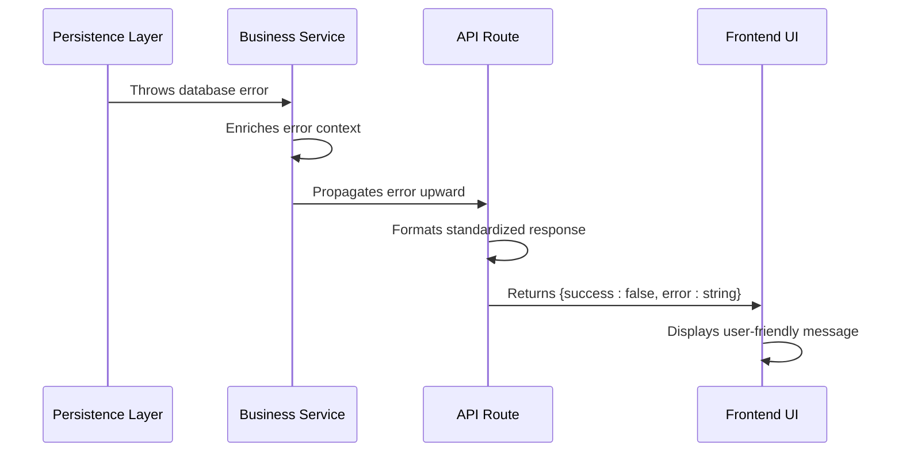
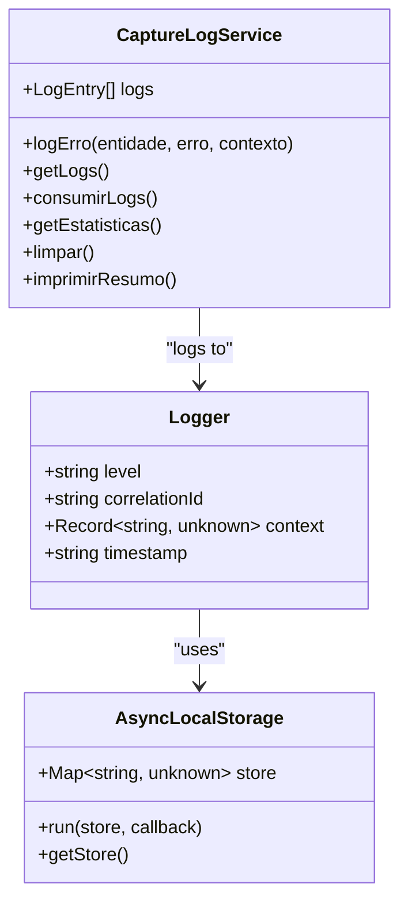
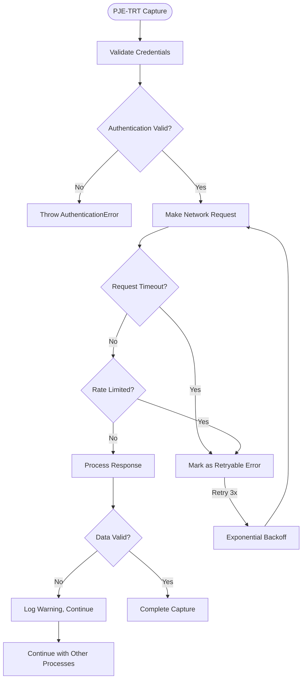
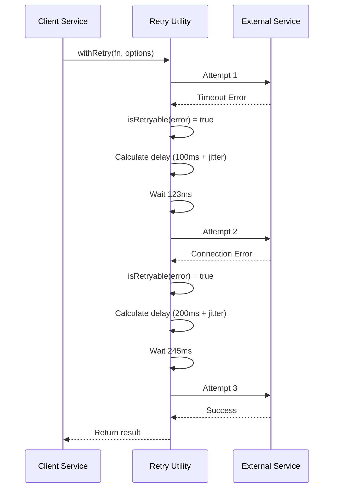
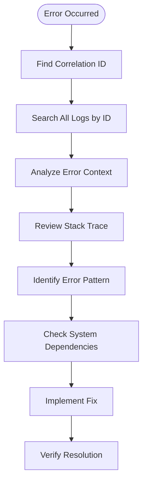

# Error Handling Flows

<cite>
**Referenced Files in This Document**   
- [capture-log.service.ts](file://backend/captura/services/persistence/capture-log.service.ts)
- [captura-log-persistence.service.ts](file://backend/captura/services/persistence/captura-log-persistence.service.ts)
- [captura-log.service.ts](file://backend/captura/services/captura-log.service.ts)
- [logger/index.ts](file://backend/utils/logger/index.ts)
- [retry/index.ts](file://backend/utils/retry/index.ts)
- [error/page.tsx](file://app/auth/error/page.tsx)
- [login-form.tsx](file://app/auth/components/login-form.tsx)
- [parts/errors.ts](file://backend/captura/services/partes/errors.ts)
- [api.ts](file://lib/api.ts)
- [require-permission.ts](file://backend/auth/require-permission.ts)
- [captura-raw-log.service.ts](file://backend/captura/services/persistence/captura-raw-log.service.ts)
- [middleware.ts](file://lib/middleware.ts)
</cite>

## Table of Contents
1. [Introduction](#introduction)
2. [Error Propagation Architecture](#error-propagation-architecture)
3. [Centralized Logging System](#centralized-logging-system)
4. [Specific Error Handling Scenarios](#specific-error-handling-scenarios)
5. [Retry Mechanisms for Transient Failures](#retry-mechanisms-for-transient-failures)
6. [User Error Notification](#user-error-notification)
7. [Best Practices for Error Handling](#best-practices-for-error-handling)
8. [Error Log Interpretation](#error-log-interpretation)

## Introduction

The Sinesys application implements a comprehensive error handling system that spans from the persistence layer through business services to API routes and the user interface. This documentation details the flow of errors throughout the system, the centralized logging mechanism, and specific handling patterns for various error scenarios. The system is designed to maintain data integrity, provide meaningful feedback to users, and enable effective troubleshooting through detailed error logs.

The error handling architecture follows a layered approach where errors are captured at their source, enriched with context, propagated through service boundaries, and ultimately presented to users in a user-friendly manner. Central to this system is the logger utility that maintains error context across asynchronous operations and distributed components.

**Section sources**
- [capture-log.service.ts](file://backend/captura/services/persistence/capture-log.service.ts#L1-L195)
- [logger/index.ts](file://backend/utils/logger/index.ts#L1-L57)

## Error Propagation Architecture

The error propagation system in Sinesys follows a well-defined path from the persistence layer through business services to API routes and finally to the user interface. When an error occurs in the persistence layer, it is first captured and enriched with context before being propagated upward through the service layers.

In the persistence layer, errors are handled by specialized service modules such as `captura-log-persistence.service.ts` which manages operations on the `capturas_log` table. When a database operation fails, the service throws descriptive errors that include both the technical details and contextual information. For example, when updating a capture log entry, the service validates the input parameters and handles specific error cases:

```typescript
if (error.code === 'PGRST116') {
  throw new Error('Capture log record not found');
}
throw new Error(`Error updating capture log record: ${error.message}`);
```

These errors are then propagated to the business service layer, where they may be transformed into more specific error types or wrapped with additional context. The business services act as intermediaries that can implement retry logic, fallback mechanisms, or alternative processing paths based on the error type.

API routes serve as the boundary between the backend services and the frontend application. They implement consistent error response formatting, ensuring that all errors returned to the client follow the standardized `{ success: false, error: string }` format with appropriate HTTP status codes. Authentication and authorization errors are handled by middleware components like `require-permission.ts` which return 401 Unauthorized responses when users lack proper credentials.

The frontend application consumes these API responses and maps them to user-friendly error messages displayed through the error page component.



**Diagram sources **
- [captura-log-persistence.service.ts](file://backend/captura/services/persistence/captura-log-persistence.service.ts#L44-L92)
- [require-permission.ts](file://backend/auth/require-permission.ts#L24-L43)
- [api.ts](file://lib/api.ts#L75-L82)

**Section sources**
- [captura-log-persistence.service.ts](file://backend/captura/services/persistence/captura-log-persistence.service.ts#L1-L199)
- [require-permission.ts](file://backend/auth/require-permission.ts#L1-L43)
- [api.ts](file://lib/api.ts#L65-L82)

## Centralized Logging System

The centralized logging system in Sinesys is built around the Pino logger with AsyncLocalStorage for correlation ID management. This system ensures that error contexts are preserved across service boundaries and asynchronous operations, enabling comprehensive tracing of error flows throughout the application.

The logger utility, implemented in `backend/utils/logger/index.ts`, provides a structured logging approach that includes correlation IDs, service context, and timestamp information. The correlation ID is stored in AsyncLocalStorage, allowing it to be automatically included in all log entries within the same request context, even across asynchronous operations.



**Diagram sources **
- [logger/index.ts](file://backend/utils/logger/index.ts#L1-L57)
- [capture-log.service.ts](file://backend/captura/services/persistence/capture-log.service.ts#L117-L195)

The `CaptureLogService` provides a specialized logging mechanism for capture operations, maintaining an in-memory buffer of log entries that can be consumed and persisted. This service tracks different types of events including successful operations, updates, and errors, providing detailed statistics about the capture process.

```typescript
logErro(
  entidade: TipoEntidade,
  erro: string,
  contexto?: Record<string, unknown>
): void {
  this.logs.push({
    tipo: 'erro',
    entidade,
    erro,
    contexto,
  });
}
```

When errors occur during data capture, they are logged with rich context including the entity type, error message, and additional contextual data. This information is preserved throughout the error handling flow and can be retrieved for troubleshooting purposes.

The system also implements a secondary logging mechanism through the `captura-raw-log.service.ts` which persists raw capture data and metadata to MongoDB. This provides a comprehensive audit trail of capture operations, including successful and failed attempts, with full request and response payloads.

**Section sources**
- [logger/index.ts](file://backend/utils/logger/index.ts#L1-L57)
- [capture-log.service.ts](file://backend/captura/services/persistence/capture-log.service.ts#L117-L195)
- [captura-raw-log.service.ts](file://backend/captura/services/persistence/captura-raw-log.service.ts#L58-L115)

## Specific Error Handling Scenarios

Sinesys implements specialized error handling for several critical scenarios including failed PJE-TRT data capture, authentication failures, and database connection issues. Each scenario follows a consistent pattern of error detection, context preservation, and appropriate response.

### Failed PJE-TRT Data Capture

When capturing data from PJE-TRT systems, the application handles various error conditions through the `parts/errors.ts` module which defines custom error classes for different failure modes. The system distinguishes between recoverable errors that can be retried and fatal errors that require immediate termination.



**Diagram sources **
- [parts/errors.ts](file://backend/captura/services/partes/errors.ts#L59-L109)
- [retry/index.ts](file://backend/utils/retry/index.ts#L63-L114)

The system implements three categories of error handling:
1. **Recoverable errors** (retry): Network timeouts, rate limiting, temporary unavailability
2. **Fatal errors** (abort): Authentication failures, invalid credentials, database unavailability
3. **Partial errors** (log and continue): Invalid data in individual records, missing optional fields

### Authentication Failures

Authentication errors are handled at multiple levels in the application. The frontend login form (`login-form.tsx`) implements specific error message mapping for different types of authentication failures, providing users with actionable feedback.

```typescript
} else if (
  error.message.includes('500') || 
  error.message.includes('Database error querying schema') ||
  error.message.includes('Database error')
) {
  setError(
    'Authentication server error. ' +
    'This is a known issue related to the database schema. ' +
    'Please contact Supabase support or try again later.'
  )
}
```

The backend authentication system uses middleware to validate authentication tokens and permissions, returning standardized error responses that the frontend can interpret consistently.

### Database Connection Issues

Database connection errors are handled through the Supabase client integration and custom error handling in persistence services. When a database operation fails, the system distinguishes between different types of database errors:

- **PGRST116**: Record not found (404 equivalent)
- **Connection errors**: Network issues, timeout, or server unavailability
- **Constraint violations**: Unique constraint, foreign key violations

The system implements appropriate retry logic for transient database errors while immediately failing on permanent errors.

**Section sources**
- [parts/errors.ts](file://backend/captura/services/partes/errors.ts#L1-L139)
- [login-form.tsx](file://app/auth/components/login-form.tsx#L63-L87)
- [captura-log-persistence.service.ts](file://backend/captura/services/persistence/captura-log-persistence.service.ts#L80-L85)

## Retry Mechanisms for Transient Failures

The retry mechanism in Sinesys is implemented through the `utils/retry/index.ts` module, which provides a robust system for handling transient failures with exponential backoff and jitter. This system is critical for maintaining reliability when interacting with external services like PJE-TRT that may experience temporary unavailability.

The retry utility accepts configuration options including maximum attempts, base delay, maximum delay, and a function to determine if an error is retryable. By default, the system will retry up to 3 times with exponential backoff, applying jitter to prevent thundering herd problems.



**Diagram sources **
- [retry/index.ts](file://backend/utils/retry/index.ts#L63-L114)

The retry logic identifies retryable errors based on error messages and types, including:
- Network timeouts and connection issues
- Database deadlocks and lock timeouts
- HTTP 5xx server errors
- Rate limiting responses

When a retryable error occurs, the system logs a warning with details about the attempt and calculated delay, then waits before retrying. If all attempts fail, the original error is thrown with comprehensive context for debugging.

The system also provides a `createRetryable` wrapper function that allows services to create retryable versions of functions with pre-configured options, promoting consistent retry behavior across the application.

**Section sources**
- [retry/index.ts](file://backend/utils/retry/index.ts#L1-L134)

## User Error Notification

User error notification in Sinesys is implemented through a dedicated error page component and contextual error messages in the user interface. The system ensures that users receive meaningful feedback about errors while protecting sensitive technical details.

The error page component (`error/page.tsx`) serves as a centralized location for displaying error information. It accepts error parameters through URL search parameters and displays them in a user-friendly format:

```typescript
export default async function Page({ searchParams }: { searchParams: Promise<{ error: string }> }) {
  const params = await searchParams

  return (
    <div className="flex min-h-svh w-full items-center justify-center p-6 md:p-10">
      <div className="w-full max-w-sm">
        <div className="flex flex-col gap-6">
          <Card>
            <CardHeader>
              <CardTitle className="text-2xl">Sorry, something went wrong.</CardTitle>
            </CardHeader>
            <CardContent>
              {params?.error ? (
                <p className="text-sm text-muted-foreground">Error: {params.error}</p>
              ) : (
                <p className="text-sm text-muted-foreground">An unspecified error occurred.</p>
              )}
            </CardContent>
          </Card>
        </div>
      </div>
    </div>
  )
}
```

The frontend API client (`lib/api.ts`) standardizes error handling by wrapping API responses in a consistent format:

```typescript
return {
  success: false,
  error: error instanceof Error ? error.message : 'Unknown error occurred',
};
```

This ensures that all API errors are handled uniformly, regardless of the specific endpoint or error type. The error messages are then mapped to user-friendly text in the relevant UI components.

For authentication errors, the login form provides specific guidance based on the error type, helping users understand whether the issue is temporary (server error) or requires action (invalid credentials).

The system also implements browser notifications for certain error types through the `use-notifications.tsx` hook, which can display error messages as desktop notifications when appropriate.

**Section sources**
- [error/page.tsx](file://app/auth/error/page.tsx#L1-L26)
- [api.ts](file://lib/api.ts#L75-L82)
- [login-form.tsx](file://app/auth/components/login-form.tsx#L63-L87)
- [use-notifications.tsx](file://hooks/use-notifications.tsx#L269-L272)

## Best Practices for Error Handling

The Sinesys application follows several best practices for error handling in new code development. These practices ensure consistency, maintainability, and effective troubleshooting across the codebase.

### Custom Error Classes

The system uses custom error classes that extend a base `CapturaPartesError` class, providing structured error information with error codes, messages, and context. This approach enables precise error handling and filtering:

```typescript
export class CapturaPartesError extends Error {
  constructor(
    public readonly code: string,
    message: string,
    public readonly context?: Record<string, unknown>
  ) {
    super(message);
    this.name = 'CapturaPartesError';
    Error.captureStackTrace(this, this.constructor);
  }
  
  toJSON() {
    return {
      name: this.name,
      code: this.code,
      message: this.message,
      context: this.context,
      stack: this.stack,
    };
  }
}
```

### Consistent Error Response Format

All API endpoints follow a standardized error response format:
- HTTP status codes that reflect the error type (400, 401, 404, 500)
- JSON response body with `{ success: false, error: string }` structure
- User-friendly error messages that don't expose sensitive technical details

### Context Preservation

Errors maintain context throughout their propagation:
- Correlation IDs are preserved across asynchronous operations
- Error context objects include relevant entity IDs and operation details
- Stack traces are captured for debugging purposes

### Selective Error Logging

The system implements appropriate logging levels:
- Errors are logged at the 'error' level with full context
- Warnings are logged for non-critical issues that don't interrupt flow
- Debug information is logged selectively to avoid log flooding

### Graceful Degradation

For partial failures, the system follows a "best effort" approach:
- Continue processing other items when one fails
- Log individual failures while completing successful operations
- Provide summary statistics of success and failure rates

**Section sources**
- [parts/errors.ts](file://backend/captura/services/partes/errors.ts#L9-L139)
- [api.ts](file://lib/api.ts#L75-L82)
- [logger/index.ts](file://backend/utils/logger/index.ts#L34-L42)

## Error Log Interpretation

Interpreting error logs in Sinesys requires understanding the structured format and context preservation mechanisms. The logging system provides comprehensive information for troubleshooting various error scenarios.

### Log Structure

Each log entry includes:
- **Timestamp**: ISO format timestamp of the event
- **Correlation ID**: Unique identifier for tracing requests across services
- **Service context**: Name of the service or component generating the log
- **Error level**: debug, info, warn, or error
- **Error message**: Human-readable description of the issue
- **Context object**: Structured data with relevant entity IDs and operation details
- **Stack trace**: Call stack for debugging (in error logs)

### Common Error Patterns

#### Database Connection Issues
Look for errors containing:
- "timeout" or "connection refused"
- "deadlock" or "lock timeout"
- "too many connections"
- "PGRST116" (record not found)

#### Authentication Failures
Identify by:
- "401" or "unauthorized" in messages
- "invalid credentials" or "session expired"
- Supabase authentication errors

#### PJE-TRT Integration Issues
Recognize by:
- "rate limit" or "too many requests"
- "timeout" or "network error"
- "500" server errors from PJE endpoints

### Troubleshooting Workflow

1. **Identify the correlation ID** from the initial error message
2. **Search all logs** using the correlation ID to trace the complete request flow
3. **Examine the error context** for entity IDs and operation details
4. **Review the stack trace** to identify the source of the error
5. **Check for patterns** across multiple similar errors
6. **Verify system dependencies** (database, external services)

The system also provides diagnostic tools like the `CaptureLogService` statistics that show success and failure rates for capture operations, helping identify systemic issues.



**Diagram sources **
- [logger/index.ts](file://backend/utils/logger/index.ts#L34-L42)
- [capture-log.service.ts](file://backend/captura/services/persistence/capture-log.service.ts#L149-L164)

**Section sources**
- [logger/index.ts](file://backend/utils/logger/index.ts#L1-L57)
- [capture-log.service.ts](file://backend/captura/services/persistence/capture-log.service.ts#L149-L164)
- [captura-raw-log.service.ts](file://backend/captura/services/persistence/captura-raw-log.service.ts#L139-L162)