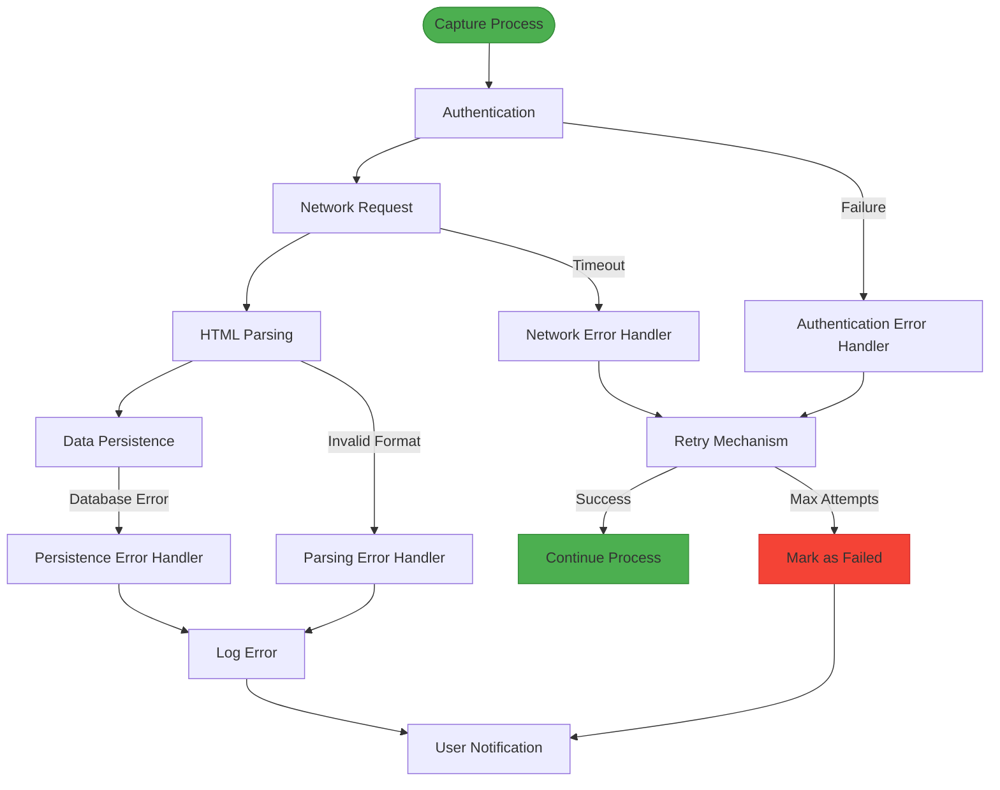
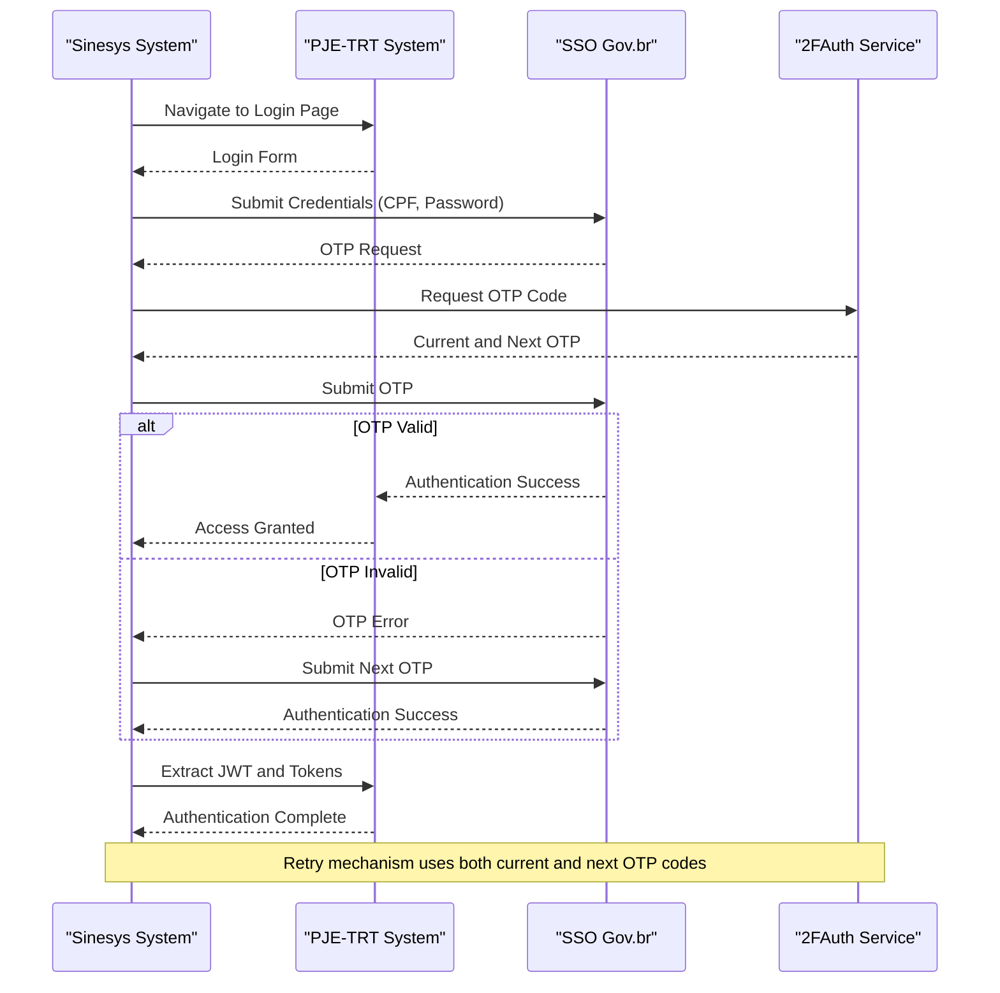
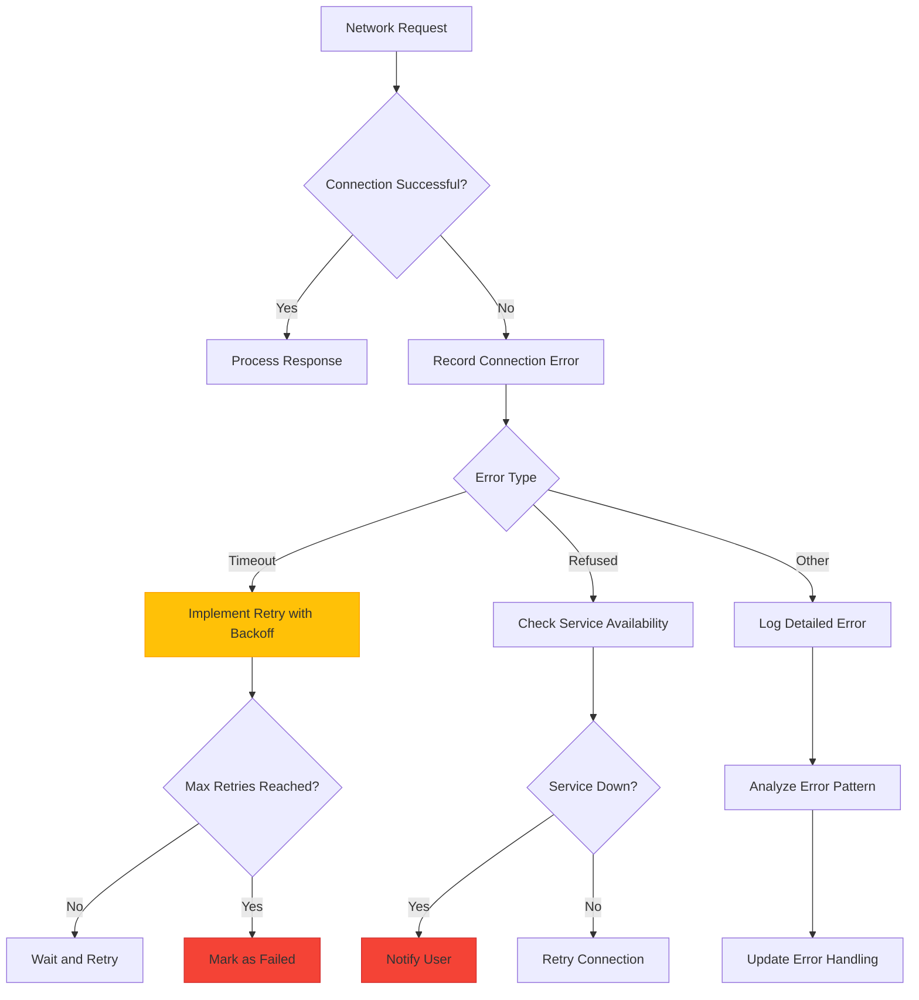
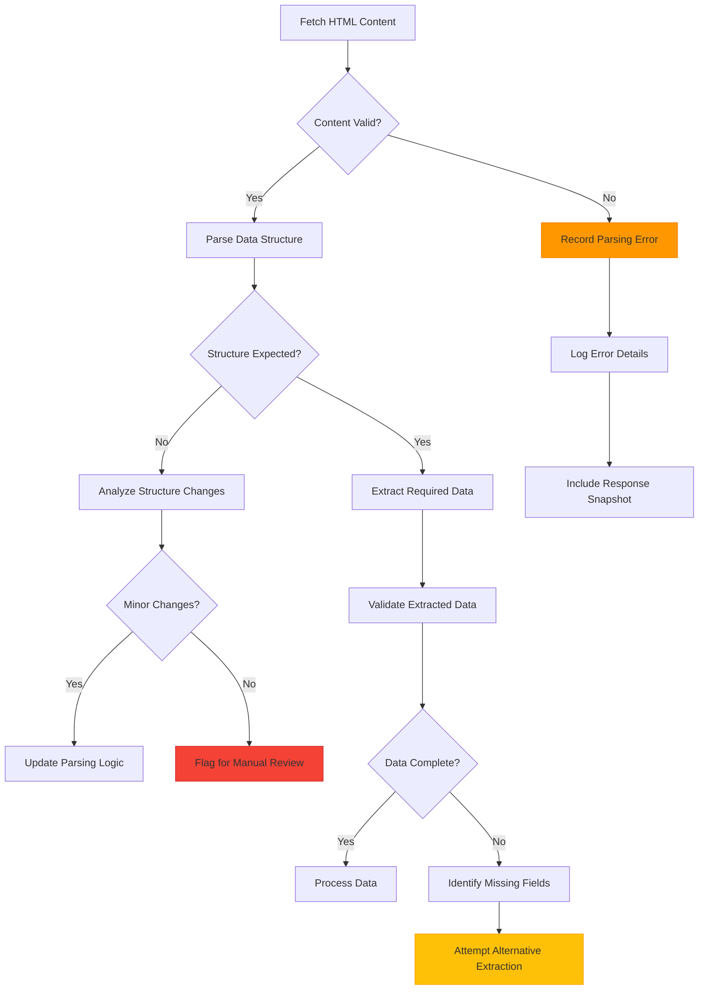
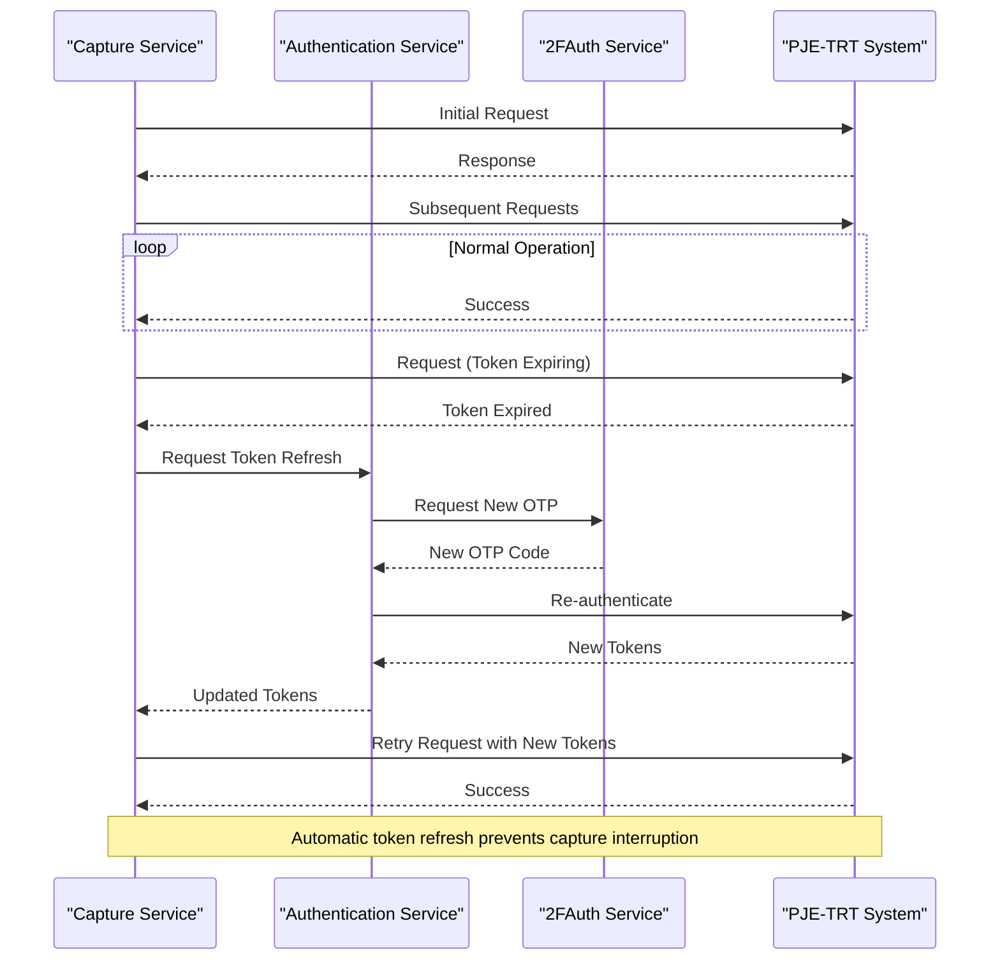
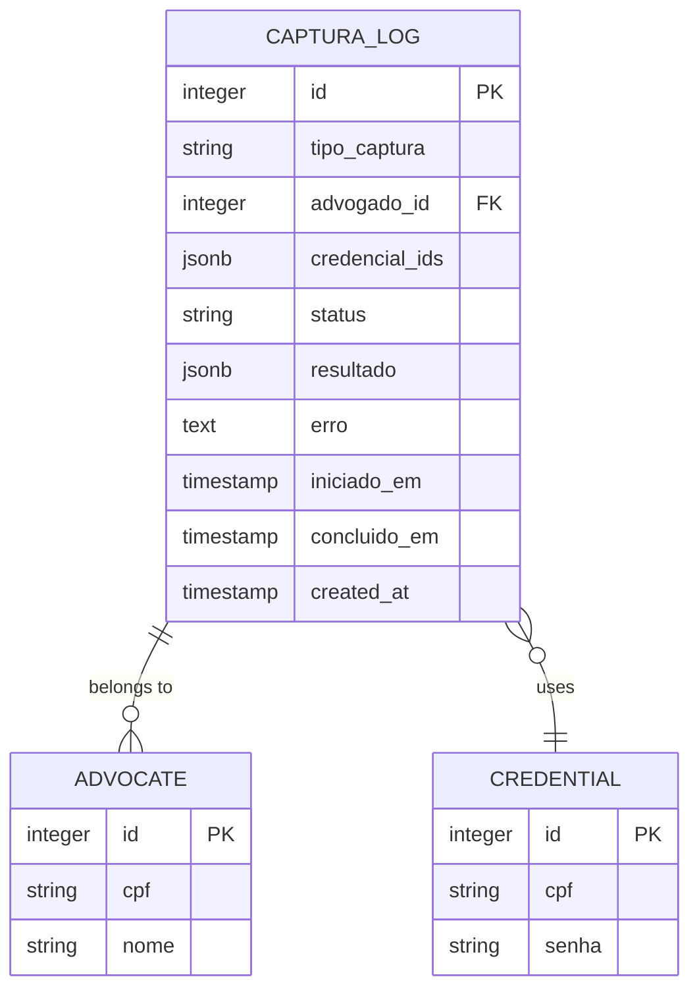
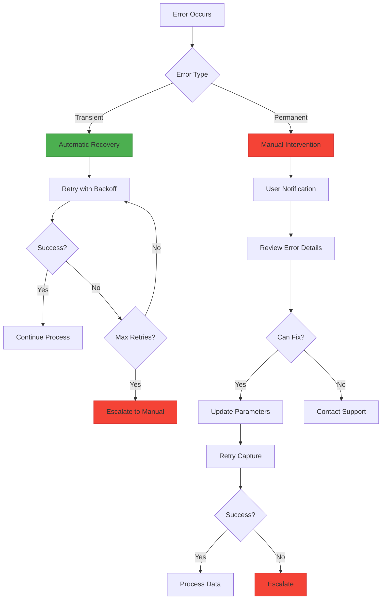

# PJE-TRT Integration Errors

<cite>
**Referenced Files in This Document**   
- [pje-expediente-documento.service.ts](file://backend/captura/services/pje/pje-expediente-documento.service.ts)
- [captura-log-persistence.service.ts](file://backend/captura/services/persistence/captura-log-persistence.service.ts)
- [trt-auth.service.ts](file://backend/captura/services/trt/trt-auth.service.ts)
- [pendentes-manifestacao.service.ts](file://backend/captura/services/trt/pendentes-manifestacao.service.ts)
- [captura-log.service.ts](file://backend/captura/services/captura-log.service.ts)
- [capturas-log-types.ts](file://backend/types/captura/capturas-log-types.ts)
</cite>

## Table of Contents
1. [Introduction](#introduction)
2. [Error Handling in PJE-TRT Integration](#error-handling-in-pje-trt-integration)
3. [Authentication Failure Handling](#authentication-failure-handling)
4. [Network Timeout and Connection Errors](#network-timeout-and-connection-errors)
5. [HTML Parsing and Data Extraction Errors](#html-parsing-and-data-extraction-errors)
6. [Retry Mechanisms and Credential Rotation](#retry-mechanisms-and-credential-rotation)
7. [Error Logging and Tracking](#error-logging-and-tracking)
8. [Error Recovery Process](#error-recovery-process)
9. [User Notification System](#user-notification-system)
10. [Common Error Scenarios and Resolution Paths](#common-error-scenarios-and-resolution-paths)
11. [Best Practices for Transient vs. Permanent Errors](#best-practices-for-transient-vs-permanent-errors)

## Introduction
This document provides comprehensive documentation for error handling in the PJE-TRT integration within the Sinesys system. The integration enables automated data capture from PJE-TRT systems for legal processes, specifically focusing on pending matters that require manifestation. The system handles various error scenarios that can occur during the capture process, including authentication failures, network timeouts, and HTML parsing errors. This documentation details the error handling mechanisms, retry strategies, credential rotation, logging infrastructure, and user notification systems that ensure reliable and resilient data capture from the PJE-TRT platform.

**Section sources**
- [pje-expediente-documento.service.ts](file://backend/captura/services/pje/pje-expediente-documento.service.ts)
- [captura-log-persistence.service.ts](file://backend/captura/services/persistence/captura-log-persistence.service.ts)

## Error Handling in PJE-TRT Integration
The PJE-TRT integration in Sinesys implements a comprehensive error handling system designed to manage various failure scenarios during automated data capture. The system follows a structured approach to error detection, handling, and recovery, ensuring data integrity and system reliability. The primary components involved in error handling are the `pje-expediente-documento.service.ts` for document capture operations and the `captura-log-persistence.service.ts` for logging and tracking capture attempts.

The error handling architecture is built around several key principles: graceful degradation, comprehensive logging, automated retry mechanisms, and user-friendly error reporting. When errors occur during the capture process, the system captures detailed error information, logs it for auditing and troubleshooting, and implements appropriate recovery strategies based on the error type. The system distinguishes between transient errors (which can be resolved through retry mechanisms) and permanent errors (which require manual intervention).

**Diagram sources **
- [pje-expediente-documento.service.ts](file://backend/captura/services/pje/pje-expediente-documento.service.ts)
- [captura-log-persistence.service.ts](file://backend/captura/services/persistence/captura-log-persistence.service.ts)

**Section sources**
- [pje-expediente-documento.service.ts](file://backend/captura/services/pje/pje-expediente-documento.service.ts)
- [captura-log-persistence.service.ts](file://backend/captura/services/persistence/captura-log-persistence.service.ts)

## Authentication Failure Handling
Authentication failures are a critical aspect of PJE-TRT integration, as access to the system requires valid credentials and proper authentication through the SSO (Single Sign-On) system. The `trt-auth.service.ts` file implements a robust authentication mechanism that handles various failure scenarios, including invalid credentials, OTP (One-Time Password) failures, and session expiration.

The authentication process follows a multi-step approach: first, the system navigates to the login page and submits the user credentials (CPF and password); then, it handles the OTP verification process, which is mandatory for TRT access. If the OTP is invalid or expired, the system implements a retry mechanism using both the current and next OTP codes from the 2FAuth service. The authentication service includes specific error handling for network-related issues during the SSO process, such as connection timeouts or refused connections.

When authentication fails, the system captures detailed error information, including the specific failure point (e.g., credential submission, OTP validation, or JWT extraction). The error handling includes a retry mechanism with exponential backoff for transient network issues, while permanent authentication failures (such as invalid credentials) are logged and reported to the user for manual intervention.

**Diagram sources **
- [trt-auth.service.ts](file://backend/captura/services/trt/trt-auth.service.ts)
- [pje-expediente-documento.service.ts](file://backend/captura/services/pje/pje-expediente-documento.service.ts)

**Section sources**
- [trt-auth.service.ts](file://backend/captura/services/trt/trt-auth.service.ts)
- [pje-expediente-documento.service.ts](file://backend/captura/services/pje/pje-expediente-documento.service.ts)

## Network Timeout and Connection Errors
Network timeouts and connection errors are common challenges in web scraping and API integration, particularly when dealing with government systems like PJE-TRT that may have variable response times or connectivity issues. The system implements comprehensive handling for these scenarios through timeout configurations, retry mechanisms, and connection recovery strategies.

The integration uses Playwright for browser automation, which includes built-in timeout handling for page navigation and element interaction. The system sets appropriate timeout values (typically 60 seconds) for critical operations like page loading and network requests. When a timeout occurs, the system captures the error and implements a retry mechanism with incremental delays between attempts. For persistent network issues, the system may fall back to alternative connection methods or report the failure to the user.

Connection errors are handled at multiple levels: during the initial connection to the PJE-TRT system, during authentication, and while making API requests for data retrieval. The error handling includes detection of specific network error patterns (such as "connection refused" or "net::ERR" messages) and appropriate responses. The system also monitors for SSO (Single Sign-On) redirect failures, which can occur due to network instability during the authentication flow.

**Diagram sources **
- [trt-auth.service.ts](file://backend/captura/services/trt/trt-auth.service.ts)
- [pje-expediente-documento.service.ts](file://backend/captura/services/pje/pje-expediente-documento.service.ts)

**Section sources**
- [trt-auth.service.ts](file://backend/captura/services/trt/trt-auth.service.ts)
- [pje-expediente-documento.service.ts](file://backend/captura/services/pje/pje-expediente-documento.service.ts)

## HTML Parsing and Data Extraction Errors
HTML parsing and data extraction errors occur when the system encounters unexpected HTML structure or content format during data capture from PJE-TRT. These errors are particularly challenging as government systems may update their UI without notice, breaking existing parsing logic. The system implements defensive programming practices to handle these scenarios gracefully.

The `pje-expediente-documento.service.ts` file contains specific error handling for document metadata and content extraction. When fetching document metadata, the system validates the response structure and handles cases where expected fields are missing or have unexpected types. For example, when processing the error log showing "primeiraPagina.resultado is not iterable", the system should implement proper type checking before attempting to iterate over results.

Data extraction errors are handled through a combination of validation, fallback mechanisms, and detailed error logging. The system validates the mimetype of retrieved documents to ensure they are PDF files before processing. When parsing complex data structures like timelines or process details, the system includes null checks and type validation to prevent runtime errors. For critical data points, the system may implement alternative extraction methods or fallback to manual review processes.

**Diagram sources **
- [pje-expediente-documento.service.ts](file://backend/captura/services/pje/pje-expediente-documento.service.ts)
- [pendentes-manifestacao.service.ts](file://backend/captura/services/trt/pendentes-manifestacao.service.ts)

**Section sources**
- [pje-expediente-documento.service.ts](file://backend/captura/services/pje/pje-expediente-documento.service.ts)
- [pendentes-manifestacao.service.ts](file://backend/captura/services/trt/pendentes-manifestacao.service.ts)

## Retry Mechanisms and Credential Rotation
The system implements sophisticated retry mechanisms and credential rotation strategies to handle transient errors and maintain uninterrupted data capture from PJE-TRT. These mechanisms are critical for ensuring reliability in the face of temporary system unavailability, network fluctuations, or authentication token expiration.

The retry mechanism follows an exponential backoff strategy, where the delay between retry attempts increases exponentially with each failure. This approach prevents overwhelming the target system with repeated requests while allowing time for transient issues to resolve. The system also implements circuit breaker patterns to detect persistent failures and temporarily halt retry attempts, preventing resource exhaustion.

Credential rotation is handled through the integration with the 2FAuth service, which manages OTP (One-Time Password) generation and rotation. The system proactively manages authentication tokens, including JWT (JSON Web Token) and XSRF tokens, ensuring they remain valid throughout the capture session. When tokens are nearing expiration, the system can initiate a refresh process without interrupting the data capture workflow.

**Diagram sources **
- [trt-auth.service.ts](file://backend/captura/services/trt/trt-auth.service.ts)
- [pje-expediente-documento.service.ts](file://backend/captura/services/pje/pje-expediente-documento.service.ts)

**Section sources**
- [trt-auth.service.ts](file://backend/captura/services/trt/trt-auth.service.ts)
- [pje-expediente-documento.service.ts](file://backend/captura/services/pje/pje-expediente-documento.service.ts)

## Error Logging and Tracking
Error logging and tracking are implemented through the `captura-log-persistence.service.ts` file, which provides a comprehensive system for recording and monitoring capture attempts and their outcomes. The logging system captures detailed information about each capture operation, including timestamps, status, error messages, and contextual data.

The system uses a structured logging approach with defined error categories and severity levels. Each capture attempt is assigned a unique identifier and tracked through its lifecycle from initiation to completion or failure. The logging service supports CRUD operations for capture logs, allowing for creation, updating, retrieval, and deletion of log entries.

The captured log data includes essential information such as the type of capture, associated attorney ID, credential IDs used, current status, result data (for successful captures), and error details (for failed captures). The system also records timestamps for when the capture was initiated and completed, enabling performance analysis and monitoring of capture durations.

**Diagram sources **
- [captura-log-persistence.service.ts](file://backend/captura/services/persistence/captura-log-persistence.service.ts)
- [capturas-log-types.ts](file://backend/types/captura/capturas-log-types.ts)

**Section sources**
- [captura-log-persistence.service.ts](file://backend/captura/services/persistence/captura-log-persistence.service.ts)
- [capturas-log-types.ts](file://backend/types/captura/capturas-log-types.ts)

## Error Recovery Process
The error recovery process in the PJE-TRT integration is designed to automatically handle transient failures and provide mechanisms for manual intervention when permanent errors occur. The recovery system is integrated with the capture workflow and operates at multiple levels, from individual request retries to complete capture session recovery.

For transient errors such as network timeouts or temporary authentication failures, the system implements automatic recovery through retry mechanisms with exponential backoff. The system maintains state information about the capture process, allowing it to resume from the point of failure rather than restarting the entire process. This is particularly important for multi-step operations like capturing pending matters, which involve authentication, data retrieval, and persistence.

When permanent errors occur, such as invalid credentials or structural changes to the PJE-TRT interface, the system logs detailed error information and notifies the user through the dashboard interface. The recovery process includes the ability to manually reattempt failed captures, update credentials, or adjust capture parameters. The system also provides access to raw error logs and response snapshots to assist in troubleshooting and resolution.

**Diagram sources **
- [pendentes-manifestacao.service.ts](file://backend/captura/services/trt/pendentes-manifestacao.service.ts)
- [captura-log-persistence.service.ts](file://backend/captura/services/persistence/captura-log-persistence.service.ts)

**Section sources**
- [pendentes-manifestacao.service.ts](file://backend/captura/services/trt/pendentes-manifestacao.service.ts)
- [captura-log-persistence.service.ts](file://backend/captura/services/persistence/captura-log-persistence.service.ts)

## User Notification System
The user notification system provides timely and relevant information about the status of PJE-TRT capture operations through the dashboard interface. When capture failures occur, the system generates notifications that are displayed in the user interface, allowing attorneys and administrators to quickly identify and address issues.

Notifications include details about the nature of the failure, affected processes, and recommended actions. For authentication failures, users are prompted to verify their credentials and OTP configuration. For network or parsing errors, users are informed about the specific issue and whether manual intervention is required. The system also provides access to detailed error logs and historical capture data for troubleshooting.

The notification system is integrated with the capture logging infrastructure, ensuring that all significant events are recorded and available for audit. Users can view the history of capture attempts, filter by status or error type, and drill down into specific failures for detailed analysis. This transparency enables users to monitor system performance and identify recurring issues that may require broader resolution.

**Section sources**
- [pendentes-manifestacao.service.ts](file://backend/captura/services/trt/pendentes-manifestacao.service.ts)
- [captura-log-persistence.service.ts](file://backend/captura/services/persistence/captura-log-persistence.service.ts)

## Common Error Scenarios and Resolution Paths
The PJE-TRT integration encounters several common error scenarios that have established resolution paths. Understanding these scenarios and their solutions is essential for maintaining reliable data capture operations.

**Authentication Failures**: These occur when credentials are invalid, OTP codes are rejected, or JWT tokens cannot be extracted. Resolution involves verifying credentials, checking 2FAuth configuration, and ensuring the authentication flow completes successfully. The system's retry mechanism with both current and next OTP codes helps resolve timing-related OTP issues.

**Network Timeouts**: These happen when the PJE-TRT system is slow to respond or network connectivity is unstable. The resolution path includes implementing retry mechanisms with exponential backoff, monitoring system availability, and potentially adjusting timeout thresholds based on historical performance data.

**HTML Parsing Errors**: These occur when the PJE-TRT interface structure changes, breaking existing parsing logic. The resolution involves updating the parsing code to accommodate the new structure, implementing more robust parsing methods that can handle variations, and establishing monitoring to detect structural changes early.

**Document Format Errors**: These happen when retrieved documents are not in the expected PDF format or are corrupted. The resolution includes validating document metadata before processing, implementing error handling for invalid formats, and providing fallback mechanisms for alternative document retrieval.

**Rate Limiting**: The PJE-TRT system may impose rate limits on automated access. The resolution involves implementing request throttling, optimizing the capture workflow to minimize requests, and potentially coordinating with system administrators to establish acceptable usage patterns.

**Section sources**
- [trt-auth.service.ts](file://backend/captura/services/trt/trt-auth.service.ts)
- [pje-expediente-documento.service.ts](file://backend/captura/services/pje/pje-expediente-documento.service.ts)
- [pendentes-manifestacao.service.ts](file://backend/captura/services/trt/pendentes-manifestacao.service.ts)

## Best Practices for Transient vs. Permanent Errors
Distinguishing between transient and permanent errors is crucial for implementing appropriate error handling strategies in the PJE-TRT integration. Transient errors are temporary conditions that can resolve themselves with time or retry attempts, while permanent errors require manual intervention or system changes.

**Transient Errors** (implement automated retry):
- Network timeouts and connection resets
- Temporary authentication token expiration
- Server-side rate limiting
- Momentary service unavailability
- Race conditions in concurrent operations

For transient errors, best practices include implementing exponential backoff retry mechanisms, setting appropriate retry limits, and using circuit breakers to prevent cascading failures. The system should also monitor retry patterns to identify recurring transient issues that may indicate underlying problems.

**Permanent Errors** (require manual intervention):
- Invalid credentials
- Structural changes to the PJE-TRT interface
- Missing required data fields
- Configuration errors
- Authorization failures

For permanent errors, best practices include providing clear error messages with actionable guidance, logging detailed diagnostic information, and implementing user notification systems. The system should avoid infinite retry loops for permanent errors and instead escalate to manual resolution processes.

The system should also implement error classification mechanisms to automatically categorize errors as transient or permanent based on error codes, messages, and historical patterns. This enables appropriate handling strategies to be applied automatically, improving system reliability and reducing manual intervention requirements.

**Section sources**
- [pje-expediente-documento.service.ts](file://backend/captura/services/pje/pje-expediente-documento.service.ts)
- [trt-auth.service.ts](file://backend/captura/services/trt/trt-auth.service.ts)
- [captura-log-persistence.service.ts](file://backend/captura/services/persistence/captura-log-persistence.service.ts)