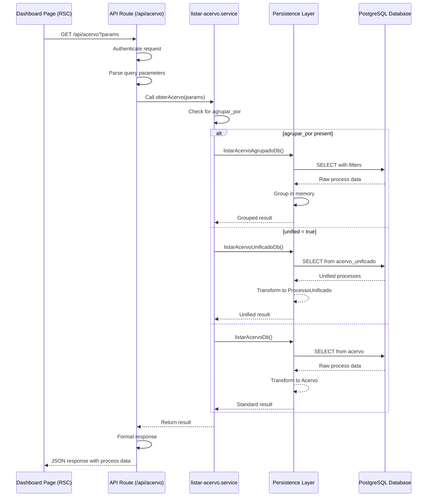
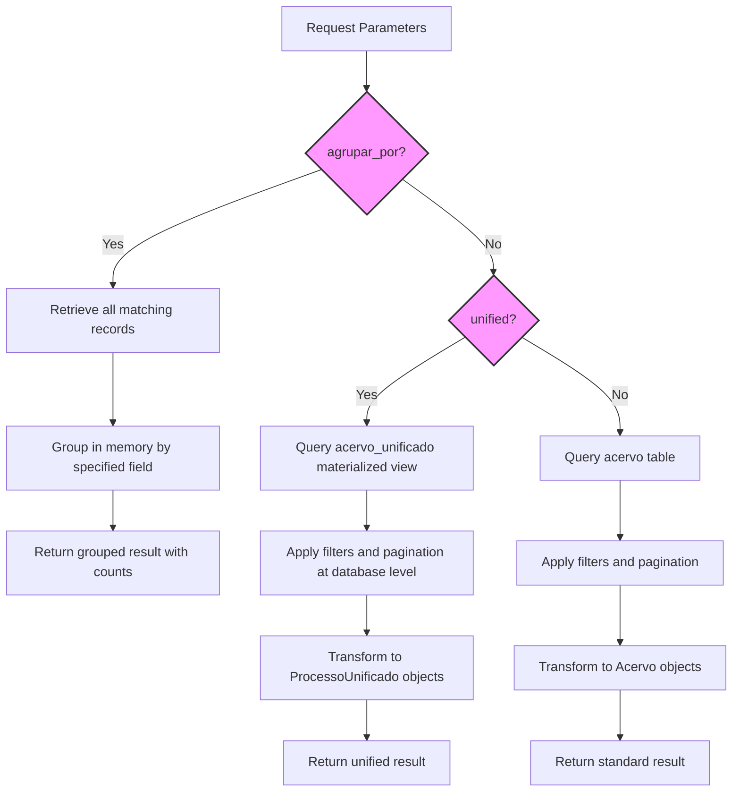
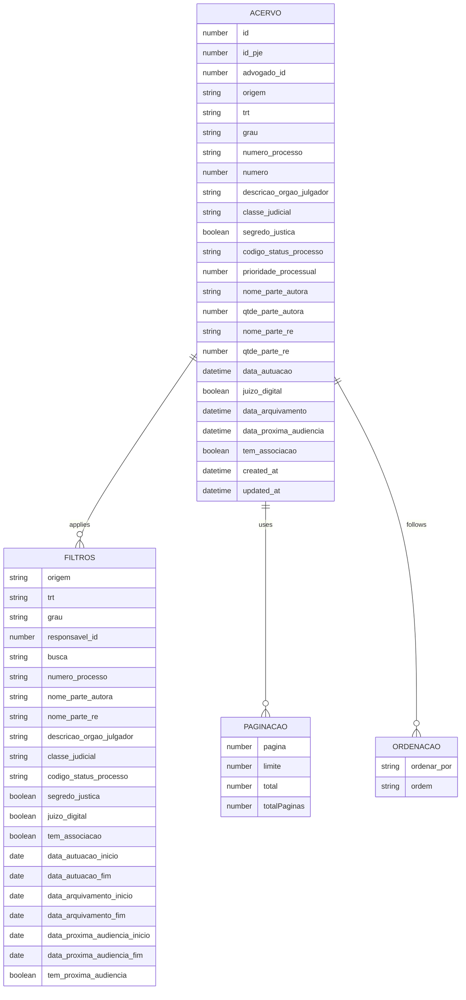

# Acervo Data Flow

<cite>
**Referenced Files in This Document**   
- [app/api/acervo/route.ts](file://app/api/acervo/route.ts)
- [backend/acervo/services/listar-acervo.service.ts](file://backend/acervo/services/listar-acervo.service.ts)
- [backend/acervo/services/persistence/listar-acervo.service.ts](file://backend/acervo/services/persistence/listar-acervo.service.ts)
- [backend/acervo/services/persistence/listar-acervo-unificado.service.ts](file://backend/acervo/services/persistence/listar-acervo-unificado.service.ts)
- [types/domain/acervo.ts](file://types/domain/acervo.ts)
- [types/contracts/acervo.ts](file://types/contracts/acervo.ts)
- [supabase/schemas/04_acervo.sql](file://supabase/schemas/04_acervo.sql)
- [supabase/schemas/05_acervo_unificado_view.sql](file://supabase/schemas/05_acervo_unificado_view.sql)
- [app/_lib/dashboard-api.ts](file://app/_lib/dashboard-api.ts)
- [app/(dashboard)/acordos-condenacoes/lista/page.tsx](file://app/(dashboard)/acordos-condenacoes/lista/page.tsx)
</cite>

## Table of Contents
1. [Introduction](#introduction)
2. [Acervo Data Flow Overview](#acervo-data-flow-overview)
3. [API Layer: Request Handling](#api-layer-request-handling)
4. [Business Logic Layer: Service Processing](#business-logic-layer-service-processing)
5. [Persistence Layer: Database Operations](#persistence-layer-database-operations)
6. [Data Models and Types](#data-models-and-types)
7. [Frontend Integration: React Server Components](#frontend-integration-react-server-components)
8. [Pagination, Filtering, and Sorting Implementation](#pagination-filtering-and-sorting-implementation)
9. [Error Handling and Response Formatting](#error-handling-and-response-formatting)
10. [Caching Strategy](#caching-strategy)
11. [Conclusion](#conclusion)

## Introduction

The Acervo data flow in Sinesys represents a comprehensive system for retrieving and managing legal processes across multiple layers of the application architecture. This documentation details the complete journey of a request to retrieve legal processes, starting from the user interface through the API layer, business logic, and persistence layers. The system is designed to handle complex queries with advanced filtering, pagination, sorting, and grouping capabilities while maintaining optimal performance through strategic caching and database optimization.

The Acervo module serves as the central repository for legal processes, providing users with a unified view of cases across different jurisdictions and instances. The data flow begins with React Server Components in the dashboard that pre-fetch acervo data, continues through a Next.js API route that handles authentication and parameter parsing, proceeds to a business logic service that determines the appropriate data retrieval strategy, and finally reaches the persistence layer where database queries are executed against Supabase PostgreSQL.

This documentation will explore each component of this data flow in detail, including the sequence of operations, data transformation steps, and the implementation of key features such as pagination, filtering, and sorting across the entire stack.

**Section sources**
- [app/api/acervo/route.ts](file://app/api/acervo/route.ts#L1-L448)
- [backend/acervo/services/listar-acervo.service.ts](file://backend/acervo/services/listar-acervo.service.ts#L1-L48)

## Acervo Data Flow Overview

The Acervo data flow in Sinesys follows a well-defined pattern that ensures efficient retrieval and presentation of legal process data. The journey begins when a user accesses a dashboard page that requires acervo data, triggering a pre-fetch operation through React Server Components. This initiates a request to the API endpoint at `/api/acervo`, which serves as the entry point for all acervo-related queries.

The request flows through three main architectural layers: the API layer, the business logic layer, and the persistence layer. In the API layer, the request is first authenticated and then parsed to extract query parameters that define the desired filters, pagination settings, sorting preferences, and grouping options. These parameters are then passed to the business logic layer, where the `obterAcervo` service determines the appropriate retrieval strategy based on whether the request requires grouped data or unified multi-instance processes.

The persistence layer implements three distinct retrieval methods: standard listing for individual process instances, grouped listing for aggregated data, and unified listing for processes that span multiple jurisdictions. The unified approach leverages a materialized view in the database to efficiently group processes with the same case number across different instances, eliminating the need to process large datasets in memory. All database operations are performed using Supabase's PostgreSQL client with appropriate indexing and caching strategies to ensure optimal performance.

Throughout this flow, data is transformed and validated at each stage, with comprehensive error handling to ensure robust operation. The response is then formatted according to the request type, either as a paginated list of processes or as grouped data with counts, before being returned to the frontend for display.

**Diagram sources**
- [app/api/acervo/route.ts](file://app/api/acervo/route.ts#L321-L448)
- [backend/acervo/services/listar-acervo.service.ts](file://backend/acervo/services/listar-acervo.service.ts#L30-L46)
- [backend/acervo/services/persistence/listar-acervo.service.ts](file://backend/acervo/services/persistence/listar-acervo.service.ts#L75-L222)
- [backend/acervo/services/persistence/listar-acervo-unificado.service.ts](file://backend/acervo/services/persistence/listar-acervo-unificado.service.ts#L100-L256)

## API Layer: Request Handling

The API layer in Sinesys handles acervo requests through the route defined in `app/api/acervo/route.ts`. This endpoint serves as the primary interface for retrieving legal process data and implements a comprehensive set of features including authentication, parameter validation, and response formatting. The GET method in this route handles all acervo retrieval operations, supporting a wide range of query parameters that enable flexible data filtering and presentation.

Authentication is the first step in the request handling process, implemented through the `authenticateRequest` function which verifies the user's credentials using bearer tokens, session authentication, or service API keys. This security measure ensures that only authorized users can access sensitive legal process information. After successful authentication, the route parses query parameters from the request URL, converting string values to appropriate data types such as booleans and numbers while maintaining type safety through TypeScript interfaces.

The route supports extensive filtering capabilities, allowing clients to filter processes by origin (acervo_geral or arquivado), TRT code, jurisdiction level, responsible party, and various date ranges including filing, archiving, and next hearing dates. Textual search is supported across multiple fields such as case number, plaintiff name, defendant name, judicial body description, and judicial class. The API also provides sorting options on fields like filing date, case number, party names, and creation/update timestamps, with configurable ascending or descending order.

For data organization, the API offers grouping functionality that can aggregate results by TRT, jurisdiction level, origin, responsible party, judicial class, status code, judicial body, or filing month/year. When grouping is requested, the API can return either just the counts for each group or the complete list of processes within each group, depending on the `incluir_contagem` parameter. The response format adapts accordingly, either providing a paginated list of processes with metadata or a grouped structure with counts and optional process details.

**Section sources**
- [app/api/acervo/route.ts](file://app/api/acervo/route.ts#L1-L448)

## Business Logic Layer: Service Processing

The business logic layer in the Acervo data flow is centered around the `listar-acervo.service.ts` file in the backend services directory. This service acts as the orchestrator between the API layer and the persistence layer, making critical decisions about which data retrieval strategy to employ based on the request parameters. The main function `obterAcervo` serves as the entry point for all acervo retrieval operations and implements a decision tree that determines the appropriate persistence method to call.

The service's primary responsibility is to interpret the request parameters and route them to the correct database query function. When the `agrupar_por` parameter is present in the request, indicating that the client wants grouped data, the service calls `listarAcervoAgrupadoDb` to handle the aggregation. This method retrieves all matching records from the database and performs in-memory grouping based on the specified field, such as TRT, jurisdiction level, or responsible party.

For the more common case of retrieving individual processes, the service determines whether to use unified or standard listing based on the `unified` parameter. By default, unified listing is enabled, which means processes with the same case number across different instances (jurisdiction levels) are grouped into a single representation. This is achieved by calling `listarAcervoUnificadoDb`, which queries a materialized view in the database specifically designed for this purpose. The materialized view pre-computes the unified representation, significantly improving performance compared to in-memory grouping of large datasets.

When unified listing is disabled, the service falls back to `listarAcervoDb`, which retrieves process instances individually from the acervo table. This legacy mode is maintained for backward compatibility but is less efficient for users who need to see the complete picture of a case across multiple jurisdiction levels. Throughout this process, the service maintains type safety by using TypeScript interfaces that define the structure of input parameters and return values, ensuring consistent data contracts across the application layers.

**Section sources**
- [backend/acervo/services/listar-acervo.service.ts](file://backend/acervo/services/listar-acervo.service.ts#L1-L48)

## Persistence Layer: Database Operations

The persistence layer in the Acervo data flow implements three distinct strategies for retrieving legal process data, each optimized for specific use cases. These strategies are implemented in separate service files within the persistence directory and leverage Supabase's PostgreSQL client for database operations. The layer is responsible for executing database queries, transforming raw data into domain objects, and managing caching to improve performance.

The standard listing operation, implemented in `listar-acervo.service.ts`, retrieves individual process instances from the `acervo` table. This method constructs a Supabase query with filters based on the provided parameters, including equality checks for origin, TRT, and jurisdiction level, as well as range queries for dates. Textual search is implemented using the `or` operator with `ilike` conditions across multiple fields. The query applies pagination using offset and limit calculations based on the requested page number and size, and includes a count of total matching records for pagination metadata.

For grouped data requests, the same file implements `listarAcervoAgrupado`, which first retrieves all matching records without pagination and then performs in-memory grouping based on the specified field. This approach is necessary because PostgreSQL's GROUP BY clause would aggregate values rather than preserving individual records. The method uses JavaScript Map objects to group processes by keys such as TRT, jurisdiction level, or responsible party, then transforms these groups into the response format with counts and optional process lists.

The most sophisticated persistence operation is the unified listing, implemented in `listar-acervo-unificado.service.ts`. This method queries the `acervo_unificado` materialized view instead of the base `acervo` table, leveraging database-level aggregation to efficiently group processes with the same case number across different instances. The materialized view pre-computes the unified representation, including a JSONB field with all instances of each process and metadata about the current jurisdiction level. This approach allows for true database-level pagination and indexing, dramatically improving performance for large datasets compared to in-memory grouping.

**Diagram sources**
- [backend/acervo/services/persistence/listar-acervo.service.ts](file://backend/acervo/services/persistence/listar-acervo.service.ts#L75-L422)
- [backend/acervo/services/persistence/listar-acervo-unificado.service.ts](file://backend/acervo/services/persistence/listar-acervo-unificado.service.ts#L100-L256)

## Data Models and Types

The Acervo data flow in Sinesys relies on a well-defined set of TypeScript interfaces and database schemas that ensure type safety and data consistency across the application layers. These models define the structure of legal process data, query parameters, and response formats, creating a clear contract between the frontend and backend components.

The core data model is defined in `types/domain/acervo.ts`, which exports several interfaces that represent different views of legal processes. The `Acervo` interface describes a single process instance with properties such as ID, case number, parties involved, filing date, jurisdiction level, and status. It includes metadata fields like creation and update timestamps, as well as business-specific fields like priority level and digital court status. The `ProcessoUnificado` interface extends this model to represent a case across multiple jurisdiction levels, adding fields like `grau_atual` (current jurisdiction level), `instances` (array of all instances), and `graus_ativos` (array of active jurisdiction levels).

Complementing these domain models, `types/contracts/acervo.ts` defines the API contracts including `ListarAcervoParams` for request parameters and three result types: `ListarAcervoResult` for standard listings, `ListarAcervoAgrupadoResult` for grouped data, and `ListarAcervoUnificadoResult` for unified process views. These interfaces ensure type safety throughout the data flow, from parameter parsing in the API route to response formatting.

The database schema, defined in `supabase/schemas/04_acervo.sql`, creates the physical `acervo` table with columns that map directly to the `Acervo` interface properties. The table includes appropriate data types, constraints, and indexes to ensure data integrity and query performance. Notably, it implements row-level security to restrict access based on user permissions and includes a unique constraint on the combination of PJE ID, TRT, jurisdiction level, and case number to prevent duplication.

The materialized view schema in `supabase/schemas/05_acervo_unificado_view.sql` defines the `acervo_unificado` view that enables efficient unified process retrieval. This view uses window functions and JSON aggregation to group process instances by case number, identifying the current jurisdiction level based on the most recent filing date. It includes a comprehensive set of indexes on frequently queried fields like case number, TRT, and responsible party to optimize query performance.

**Section sources**
- [types/domain/acervo.ts](file://types/domain/acervo.ts#L1-L81)
- [types/contracts/acervo.ts](file://types/contracts/acervo.ts#L1-L107)
- [supabase/schemas/04_acervo.sql](file://supabase/schemas/04_acervo.sql#L1-L77)
- [supabase/schemas/05_acervo_unificado_view.sql](file://supabase/schemas/05_acervo_unificado_view.sql#L1-L223)

## Frontend Integration: React Server Components

The frontend integration of the Acervo data flow in Sinesys leverages React Server Components to pre-fetch and render legal process data efficiently. This approach eliminates the need for client-side data fetching and enables immediate rendering of content, improving perceived performance and user experience. The dashboard pages that display acervo data are implemented as server components that directly call backend services to retrieve the required information before sending the HTML to the client.

The data fetching process begins in the page components located in the dashboard directory, such as `app/(dashboard)/acordos-condenacoes/lista/page.tsx`. These components import and use utility functions from `app/_lib/dashboard-api.ts` to retrieve data from various sources, including the acervo API. The server components can await the resolution of these data fetching operations, ensuring that the page is fully populated with data before it is rendered.

When a user navigates to an acervo-related page, the server component executes on the server, making a request to the `/api/acervo` endpoint with the appropriate query parameters based on the page context and user preferences. The API route processes this request through the complete data flow described in previous sections, ultimately returning a JSON response with the requested process data. The server component then uses this data to render the appropriate UI components, such as tables or lists, which are sent to the client as fully formed HTML.

This server-side rendering approach provides several advantages: it reduces the amount of JavaScript that needs to be downloaded and executed on the client, improves search engine optimization by serving fully rendered content, and enables faster initial page loads since the client doesn't need to wait for data fetching operations to complete. The use of React Server Components also allows for fine-grained data fetching, where different parts of a page can be rendered independently based on their data requirements, enabling more efficient updates and better user experience.

**Section sources**
- [app/_lib/dashboard-api.ts](file://app/_lib/dashboard-api.ts#L1-L209)
- [app/(dashboard)/acordos-condenacoes/lista/page.tsx](file://app/(dashboard)/acordos-condenacoes/lista/page.tsx#L1-L10)

## Pagination, Filtering, and Sorting Implementation

The Acervo data flow in Sinesys implements a comprehensive system for pagination, filtering, and sorting that operates consistently across all layers of the application. This system enables users to efficiently navigate large datasets of legal processes while maintaining optimal performance through server-side processing and appropriate indexing.

Pagination is implemented using standard page-based navigation with parameters for `pagina` (page number) and `limite` (page size). The API layer validates these parameters, ensuring that page numbers are positive integers and page sizes are within acceptable limits (1-2000 items). The default page size is 50 items, with a maximum of 2000 to prevent excessive data transfer. In the persistence layer, pagination is applied using Supabase's range method, which translates to SQL LIMIT and OFFSET clauses. The system also retrieves a count of total matching records to calculate the total number of pages, which is included in the response metadata to enable proper pagination controls in the UI.

Filtering capabilities are extensive and operate on multiple dimensions of the legal process data. Basic filters include origin (acervo_geral or arquivado), TRT code, jurisdiction level, and responsible party. Date-based filters support ranges for filing date, archiving date, and next hearing date, allowing users to find processes within specific time periods. Textual search is implemented across multiple fields including case number, plaintiff name, defendant name, judicial body description, and judicial class, using partial matching with the `ilike` operator. Status-based filters allow filtering by specific status codes or boolean flags like segredo_justica (secret justice) and juizo_digital (digital court).

Sorting is configurable through the `ordenar_por` and `ordem` parameters, supporting multiple fields including filing date, case number, party names, archiving date, next hearing date, priority level, and creation/update timestamps. The default sort order is descending by filing date, which typically presents the most recent cases first. All sorting operations are performed at the database level using Supabase's order method, which translates to SQL ORDER BY clauses with appropriate indexes to ensure efficient sorting even on large datasets.

**Diagram sources**
- [app/api/acervo/route.ts](file://app/api/acervo/route.ts#L332-L396)
- [backend/acervo/services/persistence/listar-acervo.service.ts](file://backend/acervo/services/persistence/listar-acervo.service.ts#L88-L202)
- [types/contracts/acervo.ts](file://types/contracts/acervo.ts#L46-L76)

## Error Handling and Response Formatting

The Acervo data flow in Sinesys implements a robust error handling and response formatting system that ensures reliable operation and clear communication with clients. This system operates at multiple levels of the application, from parameter validation in the API layer to database error handling in the persistence layer, providing comprehensive protection against various failure modes.

In the API layer, the route handler implements explicit validation for critical parameters such as page number and page size. If the `pagina` parameter is present but less than 1, the system returns a 400 Bad Request response with a descriptive error message. Similarly, if the `limite` parameter is outside the acceptable range of 1-2000, an appropriate error response is returned. These validations prevent inefficient queries that could impact system performance. The handler also validates date parameters to ensure they are in the correct ISO format, though this is primarily handled by the database layer.

The business logic and persistence layers implement try-catch blocks around database operations to capture any errors that occur during query execution. In the persistence layer, database errors are caught and transformed into meaningful error messages that are propagated back through the call stack. For example, if a query fails due to a database connection issue or syntax error, the persistence layer throws an error with a descriptive message that includes the original database error message. This error is then caught in the API layer's main try-catch block and returned to the client as a 500 Internal Server Error response.

Response formatting varies depending on the type of request. For standard listings without grouping, the response includes a `processos` array with the retrieved process data and a `paginacao` object containing metadata like current page, page size, total count, and total pages. When grouping is requested, the response structure changes to include an `agrupamentos` array with group names and counts, along with a total count of matching processes. All successful responses include a `success: true` flag, while error responses include an `error` field with a descriptive message. This consistent response format allows frontend components to handle different types of responses predictably.

**Section sources**
- [app/api/acervo/route.ts](file://app/api/acervo/route.ts#L398-L448)
- [backend/acervo/services/persistence/listar-acervo.service.ts](file://backend/acervo/services/persistence/listar-acervo.service.ts#L204-L206)
- [backend/acervo/services/persistence/listar-acervo-unificado.service.ts](file://backend/acervo/services/persistence/listar-acervo-unificado.service.ts#L236-L238)

## Caching Strategy

The Acervo data flow in Sinesys implements a sophisticated caching strategy that significantly improves performance by reducing database load and response times. This strategy operates at the persistence layer and leverages Redis as a distributed cache to store frequently accessed data, with configurable time-to-live (TTL) values to ensure data freshness.

The caching system is implemented in the persistence layer services through the use of helper functions `getCached` and `setCached` from `@/backend/utils/redis/cache-utils`. Each data retrieval operation first checks the cache using a unique key generated by specialized functions like `getAcervoListKey` and `getAcervoGroupKey`. These key generation functions incorporate all relevant query parameters to ensure that different requests receive appropriately cached responses. If a valid cache entry is found (cache hit), it is returned immediately without querying the database, resulting in sub-millisecond response times.

When a cache miss occurs, the system proceeds with the database query as normal, but after retrieving and transforming the data, it stores the result in the cache using the `setCached` function. The standard listing and grouped listing operations use a TTL of 900 seconds (15 minutes), as defined by the `ACERVO_TTL` constant, while the unified listing operation uses the same duration. This balance between performance and data freshness ensures that users see relatively current data while significantly reducing the load on the database for repeated queries.

The caching strategy is particularly effective for the grouped data operations, which would otherwise require loading large datasets into memory and performing expensive grouping operations on each request. By caching the grouped results, the system avoids these computational costs for subsequent identical requests. The materialized view used for unified process listing also benefits from caching, as the database-level aggregation is computationally expensive. The cache keys are carefully designed to include all filtering and sorting parameters, ensuring that different combinations of parameters result in different cache entries and preventing stale or incorrect data from being served.

**Section sources**
- [backend/acervo/services/persistence/listar-acervo.service.ts](file://backend/acervo/services/persistence/listar-acervo.service.ts#L78-L83)
- [backend/acervo/services/persistence/listar-acervo-unificado.service.ts](file://backend/acervo/services/persistence/listar-acervo-unificado.service.ts#L103-L108)
- [backend/acervo/services/persistence/listar-acervo.service.ts](file://backend/acervo/services/persistence/listar-acervo.service.ts#L220-L221)

## Conclusion

The Acervo data flow in Sinesys represents a sophisticated and well-architected system for retrieving and managing legal process data across multiple layers of the application. By implementing a clear separation of concerns between the API, business logic, and persistence layers, the system achieves both flexibility and performance, allowing users to efficiently navigate large datasets of legal processes with advanced filtering, sorting, and grouping capabilities.

The use of React Server Components for frontend integration enables immediate rendering of content by pre-fetching data on the server, improving user experience and reducing client-side processing. The API layer provides a comprehensive interface with robust authentication, parameter validation, and response formatting, while the business logic layer orchestrates the appropriate data retrieval strategy based on request parameters. The persistence layer implements three distinct methods for data retrieval—standard listing, grouped listing, and unified listing—each optimized for specific use cases and leveraging database features like materialized views for improved performance.

Key architectural decisions, such as the use of a materialized view for unified process representation and the implementation of Redis caching, demonstrate a thoughtful approach to performance optimization. These features allow the system to handle large datasets efficiently while maintaining responsive user interfaces. The comprehensive type system using TypeScript interfaces ensures data consistency and type safety throughout the application, reducing the likelihood of runtime errors and improving developer productivity.

Overall, the Acervo data flow exemplifies modern web application architecture principles, combining server-side rendering, API design best practices, database optimization techniques, and effective caching strategies to deliver a robust and performant solution for legal process management.