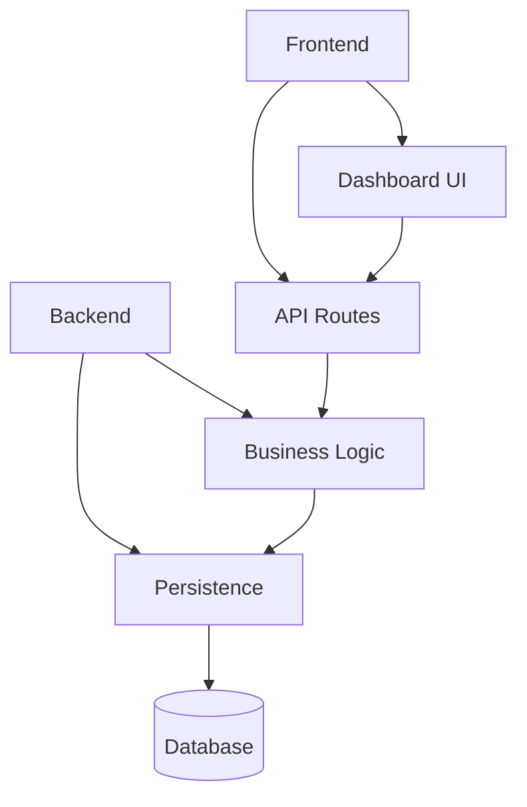
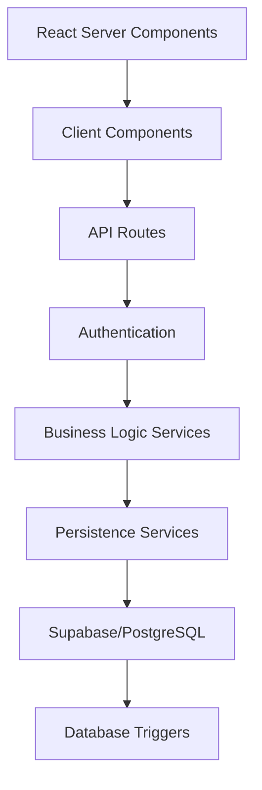
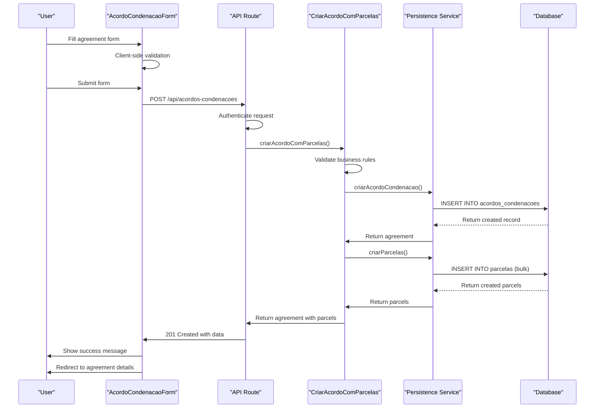
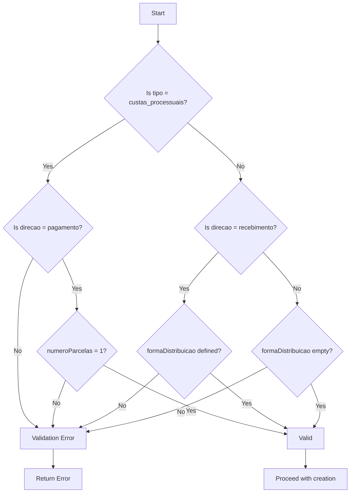
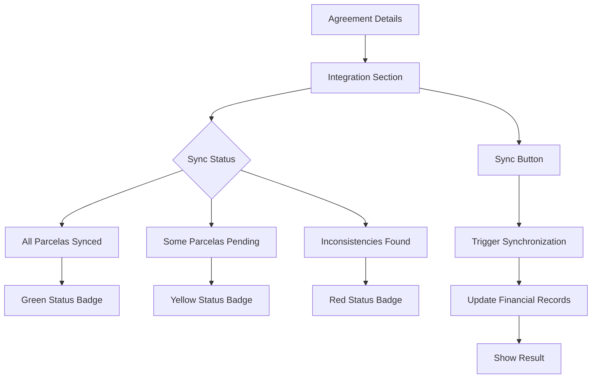
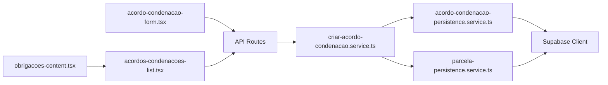

# Acordos Condenações Data Flow

<cite>
**Referenced Files in This Document**   
- [page.tsx](file://app/(dashboard)/acordos-condenacoes/page.tsx)
- [novo/page.tsx](file://app/(dashboard)/acordos-condenacoes/novo/page.tsx)
- [acordo-condenacao-form.tsx](file://app/(dashboard)/acordos-condenacoes/components/acordo-condenacao-form.tsx)
- [acordos-condenacoes-list.tsx](file://app/(dashboard)/acordos-condenacoes/components/acordos-condenacoes-list.tsx)
- [obrigacoes-content.tsx](file://app/(dashboard)/acordos-condenacoes/components/obrigacoes-content.tsx)
- [route.ts](file://app/api/acordos-condenacoes/route.ts)
- [criar-acordo-condenacao.service.ts](file://backend/acordos-condenacoes/services/acordos-condenacoes/criar-acordo-condenacao.service.ts)
- [acordo-condenacao-persistence.service.ts](file://backend/acordos-condenacoes/services/persistence/acordo-condenacao-persistence.service.ts)
- [parcela-persistence.service.ts](file://backend/acordos-condenacoes/services/persistence/parcela-persistence.service.ts)
- [20_acordos_condenacoes.sql](file://supabase/schemas/20_acordos_condenacoes.sql)
</cite>

## Table of Contents
1. [Introduction](#introduction)
2. [Project Structure](#project-structure)
3. [Core Components](#core-components)
4. [Architecture Overview](#architecture-overview)
5. [Detailed Component Analysis](#detailed-component-analysis)
6. [Dependency Analysis](#dependency-analysis)
7. [Performance Considerations](#performance-considerations)
8. [Troubleshooting Guide](#troubleshooting-guide)
9. [Conclusion](#conclusion)

## Introduction
This document provides a comprehensive analysis of the Acordos Condenações data flow in the Sinesys application. The system manages judgment agreements, condemnations, and legal fees through a complete CRUD (Create, Read, Update, Delete) workflow that spans from the React frontend to the backend services and database persistence layer. The documentation details how users interact with the dashboard interface to manage these financial obligations, how data flows through API routes, and how business logic is enforced in the service layer before persistence in the database. The integration with the financial management system is also covered, showing how agreement data is synchronized across different modules of the application.

## Project Structure
The Acordos Condenações feature is organized in a structured manner following Next.js app directory conventions. The implementation is divided into frontend components, API routes, and backend services.

**Diagram sources**
- [page.tsx](file://app/(dashboard)/acordos-condenacoes/page.tsx)
- [route.ts](file://app/api/acordos-condenacoes/route.ts)
- [criar-acordo-condenacao.service.ts](file://backend/acordos-condenacoes/services/acordos-condenacoes/criar-acordo-condenacao.service.ts)
- [acordo-condenacao-persistence.service.ts](file://backend/acordos-condenacoes/services/persistence/acordo-condenacao-persistence.service.ts)

**Section sources**
- [page.tsx](file://app/(dashboard)/acordos-condenacoes/page.tsx)
- [novo/page.tsx](file://app/(dashboard)/acordos-condenacoes/novo/page.tsx)
- [acordos-condenacoes-list.tsx](file://app/(dashboard)/acordos-condenacoes/components/acordos-condenacoes-list.tsx)

## Core Components
The Acordos Condenações feature consists of several core components that work together to provide a complete user experience for managing judgment agreements. The frontend is built using React Server Components with client-side interactivity where needed. The main components include the agreement form for creating and editing agreements, the list component for displaying agreements in a table format, and the content component that orchestrates the different views (table, week, month, year). The backend services handle business logic such as validation, calculation of installment values, and transaction management, while the persistence layer manages database operations through Supabase.

**Section sources**
- [acordo-condenacao-form.tsx](file://app/(dashboard)/acordos-condenacoes/components/acordo-condenacao-form.tsx)
- [acordos-condenacoes-list.tsx](file://app/(dashboard)/acordos-condenacoes/components/acordos-condenacoes-list.tsx)
- [obrigacoes-content.tsx](file://app/(dashboard)/acordos-condenacoes/components/obrigacoes-content.tsx)

## Architecture Overview
The Acordos Condenações feature follows a layered architecture with clear separation of concerns between the presentation, API, business logic, and persistence layers. The frontend uses React Server Components to pre-fetch data on the server side, reducing client-side loading times and improving SEO. When a user accesses the agreements page, the server component fetches the initial data and renders the page before sending it to the client. Client-side components handle user interactions and make API calls to the backend when data needs to be updated. The API routes serve as the entry point to the backend services, handling authentication and request validation before passing control to the business logic layer. The service layer contains the core business rules and orchestrates operations across multiple persistence services. Finally, the persistence layer interacts with the PostgreSQL database through Supabase, handling all data storage and retrieval operations.

**Diagram sources**
- [page.tsx](file://app/(dashboard)/acordos-condenacoes/page.tsx)
- [route.ts](file://app/api/acordos-condenacoes/route.ts)
- [criar-acordo-condenacao.service.ts](file://backend/acordos-condenacoes/services/acordos-condenacoes/criar-acordo-condenacao.service.ts)
- [acordo-condenacao-persistence.service.ts](file://backend/acordos-condenacoes/services/persistence/acordo-condenacao-persistence.service.ts)

## Detailed Component Analysis

### Agreement Creation Flow
The process of creating a new agreement begins with the user navigating to the "Novo Acordo/Condenação" page. This page uses React Server Components to render the initial UI, but the form itself is a client component that handles user interactions. When the user submits the form, the client component validates the input data and sends a POST request to the API endpoint.

**Diagram sources**
- [acordo-condenacao-form.tsx](file://app/(dashboard)/acordos-condenacoes/components/acordo-condenacao-form.tsx)
- [route.ts](file://app/api/acordos-condenacoes/route.ts)
- [criar-acordo-condenacao.service.ts](file://backend/acordos-condenacoes/services/acordos-condenacoes/criar-acordo-condenacao.service.ts)
- [acordo-condenacao-persistence.service.ts](file://backend/acordos-condenacoes/services/persistence/acordo-condenacao-persistence.service.ts)
- [parcela-persistence.service.ts](file://backend/acordos-condenacoes/services/persistence/parcela-persistence.service.ts)

**Section sources**
- [acordo-condenacao-form.tsx](file://app/(dashboard)/acordos-condenacoes/components/acordo-condenacao-form.tsx)
- [route.ts](file://app/api/acordos-condenacoes/route.ts)
- [criar-acordo-condenacao.service.ts](file://backend/acordos-condenacoes/services/acordos-condenacoes/criar-acordo-condenacao.service.ts)

### Data Validation and Business Rules
The system implements comprehensive validation at multiple levels to ensure data integrity. Client-side validation provides immediate feedback to users, while server-side validation ensures data consistency regardless of the client. The business logic layer enforces complex rules such as:

- Custas processuais must be payments (not receipts) and have a single installment
- Receivables must have a distribution method defined (integral or divided)
- Payment direction determines whether distribution method is applicable
- Percentage values must be between 0 and 100
- Installment values must be positive

These rules are implemented in the `validarDadosAcordo` function within the service layer, which is called before any database operations are performed.

**Diagram sources**
- [criar-acordo-condenacao.service.ts](file://backend/acordos-condenacoes/services/acordos-condenacoes/criar-acordo-condenacao.service.ts)
- [acordo-condenacao-persistence.service.ts](file://backend/acordos-condenacoes/services/persistence/acordo-condenacao-persistence.service.ts)

**Section sources**
- [criar-acordo-condenacao.service.ts](file://backend/acordos-condenacoes/services/acordos-condenacoes/criar-acordo-condenacao.service.ts)

### Financial Integration
The Acordos Condenações feature integrates with the financial management system through a dedicated integration section in the agreement details page. This section displays the synchronization status between the agreement data and the financial records, allowing users to manually trigger synchronization when needed. The integration ensures that installment payments are properly recorded in the financial system and that any discrepancies are identified and resolved.

**Diagram sources**
- [integracao-financeira-section.tsx](file://app/(dashboard)/acordos-condenacoes/components/integracao-financeira-section.tsx)
- [use-obrigacoes.ts](file://app/_lib/hooks/use-obrigacoes.ts)

**Section sources**
- [integracao-financeira-section.tsx](file://app/(dashboard)/acordos-condenacoes/components/integracao-financeira-section.tsx)

## Dependency Analysis
The Acordos Condenações feature has well-defined dependencies between components, following a unidirectional data flow pattern. The frontend components depend on the API routes, which in turn depend on the backend services. The services have dependencies on the persistence layer, which depends on the database client. This layered dependency structure ensures loose coupling and high cohesion, making the system easier to maintain and test.

**Diagram sources**
- [acordo-condenacao-form.tsx](file://app/(dashboard)/acordos-condenacoes/components/acordo-condenacao-form.tsx)
- [acordos-condenacoes-list.tsx](file://app/(dashboard)/acordos-condenacoes/components/acordos-condenacoes-list.tsx)
- [obrigacoes-content.tsx](file://app/(dashboard)/acordos-condenacoes/components/obrigacoes-content.tsx)
- [route.ts](file://app/api/acordos-condenacoes/route.ts)
- [criar-acordo-condenacao.service.ts](file://backend/acordos-condenacoes/services/acordos-condenacoes/criar-acordo-condenacao.service.ts)
- [acordo-condenacao-persistence.service.ts](file://backend/acordos-condenacoes/services/persistence/acordo-condenacao-persistence.service.ts)
- [parcela-persistence.service.ts](file://backend/acordos-condenacoes/services/persistence/parcela-persistence.service.ts)

**Section sources**
- [acordo-condenacao-form.tsx](file://app/(dashboard)/acordos-condenacoes/components/acordo-condenacao-form.tsx)
- [acordos-condenacoes-list.tsx](file://app/(dashboard)/acordos-condenacoes/components/acordos-condenacoes-list.tsx)
- [obrigacoes-content.tsx](file://app/(dashboard)/acordos-condenacoes/components/obrigacoes-content.tsx)

## Performance Considerations
The system implements several performance optimizations to ensure a responsive user experience. React Server Components are used to pre-render the initial page state on the server, reducing client-side processing and improving perceived performance. The API routes use pagination for list operations, limiting the amount of data transferred in each request. Database queries are optimized with appropriate indexing, and bulk operations are used when creating multiple installments at once. The use of Supabase's real-time capabilities could be leveraged in the future to provide live updates without requiring page refreshes.

## Troubleshooting Guide
When issues occur with the Acordos Condenações feature, the following steps can help identify and resolve the problem:

1. Check the browser console for client-side errors in the form validation or API calls
2. Verify that the user has the necessary permissions to create or edit agreements
3. Examine the network tab to see the request and response payloads for API calls
4. Check the server logs for any errors in the service or persistence layers
5. Verify that the database constraints are not being violated
6. Ensure that the Supabase service role has the necessary permissions on the tables

Common issues include validation errors due to business rules, authentication failures, and database constraint violations. The system provides descriptive error messages to help users understand what went wrong and how to fix it.

**Section sources**
- [acordo-condenacao-form.tsx](file://app/(dashboard)/acordos-condenacoes/components/acordo-condenacao-form.tsx)
- [route.ts](file://app/api/acordos-condenacoes/route.ts)
- [criar-acordo-condenacao.service.ts](file://backend/acordos-condenacoes/services/acordos-condenacoes/criar-acordo-condenacao.service.ts)

## Conclusion
The Acordos Condenações feature in Sinesys provides a comprehensive solution for managing judgment agreements, condemnations, and legal fees. The system follows modern web development practices with a clear separation of concerns between frontend and backend components. The use of React Server Components improves performance and user experience, while the layered architecture ensures maintainability and testability. The integration with the financial management system ensures data consistency across different modules of the application. The implementation demonstrates a robust approach to data validation, business rule enforcement, and error handling, providing a reliable and user-friendly experience for managing legal financial obligations.