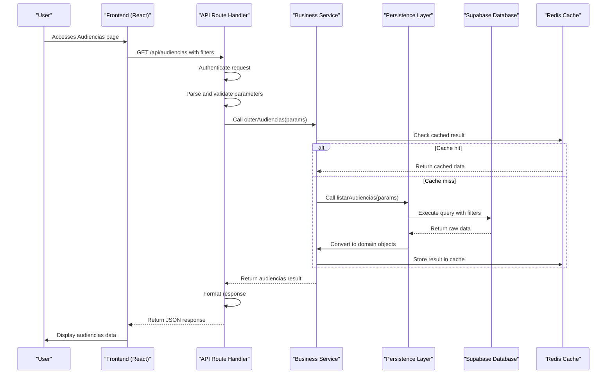
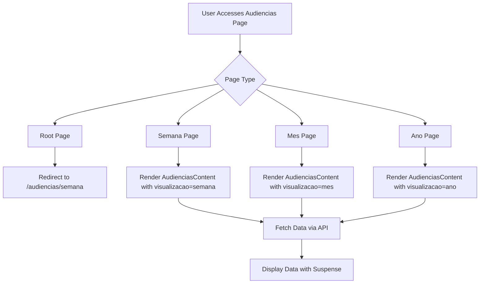
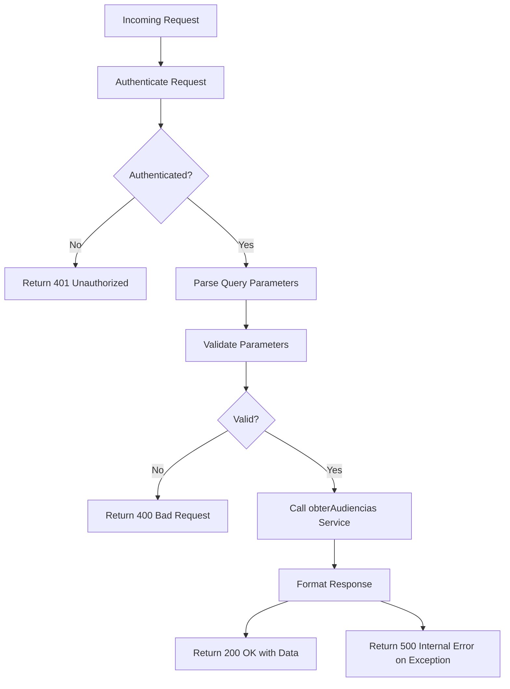
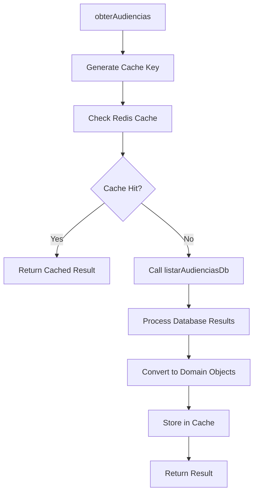
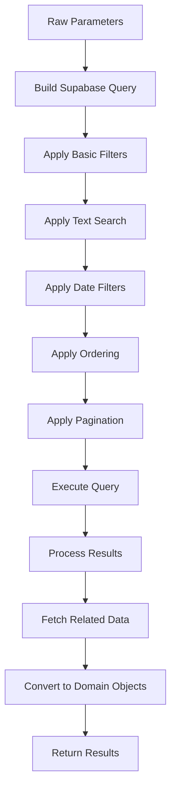
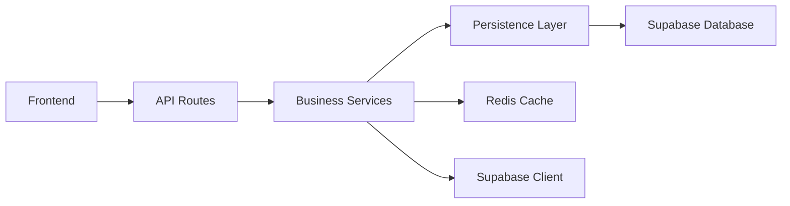

# Audiencias Data Flow

<cite>
**Referenced Files in This Document**   
- [page.tsx](file://app/(dashboard)/audiencias/page.tsx)
- [route.ts](file://app/api/audiencias/route.ts)
- [audiencias-content.tsx](file://app/(dashboard)/audiencias/components/audiencias-content.tsx)
- [listar-audiencias.service.ts](file://backend/audiencias/services/listar-audiencias.service.ts)
- [criar-audiencia.service.ts](file://backend/audiencias/services/criar-audiencia.service.ts)
- [persistence/listar-audiencias.service.ts](file://backend/audiencias/services/persistence/listar-audiencias.service.ts)
- [types/domain/audiencias.ts](file://types/domain/audiencias.ts)
- [types/contracts/audiencias.ts](file://types/contracts/audiencias.ts)
- [07_audiencias.sql](file://supabase/schemas/07_audiencias.sql)
</cite>

## Table of Contents
1. [Introduction](#introduction)
2. [Project Structure](#project-structure)
3. [Core Components](#core-components)
4. [Architecture Overview](#architecture-overview)
5. [Detailed Component Analysis](#detailed-component-analysis)
6. [Dependency Analysis](#dependency-analysis)
7. [Performance Considerations](#performance-considerations)
8. [Troubleshooting Guide](#troubleshooting-guide)
9. [Conclusion](#conclusion)

## Introduction
This document provides a comprehensive analysis of the Audiencias data flow in Sinesys, detailing the complete process of retrieving hearing data from the user interface through API routes to business services and database persistence. The documentation explains how requests flow from the dashboard audiencias page through the API route handler, into the business logic service for processing, and finally to the database query execution. It includes a sequence diagram illustrating the data flow, highlighting how request parameters like date ranges and filters are processed and validated. The role of React Server Components in pre-fetching hearing data and its impact on performance and user experience is also detailed.

## Project Structure
The Audiencias feature in Sinesys follows a structured architecture with clear separation between frontend and backend components. The frontend is organized under the `app/(dashboard)/audiencias/` directory with subdirectories for different views (ano, lista, mes, semana). The API routes are located in `app/api/audiencias/` while the backend services reside in `backend/audiencias/services/`. This structure enables modular development and maintenance of the hearing management functionality.

```mermaid
graph TD
subgraph "Frontend"
A[app/(dashboard)/audiencias/page.tsx]
B[app/(dashboard)/audiencias/components/audiencias-content.tsx]
C[app/(dashboard)/audiencias/semana/page.tsx]
D[app/(dashboard)/audiencias/mes/page.tsx]
end
subgraph "API Layer"
E[app/api/audiencias/route.ts]
end
subgraph "Backend Services"
F[backend/audiencias/services/listar-audiencias.service.ts]
G[backend/audiencias/services/criar-audiencia.service.ts]
H[backend/audiencias/services/persistence/listar-audiencias.service.ts]
end
subgraph "Database"
I[supabase/schemas/07_audiencias.sql]
end
A --> E
B --> E
C --> E
D --> E
E --> F
F --> H
E --> G
H --> I
G --> I
```

**Diagram sources**
- [page.tsx](file://app/(dashboard)/audiencias/page.tsx)
- [route.ts](file://app/api/audiencias/route.ts)
- [listar-audiencias.service.ts](file://backend/audiencias/services/listar-audiencias.service.ts)
- [criar-audiencia.service.ts](file://backend/audiencias/services/criar-audiencia.service.ts)
- [persistence/listar-audiencias.service.ts](file://backend/audiencias/services/persistence/listar-audiencias.service.ts)
- [07_audiencias.sql](file://supabase/schemas/07_audiencias.sql)

**Section sources**
- [page.tsx](file://app/(dashboard)/audiencias/page.tsx)
- [route.ts](file://app/api/audiencias/route.ts)
- [audiencias-content.tsx](file://app/(dashboard)/audiencias/components/audiencias-content.tsx)

## Core Components
The Audiencias data flow consists of several core components that work together to retrieve and display hearing data. The main entry point is the `page.tsx` file in the audiencias directory, which redirects users to the weekly view by default. The API route handler in `route.ts` processes incoming requests, authenticates users, and delegates to appropriate backend services. The business logic is implemented in services like `listar-audiencias.service.ts` and `criar-audiencia.service.ts`, which handle the core functionality of listing and creating hearings. Data persistence is managed through Supabase with the schema defined in `07_audiencias.sql`.

**Section sources**
- [page.tsx](file://app/(dashboard)/audiencias/page.tsx)
- [route.ts](file://app/api/audiencias/route.ts)
- [listar-audiencias.service.ts](file://backend/audiencias/services/listar-audiencias.service.ts)
- [criar-audiencia.service.ts](file://backend/audiencias/services/criar-audiencia.service.ts)
- [07_audiencias.sql](file://supabase/schemas/07_audiencias.sql)

## Architecture Overview
The Audiencias data flow follows a clean architecture pattern with well-defined layers. The frontend uses React Server Components to pre-fetch data, improving performance and user experience. When a user accesses the audiencias page, the request flows through the Next.js routing system to the API route handler. The handler authenticates the request, parses parameters, validates inputs, and invokes the appropriate business service. The service layer contains the core logic for processing hearing data, while the persistence layer handles database operations. Redis caching is implemented to improve performance for frequently accessed data.



**Diagram sources**
- [route.ts](file://app/api/audiencias/route.ts)
- [listar-audiencias.service.ts](file://backend/audiencias/services/listar-audiencias.service.ts)
- [persistence/listar-audiencias.service.ts](file://backend/audiencias/services/persistence/listar-audiencias.service.ts)
- [07_audiencias.sql](file://supabase/schemas/07_audiencias.sql)

## Detailed Component Analysis

### Audiencias Page Component Analysis
The Audiencias page component serves as the entry point for the hearing management feature. It uses Next.js's redirect function to automatically route users to the weekly view, providing a consistent user experience. The component structure includes specialized pages for different time-based views (week, month, year) that share common functionality through the audiencias-content component.



**Diagram sources**
- [page.tsx](file://app/(dashboard)/audiencias/page.tsx)
- [semana/page.tsx](file://app/(dashboard)/audiencias/semana/page.tsx)
- [mes/page.tsx](file://app/(dashboard)/audiencias/mes/page.tsx)

**Section sources**
- [page.tsx](file://app/(dashboard)/audiencias/page.tsx)
- [semana/page.tsx](file://app/(dashboard)/audiencias/semana/page.tsx)
- [mes/page.tsx](file://app/(dashboard)/audiencias/mes/page.tsx)

### API Route Handler Analysis
The API route handler in `route.ts` implements the GET method for retrieving hearing data with comprehensive filtering capabilities. It handles authentication, parameter parsing, validation, and error handling before delegating to the business service layer. The handler supports various query parameters for pagination, filtering by TRT, grade, responsible party, date ranges, status, and other criteria.



**Diagram sources**
- [route.ts](file://app/api/audiencias/route.ts)

**Section sources**
- [route.ts](file://app/api/audiencias/route.ts)

### Business Service Analysis
The business service layer contains the core logic for processing hearing data. The `obterAudiencias` function in `listar-audiencias.service.ts` serves as the main entry point, delegating to the persistence layer while handling caching logic. The service layer abstracts the complexity of database operations and provides a clean interface for the API route handler.



**Diagram sources**
- [listar-audiencias.service.ts](file://backend/audiencias/services/listar-audiencias.service.ts)

**Section sources**
- [listar-audiencias.service.ts](file://backend/audiencias/services/listar-audiencias.service.ts)

### Persistence Layer Analysis
The persistence layer implements the database queries for retrieving hearing data. The `listar-audiencias.service.ts` in the persistence directory constructs complex SQL queries with multiple filters, joins, and pagination. It handles the conversion of raw database results to domain objects and implements sophisticated filtering logic for text search, date ranges, and other criteria.



**Diagram sources**
- [persistence/listar-audiencias.service.ts](file://backend/audiencias/services/persistence/listar-audiencias.service.ts)

**Section sources**
- [persistence/listar-audiencias.service.ts](file://backend/audiencias/services/persistence/listar-audiencias.service.ts)

## Dependency Analysis
The Audiencias data flow has well-defined dependencies between components. The frontend depends on the API routes for data retrieval, while the API routes depend on backend services for business logic. The services depend on the persistence layer for database access, which in turn depends on Supabase for data storage. External dependencies include Redis for caching and Supabase for database operations.



**Diagram sources**
- [route.ts](file://app/api/audiencias/route.ts)
- [listar-audiencias.service.ts](file://backend/audiencias/services/listar-audiencias.service.ts)
- [persistence/listar-audiencias.service.ts](file://backend/audiencias/services/persistence/listar-audiencias.service.ts)

**Section sources**
- [route.ts](file://app/api/audiencias/route.ts)
- [listar-audiencias.service.ts](file://backend/audiencias/services/listar-audiencias.service.ts)
- [persistence/listar-audiencias.service.ts](file://backend/audiencias/services/persistence/listar-audiencias.service.ts)

## Performance Considerations
The Audiencias data flow incorporates several performance optimizations. Redis caching is implemented at the service layer to reduce database load for frequently accessed data. The API supports pagination with configurable limits to prevent excessive data transfer. Database indexes are defined for commonly queried fields to improve query performance. The use of React Server Components enables data pre-fetching, reducing perceived latency for users.

**Section sources**
- [listar-audiencias.service.ts](file://backend/audiencias/services/listar-audiencias.service.ts)
- [persistence/listar-audiencias.service.ts](file://backend/audiencias/services/persistence/listar-audiencias.service.ts)
- [07_audiencias.sql](file://supabase/schemas/07_audiencias.sql)

## Troubleshooting Guide
Common issues in the Audiencias data flow include authentication failures, invalid parameters, and database errors. The API route handler includes comprehensive error handling with appropriate HTTP status codes. For authentication issues, verify the user's session or API key. For parameter validation errors, check the request query parameters against the expected format. Database errors may require checking the Supabase connection or query syntax.

**Section sources**
- [route.ts](file://app/api/audiencias/route.ts)
- [listar-audiencias.service.ts](file://backend/audiencias/services/listar-audiencias.service.ts)
- [persistence/listar-audiencias.service.ts](file://backend/audiencias/services/persistence/listar-audiencias.service.ts)

## Conclusion
The Audiencias data flow in Sinesys demonstrates a well-architected approach to handling hearing data with clear separation of concerns between frontend, API, business logic, and persistence layers. The implementation leverages modern web development practices including React Server Components, API route handlers, and service-oriented architecture. Performance optimizations like Redis caching and database indexing ensure efficient data retrieval, while comprehensive error handling provides robustness. The system supports flexible filtering and pagination, making it suitable for displaying hearing data across different time periods and criteria.