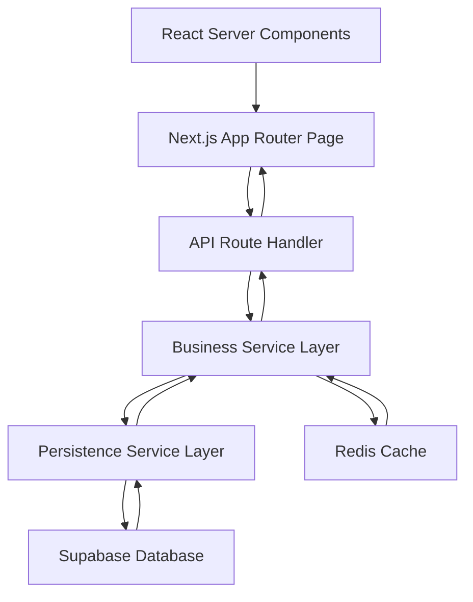
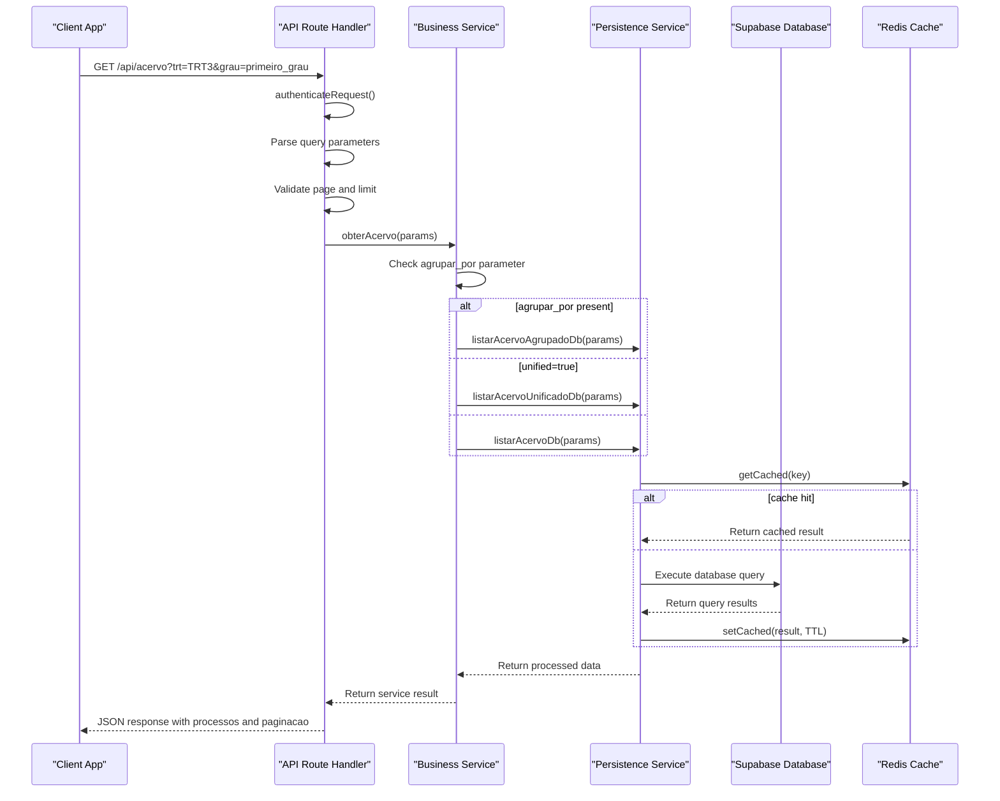
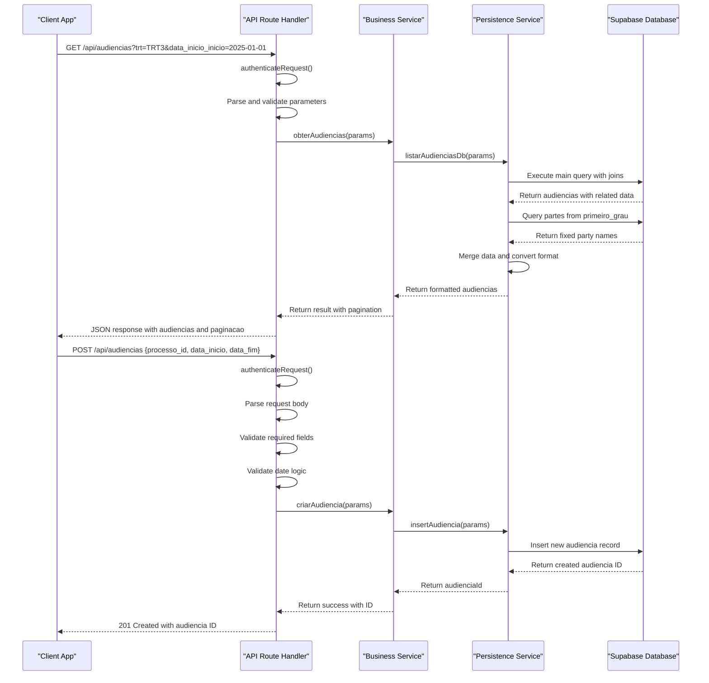
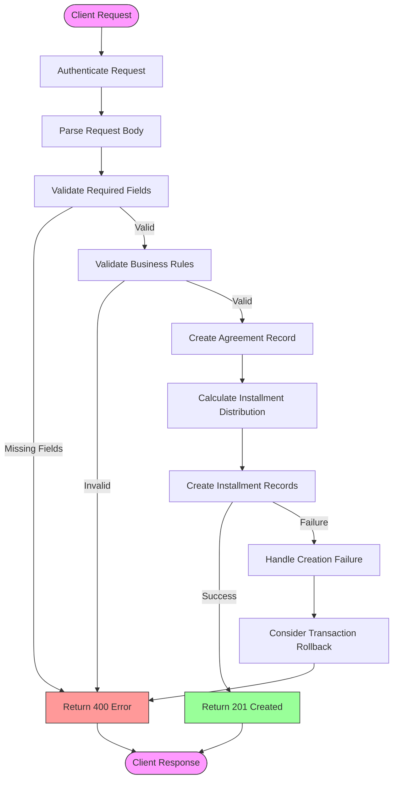

# Primary Data Pathways

<cite>
**Referenced Files in This Document**   
- [app/api/acervo/route.ts](file://app/api/acervo/route.ts)
- [app/api/audiencias/route.ts](file://app/api/audiencias/route.ts)
- [app/api/acordos-condenacoes/route.ts](file://app/api/acordos-condenacoes/route.ts)
- [backend/acervo/services/listar-acervo.service.ts](file://backend/acervo/services/listar-acervo.service.ts)
- [backend/acervo/services/persistence/listar-acervo.service.ts](file://backend/acervo/services/persistence/listar-acervo.service.ts)
- [backend/audiencias/services/listar-audiencias.service.ts](file://backend/audiencias/services/listar-audiencias.service.ts)
- [backend/audiencias/services/persistence/listar-audiencias.service.ts](file://backend/audiencias/services/persistence/listar-audiencias.service.ts)
- [backend/acordos-condenacoes/services/acordos-condenacoes/criar-acordo-condenacao.service.ts](file://backend/acordos-condenacoes/services/acordos-condenacoes/criar-acordo-condenacao.service.ts)
- [backend/acordos-condenacoes/services/persistence/acordo-condenacao-persistence.service.ts](file://backend/acordos-condenacoes/services/persistence/acordo-condenacao-persistence.service.ts)
- [app/_lib/dashboard-api.ts](file://app/_lib/dashboard-api.ts)
</cite>

## Table of Contents
1. [Introduction](#introduction)
2. [Data Flow Architecture](#data-flow-architecture)
3. [React Server Components and Data Prefetching](#react-server-components-and-data-prefetching)
4. [Acervo Data Pathway](#acervo-data-pathway)
5. [Audiencias Data Pathway](#audiencias-data-pathway)
6. [Acordos Condenacoes Data Pathway](#acordos-condenacoes-data-pathway)
7. [Error Handling and Validation](#error-handling-and-validation)
8. [Caching Strategy](#caching-strategy)
9. [Conclusion](#conclusion)

## Introduction
This document details the primary data pathways in Sinesys, focusing on the complete flow of data from user interface interactions through API routes to business logic services and persistence layers. The documentation covers specific examples such as retrieving legal processes (acervo), scheduling hearings (audiencias), and managing agreements (acordos-condenacoes). The system leverages Next.js App Router with React Server Components to enable efficient data fetching and rendering. Each data pathway follows a consistent pattern of authentication, parameter validation, business logic processing, database interaction, and response formatting.

## Data Flow Architecture
The Sinesys application follows a layered architecture pattern with clear separation of concerns between presentation, API, business logic, and data persistence layers. The data flow begins with user interactions in the Next.js App Router page components, proceeds through API route handlers, engages business service layers for domain logic processing, and concludes with database query execution via persistence services.

**Diagram sources**
- [app/api/acervo/route.ts](file://app/api/acervo/route.ts)
- [backend/acervo/services/listar-acervo.service.ts](file://backend/acervo/services/listar-acervo.service.ts)
- [backend/acervo/services/persistence/listar-acervo.service.ts](file://backend/acervo/services/persistence/listar-acervo.service.ts)

## React Server Components and Data Prefetching
React Server Components in Sinesys enable data prefetching directly within page components, eliminating the need for client-side API calls in many scenarios. This approach improves performance by fetching data during server-side rendering and sending only the final HTML to the client. The pre-fetched data is seamlessly integrated into the component tree, allowing for faster initial page loads and reduced client-side processing.

When a user navigates to a page such as `/audiencias/semana`, the React Server Component automatically prefetches the necessary data before rendering. This is achieved through direct imports of server-side functions or API route handlers within the page component. The data fetching occurs on the server, and the results are passed as props to the client components, creating a smooth user experience without additional network requests.

**Section sources**
- [app/(dashboard)/audiencias/page.tsx](file://app/(dashboard)/audiencias/page.tsx)
- [app/_lib/dashboard-api.ts](file://app/_lib/dashboard-api.ts)

## Acervo Data Pathway
The acervo data pathway handles the retrieval of legal processes with comprehensive filtering, pagination, ordering, and grouping capabilities. When a user requests acervo data, the request flows from the Next.js App Router through the API route handler to the business service layer and finally to the database query execution.

The process begins with authentication via the `authenticateRequest` function, ensuring only authorized users can access the data. Request parameters are then extracted from the query string and parsed into a structured format. The system validates basic parameters such as page number and limit before proceeding to the business logic layer.

**Diagram sources**
- [app/api/acervo/route.ts](file://app/api/acervo/route.ts)
- [backend/acervo/services/listar-acervo.service.ts](file://backend/acervo/services/listar-acervo.service.ts)
- [backend/acervo/services/persistence/listar-acervo.service.ts](file://backend/acervo/services/persistence/listar-acervo.service.ts)

**Section sources**
- [app/api/acervo/route.ts](file://app/api/acervo/route.ts)
- [backend/acervo/services/listar-acervo.service.ts](file://backend/acervo/services/listar-acervo.service.ts)
- [backend/acervo/services/persistence/listar-acervo.service.ts](file://backend/acervo/services/persistence/listar-acervo.service.ts)

## Audiencias Data Pathway
The audiencias data pathway manages the retrieval and creation of hearing schedules within the Sinesys application. This pathway supports both GET requests for listing hearings with various filters and POST requests for creating new hearings. The data flow follows the same layered architecture pattern but includes additional complexity for handling different request methods.

For GET requests, the system authenticates the user, parses query parameters including pagination settings, filters by TRT, grade, responsible party, and date ranges, and applies sorting before retrieving data from the database. The pathway includes a special consideration for fetching fixed party information (plaintiff/defendant) from the first instance of a case to ensure consistent display across multiple instances.

**Diagram sources**
- [app/api/audiencias/route.ts](file://app/api/audiencias/route.ts)
- [backend/audiencias/services/listar-audiencias.service.ts](file://backend/audiencias/services/listar-audiencias.service.ts)
- [backend/audiencias/services/persistence/listar-audiencias.service.ts](file://backend/audiencias/services/persistence/listar-audiencias.service.ts)

**Section sources**
- [app/api/audiencias/route.ts](file://app/api/audiencias/route.ts)
- [backend/audiencias/services/listar-audiencias.service.ts](file://backend/audiencias/services/listar-audiencias.service.ts)
- [backend/audiencias/services/persistence/listar-audiencias.service.ts](file://backend/audiencias/services/persistence/listar-audiencias.service.ts)

## Acordos Condenacoes Data Pathway
The acordos condenacoes data pathway handles the management of agreements, convictions, and court costs within the Sinesys application. This pathway demonstrates a more complex business logic flow, particularly in the creation of agreements with multiple installments. The system ensures data integrity through comprehensive validation and calculated distribution of payment amounts.

When creating a new agreement, the pathway validates all required fields including process ID, type, direction, total value, number of installments, and payment method. The business logic layer then calculates the distribution of the total value across installments, taking into account professional fees and other financial considerations. Each installment is created with a calculated due date based on the interval between payments.

**Diagram sources**
- [app/api/acordos-condenacoes/route.ts](file://app/api/acordos-condenacoes/route.ts)
- [backend/acordos-condenacoes/services/acordos-condenacoes/criar-acordo-condenacao.service.ts](file://backend/acordos-condenacoes/services/acordos-condenacoes/criar-acordo-condenacao.service.ts)

**Section sources**
- [app/api/acordos-condenacoes/route.ts](file://app/api/acordos-condenacoes/route.ts)
- [backend/acordos-condenacoes/services/acordos-condenacoes/criar-acordo-condenacao.service.ts](file://backend/acordos-condenacoes/services/acordos-condenacoes/criar-acordo-condenacao.service.ts)
- [backend/acordos-condenacoes/services/persistence/acordo-condenacao-persistence.service.ts](file://backend/acordos-condenacoes/services/persistence/acordo-condenacao-persistence.service.ts)

## Error Handling and Validation
The Sinesys application implements comprehensive error handling and validation across all data pathways. Each API route begins with authentication validation to ensure only authorized users can access the endpoints. Request parameters are thoroughly validated for both type and business logic requirements before proceeding to data processing.

For query parameters, the system validates pagination values to ensure they fall within acceptable ranges (page >= 1, limit between 1 and maximum allowed). Date parameters are parsed and validated to ensure they represent valid date-time values and that end dates are not earlier than start dates. The system also validates business-specific rules, such as ensuring the total value of an agreement is positive and that the number of installments is greater than zero.

Error responses follow a consistent format with appropriate HTTP status codes and descriptive error messages. The system distinguishes between client errors (4xx) and server errors (5xx), providing meaningful feedback for debugging while maintaining security by not exposing sensitive implementation details.

**Section sources**
- [app/api/acervo/route.ts](file://app/api/acervo/route.ts)
- [app/api/audiencias/route.ts](file://app/api/audiencias/route.ts)
- [app/api/acordos-condenacoes/route.ts](file://app/api/acordos-condenacoes/route.ts)

## Caching Strategy
Sinesys employs a Redis-based caching strategy to improve performance and reduce database load for frequently accessed data. The caching system is integrated into the persistence layer, where services first check for cached results before querying the database. This approach ensures that expensive database queries are only executed when necessary.

Cache keys are generated based on the request parameters, ensuring that different filter combinations result in separate cache entries. The system uses a TTL (Time To Live) of 900 seconds (15 minutes) for acervo data, balancing freshness with performance. When data is retrieved from the database, it is automatically stored in the cache with the appropriate TTL for future requests.

The caching strategy is particularly effective for the acervo and audiencias endpoints, which often receive similar filter combinations from multiple users. This reduces the load on the Supabase database and improves response times for users, especially during peak usage periods.

**Section sources**
- [backend/acervo/services/persistence/listar-acervo.service.ts](file://backend/acervo/services/persistence/listar-acervo.service.ts)
- [backend/audiencias/services/persistence/listar-audiencias.service.ts](file://backend/audiencias/services/persistence/listar-audiencias.service.ts)
- [backend/utils/redis/cache-utils.ts](file://backend/utils/redis/cache-utils.ts)
- [backend/utils/redis/cache-keys.ts](file://backend/utils/redis/cache-keys.ts)

## Conclusion
The primary data pathways in Sinesys demonstrate a well-structured, layered architecture that effectively separates concerns between presentation, API, business logic, and data persistence layers. The integration of React Server Components enables efficient data prefetching, reducing client-side processing and improving user experience. Each pathway follows consistent patterns for authentication, validation, error handling, and response formatting, ensuring reliability and maintainability across the application.

The system's use of caching significantly improves performance for frequently accessed data while maintaining data freshness through appropriate TTL settings. The comprehensive validation and error handling mechanisms ensure data integrity and provide meaningful feedback to users and developers. Overall, the data pathways in Sinesys represent a robust and scalable architecture for managing legal process information in a modern web application.