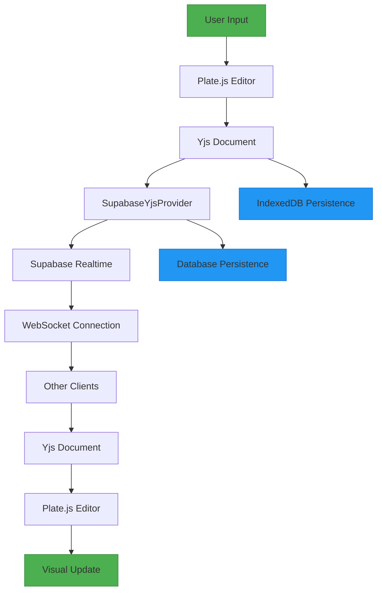
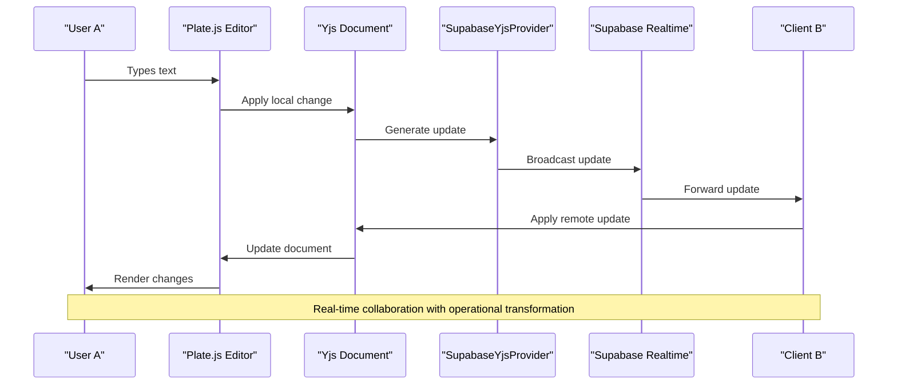
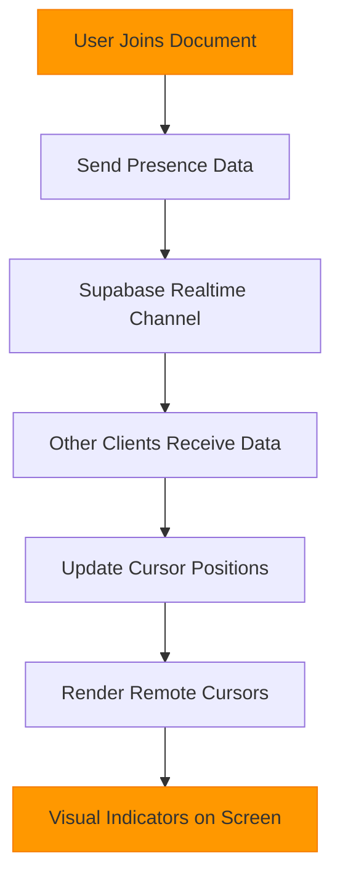

# Real-time Collaboration Data Flow

<cite>
**Referenced Files in This Document**   
- [use-yjs-collaboration.ts](file://hooks/use-yjs-collaboration.ts)
- [supabase-provider.ts](file://lib/yjs/supabase-provider.ts)
- [supabase-yjs-provider.ts](file://lib/yjs/supabase-yjs-provider.ts)
- [collaborative-plate-editor.tsx](file://components/plate/collaborative-plate-editor.tsx)
- [remote-cursors-overlay.tsx](file://components/documentos/remote-cursors-overlay.tsx)
- [cursor-overlay-kit.tsx](file://components/plate/cursor-overlay-kit.tsx)
- [cursor.tsx](file://components/cursor.tsx)
- [realtime-cursors.tsx](file://components/realtime-cursors.tsx)
</cite>

## Table of Contents
1. [Introduction](#introduction)
2. [Architecture Overview](#architecture-overview)
3. [Core Components](#core-components)
4. [Data Flow Analysis](#data-flow-analysis)
5. [WebSocket Connection Management](#websocket-connection-management)
6. [Conflict Resolution and Operational Transformation](#conflict-resolution-and-operational-transformation)
7. [Presence Indicators and Remote Cursors](#presence-indicators-and-remote-cursors)
8. [Data Serialization and Persistence](#data-serialization-and-persistence)
9. [Performance Considerations](#performance-considerations)
10. [Conclusion](#conclusion)

## Introduction

Sinesys implements real-time collaborative document editing through the integration of Yjs, a CRDT-based framework, with Supabase Realtime for synchronization. This documentation details the data flow from user input in the collaborative editor through the synchronization pipeline to other clients. The system enables multiple users to simultaneously edit documents with automatic conflict resolution, presence indicators showing other users' cursors, and persistent storage of document state. The implementation leverages operational transformation principles through Yjs to ensure consistency across clients regardless of network latency or connection interruptions.

## Architecture Overview

The real-time collaboration architecture in Sinesys consists of several interconnected components that work together to provide seamless collaborative editing. At the core is the Yjs framework, which handles the CRDT (Conflict-Free Replicated Data Type) logic for conflict resolution. This is combined with Supabase Realtime for WebSocket-based communication between clients and the server. The Plate.js editor provides the rich text editing interface, while custom providers bridge the gap between these technologies.

**Diagram sources**
- [collaborative-plate-editor.tsx](file://components/plate/collaborative-plate-editor.tsx#L1-L220)
- [supabase-yjs-provider.ts](file://lib/yjs/supabase-yjs-provider.ts#L1-L358)

## Core Components

The real-time collaboration system in Sinesys is built on several key components that work together to enable seamless document editing across multiple clients. The `use-yjs-collaboration` hook serves as the primary interface for initializing and managing the collaboration session, handling the creation of Yjs documents and Supabase providers. The `SupabaseProvider` and `SupabaseYjsProvider` classes implement the custom provider logic that bridges Yjs with Supabase Realtime, enabling bidirectional synchronization of document updates. The `collaborative-plate-editor` component integrates these elements with the Plate.js rich text editor, providing a user interface for collaborative editing. Additionally, cursor and presence indicators are implemented through the awareness functionality in Yjs, allowing users to see where their collaborators are working in the document.

**Section sources**
- [use-yjs-collaboration.ts](file://hooks/use-yjs-collaboration.ts#L1-L201)
- [supabase-provider.ts](file://lib/yjs/supabase-provider.ts#L1-L251)
- [supabase-yjs-provider.ts](file://lib/yjs/supabase-yjs-provider.ts#L1-L358)
- [collaborative-plate-editor.tsx](file://components/plate/collaborative-plate-editor.tsx#L1-L220)

## Data Flow Analysis

The data flow for real-time collaboration in Sinesys follows a well-defined sequence from user input to synchronization with other clients. When a user makes an edit in the collaborative plate editor, the change is first captured by the Plate.js editor and applied to the local Yjs document. The Yjs document then generates an update message containing the operational transformation of the change. This update is intercepted by the `SupabaseYjsProvider`, which broadcasts it to other clients via the Supabase Realtime channel using the WebSocket connection. Upon receiving updates from other clients, the provider applies them to the local Yjs document, which in turn updates the Plate.js editor interface. The system implements a sync protocol where new clients request the full document state from existing clients, ensuring consistency across all participants. This flow enables real-time collaboration with minimal latency and automatic conflict resolution.

**Diagram sources**
- [collaborative-plate-editor.tsx](file://components/plate/collaborative-plate-editor.tsx#L1-L220)
- [supabase-yjs-provider.ts](file://lib/yjs/supabase-yjs-provider.ts#L1-L358)

## WebSocket Connection Management

WebSocket connection management in Sinesys is handled through the Supabase Realtime service, which provides a reliable and scalable foundation for real-time collaboration. The `SupabaseYjsProvider` establishes a persistent WebSocket connection to a dedicated channel named according to the document ID (e.g., "yjs-doc-{id}"). The provider implements connection lifecycle management including automatic reconnection when the connection is lost, with exponential backoff to prevent overwhelming the server during network instability. Connection status is monitored through subscription events, with the provider emitting connection change events when the status transitions between connected and disconnected states. The implementation includes self-filtering to prevent clients from receiving their own broadcast messages, reducing unnecessary processing. Additionally, the provider handles cleanup of resources when the component is unmounted, ensuring that WebSocket connections are properly closed to prevent memory leaks.

**Section sources**
- [supabase-yjs-provider.ts](file://lib/yjs/supabase-yjs-provider.ts#L1-L358)
- [supabase-provider.ts](file://lib/yjs/supabase-provider.ts#L1-L251)

## Conflict Resolution and Operational Transformation

Conflict resolution in Sinesys is achieved through the Yjs framework's implementation of CRDTs (Conflict-Free Replicated Data Types), which provides mathematical guarantees of convergence across all clients. When multiple users edit the same document simultaneously, Yjs automatically resolves conflicts using operational transformation principles, ensuring that all clients eventually reach the same state regardless of the order in which updates are received. Each operation is assigned a unique identifier based on the client ID and logical clock, allowing the system to deterministically merge concurrent changes. The framework handles complex scenarios such as simultaneous insertions at the same position by using a total ordering based on client IDs. This approach eliminates the need for locking mechanisms and allows users to work freely without being blocked by others' edits. The system also supports undo/redo functionality that works correctly in collaborative contexts by tracking operations with their causal dependencies.

**Section sources**
- [supabase-yjs-provider.ts](file://lib/yjs/supabase-yjs-provider.ts#L1-L358)
- [use-yjs-collaboration.ts](file://hooks/use-yjs-collaboration.ts#L1-L201)

## Presence Indicators and Remote Cursors

Presence indicators and remote cursors in Sinesys are implemented using Yjs's awareness functionality, which allows clients to share presence information in addition to document content. When a user joins a collaborative session, their presence data (name, color, and cursor position) is shared with other clients through the Supabase Realtime channel. The `RemoteCursorsOverlay` component renders visual indicators showing where other users are currently working in the document. Each cursor is displayed with a unique color generated from the user's ID, ensuring visual distinction between collaborators. The system uses throttling to limit the frequency of cursor position updates, reducing network traffic while maintaining a responsive user experience. The `CursorOverlayKit` integrates with Plate.js to provide the rendering layer for these indicators, positioning them accurately relative to the document content. This presence system enhances collaboration by providing spatial awareness of other users' activities within the document.

**Diagram sources**
- [remote-cursors-overlay.tsx](file://components/documentos/remote-cursors-overlay.tsx#L1-L48)
- [cursor-overlay-kit.tsx](file://components/plate/cursor-overlay-kit.tsx#L1-L14)
- [supabase-yjs-provider.ts](file://lib/yjs/supabase-yjs-provider.ts#L1-L358)

**Section sources**
- [remote-cursors-overlay.tsx](file://components/documentos/remote-cursors-overlay.tsx#L1-L48)
- [cursor-overlay-kit.tsx](file://components/plate/cursor-overlay-kit.tsx#L1-L14)
- [realtime-cursors.tsx](file://components/realtime-cursors.tsx#L1-L30)

## Data Serialization and Persistence

Data serialization and persistence in Sinesys follows a multi-layered approach to ensure document integrity and availability. Document state is serialized using Yjs's binary format, which efficiently encodes operational transformations as Uint8Array buffers. These updates are converted to JSON-safe arrays when transmitted over Supabase Realtime, as WebSockets require text-based payloads. For persistence, the system implements both client-side and server-side storage. Client-side, the `IndexeddbPersistence` adapter automatically saves document state to the browser's IndexedDB, enabling offline editing and quick recovery after page reloads. Server-side, document snapshots are periodically persisted to the database through Supabase, with full state synchronization occurring when clients join or leave the collaboration session. The `use-yjs-collaboration` hook manages the persistence lifecycle, handling the initial loading of document state from storage and the periodic saving of changes. This dual persistence strategy ensures data durability while maintaining the responsiveness required for real-time collaboration.

**Section sources**
- [use-yjs-collaboration.ts](file://hooks/use-yjs-collaboration.ts#L1-L201)
- [supabase-yjs-provider.ts](file://lib/yjs/supabase-yjs-provider.ts#L1-L358)

## Performance Considerations

Performance considerations for real-time collaboration in Sinesys focus on optimizing the user experience for both small and large documents. For large documents, the system implements several optimizations to maintain responsiveness. Update batching reduces the frequency of WebSocket messages by combining multiple small changes into single transmissions. Throttling is applied to non-essential updates like cursor positions, preventing excessive network traffic. The Yjs framework's efficient data structure minimizes memory usage by only storing operational transformations rather than complete document versions. Network latency is mitigated through local-first editing, where changes are immediately applied to the local document before being synchronized, providing instant feedback to users. The system also implements connection health monitoring and adaptive reconnection strategies to handle unstable network conditions. For very large documents, the implementation could be enhanced with document segmentation or lazy loading of content sections, though this is not currently implemented in the base system.

**Section sources**
- [use-yjs-collaboration.ts](file://hooks/use-yjs-collaboration.ts#L1-L201)
- [supabase-yjs-provider.ts](file://lib/yjs/supabase-yjs-provider.ts#L1-L358)
- [collaborative-plate-editor.tsx](file://components/plate/collaborative-plate-editor.tsx#L1-L220)

## Conclusion

The real-time collaboration system in Sinesys provides a robust foundation for multi-user document editing through the integration of Yjs, Supabase Realtime, and Plate.js. By leveraging CRDTs and operational transformation, the system ensures consistent document state across all clients while enabling seamless collaboration without conflicts. The architecture balances real-time responsiveness with data durability through a combination of WebSocket synchronization and multi-layered persistence. Presence indicators and remote cursors enhance the collaborative experience by providing spatial awareness of other users' activities. While the current implementation performs well for typical document sizes, future enhancements could include more sophisticated optimizations for very large documents and improved handling of edge cases in network connectivity. Overall, the system demonstrates a well-architected approach to real-time collaboration that prioritizes consistency, responsiveness, and user experience.