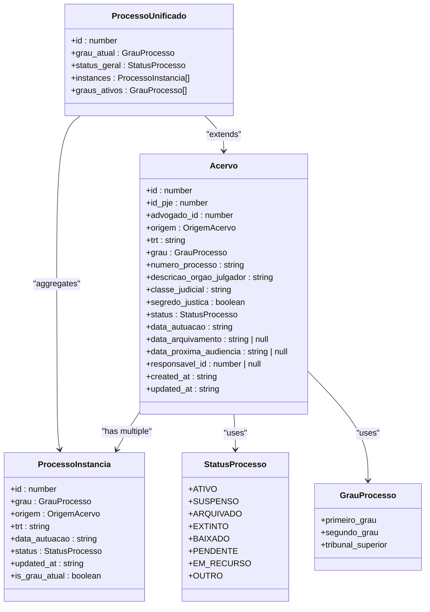
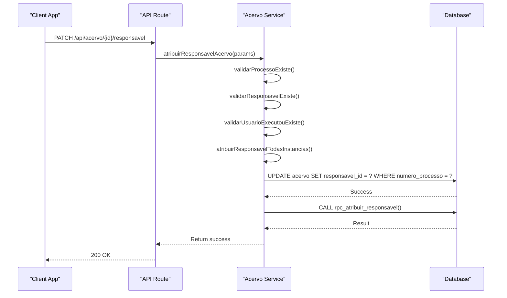
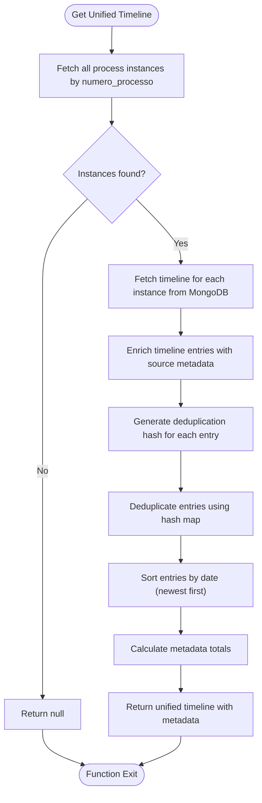
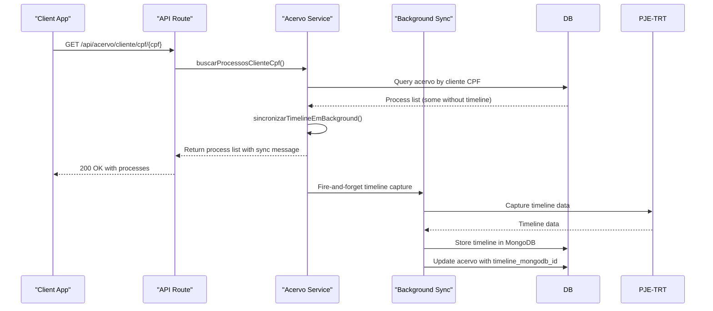

# Acervo Aggregate

<cite>
**Referenced Files in This Document**   
- [acervo.ts](file://types/domain/acervo.ts)
- [common.ts](file://types/domain/common.ts)
- [listar-acervo.service.ts](file://backend/acervo/services/listar-acervo.service.ts)
- [buscar-acervo.service.ts](file://backend/acervo/services/buscar-acervo.service.ts)
- [atribuir-responsavel.service.ts](file://backend/acervo/services/atribuir-responsavel.service.ts)
- [timeline-unificada.service.ts](file://backend/acervo/services/timeline/timeline-unificada.service.ts)
- [sincronizar-timeline-cpf.service.ts](file://backend/acervo/services/sincronizar-timeline-cpf.service.ts)
- [04_acervo.sql](file://supabase/schemas/04_acervo.sql)
- [route.ts](file://app/api/acervo/route.ts)
- [route.ts](file://app/api/acervo/[id]/route.ts)
</cite>

## Table of Contents
1. [Introduction](#introduction)
2. [Aggregate Structure](#aggregate-structure)
3. [Transactional Consistency and Business Invariants](#transactional-consistency-and-business-invariants)
4. [Timeline Management and Unification](#timeline-management-and-unification)
5. [Cross-Aggregate References and Eventual Consistency](#cross-aggregate-references-and-eventual-consistency)
6. [Implementation Considerations](#implementation-considerations)
7. [Conclusion](#conclusion)

## Introduction

The Acervo Aggregate in Sinesys is a central domain component responsible for managing legal process data, ensuring transactional consistency, and enforcing business invariants within its boundary. This aggregate serves as the primary source of truth for all legal processes tracked within the system, providing a unified view of multi-instance processes across different jurisdictional levels (first degree, second degree, etc.). The aggregate is designed to maintain data integrity during synchronization with external systems like PJE-TRT and to provide a consistent interface for querying and updating process information.

**Section sources**
- [acervo.ts](file://types/domain/acervo.ts#L1-L81)
- [common.ts](file://types/domain/common.ts#L1-L49)

## Aggregate Structure

The Acervo Aggregate is structured around the `Acervo` root entity, which represents a legal process instance within a specific jurisdictional level. The aggregate boundary includes the root entity and its associated value objects and entities, such as timeline events, process metadata, and related hearings. The `Acervo` interface defines the core properties of a legal process, including its identification number, jurisdictional information, status, and parties involved.

The aggregate also includes the `ProcessoUnificado` interface, which provides a unified view of a legal process that may have multiple instances across different jurisdictional levels. This unified view aggregates data from the primary instance with summaries of other instances, maintaining a coherent representation of the entire legal process lifecycle.

**Diagram sources **
- [acervo.ts](file://types/domain/acervo.ts#L15-L81)
- [common.ts](file://types/domain/common.ts#L33-L47)

**Section sources**
- [acervo.ts](file://types/domain/acervo.ts#L15-L81)
- [common.ts](file://types/domain/common.ts#L33-L47)

## Transactional Consistency and Business Invariants

The Acervo Aggregate enforces transactional consistency and business invariants through a combination of service-layer validation and database-level constraints. When updating the responsible party for a legal process, the aggregate ensures that all instances of the same process (identified by the same `numero_processo`) are updated atomically. This is achieved through the `atribuirResponsavelAcervo` service, which propagates the responsible party assignment to all instances of the process within a single transaction.

The aggregate also enforces business invariants such as data integrity during PJE-TRT synchronization. When a process is updated from the PJE-TRT system, the aggregate validates the incoming data against existing business rules before persisting the changes. This includes validating the process status, jurisdictional information, and party details to ensure consistency with the system's domain model.

**Diagram sources **
- [atribuir-responsavel.service.ts](file://backend/acervo/services/atribuir-responsavel.service.ts#L128-L196)
- [04_acervo.sql](file://supabase/schemas/04_acervo.sql)

**Section sources**
- [atribuir-responsavel.service.ts](file://backend/acervo/services/atribuir-responsavel.service.ts#L128-L196)
- [04_acervo.sql](file://supabase/schemas/04_acervo.sql)

## Timeline Management and Unification

The Acervo Aggregate manages timeline events for legal processes through the `timeline-unificada.service.ts` file, which provides a unified timeline view across multiple process instances. When retrieving the timeline for a process, the service aggregates timeline entries from all instances of the process (identified by the same `numero_processo`) and applies deduplication to remove redundant events.

The timeline unification process involves several steps: first, all instances of the process are retrieved from the database; then, the timeline for each instance is fetched from MongoDB; next, the timeline entries are enriched with metadata about their source instance; finally, the entries are deduplicated based on a hash generated from key properties like date, type, and title. This ensures that all timeline entries for a legal process belong to the same aggregate and maintains data integrity during the unification process.

**Diagram sources **
- [timeline-unificada.service.ts](file://backend/acervo/services/timeline/timeline-unificada.service.ts#L166-L281)

**Section sources**
- [timeline-unificada.service.ts](file://backend/acervo/services/timeline/timeline-unificada.service.ts#L166-L281)

## Cross-Aggregate References and Eventual Consistency

The Acervo Aggregate handles cross-aggregate references to clients and contracts through eventual consistency mechanisms. When a process is initially retrieved without a timeline (for example, when querying by client CPF), the system triggers a background synchronization process to capture the timeline data. This is implemented in the `sincronizar-timeline-cpf.service.ts` file, which uses a fire-and-forget approach to initiate timeline capture without blocking the main request.

This eventual consistency strategy allows the system to provide immediate feedback to users while ensuring that timeline data will be available for subsequent requests. The service returns a message indicating that the timeline is being synchronized and will be available shortly, creating a seamless user experience while maintaining system responsiveness.

**Diagram sources **
- [sincronizar-timeline-cpf.service.ts](file://backend/acervo/services/sincronizar-timeline-cpf.service.ts#L51-L99)
- [buscar-processos-cliente-cpf.service.ts](file://backend/acervo/services/buscar-processos-cliente-cpf.service.ts)

**Section sources**
- [sincronizar-timeline-cpf.service.ts](file://backend/acervo/services/sincronizar-timeline-cpf.service.ts#L51-L99)
- [buscar-processos-cliente-cpf.service.ts](file://backend/acervo/services/buscar-processos-cliente-cpf.service.ts)

## Implementation Considerations

The Acervo Aggregate implementation includes several considerations for performance and scalability. The aggregate uses Redis caching to improve query performance, with a 15-minute TTL for list and detail queries. This reduces database load and improves response times for frequently accessed data.

For large timeline operations, the aggregate employs a lazy synchronization strategy, where timeline data is captured in the background rather than synchronously during the initial request. This prevents long response times and timeouts when dealing with processes that have extensive timelines.

The aggregate also includes mechanisms for handling aggregate size, such as pagination and filtering options in the list endpoints. These allow clients to retrieve only the data they need, reducing memory usage and network bandwidth.

**Section sources**
- [listar-acervo.service.ts](file://backend/acervo/services/persistence/listar-acervo.service.ts#L78-L222)
- [sincronizar-timeline-cpf.service.ts](file://backend/acervo/services/sincronizar-timeline-cpf.service.ts)

## Conclusion

The Acervo Aggregate in Sinesys effectively manages complex domain logic for legal process tracking by maintaining transactional consistency, enforcing business invariants, and providing a unified view of multi-instance processes. Through careful design of its aggregate boundary and implementation of eventual consistency patterns, the system balances data integrity with performance and responsiveness. The aggregate's structure and implementation provide a robust foundation for managing legal process data in a complex, multi-jurisdictional environment.