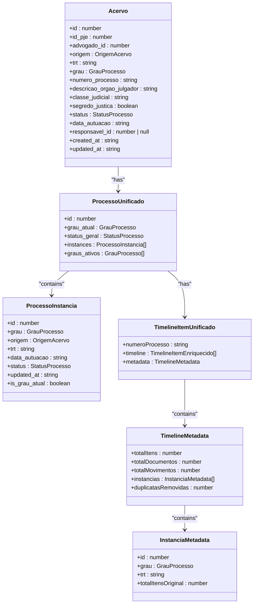
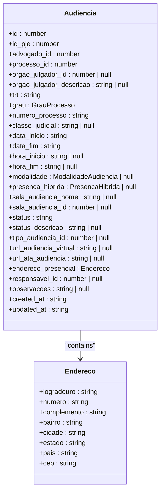
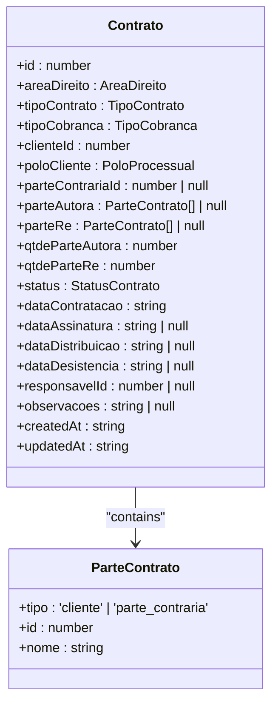
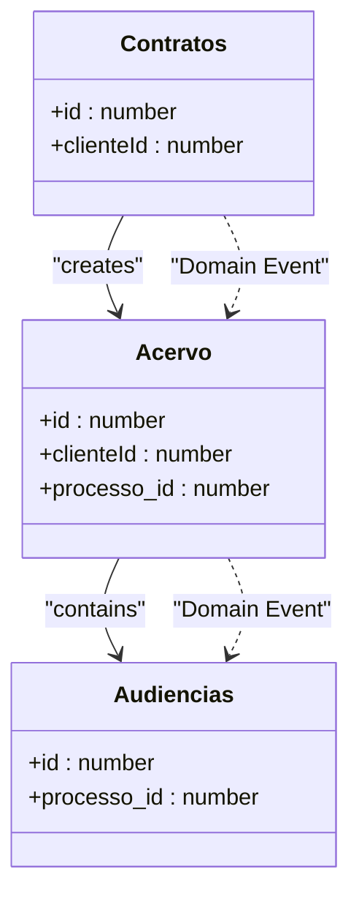

# Aggregates

<cite>
**Referenced Files in This Document**   
- [acervo.ts](file://types/domain/acervo.ts)
- [audiencias.ts](file://types/domain/audiencias.ts)
- [contrato-persistence.service.ts](file://backend/contratos/services/persistence/contrato-persistence.service.ts)
- [timeline-unificada.service.ts](file://backend/acervo/services/timeline/timeline-unificada.service.ts)
- [criar-audiencia.service.ts](file://backend/audiencias/services/criar-audiencia.service.ts)
- [criar-contrato.service.ts](file://backend/contratos/services/contratos/criar-contrato.service.ts)
- [listar-acervo.service.ts](file://backend/acervo/services/persistence/listar-acervo.service.ts)
- [listar-audiencias.service.ts](file://backend/audiencias/services/persistence/listar-audiencias.service.ts)
- [route.ts](file://app/api/acervo/route.ts)
- [route.ts](file://app/api/audiencias/route.ts)
- [route.ts](file://app/api/contratos/route.ts)
- [04_acervo.sql](file://supabase/schemas/04_acervo.sql)
- [07_audiencias.sql](file://supabase/schemas/07_audiencias.sql)
- [11_contratos.sql](file://supabase/schemas/11_contratos.sql)
</cite>

## Table of Contents
1. [Introduction](#introduction)
2. [Acervo Aggregate](#acervo-aggregate)
3. [Audiencias Aggregate](#audiencias-aggregate)
4. [Contratos Aggregate](#contratos-aggregate)
5. [Aggregate Relationships and Cross-Aggregate References](#aggregate-relationships-and-cross-aggregate-references)
6. [Implementation Considerations](#implementation-considerations)
7. [Conclusion](#conclusion)

## Introduction
The Sinesys application implements the Domain-Driven Design (DDD) concept of Aggregates to manage complex domain logic, maintain transactional consistency, and enforce business invariants. Aggregates are clusters of domain objects that are treated as a single unit for data changes. Each aggregate has a root entity that serves as the only entry point for external objects, ensuring that all business rules and invariants are maintained within the aggregate boundary. This document details the implementation of key aggregates in Sinesys, including Acervo, Audiencias, and Contratos, explaining their structure, consistency rules, and benefits in managing complex domain logic.

## Acervo Aggregate

The Acervo aggregate is centered around the `Acervo` root entity, which represents a judicial process in the system. This aggregate is responsible for maintaining the integrity of the process data, including its timeline of events. The `Acervo` entity contains several value objects and associated entities that are tightly coupled to the process lifecycle.

The aggregate ensures transactional consistency by treating all changes to the process and its timeline as a single unit. For example, when a new timeline event is added, the entire operation is atomic, preventing partial updates that could lead to inconsistent state. The aggregate also enforces business invariants, such as ensuring that all timeline entries for a legal process belong to the same aggregate, thus maintaining process integrity.

**Diagram sources**
- [acervo.ts](file://types/domain/acervo.ts#L15-L80)
- [timeline-unificada.service.ts](file://backend/acervo/services/timeline/timeline-unificada.service.ts#L16-L281)

**Section sources**
- [acervo.ts](file://types/domain/acervo.ts#L15-L80)
- [timeline-unificada.service.ts](file://backend/acervo/services/timeline/timeline-unificada.service.ts#L16-L281)

## Audiencias Aggregate

The Audiencias aggregate is built around the `Audiencia` root entity, which represents a court hearing. This aggregate manages all data related to a hearing, including its scheduling, participants, and status. The `Audiencia` entity contains value objects such as `endereco_presencial` which encapsulates the physical address details for in-person hearings.

The aggregate enforces business rules such as ensuring that a hearing cannot be scheduled without a valid process ID and that the status transitions are valid (e.g., from "Marcada" to "Realizada" or "Cancelada"). The aggregate also handles the complexity of hybrid hearings, where it must track which party (advogado or cliente) will attend in person.

**Diagram sources**
- [audiencias.ts](file://types/domain/audiencias.ts#L25-L77)

**Section sources**
- [audiencias.ts](file://types/domain/audiencias.ts#L25-L77)
- [criar-audiencia.service.ts](file://backend/audiencias/services/criar-audiencia.service.ts#L9-L110)

## Contratos Aggregate

The Contratos aggregate is centered on the `Contrato` root entity, which represents a legal contract between a client and the law firm. This aggregate manages the contract lifecycle, including its creation, status changes, and associated parties. The `Contrato` entity contains value objects such as `ParteContrato` which represents the parties involved in the contract.

The aggregate enforces business invariants such as ensuring that a contract must have a valid client and that the status transitions follow a specific workflow (e.g., from "em_contratacao" to "contratado"). The aggregate also handles the complexity of multiple parties, allowing for both clients and opposing parties to be associated with a single contract.

**Diagram sources**
- [contrato-persistence.service.ts](file://backend/contratos/services/persistence/contrato-persistence.service.ts#L68-L91)

**Section sources**
- [contrato-persistence.service.ts](file://backend/contratos/services/persistence/contrato-persistence.service.ts#L68-L91)
- [criar-contrato.service.ts](file://backend/contratos/services/contratos/criar-contrato.service.ts#L13-L46)

## Aggregate Relationships and Cross-Aggregate References

While each aggregate maintains its own consistency boundary, they are interconnected through well-defined relationships. The Acervo aggregate references the Contratos aggregate through the `clienteId` field, establishing a link between a legal process and the contract that initiated it. Similarly, the Audiencias aggregate references the Acervo aggregate through the `processo_id` field, ensuring that each hearing is associated with a specific legal process.

Cross-aggregate references are handled through eventual consistency and domain events. For example, when a new contract is created in the Contratos aggregate, a domain event is published that can be consumed by the Acervo aggregate to update its state. This approach allows for loose coupling between aggregates while maintaining data integrity across the system.

**Diagram sources**
- [acervo.ts](file://types/domain/acervo.ts#L15-L80)
- [contrato-persistence.service.ts](file://backend/contratos/services/persistence/contrato-persistence.service.ts#L68-L91)
- [audiencias.ts](file://types/domain/audiencias.ts#L25-L77)

**Section sources**
- [acervo.ts](file://types/domain/acervo.ts#L15-L80)
- [contrato-persistence.service.ts](file://backend/contratos/services/persistence/contrato-persistence.service.ts#L68-L91)
- [audiencias.ts](file://types/domain/audiencias.ts#L25-L77)

## Implementation Considerations

When implementing aggregates in Sinesys, several considerations were taken into account to ensure optimal performance and maintainability. Aggregate size was carefully managed to avoid overly large aggregates that could impact performance. For example, the Acervo aggregate includes the timeline events but does not include the entire history of the process, which is stored separately.

Performance implications were addressed through caching strategies and efficient database queries. The use of Redis for caching frequently accessed data reduced the load on the database and improved response times. Additionally, the implementation of domain events allowed for asynchronous processing of cross-aggregate updates, reducing the complexity of synchronous transactions.

Strategies for handling cross-aggregate references include the use of domain events and eventual consistency. This approach ensures that aggregates remain loosely coupled while still maintaining data integrity across the system. For example, when a new hearing is scheduled in the Audiencias aggregate, a domain event is published that can be consumed by the Acervo aggregate to update the process timeline.

## Conclusion

The implementation of aggregates in Sinesys provides a robust framework for managing complex domain logic and maintaining transactional consistency. By defining clear aggregate boundaries and enforcing business invariants within those boundaries, the system ensures data integrity and prevents invalid state transitions. The use of domain events and eventual consistency allows for flexible and scalable interactions between aggregates, making the system both maintainable and performant. The careful consideration of aggregate size and performance implications further enhances the overall architecture, providing a solid foundation for the application's domain model.