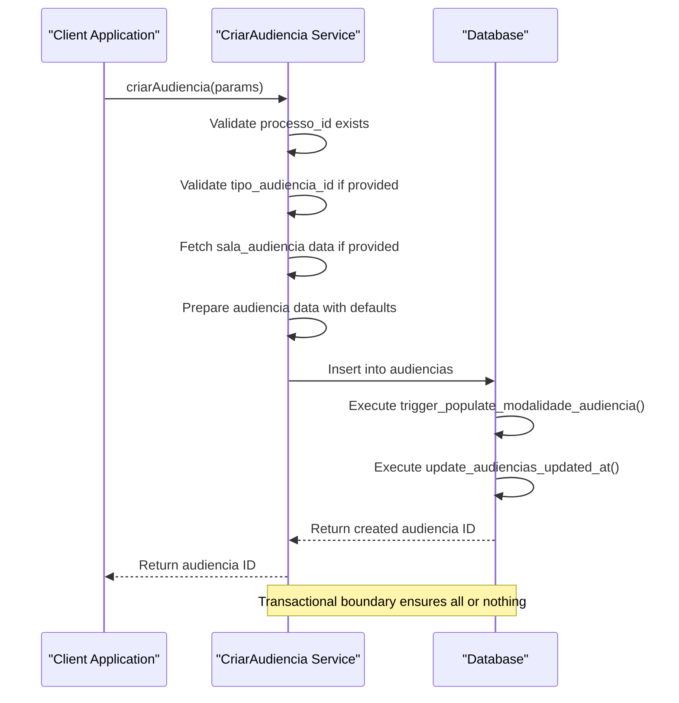
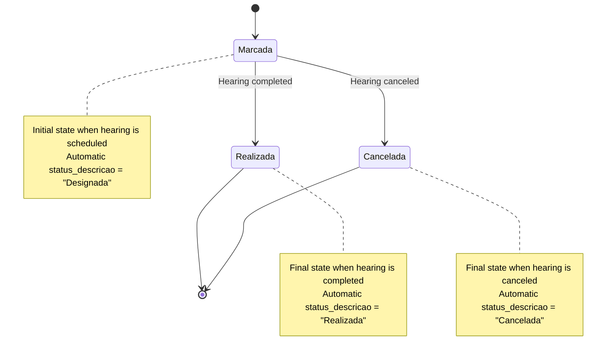
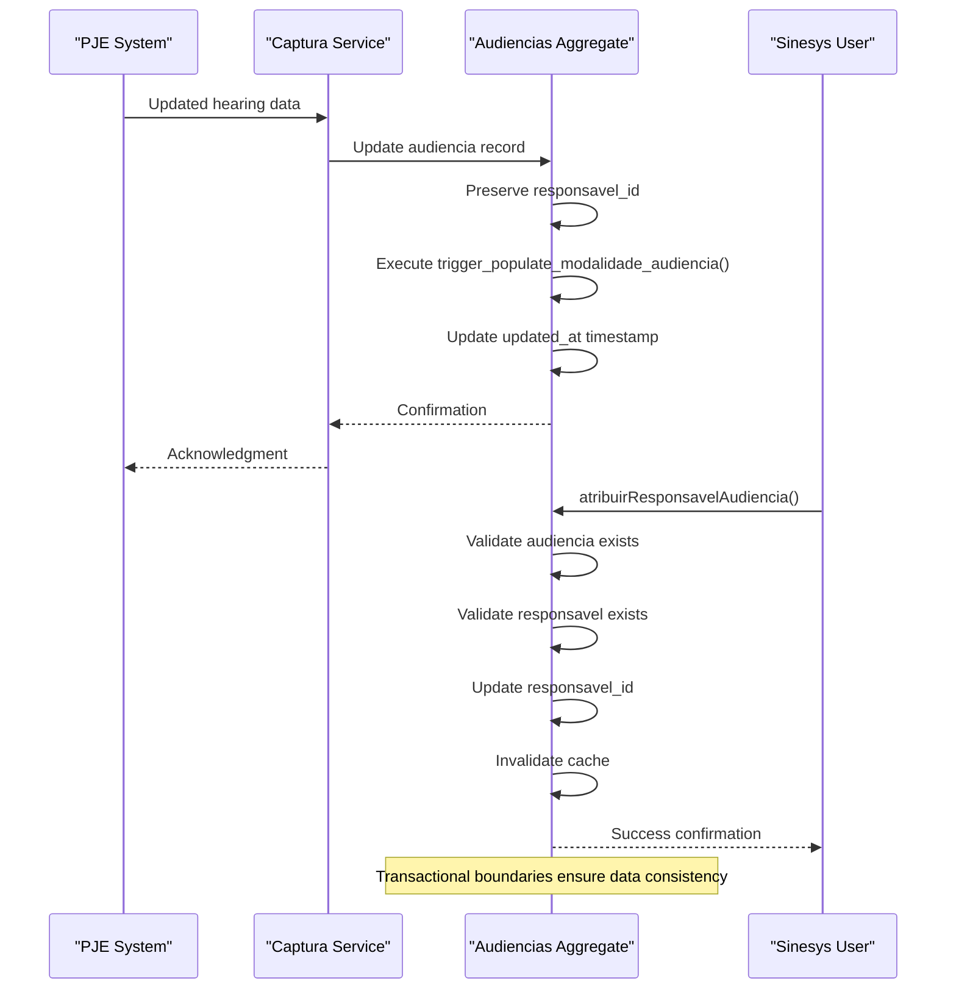
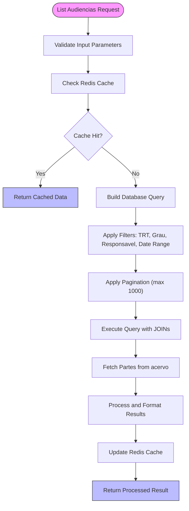

# Audiencias Aggregate

<cite>
**Referenced Files in This Document**   
- [07_audiencias.sql](file://supabase/schemas/07_audiencias.sql)
- [19_audiencias_auxiliares.sql](file://supabase/schemas/19_audiencias_auxiliares.sql)
- [audiencias.ts](file://types/domain/audiencias.ts)
- [criar-audiencia.service.ts](file://backend/audiencias/services/criar-audiencia.service.ts)
- [listar-audiencias.service.ts](file://backend/audiencias/services/listar-audiencias.service.ts)
- [persistence/listar-audiencias.service.ts](file://backend/audiencias/services/persistence/listar-audiencias.service.ts)
- [atribuir-responsavel.service.ts](file://backend/audiencias/services/atribuir-responsavel.service.ts)
- [atualizar-url-virtual.service.ts](file://backend/audiencias/services/atualizar-url-virtual.service.ts)
- [value-objects.ts](file://types/domain/value-objects.ts)
- [20250120000002_fix_audiencias_schema.sql](file://supabase/migrations/aplicadas/20250120000002_fix_audiencias_schema.sql)
- [distribuicao-inicial-audiencias.sql](file://scripts/api-audiencias/distribuicao-inicial-audiencias.sql)
- [spec.md](file://openspec/specs/audiencias/spec.md)
</cite>

## Table of Contents
1. [Introduction](#introduction)
2. [Aggregate Structure](#aggregate-structure)
3. [Transactional Consistency and Business Invariants](#transactional-consistency-and-business-invariants)
4. [Status Transitions and Lifecycle Management](#status-transitions-and-lifecycle-management)
5. [Hearing Rescheduling and Business Workflows](#hearing-rescheduling-and-business-workflows)
6. [Implementation Considerations](#implementation-considerations)
7. [Cross-Aggregate References and Eventual Consistency](#cross-aggregate-references-and-eventual-consistency)
8. [Conclusion](#conclusion)

## Introduction

The Audiencias Aggregate in Sinesys is a critical domain component responsible for managing court hearing scheduling and related business logic. This aggregate maintains transactional consistency for all hearing-related operations and enforces key business invariants within its bounded context. The implementation follows domain-driven design principles, with the Audiencia entity serving as the aggregate root that encapsulates all hearing-related data and behavior.

The aggregate is designed to handle complex domain logic for court hearing management, including virtual hearing URLs, responsible parties, status transitions, and hearing details. It ensures data integrity during all state changes and provides a consistent interface for hearing management operations. The implementation leverages both application-level services and database-level constraints to maintain consistency and enforce business rules.

This documentation provides a comprehensive analysis of the Audiencias aggregate, detailing its structure, consistency mechanisms, business invariants, and implementation considerations for performance and scalability.

**Section sources**
- [07_audiencias.sql](file://supabase/schemas/07_audiencias.sql)
- [audiencias.ts](file://types/domain/audiencias.ts)
- [spec.md](file://openspec/specs/audiencias/spec.md)

## Aggregate Structure

The Audiencias aggregate is structured around the Audiencia entity as the aggregate root, which maintains consistency boundaries for all hearing-related operations. The aggregate includes several associated entities and value objects that together represent a complete hearing record.

```mermaid
classDiagram
class Audiencia {
+id : number
+id_pje : number
+advogado_id : number
+processo_id : number
+orgao_julgador_id : number | null
+trt : string
+grau : GrauProcesso
+numero_processo : string
+data_inicio : string
+data_fim : string
+hora_inicio : string | null
+hora_fim : string | null
+modalidade : ModalidadeAudiencia | null
+presenca_hibrida : PresencaHibrida | null
+sala_audiencia_nome : string | null
+status : string
+status_descricao : string | null
+tipo_audiencia_id : number | null
+designada : boolean
+em_andamento : boolean
+documento_ativo : boolean
+polo_ativo_nome : string | null
+polo_passivo_nome : string | null
+url_audiencia_virtual : string | null
+endereco_presencial : object | null
+responsavel_id : number | null
+observacoes : string | null
+created_at : string
+updated_at : string
}
class ClasseJudicial {
+id : number
+id_pje : number
+trt : string
+grau : GrauProcesso
+codigo : string
+descricao : string
+sigla : string
}
class TipoAudiencia {
+id : number
+id_pje : number
+trt : string
+grau : GrauProcesso
+codigo : string
+descricao : string
+is_virtual : boolean
}
class SalaAudiencia {
+id : number
+id_pje : number | null
+trt : string
+grau : GrauProcesso
+orgao_julgador_id : number
+nome : string
}
class Endereco {
+logradouro : string | undefined
+numero : string | undefined
+complemento : string | undefined
+bairro : string | undefined
+cidade : string | undefined
+estado : string | undefined
+pais : string | undefined
+cep : string | undefined
}
Audiencia --> ClasseJudicial : "has reference"
Audiencia --> TipoAudiencia : "has reference"
Audiencia --> SalaAudiencia : "has reference"
Audiencia --> Endereco : "has value object"
Audiencia --> "Usuario" : "responsible"
Audiencia --> "Processo" : "belongs to"
```

**Diagram sources**
- [07_audiencias.sql](file://supabase/schemas/07_audiencias.sql)
- [19_audiencias_auxiliares.sql](file://supabase/schemas/19_audiencias_auxiliares.sql)
- [audiencias.ts](file://types/domain/audiencias.ts)

**Section sources**
- [07_audiencias.sql](file://supabase/schemas/07_audiencias.sql)
- [19_audiencias_auxiliares.sql](file://supabase/schemas/19_audiencias_auxiliares.sql)
- [audiencias.ts](file://types/domain/audiencias.ts)

## Transactional Consistency and Business Invariants

The Audiencias aggregate maintains transactional consistency through a combination of database constraints, triggers, and application-level validation. The aggregate root ensures that all business invariants are preserved during state transitions and that data integrity is maintained across all operations.

The primary business invariants enforced by the aggregate include:

1. **Uniqueness of Hearing Records**: Each hearing is uniquely identified by the combination of `id_pje`, `trt`, `grau`, and `numero_processo`, preventing duplicate entries for the same hearing across different processes.

2. **Automatic Modalidade Calculation**: The hearing modality (virtual, presencial, or hibrida) is automatically calculated based on the presence of a virtual URL, type of hearing, or physical address. This is enforced through a database trigger that runs before insert or update operations.

3. **Status Description Population**: The human-readable status description is automatically populated based on the status code (M=Designada, F=Realizada, C=Cancelada) through a database trigger, ensuring consistency between code and description.

4. **Data Integrity Constraints**: The database schema includes foreign key constraints that ensure referential integrity between the audiencias table and related tables such as advogados, acervo (processos), orgao_julgador, tipo_audiencia, and usuarios.

The following code snippet demonstrates how the aggregate maintains consistency during creation of a new hearing:



**Diagram sources**
- [07_audiencias.sql](file://supabase/schemas/07_audiencias.sql)
- [criar-audiencia.service.ts](file://backend/audiencias/services/criar-audiencia.service.ts)

**Section sources**
- [07_audiencias.sql](file://supabase/schemas/07_audiencias.sql)
- [criar-audiencia.service.ts](file://backend/audiencias/services/criar-audiencia.service.ts)
- [20250120000002_fix_audiencias_schema.sql](file://supabase/migrations/aplicadas/20250120000002_fix_audiencias_schema.sql)

## Status Transitions and Lifecycle Management

The Audiencias aggregate implements a well-defined lifecycle for hearing management through its status system. The status field represents the current state of a hearing, with three primary states: 'M' (Marcada/Designada), 'F' (Finalizada/Realizada), and 'C' (Cancelada). These status transitions are carefully managed to ensure valid state changes and maintain business rules.

The aggregate enforces status transitions through both application logic and database constraints. When a hearing is created, it is automatically assigned the 'M' (Marcada) status, indicating it is scheduled. The transition to 'F' (Realizada) or 'C' (Cancelada) can occur through updates from the PJE system or manual operations within Sinesys.

A key feature of the status management is the automatic population of the `status_descricao` field through a database trigger. This ensures that the human-readable description is always consistent with the status code, eliminating the possibility of mismatched values. The trigger function `populate_audiencia_status_descricao()` executes before any insert or update operation on the status field, setting the appropriate description based on the status code.

The aggregate also maintains historical data through the `dados_anteriores` field, which stores the previous state of the record before updates. This provides an audit trail of changes while preserving the current state's integrity within the aggregate boundary. This approach allows the system to track the evolution of hearing details without compromising the consistency of the current state.



**Diagram sources**
- [07_audiencias.sql](file://supabase/schemas/07_audiencias.sql)
- [20250120000002_fix_audiencias_schema.sql](file://supabase/migrations/aplicadas/20250120000002_fix_audiencias_schema.sql)

**Section sources**
- [07_audiencias.sql](file://supabase/schemas/07_audiencias.sql)
- [20250120000002_fix_audiencias_schema.sql](file://supabase/migrations/aplicadas/20250120000002_fix_audiencias_schema.sql)
- [audiencias.ts](file://types/domain/audiencias.ts)

## Hearing Rescheduling and Business Workflows

The Audiencias aggregate handles hearing rescheduling through a combination of automated processes and manual interventions, following proper business workflows to maintain data integrity. When a hearing is rescheduled in the PJE system, the capture process updates the existing hearing record in Sinesys rather than creating a new one, preserving the aggregate's identity and maintaining referential integrity.

The rescheduling workflow follows these key principles:

1. **Preservation of Management Data**: When a hearing is updated from the PJE system, the aggregate ensures that manually managed fields such as `responsavel_id` are preserved. This separation of concerns allows automated data (from PJE) and manual data (from users) to coexist without conflict.

2. **Automatic Modality Determination**: The hearing modality is automatically recalculated whenever the hearing details change. The trigger function `populate_modalidade_audiencia()` evaluates the presence of a virtual URL, the type of hearing, or a physical address to determine whether the hearing is virtual, presencial, or hibrida.

3. **Responsible Assignment**: The aggregate supports manual assignment of responsible parties through the `atribuir-responsavel.service.ts`. This service validates the existence of both the hearing and the responsible user before updating the `responsavel_id` field, ensuring referential integrity.

The following sequence diagram illustrates the hearing rescheduling workflow:



**Diagram sources**
- [07_audiencias.sql](file://supabase/schemas/07_audiencias.sql)
- [atribuir-responsavel.service.ts](file://backend/audiencias/services/atribuir-responsavel.service.ts)
- [distribuicao-inicial-audiencias.sql](file://scripts/api-audiencias/distribuicao-inicial-audiencias.sql)

**Section sources**
- [07_audiencias.sql](file://supabase/schemas/07_audiencias.sql)
- [atribuir-responsavel.service.ts](file://backend/audiencias/services/atribuir-responsavel.service.ts)
- [distribuicao-inicial-audiencias.sql](file://scripts/api-audiencias/distribuicao-inicial-audiencias.sql)

## Implementation Considerations

The Audiencias aggregate implementation includes several considerations for performance, scalability, and usability, particularly in relation to calendar view operations and aggregate size management.

### Performance Implications for Calendar Views

The aggregate is optimized for calendar view operations through strategic indexing and caching mechanisms. The database schema includes multiple indexes on fields commonly used in calendar queries, such as `data_inicio`, `data_fim`, `trt`, `grau`, and `responsavel_id`. These indexes enable efficient retrieval of hearings within specific date ranges, which is critical for calendar-based visualizations.

Additionally, the implementation includes Redis-based caching for list operations through the `getCached` and `setCached` functions in the persistence layer. The `listar-audiencias.service.ts` uses a cache key generation function `getAudienciasListKey()` to create unique cache keys based on query parameters, ensuring that frequently accessed views are served from cache when possible.

The service also implements pagination with a maximum limit of 1000 records per request, which balances the need for comprehensive data retrieval with performance considerations for calendar views that may need to display large numbers of hearings.

### Aggregate Size Management

The aggregate size is managed through a clear separation of concerns between automated data from PJE and manual management data. Fields like `responsavel_id`, `observacoes`, and `url_audiencia_virtual` are specifically designated for manual input, while other fields are populated from the PJE system. This separation prevents the aggregate from becoming overly complex while still supporting necessary business functionality.

The implementation also includes the `dados_anteriores` field to store previous state information, which could potentially increase the aggregate size over time. However, this is justified by the business need for audit trails and change tracking, and the JSONB format in PostgreSQL provides efficient storage for this historical data.



**Diagram sources**
- [persistence/listar-audiencias.service.ts](file://backend/audiencias/services/persistence/listar-audiencias.service.ts)
- [07_audiencias.sql](file://supabase/schemas/07_audiencias.sql)

**Section sources**
- [persistence/listar-audiencias.service.ts](file://backend/audiencias/services/persistence/listar-audiencias.service.ts)
- [07_audiencias.sql](file://supabase/schemas/07_audiencias.sql)

## Cross-Aggregate References and Eventual Consistency

The Audiencias aggregate handles cross-aggregate references to legal processes and users through a combination of foreign key relationships and eventual consistency patterns. While the aggregate maintains strong consistency within its boundary, it interacts with other aggregates (Processos and Usuarios) through well-defined interfaces.

### References to Legal Processes

The aggregate maintains a direct reference to the Processos aggregate through the `processo_id` foreign key, which references the `acervo` table. This relationship enables efficient JOIN operations to retrieve process-related information such as `numero_processo`, `classe_judicial`, and party names. However, the aggregate is designed to function even when the referenced process does not exist, with appropriate null handling in the application layer.

When a hearing is created manually, the service validates the existence of the process and retrieves necessary data to populate the hearing record. This ensures data consistency at creation time while allowing the aggregate to operate independently of the Processos aggregate during normal operations.

### References to Users

The `responsavel_id` field maintains a reference to the Usuarios aggregate, allowing assignment of responsible parties to hearings. The `atribuir-responsavel.service.ts` validates the existence of both the hearing and the responsible user before updating the relationship, ensuring referential integrity.

The implementation uses eventual consistency for user-related operations through Redis cache invalidation. When a responsible party is assigned or changed, the service calls `invalidateAudienciasCache()` to ensure that subsequent queries return the updated data. This pattern balances immediate consistency for the core aggregate data with eventual consistency for cached views.

### Domain Events

While the current implementation does not explicitly show domain event publishing, the design supports event-driven communication through the use of database triggers and service-level hooks. For example, the `dados_anteriores` field could be used to detect changes and potentially trigger domain events for downstream consumers, such as notification services or reporting systems.

The separation between automated data (from PJE) and manual data (user assignments) also facilitates event-driven architectures, as changes to manual data could trigger specific events without being overwhelmed by frequent updates from the PJE system.

**Section sources**
- [criar-audiencia.service.ts](file://backend/audiencias/services/criar-audiencia.service.ts)
- [atribuir-responsavel.service.ts](file://backend/audiencias/services/atribuir-responsavel.service.ts)
- [07_audiencias.sql](file://supabase/schemas/07_audiencias.sql)

## Conclusion

The Audiencias aggregate in Sinesys provides a robust implementation for managing court hearing scheduling with strong transactional consistency and well-enforced business invariants. By designating the Audiencia entity as the aggregate root, the system ensures that all hearing-related operations maintain data integrity and follow proper business workflows.

Key strengths of the implementation include:

1. **Comprehensive Business Rule Enforcement**: The aggregate uses database triggers and application-level validation to enforce critical business rules, such as automatic modality determination and status description population.

2. **Clear Consistency Boundaries**: The aggregate maintains a well-defined boundary that encapsulates all hearing-related data and behavior, preventing invalid state transitions and ensuring data integrity.

3. **Optimized for Calendar Operations**: Through strategic indexing and caching, the implementation performs efficiently for calendar-based views that require date-range queries.

4. **Separation of Concerns**: The design clearly separates automated data from PJE and manual management data, allowing the system to handle both integration and user-driven operations effectively.

5. **Scalable Cross-Aggregate Interactions**: The implementation handles references to other aggregates (Processos and Usuarios) through foreign keys and eventual consistency patterns, balancing performance with data integrity.

The Audiencias aggregate demonstrates how domain-driven design principles can be effectively applied to complex legal scheduling systems, providing a maintainable and scalable solution for court hearing management.

**Section sources**
- [07_audiencias.sql](file://supabase/schemas/07_audiencias.sql)
- [audiencias.ts](file://types/domain/audiencias.ts)
- [criar-audiencia.service.ts](file://backend/audiencias/services/criar-audiencia.service.ts)