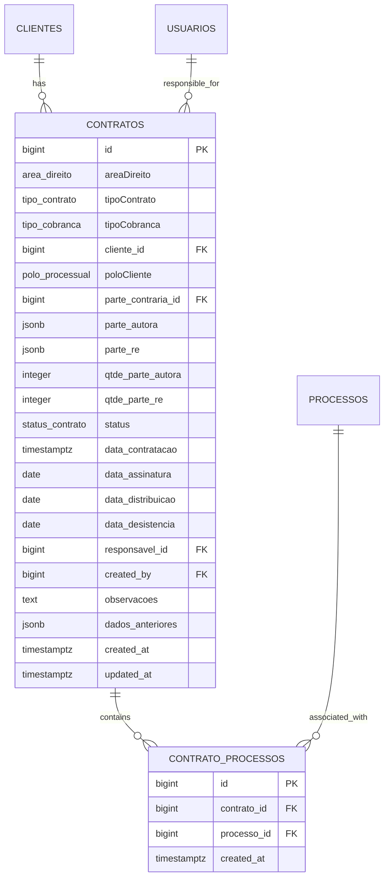
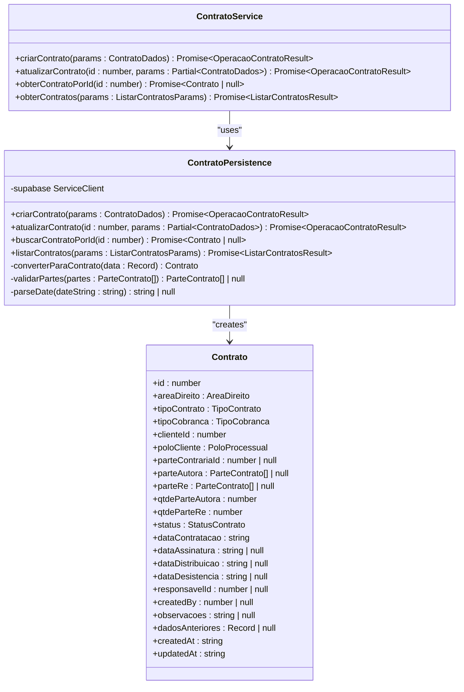
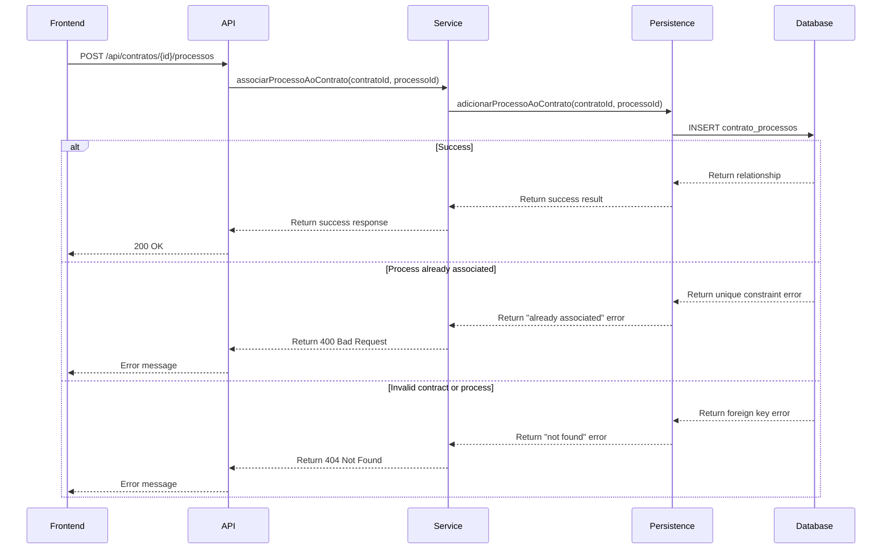

# Contratos Aggregate

<cite>
**Referenced Files in This Document**   
- [contrato-persistence.service.ts](file://backend/contratos/services/persistence/contrato-persistence.service.ts)
- [contrato-processo-persistence.service.ts](file://backend/contratos/services/persistence/contrato-processo-persistence.service.ts)
- [criar-contrato.service.ts](file://backend/contratos/services/contratos/criar-contrato.service.ts)
- [atualizar-contrato.service.ts](file://backend/contratos/services/contratos/atualizar-contrato.service.ts)
- [gerenciar-processos.service.ts](file://backend/contratos/services/contratos/gerenciar-processos.service.ts)
- [gerar-conta-receber-contrato.service.ts](file://backend/contratos/services/contratos/gerar-conta-receber-contrato.service.ts)
- [11_contratos.sql](file://supabase/schemas/11_contratos.sql)
- [12_contrato_processos.sql](file://supabase/schemas/12_contrato_processos.sql)
- [contratos.ts](file://app/_lib/types/contratos.ts)
</cite>

## Table of Contents
1. [Introduction](#introduction)
2. [Aggregate Structure](#aggregate-structure)
3. [Transactional Consistency and Business Invariants](#transactional-consistency-and-business-invariants)
4. [Core Components and Services](#core-components-and-services)
5. [Process Association Management](#process-association-management)
6. [Payment Schedule Generation](#payment-schedule-generation)
7. [Implementation Considerations](#implementation-considerations)
8. [Conclusion](#conclusion)

## Introduction

The Contratos Aggregate in Sinesys represents a critical domain component responsible for managing contract lifecycle within a legal practice management system. This aggregate serves as the central authority for contract-related operations, ensuring data integrity and enforcing business rules across contract creation, modification, and associated processes. The aggregate is designed to maintain transactional consistency while handling complex domain logic involving client relationships, legal processes, and financial obligations. By encapsulating all contract-related entities and value objects within a single boundary, the Contratos Aggregate prevents invalid state transitions and ensures that all business invariants are preserved during operations. This documentation provides a comprehensive analysis of the aggregate's structure, behavior, and implementation, highlighting how it addresses the challenges of contract management in a legal context.

## Aggregate Structure

The Contratos Aggregate is structured around the Contrato entity as its aggregate root, which maintains consistency boundaries for all related entities and value objects. The aggregate root is responsible for enforcing business rules and maintaining data integrity across its entire object graph. The primary components within the aggregate boundary include the Contrato root entity, process associations through the contrato_processos relationship, and financial obligations that are generated based on contract terms. The aggregate also manages client relationships, both as the primary contracting party and as parties involved in legal proceedings.

The aggregate structure is implemented with a clear separation between the domain model and persistence concerns. The Contrato entity contains essential contract information such as area of law, contract type, billing method, client information, and status tracking. It also maintains references to associated legal processes through the contrato_processos table, which establishes a many-to-many relationship between contracts and legal cases. The aggregate enforces referential integrity through database constraints and application-level validation, ensuring that all associated entities remain consistent with the aggregate root's state.

**Diagram sources**
- [11_contratos.sql](file://supabase/schemas/11_contratos.sql)
- [12_contrato_processos.sql](file://supabase/schemas/12_contrato_processos.sql)

**Section sources**
- [contrato-persistence.service.ts](file://backend/contratos/services/persistence/contrato-persistence.service.ts#L44-L91)
- [contrato-processo-persistence.service.ts](file://backend/contratos/services/persistence/contrato-processo-persistence.service.ts#L9-L14)

## Transactional Consistency and Business Invariants

The Contratos Aggregate ensures transactional consistency through a combination of database constraints, application-level validation, and service orchestration. When creating or updating a contract, the aggregate root validates all business invariants before persisting changes to the database. This includes verifying the existence of referenced entities such as clients and opposing parties, ensuring required fields are populated, and maintaining data consistency across related attributes. The aggregate employs a comprehensive validation strategy that checks both individual field validity and cross-field consistency requirements.

Business invariants are enforced through a series of validation rules implemented in the persistence layer. For example, when creating a new contract, the system verifies that the client exists in the database, that required fields such as area of law and contract type are provided, and that the billing method is valid. The aggregate also maintains historical data through the dados_anteriores field, which stores the previous state of the contract before updates, enabling audit trails and change tracking. This approach ensures that all modifications to the contract are traceable and that the system can reconstruct the contract's state at any point in time.

The aggregate implements optimistic concurrency control through the updated_at timestamp, which is automatically updated by a database trigger whenever a record is modified. This mechanism helps prevent race conditions when multiple users attempt to modify the same contract simultaneously. Additionally, the aggregate uses database-level constraints to enforce referential integrity, such as foreign key relationships to clients, opposing parties, and responsible users. These constraints ensure that the contract cannot reference non-existent entities, maintaining data consistency across the system.

**Section sources**
- [contrato-persistence.service.ts](file://backend/contratos/services/persistence/contrato-persistence.service.ts#L205-L257)
- [11_contratos.sql](file://supabase/schemas/11_contratos.sql#L13-L32)

## Core Components and Services

The Contratos Aggregate is supported by a suite of services that handle specific aspects of contract management. The core services include contract creation, update, retrieval, and listing operations, each implemented as separate modules to promote separation of concerns and maintainability. The criar-contrato.service.ts handles the creation of new contracts, performing comprehensive validation and business rule enforcement before persisting the data. Similarly, the atualizar-contrato.service.ts manages contract modifications, ensuring that all updates comply with business invariants and maintain data consistency.

The aggregate employs a layered architecture with clear separation between service interfaces and persistence implementation. The service layer contains the business logic and coordinates operations across multiple components, while the persistence layer handles database interactions and data access. This separation allows for easier testing and maintenance, as business rules can be modified without affecting data access patterns. The services also implement caching strategies to improve performance, particularly for frequently accessed contracts and lists of contracts with specific filters.

The aggregate root exposes a well-defined API through the service layer, providing methods for all essential contract operations. These include creating new contracts, updating existing contracts, retrieving individual contracts by ID, and listing contracts with various filtering options. Each service method follows a consistent pattern of input validation, business rule enforcement, database operation, and result formatting. The services also handle error conditions gracefully, providing meaningful error messages that can be used by the frontend to guide users through correction of invalid inputs.

**Diagram sources**
- [criar-contrato.service.ts](file://backend/contratos/services/contratos/criar-contrato.service.ts)
- [atualizar-contrato.service.ts](file://backend/contratos/services/contratos/atualizar-contrato.service.ts)
- [contrato-persistence.service.ts](file://backend/contratos/services/persistence/contrato-persistence.service.ts)

**Section sources**
- [criar-contrato.service.ts](file://backend/contratos/services/contratos/criar-contrato.service.ts#L13-L44)
- [atualizar-contrato.service.ts](file://backend/contratos/services/contratos/atualizar-contrato.service.ts#L13-L40)
- [contrato-persistence.service.ts](file://backend/contratos/services/persistence/contrato-persistence.service.ts#L199-L444)

## Process Association Management

The Contratos Aggregate provides robust management of process associations through dedicated services and persistence layers. The gerenciar-processos.service.ts handles all operations related to associating and disassociating legal processes with contracts, ensuring that these relationships are maintained consistently within the aggregate boundary. This functionality is critical for tracking which legal cases are covered under specific contracts, enabling proper billing and case management.

The process association mechanism implements several important business rules to maintain data integrity. When associating a process with a contract, the system validates that both the contract and process exist in the database, preventing orphaned relationships. The aggregate also enforces a uniqueness constraint through the contrato_processos table's composite primary key, ensuring that the same process cannot be associated with the same contract multiple times. This prevents duplicate entries and maintains clean data relationships.

The service layer provides a comprehensive API for process association management, including methods to add a process to a contract, remove a process from a contract, and list all processes associated with a specific contract. These operations are designed to be idempotent where appropriate, allowing for safe retries without creating duplicate data. The listing functionality supports pagination and sorting, enabling efficient retrieval of process associations even when a contract is linked to numerous legal cases.

**Diagram sources**
- [gerenciar-processos.service.ts](file://backend/contratos/services/contratos/gerenciar-processos.service.ts)
- [contrato-processo-persistence.service.ts](file://backend/contratos/services/persistence/contrato-processo-persistence.service.ts)
- [12_contrato_processos.sql](file://supabase/schemas/12_contrato_processos.sql)

**Section sources**
- [gerenciar-processos.service.ts](file://backend/contratos/services/contratos/gerenciar-processos.service.ts#L15-L39)
- [contrato-processo-persistence.service.ts](file://backend/contratos/services/persistence/contrato-processo-persistence.service.ts#L60-L155)
- [12_contrato_processos.sql](file://supabase/schemas/12_contrato_processos.sql#L10-L11)

## Payment Schedule Generation

The Contratos Aggregate includes functionality for generating payment schedules based on contract terms through the gerar-conta-receber-contrato.service.ts. This service automates the creation of financial obligations from contract data, ensuring that billing is consistent with contractual agreements. The payment schedule generation supports both single payments and recurring installment plans, accommodating different billing arrangements such as lump-sum payments and periodic installments.

The service implements business rules that prevent the creation of financial obligations for contracts in certain states, such as those marked with "desistencia" (withdrawal). This ensures that no billing occurs for contracts that have been terminated or canceled. When generating payment schedules, the service validates the contract status and type of billing to determine the appropriate financial treatment. For example, contracts with "pro_exito" (success fee) billing may have different payment terms compared to those with "pro_labore" (fixed fee) arrangements.

The payment schedule generation process is designed to be flexible and configurable, allowing for different frequencies of recurring payments including weekly, bi-weekly, monthly, quarterly, semi-annual, and annual intervals. The service calculates payment dates based on the specified frequency and generates appropriate descriptions and categories for the financial entries. Each generated payment is linked back to the originating contract, creating an auditable trail from the financial obligation to the contractual agreement that spawned it.

**Section sources**
- [gerar-conta-receber-contrato.service.ts](file://backend/contratos/services/contratos/gerar-conta-receber-contrato.service.ts#L131-L334)
- [contrato-persistence.service.ts](file://backend/contratos/services/persistence/contrato-persistence.service.ts#L25-L26)

## Implementation Considerations

The Contratos Aggregate implementation addresses several important considerations related to performance, scalability, and maintainability. One key consideration is the aggregate size, which is managed through selective data loading and caching strategies. The service layer implements pagination for list operations and provides separate endpoints for retrieving detailed contract information versus summary lists, optimizing performance for different use cases. The caching mechanism, which uses Redis to store frequently accessed contract data, significantly reduces database load and improves response times for common operations.

For contract search operations, the implementation leverages database indexing strategies to ensure efficient query performance. The schema includes targeted indexes on fields commonly used for filtering, such as area of law, contract type, status, and client ID. Additionally, the implementation uses GIN indexes on JSONB fields to support efficient searching within complex data structures. These indexing strategies enable fast retrieval of contracts based on various criteria without requiring full table scans.

The aggregate handles cross-aggregate references through eventual consistency patterns and domain events. While the Contratos Aggregate maintains its own consistency boundary, it interacts with other aggregates such as Clients and Financial Obligations through well-defined interfaces. Changes to contract status or terms may trigger domain events that are processed asynchronously to update related systems, ensuring loose coupling between bounded contexts. This approach allows the Contratos Aggregate to maintain its transactional integrity while still coordinating with other parts of the system.

**Section sources**
- [contrato-persistence.service.ts](file://backend/contratos/services/persistence/contrato-persistence.service.ts#L486-L557)
- [11_contratos.sql](file://supabase/schemas/11_contratos.sql#L62-L75)

## Conclusion

The Contratos Aggregate in Sinesys provides a robust foundation for managing contract lifecycle in a legal practice environment. By establishing clear aggregate boundaries and enforcing business invariants, the implementation ensures data integrity and prevents invalid state transitions. The aggregate's design effectively balances transactional consistency with performance considerations, using caching and indexing strategies to optimize common operations while maintaining strict validation rules for data quality.

The implementation demonstrates several best practices in domain-driven design, including proper separation of concerns between service and persistence layers, comprehensive validation of business rules, and thoughtful handling of cross-aggregate relationships. The services are designed to be reusable and maintainable, with clear interfaces and well-documented behavior. Future enhancements could include more sophisticated approval workflows for contract modifications and enhanced integration with document management systems for contract templates and execution.

Overall, the Contratos Aggregate successfully addresses the complex requirements of contract management in a legal context, providing a reliable and scalable solution for tracking client agreements, associated legal processes, and financial obligations. The design principles applied in this implementation serve as a strong foundation for extending the system with additional features while maintaining data consistency and business rule enforcement.