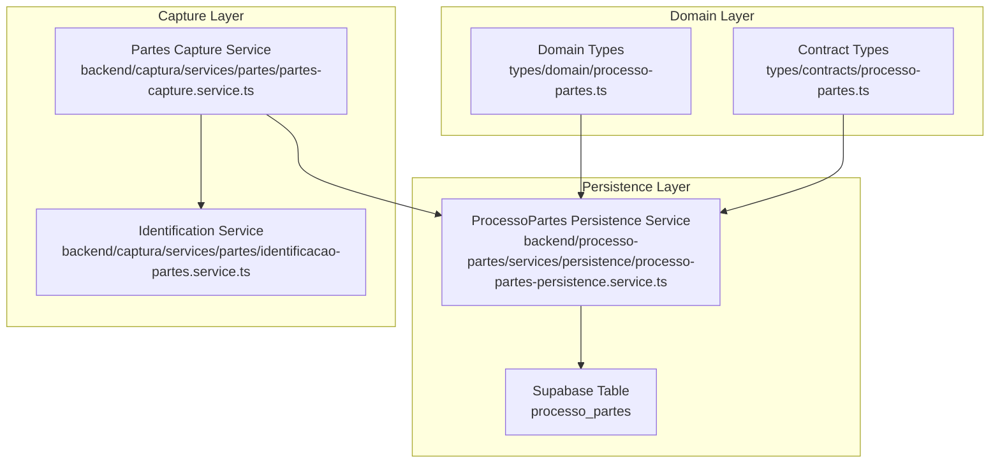
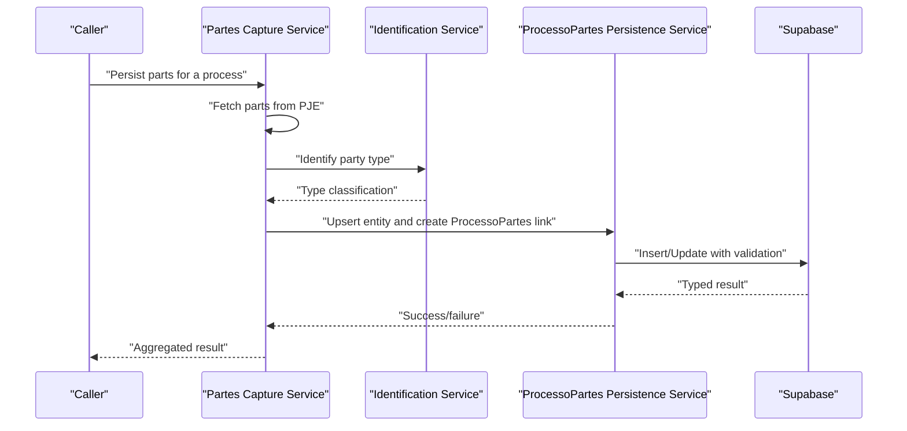
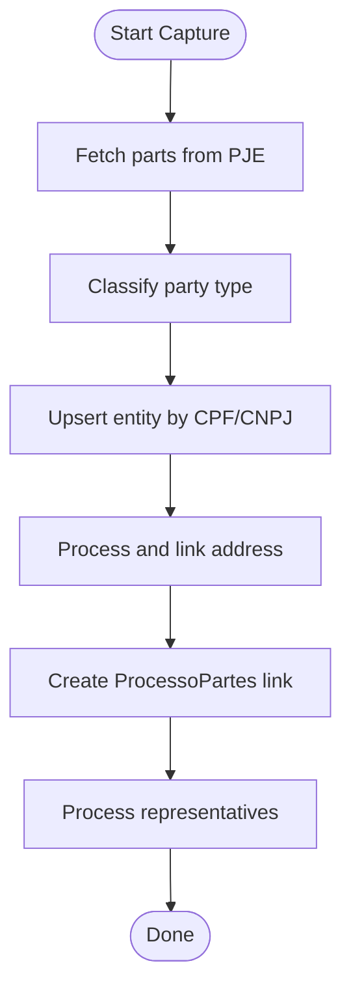
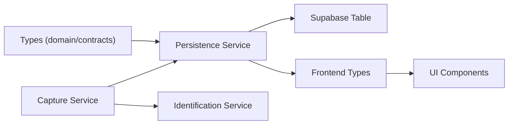

# Processo-Partes Aggregate

<cite>
**Referenced Files in This Document**
- [processo-partes README](file://backend/processo-partes/README.md)
- [processo-partes persistence service](file://backend/processo-partes/services/persistence/processo-partes-persistence.service.ts)
- [domain types](file://types/domain/processo-partes.ts)
- [contract types](file://types/contracts/processo-partes.ts)
- [frontend types](file://app/_lib/types/processo-partes.ts)
- [partes capture service](file://backend/captura/services/partes/partes-capture.service.ts)
- [partes identification service](file://backend/captura/services/partes/identificacao-partes.service.ts)
- [processo_partes migration](file://supabase/migrations/aplicadas/20251127000000_create_processo_partes.sql)
- [processo_partes constraint fix migration](file://supabase/migrations/aplicadas/20251125000004_fix_processo_partes_constraint.sql)
- [database-partes spec](file://openspec/specs/database-partes/spec.md)
</cite>

## Table of Contents
1. [Introduction](#introduction)
2. [Project Structure](#project-structure)
3. [Core Components](#core-components)
4. [Architecture Overview](#architecture-overview)
5. [Detailed Component Analysis](#detailed-component-analysis)
6. [Dependency Analysis](#dependency-analysis)
7. [Performance Considerations](#performance-considerations)
8. [Troubleshooting Guide](#troubleshooting-guide)
9. [Conclusion](#conclusion)
10. [Appendices](#appendices)

## Introduction
This document explains the Processo-Partes Aggregate in Sinesys, focusing on how the aggregate root (ProcessoPartes) maintains transactional consistency for party management in legal processes and enforces business invariants within its boundary. It covers the aggregate structure, including the root entity and its associated entities/value objects (party roles, representation relationships), and demonstrates concrete examples from the codebase showing aggregate boundaries and consistency rules. It also outlines benefits for legal representation tracking, implementation considerations (aggregate size, performance, cross-aggregate references), and strategies for eventual consistency.

## Project Structure
The Processo-Partes module centers around a dedicated persistence service and a set of strongly typed domain/contract models. The aggregate’s boundary is enforced by:
- A relational schema with explicit constraints and indexes
- A persistence service that validates and upserts records
- A capture pipeline that classifies parties and creates/upserts related entities before linking them via the aggregate

**Diagram sources**
- [processo-partes persistence service](file://backend/processo-partes/services/persistence/processo-partes-persistence.service.ts#L1-L701)
- [domain types](file://types/domain/processo-partes.ts#L1-L137)
- [contract types](file://types/contracts/processo-partes.ts#L1-L145)
- [processo_partes migration](file://supabase/migrations/aplicadas/20251127000000_create_processo_partes.sql#L1-L128)

**Section sources**
- [processo-partes README](file://backend/processo-partes/README.md#L1-L120)
- [processo_partes migration](file://supabase/migrations/aplicadas/20251127000000_create_processo_partes.sql#L1-L128)

## Core Components
- Aggregate Root: ProcessoPartes (table record representing a participation of an entity in a process and degree)
- Domain Types: Strongly typed enums for entity type, procedural pole, and participation type
- Contract Types: Parameterized operations for creating/updating/listing/querying participation records
- Persistence Service: Validates inputs, enforces constraints, performs upserts, and returns typed results
- Capture Pipeline: Identifies party type, upserts related entities, persists addresses, and links via ProcessoPartes

Key responsibilities:
- Enforce uniqueness: one participation per entity per process per degree
- Enforce mandatory fields: principal, ordem, tipo_parte, polo, trt, grau, numero_processo
- Maintain ordering and polarity consistently
- Provide efficient lookups by process, entity, and filters

**Section sources**
- [domain types](file://types/domain/processo-partes.ts#L1-L137)
- [contract types](file://types/contracts/processo-partes.ts#L1-L145)
- [processo-partes persistence service](file://backend/processo-partes/services/persistence/processo-partes-persistence.service.ts#L134-L270)
- [processo_partes migration](file://supabase/migrations/aplicadas/20251127000000_create_processo_partes.sql#L97-L107)

## Architecture Overview
The Processo-Partes Aggregate is implemented as a relational N:N relationship table with explicit constraints and indexes. The persistence service encapsulates all write/read operations and enforces business rules. The capture pipeline orchestrates classification, entity upserts, and linkage.

**Diagram sources**
- [partes capture service](file://backend/captura/services/partes/partes-capture.service.ts#L345-L572)
- [partes identification service](file://backend/captura/services/partes/identificacao-partes.service.ts#L130-L234)
- [processo-partes persistence service](file://backend/processo-partes/services/persistence/processo-partes-persistence.service.ts#L134-L270)

## Detailed Component Analysis

### Aggregate Root: ProcessoPartes
- Purpose: Represents a participation of a party (client, opposing party, or third party) in a specific process and degree
- Fields: Includes participation metadata (tipo_parte, polo, principal, ordem), process context (trt, grau, numero_processo), and audit fields (id_pje, id_pessoa_pje, dados_pje_completo)
- Uniqueness: Enforced by a unique constraint on (processo_id, tipo_entidade, entidade_id, grau)
- Ordering: Maintained by ordem within each polo

Benefits:
- Prevents duplicate participation of the same entity in the same process-degree combination
- Ensures consistent ordering and polarity for visualization and reporting
- Supports multi-degree participation by the same entity

**Section sources**
- [domain types](file://types/domain/processo-partes.ts#L68-L137)
- [processo_partes migration](file://supabase/migrations/aplicadas/20251127000000_create_processo_partes.sql#L97-L107)
- [processo-partes persistence service](file://backend/processo-partes/services/persistence/processo-partes-persistence.service.ts#L134-L270)

### Persistence Service: Transactional Consistency and Validation
Responsibilities:
- Validate required fields (principal, ordem, tipo_parte, polo, trt, grau, numero_processo)
- Enforce enum constraints for tipo_entidade, tipo_parte, polo, grau
- Perform upsert with conflict resolution on the unique constraint
- Guard against updates to unique-key fields
- Provide typed results and error codes mapped to SQL error codes

Consistency guarantees:
- Atomic upsert ensures either a new participation is created or an existing one is updated
- Unique constraint prevents duplication across degrees for the same entity
- Check constraints enforce valid values at the database level

**Section sources**
- [processo-partes persistence service](file://backend/processo-partes/services/persistence/processo-partes-persistence.service.ts#L134-L270)
- [processo-partes persistence service](file://backend/processo-partes/services/persistence/processo-partes-persistence.service.ts#L272-L392)
- [processo_partes migration](file://supabase/migrations/aplicadas/20251127000000_create_processo_partes.sql#L26-L46)

### Party Classification and Representation Linkage
The capture pipeline classifies parties into:
- cliente: represented by an attorney from the firm
- parte_contraria: not represented by the firm
- terceiro: special participants (e.g., expert, prosecutor, witness)

It then:
- Upserts the appropriate entity (client, opposing party, or third party)
- Processes addresses and links them to the entity
- Creates ProcessoPartes links with ordem and principal derived from PJE data
- Processes representatives and persists them

**Diagram sources**
- [partes capture service](file://backend/captura/services/partes/partes-capture.service.ts#L345-L572)
- [partes identification service](file://backend/captura/services/partes/identificacao-partes.service.ts#L130-L234)

**Section sources**
- [partes capture service](file://backend/captura/services/partes/partes-capture.service.ts#L345-L572)
- [partes identification service](file://backend/captura/services/partes/identificacao-partes.service.ts#L130-L234)

### Business Invariants and Aggregate Boundaries
- Uniqueness: One participation per entity per process per degree
- Mandatory fields: principal, ordem, tipo_parte, polo, trt, grau, numero_processo
- Ordering: ordem >= 0; ordered by polo and ordem for display
- Polarity: Only valid poles allowed
- Participation type: Only valid types allowed
- Entity type: Only valid entity types allowed

These invariants are enforced by:
- Database constraints and indexes
- Service-side validation
- Frontend helpers for consistent labeling and grouping

**Section sources**
- [processo_partes migration](file://supabase/migrations/aplicadas/20251127000000_create_processo_partes.sql#L26-L46)
- [processo-partes persistence service](file://backend/processo-partes/services/persistence/processo-partes-persistence.service.ts#L134-L270)
- [frontend types](file://app/_lib/types/processo-partes.ts#L1-L319)

### Cross-Aggregate References and Eventual Consistency
- The Processo-Partes aggregate links to external party types (client, opposing party, third party) via polymorphic foreign keys
- The capture pipeline upserts these entities and then links them, ensuring referential integrity at the aggregate boundary
- For eventual consistency scenarios (e.g., external systems updating party data), the aggregate preserves historical PJE data in dados_pje_completo for auditing

**Section sources**
- [processo_partes migration](file://supabase/migrations/aplicadas/20251127000000_create_processo_partes.sql#L11-L16)
- [processo-partes persistence service](file://backend/processo-partes/services/persistence/processo-partes-persistence.service.ts#L422-L494)

## Dependency Analysis
The Processo-Partes module depends on:
- Domain and contract types for strong typing
- Supabase for persistence and constraints
- Capture services for orchestration and classification
- Frontend types for UI labeling and grouping

**Diagram sources**
- [domain types](file://types/domain/processo-partes.ts#L1-L137)
- [contract types](file://types/contracts/processo-partes.ts#L1-L145)
- [processo-partes persistence service](file://backend/processo-partes/services/persistence/processo-partes-persistence.service.ts#L1-L701)
- [partes capture service](file://backend/captura/services/partes/partes-capture.service.ts#L345-L572)
- [partes identification service](file://backend/captura/services/partes/identificacao-partes.service.ts#L130-L234)
- [frontend types](file://app/_lib/types/processo-partes.ts#L1-L319)

**Section sources**
- [database-partes spec](file://openspec/specs/database-partes/spec.md#L161-L192)

## Performance Considerations
- Indexes: The table defines indexes on process, entity, pole, TRT+degree, process number, and PJE person ID to optimize queries
- Ordering: Results are ordered by polo and ordem for consistent visualization
- Batch processing: The capture pipeline processes parts in batches with concurrency control to improve throughput while preserving order
- Auditing: dados_pje_completo enables historical auditing without impacting core participation logic

Recommendations:
- Use paginated listing operations for large datasets
- Leverage filters (polo, trt, grau, principal) to reduce result sets
- Monitor slow queries using indexes and consider additional targeted indexes if needed

**Section sources**
- [processo_partes migration](file://supabase/migrations/aplicadas/20251127000000_create_processo_partes.sql#L101-L107)
- [processo-partes persistence service](file://backend/processo-partes/services/persistence/processo-partes-persistence.service.ts#L566-L643)
- [partes capture service](file://backend/captura/services/partes/partes-capture.service.ts#L574-L618)

## Troubleshooting Guide
Common errors and resolutions:
- Unique constraint violation: Occurs when attempting to create duplicate participation for the same entity in the same process-degree combination
- Check constraint violation: Occurs when invalid values are provided for enum fields or negative ordem
- Foreign key violation: Occurs when referencing non-existent process or entity
- Missing required fields: principal and ordem must be provided; otherwise, validation fails

Logging and diagnostics:
- The persistence service logs detailed error contexts and maps SQL error codes to user-friendly messages
- Capture service logs performance metrics and aggregates errors per part

**Section sources**
- [processo-partes persistence service](file://backend/processo-partes/services/persistence/processo-partes-persistence.service.ts#L242-L269)
- [processo-partes persistence service](file://backend/processo-partes/services/persistence/processo-partes-persistence.service.ts#L365-L391)
- [processo_partes migration](file://supabase/migrations/aplicadas/20251125000004_fix_processo_partes_constraint.sql#L1-L22)

## Conclusion
The Processo-Partes Aggregate provides a robust, transactionally consistent mechanism for managing party participation in legal processes. Its boundary is enforced by database constraints, service-side validation, and a well-defined capture pipeline. The design supports complex domain logic for legal representation tracking, maintains data integrity across degrees and entities, and offers clear pathways for eventual consistency and auditing.

## Appendices

### Appendix A: Aggregate Boundaries and Consistency Rules
- Boundary: ProcessoPartes participation record
- Invariants:
  - Unique per (processo_id, tipo_entidade, entidade_id, grau)
  - principal and ordem are mandatory
  - tipo_parte, polo, trt, grau, numero_processo are mandatory and validated
  - ordem must be >= 0

**Section sources**
- [processo_partes migration](file://supabase/migrations/aplicadas/20251127000000_create_processo_partes.sql#L97-L107)
- [processo-partes persistence service](file://backend/processo-partes/services/persistence/processo-partes-persistence.service.ts#L134-L270)

### Appendix B: Example Workflows
- Creating a participation link: See [creating a ProcessoPartes link](file://backend/processo-partes/services/persistence/processo-partes-persistence.service.ts#L134-L270)
- Listing participation records: See [listing participation records](file://backend/processo-partes/services/persistence/processo-partes-persistence.service.ts#L566-L643)
- Capturing and linking parts: See [capture pipeline](file://backend/captura/services/partes/partes-capture.service.ts#L345-L572)