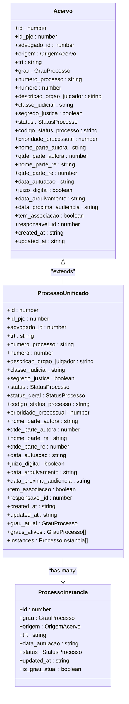
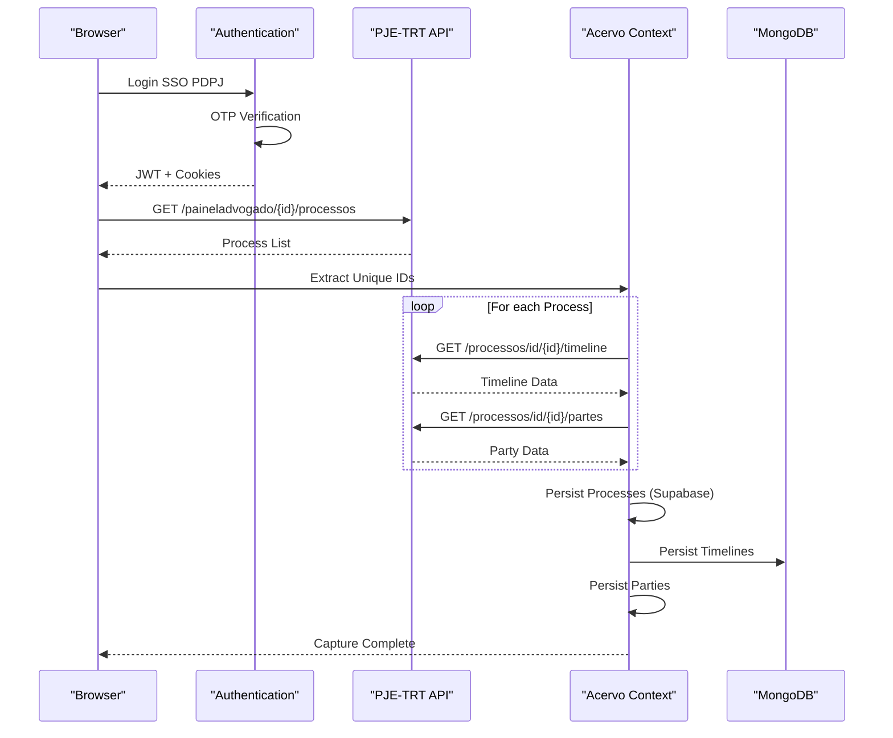
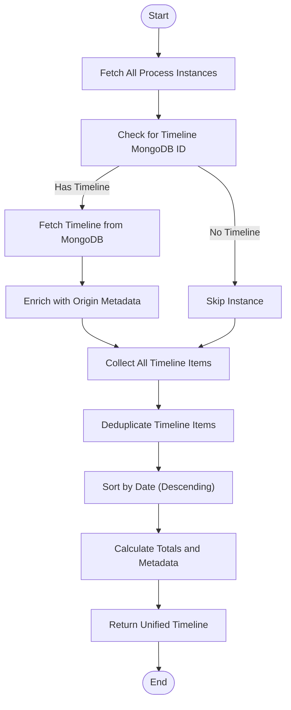
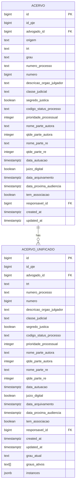
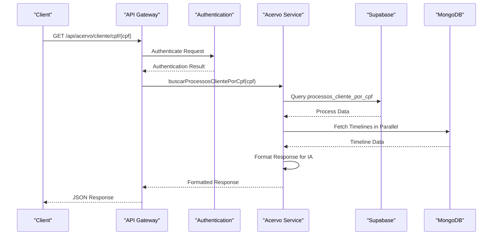

# Acervo Bounded Context

<cite>
**Referenced Files in This Document**   
- [acervo.sql](file://supabase/schemas/04_acervo.sql)
- [acervo_unificado_view.sql](file://supabase/schemas/05_acervo_unificado_view.sql)
- [timeline-unificada.service.ts](file://backend/acervo/services/timeline/timeline-unificada.service.ts)
- [listar-acervo.service.ts](file://backend/acervo/services/listar-acervo.service.ts)
- [listar-acervo-unificado.service.ts](file://backend/acervo/services/persistence/listar-acervo-unificado.service.ts)
- [buscar-processos-cliente-cpf.service.ts](file://backend/acervo/services/buscar-processos-cliente-cpf.service.ts)
- [acervo-geral.service.ts](file://backend/captura/services/trt/acervo-geral.service.ts)
- [acervo.ts](file://types/domain/acervo.ts)
- [acervo.ts](file://types/contracts/acervo.ts)
- [route.ts](file://app/api/acervo/cliente/cpf/[cpf]/route.ts)
- [route.ts](file://app/api/acervo/[id]/route.ts)
- [acordos-condenacoes.ts](file://backend/acordos-condenacoes/services/acordos-condenacoes/acordos-condenacoes.service.ts)
</cite>

## Table of Contents
1. [Introduction](#introduction)
2. [Domain Model](#domain-model)
3. [Process Synchronization from PJE-TRT](#process-synchronization-from-pje-trt)
4. [Unified Timeline Aggregation](#unified-timeline-aggregation)
5. [Business Rules and Process Tracking](#business-rules-and-process-tracking)
6. [Integration with Financeiro Context](#integration-with-financeiro-context)
7. [API Endpoints and Data Flow](#api-endpoints-and-data-flow)
8. [Conclusion](#conclusion)

## Introduction

The Acervo bounded context is responsible for managing the complete legal process inventory within the Sinesys platform. It serves as the central repository for all legal processes, providing a unified view across multiple instances (first degree, second degree, superior courts) and maintaining comprehensive historical data. The context is designed to handle large volumes of process data efficiently, with optimized queries and caching mechanisms. It integrates with external systems like PJE-TRT to synchronize process data and provides this information to other bounded contexts, particularly Financeiro, for financial agreement management. The Acervo context maintains its own domain language and model, separate from other domains, ensuring data consistency and integrity.

**Section sources**
- [acervo.sql](file://supabase/schemas/04_acervo.sql#L1-L77)
- [acervo_unificado_view.sql](file://supabase/schemas/05_acervo_unificado_view.sql#L1-L223)

## Domain Model

The domain model for the Acervo context revolves around the Processo entity, which represents a legal process in the system. Each Processo is uniquely identified by its `numero_processo` and can exist in multiple instances across different judicial degrees. The core entity, `Acervo`, contains essential information about a process instance, including its origin, tribunal code (TRT), judicial degree, process number, court description, judicial class, secrecy status, status code, priority, party names, filing date, digital court status, archiving date, next hearing date, and association status. The model also includes a unified view, `ProcessoUnificado`, which aggregates multiple instances of the same process into a single representation, identifying the current degree based on the most recent filing date.

**Diagram sources**
- [acervo.ts](file://types/domain/acervo.ts#L15-L81)

**Section sources**
- [acervo.ts](file://types/domain/acervo.ts#L1-L81)
- [acervo.sql](file://supabase/schemas/04_acervo.sql#L1-L77)

## Process Synchronization from PJE-TRT

The Acervo context synchronizes process data from the PJE-TRT system through a multi-phase capture process. The synchronization begins with authentication to the PJE system, followed by fetching the list of processes from the acervo geral. The system then extracts unique process IDs and retrieves complementary data such as timelines and parties for each process. The capture process is optimized to avoid redundant data retrieval by verifying recapture conditions, skipping processes that have been updated recently. The data is persisted in a specific order to ensure referential integrity: processes are saved first, followed by timelines in MongoDB, and finally party information. This approach ensures that the Acervo context maintains an up-to-date and comprehensive view of all legal processes.

**Diagram sources**
- [acervo-geral.service.ts](file://backend/captura/services/trt/acervo-geral.service.ts#L1-L354)

**Section sources**
- [acervo-geral.service.ts](file://backend/captura/services/trt/acervo-geral.service.ts#L1-L354)
- [api/pje-trt/index.ts](file://backend/api/pje-trt/index.ts#L1-L47)

## Unified Timeline Aggregation

The Acervo context provides a unified timeline aggregation service that combines timelines from multiple instances of the same legal process. The `timeline-unificada.service.ts` handles this complex aggregation by first identifying all instances of a process through its `numero_processo`. It then retrieves the timeline for each instance from MongoDB and applies deduplication to remove redundant events. The deduplication strategy prioritizes items with storage links (Google Drive or Backblaze) and gives precedence to higher judicial degrees. The unified timeline is sorted by date in descending order, with the most recent events appearing first. This service enables users to view a comprehensive and coherent history of a legal process across all its instances without duplication.

**Diagram sources**
- [timeline-unificada.service.ts](file://backend/acervo/services/timeline/timeline-unificada.service.ts#L1-L281)

**Section sources**
- [timeline-unificada.service.ts](file://backend/acervo/services/timeline/timeline-unificada.service.ts#L1-L281)
- [timeline-persistence.service.ts](file://backend/captura/services/timeline/timeline-persistence.service.ts#L1-L100)

## Business Rules and Process Tracking

The Acervo context enforces several business rules for process tracking, including status transitions, responsible assignment, and timeline unification. Status transitions are managed through a mapping function that converts PJE status codes to standardized `StatusProcesso` enum values. Responsible assignment is handled through the `responsavel_id` field, which can be updated to assign a responsible person to a process. The context supports various filtering and grouping options for process tracking, allowing users to organize processes by TRT, judicial degree, origin, responsible person, judicial class, status, court, or filing date. The unified view, implemented through the `acervo_unificado` materialized view, automatically identifies the current degree of a process based on the most recent filing date, ensuring that users always see the most up-to-date information.

**Diagram sources**
- [acervo.sql](file://supabase/schemas/04_acervo.sql#L1-L77)
- [acervo_unificado_view.sql](file://supabase/schemas/05_acervo_unificado_view.sql#L1-L223)

**Section sources**
- [listar-acervo-unificado.service.ts](file://backend/acervo/services/persistence/listar-acervo-unificado.service.ts#L1-L256)
- [listar-acervo.service.ts](file://backend/acervo/services/listar-acervo.service.ts#L1-L48)

## Integration with Financeiro Context

The Acervo context provides process data to the Financeiro context for managing payment agreements related to legal processes. When a payment agreement is created in the Financeiro context, it references the relevant legal process through its `numero_processo`. The Acervo context ensures that the process data is up-to-date and accessible, allowing the Financeiro context to display relevant process information alongside payment details. This integration enables users to view the financial obligations associated with specific legal processes and track payments in the context of the overall case. The separation of concerns between the Acervo and Financeiro contexts allows each to maintain its own domain model and language while providing a cohesive user experience.

**Section sources**
- [acordos-condenacoes.service.ts](file://backend/acordos-condenacoes/services/acordos-condenacoes/acordos-condenacoes.service.ts#L1-L200)

## API Endpoints and Data Flow

The Acervo context exposes several API endpoints for accessing process data. The `/api/acervo/cliente/cpf/{cpf}` endpoint allows searching for processes by client CPF, returning a sanitized response optimized for consumption by the IA WhatsApp agent. This endpoint includes a lazy synchronization mechanism that automatically triggers timeline capture if it's not available. The `/api/acervo/{id}` endpoint provides detailed information about a specific process instance. The data flow begins with authentication, followed by parameter validation, process retrieval from the database, timeline fetching from MongoDB, and response formatting. The context uses caching to improve performance, with a 15-minute TTL for list queries.

**Diagram sources**
- [route.ts](file://app/api/acervo/cliente/cpf/[cpf]/route.ts#L1-L268)
- [route.ts](file://app/api/acervo/[id]/route.ts#L1-L146)

**Section sources**
- [route.ts](file://app/api/acervo/cliente/cpf/[cpf]/route.ts#L1-L268)
- [route.ts](file://app/api/acervo/[id]/route.ts#L1-L146)
- [buscar-processos-cliente-cpf.service.ts](file://backend/acervo/services/buscar-processos-cliente-cpf.service.ts#L1-L261)

## Conclusion

The Acervo bounded context serves as the central repository for legal process data in the Sinesys platform, providing a unified and comprehensive view across multiple instances. It efficiently synchronizes data from external systems like PJE-TRT, maintains referential integrity, and provides optimized queries for large datasets. The context's domain model, centered around the Processo entity, supports complex business rules for process tracking and status management. Through its integration with the Financeiro context, it enables the management of payment agreements in the context of legal processes. The Acervo context's API endpoints and data flow are designed for performance and scalability, ensuring that users can access up-to-date process information quickly and reliably.