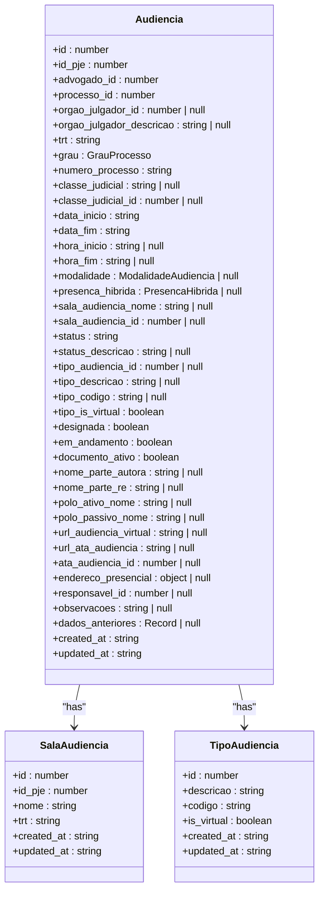
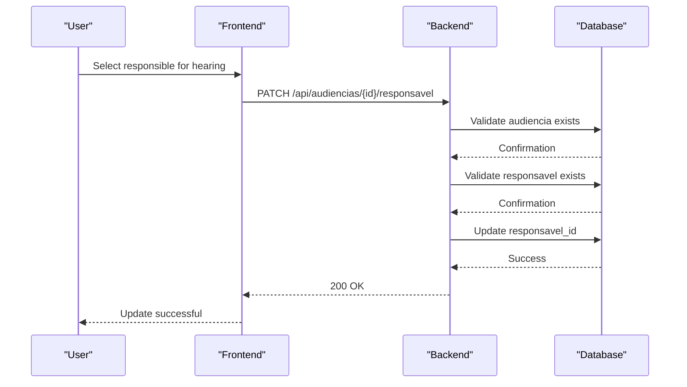
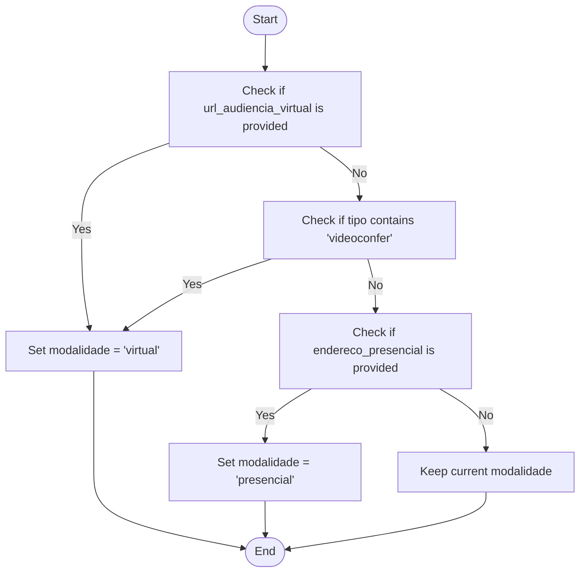
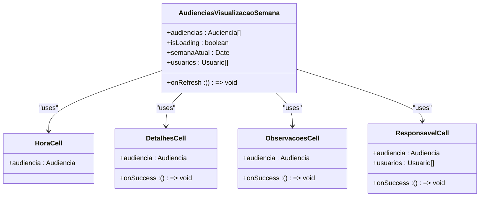
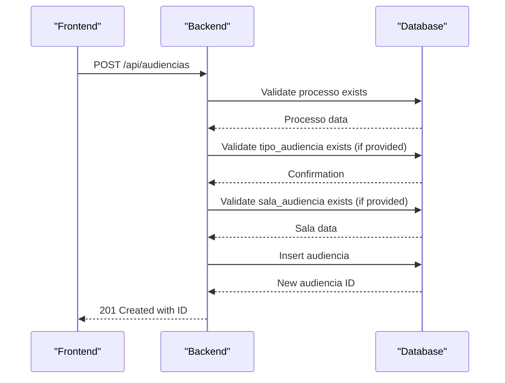
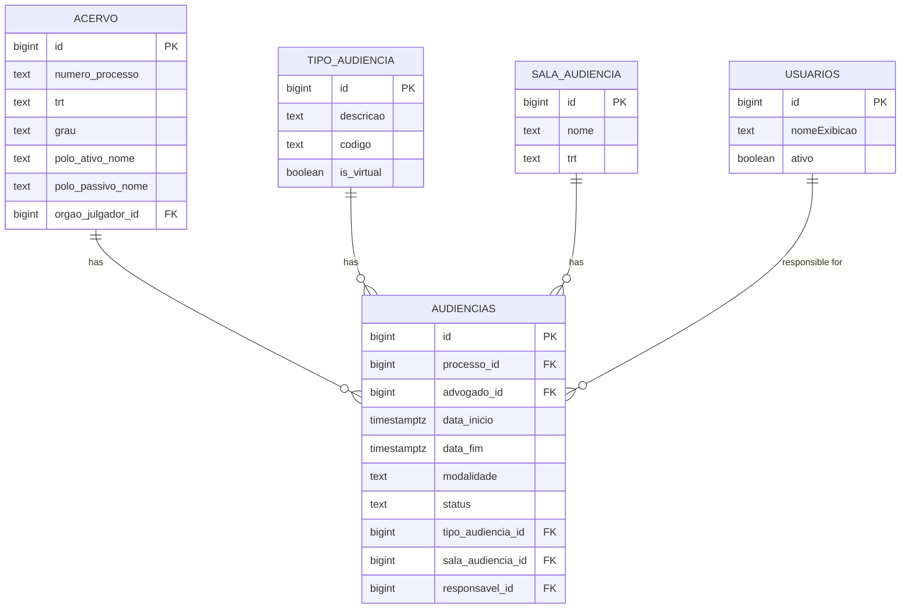

# Audiencias Bounded Context

<cite>
**Referenced Files in This Document**   
- [audiencias-visualizacao-semana.tsx](file://app/(dashboard)/audiencias/components/audiencias-visualizacao-semana.tsx)
- [criar-audiencia.service.ts](file://backend/audiencias/services/criar-audiencia.service.ts)
- [atualizar-url-virtual.service.ts](file://backend/audiencias/services/atualizar-url-virtual.service.ts)
- [atribuir-responsavel.service.ts](file://backend/audiencias/services/atribuir-responsavel.service.ts)
- [audiencias.ts](file://types/domain/audiencias.ts)
- [07_audiencias.sql](file://supabase/schemas/07_audiencias.sql)
- [route.ts](file://app/api/audiencias/route.ts)
- [audiencias-content.tsx](file://app/(dashboard)/audiencias/components/audiencias-content.tsx)
</cite>

## Table of Contents
1. [Introduction](#introduction)
2. [Domain Model](#domain-model)
3. [Business Rules](#business-rules)
4. [Implementation Details](#implementation-details)
5. [Integration with Acervo Context](#integration-with-acervo-context)
6. [Unique Aspects of the Audiencias Context](#unique-aspects-of-the-audiencias-context)
7. [Conclusion](#conclusion)

## Introduction
The Audiencias (hearings) bounded context is a specialized domain within the Sinesys application that manages court hearings for legal processes. This context provides comprehensive functionality for scheduling, tracking, and managing hearings, with support for both presential and virtual formats. The system is designed to maintain its own terminology and model separate from other domains, ensuring clear boundaries and responsibilities. The Audiencias context integrates closely with the Acervo context to link hearings to specific legal processes, while providing rich user interfaces for visualizing hearings across different time periods (week, month, year, list).

## Domain Model
The domain model for the Audiencias context is centered around three main entities: Audiencia (hearing), SalaAudiencia (hearing room), and TipoAudiencia (hearing type). The core entity is Audiencia, which represents a court hearing with all its relevant information including date, time, location, participants, and status.

**Diagram sources**
- [audiencias.ts](file://types/domain/audiencias.ts#L25-L76)
- [07_audiencias.sql](file://supabase/schemas/07_audiencias.sql#L4-L46)

**Section sources**
- [audiencias.ts](file://types/domain/audiencias.ts#L1-L77)
- [07_audiencias.sql](file://supabase/schemas/07_audiencias.sql#L1-L159)

## Business Rules
The Audiencias context implements several business rules to ensure data integrity and proper workflow management. These rules govern hearing scheduling, responsible assignment, and virtual hearing URL generation.

### Scheduling Conflicts
The system prevents scheduling conflicts through a unique constraint on the combination of `id_pje`, `trt`, `grau`, and `numero_processo` in the database. This ensures that each hearing is uniquely identified within the system, preventing duplicate entries for the same hearing across different processes.

### Responsible Assignment
The responsible assignment business rule allows users to assign a responsible person to a hearing. This is implemented through the `responsavel_id` field in the Audiencia entity, which references the usuarios (users) table. The assignment is validated to ensure that both the hearing and the responsible user exist in the system.

**Diagram sources**
- [atribuir-responsavel.service.ts](file://backend/audiencias/services/atribuir-responsavel.service.ts#L1-L156)
- [route.ts](file://app/api/audiencias/[id]/responsavel/route.ts)

**Section sources**
- [atribuir-responsavel.service.ts](file://backend/audiencias/services/atribuir-responsavel.service.ts#L1-L156)

### Virtual Hearing URL Generation
The system automatically determines the hearing modality (virtual, presential, or hybrid) based on specific conditions. When a URL for a virtual hearing is provided, the system automatically sets the modality to "virtual". This is implemented through a database trigger that populates the modalidade field based on the presence of a URL or address.

**Diagram sources**
- [07_audiencias.sql](file://supabase/schemas/07_audiencias.sql#L100-L140)
- [atualizar-url-virtual.service.ts](file://backend/audiencias/services/atualizar-url-virtual.service.ts#L1-L65)

**Section sources**
- [07_audiencias.sql](file://supabase/schemas/07_audiencias.sql#L100-L140)

## Implementation Details
The implementation of the Audiencias context includes both frontend and backend components that work together to provide a seamless user experience. The system is designed to handle hearing creation, updates, and visualization across different time periods.

### audiencias-visualizacao-semana.tsx Component
The `audiencias-visualizacao-semana.tsx` component provides a week-based calendar view for hearings, allowing users to see their schedule organized by day of the week. This component uses tabs to navigate between days and displays hearings in a table format with relevant information.

**Diagram sources**
- [audiencias-visualizacao-semana.tsx](file://app/(dashboard)/audiencias/components/audiencias-visualizacao-semana.tsx#L637-L808)
- [audiencias.ts](file://types/domain/audiencias.ts#L25-L76)

**Section sources**
- [audiencias-visualizacao-semana.tsx](file://app/(dashboard)/audiencias/components/audiencias-visualizacao-semana.tsx#L1-L808)

### Backend Services
The backend services for the Audiencias context handle the core business logic for creating, updating, and listing hearings. These services are implemented in TypeScript and use Supabase for database operations.

#### Hearing Creation
The `criar-audiencia.service.ts` service handles the creation of new hearings. It validates the input parameters, retrieves necessary data from related entities, and inserts the new hearing into the database.

**Diagram sources**
- [criar-audiencia.service.ts](file://backend/audiencias/services/criar-audiencia.service.ts#L1-L110)
- [route.ts](file://app/api/audiencias/route.ts#L315-L499)

**Section sources**
- [criar-audiencia.service.ts](file://backend/audiencias/services/criar-audiencia.service.ts#L1-L110)

## Integration with Acervo Context
The Audiencias context integrates with the Acervo context to link hearings to specific legal processes. This integration is achieved through the `processo_id` field in the Audiencia entity, which references the acervo table.

When a new hearing is created, the system retrieves the necessary process information from the Acervo context to populate fields such as `numero_processo`, `trt`, `grau`, and party names. This ensures that the hearing is properly linked to its corresponding legal process and that all relevant information is available in the Audiencias context.

**Diagram sources**
- [07_audiencias.sql](file://supabase/schemas/07_audiencias.sql#L4-L46)
- [04_acervo.sql](file://supabase/schemas/04_acervo.sql#L1-L20)

**Section sources**
- [criar-audiencia.service.ts](file://backend/audiencias/services/criar-audiencia.service.ts#L13-L17)

## Unique Aspects of the Audiencias Context
The Audiencias context has several unique aspects that distinguish it from other domains in the application. These include its handling of both presential and virtual hearings, its own terminology and model, and its specialized user interface components.

### Handling Both Presential and Virtual Hearings
One of the key features of the Audiencias context is its ability to handle both presential and virtual hearings. The system uses the `modalidade` field to distinguish between these types, with values of "presencial", "virtual", or "hibrida" (hybrid). For virtual hearings, the system stores the URL in the `url_audiencia_virtual` field, while presential hearings have their address stored in the `endereco_presencial` JSON field.

The system automatically determines the hearing modality based on the presence of a URL or address, ensuring consistency and reducing the chance of errors. This automatic determination is implemented through a database trigger that runs before insert or update operations.

### Maintaining Its Own Terminology and Model
The Audiencias context maintains its own terminology and model separate from other domains. This is evident in the use of specific terms like "audiencia", "sala_audiencia", and "tipo_audiencia" that are specific to this context. The model is designed to capture all the relevant information about a hearing without depending on other contexts for core functionality.

This separation of concerns allows the Audiencias context to evolve independently of other domains, making it easier to add new features or modify existing ones without affecting other parts of the system.

## Conclusion
The Audiencias bounded context provides a comprehensive solution for managing court hearings within the Sinesys application. By implementing a robust domain model, clear business rules, and seamless integration with the Acervo context, the system enables users to effectively schedule, track, and manage hearings. The context's ability to handle both presential and virtual hearings, along with its specialized user interface components, makes it a powerful tool for legal professionals. The separation of concerns and maintenance of its own terminology ensure that the Audiencias context can evolve independently, providing a solid foundation for future enhancements.