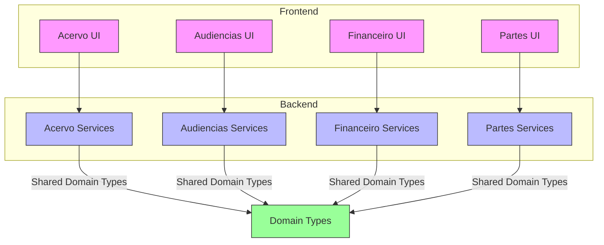
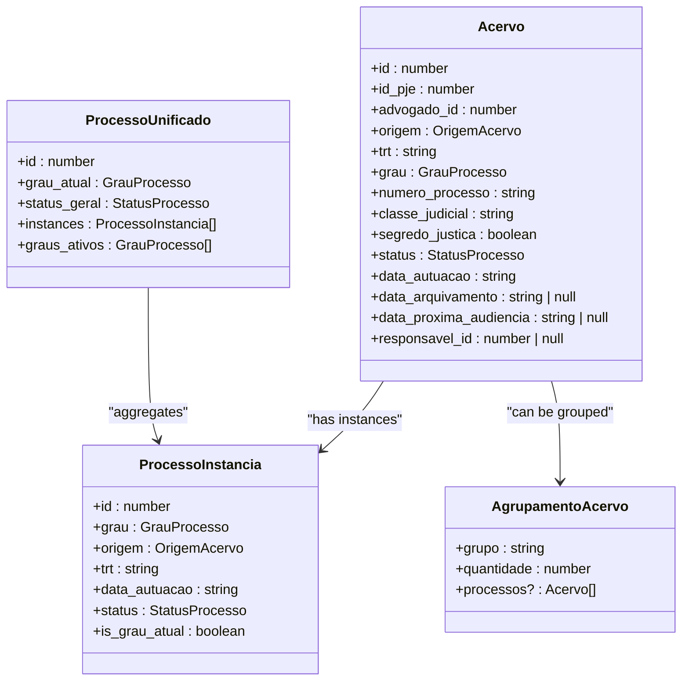
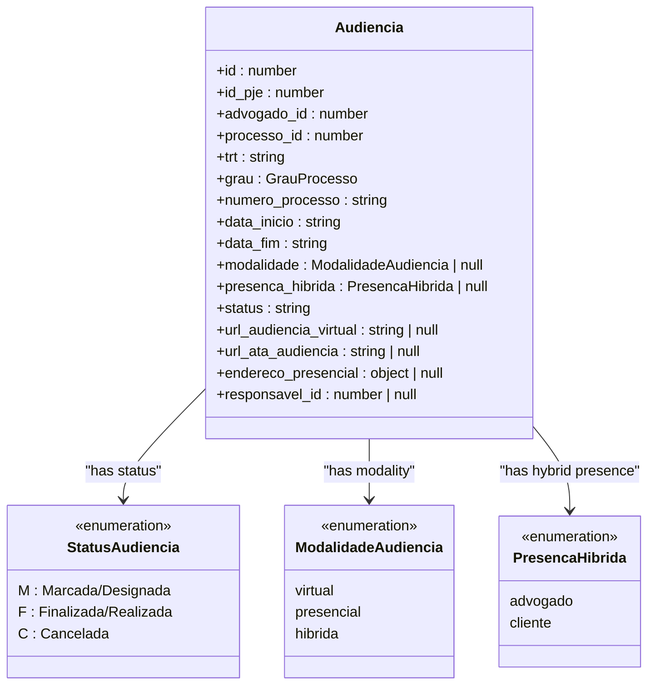
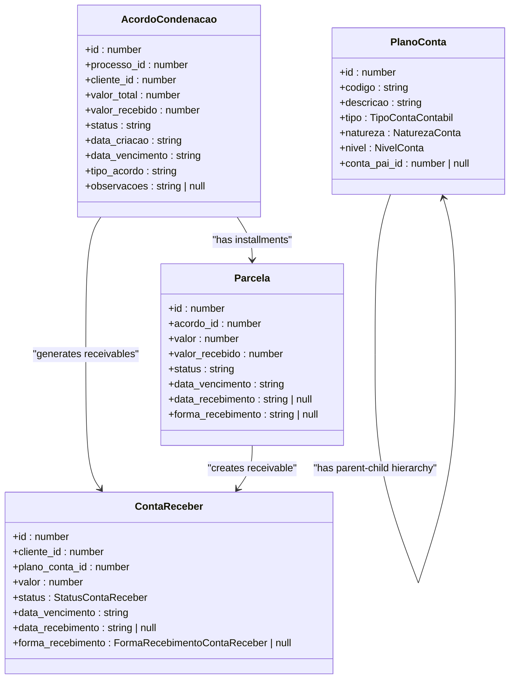
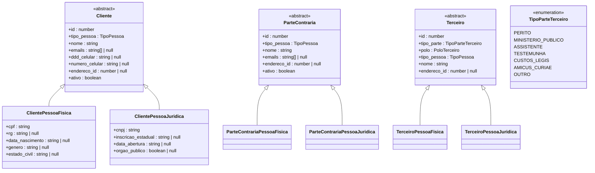
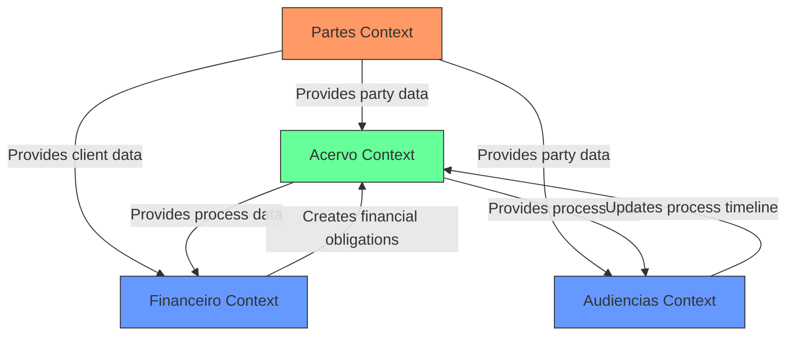
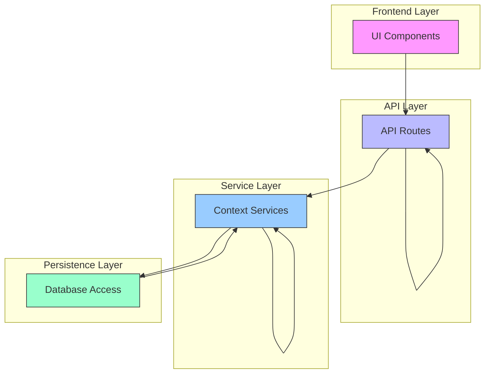

# Bounded Contexts

<cite>
**Referenced Files in This Document**   
- [acervo.ts](file://types/domain/acervo.ts)
- [audiencias.ts](file://types/domain/audiencias.ts)
- [financeiro.ts](file://types/domain/financeiro.ts)
- [partes.ts](file://types/domain/partes.ts)
- [index.ts](file://types/domain/index.ts)
- [acordos-condenacoes/services/persistence/acordo-condenacao-persistence.service.ts](file://backend/acordos-condenacoes/services/persistence/acordo-condenacao-persistence.service.ts)
- [audiencias/services/listar-audiencias.service.ts](file://backend/audiencias/services/listar-audiencias.service.ts)
- [financeiro/contas-receber/services/contas-receber-persistence.service.ts](file://backend/financeiro/contas-receber/services/contas-receber-persistence.service.ts)
- [partes/services/clientes-persistence.service.ts](file://backend/partes/services/clientes-persistence.service.ts)
- [app/(dashboard)/acordos-condenacoes/page.tsx](file://app/(dashboard)/acordos-condenacoes/page.tsx)
- [app/(dashboard)/audiencias/page.tsx](file://app/(dashboard)/audiencias/page.tsx)
- [app/(dashboard)/financeiro/page.tsx](file://app/(dashboard)/financeiro/page.tsx)
- [app/(dashboard)/partes/page.tsx](file://app/(dashboard)/partes/page.tsx)
</cite>

## Table of Contents
1. [Introduction](#introduction)
2. [Bounded Context Overview](#bounded-context-overview)
3. [Acervo Context](#acervo-context)
4. [Audiencias Context](#audiencias-context)
5. [Financeiro Context](#financeiro-context)
6. [Partes Context](#partes-context)
7. [Context Map and Relationships](#context-map-and-relationships)
8. [Context Boundary Enforcement](#context-boundary-enforcement)
9. [Benefits of Bounded Contexts](#benefits-of-bounded-contexts)
10. [Challenges in Context Management](#challenges-in-context-management)
11. [Conclusion](#conclusion)

## Introduction
The Sinesys application implements a domain-driven design approach through clearly defined bounded contexts that encapsulate distinct business domains. This document details the implementation of four primary bounded contexts: Acervo (legal processes), Audiencias (hearings), Financeiro (financial obligations), and Partes (parties/clients). Each context maintains its own domain model, language, and implementation, allowing for independent evolution while preventing model corruption across different business concerns. The bounded context pattern enables the system to manage complex domain logic by creating clear boundaries around related functionality.

**Section sources**
- [index.ts](file://types/domain/index.ts)

## Bounded Context Overview
The Sinesys application is structured around multiple bounded contexts, each representing a distinct business domain with its own language, models, and responsibilities. These contexts are organized in the codebase through dedicated directories in both the frontend and backend, with clear separation of concerns. The domain types for each context are defined in the `types/domain` directory, while service implementations reside in the `backend` directory. This architectural approach follows domain-driven design principles, allowing each context to evolve independently while maintaining clear integration points with other contexts when necessary.

**Diagram sources**
- [index.ts](file://types/domain/index.ts)
- [app/(dashboard)/acordos-condenacoes/page.tsx](file://app/(dashboard)/acordos-condenacoes/page.tsx)
- [app/(dashboard)/audiencias/page.tsx](file://app/(dashboard)/audiencias/page.tsx)
- [app/(dashboard)/financeiro/page.tsx](file://app/(dashboard)/financeiro/page.tsx)
- [app/(dashboard)/partes/page.tsx](file://app/(dashboard)/partes/page.tsx)

**Section sources**
- [index.ts](file://types/domain/index.ts)

## Acervo Context
The Acervo context focuses on legal process tracking and management, serving as the core domain for handling judicial processes within the Sinesys application. This context maintains a rich model for legal processes, including their status, classification, and timeline across different jurisdictional levels. The domain model includes entities such as `Acervo`, `ProcessoInstancia`, and `ProcessoUnificado`, which capture the complex nature of legal proceedings that may span multiple courts and jurisdictions. The context handles process synchronization from external systems like PJe (Processo Judicial Eletrônico) and provides functionality for tracking process metadata, autuation dates, and archival status.

**Diagram sources**
- [acervo.ts](file://types/domain/acervo.ts)

**Section sources**
- [acervo.ts](file://types/domain/acervo.ts)

## Audiencias Context
The Audiencias context manages judicial hearings and related scheduling information, providing specialized functionality for tracking hearing details across different modalities. This context maintains a distinct model focused on hearing-specific attributes such as virtual or in-person modalities, hybrid presence requirements, and detailed scheduling information. The domain model includes the `Audiencia` interface with properties like `modalidade`, `presenca_hibrida`, and `url_audiencia_virtual`, reflecting the specialized language of the hearings domain. The context handles both the creation and tracking of hearings, including their status (scheduled, completed, or canceled) and associated metadata like courtroom information and presiding judge details.

**Diagram sources**
- [audiencias.ts](file://types/domain/audiencias.ts)

**Section sources**
- [audiencias.ts](file://types/domain/audiencias.ts)

## Financeiro Context
The Financeiro context handles all financial obligations, agreements, and accounting functionality within the Sinesys application, maintaining a comprehensive model for financial operations. This context is particularly rich, encompassing multiple subdomains such as accounts payable, accounts receivable, budgeting, and financial reporting. The domain model includes specialized types for financial agreements (acordos-condenacoes), payment plans, and accounting structures. The context manages payment agreements with detailed tracking of installments, distribution of payments, and reconciliation processes. It also maintains a hierarchical chart of accounts (plano de contas) and supports complex financial operations like revenue recognition and expense categorization.

**Diagram sources**
- [financeiro.ts](file://types/domain/financeiro.ts)
- [acordo-condenacao-persistence.service.ts](file://backend/acordos-condenacoes/services/persistence/acordo-condenacao-persistence.service.ts)

**Section sources**
- [financeiro.ts](file://types/domain/financeiro.ts)

## Partes Context
The Partes context manages parties and clients involved in legal processes, maintaining a sophisticated model for different types of legal entities. This context handles both clients (clientes) and opposing parties (partes contrárias), with support for both individuals (pessoa física) and organizations (pessoa jurídica). The domain model includes specialized types for different party roles, including third parties (terceiros) with specific classifications like experts, public prosecutors, and witnesses. The context maintains detailed information about parties, including contact information, identification documents, and relationship to legal processes. It also handles address management and representation relationships between parties.

**Diagram sources**
- [partes.ts](file://types/domain/partes.ts)

**Section sources**
- [partes.ts](file://types/domain/partes.ts)

## Context Map and Relationships
The bounded contexts in Sinesys are interconnected through well-defined relationships that follow upstream/downstream patterns and specific integration strategies. The Acervo context serves as a central hub, with other contexts relating to it as downstream consumers of process information. The Partes context acts as a foundational service, providing party information to multiple other contexts. The Financeiro context consumes data from both Acervo and Partes to create financial obligations related to legal processes and clients. The Audiencias context primarily relates to Acervo, tracking hearings associated with specific legal processes.

**Diagram sources**
- [acervo.ts](file://types/domain/acervo.ts)
- [audiencias.ts](file://types/domain/audiencias.ts)
- [financeiro.ts](file://types/domain/financeiro.ts)
- [partes.ts](file://types/domain/partes.ts)

**Section sources**
- [acervo.ts](file://types/domain/acervo.ts)
- [audiencias.ts](file://types/domain/audiencias.ts)
- [financeiro.ts](file://types/domain/financeiro.ts)
- [partes.ts](file://types/domain/partes.ts)

## Context Boundary Enforcement
The Sinesys application enforces bounded context boundaries through a combination of architectural patterns and implementation practices. Each context maintains its own domain models in the `types/domain` directory, preventing shared models from creating tight coupling. The backend services are organized in separate directories under `backend`, with clear separation between context implementations. API boundaries are established through the `api` routes, which provide controlled access points between contexts. Dependency management is enforced through import restrictions and layering, ensuring that higher-level contexts can depend on foundational ones but not vice versa. The use of DTOs (Data Transfer Objects) and service interfaces further isolates the internal implementation of each context from external consumers.

**Diagram sources**
- [acordo-condenacao-persistence.service.ts](file://backend/acordos-condenacoes/services/persistence/acordo-condenacao-persistence.service.ts)
- [audiencias/services/listar-audiencias.service.ts](file://backend/audiencias/services/listar-audiencias.service.ts)
- [financeiro/contas-receber/services/contas-receber-persistence.service.ts](file://backend/financeiro/contas-receber/services/contas-receber-persistence.service.ts)
- [partes/services/clientes-persistence.service.ts](file://backend/partes/services/clientes-persistence.service.ts)

**Section sources**
- [acordo-condenacao-persistence.service.ts](file://backend/acordos-condenacoes/services/persistence/acordo-condenacao-persistence.service.ts)
- [audiencias/services/listar-audiencias.service.ts](file://backend/audiencias/services/listar-audiencias.service.ts)
- [financeiro/contas-receber/services/contas-receber-persistence.service.ts](file://backend/financeiro/contas-receber/services/contas-receber-persistence.service.ts)
- [partes/services/clientes-persistence.service.ts](file://backend/partes/services/clientes-persistence.service.ts)

## Benefits of Bounded Contexts
The implementation of bounded contexts in Sinesys provides several significant benefits for the system's maintainability and evolution. First, it prevents model corruption by ensuring that each business domain maintains its own language and concepts without interference from other domains. This separation allows teams to work independently on different contexts without creating conflicts in the domain model. The bounded contexts enable independent deployment and scaling of different system components based on their specific requirements. Additionally, the clear boundaries make it easier to understand and modify specific parts of the system without unintended side effects on unrelated functionality. The approach also facilitates onboarding of new developers by providing well-defined areas of responsibility.

**Section sources**
- [acervo.ts](file://types/domain/acervo.ts)
- [audiencias.ts](file://types/domain/audiencias.ts)
- [financeiro.ts](file://types/domain/financeiro.ts)
- [partes.ts](file://types/domain/partes.ts)

## Challenges in Context Management
While the bounded contexts provide significant benefits, they also introduce challenges in maintaining consistency across the system. One key challenge is ensuring data consistency between contexts, particularly when the same entity (like a client) exists in multiple contexts with potentially different attributes. Another challenge is managing the integration points between contexts, which requires careful design to avoid creating tight coupling that undermines the benefits of separation. The system must also handle the complexity of context mapping, where concepts in one context need to be translated to equivalent concepts in another context. Additionally, maintaining consistent business rules across context boundaries can be difficult, particularly for rules that span multiple domains.

**Section sources**
- [acervo.ts](file://types/domain/acervo.ts)
- [audiencias.ts](file://types/domain/audiencias.ts)
- [financeiro.ts](file://types/domain/financeiro.ts)
- [partes.ts](file://types/domain/partes.ts)

## Conclusion
The bounded context implementation in Sinesys effectively addresses the complexity of a legal technology application by dividing the system into coherent, manageable domains. The Acervo, Audiencias, Financeiro, and Partes contexts each maintain their own models and language, allowing for focused development and independent evolution. The context map reveals a well-structured relationship between these domains, with clear upstream and downstream dependencies that prevent circular references. Boundary enforcement through API layers and dependency management ensures that the benefits of separation are maintained over time. While challenges exist in managing cross-context consistency, the overall architecture provides a solid foundation for a scalable and maintainable legal technology platform.