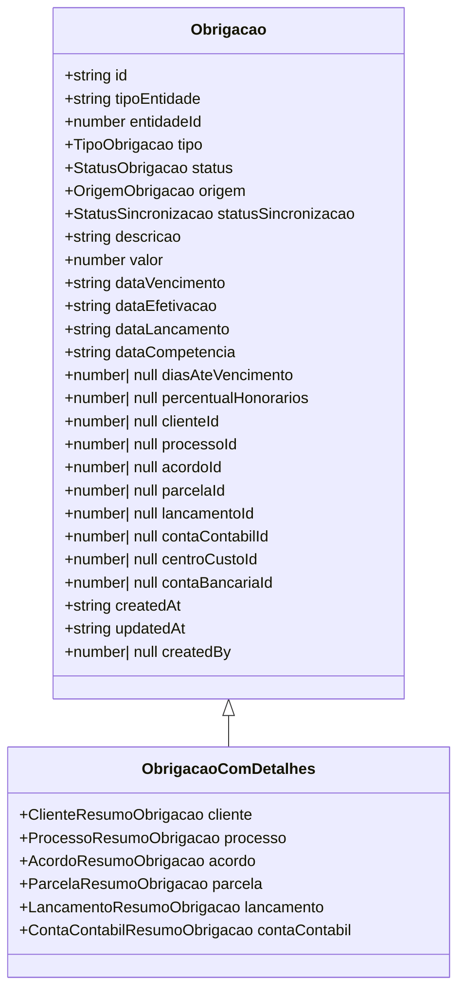
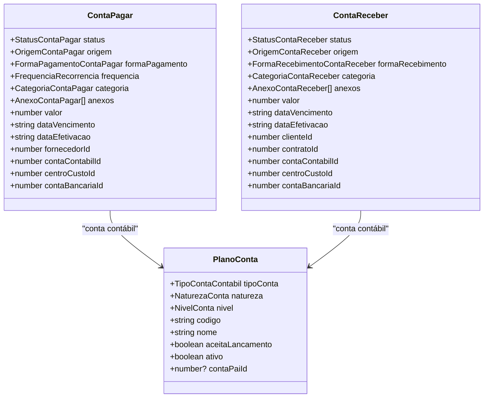
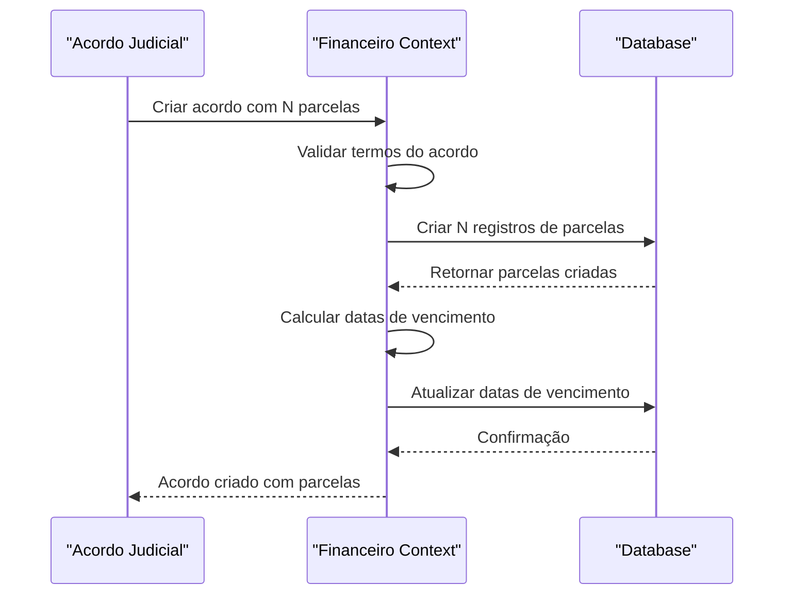
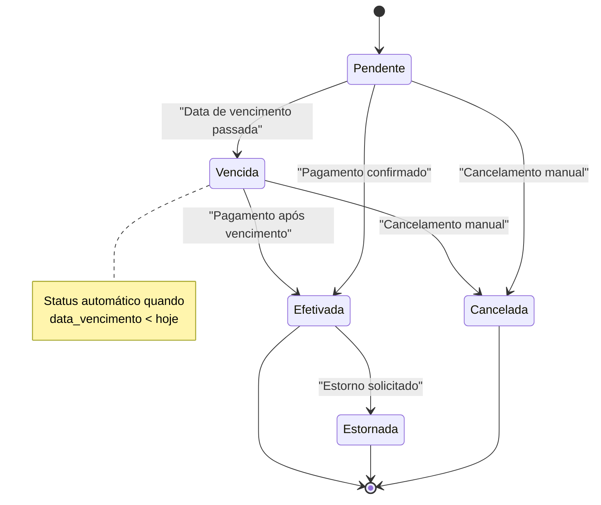
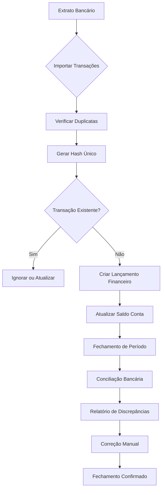
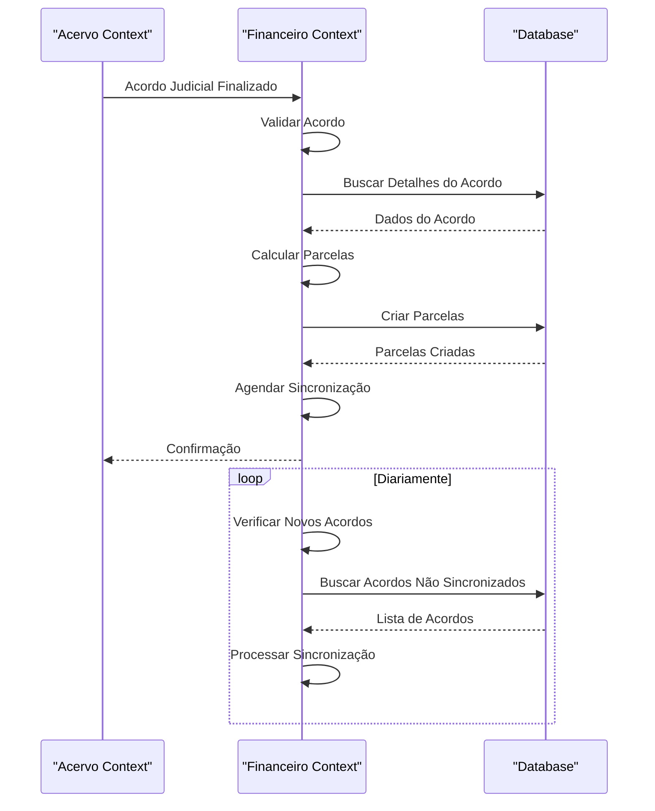
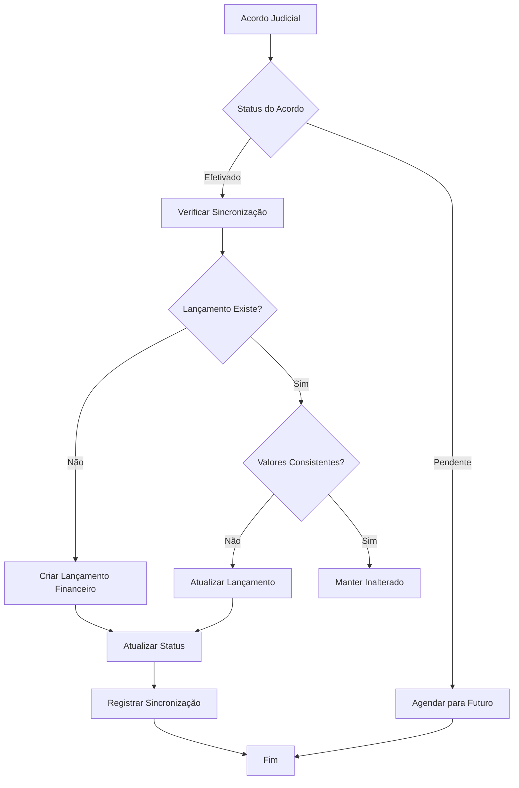
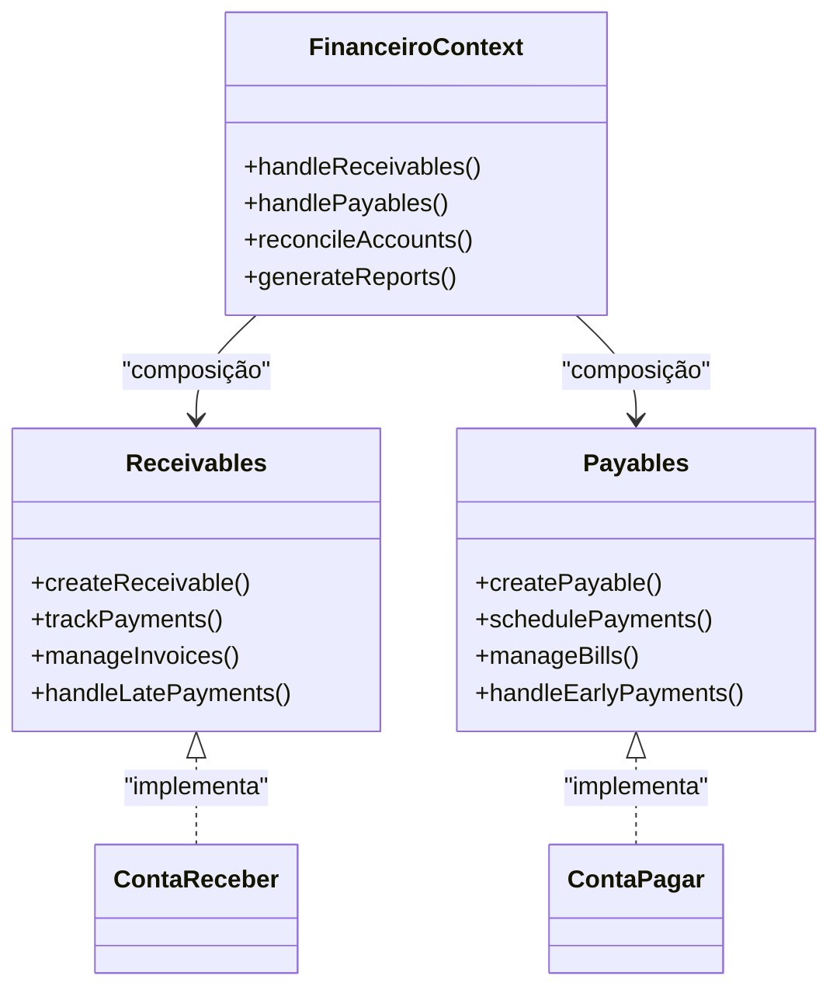
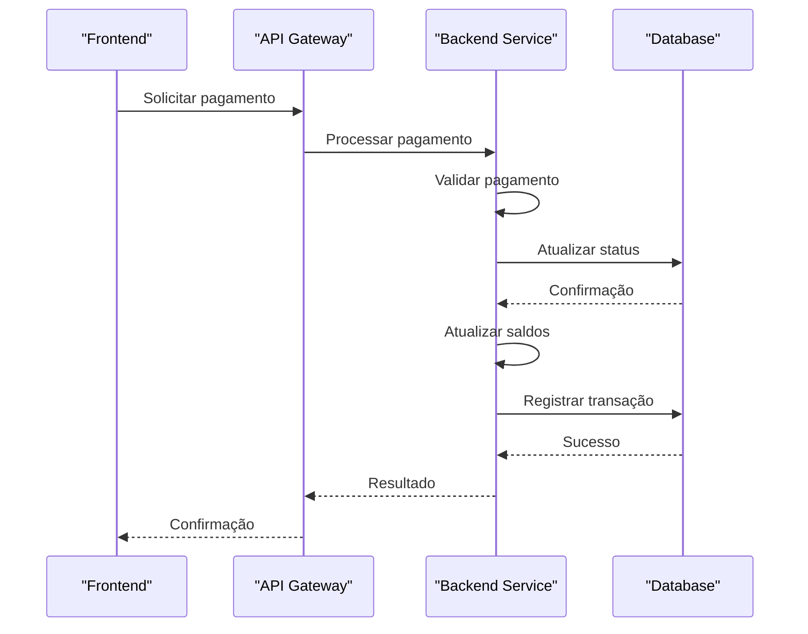

# Financeiro Bounded Context

<cite>
**Referenced Files in This Document**   
- [obrigacoes-content.tsx](file://app/(dashboard)/acordos-condenacoes/components/obrigacoes-content.tsx)
- [obrigacoes.types.ts](file://backend/types/financeiro/obrigacoes.types.ts)
- [obrigacoes-persistence.service.ts](file://backend/financeiro/obrigacoes/services/persistence/obrigacoes-persistence.service.ts)
- [listar-obrigacoes.service.ts](file://backend/financeiro/obrigacoes/services/obrigacoes/listar-obrigacoes.service.ts)
- [obrigacoes-integracao.service.ts](file://backend/financeiro/obrigacoes/services/integracao/obrigacoes-integracao.service.ts)
- [page.tsx](file://app/(dashboard)/financeiro/obrigacoes/page.tsx)
- [contas-pagar/page.tsx](file://app/(dashboard)/financeiro/contas-pagar/page.tsx)
- [contas-receber/page.tsx](file://app/(dashboard)/financeiro/contas-receber/page.tsx)
- [33_financeiro_functions.sql](file://supabase/schemas/33_financeiro_functions.sql)
</cite>

## Table of Contents
1. [Introduction](#introduction)
2. [Domain Model for Financial Obligations](#domain-model-for-financial-obligations)
3. [Business Rules for Payment Tracking](#business-rules-for-payment-tracking)
4. [Integration with Acervo Context](#integration-with-acervo-context)
5. [Unique Aspects of the Financeiro Context](#unique-aspects-of-the-financeiro-context)
6. [Implementation Details](#implementation-details)
7. [Conclusion](#conclusion)

## Introduction
The Financeiro bounded context in the Sinesys application manages financial obligations, encompassing both receivables and payables. This context provides a unified view of financial commitments, integrating data from legal agreements, contracts, and manual entries. The system handles payment tracking, installment distribution, status transitions, and reconciliation with external financial systems. This document details the domain model, business rules, integration patterns, and implementation specifics of the Financeiro context.

## Domain Model for Financial Obligations
The Financeiro context models financial obligations through a unified interface that consolidates various financial entities. The core entities include Obrigacao (obligation), ContaPagar (payable account), and ContaReceber (receivable account), each representing different types of financial commitments.

### Obrigacao Entity
The Obrigacao entity serves as a consolidated view of financial obligations, unifying data from different sources into a single interface. It represents any financial commitment in the system, whether derived from legal agreements, contracts, or manual entries.



**Diagram sources**
- [obrigacoes.types.ts](file://backend/types/financeiro/obrigacoes.types.ts#L145-L183)

**Section sources**
- [obrigacoes.types.ts](file://backend/types/financeiro/obrigacoes.types.ts#L18-L684)

### ContaPagar and ContaReceber Entities
The ContaPagar and ContaReceber entities represent payable and receivable accounts respectively. These entities extend the financial model to handle direct financial transactions outside of legal agreements.



**Diagram sources**
- [financeiro.ts](file://types/domain/financeiro.ts#L40-L64)
- [financeiro.ts](file://types/domain/financeiro.ts#L90-L100)

**Section sources**
- [financeiro.ts](file://types/domain/financeiro.ts#L1-L210)

## Business Rules for Payment Tracking
The Financeiro context implements comprehensive business rules for payment tracking, including installment distribution, payment status transitions, and reconciliation processes.

### Installment Distribution
The system manages installment distribution through automated processes that create payment schedules based on agreement terms. When a legal agreement is established with multiple installments, the system automatically generates the corresponding financial obligations.



**Diagram sources**
- [obrigacoes-integracao.service.ts](file://backend/financeiro/obrigacoes/services/integracao/obrigacoes-integracao.service.ts#L146-L358)
- [obrigacoes-persistence.service.ts](file://backend/financeiro/obrigacoes/services/persistence/obrigacoes-persistence.service.ts#L403-L478)

**Section sources**
- [obrigacoes-integracao.service.ts](file://backend/financeiro/obrigacoes/services/integracao/obrigacoes-integracao.service.ts#L1-L655)

### Payment Status Transitions
The system implements a state machine for payment status transitions, ensuring data consistency and proper workflow progression. The status transitions follow specific business rules based on payment timing and user actions.



**Diagram sources**
- [obrigacoes.types.ts](file://backend/types/financeiro/obrigacoes.types.ts#L32-L37)
- [obrigacoes.types.ts](file://backend/types/financeiro/obrigacoes.types.ts#L588-L613)

**Section sources**
- [obrigacoes.types.ts](file://backend/types/financeiro/obrigacoes.types.ts#L1-L684)

### Reconciliation with External Systems
The Financeiro context includes mechanisms for reconciliation with external financial systems, ensuring data consistency across platforms. This includes automated detection of inconsistencies and manual reconciliation processes.



**Diagram sources**
- [33_financeiro_functions.sql](file://supabase/schemas/33_financeiro_functions.sql#L444-L479)
- [33_financeiro_functions.sql](file://supabase/schemas/33_financeiro_functions.sql#L53-L114)

**Section sources**
- [33_financeiro_functions.sql](file://supabase/schemas/33_financeiro_functions.sql#L1-L479)

## Integration with Acervo Context
The Financeiro context integrates with the Acervo context to create payment agreements linked to legal processes. This integration enables the automatic creation of financial obligations based on legal agreements and court rulings.

### Data Flow from Acervo to Financeiro
The integration follows a service-oriented architecture where the Financeiro context consumes data from the Acervo context through well-defined service interfaces. When a legal agreement is finalized in the Acervo context, it triggers the creation of corresponding financial obligations.



**Diagram sources**
- [obrigacoes-integracao.service.ts](file://backend/financeiro/obrigacoes/services/integracao/obrigacoes-integracao.service.ts#L146-L358)
- [obrigacoes-persistence.service.ts](file://backend/financeiro/obrigacoes/services/persistence/obrigacoes-persistence.service.ts#L403-L478)

**Section sources**
- [obrigacoes-integracao.service.ts](file://backend/financeiro/obrigacoes/services/integracao/obrigacoes-integracao.service.ts#L1-L655)

### Synchronization Process
The synchronization process between Acervo and Financeiro contexts ensures that financial obligations are accurately reflected in the accounting system. This process handles both automatic and manual synchronization scenarios.



**Diagram sources**
- [obrigacoes-integracao.service.ts](file://backend/financeiro/obrigacoes/services/integracao/obrigacoes-integracao.service.ts#L146-L358)
- [obrigacoes-persistence.service.ts](file://backend/financeiro/obrigacoes/services/persistence/obrigacoes-persistence.service.ts#L197-L220)

**Section sources**
- [obrigacoes-integracao.service.ts](file://backend/financeiro/obrigacoes/services/integracao/obrigacoes-integracao.service.ts#L1-L655)

## Unique Aspects of the Financeiro Context
The Financeiro context has several unique characteristics that distinguish it from other domains in the Sinesys application, particularly in its handling of both receivables and payables and its independent financial terminology.

### Dual Handling of Receivables and Payables
The Financeiro context uniquely manages both receivables and payables within a single unified framework. This dual capability allows for comprehensive financial management while maintaining clear separation between incoming and outgoing funds.



**Diagram sources**
- [contas-pagar/page.tsx](file://app/(dashboard)/financeiro/contas-pagar/page.tsx#L1-L590)
- [contas-receber/page.tsx](file://app/(dashboard)/financeiro/contas-receber/page.tsx#L1-L628)

**Section sources**
- [contas-pagar/page.tsx](file://app/(dashboard)/financeiro/contas-pagar/page.tsx#L1-L590)
- [contas-receber/page.tsx](file://app/(dashboard)/financeiro/contas-receber/page.tsx#L1-L628)

### Independent Financial Terminology and Model
The Financeiro context maintains its own financial terminology and model, separate from other domains. This independence ensures financial accuracy and compliance with accounting standards while providing a consistent interface for users.

```mermaid
classDiagram
class FinanceiroModel {
+Obrigacao
+ContaPagar
+ContaReceber
+PlanoConta
+LancamentoFinanceiro
}
class LegalModel {
+AcordoJudicial
+Parcela
+Processo
+Cliente
}
class ContractModel {
+Contrato
+Cláusula
+Parte
+Anexo
}
FinanceiroModel --> LegalModel : "consome dados"
FinanceiroModel --> ContractModel : "consome dados"
note right of FinanceiroModel
Modelo financeiro independente
com terminologia própria
separado dos domínios legais
e contratuais
end note
```

**Diagram sources**
- [obrigacoes.types.ts](file://backend/types/financeiro/obrigacoes.types.ts#L18-L684)
- [financeiro.ts](file://types/domain/financeiro.ts#L1-L210)

**Section sources**
- [obrigacoes.types.ts](file://backend/types/financeiro/obrigacoes.types.ts#L1-L684)
- [financeiro.ts](file://types/domain/financeiro.ts#L1-L210)

## Implementation Details
The implementation of the Financeiro context includes both frontend components for user interaction and backend services for processing financial operations.

### obrigacoes-content.tsx Component
The obrigacoes-content.tsx component displays financial obligations with filtering and navigation capabilities. It provides a unified view of all financial obligations, allowing users to manage both receivables and payables.

```mermaid
classDiagram
class ObrigacoesContent {
+visualizacao : ObrigacoesVisualizacao
+busca : string
+filtros : ObrigacoesFilters
+selectedFilterIds : string[]
+novaObrigacaoOpen : boolean
+refreshKey : number
+semanaAtual : Date | null
+mesAtual : Date | null
+anoAtual : number | null
}
class ObrigacoesVisualizacao {
+tabela
+semana
+mes
+ano
}
ObrigacoesContent --> ObrigacoesVisualizacao
note right of ObrigacoesContent
Componente React que exibe
obrigações financeiras com
suporte a múltiplas visualizações
e filtros avançados
end note
```

**Diagram sources**
- [obrigacoes-content.tsx](file://app/(dashboard)/acordos-condenacoes/components/obrigacoes-content.tsx#L1-L288)

**Section sources**
- [obrigacoes-content.tsx](file://app/(dashboard)/acordos-condenacoes/components/obrigacoes-content.tsx#L1-L288)

### Backend Services for Payment Processing
The backend services handle payment processing and reconciliation, ensuring data consistency and proper financial workflows. These services implement business logic for creating, updating, and deleting financial obligations.



**Diagram sources**
- [obrigacoes-integracao.service.ts](file://backend/financeiro/obrigacoes/services/integracao/obrigacoes-integracao.service.ts#L146-L358)
- [obrigacoes-persistence.service.ts](file://backend/financeiro/obrigacoes/services/persistence/obrigacoes-persistence.service.ts#L709-L805)

**Section sources**
- [obrigacoes-integracao.service.ts](file://backend/financeiro/obrigacoes/services/integracao/obrigacoes-integracao.service.ts#L1-L655)
- [obrigacoes-persistence.service.ts](file://backend/financeiro/obrigacoes/services/persistence/obrigacoes-persistence.service.ts#L1-L1001)

## Conclusion
The Financeiro bounded context in Sinesys provides a comprehensive solution for managing financial obligations in a legal practice environment. By unifying receivables and payables under a single framework, the system offers a holistic view of financial commitments while maintaining the necessary separation between different types of transactions. The integration with the Acervo context enables automatic creation of payment agreements linked to legal processes, streamlining workflow and reducing manual data entry. The implementation follows sound architectural principles with clear separation between frontend components and backend services, ensuring maintainability and scalability. The use of independent financial terminology and models ensures accuracy and compliance with accounting standards while providing a consistent user experience.