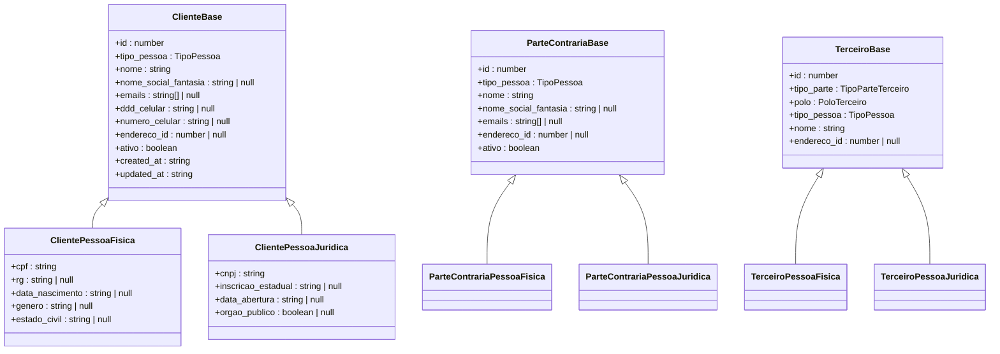
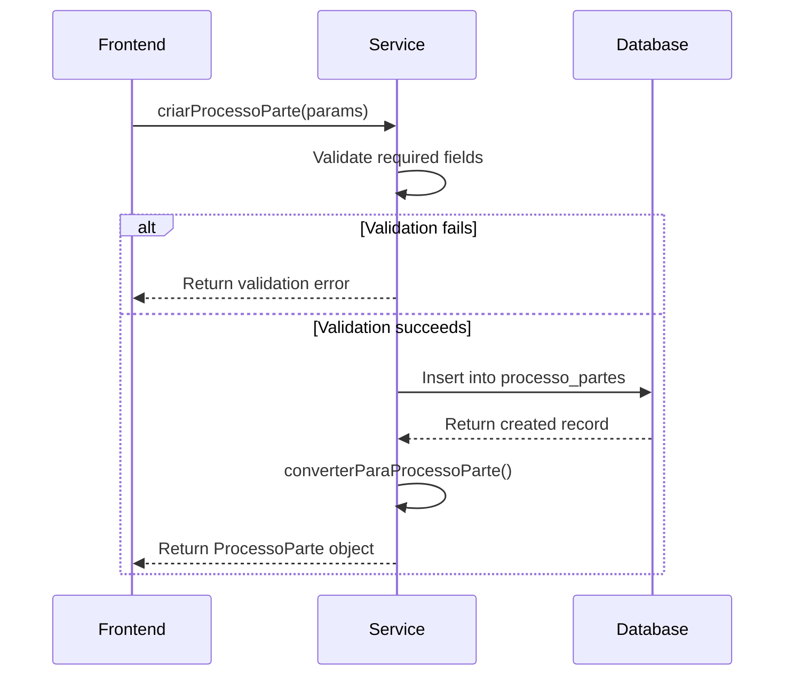
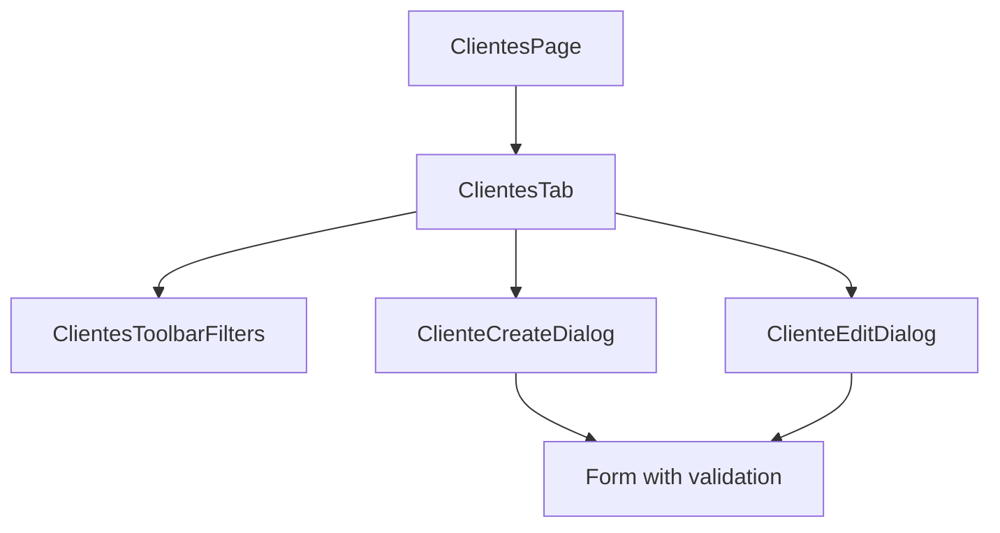
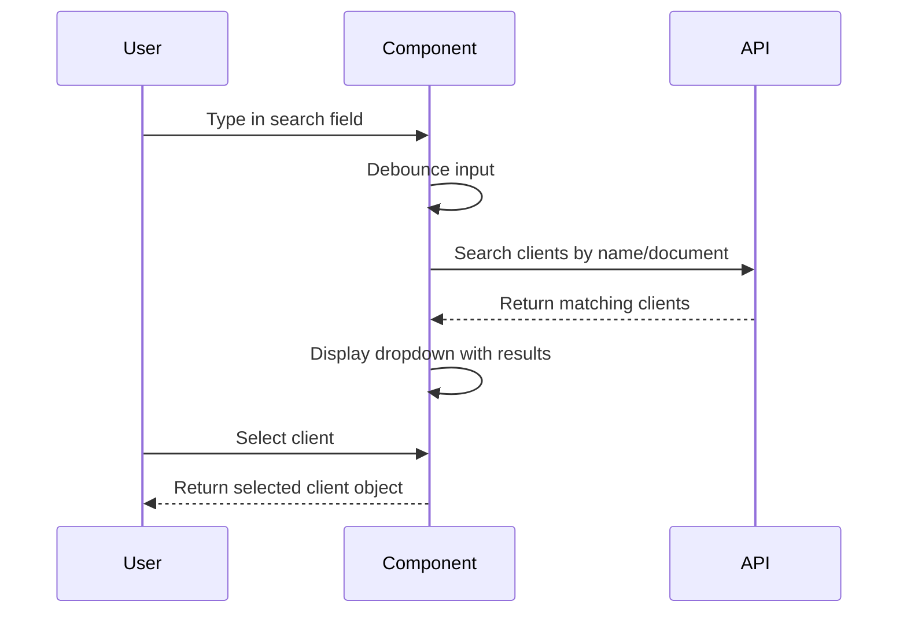

# Partes Bounded Context

<cite>
**Referenced Files in This Document**   
- [partes.ts](file://types/domain/partes.ts)
- [processo-partes.ts](file://types/domain/processo-partes.ts)
- [processo-partes-persistence.service.ts](file://backend/partes/services/processo-partes-persistence.service.ts)
- [cliente-create-dialog.tsx](file://app/(dashboard)/partes/components/cliente-create-dialog.tsx)
- [clientes-tab.tsx](file://app/(dashboard)/partes/components/clientes-tab.tsx)
- [cliente-autocomplete.tsx](file://components/assinatura-digital/cliente-autocomplete.tsx)
</cite>

## Table of Contents
1. [Introduction](#introduction)
2. [Domain Model](#domain-model)
3. [Business Rules](#business-rules)
4. [Integration with Other Contexts](#integration-with-other-contexts)
5. [Implementation Details](#implementation-details)
6. [Frontend Components](#frontend-components)
7. [Conclusion](#conclusion)

## Introduction

The Partes (Parties) bounded context serves as the central hub for managing all legal parties within the Sinesys system. This context provides a unified model for handling different types of parties including clients (Cliente), opposing parties (ParteContraria), representatives (Representante), and third parties (Terceiro). The context is designed to maintain a single source of truth for party information that can be consumed by other contexts such as Acervo and Financeiro.

The Partes context is structured around a polymorphic entity model that accommodates the varying attributes of different party types while maintaining a consistent interface for party management operations. This design allows the system to handle the complexity of legal party relationships while providing a clean abstraction for consumers.

**Section sources**
- [partes.ts](file://types/domain/partes.ts#L1-L309)

## Domain Model

The domain model for the Partes context is built around four primary entity types: Cliente (Client), ParteContraria (Opposing Party), Representante (Representative), and Terceiro (Third Party). Each entity type has a common base interface with shared properties, and specific implementations for Pessoa Física (Individual) and Pessoa Jurídica (Organization).

The core entities are defined with a discriminated union pattern that allows type-safe handling of party variations:

**Diagram sources**
- [partes.ts](file://types/domain/partes.ts#L11-L309)

**Section sources**
- [partes.ts](file://types/domain/partes.ts#L1-L309)

## Business Rules

The Partes context enforces several business rules governing party management:

1. **Client Onboarding**: When creating a new client, the system validates required fields including name and identification document (CPF for individuals, CNPJ for organizations). The onboarding process distinguishes between individual and organizational clients through the `tipo_pessoa` field.

2. **Relationship Tracking**: The context maintains relationships between parties and processes through the `processo_partes` entity, which establishes a many-to-many relationship between parties and legal processes. Each relationship includes metadata such as the party's role (`tipo_parte`), procedural pole (`polo`), and whether they are the principal party.

3. **Address Management**: Each party can have an associated address through the `endereco_id` foreign key. The system supports address inheritance and updates across related entities, ensuring consistency in contact information.

4. **Data Integrity**: The system enforces data integrity through validation rules that prevent duplicate party-process relationships and ensure referential integrity between parties, processes, and addresses.

**Section sources**
- [partes.ts](file://types/domain/partes.ts#L1-L309)
- [processo-partes.ts](file://types/domain/processo-partes.ts#L1-L137)

## Integration with Other Contexts

The Partes context serves as a central hub for party information, providing data to multiple other contexts within the system:

1. **Acervo Context**: The Acervo (Legal Archive) context consumes party data to display party information in case summaries and timelines. When viewing a legal process, the Acervo context retrieves the associated parties through the `processo_partes` relationship.

2. **Financeiro Context**: The Financeiro (Financial) context uses client data from the Partes context for billing and invoicing purposes. Client contact information and identification details are synchronized to ensure accurate financial records.

3. **Processo Context**: The Processo (Process) context relies on the Partes context to manage the parties involved in each legal process. The relationship between processes and parties is maintained through the `processo_partes` table, which tracks each party's role and procedural status.

The integration is achieved through well-defined contracts and service interfaces that allow other contexts to query party information without direct database access, maintaining bounded context boundaries.

**Section sources**
- [processo-partes.ts](file://types/domain/processo-partes.ts#L1-L137)
- [processo-partes-persistence.service.ts](file://backend/partes/services/processo-partes-persistence.service.ts#L1-L398)

## Implementation Details

The implementation of the Partes context includes several key components that handle the persistence and management of party relationships:

### Processo-Partes Persistence Service

The `processo-partes-persistence.service.ts` file implements the core persistence logic for managing party-process relationships. This service provides CRUD operations with comprehensive validation and error handling:

**Diagram sources**
- [processo-partes-persistence.service.ts](file://backend/partes/services/processo-partes-persistence.service.ts#L1-L398)

The service implements several important features:
- Type-safe conversion between database records and domain objects
- Comprehensive error mapping for user-friendly error messages
- Immutable field protection (tipo_entidade, entidade_id, processo_id cannot be changed)
- Pagination and filtering for list operations

**Section sources**
- [processo-partes-persistence.service.ts](file://backend/partes/services/processo-partes-persistence.service.ts#L1-L398)

## Frontend Components

The frontend implementation of the Partes context includes several components that handle party search, display, and management:

### Client Management Components

The client management interface is built around reusable components that provide consistent user experience:

**Diagram sources**
- [clientes-tab.tsx](file://app/(dashboard)/partes/components/clientes-tab.tsx#L1-L31)
- [cliente-create-dialog.tsx](file://app/(dashboard)/partes/components/cliente-create-dialog.tsx#L1-L50)

Key components include:
- `ClientesTab`: Main component for displaying the client list with filtering and pagination
- `ClienteCreateDialog` and `ClienteEditDialog`: Forms for creating and editing client records with validation
- `ClientesToolbarFilters`: Component for filtering the client list by various criteria

### Party Search Component

The `cliente-autocomplete.tsx` component provides a reusable autocomplete interface for searching clients across different contexts:

**Diagram sources**
- [cliente-autocomplete.tsx](file://components/assinatura-digital/cliente-autocomplete.tsx#L1-L100)

This component is used in multiple contexts, including the Assinatura Digital (Digital Signature) context, demonstrating the reusability of the Partes context components.

**Section sources**
- [clientes-tab.tsx](file://app/(dashboard)/partes/components/clientes-tab.tsx#L1-L31)
- [cliente-create-dialog.tsx](file://app/(dashboard)/partes/components/cliente-create-dialog.tsx#L1-L50)
- [cliente-autocomplete.tsx](file://components/assinatura-digital/cliente-autocomplete.tsx#L1-L100)

## Conclusion

The Partes bounded context serves as a critical component in the Sinesys system, providing a centralized and consistent model for managing legal parties. By implementing a flexible domain model that accommodates different party types while maintaining data integrity, the context enables reliable party management across the application.

The context's design as a central hub for party information allows other contexts like Acervo and Financeiro to consume party data without direct dependencies, promoting loose coupling and maintainability. The comprehensive implementation of business rules, persistence services, and reusable frontend components ensures that party management is both robust and user-friendly.

Future enhancements could include additional party types, improved search capabilities, and enhanced integration with external legal databases, further solidifying the Partes context as the authoritative source for party information in the system.