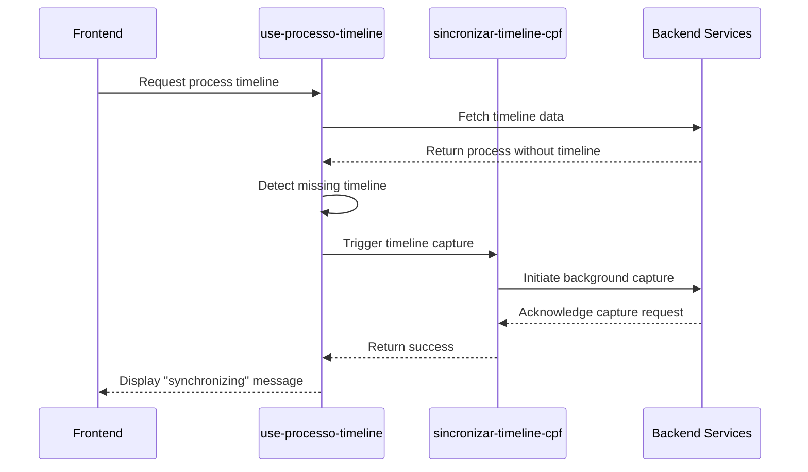
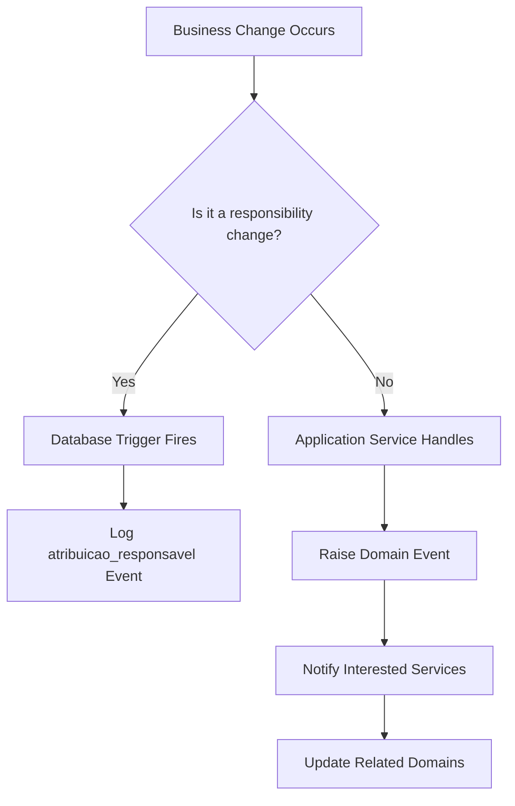
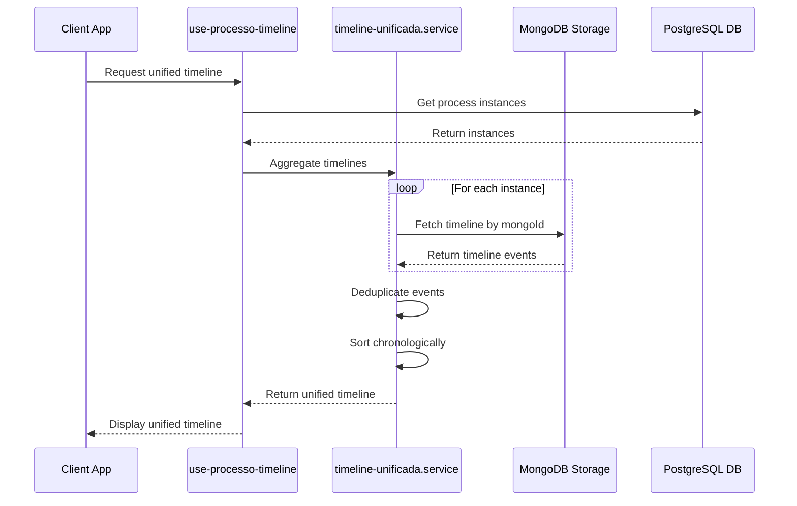

# Domain Events

<cite>
**Referenced Files in This Document**   
- [README.md](file://README.md#L279-L280)
- [timeline-unificada.service.ts](file://backend/acervo/services/timeline/timeline-unificada.service.ts)
- [use-processo-timeline.ts](file://app/_lib/hooks/use-processo-timeline.ts)
- [sincronizar-timeline-cpf.service.ts](file://backend/acervo/services/sincronizar-timeline-cpf.service.ts)
- [20251117015306_create_triggers_log_atribuicao.sql](file://supabase/migrations/aplicadas/20251117015306_create_triggers_log_atribuicao.sql)
- [20251121190001_trigger_desativacao_usuario.sql](file://supabase/migrations/aplicadas/20251121190001_trigger_desativacao_usuario.sql)
- [acervo.ts](file://types/domain/acervo.ts)
- [audiencias.ts](file://types/domain/audiencias.ts)
- [processo-partes.ts](file://types/domain/processo-partes.ts)
- [openspec/changes/archive/2025-12-05-unify-multi-instance-processes/specs/acervo/spec.md](file://openspec/changes/archive/2025-12-05-unify-multi-instance-processes/specs/acervo/spec.md)
</cite>

## Table of Contents
1. [Introduction](#introduction)
2. [Domain Events Overview](#domain-events-overview)
3. [Event Structure and Types](#event-structure-and-types)
4. [Event Publishing Mechanism](#event-publishing-mechanism)
5. [Event-Driven Workflows](#event-driven-workflows)
6. [Benefits of Domain Events](#benefits-of-domain-events)
7. [Implementation Considerations](#implementation-considerations)
8. [Conclusion](#conclusion)

## Introduction
Domain Events in Sinesys serve as a critical mechanism for communicating significant business occurrences across aggregates and bounded contexts. These events enable the system to maintain consistency, provide audit trails, and support complex workflows that span multiple domains. This document details the implementation of Domain Events in Sinesys, focusing on how they are structured, published, and handled throughout the system.

## Domain Events Overview

Domain Events in Sinesys are used to notify the system of significant business occurrences such as when a new hearing is scheduled or a contract is created. According to the project documentation, examples of domain events include `ProcessoCapturado` (Process Captured) and `AudienciaDesignada` (Hearing Designated), which represent important milestones in the legal process lifecycle.

These events play a crucial role in decoupling business logic across different parts of the application, allowing various components to react to business changes without tight coupling. The events are particularly important in Sinesys given the complex nature of legal workflows that involve multiple stakeholders, jurisdictions, and procedural steps.

The implementation follows domain-driven design principles, where events are raised within aggregates and then handled by domain services or application services. This pattern enables the system to maintain consistency while allowing for flexible and extensible business logic.

**Section sources**
- [README.md](file://README.md#L279-L280)

## Event Structure and Types

The structure of domain events in Sinesys is designed to capture essential information about business occurrences while providing metadata for processing and auditing. While specific event classes are not explicitly defined in the codebase, the system implements event-like structures through various mechanisms.

For timeline events, the system defines a `TimelineItemUnificado` interface that extends the base timeline item with additional metadata:

```typescript
export interface TimelineItemUnificado extends TimelineItemEnriquecido {
  /** Grau de origem do evento */
  grauOrigem: GrauProcesso;
  /** TRT de origem */
  trtOrigem: string;
  /** ID da instância no acervo */
  instanciaId: number;
  /** Hash único para deduplicação */
  _dedupeHash: string;
}
```

This structure includes the origin metadata (grauOrigem, trtOrigem) which allows tracking events across different jurisdictions and instances of a process. The `_dedupeHash` field is particularly important for eliminating duplicate events when aggregating timelines from multiple process instances.

The system also defines domain types that represent business entities and their states, such as `Acervo` (representing a legal case), `Audiencia` (representing a hearing), and `ProcessoParte` (representing a party's participation in a case). These types serve as the foundation for domain events, as changes to these entities trigger corresponding events.

**Section sources**
- [timeline-unificada.service.ts](file://backend/acervo/services/timeline/timeline-unificada.service.ts)
- [acervo.ts](file://types/domain/acervo.ts)
- [audiencias.ts](file://types/domain/audiencias.ts)
- [processo-partes.ts](file://types/domain/processo-partes.ts)

## Event Publishing Mechanism

The event publishing mechanism in Sinesys is implemented through a combination of application services and database triggers. When significant business changes occur, events are raised and published to notify interested components.

For timeline synchronization, the system uses a service called `sincronizar-timeline-cpf.service.ts` which implements a "fire-and-forget" pattern for background processing. When a process is returned without a timeline, this service automatically triggers capture in the background, ensuring that the timeline will be available on subsequent requests.



**Diagram sources**
- [use-processo-timeline.ts](file://app/_lib/hooks/use-processo-timeline.ts#L294-L301)
- [sincronizar-timeline-cpf.service.ts](file://backend/acervo/services/sincronizar-timeline-cpf.service.ts)

Additionally, the system uses PostgreSQL triggers to automatically log certain business events. For example, the `log_atribuicao_responsavel` function in the database trigger captures events related to responsibility assignment, such as when a user is assigned or unassigned from a case, hearing, or contract.



**Diagram sources**
- [20251117015306_create_triggers_log_atribuicao.sql](file://supabase/migrations/aplicadas/20251117015306_create_triggers_log_atribuicao.sql)
- [20251121190001_trigger_desativacao_usuario.sql](file://supabase/migrations/aplicadas/20251121190001_trigger_desativacao_usuario.sql)

## Event-Driven Workflows

Sinesys implements several event-driven workflows that demonstrate the power of domain events in coordinating complex business processes. One of the most significant examples is the ProcessTimelineSynchronized event, which triggers updates across related domains when a process timeline is synchronized.

When a timeline is captured or updated, this event triggers a cascade of actions across the system:

1. The timeline data is stored in MongoDB for efficient retrieval
2. The PostgreSQL database is updated with a reference to the timeline
3. Related entities such as hearings and documents are updated
4. Users are notified of new events in their cases
5. Analytics and reporting systems are updated

The system handles multi-instance processes (where a single case exists across multiple jurisdictions) through a sophisticated event aggregation and deduplication process. When a process has multiple instances (e.g., first degree, second degree, TST), the system must unify the timelines from all instances while eliminating duplicate events.



**Diagram sources**
- [use-processo-timeline.ts](file://app/_lib/hooks/use-processo-timeline.ts)
- [timeline-unificada.service.ts](file://backend/acervo/services/timeline/timeline-unificada.service.ts)

The deduplication process is particularly sophisticated, using a hash of `(data, tipo, descricao)` to identify duplicate events across different instances of the same process. This ensures that users see a clean, consolidated timeline without redundant entries.

**Section sources**
- [openspec/changes/archive/2025-12-05-unify-multi-instance-processes/specs/acervo/spec.md](file://openspec/changes/archive/2025-12-05-unify-multi-instance-processes/specs/acervo/spec.md)
- [timeline-unificada.service.ts](file://backend/acervo/services/timeline/timeline-unificada.service.ts)

## Benefits of Domain Events

Domain Events in Sinesys provide several key benefits that enhance the system's architecture and functionality:

### Decoupling Business Logic
By using events to communicate between different parts of the system, Sinesys achieves significant decoupling of business logic. Components can react to events without knowing about the components that raised them, allowing for greater flexibility and easier maintenance.

### Eventual Consistency
The event-driven architecture enables eventual consistency across the system. When a process timeline is updated, related domains are updated asynchronously, ensuring that the system remains responsive even during complex operations.

### Audit Trails
The event system provides comprehensive audit trails by logging significant business occurrences. The database triggers that capture responsibility changes create a permanent record of who was responsible for cases, hearings, and contracts at any given time.

### Scalability
The fire-and-forget pattern used for timeline synchronization allows the system to handle high volumes of requests without blocking the user interface. Background processing ensures that intensive operations don't impact user experience.

### Extensibility
New features can be added by creating new event handlers without modifying existing code. For example, adding a new notification system would simply require creating a new handler for existing events rather than modifying the event-raising code.

## Implementation Considerations

### Event Storage
Sinesys uses a hybrid storage approach for events and event-related data. Timeline events are stored in MongoDB for efficient retrieval and aggregation, while references to these events are stored in PostgreSQL. This combination leverages the strengths of both databases: PostgreSQL for relational integrity and MongoDB for flexible, high-performance document storage.

### Replay Capabilities
The system supports event replay through its timeline synchronization mechanism. When a timeline reference is found to be invalid (e.g., the MongoDB document was deleted), the system clears the reference and allows re-capture, effectively replaying the event capture process.

### Error Handling
Error handling is implemented through several mechanisms:
- Database triggers include logic to handle cases where no user context is available
- The timeline synchronization service provides user feedback when processing is in progress
- Invalid references are detected and cleaned up automatically

### Event Delivery Reliability
The system ensures event delivery reliability through:
- Database transactions for critical operations
- Background job queuing for intensive operations
- Polling mechanisms to monitor long-running processes
- Automatic cleanup of invalid references

## Conclusion
Domain Events in Sinesys provide a robust mechanism for communicating significant business occurrences across aggregates and bounded contexts. By implementing a sophisticated event-driven architecture, the system achieves decoupling of business logic, eventual consistency, comprehensive audit trails, and high scalability. The implementation demonstrates thoughtful consideration of real-world requirements, particularly in handling complex legal workflows that span multiple jurisdictions and require careful coordination between different domains.