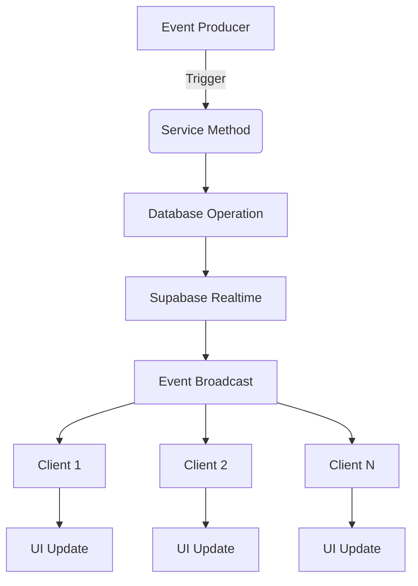
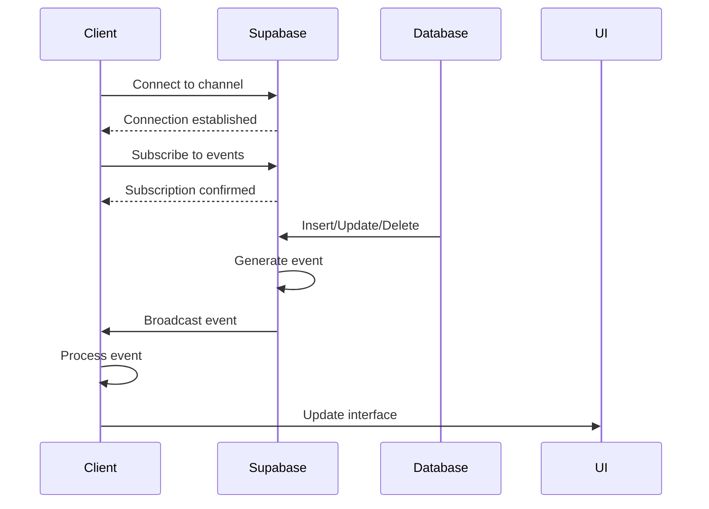
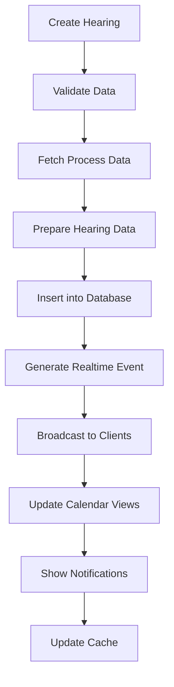
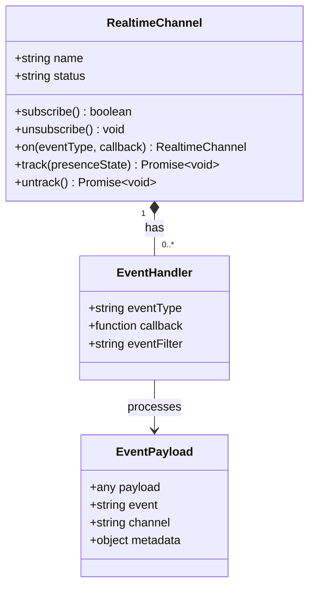
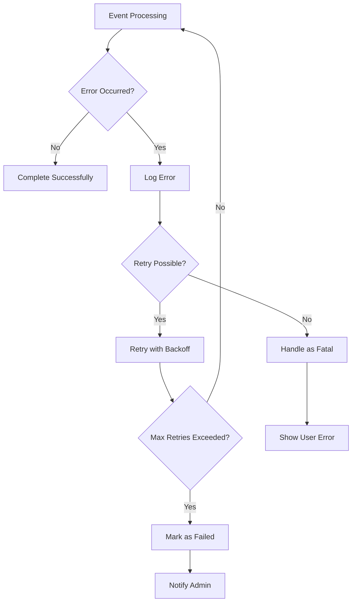

# Event Handling

<cite>
**Referenced Files in This Document**   
- [use-realtime-chat.tsx](file://hooks/use-realtime-chat.tsx)
- [supabase-provider.ts](file://lib/yjs/supabase-provider.ts)
- [use-realtime-cursors.ts](file://hooks/use-realtime-cursors.ts)
- [criar-audiencia.service.ts](file://backend/audiencias/services/criar-audiencia.service.ts)
- [atualizar-url-virtual.service.ts](file://backend/audiencias/services/atualizar-url-virtual.service.ts)
- [atribuir-responsavel.service.ts](file://backend/audiencias/services/atribuir-responsavel.service.ts)
- [audiencias-visualizacao-ano.tsx](file://app/(dashboard)/audiencias/components/audiencias-visualizacao-ano.tsx)
- [audiencias-visualizacao-mes.tsx](file://app/(dashboard)/audiencias/components/audiencias-visualizacao-mes.tsx)
</cite>

## Table of Contents
1. [Introduction](#introduction)
2. [Event Handling Architecture](#event-handling-architecture)
3. [Real-time Event Processing](#real-time-event-processing)
4. [Audiência Event Workflows](#audiência-event-workflows)
5. [Event Subscription and Broadcasting](#event-subscription-and-broadcasting)
6. [Error Handling and Reliability](#error-handling-and-reliability)
7. [Conclusion](#conclusion)

## Introduction

The Sinesys platform implements a robust event handling system that enables real-time collaboration, notifications, and workflow automation across various legal case management features. This document details the event handling implementation with a focus on domain events, particularly in the context of audiência (hearing) management. The system leverages Supabase Realtime for event broadcasting and subscription, enabling immediate updates across clients when domain events occur.

The event handling architecture supports both synchronous operations within service methods and asynchronous real-time communication between clients. This dual approach ensures data consistency while providing a responsive user experience. Key use cases include hearing creation, responsible attorney assignment, and virtual hearing URL updates, all of which trigger corresponding events that update relevant system components.

## Event Handling Architecture

The event handling system in Sinesys follows a publish-subscribe pattern implemented primarily through Supabase Realtime channels. This architecture enables decoupled communication between event producers and consumers, allowing various components to react to domain events without direct dependencies.

The system distinguishes between database-level events (handled through Supabase Realtime) and application-level events (managed through custom event emitters). Database events are automatically generated by Supabase when records are inserted, updated, or deleted, while application events are explicitly triggered by service methods in response to business logic execution.

**Diagram sources**
- [criar-audiencia.service.ts](file://backend/audiencias/services/criar-audiencia.service.ts)
- [use-realtime-chat.tsx](file://hooks/use-realtime-chat.tsx)

**Section sources**
- [criar-audiencia.service.ts](file://backend/audiencias/services/criar-audiencia.service.ts)
- [supabase-provider.ts](file://lib/yjs/supabase-provider.ts)

## Real-time Event Processing

Sinesys implements real-time event processing through Supabase Realtime channels, which provide WebSockets-based bidirectional communication between the server and clients. This enables immediate propagation of events such as hearing updates, chat messages, and collaborative editing actions.

The real-time processing follows a three-phase pattern: connection setup, event subscription, and message handling. When a client connects to a Supabase channel, it establishes a persistent WebSocket connection and subscribes to specific event types. The system then routes incoming events to the appropriate handlers based on their type and payload.

**Diagram sources**
- [use-realtime-chat.tsx](file://hooks/use-realtime-chat.tsx)
- [supabase-provider.ts](file://lib/yjs/supabase-provider.ts)

**Section sources**
- [use-realtime-chat.tsx](file://hooks/use-realtime-chat.tsx)
- [use-realtime-cursors.ts](file://hooks/use-realtime-cursors.ts)

## Audiência Event Workflows

The audiência (hearing) management system in Sinesys demonstrates a comprehensive event-driven workflow that coordinates multiple system components. When a new hearing is created or updated, a series of events are triggered that update the UI, send notifications, and maintain data consistency across related entities.

The primary event workflow begins with the creation of a new hearing through the `criarAudiencia` service method. This method validates the hearing data, retrieves related process information, and inserts the hearing record into the database. The database insertion triggers a Supabase Realtime event that is broadcast to all subscribed clients, causing their hearing calendars to update immediately.

**Diagram sources**
- [criar-audiencia.service.ts](file://backend/audiencias/services/criar-audiencia.service.ts)
- [audiencias-visualizacao-ano.tsx](file://app/(dashboard)/audiencias/components/audiencias-visualizacao-ano.tsx)

**Section sources**
- [criar-audiencia.service.ts](file://backend/audiencias/services/criar-audiencia.service.ts)
- [audiencias-visualizacao-ano.tsx](file://app/(dashboard)/audiencias/components/audiencias-visualizacao-ano.tsx)
- [audiencias-visualizacao-mes.tsx](file://app/(dashboard)/audiencias/components/audiencias-visualizacao-mes.tsx)

## Event Subscription and Broadcasting

The event subscription and broadcasting mechanism in Sinesys is implemented through Supabase Realtime channels, which provide a reliable and efficient way to distribute events to interested clients. Each feature area typically has its own channel or uses channel namespaces to organize event traffic.

Clients subscribe to events by creating a channel with a specific name and registering handlers for different event types. The system supports both broadcast events (sent to all subscribers) and presence events (tracking connected users). This allows for rich collaborative features such as seeing other users' cursors in document editors or viewing who is currently typing in chat.

The subscription process follows a standard pattern across the application:

1. Create a channel with a unique name
2. Register event handlers for specific event types
3. Subscribe to the channel
4. Handle subscription status changes
5. Clean up subscriptions on component unmount

**Diagram sources**
- [use-realtime-chat.tsx](file://hooks/use-realtime-chat.tsx)
- [use-realtime-cursors.ts](file://hooks/use-realtime-cursors.ts)

**Section sources**
- [use-realtime-chat.tsx](file://hooks/use-realtime-chat.tsx)
- [use-realtime-cursors.ts](file://hooks/use-realtime-cursors.ts)

## Error Handling and Reliability

The event handling system in Sinesys incorporates comprehensive error handling and reliability mechanisms to ensure consistent behavior even under adverse conditions. These mechanisms address network failures, message duplication, and client disconnections.

The system implements several key reliability features:

- **Automatic reconnection**: When a network interruption occurs, the system automatically attempts to reconnect to Supabase Realtime channels
- **Message deduplication**: Events are checked for duplicates before processing to prevent redundant UI updates
- **Error logging**: All event handling errors are logged for monitoring and debugging
- **Graceful degradation**: When real-time features are unavailable, the system falls back to polling mechanisms

For critical operations like hearing creation or responsible attorney assignment, the system uses database transactions and service-level validation to ensure data integrity. After successful operations, cache invalidation is performed to ensure consistency across distributed systems.

The error handling strategy follows a layered approach:

1. Input validation at the service method level
2. Database constraint enforcement
3. Network error handling in the Realtime layer
4. UI-level error presentation to users

**Diagram sources**
- [atribuir-responsavel.service.ts](file://backend/audiencias/services/atribuir-responsavel.service.ts)
- [atualizar-url-virtual.service.ts](file://backend/audiencias/services/atualizar-url-virtual.service.ts)

**Section sources**
- [atribuir-responsavel.service.ts](file://backend/audiencias/services/atribuir-responsavel.service.ts)
- [atualizar-url-virtual.service.ts](file://backend/audiencias/services/atualizar-url-virtual.service.ts)

## Conclusion

The event handling implementation in Sinesys provides a robust foundation for real-time collaboration and workflow automation in legal case management. By leveraging Supabase Realtime and a well-structured service layer, the system enables immediate propagation of domain events across clients while maintaining data consistency and reliability.

Key strengths of the implementation include its decoupled architecture, comprehensive error handling, and support for both synchronous and asynchronous operations. The audiência management system serves as an excellent example of how event-driven design can coordinate complex workflows involving multiple system components.

Future enhancements could include more sophisticated event queuing for offline scenarios, enhanced event filtering capabilities, and improved monitoring of event processing performance. The current architecture provides a solid foundation for these extensions while already delivering a responsive and reliable user experience.