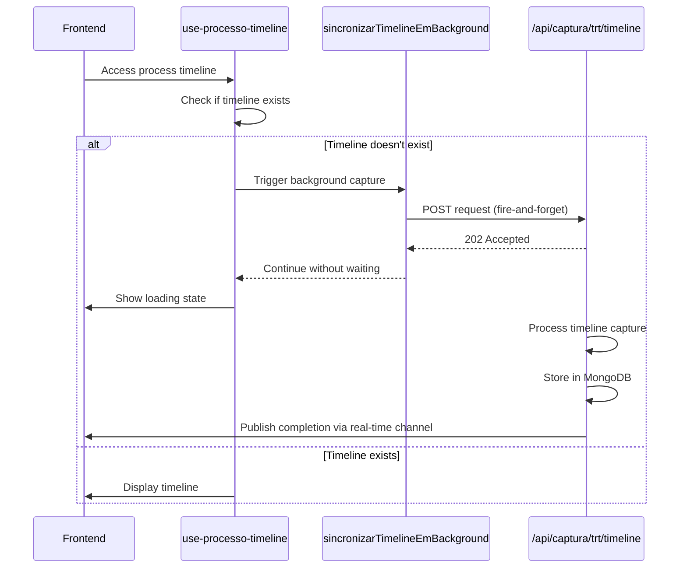
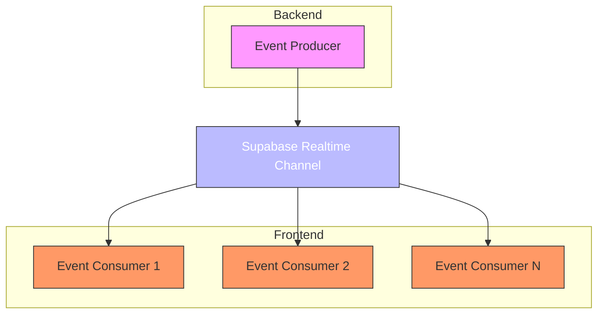

# Event Publishing

<cite>
**Referenced Files in This Document**   
- [sincronizar-timeline-cpf.service.ts](file://backend/acervo/services/sincronizar-timeline-cpf.service.ts)
- [use-processo-timeline.ts](file://app/_lib/hooks/use-processo-timeline.ts)
- [timeline-unificada.service.ts](file://backend/acervo/services/timeline/timeline-unificada.service.ts)
- [use-realtime-collaboration.ts](file://hooks/use-realtime-collaboration.ts)
- [use-realtime-cursors.ts](file://hooks/use-realtime-cursors.ts)
- [chat-room.tsx](file://components/chat/chat-room.tsx)
- [use-realtime-chat.tsx](file://hooks/use-realtime-chat.tsx)
</cite>

## Table of Contents
1. [Introduction](#introduction)
2. [Event Publishing Mechanism](#event-publishing-mechanism)
3. [Timeline Synchronization Example](#timeline-synchronization-example)
4. [Publish/Subscribe Implementation](#publishsubscribe-implementation)
5. [Transactional Consistency](#transactional-consistency)
6. [Error Handling Strategies](#error-handling-strategies)
7. [Conclusion](#conclusion)

## Introduction
The Sinesys application implements a robust event publishing mechanism that facilitates real-time updates and background processing across various components. This document details how domain events are published within aggregates and services, focusing on the pattern of raising events during business operations and dispatching them to handlers. The system leverages Supabase's real-time capabilities and fire-and-forget background processing to ensure responsive user experiences while maintaining data consistency.

**Section sources**
- [sincronizar-timeline-cpf.service.ts](file://backend/acervo/services/sincronizar-timeline-cpf.service.ts)
- [use-processo-timeline.ts](file://app/_lib/hooks/use-processo-timeline.ts)

## Event Publishing Mechanism
The event publishing mechanism in Sinesys follows a publish/subscribe pattern where events are raised during business operations and dispatched to interested subscribers. The system uses Supabase's real-time channels to broadcast events to clients, enabling real-time updates without requiring manual page refreshes. Events are typically published after successful completion of business operations, ensuring that only valid state changes trigger downstream effects.

The pattern involves raising events at key points in the application flow, such as after data synchronization, user interactions, or state changes. These events are then dispatched to handlers that perform additional processing, update UI components, or trigger background jobs. The implementation ensures loose coupling between components by decoupling event producers from consumers.

**Section sources**
- [use-realtime-collaboration.ts](file://hooks/use-realtime-collaboration.ts)
- [use-realtime-cursors.ts](file://hooks/use-realtime-cursors.ts)
- [chat-room.tsx](file://components/chat/chat-room.tsx)

## Timeline Synchronization Example
A concrete example of event publishing in Sinesys is the timeline synchronization process. When a user accesses a process timeline that hasn't been captured yet, the system raises a `ProcessTimelineSynchronized` event after successful synchronization. This occurs in the `sincronizarTimelineEmBackground` function, which fires a background request to capture the timeline without blocking the main response.

The workflow begins when the `use-processo-timeline` hook detects that a timeline doesn't exist for a process. It automatically triggers the capture process, which then publishes events through Supabase's real-time channels. The `isCapturing` state in the hook reflects this process, showing appropriate loading messages to the user while the background synchronization occurs.

**Diagram sources**
- [sincronizar-timeline-cpf.service.ts](file://backend/acervo/services/sincronizar-timeline-cpf.service.ts)
- [use-processo-timeline.ts](file://app/_lib/hooks/use-processo-timeline.ts)

**Section sources**
- [sincronizar-timeline-cpf.service.ts](file://backend/acervo/services/sincronizar-timeline-cpf.service.ts#L51-L99)
- [use-processo-timeline.ts](file://app/_lib/hooks/use-processo-timeline.ts#L294-L302)

## Publish/Subscribe Implementation
Sinesys implements a publish/subscribe mechanism using Supabase's real-time capabilities. The system creates dedicated channels for different types of events, allowing components to subscribe to specific event types they're interested in. This implementation is evident in various hooks and components that establish real-time connections to receive updates.

The `use-realtime-collaboration` hook demonstrates this pattern by subscribing to content update events, presence changes, and cursor movements. Similarly, the `use-realtime-chat` hook listens for message events and typing indicators, while `use-realtime-cursors` tracks cursor positions of collaborating users. Each component establishes a channel connection and registers event listeners for specific event types.

**Diagram sources**
- [use-realtime-collaboration.ts](file://hooks/use-realtime-collaboration.ts#L130-L143)
- [use-realtime-chat.tsx](file://hooks/use-realtime-chat.tsx#L57-L99)
- [use-realtime-cursors.ts](file://hooks/use-realtime-cursors.ts#L110-L133)

**Section sources**
- [use-realtime-collaboration.ts](file://hooks/use-realtime-collaboration.ts#L130-L143)
- [use-realtime-chat.tsx](file://hooks/use-realtime-chat.tsx#L57-L99)
- [use-realtime-cursors.ts](file://hooks/use-realtime-cursors.ts#L110-L133)

## Transactional Consistency
The event publishing mechanism in Sinesys addresses transactional consistency by ensuring events are only published after successful transaction commits. The system employs a fire-and-forget approach for background operations, where the primary transaction completes successfully before any event publication occurs.

In the timeline synchronization example, the initial response to the user is not dependent on the completion of the timeline capture. Instead, the system returns immediately with a message indicating that synchronization is in progress, while the actual capture happens in the background. This approach ensures that the user experience is not blocked by potentially long-running operations while maintaining data consistency.

The use of Supabase's real-time channels further enhances consistency by providing reliable message delivery. When a timeline capture completes successfully, the system publishes a completion event through the real-time channel, which updates the client-side state accordingly.

**Section sources**
- [sincronizar-timeline-cpf.service.ts](file://backend/acervo/services/sincronizar-timeline-cpf.service.ts#L42-L99)
- [use-processo-timeline.ts](file://app/_lib/hooks/use-processo-timeline.ts#L294-L302)

## Error Handling Strategies
Sinesys implements comprehensive error handling strategies for failed event publication. The system follows a fire-and-forget model for background operations, where errors in event publication do not affect the primary business transaction. Instead, errors are logged for monitoring and debugging purposes without disrupting the user experience.

In the `sincronizarTimelineEmBackground` function, the fetch requests to initiate timeline capture are wrapped in catch blocks that log warnings but do not throw exceptions. This ensures that even if the background job fails to start, the main request flow continues uninterrupted. The system relies on client-side polling to eventually detect and handle any failures in the background process.

Additionally, the real-time event handlers include validation and filtering logic to handle malformed or unexpected events gracefully. For example, the collaboration hooks verify that incoming events are from other users before processing them, preventing self-referential updates.

**Section sources**
- [sincronizar-timeline-cpf.service.ts](file://backend/acervo/services/sincronizar-timeline-cpf.service.ts#L91-L95)
- [use-realtime-collaboration.ts](file://hooks/use-realtime-collaboration.ts#L144-L154)
- [use-realtime-chat.tsx](file://hooks/use-realtime-chat.tsx#L60-L66)

## Conclusion
The event publishing mechanism in Sinesys effectively balances real-time updates with system reliability and user experience. By leveraging Supabase's real-time capabilities and implementing a fire-and-forget pattern for background operations, the system provides responsive interfaces while ensuring transactional consistency. The publish/subscribe implementation enables loose coupling between components, allowing for scalable and maintainable architecture. Comprehensive error handling strategies ensure that transient failures do not impact the overall system stability, making the event publishing mechanism robust and reliable.