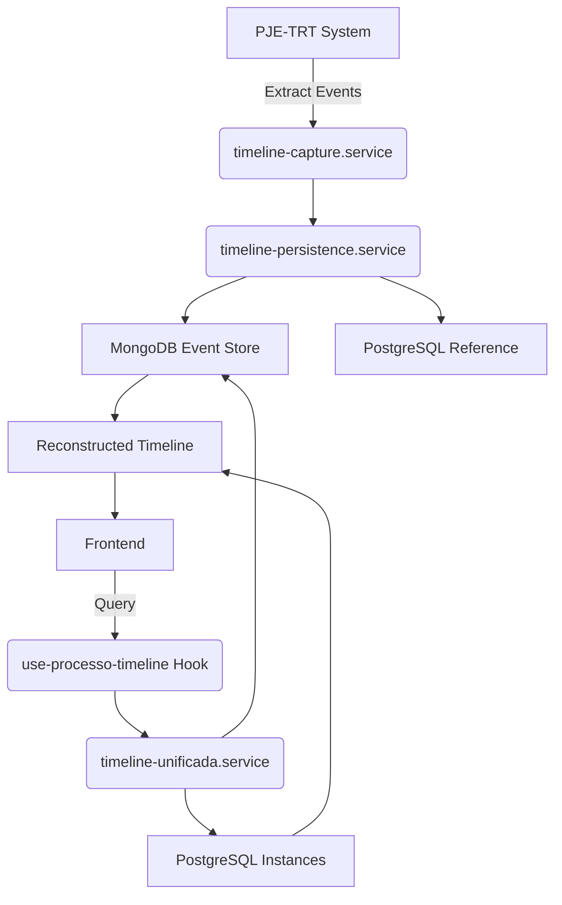
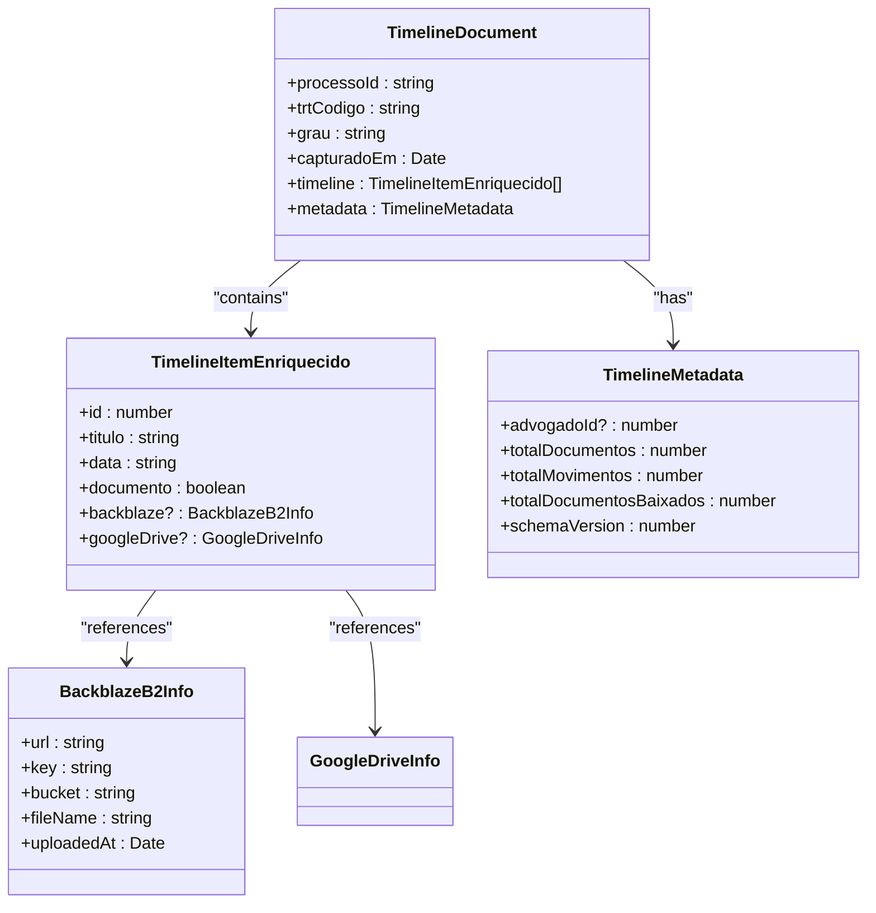
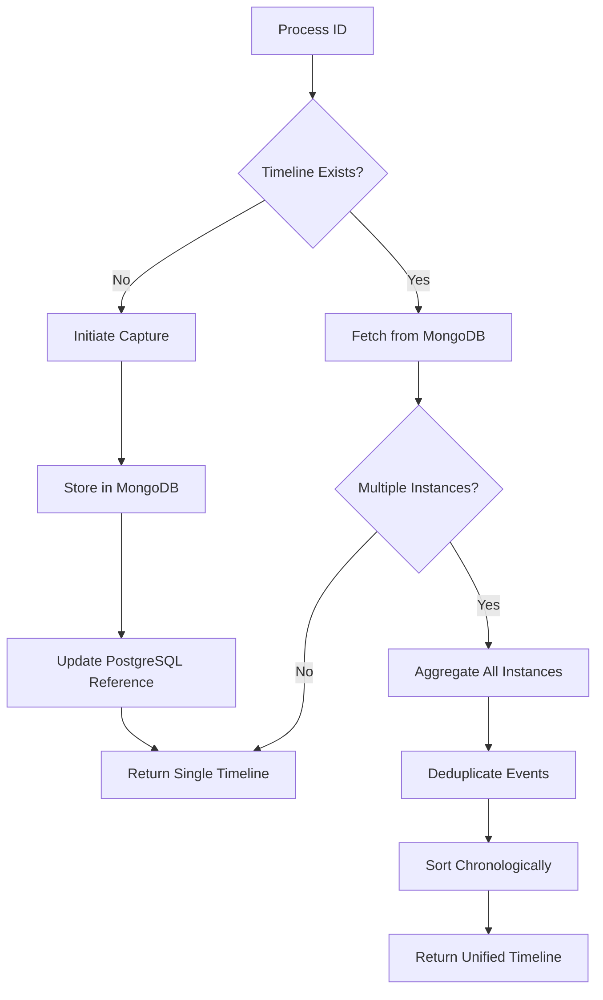
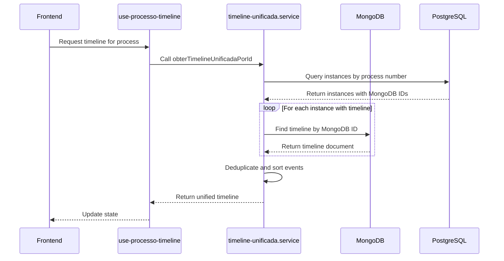

# Event Sourcing

<cite>
**Referenced Files in This Document**   
- [timeline-persistence.service.ts](file://backend/captura/services/timeline/timeline-persistence.service.ts)
- [timeline-unificada.service.ts](file://backend/acervo/services/timeline/timeline-unificada.service.ts)
- [use-processo-timeline.ts](file://app/_lib/hooks/use-processo-timeline.ts)
- [timeline.ts](file://backend/types/mongodb/timeline.ts)
- [timeline.ts](file://backend/types/pje-trt/timeline.ts)
- [timeline.md](file://app/_lib/types/timeline.ts)
- [verificacao-timeline-existente/spec.md](file://openspec/changes/archive/2025-11-22-visualizacao-processo-timeline/specs/verificacao-timeline-existente/spec.md)
- [unify-multi-instance-processes/spec.md](file://openspec/changes/archive/2025-12-05-unify-multi-instance-processes/spec.md)
</cite>

## Table of Contents
1. [Introduction](#introduction)
2. [Event Sourcing Architecture](#event-sourcing-architecture)
3. [Event Storage Mechanism](#event-storage-mechanism)
4. [Timeline Reconstruction](#timeline-reconstruction)
5. [Snapshotting and Performance Optimization](#snapshotting-and-performance-optimization)
6. [Benefits and Trade-offs](#benefits-and-trade-offs)
7. [Conclusion](#conclusion)

## Introduction

Sinesys implements an event sourcing pattern for managing process timelines, capturing and storing all events from legal proceedings in a dedicated event store. This approach enables the system to reconstruct the complete history of any legal process, providing powerful capabilities for audit trails, temporal queries, and debugging. The implementation focuses on capturing timeline events from the PJE-TRT (Processo Judicial Eletrônico do Tribunal Regional do Trabalho) system, storing them in MongoDB as an event store, and providing mechanisms to reconstruct aggregate state from these events.

The event sourcing pattern in Sinesys is specifically applied to process timelines, which consist of both documents and procedural movements. Each event contains rich metadata and is stored in a way that preserves the complete history of a legal process across multiple instances (first degree, second degree, TST). This documentation details how event sourcing principles are implemented in the system, including storage mechanisms, replay capabilities, and optimization strategies.

**Section sources**
- [verificacao-timeline-existente/spec.md](file://openspec/changes/archive/2025-11-22-visualizacao-processo-timeline/specs/verificacao-timeline-existente/spec.md#L33-L46)
- [unify-multi-instance-processes/spec.md](file://openspec/changes/archive/2025-12-05-unify-multi-instance-processes/spec.md#L33-L64)

## Event Sourcing Architecture

The event sourcing architecture in Sinesys follows a clear separation between command and query responsibilities, with specialized services handling event capture, storage, and retrieval. The system captures events from external sources (PJE-TRT) and stores them in a dedicated event store (MongoDB), while maintaining references in the primary PostgreSQL database.

**Diagram sources**
- [timeline-persistence.service.ts](file://backend/captura/services/timeline/timeline-persistence.service.ts#L38-L203)
- [timeline-unificada.service.ts](file://backend/acervo/services/timeline/timeline-unificada.service.ts#L166-L281)
- [use-processo-timeline.ts](file://app/_lib/hooks/use-processo-timeline.ts#L108-L329)

The architecture consists of several key components:
- **Event Capture Service**: Extracts timeline events from the PJE-TRT system
- **Event Store**: MongoDB database that persists the complete timeline events
- **Reference Store**: PostgreSQL database that maintains references to event store documents
- **Query Service**: Aggregates and deduplicates events from multiple instances
- **Client Hook**: Manages the frontend interaction with the event sourcing system

This separation allows for efficient storage of large volumes of timeline data in MongoDB while maintaining relational integrity and referential data in PostgreSQL. The system is designed to handle multi-instance processes, where a single legal case may exist across different court levels (first degree, second degree, TST), each with its own timeline of events.

**Section sources**
- [timeline-persistence.service.ts](file://backend/captura/services/timeline/timeline-persistence.service.ts#L1-L203)
- [timeline-unificada.service.ts](file://backend/acervo/services/timeline/timeline-unificada.service.ts#L1-L281)

## Event Storage Mechanism

Sinesys employs MongoDB as its event store, leveraging its document-oriented nature to efficiently store complex timeline events with nested structures and variable schemas. The storage mechanism is implemented in the `timeline-persistence.service.ts` file, which handles the saving and retrieval of timeline events.

**Diagram sources**
- [timeline.ts](file://backend/types/mongodb/timeline.ts#L11-L43)
- [timeline.ts](file://backend/types/pje-trt/timeline.ts#L204-L210)
- [timeline.md](file://app/_lib/types/timeline.ts#L85-L93)

The event storage mechanism follows these key principles:

1. **Document Structure**: Each process instance (identified by process ID, TRT code, and degree) has its own document in MongoDB containing the complete timeline.

2. **Upsert Semantics**: The system uses MongoDB's upsert functionality to either create a new document or update an existing one, ensuring that the latest timeline is always stored.

3. **Metadata Enrichment**: Events are enriched with metadata from external storage systems (Backblaze B2 for document storage) before being persisted.

4. **Reference Management**: After storing the timeline in MongoDB, the system updates the PostgreSQL database with the MongoDB document ID, creating a reference between the relational and document databases.

The `salvarTimelineNoMongoDB` function implements the core storage logic, calculating statistics about the timeline (total documents, movements, downloaded documents) and storing them in the metadata field. This allows for efficient querying and reporting without having to process the entire timeline array.

**Section sources**
- [timeline-persistence.service.ts](file://backend/captura/services/timeline/timeline-persistence.service.ts#L38-L113)
- [timeline.ts](file://backend/types/mongodb/timeline.ts#L11-L56)

## Timeline Reconstruction

The timeline reconstruction process in Sinesys demonstrates the core principle of event sourcing: rebuilding aggregate state from a sequence of events. The system provides two levels of reconstruction: individual instance timelines and unified timelines that aggregate events from multiple instances of the same process.

**Diagram sources**
- [timeline-unificada.service.ts](file://backend/acervo/services/timeline/timeline-unificada.service.ts#L166-L281)
- [use-processo-timeline.ts](file://app/_lib/hooks/use-processo-timeline.ts#L108-L329)

The reconstruction process is implemented in the `obterTimelineUnificada` function, which follows these steps:

1. **Instance Discovery**: The system queries PostgreSQL to find all instances of a process (identified by the same process number across different degrees).

2. **Event Aggregation**: For each instance with a timeline, the system retrieves the timeline from MongoDB and enriches each event with metadata about its origin (degree, TRT, instance ID).

3. **Deduplication**: Events that appear in multiple instances (such as documents or movements that are replicated across court levels) are deduplicated using a hash-based approach.

4. **Prioritization**: When duplicate events exist, the system applies a prioritization strategy:
   - Events with storage links (Backblaze B2) are preferred
   - Higher degree instances (second degree, TST) are preferred over lower degrees (first degree)

5. **Chronological Sorting**: The final timeline is sorted in reverse chronological order (newest events first) for optimal user experience.

The deduplication mechanism uses the `gerarHashDeduplicacao` function to create unique hashes for each event:
- For documents: Uses `idUnicoDocumento` if available, otherwise combines date, type, and title
- For movements: Combines date, CNJ movement code, and title

This ensures that identical events across instances are properly identified and deduplicated while preserving the most complete version.

**Section sources**
- [timeline-unificada.service.ts](file://backend/acervo/services/timeline/timeline-unificada.service.ts#L64-L136)
- [unify-multi-instance-processes/spec.md](file://openspec/changes/archive/2025-12-05-unify-multi-instance-processes/spec.md#L43-L64)

## Snapshotting and Performance Optimization

Sinesys implements a form of snapshotting through its reference-based architecture, optimizing performance by avoiding the need to replay all events for common queries. The system uses the MongoDB document ID stored in PostgreSQL as a snapshot reference, allowing direct access to the current state of a timeline.

**Diagram sources**
- [timeline-unificada.service.ts](file://backend/acervo/services/timeline/timeline-unificada.service.ts#L166-L281)
- [use-processo-timeline.ts](file://app/_lib/hooks/use-processo-timeline.ts#L108-L329)

The performance optimization strategy includes several key elements:

1. **Reference Caching**: PostgreSQL stores the MongoDB document ID (`timeline_mongodb_id`) for each process instance, eliminating the need to search MongoDB by process criteria.

2. **Batch Retrieval**: When reconstructing a unified timeline, the system retrieves all instance timelines in parallel rather than sequentially.

3. **Client-Side Polling**: The `use-processo-timeline` hook implements a polling mechanism that checks for timeline availability during capture, with a configurable interval and maximum attempts to prevent infinite loops.

4. **Error Resilience**: The system handles cases where MongoDB references become invalid (e.g., if a document is manually deleted) by detecting the missing document and clearing the reference in PostgreSQL, allowing for re-capture.

The snapshotting approach in Sinesys differs from traditional event sourcing snapshots in that it stores the complete timeline rather than an aggregate state. This design choice prioritizes auditability and temporal querying capabilities over storage efficiency, as the complete event history is always preserved and readily accessible.

**Section sources**
- [timeline-persistence.service.ts](file://backend/captura/services/timeline/timeline-persistence.service.ts#L118-L140)
- [verificacao-timeline-existente/spec.md](file://openspec/changes/archive/2025-11-22-visualizacao-processo-timeline/specs/verificacao-timeline-existente/spec.md#L33-L42)
- [use-processo-timeline.ts](file://app/_lib/hooks/use-processo-timeline.ts#L185-L215)

## Benefits and Trade-offs

The event sourcing implementation in Sinesys provides significant benefits for legal process management, particularly in the areas of auditability, debugging, and temporal analysis. However, this approach also introduces complexity and eventual consistency considerations that must be managed.

### Benefits

1. **Comprehensive Audit Trails**: By storing every event in the process timeline, Sinesys creates an immutable record of all activities, providing a complete audit trail that is essential for legal compliance and accountability.

2. **Temporal Queries**: The system can answer questions about the state of a process at any point in time by replaying events up to that date, enabling powerful temporal analysis capabilities.

3. **Debugging and Reconciliation**: When discrepancies occur between systems, the complete event history allows developers and administrators to trace the exact sequence of events that led to the current state.

4. **Multi-Instance Aggregation**: The ability to unify timelines across multiple instances of the same process (first degree, second degree, TST) provides a holistic view of a legal case's progression through the judicial system.

### Trade-offs

1. **Complexity**: The event sourcing pattern introduces significant complexity in both implementation and understanding, requiring specialized knowledge to maintain and extend.

2. **Eventual Consistency**: There is a delay between when a process is requested and when its timeline is available, as the system must capture events from external sources. The client-side polling mechanism addresses this but introduces eventual consistency.

3. **Storage Requirements**: Storing the complete history of all events requires more storage space than storing only the current state, though this is mitigated by using MongoDB for the event store.

4. **Query Complexity**: While event sourcing excels at temporal queries, it can make simple queries about the current state more complex, as they require replaying events or maintaining separate query models.

The system addresses these trade-offs through careful design choices, such as maintaining references in PostgreSQL for quick lookups and implementing robust error handling for cases where event capture fails or references become invalid.

**Section sources**
- [verificacao-timeline-existente/spec.md](file://openspec/changes/archive/2025-11-22-visualizacao-processo-timeline/specs/verificacao-timeline-existente/spec.md#L33-L42)
- [unify-multi-instance-processes/spec.md](file://openspec/changes/archive/2025-12-05-unify-multi-instance-processes/spec.md#L33-L64)

## Conclusion

Sinesys implements a sophisticated event sourcing pattern for managing legal process timelines, demonstrating how this architectural approach can be effectively applied to complex domain problems. By capturing and storing all timeline events in MongoDB while maintaining references in PostgreSQL, the system achieves a balance between the benefits of event sourcing and practical performance considerations.

The implementation excels in providing comprehensive audit trails, enabling temporal queries, and supporting the aggregation of events across multiple instances of the same legal process. The deduplication and prioritization strategies ensure that users receive a clean, unified timeline that accurately represents the progression of a case through the judicial system.

While the event sourcing approach introduces complexity and eventual consistency challenges, Sinesys addresses these through thoughtful design patterns, including reference-based snapshotting, client-side polling with timeouts, and robust error handling. The system serves as a compelling example of how event sourcing can be applied to real-world applications where auditability, historical accuracy, and data integrity are paramount requirements.