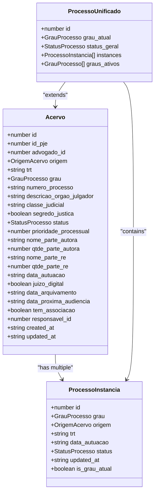
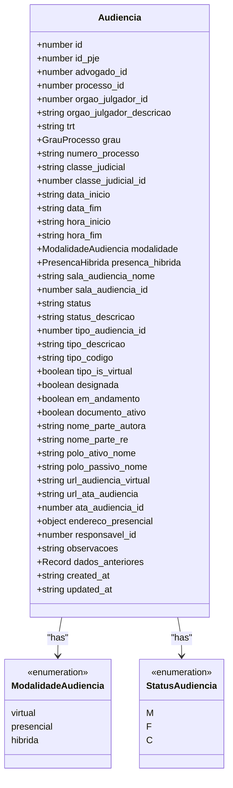
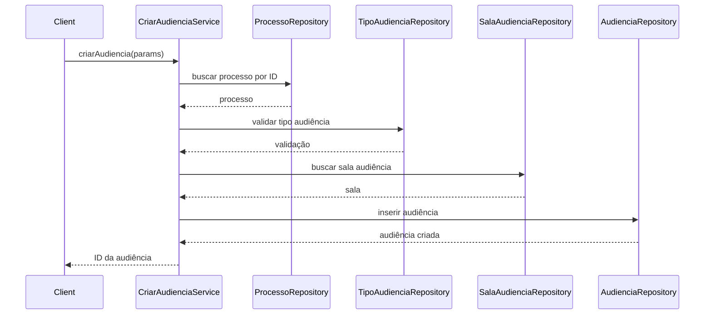
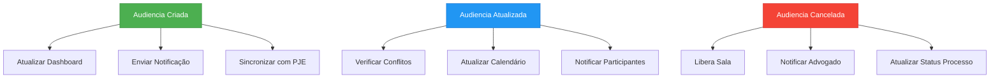

# Domain-Driven Design

<cite>
**Referenced Files in This Document**   
- [acervo.ts](file://types/domain/acervo.ts)
- [audiencias.ts](file://types/domain/audiencias.ts)
- [partes.ts](file://types/domain/partes.ts)
- [value-objects.ts](file://types/domain/value-objects.ts)
- [common.ts](file://types/domain/common.ts)
- [processo-partes.ts](file://types/domain/processo-partes.ts)
- [representantes.ts](file://types/domain/representantes.ts)
- [criar-audiencia.service.ts](file://backend/audiencias/services/criar-audiencia.service.ts)
- [buscar-acervo.service.ts](file://backend/acervo/services/buscar-acervo.service.ts)
</cite>

## Table of Contents
1. [Introduction](#introduction)
2. [Strategic Design](#strategic-design)
3. [Core Domain Entities](#core-domain-entities)
4. [Value Objects and Business Rules](#value-objects-and-business-rules)
5. [Aggregates and Transactional Boundaries](#aggregates-and-transactional-boundaries)
6. [Domain Services](#domain-services)
7. [Domain Events and Communication](#domain-events-and-communication)
8. [Bounded Contexts](#bounded-contexts)
9. [Conclusion](#conclusion)

## Introduction

Sinesys implements Domain-Driven Design (DDD) principles to model complex legal domain concepts with precision and clarity. The system captures core business concepts of legal processes, hearings, contracts, and parties through rich domain entities located in the `types/domain/` directory. This documentation explores how Sinesys applies DDD strategic and tactical patterns to create a maintainable, expressive domain model that facilitates communication between technical and non-technical stakeholders.

The domain model serves as a shared language between developers, legal professionals, and business stakeholders, ensuring that the software accurately reflects the complexities of legal practice. By implementing bounded contexts, aggregates, value objects, and domain services, Sinesys creates a robust architecture that supports the evolution of complex business rules while maintaining transactional consistency and data integrity.

**Section sources**
- [acervo.ts](file://types/domain/acervo.ts#L1-L81)
- [audiencias.ts](file://types/domain/audiencias.ts#L1-L77)

## Strategic Design

Sinesys applies strategic DDD patterns to structure the legal domain into coherent, well-defined bounded contexts. The system models legal processes as first-class domain entities with rich behavior and invariants, rather than treating them as simple data containers. This approach enables the system to capture the nuanced business rules that govern legal workflows.

The domain model establishes clear boundaries between different aspects of legal practice, such as case management (acervo), hearings (audiencias), client management (clientes), and financial operations (financeiro). Each bounded context encapsulates its own domain logic, entities, and rules while providing well-defined interfaces for interaction with other contexts.

The strategic design emphasizes ubiquitous language, where domain concepts like "Acervo," "Audiencia," and "ProcessoParte" are used consistently across code, documentation, and team communication. This shared language reduces ambiguity and ensures that all stakeholders have a common understanding of the system's capabilities and limitations.

**Section sources**
- [acervo.ts](file://types/domain/acervo.ts#L1-L81)
- [audiencias.ts](file://types/domain/audiencias.ts#L1-L77)
- [partes.ts](file://types/domain/partes.ts#L1-L309)

## Core Domain Entities

Sinesys implements rich domain entities that capture the essential business concepts of legal practice. These entities encapsulate both data and behavior, ensuring that business rules are enforced at the domain level.

### Acervo Entity

The `Acervo` entity represents a judicial process in the system's case repository. It captures comprehensive information about a legal case, including identification details, status, jurisdictional information, and party information. The entity enforces business rules such as maintaining data consistency between related fields and ensuring that critical process information is always available.



**Diagram sources**
- [acervo.ts](file://types/domain/acervo.ts#L15-L81)

**Section sources**
- [acervo.ts](file://types/domain/acervo.ts#L15-L81)

### Audiencias Entity

The `Audiencia` entity models judicial hearings with comprehensive details about scheduling, participants, and execution. It captures both the planned aspects of a hearing (date, time, location) and its execution status (realized, canceled, or pending). The entity supports both virtual and in-person hearings, with specific fields to handle the unique requirements of each modality.



**Diagram sources**
- [audiencias.ts](file://types/domain/audiencias.ts#L25-L77)

**Section sources**
- [audiencias.ts](file://types/domain/audiencias.ts#L25-L77)

## Value Objects and Business Rules

Sinesys implements value objects to represent domain concepts that are defined by their attributes rather than identity. These objects encapsulate business rules and validation logic, ensuring that invalid states cannot be represented in the system.

### CEP Value Object

The `CEP` value object represents a Brazilian postal code with built-in validation rules. It ensures that only valid CEP formats can be created, preventing invalid postal codes from entering the system. The value object provides methods for formatting and comparison, maintaining consistency across the application.

```mermaid
classDiagram
class CEP {
-string valor
+static criar(cep : string) : CEP | Error
+static validar(cep : string) : Error | null
+formatar() : string
+toString() : string
+equals(outro : CEP) : boolean
}
note right of CEP
Value object for Brazilian postal code
Format : NNNNN-NNN (8 digits)
Ensures only valid CEPs exist in the system
end note
```

**Diagram sources**
- [value-objects.ts](file://types/domain/value-objects.ts#L15-L93)

### NumeroProcesso Value Object

The `NumeroProcesso` value object represents a judicial process number in the CNJ format. It implements the official validation algorithm (mod 97) to ensure that only valid process numbers can be created. This prevents invalid process numbers from being stored in the system and provides consistent formatting across the application.

```mermaid
classDiagram
class NumeroProcesso {
-string valor
+static criar(numero : string) : NumeroProcesso | Error
+static validar(numero : string) : Error | null
+static validarDigitoVerificador(numero : string) : Error | null
+formatar() : string
+toString() : string
+equals(outro : NumeroProcesso) : boolean
}
note right of NumeroProcesso
Value object for CNJ process number
Format : NNNNNNN-DD.AAAA.J.TR.OOOO
Implements official CNJ validation algorithm
end note
```

**Diagram sources**
- [value-objects.ts](file://types/domain/value-objects.ts#L108-L242)

**Section sources**
- [value-objects.ts](file://types/domain/value-objects.ts#L1-L243)

## Aggregates and Transactional Boundaries

Sinesys defines clear aggregate boundaries to maintain transactional consistency and enforce business invariants. Aggregates are clusters of domain objects that are treated as a single unit for data changes.

### Acervo Aggregate

The `Acervo` aggregate centers around the `Acervo` entity and includes related value objects and entities that must be consistent within a transaction. The aggregate root ensures that changes to process status, hearing schedules, and party information are applied atomically, maintaining data integrity.

```mermaid
classDiagram
class AcervoAggregate {
+Acervo root
+ProcessoInstancia[] instances
+ProcessoUnificado unificado
}
AcervoAggregate --> Acervo : "contains"
Acervo --> ProcessoInstancia : "has"
Acervo --> ProcessoUnificado : "extends"
note right of AcervoAggregate
Aggregate root : Acervo
Transactional boundary for process changes
Ensures consistency across process instances
end note
```

**Diagram sources**
- [acervo.ts](file://types/domain/acervo.ts#L15-L81)

### Audiencia Aggregate

The `Audiencia` aggregate manages the lifecycle of judicial hearings, ensuring that all related data is consistent when a hearing is created, updated, or canceled. The aggregate enforces business rules such as preventing double-booking of hearing rooms and ensuring that virtual hearing URLs are valid.

```mermaid
classDiagram
class AudienciaAggregate {
+Audiencia root
+SalaAudiencia sala
+TipoAudiencia tipo
+Processo processo
}
AudienciaAggregate --> Audiencia : "contains"
Audiencia --> SalaAudiencia : "has"
Audiencia --> TipoAudiencia : "has"
Audiencia --> Processo : "belongs to"
note right of AudienciaAggregate
Aggregate root : Audiencia
Transactional boundary for hearing management
Enforces scheduling and validation rules
end note
```

**Diagram sources**
- [audiencias.ts](file://types/domain/audiencias.ts#L25-L77)
- [criar-audiencia.service.ts](file://backend/audiencias/services/criar-audiencia.service.ts#L9-L110)

**Section sources**
- [audiencias.ts](file://types/domain/audiencias.ts#L25-L77)
- [criar-audiencia.service.ts](file://backend/audiencias/services/criar-audiencia.service.ts#L9-L110)

## Domain Services

Sinesys implements domain services to encapsulate business logic that doesn't naturally belong to a single entity or value object. These services coordinate operations across multiple domain objects and enforce complex business rules.

### Audiencia Creation Service

The `criarAudiencia` service orchestrates the creation of new hearings, coordinating between the `Audiencia` aggregate, the associated `Processo` (from `Acervo`), and related entities like `SalaAudiencia`. The service enforces business rules such as validating the existence of the referenced process and ensuring that the hearing type is valid.



**Diagram sources**
- [criar-audiencia.service.ts](file://backend/audiencias/services/criar-audiencia.service.ts#L9-L110)

**Section sources**
- [criar-audiencia.service.ts](file://backend/audiencias/services/criar-audiencia.service.ts#L9-L110)

## Domain Events and Communication

Sinesys uses domain events to communicate between aggregates and decouple business processes. When significant business events occur, the system publishes domain events that other parts of the system can react to.

### Audiencia Events

When a hearing is created, updated, or canceled, the system emits domain events that can trigger notifications, update dashboards, or synchronize with external systems. This event-driven architecture allows different parts of the system to respond to changes without creating tight coupling between components.



**Diagram sources**
- [audiencias.ts](file://types/domain/audiencias.ts#L25-L77)
- [criar-audiencia.service.ts](file://backend/audiencias/services/criar-audiencia.service.ts#L9-L110)

**Section sources**
- [audiencias.ts](file://types/domain/audiencias.ts#L25-L77)
- [criar-audiencia.service.ts](file://backend/audiencias/services/criar-audiencia.service.ts#L9-L110)

## Bounded Contexts

Sinesys organizes its domain model into distinct bounded contexts that reflect different aspects of legal practice. Each context has its own domain model, language, and rules, while providing well-defined interfaces for interaction with other contexts.

```mermaid
graph TD
subgraph "Case Management"
Acervo[Acervo]
Audiencias[Audiencias]
Expedientes[Expedientes]
end
subgraph "Party Management"
Clientes[Clientes]
PartesContrarias[Partes Contrárias]
Terceiros[Terceiros]
Representantes[Representantes]
end
subgraph "Financial Management"
Financeiro[Financeiro]
Contratos[Contratos]
Acordos[Acordos e Condenações]
end
subgraph "Document Management"
Documentos[Documentos]
Assinatura[Assinatura Digital]
end
Acervo --> Clientes : "references"
Acervo --> Representantes : "references"
Audiencias --> Acervo : "belongs to"
Contratos --> Clientes : "references"
Documentos --> Acervo : "references"
Financeiro --> Contratos : "references"
style Acervo fill:#2196F3,stroke:#1976D2,color:white
style Audiencias fill:#2196F3,stroke:#1976D2,color:white
style Expedientes fill:#2196F3,stroke:#1976D2,color:white
style Clientes fill:#4CAF50,stroke:#388E3C,color:white
style PartesContrarias fill:#4CAF50,stroke:#388E3C,color:white
style Terceiros fill:#4CAF50,stroke:#388E3C,color:white
style Representantes fill:#4CAF50,stroke:#388E3C,color:white
style Financeiro fill:#FF9800,stroke:#F57C00,color:white
style Contratos fill:#FF9800,stroke:#F57C00,color:white
style Acordos fill:#FF9800,stroke:#F57C00,color:white
style Documentos fill:#9C27B0,stroke:#7B1FA2,color:white
style Assinatura fill:#9C27B0,stroke:#7B1FA2,color:white
```

**Diagram sources**
- [acervo.ts](file://types/domain/acervo.ts#L15-L81)
- [audiencias.ts](file://types/domain/audiencias.ts#L25-L77)
- [partes.ts](file://types/domain/partes.ts#L1-L309)
- [contratos/services](file://backend/contratos/services/)
- [financeiro](file://backend/financeiro/)

**Section sources**
- [acervo.ts](file://types/domain/acervo.ts#L15-L81)
- [audiencias.ts](file://types/domain/audiencias.ts#L25-L77)
- [partes.ts](file://types/domain/partes.ts#L1-L309)

## Conclusion

Sinesys demonstrates a comprehensive implementation of Domain-Driven Design principles to model the complex domain of legal practice. By using rich domain entities, value objects, aggregates, domain services, and bounded contexts, the system creates a maintainable architecture that accurately reflects business requirements.

The DDD approach enables clear communication between technical and non-technical stakeholders by establishing a ubiquitous language that is reflected in the codebase. This shared understanding facilitates the evolution of complex business rules while maintaining data integrity and transactional consistency.

The implementation of value objects like `CEP` and `NumeroProcesso` ensures that business rules are enforced at the domain level, preventing invalid states from being represented in the system. Aggregates define clear transactional boundaries, while domain services encapsulate cross-cutting business logic. Domain events enable loose coupling between components, allowing the system to respond to business events in a flexible and extensible manner.

This architectural approach positions Sinesys to adapt to changing business requirements while maintaining a clean, expressive domain model that reflects the realities of legal practice.

**Section sources**
- [acervo.ts](file://types/domain/acervo.ts#L1-L81)
- [audiencias.ts](file://types/domain/audiencias.ts#L1-L77)
- [partes.ts](file://types/domain/partes.ts#L1-L309)
- [value-objects.ts](file://types/domain/value-objects.ts#L1-L243)