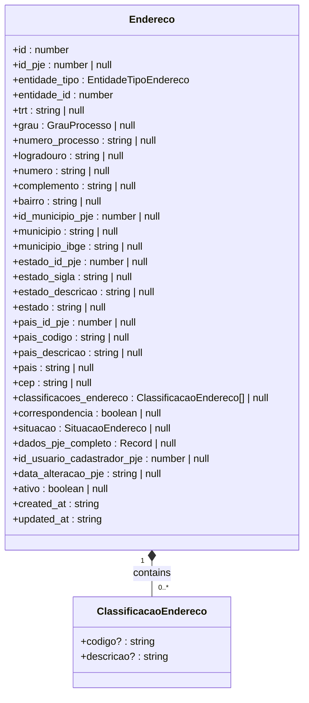

# Core Value Objects

<cite>
**Referenced Files in This Document **   
- [value-objects.ts](file://types/domain/value-objects.ts)
- [enderecos.ts](file://types/domain/enderecos.ts)
- [common.ts](file://types/domain/common.ts)
- [cpf.validator.ts](file://app/_lib/assinatura-digital/validators/cpf.validator.ts)
- [cnpj.validator.ts](file://app/_lib/assinatura-digital/validators/cnpj.validator.ts)
- [cpf.ts](file://app/_lib/assinatura-digital/formatters/cpf.ts)
- [cnpj.ts](file://app/_lib/assinatura-digital/formatters/cnpj.ts)
- [csv-parser.ts](file://backend/financeiro/conciliacao-bancaria/parsers/csv-parser.ts)
- [financeiro.types.ts](file://backend/types/financeiro/contas-pagar.types.ts)
</cite>

## Table of Contents
1. [Introduction](#introduction)
2. [CPF/CNPJ Value Objects](#cpfcnpj-value-objects)
3. [Monetary Amount Value Objects](#monetary-amount-value-objects)
4. [Address Value Objects](#address-value-objects)
5. [Implementation Considerations](#implementation-considerations)
6. [Benefits of Value Objects](#benefits-of-value-objects)

## Introduction
The Sinesys application implements a robust system of value objects to represent fundamental domain concepts that are defined by their attributes rather than identity. These value objects encapsulate business rules, ensure data integrity, and prevent invalid states throughout the application. The core value objects include CPF/CNPJ for Brazilian identification numbers, monetary amounts for financial calculations, and addresses for location data. Each value object is designed to be immutable, with built-in validation rules that guarantee only valid data can be created. This approach promotes code reuse, makes business rules explicit, and prevents invalid data states across different entities in the system.

## CPF/CNPJ Value Objects
The CPF (Individual Taxpayer Registry) and CNPJ (Corporate Taxpayer Registry) value objects in Sinesys ensure the integrity of Brazilian identification numbers through comprehensive validation and formatting rules. While the core implementation of these value objects is not found in a dedicated value-objects.ts file, the application contains robust validation and formatting utilities that serve the same purpose. The CPF validation follows the official algorithm that calculates and verifies the two check digits based on the first nine digits of the number. This validation ensures that any CPF used in the system is mathematically valid and not just a random 11-digit number. Similarly, the CNPJ validation implements the official algorithm for corporate tax IDs, which involves calculating two check digits based on the first 12 digits of the 14-digit number.

These value objects are implemented as utility functions that provide both validation and formatting capabilities. The validation functions return boolean values indicating whether a given CPF or CNPJ is valid according to the official algorithms. The formatting functions standardize the presentation of these identification numbers, applying the conventional Brazilian formatting with dots, slashes, and hyphens. This separation of concerns allows the validation logic to be used in various contexts, such as form validation and data import, while the formatting functions ensure consistent presentation across the user interface. The implementation also includes sanitization logic that removes non-numeric characters before validation, allowing users to input these numbers with or without formatting.

**Section sources**
- [cpf.validator.ts](file://app/_lib/assinatura-digital/validators/cpf.validator.ts)
- [cnpj.validator.ts](file://app/_lib/assinatura-digital/validators/cnpj.validator.ts)
- [cpf.ts](file://app/_lib/assinatura-digital/formatters/cpf.ts)
- [cnpj.ts](file://app/_lib/assinatura-digital/formatters/cnpj.ts)

## Monetary Amount Value Objects
The monetary amount value objects in Sinesys handle financial calculations with precision and support multiple currency formats, particularly focusing on the Brazilian real (R$). The implementation includes sophisticated parsing logic that can interpret various monetary formats commonly used in Brazil and internationally. This includes the Brazilian format with periods as thousand separators and commas as decimal separators (e.g., 1.234,56), as well as the international format with commas as thousand separators and periods as decimal separators (e.g., 1,234.56). The parser also handles currency symbols, parentheses for negative values, and other common variations found in financial documents.

The monetary value object implementation ensures precision in financial calculations by converting string representations to JavaScript numbers while preserving the exact decimal values. This is critical for financial applications where rounding errors can lead to significant discrepancies. The parser removes currency symbols, handles negative values indicated by minus signs or parentheses, and correctly interprets the decimal separator based on the detected format. This comprehensive parsing capability allows the system to process financial data from various sources, including bank statements, invoices, and user input, without requiring strict formatting requirements. The implementation also includes error handling for invalid monetary values, ensuring that only valid amounts are processed by the financial modules of the application.

**Section sources**
- [csv-parser.ts](file://backend/financeiro/conciliacao-bancaria/parsers/csv-parser.ts)
- [financeiro.types.ts](file://backend/types/financeiro/contas-pagar.types.ts)

## Address Value Objects
The Endereco (Address) value object in Sinesys ensures address data integrity across different entities in the system, including clients, opposing parties, and third parties. The address implementation is defined as an interface that specifies all the necessary fields for a complete address, including street, number, complement, neighborhood, municipality, state, country, and CEP (Brazilian postal code). The value object also includes metadata fields such as classification, correspondence status, situation (active, inactive, principal, or historical), and synchronization information with the PJE (Electronic Judicial Process) system.

The address value object is designed to be polymorphic, allowing it to be associated with different types of entities through the entidade_tipo field, which can be 'cliente' (client), 'parte_contraria' (opposing party), or 'terceiro' (third party). This polymorphic relationship enables the system to maintain consistent address data across different entity types while still allowing for entity-specific address management. The implementation also includes integration with external services for address validation and completion, such as the ViaCEP service for Brazilian addresses, ensuring that address data is accurate and complete. The value object's immutability and validation rules prevent invalid address states, such as missing required fields or inconsistent state-municipality combinations.

**Diagram sources **
- [enderecos.ts](file://types/domain/enderecos.ts)

**Section sources**
- [enderecos.ts](file://types/domain/enderecos.ts)
- [common.ts](file://types/domain/common.ts)

## Implementation Considerations
The implementation of value objects in Sinesys addresses several important considerations related to equality comparison, serialization, and performance. For equality comparison, the value objects use value-based equality rather than reference equality, meaning that two value objects are considered equal if they have the same attribute values, regardless of whether they are the same instance in memory. This is particularly important for value objects like CPF/CNPJ and monetary amounts, where the actual value is what matters, not the object identity. The implementation includes explicit equals methods that compare the underlying values to determine equality.

For serialization, the value objects are designed to be easily converted to and from JSON format, which is essential for transmitting data between the frontend and backend. The toString method provides a string representation of the value object that can be used in APIs and database storage, while the static criar (create) method allows for deserialization from string representations. This ensures that value objects can be seamlessly integrated into the application's data flow without losing their integrity or validation rules.

Performance considerations include the immutability of value objects, which allows them to be safely shared across different parts of the application without the risk of unintended modifications. However, this also means that operations that modify a value object must create a new instance, which can have performance implications in high-frequency operations. The implementation mitigates this by using efficient algorithms for validation and formatting, and by caching frequently used value objects when appropriate. The separation of validation and formatting logic into utility functions also allows for optimized performance in different contexts, such as batch processing of financial data or real-time form validation.

**Section sources**
- [value-objects.ts](file://types/domain/value-objects.ts)
- [cpf.validator.ts](file://app/_lib/assinatura-digital/validators/cpf.validator.ts)
- [cnpj.validator.ts](file://app/_lib/assinatura-digital/validators/cnpj.validator.ts)

## Benefits of Value Objects
The use of value objects in Sinesys provides significant benefits in terms of preventing invalid data states, promoting code reuse, and making business rules explicit. By encapsulating validation rules within the value objects themselves, the system ensures that invalid data cannot be created, which prevents a wide range of potential errors and inconsistencies. For example, a CPF value object cannot be instantiated with an invalid CPF number, which eliminates the possibility of storing or processing incorrect identification numbers. This proactive approach to data integrity reduces the need for defensive programming throughout the application and improves overall reliability.

Code reuse is enhanced by the centralized implementation of validation and formatting logic in the value objects. Instead of duplicating CPF validation code in multiple places, the application can use the same validation function wherever a CPF needs to be validated. This not only reduces code duplication but also ensures consistency in how CPFs are validated across the entire system. When business rules change, such as updates to the CNPJ validation algorithm, the changes only need to be made in one place, reducing maintenance effort and the risk of inconsistencies.

Making business rules explicit is perhaps the most significant benefit of value objects. By encapsulating domain knowledge such as the CPF validation algorithm or the formatting rules for monetary amounts, the value objects serve as living documentation of the business rules. Developers can understand the requirements for valid data by examining the value object implementations, rather than having to search through scattered validation code. This clarity improves maintainability and makes it easier for new team members to understand the system. The value objects also provide a clear contract for how data should be handled, which facilitates communication between team members and reduces the likelihood of misunderstandings about data requirements.

**Section sources**
- [value-objects.ts](file://types/domain/value-objects.ts)
- [cpf.validator.ts](file://app/_lib/assinatura-digital/validators/cpf.validator.ts)
- [cnpj.validator.ts](file://app/_lib/assinatura-digital/validators/cnpj.validator.ts)
- [csv-parser.ts](file://backend/financeiro/conciliacao-bancaria/parsers/csv-parser.ts)
- [enderecos.ts](file://types/domain/enderecos.ts)