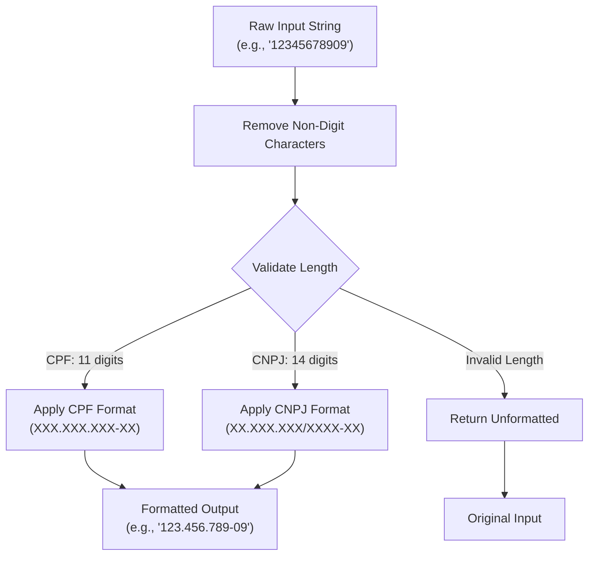
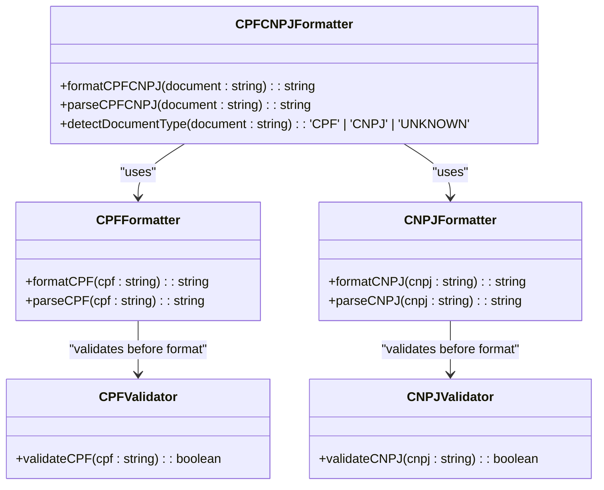
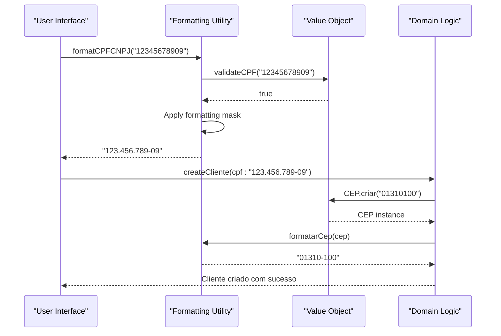
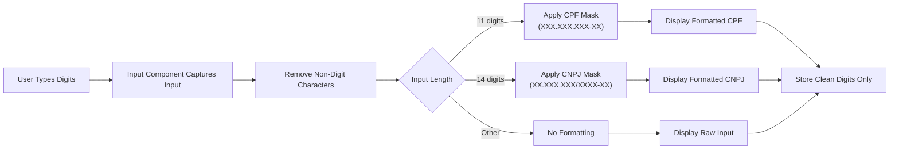

# Formatting Utilities

<cite>
**Referenced Files in This Document**   
- [cpf.ts](file://app/_lib/assinatura-digital/formatters/cpf.ts)
- [cnpj.ts](file://app/_lib/assinatura-digital/formatters/cnpj.ts)
- [cpfCnpj.ts](file://app/_lib/assinatura-digital/formatters/cpfCnpj.ts)
- [cpf.validator.ts](file://app/_lib/assinatura-digital/validators/cpf.validator.ts)
- [cnpj.validator.ts](file://app/_lib/assinatura-digital/validators/cnpj.validator.ts)
- [format-clientes.ts](file://app/_lib/utils/format-clientes.ts)
- [value-objects.ts](file://types/domain/value-objects.ts)
- [input-cpf.tsx](file://components/assinatura-digital/inputs/input-cpf.tsx)
- [input-cpf-cnpj.tsx](file://components/assinatura-digital/inputs/input-cpf-cnpj.tsx)
</cite>

## Table of Contents
1. [Introduction](#introduction)
2. [CPF/CNPJ Formatting Implementation](#cpfcnpj-formatting-implementation)
3. [Formatting Architecture](#formatting-architecture)
4. [Integration with Value Objects](#integration-with-value-objects)
5. [User Interface Integration](#user-interface-integration)
6. [Data Export Usage](#data-export-usage)
7. [Benefits of Standardized Formatting](#benefits-of-standardized-formatting)
8. [Implementation Considerations](#implementation-considerations)
9. [Conclusion](#conclusion)

## Introduction
The Sinesys application implements a comprehensive formatting system for Brazilian tax identification numbers (CPF for individuals and CNPJ for companies). This documentation details the formatting utilities used across the application, focusing on how CPF/CNPJ values are standardized into consistent display formats (XXX.XXX.XXX-XX for CPF and XX.XXX.XXX/XXXX-XX for CNPJ). The formatting system is designed to ensure data consistency, improve user experience, and maintain compliance with Brazilian standards across all application interfaces and data exports.

**Section sources**
- [cpf.ts](file://app/_lib/assinatura-digital/formatters/cpf.ts#L1-L17)
- [cnpj.ts](file://app/_lib/assinatura-digital/formatters/cnpj.ts#L1-L17)

## CPF/CNPJ Formatting Implementation
The CPF/CNPJ formatting system in Sinesys consists of dedicated formatter functions that standardize Brazilian tax identification numbers into their conventional display formats. The implementation follows a consistent pattern across both CPF and CNPJ formatting utilities.

For CPF formatting, the `formatCPF` function takes a raw string input and applies the standard Brazilian CPF format (XXX.XXX.XXX-XX). It first removes all non-digit characters from the input, then applies a regular expression to insert the appropriate formatting characters. The function only applies formatting if the cleaned input contains exactly 11 digits, which is the required length for a valid CPF.

Similarly, the `formatCNPJ` function handles company tax IDs, applying the standard CNPJ format (XX.XXX.XXX/XXXX-XX). It follows the same cleaning process by removing non-digit characters, then applies formatting only if the resulting string contains exactly 14 digits, which is the required length for a valid CNPJ.

Both formatters are accompanied by corresponding parser functions (`parseCPF` and `parseCNPJ`) that strip all formatting characters and return only the raw numeric digits. This bidirectional capability allows the system to seamlessly convert between display format and storage format as needed.

**Diagram sources**
- [cpf.ts](file://app/_lib/assinatura-digital/formatters/cpf.ts#L2-L12)
- [cnpj.ts](file://app/_lib/assinatura-digital/formatters/cnpj.ts#L2-L12)

**Section sources**
- [cpf.ts](file://app/_lib/assinatura-digital/formatters/cpf.ts#L1-L17)
- [cnpj.ts](file://app/_lib/assinatura-digital/formatters/cnpj.ts#L1-L17)

## Formatting Architecture
The formatting architecture in Sinesys is designed with modularity and reusability in mind. The system employs a layered approach where formatting utilities are separated from validation logic, allowing for independent maintenance and testing of each concern.

At the core of the architecture are the formatter modules located in the `app/_lib/assinatura-digital/formatters/` directory. These modules export pure functions that are stateless and deterministic, ensuring consistent behavior across the application. The architecture follows the principle of separation of concerns by keeping formatting logic distinct from validation and parsing operations.

A key component of the architecture is the `cpfCnpj.ts` utility, which provides dynamic formatting capabilities. This module imports both the CPF and CNPJ formatters and exports a `formatCPFCNPJ` function that automatically detects whether an input string represents a CPF or CNPJ based on its length after cleaning. Inputs with 11 or fewer digits are treated as CPFs, while longer inputs are treated as CNPJs. This intelligent detection allows the system to handle mixed document types without requiring the calling code to specify the document type.

The architecture also includes a comprehensive validation layer implemented in the `validators/` directory. The `validateCPF` and `validateCNPJ` functions implement the official Brazilian algorithms for verifying the authenticity of tax identification numbers by checking their verification digits. These validation functions are used in conjunction with the formatters to ensure that only valid numbers are displayed in the standardized format.

**Diagram sources**
- [cpf.ts](file://app/_lib/assinatura-digital/formatters/cpf.ts#L1-L17)
- [cnpj.ts](file://app/_lib/assinatura-digital/formatters/cnpj.ts#L1-L17)
- [cpfCnpj.ts](file://app/_lib/assinatura-digital/formatters/cpfCnpj.ts#L1-L28)
- [cpf.validator.ts](file://app/_lib/assinatura-digital/validators/cpf.validator.ts#L1-L34)
- [cnpj.validator.ts](file://app/_lib/assinatura-digital/validators/cnpj.validator.ts#L1-L43)

**Section sources**
- [cpf.ts](file://app/_lib/assinatura-digital/formatters/cpf.ts#L1-L17)
- [cnpj.ts](file://app/_lib/assinatura-digital/formatters/cnpj.ts#L1-L17)
- [cpfCnpj.ts](file://app/_lib/assinatura-digital/formatters/cpfCnpj.ts#L1-L28)

## Integration with Value Objects
The formatting utilities are tightly integrated with the application's value object system, which ensures domain invariants are maintained throughout the application. The value objects, defined in `types/domain/value-objects.ts`, represent domain concepts with built-in validation rules that prevent invalid states.

For example, the `CEP` value object represents a Brazilian postal code and includes validation to ensure it contains exactly 8 digits. The value object provides a `formatar()` method that returns the CEP in the standard format (XXXXX-XXX), demonstrating the same formatting pattern used for CPF/CNPJ. This consistent approach across different value types creates a uniform API for handling formatted data.

The value object pattern complements the formatting utilities by enforcing data integrity at the domain level. While the formatting utilities handle presentation concerns, the value objects ensure that only valid data can be created in the first place. This separation of concerns allows the formatting system to focus on presentation while relying on the value objects to guarantee data correctness.

When a value object is created, it validates the input data according to domain rules. Once validated, the formatting utilities can be safely applied to produce the appropriate display format. This two-step process (validation followed by formatting) ensures that the application never displays incorrectly formatted invalid data.

**Diagram sources**
- [value-objects.ts](file://types/domain/value-objects.ts#L1-L243)
- [cpf.validator.ts](file://app/_lib/assinatura-digital/validators/cpf.validator.ts#L1-L34)

**Section sources**
- [value-objects.ts](file://types/domain/value-objects.ts#L1-L243)
- [cpf.validator.ts](file://app/_lib/assinatura-digital/validators/cpf.validator.ts#L1-L34)

## User Interface Integration
The formatting utilities are extensively used throughout the user interface to ensure consistent presentation of tax identification numbers. The system employs input components that automatically format CPF/CNPJ values as users type, providing immediate visual feedback and reducing input errors.

The input components, such as `input-cpf.tsx` and `input-cpf-cnpj.tsx`, integrate the formatting utilities to provide real-time formatting. As users enter digits, the components apply the appropriate formatting mask, inserting dots, slashes, and hyphens at the correct positions. This interactive formatting helps users verify they are entering the correct number of digits and provides a familiar visual pattern that matches official documents.

In display contexts, such as tables and detail views, the formatting utilities ensure that CPF/CNPJ values are consistently presented in their standardized formats. The `format-clientes.ts` utility, for example, includes functions like `formatarCpf` and `formatarCnpj` that are used to format customer information throughout the application. These functions handle edge cases such as null or undefined values by returning a standardized placeholder ('-'), ensuring a consistent user experience even when data is missing.

The UI integration also includes error handling and validation feedback. When a user enters an invalid CPF/CNPJ, the system uses the validation utilities to detect the error and provide appropriate feedback. This combination of formatting and validation creates a robust user experience that guides users toward correct data entry while maintaining data integrity.

**Diagram sources**
- [input-cpf.tsx](file://components/assinatura-digital/inputs/input-cpf.tsx#L1-L50)
- [input-cpf-cnpj.tsx](file://components/assinatura-digital/inputs/input-cpf-cnpj.tsx#L1-L50)
- [format-clientes.ts](file://app/_lib/utils/format-clientes.ts#L1-L143)

**Section sources**
- [input-cpf.tsx](file://components/assinatura-digital/inputs/input-cpf.tsx#L1-L50)
- [input-cpf-cnpj.tsx](file://components/assinatura-digital/inputs/input-cpf-cnpj.tsx#L1-L50)
- [format-clientes.ts](file://app/_lib/utils/format-clientes.ts#L1-L143)

## Data Export Usage
The formatting utilities play a crucial role in data export functionality, ensuring that tax identification numbers are presented in standardized formats across all exported documents and reports. When generating CSV files, PDF reports, or other export formats, the system applies the same formatting rules used in the user interface to maintain consistency.

For example, when exporting client lists or financial reports, the system uses the `formatarCpf` and `formatarCnpj` functions from the `format-clientes.ts` utility to ensure all tax IDs appear in their conventional formats. This consistency is particularly important for legal and compliance purposes, as properly formatted tax IDs are required for official documentation.

The export system also leverages the parsing capabilities of the formatting utilities to ensure data integrity. Before exporting, the system may parse formatted values back to their raw numeric form for validation or processing, then re-apply formatting for the final output. This round-trip capability ensures that the exported data remains accurate while being presented in a user-friendly format.

In addition to CPF/CNPJ formatting, the export system uses related formatting utilities for other data types such as phone numbers, postal codes, and dates. This comprehensive approach to formatting ensures that all exported data adheres to Brazilian standards and conventions, making it immediately usable by recipients without requiring additional processing.

**Section sources**
- [format-clientes.ts](file://app/_lib/utils/format-clientes.ts#L1-L143)

## Benefits of Standardized Formatting
Standardized formatting of CPF/CNPJ values provides several significant benefits to the Sinesys application and its users. The most immediate benefit is improved user experience, as users can quickly recognize and verify tax identification numbers in their familiar, standardized formats. This recognition reduces cognitive load and minimizes errors when comparing values across different parts of the application.

Data consistency is another major benefit. By applying the same formatting rules throughout the application, Sinesys ensures that tax IDs appear identically in all contexts, from data entry forms to reports and exports. This consistency eliminates confusion that might arise from seeing the same number in different formats in different parts of the system.

The standardized formatting also enhances data quality by making validation errors more apparent. When a CPF/CNPJ appears without the expected formatting characters, it immediately signals to users that there may be an issue with the data. This visual cue helps users identify and correct errors more quickly than if they had to count digits or perform other manual checks.

From a compliance perspective, standardized formatting ensures that all exported documents and reports meet Brazilian regulatory requirements for the presentation of tax identification numbers. This is particularly important for legal documents, financial reports, and other official communications where proper formatting is mandatory.

Finally, the modular design of the formatting system improves maintainability and reduces development time. By centralizing formatting logic in dedicated utilities, the application avoids code duplication and makes it easy to update formatting rules across the entire system when requirements change.

## Implementation Considerations
Several important considerations were addressed in the implementation of the formatting utilities. Performance is a key consideration, as formatting operations occur frequently throughout the application. The formatting functions are designed to be lightweight and efficient, using simple regular expressions and string operations that have minimal impact on application performance.

Internationalization support is another consideration, though the current implementation focuses specifically on Brazilian formatting standards. The architecture allows for potential expansion to support other countries' tax ID formats by following the same pattern of dedicated formatter modules for each country's requirements.

The system handles edge cases gracefully, such as null or undefined inputs, by returning standardized placeholders rather than throwing errors. This approach ensures that the user interface remains stable even when data is missing or incomplete. The formatters also handle partially entered values by only applying formatting when the input meets the required length, preventing premature formatting that could confuse users.

Integration with input masking components is seamless, as the formatting utilities are designed to work with both real-time input formatting and post-processing of complete values. The separation between cleaning, validation, and formatting operations allows the system to apply these steps independently as needed for different use cases.

Security considerations include ensuring that formatting operations cannot be exploited for code injection or other attacks. The use of regular expressions that only match digits and the removal of all non-numeric characters during the cleaning phase mitigate these risks. Additionally, the formatting utilities operate on strings rather than directly manipulating DOM elements, reducing the attack surface.

**Section sources**
- [cpf.ts](file://app/_lib/assinatura-digital/formatters/cpf.ts#L1-L17)
- [cnpj.ts](file://app/_lib/assinatura-digital/formatters/cnpj.ts#L1-L17)
- [cpf.validator.ts](file://app/_lib/assinatura-digital/validators/cpf.validator.ts#L1-L34)

## Conclusion
The formatting utilities in Sinesys provide a robust and consistent system for handling CPF/CNPJ values across the application. By implementing dedicated formatter modules, integrating with value objects for data integrity, and providing seamless UI integration, the system ensures that tax identification numbers are always presented in standardized formats. This approach improves user experience, enhances data quality, and supports compliance with Brazilian standards. The modular architecture allows for easy maintenance and potential expansion to support additional formatting requirements in the future.