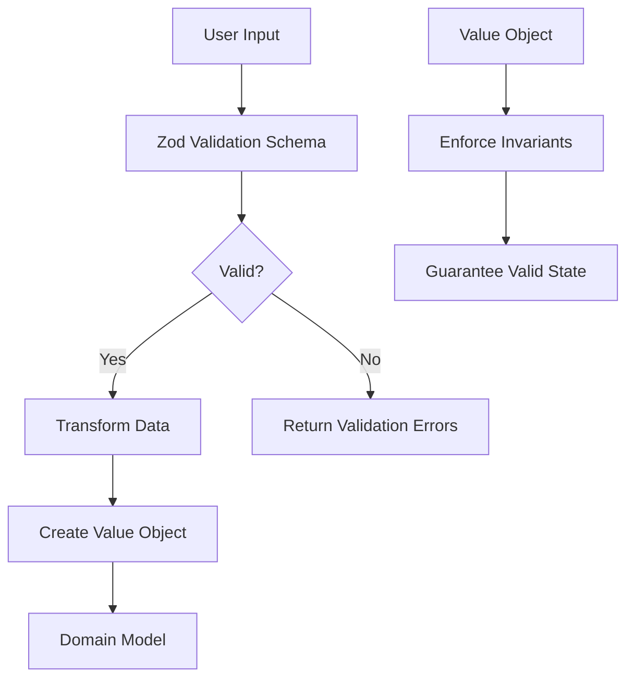
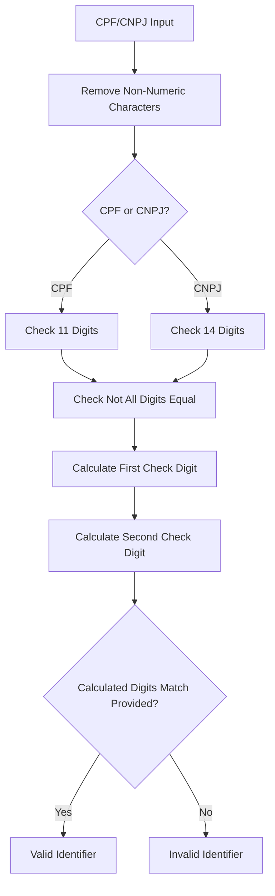
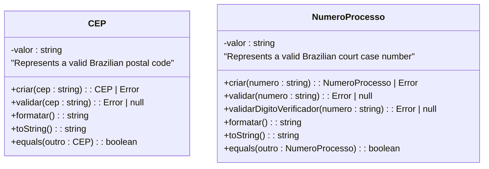
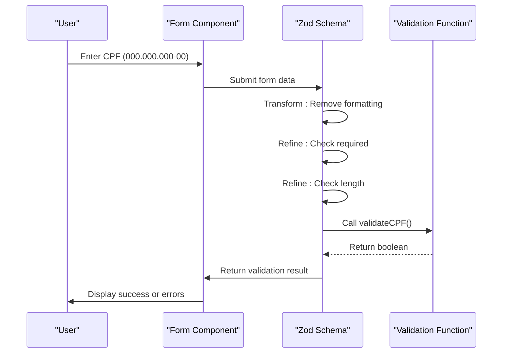

# Validation Patterns

<cite>
**Referenced Files in This Document**   
- [value-objects.ts](file://types/domain/value-objects.ts)
- [verificarCPF.schema.ts](file://lib/assinatura-digital/validations/verificarCPF.schema.ts)
- [cpf.validator.ts](file://app/_lib/assinatura-digital/validators/cpf.validator.ts)
- [cnpj.validator.ts](file://app/_lib/assinatura-digital/validators/cnpj.validator.ts)
- [dadosPessoais.schema.ts](file://lib/assinatura-digital/validations/dadosPessoais.schema.ts)
- [cpf.ts](file://app/_lib/assinatura-digital/formatters/cpf.ts)
- [cnpj.ts](file://app/_lib/assinatura-digital/formatters/cnpj.ts)
</cite>

## Table of Contents
1. [Introduction](#introduction)
2. [Validation Architecture](#validation-architecture)
3. [CPF/CNPJ Validation Logic](#cpfcnpj-validation-logic)
4. [Value Object Implementation](#value-object-implementation)
5. [Integration with Form Validation](#integration-with-form-validation)
6. [Error Handling and Invalid State Prevention](#error-handling-and-invalid-state-prevention)
7. [Benefits of Centralized Validation](#benefits-of-centralized-validation)
8. [Implementation Considerations](#implementation-considerations)
9. [Conclusion](#conclusion)

## Introduction
The Sinesys application implements a robust validation system centered around value objects and schema-based validation to ensure data integrity, particularly for Brazilian tax identifiers like CPF (individual taxpayer registry) and CNPJ (corporate taxpayer registry). This document details the validation patterns used throughout the codebase, focusing on how CPF/CNPJ validation is implemented through checksum algorithms and format rules. The system encapsulates validation logic within value objects and validation schemas, preventing invalid states from being created while providing clear error messages for user feedback.

**Section sources**
- [value-objects.ts](file://types/domain/value-objects.ts#L1-L7)

## Validation Architecture
The validation architecture in Sinesys follows a layered approach that combines domain-driven design principles with modern validation libraries. At its core, the system uses value objects to enforce business rules and invariants at the domain level, while leveraging Zod for form-level validation. This dual-layer approach ensures that data integrity is maintained both at the user interface level and within the domain model.

The architecture consists of three main components:
1. **Value Objects**: Immutable objects that encapsulate domain concepts with built-in validation
2. **Validation Schemas**: Zod schemas used for form validation and data transformation
3. **Validator Functions**: Pure functions that implement specific validation algorithms

This separation of concerns allows for reusable validation logic that can be applied consistently across different parts of the application. The value objects serve as the single source of truth for domain rules, while the validation schemas provide a flexible way to handle user input with appropriate error messaging.

**Diagram sources**
- [value-objects.ts](file://types/domain/value-objects.ts#L1-L243)
- [verificarCPF.schema.ts](file://lib/assinatura-digital/validations/verificarCPF.schema.ts#L1-L30)

**Section sources**
- [value-objects.ts](file://types/domain/value-objects.ts#L1-L243)
- [verificarCPF.schema.ts](file://lib/assinatura-digital/validations/verificarCPF.schema.ts#L1-L30)

## CPF/CNPJ Validation Logic
The CPF/CNPJ validation logic in Sinesys implements the official Brazilian government algorithms for verifying tax identifiers. These algorithms use checksum calculations to validate the authenticity of CPF and CNPJ numbers, ensuring that only valid tax IDs can be processed by the system.

### CPF Validation Algorithm
The CPF validation algorithm follows these steps:
1. Remove all non-numeric characters from the input
2. Verify that exactly 11 digits remain
3. Check that not all digits are identical (a common invalid pattern)
4. Calculate the first check digit using a weighted sum algorithm
5. Calculate the second check digit using a modified weighted sum
6. Compare the calculated check digits with the provided ones

The algorithm uses a weighted sum approach where each digit is multiplied by a decreasing weight (from 10 to 2 for the first check digit, and from 11 to 2 for the second). The remainder of the sum divided by 11 determines the check digit, with special handling for remainders of 10 or 11 (which become 0).

### CNPJ Validation Algorithm
The CNPJ validation algorithm follows a similar but more complex process:
1. Remove all non-numeric characters from the input
2. Verify that exactly 14 digits remain
3. Check that not all digits are identical
4. Calculate the first check digit using a weighted sum with a rotating weight pattern (2-9)
5. Calculate the second check digit using an updated weighted sum
6. Compare the calculated check digits with the provided ones

The CNPJ algorithm uses a rotating weight pattern that cycles from 2 to 9, providing additional protection against digit transposition errors. This makes the CNPJ validation more robust than CPF validation, reflecting the higher complexity of corporate tax identifiers.

**Diagram sources**
- [cpf.validator.ts](file://app/_lib/assinatura-digital/validators/cpf.validator.ts#L1-L34)
- [cnpj.validator.ts](file://app/_lib/assinatura-digital/validators/cnpj.validator.ts#L1-L43)

**Section sources**
- [cpf.validator.ts](file://app/_lib/assinatura-digital/validators/cpf.validator.ts#L1-L34)
- [cnpj.validator.ts](file://app/_lib/assinatura-digital/validators/cnpj.validator.ts#L1-L43)

## Value Object Implementation
The value object implementation in Sinesys follows domain-driven design principles to ensure that invalid states cannot be represented in the system. Value objects are immutable and encapsulate both data and behavior, with validation logic built into their construction process.

The `CEP` value object serves as a prime example of this pattern. It represents a Brazilian postal code and ensures that only valid CEPs can be created. The implementation includes:

- A private constructor to prevent direct instantiation
- A static `criar` (create) method that handles normalization and validation
- A static `validar` method that checks format rules
- Methods for formatting and string representation
- An `equals` method for value-based comparison

When creating a new `CEP` instance, the client code must use the static `criar` method, which returns either a valid `CEP` object or an `Error` if validation fails. This approach guarantees that any `CEP` instance in the system is valid by construction, eliminating the need for repeated validation checks throughout the codebase.

The value object pattern provides several benefits:
- **Immutability**: Once created, the value cannot change, preventing accidental modification
- **Encapsulation**: Validation logic is contained within the object, reducing code duplication
- **Type Safety**: The object type clearly communicates its purpose and constraints
- **Domain Clarity**: Business rules are expressed directly in the code structure

**Diagram sources**
- [value-objects.ts](file://types/domain/value-objects.ts#L15-L93)

**Section sources**
- [value-objects.ts](file://types/domain/value-objects.ts#L1-L93)

## Integration with Form Validation
The validation system integrates seamlessly with form validation through Zod schemas, providing a consistent user experience across the application. The `verificarCPFSchema` and `dadosPessoaisSchema` demonstrate how domain validation logic is composed into form-level validation rules.

The integration pattern follows these principles:
1. **Schema Composition**: Reuse domain validation functions within Zod schemas
2. **Data Transformation**: Normalize input data before validation
3. **Error Messaging**: Provide clear, user-friendly error messages
4. **Progressive Validation**: Apply validation rules in a logical sequence

For example, the `verificarCPFSchema` applies three refinement rules to CPF input:
1. Check that the field is not empty
2. Verify that the cleaned CPF has exactly 11 digits
3. Validate the CPF using the checksum algorithm

Each refinement includes a specific error message that helps users understand what went wrong. The schema also uses Zod's transform functionality to normalize the input by removing non-numeric characters before validation, improving the user experience by accepting formatted input.

The `dadosPessoaisSchema` extends this pattern to a complete personal information form, incorporating CPF validation alongside other fields like name, date of birth, and contact information. This demonstrates how multiple validation rules can be composed into a comprehensive form validation strategy.

**Diagram sources**
- [verificarCPF.schema.ts](file://lib/assinatura-digital/validations/verificarCPF.schema.ts#L1-L30)
- [dadosPessoais.schema.ts](file://lib/assinatura-digital/validations/dadosPessoais.schema.ts#L1-L136)

**Section sources**
- [verificarCPF.schema.ts](file://lib/assinatura-digital/validations/verificarCPF.schema.ts#L1-L30)
- [dadosPessoais.schema.ts](file://lib/assinatura-digital/validations/dadosPessoais.schema.ts#L1-L136)

## Error Handling and Invalid State Prevention
The validation system in Sinesys employs a proactive approach to error handling and invalid state prevention. Rather than allowing invalid data to enter the system and then attempting to handle the consequences, the architecture is designed to prevent invalid states from being created in the first place.

This is achieved through several mechanisms:
1. **Fail-Fast Validation**: Validation occurs as early as possible in the data processing pipeline
2. **Immutable Value Objects**: Once created, value objects cannot be modified, preventing corruption
3. **Result Types**: Functions return either a valid object or an error, making error handling explicit
4. **Comprehensive Error Messages**: Errors include specific information about what went wrong

The value object pattern is particularly effective at preventing invalid states. Since value objects can only be created through their static factory methods, and these methods return an error for invalid input, it's impossible to have an invalid value object in the system. This eliminates entire categories of bugs related to invalid data.

For form validation, the system uses Zod's refinement and transformation capabilities to provide immediate feedback to users. When validation fails, the system returns specific error messages that guide users toward correcting their input. This user-centric approach reduces frustration and improves data quality.

The combination of domain-level and form-level validation creates a robust defense against invalid data. Even if form validation is bypassed (e.g., through API calls), the domain validation in value objects provides a final line of defense, ensuring data integrity at all levels of the application.

**Section sources**
- [value-objects.ts](file://types/domain/value-objects.ts#L1-L243)
- [verificarCPF.schema.ts](file://lib/assinatura-digital/validations/verificarCPF.schema.ts#L1-L30)

## Benefits of Centralized Validation
Centralizing validation logic in Sinesys provides numerous benefits for data integrity, code maintainability, and user experience:

1. **Consistency**: Validation rules are applied uniformly across the application, eliminating discrepancies between different components
2. **Maintainability**: Changes to validation rules only need to be made in one place, reducing the risk of bugs and inconsistencies
3. **Reusability**: Validation logic can be easily shared between different parts of the application
4. **Testability**: Centralized validation functions are easier to test thoroughly
5. **Documentation**: Validation rules serve as living documentation of business requirements

The separation between value objects and validation schemas also provides flexibility. Value objects represent the core business rules that must always be enforced, while validation schemas can be tailored to specific user interfaces or use cases. This allows for different error messages or validation sequences without compromising the underlying business rules.

Centralized validation also improves security by ensuring that all data entering the system is properly validated. This reduces the attack surface for injection attacks and other security vulnerabilities that exploit invalid data handling.

Finally, the approach supports better collaboration between developers, designers, and business stakeholders. The clear separation of concerns makes it easier to discuss and refine validation requirements, with the code serving as an executable specification of business rules.

**Section sources**
- [value-objects.ts](file://types/domain/value-objects.ts#L1-L243)
- [verificarCPF.schema.ts](file://lib/assinatura-digital/validations/verificarCPF.schema.ts#L1-L30)
- [dadosPessoais.schema.ts](file://lib/assinatura-digital/validations/dadosPessoais.schema.ts#L1-L136)

## Implementation Considerations
When implementing the validation patterns in Sinesys, several considerations were taken into account to ensure optimal performance and usability:

1. **Performance Optimization**: The validation functions are designed to be lightweight and efficient, with minimal computational overhead. The algorithms use simple arithmetic operations and regular expressions, avoiding expensive operations like database queries or network requests.

2. **Input Flexibility**: The system accepts formatted input (e.g., CPF with dots and dashes) and normalizes it internally, improving the user experience while maintaining data integrity.

3. **Error Recovery**: The validation system provides clear error messages that help users understand and correct their mistakes, reducing frustration and support requests.

4. **Extensibility**: The architecture allows for easy addition of new validation rules or value objects without disrupting existing functionality.

5. **Type Safety**: The use of TypeScript and Zod provides compile-time and runtime type checking, catching errors early in the development process.

6. **Testing**: The pure functions used for validation are easy to test in isolation, ensuring high test coverage and reliability.

7. **Internationalization**: While the current implementation focuses on Brazilian identifiers, the pattern can be extended to support other countries' tax systems with minimal changes.

8. **Accessibility**: Error messages are designed to be clear and actionable, supporting users with varying levels of technical expertise.

These considerations ensure that the validation system not only protects data integrity but also provides a positive user experience and supports long-term maintainability of the codebase.

**Section sources**
- [cpf.validator.ts](file://app/_lib/assinatura-digital/validators/cpf.validator.ts#L1-L34)
- [cnpj.validator.ts](file://app/_lib/assinatura-digital/validators/cnpj.validator.ts#L1-L43)
- [cpf.ts](file://app/_lib/assinatura-digital/formatters/cpf.ts#L1-L17)
- [cnpj.ts](file://app/_lib/assinatura-digital/formatters/cnpj.ts#L1-L17)

## Conclusion
The validation patterns implemented in Sinesys provide a robust foundation for ensuring data integrity, particularly for critical identifiers like CPF and CNPJ. By combining domain-driven design principles with modern validation libraries, the system creates a defense-in-depth approach to data quality that prevents invalid states from being created while providing a positive user experience.

The use of value objects as the foundation of the validation architecture ensures that business rules are enforced at the domain level, creating a single source of truth for data integrity. This is complemented by form-level validation schemas that provide user-friendly error handling and input normalization.

The CPF/CNPJ validation logic implements the official Brazilian government algorithms with high accuracy, protecting against common data entry errors and fraudulent inputs. The centralized nature of the validation system ensures consistency across the application while improving maintainability and testability.

Overall, the validation patterns in Sinesys demonstrate how careful architectural choices can create a system that is both robust and user-friendly, balancing the need for data integrity with the realities of user interaction.